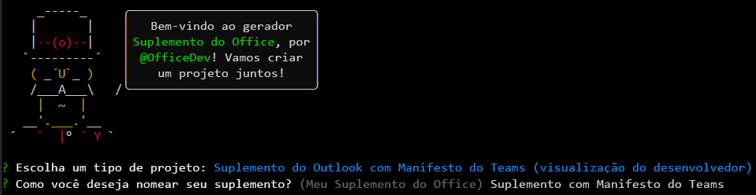

# <a name="build-an-outlook-add-in-with-a-teams-manifest-preview"></a>Criar um suplemento do Outlook com um manifesto do Teams (versão prévia)

Neste artigo, você passará pelo processo de criação de um suplemento do painel de tarefas do Outlook que exibe uma propriedade de uma mensagem selecionada, aciona uma notificação no painel de leitura e insere texto em uma mensagem no painel de redação. Esse suplemento usará uma versão prévia do manifesto formatado em JSON que as extensões do Teams, como guias personalizadas e extensões de mensagens, usam. Para obter mais informações sobre esse manifesto, confira [Manifesto do Teams para Suplementos do Office (versão prévia)](../develop/json-manifest-overview.md).

> [!NOTE]
> O novo manifesto está disponível para pré-visualização e está sujeito a alterações com base nos comentários. Incentivamos os desenvolvedores de suplementos experientes a experimentá-lo. O manifesto de visualização não deve ser usado em suplementos de produção.

A visualização só tem suporte no Office baixado de uma assinatura do Microsoft 365 e instalado no Windows.

> [!TIP]
> Se você quiser criar um suplemento do Outlook usando o manifesto XML, confira [Compilar seu primeiro suplemento do Outlook](outlook-quickstart.md).

## <a name="create-the-add-in"></a>Criar o suplemento

Você pode criar um Suplemento do Office com um manifesto JSON usando o [gerador Yeoman para Suplementos do Office](../develop/yeoman-generator-overview.md). O gerador Yeoman cria um projeto Node.js que pode ser gerenciado com o Visual Studio Code ou qualquer outro editor.

### <a name="prerequisites"></a>Pré-requisitos

[!include[Set up requirements](../includes/set-up-dev-environment-beforehand.md)]

- [Runtime .NET](https://dotnet.microsoft.com/download/dotnet/6.0/runtime) para Windows. Uma das ferramentas usadas na pré-visualização é executada no .NET.

[!INCLUDE [Yeoman generator prerequisites](../includes/quickstart-yo-prerequisites.md)]

- [Visual Studio Code (VS Code)](https://code.visualstudio.com/) ou seu editor de código preferido

- Outlook no Windows (conectado a uma conta Microsoft 365)

### <a name="create-the-add-in-project"></a>Criar o projeto do suplemento

1. [!include[Yeoman generator create project guidance](../includes/yo-office-command-guidance.md)]

    - **Escolha o tipo de projeto** - `Outlook Add-in with Teams Manifest (Developer preview)`

    - **Qual será o nome do suplemento?** - `Add-in with Teams Manifest`

     

    > [!NOTE]
    > Para esta pré-visualização, o nome do suplemento não pode ter mais de 30 caracteres. 
    
    Depois que você concluir o assistente, o gerador criará o projeto e instalará os componentes Node de suporte.

    [!include[Yeoman generator next steps](../includes/yo-office-next-steps.md)]

1. Navegue até a pasta raiz do projeto do aplicativo Web.

    ```command&nbsp;line
    cd "Add-in with Teams Manifest"
    ```

### <a name="explore-the-project"></a>Explore o projeto

O projeto de suplemento que você criou com o gerador do Yeoman contém um exemplo de código para um suplemento de painel de tarefas bem básico.

- O arquivo **./manifest/manifest.json** no diretório raiz do projeto define as configurações e os recursos do suplemento.
- O arquivo **./src/taskpane/taskpane.html** contém a marcação HTML do painel de tarefas.
- O arquivo **./src/taskpane/taskpane.css** contém o CSS que é aplicado ao conteúdo no painel de tarefas.
- O arquivo **./src/taskpane/taskpane.ts** contém o código que chama a biblioteca JavaScript do Office que facilita a interação entre o painel de tarefas e o Outlook.
- O arquivo **./src/command/command.html** será editado pelo WebPack no momento da compilação para inserir uma marca HTML `<script>` que carrega o arquivo JavaScript que é transcompilado do arquivo command.ts.
- O arquivo **./src/command/command.ts** tem pouco código no início. Mais adiante neste artigo, você adicionará mais código que chama a biblioteca JavaScript do Office e que é executado quando um botão personalizado da faixa de opções é selecionado.

### <a name="update-the-code"></a>Atualizar o código

1. Abra o projeto no VS Code ou no seu editor de código preferido.

    > [!TIP]
    > No Windows, navegue até o diretório raiz do projeto por meio da linha de comando e, em seguida, insira `code .` para abrir essa pasta no VS Code. 

1. Abra o arquivo **./src/taskpane/taskpane.html** e substitua todo o elemento **\<main\>** (dentro do elemento **\<body\>**) pela marcação a seguir. A próxima marcação adiciona uma etiqueta onde o script no **./src/taskpane/taskpane.ts** gravará os dados.

    ```html
    <main id="app-body" class="ms-welcome__main" style="display: none;">
        <h2 class="ms-font-xl"> Discover what Office Add-ins can do for you today! </h2>
        <p><label id="item-subject"></label></p>
        <div role="button" id="run" class="ms-welcome__action ms-Button ms-Button--hero ms-font-xl">
            <span class="ms-Button-label">Run</span>
        </div>
    </main>
    ```

1. No seu editor de código, abra o arquivo **./src/taskpane/taskpane.ts** e adicione o seguinte código dentro da função **executar**. Este código usa a API JavaScript do Office para obter uma referência da mensagem atual e gravar o seu valor de propriedade **subject** no painel de tarefas.

    ```typescript
    // Get a reference to the current message.
    let item = Office.context.mailbox.item;

    // Write a message property value to the task pane.
    document.getElementById("item-subject").innerHTML = "<b>Subject:</b> <br/>" + item.subject;
    ```

### <a name="try-it-out"></a>Experimente

[!INCLUDE [alert use https](../includes/alert-use-https.md)]

1. Execute o seguinte comando no diretório raiz do seu projeto. Ao executar esse comando, o servidor Web local será iniciado e seu complemento será [sideload](../outlook/sideload-outlook-add-ins-for-testing.md). 

    ```command&nbsp;line
    npm start
    ```

1. Utilize a faixa de opções clássica no Outlook. O restante dessas instruções pressupõe isso.  

1. Exiba uma mensagem no [Painel de leitura](https://support.microsoft.com/office/2fd687ed-7fc4-4ae3-8eab-9f9b8c6d53f0) ou abra a mensagem em sua própria janela. Um novo grupo de controle chamado **Suplemento Contoso** aparece na guia **Página Inicial** do Outlook (ou a guia **Mensagem** se você abriu a mensagem em uma nova janela). O grupo tem um botão chamado **Mostrar Painel de Tarefas** e um chamado **Executar uma ação**.

    > [!NOTE]
    > Se o novo grupo não estiver presente, o suplemento não fará o sideload automaticamente. Siga as instruções em [Fazer o sideload manualmente – Outlook 2016 ou posterior no Windows ou Mac](../outlook/sideload-outlook-add-ins-for-testing.md#outlook-2016-or-later-on-windows-or-mac) para realizar o sideload manual do suplemento no Outlook. Quando você for solicitado a carregar o arquivo de manifesto, use o arquivo `C:\Users\{your_user_name}\AppData\Local\Temp\manifest.xml`. O arquivo tem uma extensão `.xml` porque, durante o período de pré-visualização, o manifesto formatado em JSON é convertido em um manifesto XML, que é então realizado o sideload.

1. Selecione o botão **Executar uma ação**. Ele [executa um comando](../develop/create-addin-commands.md?branch=outlook-json-manifest#step-5-add-the-functionfile-element) para gerar uma pequena notificação informativa na parte inferior do cabeçalho da mensagem, logo acima do corpo da mensagem.

1. Quando solicitado com a caixa de diálogo **Parar na Carga do Modo de Exibição da Web**, selecione **OK**.

    [!INCLUDE [Cancelling the WebView Stop On Load dialog box](../includes/webview-stop-on-load-cancel-dialog.md)]

1. Para abrir o painel de tarefas do suplemento, escolha **Mostrar Painel de Tarefas**.

    > [!NOTE]
    > Se você receber a mensagem de erro "Não é possível abrir este suplemento do localhost" no painel de tarefas, siga as etapas descritas no [artigo de solução de problemas](/office/troubleshoot/office-suite-issues/cannot-open-add-in-from-localhost).

1. Quando solicitado com a caixa de diálogo **Parar na Carga do Modo de Exibição da Web**, selecione **OK**.

    [!INCLUDE [Cancelling the WebView Stop On Load dialog box](../includes/webview-stop-on-load-cancel-dialog.md)]

1. Role para parte inferior do painel de tarefas e escolha o link **Executar** para copiar o assunto da mensagem no painel de tarefas.

1. Termine a sessão de depuração com o seguinte comando:

    ```command&nbsp;line
    npm stop
    ```

    > [!IMPORTANT]
    > Fechar a janela do servidor Web não desliga o servidor Web de forma confiável. Se ele não for desligado corretamente, você encontrará problemas ao alterar e executar o projeto novamente.

1. Feche todas as instâncias do Outlook.

## <a name="add-a-custom-button-to-the-ribbon"></a>Adicione um botão personalizado à faixa de opções

Adicione um botão personalizado à faixa de opções que insere texto em um corpo de mensagem.

1. Abra o projeto no VS Code ou no seu editor de código preferido.

    > [!TIP]
    > No Windows, navegue até o diretório raiz do projeto por meio da linha de comando e, em seguida, insira `code .` para abrir essa pasta no VS Code. 

1. No editor de código, abra o arquivo **./src/command/command.ts** e adicione o código a seguir ao final do arquivo. Essa função inserirá `Hello World` no ponto do cursor no corpo da mensagem.

    ```typescript
    function insertHelloWorld(event: Office.AddinCommands.Event) {
        Office.context.mailbox.item.body.setSelectedDataAsync("Hello World", {coercionType: Office.CoercionType.Text});

        // Be sure to indicate when the add-in command function is complete
        event.completed();
    }

    // Register the function with Office
    Office.actions.associate("insertHelloWorld", insertHelloWorld);
    ```

1. Abra o arquivo **./manifest/manifest.json**.

    > [!NOTE]
    > Ao fazer referência a propriedades JSON aninhadas, este artigo usa a notação de ponto. Quando um item em uma matriz é referenciado, o número entre colchetes com base em zero do item é usado. 

1. Para gravar em uma mensagem, as permissões do suplemento precisam ser geradas. Role até a propriedade `authorization.permissions.resourceSpecific[0].name` e altere o valor para `MailboxItem.ReadWrite.User`.

1. Quando um comando de suplemento executa o código em vez de abrir um painel de tarefas, ele deve executar o código em um runtime separado do webview inserido em que o código do painel de tarefas é executado. Portanto, o manifesto deve especificar um runtime adicional. Role até a propriedade `extension.runtimes` e adicione o seguinte objeto à matriz `runtimes`. Certifique-se de colocar uma vírgula após o objeto que já está na matriz. Observe o seguinte sobre esta marcação.

    - O valor da propriedade `actions[0].id` deve ser exatamente igual ao nome da função que você adicionou ao arquivo **commands.ts**, nesse caso, `insertHelloWorld`. Em uma etapa posterior, você se referirá ao item por essa ID.

    ```json
    {
        "id": "ComposeCommandsRuntime",
        "type": "general",
        "code": {
            "page": "https://localhost:3000/commands.html",
            "script": "https://localhost:3000/commands.js"
        },
        "lifetime": "short",
        "actions": [
            {
                "id": "insertHelloWorld",
                "type": "executeFunction",
                "displayName": "insertHelloWorld"
            }
        ]
    }
    ```

1. O botão **Mostrar Painel de Tarefas** é exibido quando o usuário está lendo um email, mas o botão para adicionar um texto só deve aparecer quando o usuário estiver redigindo um novo email (ou respondendo a um). Portanto, o manifesto deve especificar um novo objeto da faixa de opções. Role até a propriedade `extension.ribbons` e adicione o seguinte objeto à matriz `ribbons`. Certifique-se de colocar uma vírgula após o objeto que já está na matriz. Observe o seguinte sobre esta marcação:

    - O único valor na matriz `contexts` é "mailCompose", portanto, o botão aparecerá em uma janela de redação (ou resposta), mas não em uma janela de leitura de mensagem em que os botões **Mostrar Painel de Tarefas** e **Executar uma ação** aparecem. Compare esse valor com a matriz `contexts` no objeto da faixa de opções existente, cujo valor é `["mailRead"]`.
    - O valor da propriedade `tabs[0].groups[0].controls[0].actionId` deve ser exatamente igual ao valor da propriedade `actions[0].id` no objeto de runtime que você criou em uma etapa anterior.

    ```json
    {
        "contexts": ["mailCompose"],
        "tabs": [
            {
                "builtInTabId": "TabDefault",
                "groups": [
                    {
                        "id": "msgWriteGroup",
                        "label": "Contoso Add-in",
                        "icons": [
                            { "size": 16, "file": "https://localhost:3000/assets/icon-16.png" },
                            { "size": 32, "file": "https://localhost:3000/assets/icon-32.png" },
                            { "size": 80, "file": "https://localhost:3000/assets/icon-80.png" }
                        ],
                        "controls": [
                            {
                                "id": "HelloWorldButton",
                                "type": "button",
                                "label": "Insert text",
                                "icons": [
                                    { "size": 16, "file": "https://localhost:3000/assets/icon-16.png" },
                                    { "size": 32, "file": "https://localhost:3000/assets/icon-32.png" },
                                    { "size": 80, "file": "https://localhost:3000/assets/icon-80.png" }
                                ],
                                "supertip": {
                                    "title": "Insert text",
                                    "description": "Inserts some text."
                                },
                                "actionId": "insertHelloWorld"
                            }                  
                        ]
                    }
                ]
            }
        ]
    }
    ```

### <a name="try-out-the-updated-add-in"></a>Experimente o suplemento atualizado

1. Execute o seguinte comando no diretório raiz do seu projeto.

    ```command&nbsp;line
    npm start
    ```

1. No Outlook, abra uma nova janela de mensagem (ou responda a uma mensagem existente). Um novo grupo de controle chamado **Suplemento Contoso** aparecerá na guia **Mensagem** do Outlook. O grupo tem um botão chamado **Inserir texto**.

    > [!NOTE]
    > Se o novo grupo não estiver presente, o suplemento não fará o sideload automaticamente. Siga as instruções em [Fazer o sideload manualmente – Outlook 2016 ou posterior no Windows ou Mac](../outlook/sideload-outlook-add-ins-for-testing.md#outlook-2016-or-later-on-windows-or-mac) para realizar o sideload manual do suplemento no Outlook. Quando você for solicitado a carregar o arquivo de manifesto, use o arquivo `C:\Users\{your_user_name}\AppData\Local\Temp\manifest.xml`. O arquivo tem uma extensão `.xml` porque, durante o período de pré-visualização, o manifesto formatado em JSON é convertido em um manifesto XML, que é então realizado o sideload.

1. Coloque o cursor em qualquer lugar no corpo da mensagem e escolha o botão **Inserir texto**.

1. Quando solicitado com a caixa de diálogo **Parar na Carga do Modo de Exibição da Web**, selecione **OK**.

    [!INCLUDE [Cancelling the WebView Stop On Load dialog box](../includes/webview-stop-on-load-cancel-dialog.md)]

    A frase "Olá, Mundo" será inserido no cursor.

1. Termine a sessão de depuração com o seguinte comando:

    ```command&nbsp;line
    npm stop
    ```

## <a name="see-also"></a>Confira também

- [Manifesto do Teams para Suplementos do Office (visualização)](../develop/json-manifest-overview.md)
- [Usando o Visual Studio Code para publicar](../publish/publish-add-in-vs-code.md#using-visual-studio-code-to-publish)