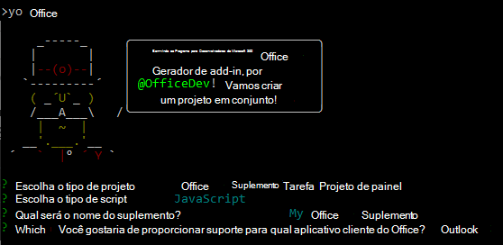

# <a name="build-your-first-outlook-add-in"></a>Criar seu primeiro suplemento do Outlook

Neste artigo, você acompanhará o processo de criação de um suplemento do painel de tarefas do Outlook que exibe pelo menos uma propriedade da mensagem selecionada.

## <a name="create-the-add-in"></a>Criar o suplemento

Você pode criar um suplemento do Office usando o [Gerador Yeoman para suplementos do Office](../develop/yeoman-generator-overview.md) ou Visual Studio. O gerador Yeoman cria um projeto Node.js que pode ser gerenciado com o Visual Studio Code ou com qualquer outro editor, enquanto o Visual Studio cria uma solução do Visual Studio. Selecione a guia do que você deseja usar e, em seguida, siga as instruções para criar o suplemento e testá-lo localmente.

# <a name="yeoman-generator"></a>[Gerador do Yeoman](#tab/yeomangenerator)

### <a name="prerequisites"></a>Pré-requisitos

[!include[Set up requirements](../includes/set-up-dev-environment-beforehand.md)]

[!INCLUDE [Yeoman generator prerequisites](../includes/quickstart-yo-prerequisites.md)]

- [Visual Studio Code (VS Code)](https://code.visualstudio.com/) ou seu editor de código preferido

- Outlook 2016 ou posterior no Windows (conectado a uma conta do Microsoft 365) ou Outlook na Web

### <a name="create-the-add-in-project"></a>Criar o projeto do suplemento

1. [!include[Yeoman generator create project guidance](../includes/yo-office-command-guidance.md)]

    - **Escolha o tipo de projeto** - `Office Add-in Task Pane project`

    - **Escolha o tipo de script** - `JavaScript`

    - **Qual será o nome do suplemento?** - `My Office Add-in`

    - **Você gostaria de proporcionar suporte para qual aplicativo cliente do Office?** - `Outlook`

    

    Depois que você concluir o assistente, o gerador criará o projeto e instalará os componentes Node de suporte.

    [!include[Yeoman generator next steps](../includes/yo-office-next-steps.md)]

1. Navegue até a pasta raiz do projeto do aplicativo Web.

    ```command&nbsp;line
    cd "My Office Add-in"
    ```

### <a name="explore-the-project"></a>Explore o projeto

O projeto de suplemento que você criou com o gerador do Yeoman contém um exemplo de código para um suplemento de painel de tarefas bem básico.

- O arquivo **./manifest.xml** no diretório raiz do projeto define as configurações e os recursos do suplemento.
- O arquivo **./src/taskpane/taskpane.html** contém a marcação HTML do painel de tarefas.
- O arquivo **./src/taskpane/taskpane.css** contém o CSS que é aplicado ao conteúdo no painel de tarefas.
- O arquivo **./src/taskpane/taskpane.js** contém o código da API JavaScript do Office que facilita a interação entre o painel de tarefas e o Outlook.

### <a name="update-the-code"></a>Atualizar o código

1. Abra o projeto no VS Code ou no seu editor de código preferido.
   [!INCLUDE [Instructions for opening add-in project in VS Code via command line](../includes/vs-code-open-project-via-command-line.md)]

1. Abra o arquivo **./src/taskpane/taskpane.html** e substitua todo o elemento **\<main\>** (dentro do elemento **\<body\>**) pela marcação a seguir. A próxima marcação adiciona uma etiqueta onde o script no **./src/taskpane/taskpane.js** gravará os dados.

    ```html
    <main id="app-body" class="ms-welcome__main" style="display: none;">
        <h2 class="ms-font-xl"> Discover what Office Add-ins can do for you today! </h2>
        <p><label id="item-subject"></label></p>
        <div role="button" id="run" class="ms-welcome__action ms-Button ms-Button--hero ms-font-xl">
            <span class="ms-Button-label">Run</span>
        </div>
    </main>
    ```

1. No seu editor de código, abra o arquivo **./src/taskpane/taskpane.js** e adicione o seguinte código dentro da função **executar**. Este código usa a API JavaScript do Office para obter uma referência da mensagem atual e gravar o seu valor de propriedade **subject** no painel de tarefas.

    ```js
    // Get a reference to the current message
    var item = Office.context.mailbox.item;

    // Write message property value to the task pane
    document.getElementById("item-subject").innerHTML = "<b>Subject:</b> <br/>" + item.subject;
    ```

### <a name="try-it-out"></a>Experimente

[!INCLUDE [alert use https](../includes/alert-use-https.md)]

1. Execute o seguinte comando no diretório raiz do seu projeto. Ao executar esse comando, o servidor Web local será iniciado e seu complemento será [sideload](../outlook/sideload-outlook-add-ins-for-testing.md).

    ```command&nbsp;line
    npm start
    ```

1. No Outlook, exiba uma mensagem no [Painel de leitura](https://support.microsoft.com/office/2fd687ed-7fc4-4ae3-8eab-9f9b8c6d53f0) ou abra a mensagem em sua própria janela.

1. Escolha a guia **Página Inicial** (ou a guia **Mensagem**, se você abriu a mensagem em uma nova janela), e em seguida o botão **Mostrar Painel de Tarefas** na faixa de opções para abrir o painel de tarefas do suplemento.

    

    > [!NOTE]
    > Se você receber a mensagem de erro "Não é possível abrir este suplemento do localhost" no painel de tarefas, siga as etapas descritas no [artigo de solução de problemas](/office/troubleshoot/office-suite-issues/cannot-open-add-in-from-localhost).

1. Quando solicitado com a caixa de diálogo **Parar na Carga do Modo de Exibição da Web**, selecione **OK**.

    [!INCLUDE [Cancelling the WebView Stop On Load dialog box](../includes/webview-stop-on-load-cancel-dialog.md)]

1. Role para parte inferior do painel de tarefas e escolha o link **Executar** para escrever o assunto da mensagem no painel de tarefas.

    

    

### <a name="next-steps"></a>Próximas etapas

Parabéns, você criou com êxito um suplemento do painel de tarefas do Outlook. Em seguida, saiba mais sobre os recursos de um suplemento do Outlook e crie um suplemento mais complexo seguindo o [tutorial do suplemento Outlook](../tutorials/outlook-tutorial.md).

# <a name="visual-studio"></a>[Visual Studio](#tab/visualstudio)

### <a name="prerequisites"></a>Pré-requisitos

- [Visual Studio 2019](https://www.visualstudio.com/vs/) com a carga de trabalho de **desenvolvimento do Office/SharePoint** instalada

    > [!NOTE]
    > Se você já instalou o Visual Studio 2019, [use o Instalador do Visual Studio](/visualstudio/install/modify-visual-studio) para garantir que a carga de trabalho de **desenvolvimento do Office/SharePoint** seja instalada.

- Microsoft 365

    > [!NOTE]
    > Se você não tiver uma assinatura do Microsoft 365, poderá obter uma assinatura gratuita inscrevendo-se no [programa para desenvolvedores do Microsoft 365](https://developer.microsoft.com/office/dev-program).

### <a name="create-the-add-in-project"></a>Criar o projeto do suplemento

1. Na barra de menus do Visual Studio, selecione **Arquivo** > **Novo** > **Projeto**.

1. Na lista de tipos de projeto sob **Visual C#** ou **Visual Basic**, expanda a opção **Office/SharePoint**, escolha **Suplementos** e depois **Suplemento da Web do Outlook** como o tipo de projeto.

1. Dê um nome ao projeto e escolha **OK**.

1. O Visual Studio cria uma solução, e os dois projetos dele são exibidos no **Gerenciador de Soluções**. O arquivo **MessageRead.html** é aberto no Visual Studio.

### <a name="explore-the-visual-studio-solution"></a>Explorar a solução do Visual Studio

Ao concluir o assistente, o Visual Studio cria uma solução que contém dois projetos.

|**Projeto**|**Descrição**|
|:-----|:-----|
|Projeto de suplemento|Contém apenas um arquivo de manifesto XML, que contém todas as configurações que descrevem seu add-in. Estas configurações ajudam o aplicativo Office a determinar quando seu suplemento deve ser ativado e onde o suplemento deve aparecer. O Visual Studio gera o conteúdo deste arquivo para que você possa executar o projeto e usar seu suplemento imediatamente. Você pode alterar estas configurações a qualquer momento, modificando o arquivo XML.|
|Projeto de aplicativo Web|Contém as páginas de conteúdo do suplemento, incluindo todos os arquivos e referências de arquivo de que você precisa para desenvolver páginas HTML e JavaScript com reconhecimento do Office. Enquanto você desenvolve o suplemento, o Visual Studio hospeda o aplicativo Web no servidor IIS local. Quando estiver pronto para publicar, você precisará implantar este projeto de aplicativo Web em um servidor Web.|

### <a name="update-the-code"></a>Atualizar o código

1. **MessageRead.html** especifica o HTML que será renderizado no painel de tarefas do suplemento. Em **MessageRead.html**, substitua o elemento **\<body\>** pela marcação a seguir e salve o arquivo.
 
    ```HTML
    <body class="ms-font-m ms-welcome">
        <div class="ms-Fabric content-main">
            <h1 class="ms-font-xxl">Message properties</h1>
            <table class="ms-Table ms-Table--selectable">
                <thead>
                    <tr>
                        <th>Property</th>
                        <th>Value</th>
                    </tr>
                </thead>
                <tbody>
                    <tr>
                        <td><strong>Id</strong></td>
                        <td class="prop-val"><code><label id="item-id"></label></code></td>
                    </tr>
                    <tr>
                        <td><strong>Subject</strong></td>
                        <td class="prop-val"><code><label id="item-subject"></label></code></td>
                    </tr>
                    <tr>
                        <td><strong>Message Id</strong></td>
                        <td class="prop-val"><code><label id="item-internetMessageId"></label></code></td>
                    </tr>
                    <tr>
                        <td><strong>From</strong></td>
                        <td class="prop-val"><code><label id="item-from"></label></code></td>
                    </tr>
                </tbody>
            </table>
        </div>
    </body>
    ```

1. Abra o arquivo **MessageRead.js** na raiz do projeto do aplicativo Web. Este arquivo especifica o script do suplemento. Substitua todo o conteúdo pelo código a seguir e salve o arquivo.

    ```js
    'use strict';

    (function () {

        Office.onReady(function () {
            // Office is ready
            $(document).ready(function () {
                // The document is ready
                loadItemProps(Office.context.mailbox.item);
            });
        });

        function loadItemProps(item) {
            // Write message property values to the task pane
            $('#item-id').text(item.itemId);
            $('#item-subject').text(item.subject);
            $('#item-internetMessageId').text(item.internetMessageId);
            $('#item-from').html(item.from.displayName + " &lt;" + item.from.emailAddress + "&gt;");
        }
    })();
    ```

1. Abra o arquivo **MessageRead.css** na raiz do projeto do aplicativo Web. Este arquivo especifica os estilos personalizados para o suplemento. Substitua todo o conteúdo pelo código a seguir e salve o arquivo.

    ```CSS
    html,
    body {
        width: 100%;
        height: 100%;
        margin: 0;
        padding: 0;
    }

    td.prop-val {
        word-break: break-all;
    }

    .content-main {
        margin: 10px;
    }
    ```

### <a name="update-the-manifest"></a>Atualizar o manifesto

1. Abra o arquivo de manifesto XML do projeto do Suplemento. Este arquivo define as configurações e os recursos do suplemento.

1. O elemento **\<ProviderName\>** tem um valor de marcador. Substitua-o com seu nome.

1. O atributo **DefaultValue** do elemento **\<DisplayName\>** tem um espaço reservado. Substitua-o por `My Office Add-in`.

1. O atributo **DefaultValue** do elemento **\<Description\>** tem um espaço reservado. Substitua-o por `My First Outlook add-in`.

1. Salve o arquivo.

    ```xml
    ...
    <ProviderName>John Doe</ProviderName>
    <DefaultLocale>en-US</DefaultLocale>
    <!-- The display name of your add-in. Used on the store and various places of the Office UI such as the add-ins dialog. -->
    <DisplayName DefaultValue="My Office Add-in" />
    <Description DefaultValue="My First Outlook add-in"/>
    ...
    ```

### <a name="try-it-out"></a>Experimente

1. Usando o Visual Studio, teste o suplemento do Outlook recém-criado ao pressionar F5 ou o botão **Iniciar**. O suplemento será hospedado localmente no IIS.

1. Na caixa de diálogo **Conectar-se à conta de email do Exchange**, digite o endereço de email e senha da sua [conta da Microsoft](https://account.microsoft.com/account) e, em seguida, escolha **Conectar**. Quando a página de login do Outlook.com for aberta em um navegador, entre em sua conta de email com as mesmas credenciais que você inseriu anteriormente.

    > [!NOTE]
    > Se a caixa de diálogo **Conectar à conta de email Exchange** solicitar repetidamente que você faça o login ou se você receber um erro de que não está autorizado, o Basic Auth pode ser desativado para contas em seu locatário Microsoft 365. Para testar este suplemento, tente entrar novamente após definir a propriedade **Usar multi-fator auth** para True no diálogo de propriedades do projeto Web Add-in, ou entre usando uma [conta Microsoft](https://account.microsoft.com/account) em seu lugar.

1. No Outlook na Web, escolha ou abra uma mensagem.

1. Dentro da mensagem, localize as reticências do menu de estouro que contém o botão do suplemento.

    

1. No menu excedente, localize o botão do suplemento.

    

1. Clique no botão para abrir o painel de tarefas do suplemento.

    

    > [!NOTE]
    > Se o painel de tarefas não carregar, tente verificar abrindo-o em um navegador no mesmo computador.

### <a name="next-steps"></a>Próximas etapas

Parabéns, você criou o seu primeiro suplemento do painel de tarefas do Outlook! Em seguida, saiba mais sobre como [desenvolver suplementos do Office com o Visual Studio](../develop/develop-add-ins-visual-studio.md).

---

## <a name="see-also"></a>Confira também

- [Usando o Visual Studio Code para publicar](../publish/publish-add-in-vs-code.md#using-visual-studio-code-to-publish)
