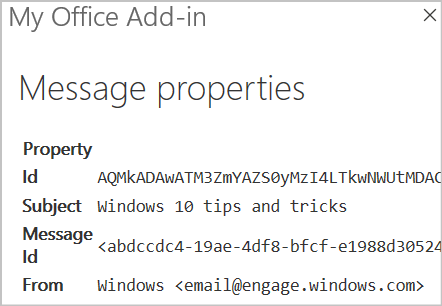

# <a name="build-your-first-outlook-add-in"></a><span data-ttu-id="b5d72-103">Criar seu primeiro suplemento do Outlook</span><span class="sxs-lookup"><span data-stu-id="b5d72-103">Build your first Outlook add-in</span></span>

<span data-ttu-id="b5d72-104">Neste artigo, você acompanhará o processo de criação de um suplemento do painel de tarefas do Outlook que exibe pelo menos uma propriedade da mensagem selecionada.</span><span class="sxs-lookup"><span data-stu-id="b5d72-104">In this article, you'll walk through the process of building an Outlook task pane add-in that displays at least one property of a selected message.</span></span>

## <a name="create-the-add-in"></a><span data-ttu-id="b5d72-105">Criar o suplemento</span><span class="sxs-lookup"><span data-stu-id="b5d72-105">Create the add-in</span></span>

<span data-ttu-id="b5d72-106">Você pode criar um suplemento do Office usando o [Gerador Yeoman para suplementos do Office](https://github.com/OfficeDev/generator-office) ou Visual Studio.</span><span class="sxs-lookup"><span data-stu-id="b5d72-106">You can create an Office Add-in by using the [Yeoman generator for Office Add-ins](https://github.com/OfficeDev/generator-office) or Visual Studio.</span></span> <span data-ttu-id="b5d72-107">O gerador Yeoman cria um projeto Node.js que pode ser gerenciado com o Visual Studio Code ou com qualquer outro editor, enquanto o Visual Studio cria uma solução do Visual Studio.</span><span class="sxs-lookup"><span data-stu-id="b5d72-107">The Yeoman generator creates a Node.js project that can be managed with Visual Studio Code or any other editor, whereas Visual Studio creates a Visual Studio solution.</span></span>  <span data-ttu-id="b5d72-108">Selecione a guia do que você deseja usar e, em seguida, siga as instruções para criar o suplemento e testá-lo localmente.</span><span class="sxs-lookup"><span data-stu-id="b5d72-108">Select the tab for the one you'd like to use and then follow the instructions to create your add-in and test it locally.</span></span>

# <a name="yeoman-generator"></a>[<span data-ttu-id="b5d72-109">Gerador do Yeoman</span><span class="sxs-lookup"><span data-stu-id="b5d72-109">Yeoman generator</span></span>](#tab/yeomangenerator)

### <a name="prerequisites"></a><span data-ttu-id="b5d72-110">Pré-requisitos</span><span class="sxs-lookup"><span data-stu-id="b5d72-110">Prerequisites</span></span>

[!include[Set up requirements](../includes/set-up-dev-environment-beforehand.md)]

- <span data-ttu-id="b5d72-111">[Node.js](https://nodejs.org/) (a versão mais recente de [LTS](https://nodejs.org/about/releases))</span><span class="sxs-lookup"><span data-stu-id="b5d72-111">[Node.js](https://nodejs.org/) (the latest [LTS](https://nodejs.org/about/releases) version)</span></span>

- <span data-ttu-id="b5d72-112">A versão mais recente do [Yeoman](https://github.com/yeoman/yo) e do [Yeoman gerador de suplementos do Office](https://github.com/OfficeDev/generator-office). Para instalar essas ferramentas globalmente, execute o seguinte comando por meio do prompt de comando:</span><span class="sxs-lookup"><span data-stu-id="b5d72-112">The latest version of [Yeoman](https://github.com/yeoman/yo) and the [Yeoman generator for Office Add-ins](https://github.com/OfficeDev/generator-office). To install these tools globally, run the following command via the command prompt:</span></span>

    ```command&nbsp;line
    npm install -g yo generator-office
    ```

    > [!NOTE]
    > <span data-ttu-id="b5d72-113">Mesmo se você já instalou o gerador Yeoman, recomendamos atualizar seu pacote para a versão mais recente do npm.</span><span class="sxs-lookup"><span data-stu-id="b5d72-113">Even if you've previously installed the Yeoman generator, we recommend you update your package to the latest version from npm.</span></span>

### <a name="create-the-add-in-project"></a><span data-ttu-id="b5d72-114">Criar o projeto do suplemento</span><span class="sxs-lookup"><span data-stu-id="b5d72-114">Create the add-in project</span></span>

1. [!include[Yeoman generator create project guidance](../includes/yo-office-command-guidance.md)]

    - <span data-ttu-id="b5d72-115">**Escolha o tipo de projeto** - `Office Add-in Task Pane project`</span><span class="sxs-lookup"><span data-stu-id="b5d72-115">**Choose a project type** - `Office Add-in Task Pane project`</span></span>

    - <span data-ttu-id="b5d72-116">**Escolha o tipo de script** - `Javascript`</span><span class="sxs-lookup"><span data-stu-id="b5d72-116">**Choose a script type** - `Javascript`</span></span>

    - <span data-ttu-id="b5d72-117">**Qual será o nome do suplemento?**</span><span class="sxs-lookup"><span data-stu-id="b5d72-117">**What do you want to name your add-in?**</span></span> - `My Office Add-in`

    - <span data-ttu-id="b5d72-118">**Você gostaria de proporcionar suporte para qual aplicativo cliente do Office?**</span><span class="sxs-lookup"><span data-stu-id="b5d72-118">**Which Office client application would you like to support?**</span></span> - `Outlook`

    
    
    <span data-ttu-id="b5d72-120">Depois que você concluir o assistente, o gerador criará o projeto e instalará os componentes Node de suporte.</span><span class="sxs-lookup"><span data-stu-id="b5d72-120">After you complete the wizard, the generator will create the project and install supporting Node components.</span></span>

    [!include[Yeoman generator next steps](../includes/yo-office-next-steps.md)]

1. <span data-ttu-id="b5d72-121">Navegue até a pasta raiz do projeto do aplicativo Web.</span><span class="sxs-lookup"><span data-stu-id="b5d72-121">Navigate to the root folder of the web application project.</span></span>

    ```command&nbsp;line
    cd "My Office Add-in"
    ```

### <a name="explore-the-project"></a><span data-ttu-id="b5d72-122">Explore o projeto</span><span class="sxs-lookup"><span data-stu-id="b5d72-122">Explore the project</span></span>

<span data-ttu-id="b5d72-123">O projeto de suplemento que você criou com o gerador do Yeoman contém um exemplo de código para um suplemento de painel de tarefas bem básico.</span><span class="sxs-lookup"><span data-stu-id="b5d72-123">The add-in project that you've created with the Yeoman generator contains sample code for a very basic task pane add-in.</span></span> 

- <span data-ttu-id="b5d72-124">O arquivo **./manifest.xml** no diretório raiz do projeto define as configurações e os recursos do suplemento.</span><span class="sxs-lookup"><span data-stu-id="b5d72-124">The **./manifest.xml** file in the root directory of the project defines the settings and capabilities of the add-in.</span></span>
- <span data-ttu-id="b5d72-125">O arquivo **./src/taskpane/taskpane.html** contém a marcação HTML do painel de tarefas.</span><span class="sxs-lookup"><span data-stu-id="b5d72-125">The **./src/taskpane/taskpane.html** file contains the HTML markup for the task pane.</span></span>
- <span data-ttu-id="b5d72-126">O arquivo **./src/taskpane/taskpane.css** contém o CSS que é aplicado ao conteúdo no painel de tarefas.</span><span class="sxs-lookup"><span data-stu-id="b5d72-126">The **./src/taskpane/taskpane.css** file contains the CSS that's applied to content in the task pane.</span></span>
- <span data-ttu-id="b5d72-127">O arquivo **./src/taskpane/taskpane.js** contém o código da API JavaScript do Office que facilita a interação entre o painel de tarefas e o Outlook.</span><span class="sxs-lookup"><span data-stu-id="b5d72-127">The **./src/taskpane/taskpane.js** file contains the Office JavaScript API code that facilitates interaction between the task pane and Outlook.</span></span>

### <a name="update-the-code"></a><span data-ttu-id="b5d72-128">Atualizar o código</span><span class="sxs-lookup"><span data-stu-id="b5d72-128">Update the code</span></span>

1. <span data-ttu-id="b5d72-129">No seu editor de código, abra o arquivo **./src/taskpane/taskpane.html** e substitua o elemento `<main>` inteiro (dentro do elemento `<body>`) com a seguinte marcação.</span><span class="sxs-lookup"><span data-stu-id="b5d72-129">In your code editor, open the file **./src/taskpane/taskpane.html** and replace the entire `<main>` element (within the `<body>` element) with the following markup.</span></span> <span data-ttu-id="b5d72-130">A próxima marcação adiciona uma etiqueta onde o script no **./src/taskpane/taskpane.js** gravará os dados.</span><span class="sxs-lookup"><span data-stu-id="b5d72-130">This new markup adds a label where the script in **./src/taskpane/taskpane.js** will write data.</span></span>

    ```html
    <main id="app-body" class="ms-welcome__main" style="display: none;">
        <h2 class="ms-font-xl"> Discover what Office Add-ins can do for you today! </h2>
        <p><label id="item-subject"></label></p>
        <div role="button" id="run" class="ms-welcome__action ms-Button ms-Button--hero ms-font-xl">
            <span class="ms-Button-label">Run</span>
        </div>
    </main>
    ```

1. <span data-ttu-id="b5d72-131">No seu editor de código, abra o arquivo **./src/taskpane/taskpane.js** e adicione o seguinte código na função `run`.</span><span class="sxs-lookup"><span data-stu-id="b5d72-131">In your code editor, open the file **./src/taskpane/taskpane.js** and add the following code within the `run` function.</span></span> <span data-ttu-id="b5d72-132">Este código usa a API JavaScript do Office para obter uma referência da mensagem atual e gravar o seu valor de propriedade `subject` no painel de tarefas.</span><span class="sxs-lookup"><span data-stu-id="b5d72-132">This code uses the Office JavaScript API to get a reference to the current message and write its `subject` property value to the task pane.</span></span>

    ```js
    // Get a reference to the current message
    var item = Office.context.mailbox.item;

    // Write message property value to the task pane
    document.getElementById("item-subject").innerHTML = "<b>Subject:</b> <br/>" + item.subject;
    ```

### <a name="try-it-out"></a><span data-ttu-id="b5d72-133">Experimente</span><span class="sxs-lookup"><span data-stu-id="b5d72-133">Try it out</span></span>

> [!NOTE]
> <span data-ttu-id="b5d72-134">Os Suplementos do Office devem usar HTTPS, e não HTTP, mesmo durante o desenvolvimento.</span><span class="sxs-lookup"><span data-stu-id="b5d72-134">Office Add-ins should use HTTPS, not HTTP, even when you are developing.</span></span> <span data-ttu-id="b5d72-135">Se for solicitado a instalação de um certificado após executar um dos seguintes comandos, aceite a solicitação para instalar o certificado que o gerador do Yeoman fornecer.</span><span class="sxs-lookup"><span data-stu-id="b5d72-135">If you are prompted to install a certificate after you run the following command, accept the prompt to install the certificate that the Yeoman generator provides.</span></span>

1. <span data-ttu-id="b5d72-136">Execute o seguinte comando no diretório raiz do seu projeto.</span><span class="sxs-lookup"><span data-stu-id="b5d72-136">Run the following command in the root directory of your project.</span></span> <span data-ttu-id="b5d72-137">Quando você executar este comando, o servidor da Web local será iniciado (se ainda não estiver em execução).</span><span class="sxs-lookup"><span data-stu-id="b5d72-137">When you run this command, the local web server will start (if it's not already running).</span></span>

    ```command&nbsp;line
    npm run dev-server
    ```

1. <span data-ttu-id="b5d72-138">Siga as instruções [Realizar sideload dos suplementos do Outlook para teste](../outlook/sideload-outlook-add-ins-for-testing.md)para realizar o sideload do suplemento do Outlook.</span><span class="sxs-lookup"><span data-stu-id="b5d72-138">Follow the instructions in [Sideload Outlook add-ins for testing](../outlook/sideload-outlook-add-ins-for-testing.md) to sideload the add-in in Outlook.</span></span>

1. <span data-ttu-id="b5d72-139">No Outlook, escolha ou abra uma mensagem.</span><span class="sxs-lookup"><span data-stu-id="b5d72-139">In Outlook, select or open a message.</span></span>

1. <span data-ttu-id="b5d72-140">Escolha a guia **Página Inicial** (ou a guia **Mensagem**, se você abriu a mensagem em uma nova janela), e em seguida o botão **Mostrar Painel de Tarefas** na faixa de opções para abrir o painel de tarefas do suplemento.</span><span class="sxs-lookup"><span data-stu-id="b5d72-140">Choose the **Home** tab (or the **Message** tab if you opened the message in a new window), and then choose the **Show Taskpane** button in the ribbon to open the add-in task pane.</span></span>

    

1. <span data-ttu-id="b5d72-142">Role para parte inferior do painel de tarefas e escolha o link **Executar** para escrever o assunto da mensagem no painel de tarefas.</span><span class="sxs-lookup"><span data-stu-id="b5d72-142">Scroll to the bottom of the task pane and choose the **Run** link to write the message subject to the task pane.</span></span>

    

    

### <a name="next-steps"></a><span data-ttu-id="b5d72-145">Próximas etapas</span><span class="sxs-lookup"><span data-stu-id="b5d72-145">Next steps</span></span>

<span data-ttu-id="b5d72-146">Parabéns, você criou o seu primeiro suplemento do painel de tarefas do Outlook!</span><span class="sxs-lookup"><span data-stu-id="b5d72-146">Congratulations, you've successfully created your first Outlook task pane add-in!</span></span> <span data-ttu-id="b5d72-147">Em seguida, saiba mais sobre os recursos de um suplemento do Outlook e crie um suplemento mais complexo seguindo as etapas deste [tutorial de suplemento do Word](../tutorials/outlook-tutorial.md).</span><span class="sxs-lookup"><span data-stu-id="b5d72-147">Next, learn more about the capabilities of an Outlook add-in and build a more complex add-in by following along with the [Outlook add-in tutorial](../tutorials/outlook-tutorial.md).</span></span>

# <a name="visual-studio"></a>[<span data-ttu-id="b5d72-148">Visual Studio</span><span class="sxs-lookup"><span data-stu-id="b5d72-148">Visual Studio</span></span>](#tab/visualstudio)

### <a name="prerequisites"></a><span data-ttu-id="b5d72-149">Pré-requisitos</span><span class="sxs-lookup"><span data-stu-id="b5d72-149">Prerequisites</span></span>

- <span data-ttu-id="b5d72-150">[Visual Studio 2019](https://www.visualstudio.com/vs/) com a carga de trabalho de **desenvolvimento do Office/SharePoint** instalada</span><span class="sxs-lookup"><span data-stu-id="b5d72-150">[Visual Studio 2019](https://www.visualstudio.com/vs/) with the **Office/SharePoint development** workload installed</span></span>

    > [!NOTE]
    > <span data-ttu-id="b5d72-151">Se você já instalou o Visual Studio 2019, [use o Instalador do Visual Studio](/visualstudio/install/modify-visual-studio) para garantir que a carga de trabalho de **desenvolvimento do Office/SharePoint** seja instalada.</span><span class="sxs-lookup"><span data-stu-id="b5d72-151">If you've previously installed Visual Studio 2019, [use the Visual Studio Installer](/visualstudio/install/modify-visual-studio) to ensure that the **Office/SharePoint development** workload is installed.</span></span>

- <span data-ttu-id="b5d72-152">Office 365</span><span class="sxs-lookup"><span data-stu-id="b5d72-152">Office 365</span></span>

    > [!NOTE]
    > <span data-ttu-id="b5d72-153">Se você não tiver uma assinatura do Office 365, poderá obter uma assinatura gratuita inscrevendo-se no [programa de desenvolvedores do Office 365](https://developer.microsoft.com/office/dev-program).</span><span class="sxs-lookup"><span data-stu-id="b5d72-153">If you do not have an Office 365 subscription, you can get a free one by signing up for the [Office 365 developer program](https://developer.microsoft.com/office/dev-program).</span></span>

### <a name="create-the-add-in-project"></a><span data-ttu-id="b5d72-154">Criar o projeto do suplemento</span><span class="sxs-lookup"><span data-stu-id="b5d72-154">Create the add-in project</span></span>

1. <span data-ttu-id="b5d72-155">Na barra de menus do Visual Studio, selecione **Arquivo** > **Novo** > **Projeto**.</span><span class="sxs-lookup"><span data-stu-id="b5d72-155">On the Visual Studio menu bar, choose **File** > **New** > **Project**.</span></span>

1. <span data-ttu-id="b5d72-156">Na lista de tipos de projeto sob **Visual C#** ou **Visual Basic**, expanda a opção **Office/SharePoint**, escolha **Suplementos** e depois **Suplemento da Web do Outlook** como o tipo de projeto.</span><span class="sxs-lookup"><span data-stu-id="b5d72-156">In the list of project types under **Visual C#** or **Visual Basic**, expand **Office/SharePoint**, choose **Add-ins**, and then choose **Outlook Web Add-in** as the project type.</span></span>

1. <span data-ttu-id="b5d72-157">Dê um nome ao projeto e escolha **OK**.</span><span class="sxs-lookup"><span data-stu-id="b5d72-157">Name the project, and then choose **OK**.</span></span>

1. <span data-ttu-id="b5d72-158">O Visual Studio cria uma solução, e os dois projetos dele aparecem no **Gerenciador de Soluções**.</span><span class="sxs-lookup"><span data-stu-id="b5d72-158">Visual Studio creates a solution and its two projects appear in **Solution Explorer**.</span></span> <span data-ttu-id="b5d72-159">O arquivo **MessageRead.html** é aberto no Visual Studio.</span><span class="sxs-lookup"><span data-stu-id="b5d72-159">The **MessageRead.html** file opens in Visual Studio.</span></span>

### <a name="explore-the-visual-studio-solution"></a><span data-ttu-id="b5d72-160">Explorar a solução do Visual Studio</span><span class="sxs-lookup"><span data-stu-id="b5d72-160">Explore the Visual Studio solution</span></span>

<span data-ttu-id="b5d72-161">Ao concluir o assistente, o Visual Studio cria uma solução que contém dois projetos.</span><span class="sxs-lookup"><span data-stu-id="b5d72-161">When you've completed the wizard, Visual Studio creates a solution that contains two projects.</span></span>

|<span data-ttu-id="b5d72-162">**Projeto**</span><span class="sxs-lookup"><span data-stu-id="b5d72-162">**Project**</span></span>|<span data-ttu-id="b5d72-163">**Descrição**</span><span class="sxs-lookup"><span data-stu-id="b5d72-163">**Description**</span></span>|
|:-----|:-----|
|<span data-ttu-id="b5d72-164">Projeto de suplemento</span><span class="sxs-lookup"><span data-stu-id="b5d72-164">Add-in project</span></span>|<span data-ttu-id="b5d72-165">Contém somente um arquivo de manifesto XML, que contém todas as configurações que descrevem o suplemento.</span><span class="sxs-lookup"><span data-stu-id="b5d72-165">Contains only an XML manifest file, which contains all the settings that describe your add-in.</span></span> <span data-ttu-id="b5d72-166">As configurações ajudam o host do Office a determinar quando o suplemento deverá ser ativado e onde ele deverá aparecer.</span><span class="sxs-lookup"><span data-stu-id="b5d72-166">These settings help the Office host determine when your add-in should be activated and where the add-in should appear.</span></span> <span data-ttu-id="b5d72-167">O Visual Studio gera o conteúdo desse arquivo para que você possa executar o projeto e usar o suplemento imediatamente.</span><span class="sxs-lookup"><span data-stu-id="b5d72-167">Visual Studio generates the contents of this file for you so that you can run the project and use your add-in immediately.</span></span> <span data-ttu-id="b5d72-168">Você pode alterar essas configurações a qualquer momento modificando o arquivo XML.</span><span class="sxs-lookup"><span data-stu-id="b5d72-168">You can change these settings any time by modifying the XML file.</span></span>|
|<span data-ttu-id="b5d72-169">Projeto de aplicativo Web</span><span class="sxs-lookup"><span data-stu-id="b5d72-169">Web application project</span></span>|<span data-ttu-id="b5d72-170">Contains the content pages of your add-in, including all the files and file references that you need to develop Office-aware HTML and JavaScript pages.</span><span class="sxs-lookup"><span data-stu-id="b5d72-170">Contains the content pages of your add-in, including all the files and file references that you need to develop Office-aware HTML and JavaScript pages.</span></span> <span data-ttu-id="b5d72-171">While you develop your add-in, Visual Studio hosts the web application on your local IIS server.</span><span class="sxs-lookup"><span data-stu-id="b5d72-171">While you develop your add-in, Visual Studio hosts the web application on your local IIS server.</span></span> <span data-ttu-id="b5d72-172">When you're ready to publish the add-in, you'll need to deploy this web application project to a web server.</span><span class="sxs-lookup"><span data-stu-id="b5d72-172">When you're ready to publish the add-in, you'll need to deploy this web application project to a web server.</span></span>|

### <a name="update-the-code"></a><span data-ttu-id="b5d72-173">Atualizar o código</span><span class="sxs-lookup"><span data-stu-id="b5d72-173">Update the code</span></span>

1. <span data-ttu-id="b5d72-174">**MessageRead.html** especifica o HTML que será renderizado no painel de tarefas do suplemento.</span><span class="sxs-lookup"><span data-stu-id="b5d72-174">**MessageRead.html** specifies the HTML that will be rendered in the add-in's task pane.</span></span> <span data-ttu-id="b5d72-175">Em **MessageRead.html**, substitua o elemento `<body>` pela marcação a seguir e salve o arquivo.</span><span class="sxs-lookup"><span data-stu-id="b5d72-175">In **MessageRead.html**, replace the `<body>` element with the following markup and save the file.</span></span>
 
    ```HTML
    <body class="ms-font-m ms-welcome">
        <div class="ms-Fabric content-main">
            <h1 class="ms-font-xxl">Message properties</h1>
            <table class="ms-Table ms-Table--selectable">
                <thead>
                    <tr>
                        <th>Property</th>
                        <th>Value</th>
                    </tr>
                </thead>
                <tbody>
                    <tr>
                        <td><strong>Id</strong></td>
                        <td class="prop-val"><code><label id="item-id"></label></code></td>
                    </tr>
                    <tr>
                        <td><strong>Subject</strong></td>
                        <td class="prop-val"><code><label id="item-subject"></label></code></td>
                    </tr>
                    <tr>
                        <td><strong>Message Id</strong></td>
                        <td class="prop-val"><code><label id="item-internetMessageId"></label></code></td>
                    </tr>
                    <tr>
                        <td><strong>From</strong></td>
                        <td class="prop-val"><code><label id="item-from"></label></code></td>
                    </tr>
                </tbody>
            </table>
        </div>
    </body>
    ```

1. <span data-ttu-id="b5d72-176">Abra o arquivo **MessageRead.js** na raiz do projeto do aplicativo Web.</span><span class="sxs-lookup"><span data-stu-id="b5d72-176">Open the file **MessageRead.js** in the root of the web application project.</span></span> <span data-ttu-id="b5d72-177">Este arquivo especifica o script do suplemento.</span><span class="sxs-lookup"><span data-stu-id="b5d72-177">This file specifies the script for the add-in.</span></span> <span data-ttu-id="b5d72-178">Substitua todo o conteúdo pelo código a seguir e salve o arquivo.</span><span class="sxs-lookup"><span data-stu-id="b5d72-178">Replace the entire contents with the following code and save the file.</span></span>

    ```js
    'use strict';

    (function () {

        Office.onReady(function () {
            // Office is ready
            $(document).ready(function () {
                // The document is ready
                loadItemProps(Office.context.mailbox.item);
            });
        });

        function loadItemProps(item) {
            // Write message property values to the task pane
            $('#item-id').text(item.itemId);
            $('#item-subject').text(item.subject);
            $('#item-internetMessageId').text(item.internetMessageId);
            $('#item-from').html(item.from.displayName + " &lt;" + item.from.emailAddress + "&gt;");
        }
    })();
    ```

1. <span data-ttu-id="b5d72-179">Abra o arquivo **MessageRead.css** na raiz do projeto do aplicativo Web.</span><span class="sxs-lookup"><span data-stu-id="b5d72-179">Open the file **MessageRead.css** in the root of the web application project.</span></span> <span data-ttu-id="b5d72-180">Este arquivo especifica os estilos personalizados para o suplemento.</span><span class="sxs-lookup"><span data-stu-id="b5d72-180">This file specifies the custom styles for the add-in.</span></span> <span data-ttu-id="b5d72-181">Substitua todo o conteúdo pelo código a seguir e salve o arquivo.</span><span class="sxs-lookup"><span data-stu-id="b5d72-181">Replace the entire contents with the following code and save the file.</span></span>

    ```CSS
    html,
    body {
        width: 100%;
        height: 100%;
        margin: 0;
        padding: 0;
    }

    td.prop-val {
        word-break: break-all;
    }

    .content-main {
        margin: 10px;
    }
    ```

### <a name="update-the-manifest"></a><span data-ttu-id="b5d72-182">Atualizar o manifesto</span><span class="sxs-lookup"><span data-stu-id="b5d72-182">Update the manifest</span></span>

1. <span data-ttu-id="b5d72-183">Open the XML manifest file in the Add-in project.</span><span class="sxs-lookup"><span data-stu-id="b5d72-183">Open the XML manifest file in the Add-in project.</span></span> <span data-ttu-id="b5d72-184">This file defines the add-in's settings and capabilities.</span><span class="sxs-lookup"><span data-stu-id="b5d72-184">This file defines the add-in's settings and capabilities.</span></span>

1. <span data-ttu-id="b5d72-185">The `ProviderName` element has a placeholder value.</span><span class="sxs-lookup"><span data-stu-id="b5d72-185">The `ProviderName` element has a placeholder value.</span></span> <span data-ttu-id="b5d72-186">Replace it with your name.</span><span class="sxs-lookup"><span data-stu-id="b5d72-186">Replace it with your name.</span></span>

1. <span data-ttu-id="b5d72-187">O atributo `DefaultValue` do elemento `DisplayName` tem um espaço reservado.</span><span class="sxs-lookup"><span data-stu-id="b5d72-187">The `DefaultValue` attribute of the `DisplayName` element has a placeholder.</span></span> <span data-ttu-id="b5d72-188">Substitua-o por `My Office Add-in`.</span><span class="sxs-lookup"><span data-stu-id="b5d72-188">Replace it with `My Office Add-in`.</span></span>

1. <span data-ttu-id="b5d72-189">O atributo `DefaultValue` do elemento `Description` tem um espaço reservado.</span><span class="sxs-lookup"><span data-stu-id="b5d72-189">The `DefaultValue` attribute of the `Description` element has a placeholder.</span></span> <span data-ttu-id="b5d72-190">Substitua-o por `My First Outlook add-in`.</span><span class="sxs-lookup"><span data-stu-id="b5d72-190">Replace it with `My First Outlook add-in`.</span></span>

1. <span data-ttu-id="b5d72-191">Salve o arquivo.</span><span class="sxs-lookup"><span data-stu-id="b5d72-191">Save the file.</span></span>

    ```xml
    ...
    <ProviderName>John Doe</ProviderName>
    <DefaultLocale>en-US</DefaultLocale>
    <!-- The display name of your add-in. Used on the store and various places of the Office UI such as the add-ins dialog. -->
    <DisplayName DefaultValue="My Office Add-in" />
    <Description DefaultValue="My First Outlook add-in"/>
    ...
    ```

### <a name="try-it-out"></a><span data-ttu-id="b5d72-192">Experimente</span><span class="sxs-lookup"><span data-stu-id="b5d72-192">Try it out</span></span>

1. <span data-ttu-id="b5d72-193">Usando o Visual Studio, teste o suplemento do Outlook recém-criado ao pressionar F5 ou o botão **Iniciar**.</span><span class="sxs-lookup"><span data-stu-id="b5d72-193">Using Visual Studio, test the newly created Outlook add-in by pressing F5 or choosing the **Start** button.</span></span> <span data-ttu-id="b5d72-194">O suplemento será hospedado localmente no IIS.</span><span class="sxs-lookup"><span data-stu-id="b5d72-194">The add-in will be hosted locally on IIS.</span></span>

1. <span data-ttu-id="b5d72-195">Na caixa de diálogo**Conectar-se à conta de email do Exchange**, digite o endereço de email e senha da sua [conta da Microsoft](https://account.microsoft.com/account) e, em seguida, escolha **Conectar**.</span><span class="sxs-lookup"><span data-stu-id="b5d72-195">In the **Connect to Exchange email account** dialog box, enter the email address and password for your [Microsoft account](https://account.microsoft.com/account) and then choose **Connect**.</span></span> <span data-ttu-id="b5d72-196">Quando a página de login do Outlook.com for aberta em um navegador, entre em sua conta de email com as mesmas credenciais que você inseriu anteriormente.</span><span class="sxs-lookup"><span data-stu-id="b5d72-196">When the Outlook.com login page opens in a browser, sign in to your email account with the same credentials as you entered previously.</span></span>

    > [!NOTE]
    > <span data-ttu-id="b5d72-197">Se a caixa de diálogo **Conectar a uma conta de email do Exchange** repetidamente solicitar que você entre, a Autenticação Básica poderá ser desabilitada para contas no locatário do Office 365.</span><span class="sxs-lookup"><span data-stu-id="b5d72-197">If the **Connect to Exchange email account** dialog box repeatedly prompts you to sign in, Basic Auth may be disabled for accounts on your Office 365 tenant.</span></span> <span data-ttu-id="b5d72-198">Para testar esse suplemento, entre usando uma [Conta da Microsoft](https://account.microsoft.com/account).</span><span class="sxs-lookup"><span data-stu-id="b5d72-198">To test this add-in, sign in using a [Microsoft account](https://account.microsoft.com/account) instead.</span></span>

1. <span data-ttu-id="b5d72-199">No Outlook na Web, escolha ou abra uma mensagem.</span><span class="sxs-lookup"><span data-stu-id="b5d72-199">In Outlook on the web, select or open a message.</span></span>

1. <span data-ttu-id="b5d72-200">Dentro da mensagem, localize as reticências do menu de estouro que contém o botão do suplemento.</span><span class="sxs-lookup"><span data-stu-id="b5d72-200">Within the message, locate the ellipsis for the overflow menu containing the add-in's button.</span></span>

    

1. <span data-ttu-id="b5d72-202">No menu estouro, localize o botão do suplemento.</span><span class="sxs-lookup"><span data-stu-id="b5d72-202">Within the overflow menu, locate the add-in's button.</span></span>

    

1. <span data-ttu-id="b5d72-204">Clique no botão para abrir o painel de tarefas do suplemento.</span><span class="sxs-lookup"><span data-stu-id="b5d72-204">Click the button to open the add-in's task pane.</span></span>

    

    > [!NOTE]
    > <span data-ttu-id="b5d72-206">Se o painel de tarefas não carregar, tente verificar abrindo-o em um navegador no mesmo computador.</span><span class="sxs-lookup"><span data-stu-id="b5d72-206">If the task pane doesn't load, try to verify by opening it in a browser on the same machine.</span></span>

### <a name="next-steps"></a><span data-ttu-id="b5d72-207">Próximas etapas</span><span class="sxs-lookup"><span data-stu-id="b5d72-207">Next steps</span></span>

<span data-ttu-id="b5d72-208">Parabéns, você criou o seu primeiro suplemento do painel de tarefas do Outlook!</span><span class="sxs-lookup"><span data-stu-id="b5d72-208">Congratulations, you've successfully created your first Outlook task pane add-in!</span></span> <span data-ttu-id="b5d72-209">Em seguida, saiba mais sobre como [desenvolver suplementos do Office com o Visual Studio](../develop/develop-add-ins-visual-studio.md).</span><span class="sxs-lookup"><span data-stu-id="b5d72-209">Next, learn more about [developing Office Add-ins with Visual Studio](../develop/develop-add-ins-visual-studio.md).</span></span>

---
