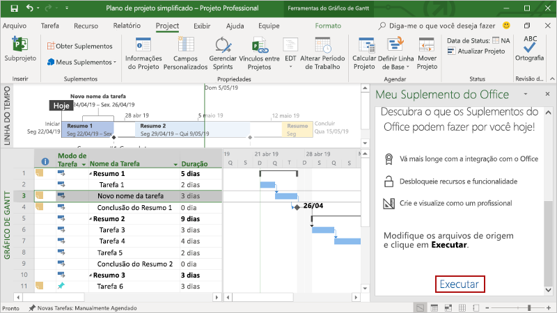

# <a name="build-your-first-project-task-pane-add-in"></a><span data-ttu-id="2df78-103">Crie o seu primeiro suplemento do painel de tarefas do Project</span><span class="sxs-lookup"><span data-stu-id="2df78-103">Build your first Project task pane add-in</span></span>

<span data-ttu-id="2df78-104">Neste artigo, você passará pelo processo de criação de um suplemento do painel de tarefas do Project.</span><span class="sxs-lookup"><span data-stu-id="2df78-104">In this article, you'll walk through the process of building a Project task pane add-in.</span></span>

## <a name="prerequisites"></a><span data-ttu-id="2df78-105">Pré-requisitos</span><span class="sxs-lookup"><span data-stu-id="2df78-105">Prerequisites</span></span>

[!include[Yeoman generator prerequisites](../includes/quickstart-yo-prerequisites.md)]

- <span data-ttu-id="2df78-106">Project 2016 ou posterior no Windows</span><span class="sxs-lookup"><span data-stu-id="2df78-106">Project 2016 or later on Windows</span></span>

## <a name="create-the-add-in"></a><span data-ttu-id="2df78-107">Criar o suplemento</span><span class="sxs-lookup"><span data-stu-id="2df78-107">Create the add-in</span></span>

[!include[Yeoman generator create project guidance](../includes/yo-office-command-guidance.md)]

- <span data-ttu-id="2df78-108">**Escolha o tipo de projeto:** `Office Add-in Task Pane project`</span><span class="sxs-lookup"><span data-stu-id="2df78-108">**Choose a project type:** `Office Add-in Task Pane project`</span></span>
- <span data-ttu-id="2df78-109">**Escolha o tipo de script:** `Javascript`</span><span class="sxs-lookup"><span data-stu-id="2df78-109">**Choose a script type:** `Javascript`</span></span>
- <span data-ttu-id="2df78-110">**Qual será o nome do suplemento?**</span><span class="sxs-lookup"><span data-stu-id="2df78-110">**What do you want to name your add-in?**</span></span> `My Office Add-in`
- <span data-ttu-id="2df78-111">**Você gostaria de proporcionar suporte para qual aplicativo cliente do Office?**</span><span class="sxs-lookup"><span data-stu-id="2df78-111">**Which Office client application would you like to support?**</span></span> `Project`


<span data-ttu-id="2df78-113">Depois que você concluir o assistente, o gerador criará o projeto e instalará os componentes Node de suporte.</span><span class="sxs-lookup"><span data-stu-id="2df78-113">After you complete the wizard, the generator creates the project and installs supporting Node components.</span></span>

[!include[Yeoman generator next steps](../includes/yo-office-next-steps.md)]

## <a name="explore-the-project"></a><span data-ttu-id="2df78-114">Explore o projeto</span><span class="sxs-lookup"><span data-stu-id="2df78-114">Explore the project</span></span>

<span data-ttu-id="2df78-115">O projeto de suplemento que você criou com o gerador do Yeoman contém um exemplo de código para um suplemento de painel de tarefas bem básico.</span><span class="sxs-lookup"><span data-stu-id="2df78-115">The add-in project that you've created with the Yeoman generator contains sample code for a very basic task pane add-in.</span></span> 

- <span data-ttu-id="2df78-116">O arquivo **./manifest.xml** no diretório raiz do projeto define as configurações e os recursos do suplemento.</span><span class="sxs-lookup"><span data-stu-id="2df78-116">The **./manifest.xml** file in the root directory of the project defines the settings and capabilities of the add-in.</span></span>
- <span data-ttu-id="2df78-117">O arquivo **./src/taskpane/taskpane.html** contém a marcação HTML do painel de tarefas.</span><span class="sxs-lookup"><span data-stu-id="2df78-117">The **./src/taskpane/taskpane.html** file contains the HTML markup for the task pane.</span></span>
- <span data-ttu-id="2df78-118">O arquivo **./src/taskpane/taskpane.css** contém o CSS que é aplicado ao conteúdo no painel de tarefas.</span><span class="sxs-lookup"><span data-stu-id="2df78-118">The **./src/taskpane/taskpane.css** file contains the CSS that's applied to content in the task pane.</span></span>
- <span data-ttu-id="2df78-119">O arquivo **./src/taskpane/taskpane.js** contém o código da API JavaScript do Office que facilita a interação entre o painel de tarefas e o aplicativo host do Office.</span><span class="sxs-lookup"><span data-stu-id="2df78-119">The **./src/taskpane/taskpane.js** file contains the Office JavaScript API code that facilitates interaction between the task pane and the Office host application.</span></span>

## <a name="update-the-code"></a><span data-ttu-id="2df78-120">Atualizar o código</span><span class="sxs-lookup"><span data-stu-id="2df78-120">Update the code</span></span>

<span data-ttu-id="2df78-121">No seu editor de código, abra o arquivo **./src/taskpane/taskpane.js** e adicione o seguinte código na função `run`.</span><span class="sxs-lookup"><span data-stu-id="2df78-121">In your code editor, open the file **./src/taskpane/taskpane.js** and add the following code within the `run` function.</span></span> <span data-ttu-id="2df78-122">Este código usa a API JavaScript do Office para configurar o `Name` campo e `Notes` campo da tarefa selecionada.</span><span class="sxs-lookup"><span data-stu-id="2df78-122">This code uses the Office JavaScript API to set the `Name` field and `Notes` field of the selected task.</span></span>

```js
var taskGuid;

// Get the GUID of the selected task
Office.context.document.getSelectedTaskAsync(
    function (result) {
        if (result.status === Office.AsyncResultStatus.Succeeded) {
            taskGuid = result.value;

            // Set the specified fields for the selected task.
            var targetFields = [Office.ProjectTaskFields.Name, Office.ProjectTaskFields.Notes];
            var fieldValues = ['New task name', 'Notes for the task.'];

            // Set the field value. If the call is successful, set the next field.
            for (var i = 0; i < targetFields.length; i++) {
                Office.context.document.setTaskFieldAsync(
                    taskGuid,
                    targetFields[i],
                    fieldValues[i],
                    function (result) {
                        if (result.status === Office.AsyncResultStatus.Succeeded) {
                            i++;
                        }
                        else {
                            var err = result.error;
                            console.log(err.name + ' ' + err.code + ' ' + err.message);
                        }
                    }
                );
            }
        } else {
            var err = result.error;
            console.log(err.name + ' ' + err.code + ' ' + err.message);
        }
    }
);
```

## <a name="try-it-out"></a><span data-ttu-id="2df78-123">Experimente</span><span class="sxs-lookup"><span data-stu-id="2df78-123">Try it out</span></span>

1. <span data-ttu-id="2df78-124">Navegue até a pasta raiz do projeto.</span><span class="sxs-lookup"><span data-stu-id="2df78-124">Navigate to the root folder of the project.</span></span>

    ```command&nbsp;line
    cd "My Office Add-in"
    ```

2. <span data-ttu-id="2df78-125">Inicie o servidor Web local.</span><span class="sxs-lookup"><span data-stu-id="2df78-125">Start the local web server.</span></span>

    > [!NOTE]
    > <span data-ttu-id="2df78-126">Os Suplementos do Office devem usar HTTPS, e não HTTP, mesmo durante o desenvolvimento.</span><span class="sxs-lookup"><span data-stu-id="2df78-126">Office Add-ins should use HTTPS, not HTTP, even when you are developing.</span></span> <span data-ttu-id="2df78-127">Se for solicitado a instalação de um certificado após executar um dos seguintes comandos, aceite a solicitação para instalar o certificado que o gerador do Yeoman fornecer.</span><span class="sxs-lookup"><span data-stu-id="2df78-127">If you are prompted to install a certificate after you run the following command, accept the prompt to install the certificate that the Yeoman generator provides.</span></span>

    <span data-ttu-id="2df78-128">Execute o seguinte comando no diretório raiz do seu projeto.</span><span class="sxs-lookup"><span data-stu-id="2df78-128">Run the following command in the root directory of your project.</span></span> <span data-ttu-id="2df78-129">O servidor Web local é iniciado quando este comando é executado.</span><span class="sxs-lookup"><span data-stu-id="2df78-129">When you run this command, the local web server will start.</span></span>

    ```command&nbsp;line
    npm start
    ```

3. <span data-ttu-id="2df78-130">Em Project, crie um plano de projeto simples.</span><span class="sxs-lookup"><span data-stu-id="2df78-130">In Project, create a simple project plan.</span></span>

4. <span data-ttu-id="2df78-131">Carregue seu suplemento no Project seguindo as instruções em [Realizar sideload de Suplementos do Office no Windows](../testing/create-a-network-shared-folder-catalog-for-task-pane-and-content-add-ins.md).</span><span class="sxs-lookup"><span data-stu-id="2df78-131">Load your add-in in Project by following the instructions in [Sideload Office Add-ins on Windows](../testing/create-a-network-shared-folder-catalog-for-task-pane-and-content-add-ins.md).</span></span>

5. <span data-ttu-id="2df78-132">Selecione uma única tarefa dentro do projeto.</span><span class="sxs-lookup"><span data-stu-id="2df78-132">Select a single task within the project.</span></span>

6. <span data-ttu-id="2df78-133">Na parte inferior do painel de tarefas, escolha o link **Executar** para renomear a tarefa selecionada e adicionar anotações à tarefa selecionada.</span><span class="sxs-lookup"><span data-stu-id="2df78-133">At the bottom of the task pane, choose the **Run** link to rename the selected task and add notes to the selected task.</span></span>

    

## <a name="next-steps"></a><span data-ttu-id="2df78-135">Próximas etapas</span><span class="sxs-lookup"><span data-stu-id="2df78-135">Next steps</span></span>

<span data-ttu-id="2df78-136">Parabéns, você criou com êxito um suplemento do painel de tarefas do Project!</span><span class="sxs-lookup"><span data-stu-id="2df78-136">Congratulations, you've successfully created a Project task pane add-in!</span></span> <span data-ttu-id="2df78-137">Em seguida, saiba mais sobre os recursos de um suplemento do Project e explore os cenários comuns.</span><span class="sxs-lookup"><span data-stu-id="2df78-137">Next, learn more about the capabilities of a Project add-in and explore common scenarios.</span></span>

> [!div class="nextstepaction"]
> [<span data-ttu-id="2df78-138">Suplementos do Project</span><span class="sxs-lookup"><span data-stu-id="2df78-138">Project add-ins</span></span>](../project/project-add-ins.md)

## <a name="see-also"></a><span data-ttu-id="2df78-139">Confira também</span><span class="sxs-lookup"><span data-stu-id="2df78-139">See also</span></span>

- [<span data-ttu-id="2df78-140">Criando Suplementos do Office </span><span class="sxs-lookup"><span data-stu-id="2df78-140">Building Office Add-ins</span></span>](../overview/office-add-ins-fundamentals.md)
- [<span data-ttu-id="2df78-141">Principais conceitos dos Suplementos do Office</span><span class="sxs-lookup"><span data-stu-id="2df78-141">Core concepts for Office Add-ins</span></span>](../overview/core-concepts-office-add-ins.md)
- [<span data-ttu-id="2df78-142">Desenvolver Suplementos do Office </span><span class="sxs-lookup"><span data-stu-id="2df78-142">Develop Office Add-ins</span></span>](../develop/develop-overview.md)
