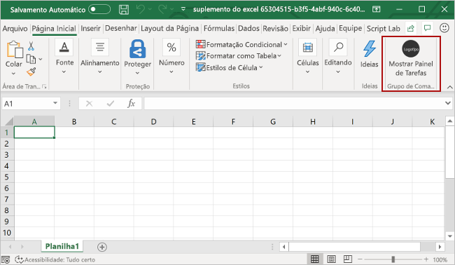

# <a name="customize-your-nodejs-sso-enabled-add-in"></a>Personalizar o suplemento habilitado para SSO do Node.js.

> [!IMPORTANT]
> Este artigo se baseia no complemento habilitado para SSO que é criado concluindo o início rápido de logom [único (SSO).](sso-quickstart.md) Conclua o início rápido antes de ler este artigo.

O início rápido do [SSO](sso-quickstart.md) cria um complemento habilitado para SSO que obtém as informações de perfil do usuário e as grava no documento ou na mensagem. Neste artigo, você verá o processo de atualização do complemento criado com o gerador Yeoman no início rápido do SSO, para adicionar uma nova funcionalidade que exija permissões diferentes.

## <a name="prerequisites"></a>Pré-requisitos

- Um Office que você criou seguindo as instruções no início [rápido do SSO.](sso-quickstart.md)

- Pelo menos alguns arquivos e pastas armazenados em OneDrive for Business em sua assinatura Microsoft 365 assinatura.

- [Node.js](https://nodejs.org) (a versão mais recente de [LTS](https://nodejs.org/about/releases)).

[!include[additional prerequisites](../includes/sso-tutorial-prereqs.md)]

## <a name="review-contents-of-the-project"></a>Revisar o conteúdo do projeto

Vamos começar com uma revisão rápida do projeto de complemento que você criou anteriormente [com o gerador Yeoman](sso-quickstart.md).

> [!NOTE]
> Em locais onde este artigo faz referência **a** arquivos de script usando.jsde arquivo, suponha que a extensão de arquivo **.ts,** em vez disso, se seu projeto foi criado com TypeScript.

[!include[project structure for an SSO-enabled add-in created with the Yeoman generator](../includes/sso-yeoman-project-structure.md)]

## <a name="add-new-functionality"></a>Adicionar nova funcionalidade

O complemento que você criou com o início rápido do SSO usa o Microsoft Graph para obter as informações de perfil do usuário e grava essas informações no documento ou na mensagem. Vamos alterar a funcionalidade do complemento para que ele obtém os nomes dos 10 principais arquivos e pastas do usuário OneDrive for Business e grava essas informações no documento ou na mensagem. A habilitação dessa nova funcionalidade requer a atualização das permissões do aplicativo no Azure e a atualização do código no projeto do complemento.

### <a name="update-app-permissions-in-azure"></a>Atualizar permissões de aplicativo no Azure

Antes que o add-in possa ler com êxito o conteúdo do OneDrive for Business do usuário, suas informações de registro de aplicativo no Azure devem ser atualizadas com as permissões apropriadas. Conclua as etapas a seguir para conceder ao aplicativo a permissão **Files.Read.All** e revogar a permissão **User.Read,** que não é mais necessária.

1. Navegue até o [portal do Azure](https://ms.portal.azure.com/#home) **e entre usando suas credenciais Microsoft 365 administrador.**

2. Navegue até **a página Registros do** aplicativo.
    > [!TIP]
    > Você pode fazer isso escolhendo o tile registros de **aplicativos** na home page do Azure ou usando a caixa de pesquisa na home page para encontrar e escolher Registros **de aplicativo.**

3. Na página **Registros de aplicativo,** escolha o aplicativo que você criou durante o início rápido.
    > [!TIP]
    > O **nome de** exibição do aplicativo corresponderá ao nome do complemento especificado ao criar o projeto com o gerador Yeoman.

4. Na página visão geral do aplicativo, escolha **permissões de API** no título **Gerenciar** no lado esquerdo da página.

5. Na linha **User.Read** da tabela de permissões, escolha as releições e, em seguida, selecione **Revogar** o consentimento do administrador no menu que aparece.

6. Selecione o **botão Sim, remova** em resposta ao prompt exibido.

7. Na linha **User.Read** da tabela permissões, escolha a reellipse e selecione **Remover permissão** do menu que aparece.

8. Selecione o **botão Sim, remova** em resposta ao prompt exibido.

9. Selecione o botão **Adicionar uma permissão**.

10. No painel que é aberto, escolha **Microsoft Graph** e, em seguida, escolha **Permissões delegadas**.

11. No painel **Solicitação de permissões da API:**

    a. Em **Arquivos,** selecione **Files.Read.All**.

    b. Selecione o **botão Adicionar permissões** na parte inferior do painel para salvar essas alterações de permissões.

12. Selecione o **botão Conceder consentimento de administrador para [nome do locatário].**

13. Selecione o **botão Sim** em resposta ao prompt exibido.

### <a name="update-code-in-the-add-in-project"></a>Atualizar código no projeto do complemento

Para habilitar o complemento para ler o conteúdo do OneDrive for Business do usuário OneDrive for Business, você precisará:

- Atualize o código que faz referência à URL do Microsoft Graph, parâmetros e escopo de acesso necessário.

- Atualize o código que define a interface do usuário do painel de tarefas, para que ele descreva com precisão a nova funcionalidade.

- Atualize o código que analisa a resposta do Microsoft Graph e o grava no documento ou na mensagem.

As etapas a seguir descrevem essas atualizações.

### <a name="changes-required-for-any-type-of-add-in"></a>Alterações necessárias para qualquer tipo de complemento

Conclua as etapas a seguir para o seu complemento, para alterar a URL do Microsoft Graph, os parâmetros e o escopo de acesso e atualize a interface do usuário do painel de tarefas. Essas etapas são as mesmas, independentemente de qual aplicativo Office seus destinos de complemento.

1. No **./. Arquivo ENV:**

    a. Substitua `GRAPH_URL_SEGMENT=/me` pelo seguinte: `GRAPH_URL_SEGMENT=/me/drive/root/children`

    b. Substitua `QUERY_PARAM_SEGMENT=` pelo seguinte: `QUERY_PARAM_SEGMENT=?$select=name&$top=10`

    c. Substitua `SCOPE=User.Read` pelo seguinte: `SCOPE=Files.Read.All`

2. Em **./manifest.xml**, encontre a linha próxima ao final do arquivo `<Scope>User.Read</Scope>` e substitua-a pela linha `<Scope>Files.Read.All</Scope>` .

3. Em **./src/helpers/fallbackauthdialog.js** (ou em **./src/helpers/fallbackauthdialog.ts** para um projeto TypeScript), localizar a cadeia de caracteres e substituí-la pela cadeia de caracteres , como é definido `https://graph.microsoft.com/User.Read` da seguinte `https://graph.microsoft.com/Files.Read.All` `requestObj` maneira:

    ```javascript
    var requestObj = {
      scopes: [`https://graph.microsoft.com/Files.Read.All`]
    };
    ```

    ```typescript
    var requestObj: Object = {
      scopes: [`https://graph.microsoft.com/Files.Read.All`]
    };
    ```

4. Em **./src/taskpane/taskpane.html**, encontre o elemento e atualize o texto dentro desse elemento para descrever a nova `<section class="ms-firstrun-instructionstep__header">` funcionalidade do complemento.

    ```html
    <section class="ms-firstrun-instructionstep__header">
        <h2 class="ms-font-m">This add-in demonstrates how to use single sign-on by making a call to Microsoft
            Graph to read content from OneDrive for Business.</h2>
        <div class="ms-firstrun-instructionstep__header--image"></div>
    </section>
    ```

5. Em **./src/taskpane/taskpane.html**, encontre e substitua ambas as ocorrências da cadeia de caracteres `Get My User Profile Information` pela cadeia de caracteres `Read my OneDrive for Business` .

    ```html
    <li class="ms-ListItem">
        <span class="ms-ListItem-primaryText">Click the <b>Read my OneDrive for Business</b>
            button.</span>
        <div class="clearfix"></div>
    </li>
    ```

    ```html
    <p align="center">
        <button id="getGraphDataButton" class="popupButton ms-Button ms-Button--primary"><span
                class="ms-Button-label">Read my OneDrive for Business</span></button>
    </p>
    ```

6. Em **./src/taskpane/taskpane.html,** encontre e substitua a cadeia de `Your user profile information will be displayed in the document.` caracteres pela cadeia de caracteres `The names of the top 10 files and folders in your OneDrive for Business will be displayed in the document or message.` .

    ```html
    <li class="ms-ListItem">
        <span class="ms-ListItem-primaryText">The names of the top 10 files and folders in your OneDrive for Business will be displayed in the document or message.</span>
        <div class="clearfix"></div>
    </li>
    ```

7. Atualize o código que analisa a resposta do Microsoft Graph e grava-a no documento ou na mensagem, seguindo as diretrizes na seção que corresponde ao seu tipo de complemento:

    - [Alterações necessárias para um Excel (JavaScript)](#changes-required-for-an-excel-add-in-javascript)
    - [Alterações necessárias para um Excel de Excel (TypeScript)](#changes-required-for-an-excel-add-in-typescript)
    - [Alterações necessárias para um Outlook de Outlook (JavaScript)](#changes-required-for-an-outlook-add-in-javascript)
    - [Alterações necessárias para um Outlook (TypeScript)](#changes-required-for-an-outlook-add-in-typescript)
    - [Alterações necessárias para um PowerPoint (JavaScript)](#changes-required-for-a-powerpoint-add-in-javascript)
    - [Alterações necessárias para um PowerPoint de PowerPoint (TypeScript)](#changes-required-for-a-powerpoint-add-in-typescript)
    - [Alterações necessárias para um complemento do Word (JavaScript)](#changes-required-for-a-word-add-in-javascript)
    - [Alterações necessárias para um complemento do Word (TypeScript)](#changes-required-for-a-word-add-in-typescript)

### <a name="changes-required-for-an-excel-add-in-javascript"></a>Alterações necessárias para um Excel (JavaScript)

Se o seu add-in for um Excel que foi criado com JavaScript, faça as seguintes alterações em **./src/helpers/documentHelper.js**.

1. Encontre a `writeDataToOfficeDocument` função e substitua-a pela função a seguir.

    ```javascript
    export function writeDataToOfficeDocument(result) {
      return new OfficeExtension.Promise(function(resolve, reject) {
        try {
          writeDataToExcel(result);
          resolve();
        } catch (error) {
          reject(Error("Unable to write data to document. " + error.toString()));
        }
      });
    }
    ```

2. Encontre a `filterUserProfileInfo` função e substitua-a pela função a seguir.

    ```javascript
    function filterOneDriveInfo(result) {
      let itemNames = [];
      let oneDriveItems = result['value'];
      for (let item of oneDriveItems) {
        itemNames.push(item['name']);
      }
      return itemNames;
    }
    ```

3. Encontre a `writeDataToExcel` função e substitua-a pela função a seguir.

    ```javascript
    function writeDataToExcel(result) {
      return Excel.run(function (context) {
        var sheet = context.workbook.worksheets.getActiveWorksheet();
        let data = [];
        let oneDriveInfo = filterOneDriveInfo(result);

        for (let i = 0; i < oneDriveInfo.length; i++) {
          if (oneDriveInfo[i] !== null) {
            let innerArray = [];
            innerArray.push(oneDriveInfo[i]);
            data.push(innerArray);
          }
        }

        const rangeAddress = `B5:B${5 + (data.length - 1)}`;
        const range = sheet.getRange(rangeAddress);
        range.values = data;
        range.format.autofitColumns();

        return context.sync();
      });
    }
    ```

4. Exclua a `writeDataToOutlook` função.

5. Exclua a `writeDataToPowerPoint` função.

6. Exclua a `writeDataToWord` função.

Depois de fazer essas alterações, vá para a seção [Experimentar](#try-it-out) este artigo para testar seu complemento atualizado.

### <a name="changes-required-for-an-excel-add-in-typescript"></a>Alterações necessárias para um Excel de Excel (TypeScript)

Se o seu add-in for um Excel que foi criado com TypeScript, abra **./src/taskpane/taskpane.ts**, encontre a função e substitua-a pela função a `writeDataToOfficeDocument` seguir.

```typescript
export function writeDataToOfficeDocument(result: Object): Promise<any> {
  return Excel.run(function(context) {
    const sheet = context.workbook.worksheets.getActiveWorksheet();
    let data: string[] = [];

    let itemNames: string[] = [];
    let oneDriveItems = result["value"];
    for (let item of oneDriveItems) {
      itemNames.push(item["name"]);
    }

    for (let i = 0; i < itemNames.length; i++) {
      if (itemNames[i] !== null) {
        let innerArray = [];
        innerArray.push(itemNames[i]);
        data.push(innerArray);
      }
    }

    const rangeAddress = `B5:B${5 + (data.length - 1)}`;
    const range = sheet.getRange(rangeAddress);
    range.values = data;
    range.format.autofitColumns();

    return context.sync();
  });
}
```

Depois de fazer essas alterações, vá para a seção [Experimentar](#try-it-out) este artigo para testar seu complemento atualizado.

### <a name="changes-required-for-an-outlook-add-in-javascript"></a>Alterações necessárias para um Outlook de Outlook (JavaScript)

Se o seu add-in for um Outlook que foi criado com JavaScript, faça as seguintes alterações em **./src/helpers/documentHelper.js**.

1. Encontre a `writeDataToOfficeDocument` função e substitua-a pela função a seguir.

    ```javascript
    export function writeDataToOfficeDocument(result) {
      return new OfficeExtension.Promise(function(resolve, reject) {
        try {
          writeDataToOutlook(result);
          resolve();
        } catch (error) {
          reject(Error("Unable to write data to message. " + error.toString()));
        }
      });
    }
    ```

2. Encontre a `filterUserProfileInfo` função e substitua-a pela função a seguir.

    ```javascript
    function filterOneDriveInfo(result) {
      let itemNames = [];
      let oneDriveItems = result['value'];
      for (let item of oneDriveItems) {
        itemNames.push(item['name']);
      }
      return itemNames;
    }
    ```

3. Encontre a `writeDataToOutlook` função e substitua-a pela função a seguir.

    ```javascript
    function writeDataToOutlook(result) {
      let data = [];
      let oneDriveInfo = filterOneDriveInfo(result);

      for (let i = 0; i < oneDriveInfo.length; i++) {
        if (oneDriveInfo[i] !== null) {
          data.push(oneDriveInfo[i]);
        }
      }

      let objectNames = "";
      for (let i = 0; i < data.length; i++) {
        objectNames += data[i] + "<br/>";
      }

      Office.context.mailbox.item.body.setSelectedDataAsync(objectNames, { coercionType: Office.CoercionType.Html });
    }
    ```

4. Exclua a `writeDataToExcel` função.

5. Exclua a `writeDataToPowerPoint` função.

6. Exclua a `writeDataToWord` função.

Depois de fazer essas alterações, vá para a seção [Experimentar](#try-it-out) este artigo para testar seu complemento atualizado.

### <a name="changes-required-for-an-outlook-add-in-typescript"></a>Alterações necessárias para um Outlook (TypeScript)

Se o seu add-in for um Outlook que foi criado com TypeScript, abra **./src/taskpane/taskpane.ts**, encontre a função e substitua-a pela função a `writeDataToOfficeDocument` seguir.

```typescript
export function writeDataToOfficeDocument(result: Object): void {
    let data: string[] = [];

    let itemNames: string[] = [];
    let oneDriveItems = result["value"];
    for (let item of oneDriveItems) {
        itemNames.push(item["name"]);
    };

    for (let i = 0; i < itemNames.length; i++) {
        if (itemNames[i] !== null) {
        data.push(itemNames[i]);
        }
    }

    let objectNames: string = "";
    for (let i = 0; i < data.length; i++) {
        objectNames += data[i] + "<br/>";
    }

    Office.context.mailbox.item.body.setSelectedDataAsync(objectNames, { coercionType: Office.CoercionType.Html });
}
```

Depois de fazer essas alterações, vá para a seção [Experimentar](#try-it-out) este artigo para testar seu complemento atualizado.

### <a name="changes-required-for-a-powerpoint-add-in-javascript"></a>Alterações necessárias para um PowerPoint (JavaScript)

Se o seu add-in for um PowerPoint que foi criado com JavaScript, faça as seguintes alterações em **./src/helpers/documentHelper.js**.

1. Encontre a `writeDataToOfficeDocument` função e substitua-a pela função a seguir.

    ```javascript
    export function writeDataToOfficeDocument(result) {
      return new OfficeExtension.Promise(function(resolve, reject) {
        try {
          writeDataToPowerPoint(result);
          resolve();
        } catch (error) {
          reject(Error("Unable to write data to document. " + error.toString()));
        }
      });
    }
    ```

2. Encontre a `filterUserProfileInfo` função e substitua-a pela função a seguir.

    ```javascript
    function filterOneDriveInfo(result) {
      let itemNames = [];
      let oneDriveItems = result['value'];
      for (let item of oneDriveItems) {
        itemNames.push(item['name']);
      }
      return itemNames;
    }
    ```

3. Encontre a `writeDataToPowerPoint` função e substitua-a pela função a seguir.

    ```javascript
    function writeDataToPowerPoint(result) {
      let data = [];
      let oneDriveInfo = filterOneDriveInfo(result);

      for (let i = 0; i < oneDriveInfo.length; i++) {
        if (oneDriveInfo[i] !== null) {
          data.push(oneDriveInfo[i]);
        }
      }

      let objectNames = "";
      for (let i = 0; i < data.length; i++) {
        objectNames += data[i] + "\n";
      }

      Office.context.document.setSelectedDataAsync(
        objectNames, 
        function(asyncResult) {
          if (asyncResult.status === Office.AsyncResultStatus.Failed) {
            throw asyncResult.error.message;
          }
      });
    }
    ```

4. Exclua a `writeDataToExcel` função.

5. Exclua a `writeDataToOutlook` função.

6. Exclua a `writeDataToWord` função.

Depois de fazer essas alterações, vá para a seção [Experimentar](#try-it-out) este artigo para testar seu complemento atualizado.

### <a name="changes-required-for-a-powerpoint-add-in-typescript"></a>Alterações necessárias para um PowerPoint de PowerPoint (TypeScript)

Se o seu add-in for um PowerPoint que foi criado com TypeScript, abra **./src/taskpane/taskpane.ts**, encontre a função e substitua-a pela função a `writeDataToOfficeDocument` seguir.

```typescript
export function writeDataToOfficeDocument(result: Object): void {
  let data: string[] = [];

  let itemNames: string[] = [];
  let oneDriveItems = result["value"];
  for (let item of oneDriveItems) {
    itemNames.push(item["name"]);
  };

  for (let i = 0; i < itemNames.length; i++) {
    if (itemNames[i] !== null) {
      data.push(itemNames[i]);
    }
  }

  let objectNames: string = "";
  for (let i = 0; i < data.length; i++) {
    objectNames += data[i] + "\n";
  }

  Office.context.document.setSelectedDataAsync(objectNames, function(asyncResult) {
    if (asyncResult.status === Office.AsyncResultStatus.Failed) {
      throw asyncResult.error.message;
    }
  });
}
```

Depois de fazer essas alterações, vá para a seção [Experimentar](#try-it-out) este artigo para testar seu complemento atualizado.

### <a name="changes-required-for-a-word-add-in-javascript"></a>Alterações necessárias para um complemento do Word (JavaScript)

Se o seu complemento for um complemento do Word criado com JavaScript, faça as seguintes alterações em **./src/helpers/documentHelper.js**.

1. Encontre a `writeDataToOfficeDocument` função e substitua-a pela função a seguir.

    ```javascript
    export function writeDataToOfficeDocument(result) {
      return new OfficeExtension.Promise(function(resolve, reject) {
        try {
          writeDataToWord(result);
          resolve();
        } catch (error) {
          reject(Error("Unable to write data to document. " + error.toString()));
        }
      });
    }
    ```

2. Encontre a `filterUserProfileInfo` função e substitua-a pela função a seguir.

    ```javascript
    function filterOneDriveInfo(result) {
      let itemNames = [];
      let oneDriveItems = result['value'];
      for (let item of oneDriveItems) {
        itemNames.push(item['name']);
      }
      return itemNames;
    }
    ```

3. Encontre a `writeDataToWord` função e substitua-a pela função a seguir.

    ```javascript
    function writeDataToWord(result) {
      return Word.run(function (context) {
        let data = [];
        let oneDriveInfo = filterOneDriveInfo(result);

        for (let i = 0; i < oneDriveInfo.length; i++) {
          if (oneDriveInfo[i] !== null) {
            data.push(oneDriveInfo[i]);
          }
        }

        const documentBody = context.document.body;
        for (let i = 0; i < data.length; i++) {
          if (data[i] !== null) {
            documentBody.insertParagraph(data[i], "End");
          }
        }

        return context.sync();
      });
    }
    ```

4. Exclua a `writeDataToExcel` função.

5. Exclua a `writeDataToOutlook` função.

6. Exclua a `writeDataToPowerPoint` função.

Depois de fazer essas alterações, vá para a seção [Experimentar](#try-it-out) este artigo para testar seu complemento atualizado.

### <a name="changes-required-for-a-word-add-in-typescript"></a>Alterações necessárias para um complemento do Word (TypeScript)

Se o seu complemento for um complemento do Word criado com TypeScript, abra **./src/taskpane/taskpane.ts**, encontre a função e substitua-a pela função a `writeDataToOfficeDocument` seguir.

```typescript
export function writeDataToOfficeDocument(result: Object): Promise<any> {
  return Word.run(function(context) {
    let data: string[] = [];

    let itemNames: string[] = [];
    let oneDriveItems = result["value"];
    for (let item of oneDriveItems) {
      itemNames.push(item["name"]);
    };

    for (let i = 0; i < itemNames.length; i++) {
      if (itemNames[i] !== null) {
        data.push(itemNames[i]);
      }
    }

    const documentBody: Word.Body = context.document.body;
    for (let i = 0; i < data.length; i++) {
      if (data[i] !== null) {
        documentBody.insertParagraph(data[i], "End");
      }
    }
    return context.sync();
  });
}
```

Depois de fazer essas alterações, continue até a seção [Experimentar](#try-it-out) este artigo para experimentar seu complemento atualizado.

## <a name="try-it-out"></a>Experimente

Se o seu add-in for um Excel, Word ou PowerPoint, conclua as etapas na seção a seguir para experimentar. Se o seu Outlook é um Outlook, conclua as etapas na [seção](#outlook) Outlook em vez disso.

### <a name="excel-word-and-powerpoint"></a>Excel, Word e PowerPoint

Execute as etapas a seguir para experimentar um suplemento do Excel, do Word ou do PowerPoint.

1. Na pasta raiz do projeto, execute o seguinte comando para criar o projeto, inicie o servidor Web local e o sideload do seu add-in no aplicativo cliente Office cliente selecionado anteriormente.

    > [!NOTE]
    > Os Suplementos do Office devem usar HTTPS, e não HTTP, mesmo durante o desenvolvimento. Se for solicitado a instalação de um certificado após executar um dos seguintes comandos, aceite a solicitação para instalar o certificado que o gerador do Yeoman fornecer.

    ```command&nbsp;line
    npm start
    ```

2. No aplicativo cliente do Office que é aberto quando você executar o comando anterior (ou seja, Excel, Word ou PowerPoint), certifique-se de estar conectado com um usuário membro da mesma organização Microsoft 365 que a conta de administrador do Microsoft 365 que você usou para se conectar ao Azure durante a configuração [do SSO](sso-quickstart.md#configure-sso) para o aplicativo. Isso estabelecerá as condições apropriadas para que o SSO seja bem-sucedido. 

3. No aplicativo cliente do Office, escolha a guia **Página Inicial** e o botão **Mostrar Painel de Tarefas** na faixa de opções para abrir o painel de tarefas do suplemento. A imagem a seguir mostra esse botão no Excel.

    

4. Na parte inferior do painel de tarefas, escolha o botão **Ler meu** OneDrive for Business para iniciar o processo de SSO.

5. Se uma janela de diálogo for exibida solicitando permissões em nome do suplemento, isso significa que não há suporte ao SSO no seu cenário e, em vez disso, o suplemento voltou para um método alternativo de autenticação do usuário. Isso poderá ocorrer quando o administrador do locatário não tiver dado ao suplemento uma permissão de acesso ao Microsoft Graph, ou quando o usuário não estiver logado no Office com uma conta válida da Microsoft ou uma conta corporativa ou de estudante do Microsoft 365. Escolha o botão **Aceitar** na janela de diálogo para continuar.

    

    > [!NOTE]
    > Após um usuário aceitar a solicitação de permissões, elas não serão solicitadas novamente no futuro.

6. O complemento lê os dados do usuário OneDrive for Business e grava os nomes dos 10 principais arquivos e pastas no documento. A imagem a seguir mostra um exemplo de nomes de arquivo e pasta gravados em uma Excel de trabalho.

    

### <a name="outlook"></a>Outlook

Execute as etapas a seguir para experimentar um suplemento do Outlook.

1. Na pasta raiz do projeto, execute o seguinte comando para criar o projeto, inicie o servidor Web local e fazer sideload do seu complemento. 

    > [!NOTE]
    > Os Suplementos do Office devem usar HTTPS, e não HTTP, mesmo durante o desenvolvimento. Se for solicitado a instalação de um certificado após executar um dos seguintes comandos, aceite a solicitação para instalar o certificado que o gerador do Yeoman fornecer. Você também pode executar o prompt de comando ou terminal como administrador para que as alterações sejam feitas.

    ```command&nbsp;line
    npm start
    ```

2. Certifique-se de estar conectado Outlook um usuário membro da mesma organização do Microsoft 365 que a conta de administrador do Microsoft 365 que você usou para se conectar ao Azure durante a configuração do [SSO](sso-quickstart.md#configure-sso) para o aplicativo. Isso estabelecerá as condições apropriadas para que o SSO seja bem-sucedido.

3. Escreva uma nova mensagem no Outlook.

4. Na janela redigir mensagem, escolha o botão **Exibir painel de tarefas** na faixa de opções para abrir o painel de tarefas de suplemento.

    

5. Na parte inferior do painel de tarefas, escolha o botão **Ler meu** OneDrive for Business para iniciar o processo de SSO.

6. Se uma janela de diálogo for exibida solicitando permissões em nome do suplemento, isso significa que não há suporte ao SSO no seu cenário e, em vez disso, o suplemento voltou para um método alternativo de autenticação do usuário. Isso poderá ocorrer quando o administrador do locatário não tiver dado ao suplemento uma permissão de acesso ao Microsoft Graph, ou quando o usuário não estiver logado no Office com uma conta válida da Microsoft ou uma conta corporativa ou de estudante do Microsoft 365. Escolha o botão **Aceitar** na janela de diálogo para continuar.

    

    > [!NOTE]
    > Após um usuário aceitar a solicitação de permissões, elas não serão solicitadas novamente no futuro.

7. O add-in lê dados do usuário OneDrive for Business e grava os nomes dos 10 principais arquivos e pastas no corpo da mensagem de email.

    

## <a name="next-steps"></a>Próximas etapas

Parabéns, você personalizou com êxito a funcionalidade do complemento habilitado para SSO que você criou com o gerador Yeoman no início [rápido do SSO.](sso-quickstart.md) Para saber mais sobre as etapas de configuração do SSO que o gerador Yeoman concluiu automaticamente e o código que facilita o processo de SSO, confira o tutorial [Criar um Suplemento do Office com Node.js que usa logon único](../develop/create-sso-office-add-ins-nodejs.md).

## <a name="see-also"></a>Confira também

- [Habilitar o logon único para Suplementos do Office](../develop/sso-in-office-add-ins.md)
- [Início rápido logon único (SSO).](sso-quickstart.md)
- [Criar um Suplemento do Office com Node.js que usa logon único](../develop/create-sso-office-add-ins-nodejs.md)
- [Solucionar problemas de mensagens de erro no logon único (SSO)](../develop/troubleshoot-sso-in-office-add-ins.md)
