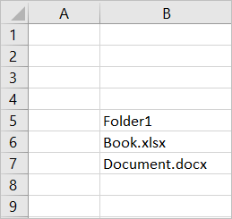

# <a name="add-microsoft-graph-functionality-to-your-sso-quick-start-project"></a>Adicionar a funcionalidade Graph Microsoft ao seu projeto de início rápido de SSO

> [!IMPORTANT]
> Este artigo se baseia no suplemento habilitado para SSO criado concluindo o início rápido do [SSO (logon único](sso-quickstart.md)). Conclua o início rápido antes de ler este artigo.

O [início rápido do SSO](sso-quickstart.md) cria um suplemento habilitado para SSO que obtém as informações de perfil do usuário conectado e as grava no documento ou na mensagem. Neste artigo, você percorrerá o processo de atualização do suplemento que criou com o gerador Yeoman no início rápido do SSO, para adicionar uma nova funcionalidade que requer permissões diferentes.

## <a name="prerequisites"></a>Pré-requisitos

- Um Office suplemento que você criou seguindo as instruções no início [rápido do SSO](sso-quickstart.md).

- Pelo menos alguns arquivos e pastas armazenados OneDrive for Business em sua Microsoft 365 assinatura.

- [Node.js](https://nodejs.org) (a versão mais recente de [LTS](https://nodejs.org/about/releases)).

[!include[additional prerequisites](../includes/sso-tutorial-prereqs.md)]

## <a name="review-contents-of-the-project"></a>Revisar o conteúdo do projeto

Vamos começar com uma revisão rápida do projeto de suplemento que você criou anteriormente [com o gerador Yeoman](sso-quickstart.md).

> [!NOTE]
> Em locais em que este artigo faz referência a arquivos de script usando **.js** de arquivo, suponha que a extensão de arquivo **.ts** , em vez disso, se o projeto foi criado com TypeScript.

[!include[project structure for an SSO-enabled add-in created with the Yeoman generator](../includes/sso-yeoman-project-structure.md)]

## <a name="add-new-functionality"></a>Adicionar nova funcionalidade

O suplemento que você criou com o início rápido do SSO usa o Microsoft Graph para obter as informações de perfil do usuário conectado e grava essas informações no documento ou na mensagem. Vamos alterar a funcionalidade do suplemento para que ele obtenha os nomes dos 10 principais arquivos e pastas do OneDrive for Business do usuário conectado e grave essas informações no documento ou na mensagem. Habilitar essa nova funcionalidade requer a atualização de permissões de aplicativo no Azure e a atualização do código dentro do projeto de suplemento.

### <a name="update-app-permissions-in-azure"></a>Atualizar permissões de aplicativo no Azure

Antes que o suplemento possa ler com êxito o conteúdo do OneDrive for Business do usuário, suas informações de registro de aplicativo no Azure devem ser atualizadas com as permissões apropriadas. Conclua as etapas a seguir para conceder ao aplicativo a permissão **Files.Read.All** e revogar a **permissão User.Read** , que não é mais necessária.

1. Entre [no portal do Azure com](https://portal.azure.com) suas **credenciais Microsoft 365 administrador**.

1. Vá para a **Registros de aplicativo** e escolha o registro de aplicativo que você criou durante o início rápido.
    > [!TIP]
    > O **nome de** exibição do aplicativo corresponde ao nome do suplemento especificado quando você criou o projeto com o gerador Yeoman.

1. Em **Gerenciar**, escolha **permissões de API**.

1. Na linha **User.Read** da tabela de permissões, escolha as reticências e, em seguida, selecione  Revogar consentimento do administrador no menu exibido.

    :::image type="content" source="../images/app-registration-revoke-admin-consent.png" alt-text="Captura de tela do botão revogar consentimento do administrador na página de permissões da API.":::

1. Selecione o **botão Sim, remova** em resposta ao prompt exibido.

1. Na linha **User.Read** da tabela de permissões, escolha as reticências e, em seguida, selecione **Remover permissão no** menu exibido.

    :::image type="content" source="../images/app-registration-remove-permission.png" alt-text="Captura de tela do botão remover permissão na página de permissões da API.":::

1. Selecione o **botão Sim, remova** em resposta ao prompt exibido.

1. Selecione o botão **Adicionar uma permissão**.

1. No painel que é aberto, escolha **Microsoft Graph** e, em seguida, escolha **Permissões delegadas**.

1. No painel **Solicitar permissões de API** :

    a. Em **Arquivos**, selecione **Files.Read.All**.

    b. Selecione o **botão Adicionar permissões** na parte inferior do painel para salvar essas alterações de permissões.

1. Selecione o **botão Conceder consentimento do administrador para [nome do locatário]** .

1. Selecione o **botão** Sim em resposta ao prompt exibido.

### <a name="update-code-in-the-add-in-project"></a>Atualizar código no projeto de suplemento

Para habilitar o suplemento para ler o conteúdo do OneDrive for Business do usuário conectado, você precisará:

- Atualize o código que faz referência à URL do Microsoft Graph, aos parâmetros e ao escopo de acesso necessário.

- Atualize o código que define a interface do usuário do painel de tarefas para que ele descreva com precisão a nova funcionalidade.

- Atualize o código que analisa a resposta do Microsoft Graph e grava-a no documento ou na mensagem.

As etapas a seguir descrevem essas atualizações.

### <a name="changes-required-for-any-type-of-add-in"></a>Alterações necessárias para qualquer tipo de suplemento

Conclua as etapas a seguir para o suplemento, para alterar a URL do Microsoft Graph, os parâmetros e o escopo de acesso e atualizar a interface do usuário do painel de tarefas. Essas etapas são as mesmas, independentemente de qual aplicativo Office seus destinos de suplemento.

1. No **./. Arquivo ENV** :

    a. Substituir `GRAPH_URL_SEGMENT=/me` por `GRAPH_URL_SEGMENT=/me/drive/root/children`

    b. Substituir `QUERY_PARAM_SEGMENT=` por `QUERY_PARAM_SEGMENT=?$select=name&$top=10`

    c. Substituir `SCOPE=User.Read` por `SCOPE=Files.Read.All`

1. Em **./manifest.xml**, localize a linha `<Scope>User.Read</Scope>` perto do final do arquivo e substitua-a pela linha `<Scope>Files.Read.All</Scope>`.

1. Em **./src/helpers/fallbackauthdialog.js** (ou em **./src/helpers/fallbackauthdialog.ts** para um projeto TypeScript), `https://graph.microsoft.com/User.Read` `https://graph.microsoft.com/Files.Read.All`localize a cadeia de caracteres e substitua-a pela cadeia de caracteres, `requestObj` de modo que seja definido da seguinte maneira:

    ```javascript
    var requestObj = {
      scopes: [`https://graph.microsoft.com/Files.Read.All`]
    };
    ```

    ```typescript
    var requestObj: Object = {
      scopes: [`https://graph.microsoft.com/Files.Read.All`]
    };
    ```

1. Em **./src/taskpane/taskpane.html**, `<section class="ms-firstrun-instructionstep__header">` localize o elemento e atualize o texto dentro desse elemento para descrever a nova funcionalidade do suplemento.

    ```html
    <section class="ms-firstrun-instructionstep__header">
        <h2 class="ms-font-m">This add-in demonstrates how to use single sign-on by making a call to Microsoft
            Graph to read content from OneDrive for Business.</h2>
        <div class="ms-firstrun-instructionstep__header--image"></div>
    </section>
    ```

1. Em **./src/taskpane/taskpane.html**, localize ambas as ocorrências da cadeia de caracteres `Get My User Profile Information` e substitua-a por `Read my OneDrive for Business`.

    ```html
    <li class="ms-ListItem">
        <span class="ms-ListItem-primaryText">Click the <b>Read my OneDrive for Business</b>
            button.</span>
        <div class="clearfix"></div>
    </li>
    ```

    ```html
    <p align="center">
        <button id="getGraphDataButton" class="popupButton ms-Button ms-Button--primary"><span
                class="ms-Button-label">Read my OneDrive for Business</span></button>
    </p>
    ```

1. Em **./src/taskpane/taskpane.html**, localize a cadeia de `Your user profile information will be displayed in the document.` caracteres e substitua-a por `The names of the top 10 files and folders in your OneDrive for Business will be displayed in the document or message.`.

    ```html
    <li class="ms-ListItem">
        <span class="ms-ListItem-primaryText">The names of the top 10 files and folders in your OneDrive for Business will be displayed in the document or message.</span>
        <div class="clearfix"></div>
    </li>
    ```

1. Atualize o código que analisa a resposta do Microsoft Graph e grava-a no documento ou na mensagem, seguindo as diretrizes na seção que corresponde ao seu tipo de suplemento:

    - [Alterações necessárias para um Office suplemento (JavaScript)](#changes-required-for-an-office-add-in-javascript)
    - [Alterações necessárias para um Office suplemento (TypeScript)](#changes-required-for-an-office-add-in-typescript)

### <a name="changes-required-for-an-office-add-in-javascript"></a>Alterações necessárias para um Office suplemento (JavaScript)

Se o suplemento Office gerado usar JavaScript, faça as seguintes alterações em **./src/helpers/documentHelper.js**.

1. Localize `filterUserProfileInfo` a função e substitua-a pela função a seguir.

    ```javascript
    function filterOneDriveInfo(result) {
      let itemNames = [];
      let oneDriveItems = result['value'];
      for (let item of oneDriveItems) {
        itemNames.push(item['name']);
      }
      return itemNames;
    }
    ```

1. Pesquise `filterUserProfileInfo` e substitua-o por `filterOneDriveInfo`. Deve haver quatro instâncias a serem substituídas.

1. Salve as alterações.

Depois de fazer essas alterações, pule para a seção Experimente este [](#try-it-out) artigo para experimentar o suplemento atualizado.

### <a name="changes-required-for-an-office-add-in-typescript"></a>Alterações necessárias para um Office suplemento (TypeScript)

Se o suplemento Office gerado usa TypeScript, abra **./src/taskpane/taskpane.ts**.

1. Localize `writeDataToOfficeDocument` a função e substitua-a pelo código a seguir, dependendo de qual Office o suplemento usa (Excel, Outlook, Word ou PowerPoint)

#### <a name="excel-code"></a>Excel código

```typescript
  export function writeDataToOfficeDocument(result: Object): Promise<any> {
  return Excel.run(function (context) {
    const sheet = context.workbook.worksheets.getActiveWorksheet();
    let data: string[][];

    // Get just the filenames from results
    data = result["value"].map((item) => {
      return [item.name];
    });

    const rangeAddress = `B5:B${5 + (data.length - 1)}`;
    const range = sheet.getRange(rangeAddress);
    range.values = data;
    range.format.autofitColumns();

    return context.sync();
  });
}
```

#### <a name="outlook-code"></a>Outlook código

```typescript
export function writeDataToOfficeDocument(result: Object): void {
  // Get just the filenames from results.
  const data: string[] = result["value"].map((item) => {
    return item.name;
  });

  let userInfo: string = "";
  for (let i = 0; i < data.length; i++) {
    userInfo += data[i] + "</br>";
  }
  Office.context.mailbox.item.body.setSelectedDataAsync(userInfo, { coercionType: Office.CoercionType.Html });
}
```

#### <a name="word-code"></a>Código do Word

```typescript
export function writeDataToOfficeDocument(result: Object): Promise<any> {
  return Word.run(function (context) {
    // Get just the filenames from results.
    const data: string[] = result["value"].map((item) => {
      return item.name;
    });

    const documentBody: Word.Body = context.document.body;
    for (let i = 0; i < data.length; i++) {
      if (data[i] !== null) {
        documentBody.insertParagraph(data[i], "End");
      }
    }
    return context.sync();
  });
}
```

#### <a name="powerpoint-code"></a>PowerPoint código

```typescript
export function writeDataToOfficeDocument(result: Object): void {
  // Get just the filenames from results.
  const data: string[] = result["value"].map((item) => {
    return item.name;
  });
  let userInfo: string = "";
  for (let i = 0; i < data.length; i++) {
    userInfo += data[i] + "\n";
  }

  Office.context.document.setSelectedDataAsync(userInfo, function (asyncResult) {
    if (asyncResult.status === Office.AsyncResultStatus.Failed) {
      throw asyncResult.error.message;
    }
  });
}
```

## <a name="try-it-out"></a>Experimente

Se o suplemento for um Excel, Word ou PowerPoint suplemento, conclua as etapas na seção a seguir para experimentá-lo. Se o suplemento for um Outlook, conclua as etapas na seção [Outlook](#outlook) em vez disso.

### <a name="excel-word-and-powerpoint"></a>Excel, Word e PowerPoint

Execute as etapas a seguir para experimentar um suplemento do Excel, do Word ou do PowerPoint.

1. Na pasta raiz do projeto, execute o comando a seguir para compilar o projeto, iniciar o servidor Web local e fazer sideload do suplemento no aplicativo cliente selecionado anteriormente Office cliente.

    [!INCLUDE [alert use https](../includes/alert-use-https.md)]

    ```command&nbsp;line
    npm start
    ```

2. No aplicativo cliente do Office que é aberto quando você executa o comando anterior (ou seja, Excel, Word ou PowerPoint), verifique se você está conectado com um usuário que é membro da mesma organização do Microsoft 365 que a conta de administrador do Microsoft 365 que você usou para se conectar ao Azure ao configurar o [SSO](sso-quickstart.md#configure-sso)  para o aplicativo. Isso estabelecerá as condições apropriadas para que o SSO seja bem-sucedido. 

3. No aplicativo cliente do Office, escolha a guia **Página Inicial** e, em seguida, escolha o botão **Mostrar Painel de Tarefas** na faixa de opções para abrir o painel de tarefas do suplemento. A imagem a seguir mostra esse botão no Excel.

    

4. Na parte inferior do painel de tarefas, escolha o botão **Ler meu OneDrive for Business** para iniciar o processo de SSO.

5. Se uma janela de diálogo for exibida solicitando permissões em nome do suplemento, isso significa que não há suporte ao SSO no seu cenário e, em vez disso, o suplemento voltou para um método alternativo de autenticação do usuário. Isso poderá ocorrer quando o administrador do locatário não tiver dado ao suplemento uma permissão de acesso ao Microsoft Graph, ou quando o usuário não estiver logado no Office com uma conta válida da Microsoft ou uma conta corporativa ou de estudante do Microsoft 365. Escolha o botão **Aceitar** na janela de diálogo para continuar.

    

    > [!NOTE]
    > Após um usuário aceitar a solicitação de permissões, elas não serão solicitadas novamente no futuro.

6. O suplemento lê dados do OneDrive for Business do usuário conectado e grava os nomes dos 10 principais arquivos e pastas no documento. A imagem a seguir mostra um exemplo de nomes de arquivo e pasta gravados em uma Excel de trabalho.

    

### <a name="outlook"></a>Outlook

Execute as etapas a seguir para experimentar um suplemento do Outlook.

1. Na pasta raiz do projeto, execute o comando a seguir para compilar o projeto, iniciar o servidor Web local e fazer sideload do suplemento. 

    [!INCLUDE [alert use https](../includes/alert-use-https.md)]

    ```command&nbsp;line
    npm start
    ```

2. Verifique se você está conectado ao Outlook com um usuário que seja membro da mesma organização do Microsoft 365 que a conta de administrador do Microsoft 365 que você usou para se conectar ao Azure ao configurar o [SSO](sso-quickstart.md#configure-sso) para o aplicativo. Isso estabelecerá as condições apropriadas para que o SSO seja bem-sucedido.

3. Escreva uma nova mensagem no Outlook.

4. Na janela redigir mensagem, escolha o botão **Exibir painel de tarefas** na faixa de opções para abrir o painel de tarefas de suplemento.

    

5. Na parte inferior do painel de tarefas, escolha o botão **Ler meu OneDrive for Business** para iniciar o processo de SSO.

6. Se uma janela de diálogo for exibida solicitando permissões em nome do suplemento, isso significa que não há suporte ao SSO no seu cenário e, em vez disso, o suplemento voltou para um método alternativo de autenticação do usuário. Isso poderá ocorrer quando o administrador do locatário não tiver dado ao suplemento uma permissão de acesso ao Microsoft Graph, ou quando o usuário não estiver logado no Office com uma conta válida da Microsoft ou uma conta corporativa ou de estudante do Microsoft 365. Escolha o botão **Aceitar** na janela de diálogo para continuar.

    

    > [!NOTE]
    > Após um usuário aceitar a solicitação de permissões, elas não serão solicitadas novamente no futuro.

7. O suplemento lê dados do OneDrive for Business do usuário conectado e grava os nomes dos 10 principais arquivos e pastas no corpo da mensagem de email.

    

## <a name="next-steps"></a>Próximas etapas

Parabéns, você personalizou com êxito a funcionalidade do suplemento habilitado para SSO que você criou com o gerador Yeoman no [início rápido do SSO](sso-quickstart.md). Para saber mais sobre as etapas de configuração do SSO que o gerador Yeoman concluiu automaticamente e o código que facilita o processo de SSO, confira o tutorial [Criar um Suplemento do Office com Node.js que usa logon único](../develop/create-sso-office-add-ins-nodejs.md).

## <a name="see-also"></a>Confira também

- [Habilitar o logon único para Suplementos do Office](../develop/sso-in-office-add-ins.md)
- [Início rápido logon único (SSO).](sso-quickstart.md)
- [Criar um Suplemento do Office com Node.js que usa logon único](../develop/create-sso-office-add-ins-nodejs.md)
- [Solucionar problemas de mensagens de erro no logon único (SSO)](../develop/troubleshoot-sso-in-office-add-ins.md)
- [Usando Visual Studio Code para publicar](../publish/publish-add-in-vs-code.md#using-visual-studio-code-to-publish)