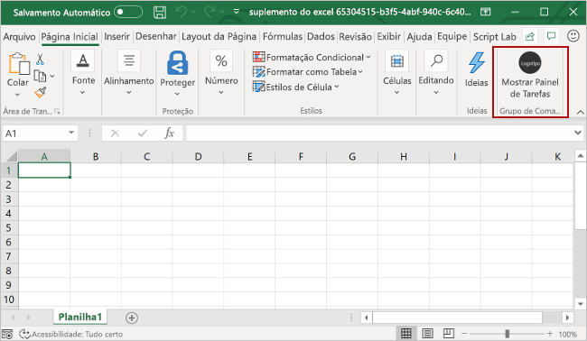
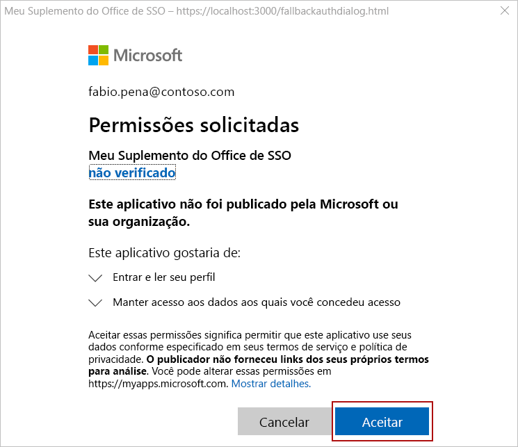
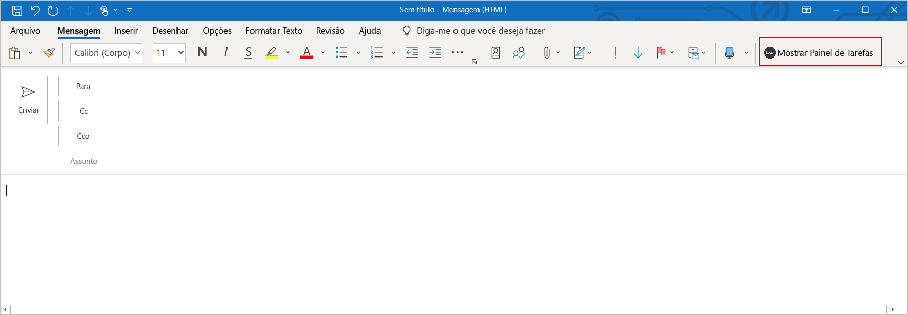
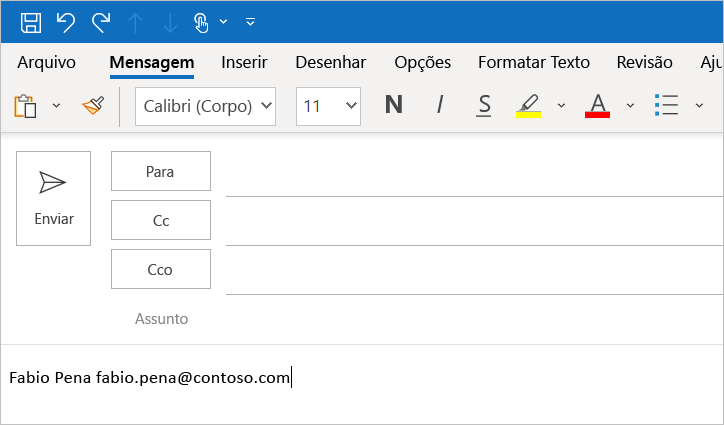

# <a name="use-the-yeoman-generator-to-create-an-office-add-in-that-uses-single-sign-on"></a>Use o gerador Yeoman para criar um Suplemento do Office que utilize o logon único.

Neste artigo, você seguirá pelo processo de uso do gerador Yeoman para criar um Suplemento do Office para Excel, Outlook, Word ou PowerPoint que usa o logon único (SSO) sempre que possível, e usa um método alternativo de autenticação do usuário quando não há suporte ao SSO.

> [!TIP]
> Antes de tentar concluir o início rápido, revise [Habilitar o logon único para Suplementos do Office](../develop/sso-in-office-add-ins.md) para aprender conceitos básicos sobre o SSO em Suplementos do Office.

O gerador Yeoman simplifica o processo de criação de um suplemento de SSO, automatizando as etapas necessárias para configurar o SSO no Azure e gerando o código necessário para um suplemento usar o SSO. Para um passo a passo detalhado descrevendo como concluir manualmente as etapas que o gerador Yeoman automatiza, confira o tutorial [Criar um Suplemento do Office com Node.js que usa logon único](../develop/create-sso-office-add-ins-nodejs.md).

## <a name="prerequisites"></a>Pré-requisitos

- [Node.js](https://nodejs.org) (a versão mais recente de [LTS](https://nodejs.org/about/releases)).

- A versão mais recente do [Yeoman](https://github.com/yeoman/yo) e do [Yeoman gerador de Suplementos do Office](https://github.com/OfficeDev/generator-office). Para instalar essas ferramentas globalmente, execute o seguinte comando por meio do prompt de comando.

    ```command&nbsp;line
    npm install -g yo generator-office
    ```

    [!include[note to update Yeoman generator](../includes/note-yeoman-generator-update.md)]

- Se você estiver usando um Mac e não tiver a CLI do Azure instalada no computador, instale o [Homebrew](https://brew.sh/). O script de configuração do SSO executado durante o início rápido usará o Homebrew para instalar a CLI do Azure e, em seguida, usará a CLI do Azure para configurar o SSO no Azure.

## <a name="create-the-add-in-project"></a>Criar o projeto do suplemento

> [!TIP]
> O gerador Yeoman pode criar um Suplemento do Office habilitado para SSO do Excel, Outlook, Word ou PowerPoint e pode ser criado com o tipo de script JavaScript ou TypeScript. As instruções a seguir especificam o `JavaScript` e o `Excel`, mas você deverá escolher o tipo de script e o aplicativo cliente do Office que atendem melhor ao seu cenário.

[!include[Yeoman generator create project guidance](../includes/yo-office-command-guidance.md)]

- **Escolha o tipo de projeto:** `Office Add-in Task Pane project supporting single sign-on`
- **Escolha o tipo de script:** `Javascript`
- **Qual será o nome do suplemento?** `My SSO Office Add-in`
- **Você gostaria de proporcionar suporte para qual aplicativo cliente do Office?** `Excel`


Depois que você concluir o assistente, o gerador criará o projeto e instalará os componentes Node de suporte.

[!include[Yeoman generator next steps](../includes/yo-office-next-steps.md)]

## <a name="explore-the-project"></a>Explore o projeto

O projeto de suplemento que você criou com o gerador do Yeoman contém um código para um suplemento de painel de tarefas habilitado para SSO.

[!include[project structure for an SSO-enabled add-in created with the Yeoman generator](../includes/sso-yeoman-project-structure.md)]

## <a name="configure-sso"></a>Configure o SSO

Nesse ponto, seu projeto de suplemento foi criado e contém o código necessário para facilitar o processo de SSO. Depois, execute as etapas a seguir para configurar o SSO do seu suplemento.

1. Navegue até a pasta raiz do projeto.

    ```command&nbsp;line
    cd "My SSO Office Add-in"
    ```

2. Execute o comando a seguir para configurar o SSO do suplemento.

    ```command&nbsp;line
    npm run configure-sso
    ```

    > [!WARNING]
    > Esse comando falhará se o locatário estiver configurado para exigir autenticação de dois fatores. Nesse cenário, será necessário concluir manualmente as etapas de configuração do SSO e registro do aplicativo Azure, conforme descrito no tutorial [Criar um Suplemento do Office com Node.js que usa logon único](../develop/create-sso-office-add-ins-nodejs.md).

3. Uma janela de navegador da Web será exibida e solicitará que você entre no Azure.  Entre no Azure com as suas credenciais de administrador do Microsoft 365. Essas credenciais serão usadas para registrar um novo aplicativo no Azure e definir as configurações necessárias para o SSO.

    > [!NOTE]
    > Se você entrar no Azure usando credenciais de não administrador durante essa etapa, o script `configure-sso` não conseguirá fornecer consentimento de administrador para o suplemento aos usuários da organização. Portanto, o SSO não estará disponível aos usuários do suplemento e eles serão solicitados a entrar.

4. Depois de inserir suas credenciais, feche a janela do navegador e retorne ao prompt de comando. Durante o processo de configuração do SSO, você verá mensagens de status sendo gravadas no console. Conforme descrito nas mensagens do console, os arquivos no projeto do suplemento que o gerador Yeoman criou são atualizados automaticamente com os dados necessários ao processo de SSO.

## <a name="try-it-out"></a>Experimente

Se você tiver criado um suplemento do Excel, do Word ou do PowerPoint, conclua as etapas na seção a seguir para testá-lo. Se você criou um suplemento do Outlook, conclua as etapas na seção [Outlook](#outlook).

### <a name="excel-word-and-powerpoint"></a>Excel, Word e PowerPoint

Execute as etapas a seguir para experimentar um suplemento do Excel, do Word ou do PowerPoint.

1. Quando o processo de configuração do SSO for concluído, execute o seguinte comando para criar o projeto: inicie o servidor Web local e sideload o suplemento no aplicativo cliente do Office selecionado anteriormente.

    > [!NOTE]
    > Os Suplementos do Office devem usar HTTPS, e não HTTP, mesmo durante o desenvolvimento. Se for solicitado a instalação de um certificado após executar um dos seguintes comandos, aceite a solicitação para instalar o certificado que o gerador do Yeoman fornecer.

    ```command&nbsp;line
    npm start
    ```

2. No aplicativo cliente do Office que é aberto ao executar o comando anterior (por exemplo, Excel, Word ou PowerPoint), certifique-se de estar conectado com um usuário que seja membro da mesma organização do Microsoft 365, como uma conta de administrador do Microsoft 365 que você usou para se conectar ao Azure ao configurar o SSO na etapa 3 da [seção anterior](#configure-sso). Isso estabelecerá as condições apropriadas para que o SSO seja bem-sucedido.

3. No aplicativo cliente do Office, escolha a guia **Página Inicial** e o botão **Mostrar Painel de Tarefas** na faixa de opções para abrir o painel de tarefas do suplemento. A imagem a seguir mostra esse botão no Excel.

    

4. Na parte inferior do painel de tarefas, escolha o botão **Obter Informações do Meu Perfil de Usuário** para iniciar o processo de SSO.

5. Se uma janela de diálogo for exibida solicitando permissões em nome do suplemento, isso significa que não há suporte ao SSO no seu cenário e, em vez disso, o suplemento voltou para um método alternativo de autenticação do usuário. Isso poderá ocorrer quando o administrador do locatário não tiver dado ao suplemento uma permissão de acesso ao Microsoft Graph, ou quando o usuário não estiver logado no Office com uma conta válida da Microsoft ou uma conta corporativa ou de estudante do Microsoft 365. Escolha o botão **Aceitar** na janela de diálogo para continuar.

    

    > [!NOTE]
    > Após um usuário aceitar a solicitação de permissões, elas não serão solicitadas novamente no futuro.

6. O suplemento recupera as informações de perfil do usuário conectado e as grava no documento. A imagem a seguir mostra um exemplo de informações de perfil gravadas em uma planilha do Excel.

    

### <a name="outlook"></a>Outlook

Execute as etapas a seguir para experimentar um suplemento do Outlook.

1. Quando concluir o processo de configuração de SSO, execute o seguinte comando para criar o projeto e iniciar o servidor Web local.

    > [!NOTE]
    > Os Suplementos do Office devem usar HTTPS, e não HTTP, mesmo durante o desenvolvimento. Se for solicitado a instalação de um certificado após executar um dos seguintes comandos, aceite a solicitação para instalar o certificado que o gerador do Yeoman fornecer. Você também pode executar o prompt de comando ou terminal como administrador para que as alterações sejam feitas.

    ```command&nbsp;line
    npm start
    ```

2. Siga as instruções [Realizar sideload dos suplementos do Outlook para teste](../outlook/sideload-outlook-add-ins-for-testing.md)para realizar o sideload do suplemento do Outlook. Certifique-se de que você está conectado ao Outlook com um usuário que seja membro da mesma organização do Microsoft 365, como a conta de administrador do Microsoft 365 que você usou para se conectar ao Azure, ao configurar o SSO na etapa 3 da [seção anterior](#configure-sso). Isso estabelecerá as condições apropriadas para que o SSO seja bem-sucedido.

3. Escreva uma nova mensagem no Outlook.

4. Na janela redigir mensagem, escolha o botão **Exibir painel de tarefas** na faixa de opções para abrir o painel de tarefas de suplemento.

    

5. Na parte inferior do painel de tarefas, escolha o botão **Obter Informações do Meu Perfil de Usuário** para iniciar o processo de SSO.

6. Se uma janela de diálogo for exibida solicitando permissões em nome do suplemento, isso significa que não há suporte ao SSO no seu cenário e, em vez disso, o suplemento voltou para um método alternativo de autenticação do usuário. Isso poderá ocorrer quando o administrador do locatário não tiver dado ao suplemento uma permissão de acesso ao Microsoft Graph, ou quando o usuário não estiver logado no Office com uma conta válida da Microsoft ou uma conta corporativa ou de estudante do Microsoft 365. Escolha o botão **Aceitar** na janela de diálogo para continuar.

    

    > [!NOTE]
    > Após um usuário aceitar a solicitação de permissões, elas não serão solicitadas novamente no futuro.

7. O suplemento recupera as informações de perfil do usuário conectado e as grava no corpo da mensagem do e-mail.

    

## <a name="next-steps"></a>Próximas etapas

Parabéns, você criou com êxito um suplemento do painel de tarefas que usa SSO sempre que possível; e usa um método alternativo de autenticação de usuário quando não há suporte ao SSO. Para saber como personalizar seu suplemento para adicionar novas funcionalidades que requerem permissões diferentes, consulte [Personalizar o suplemento habilitado para SSO do Node.js](sso-quickstart-customize.md).

## <a name="see-also"></a>Confira também

- [Habilitar o logon único para Suplementos do Office](../develop/sso-in-office-add-ins.md)
- [Personalizar o suplemento habilitado para SSO do Node.js](sso-quickstart-customize.md).
- [Criar um Suplemento do Office com Node.js que usa logon único](../develop/create-sso-office-add-ins-nodejs.md)
- [Solucionar problemas de mensagens de erro no logon único (SSO)](../develop/troubleshoot-sso-in-office-add-ins.md)