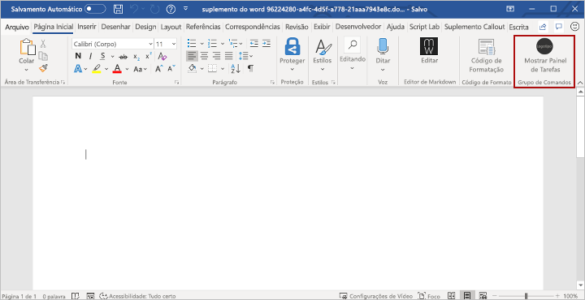

# <a name="build-your-first-word-task-pane-add-in"></a>Crie seu primeiro suplemento do painel de tarefas do Word

Neste artigo, você aprenderá sobre o processo de criação de um suplemento do painel de tarefas do Word.

## <a name="create-the-add-in"></a>Criar o suplemento

[!include[Choose your editor](../includes/quickstart-choose-editor.md)]

# <a name="yeoman-generator"></a>[Gerador do Yeoman](#tab/yeomangenerator)

### <a name="prerequisites"></a>Pré-requisitos

[!include[Set up requirements](../includes/set-up-dev-environment-beforehand.md)]
[!include[Yeoman generator prerequisites](../includes/quickstart-yo-prerequisites.md)]

### <a name="create-the-add-in-project"></a>Criar o projeto do suplemento

[!include[Yeoman generator create project guidance](../includes/yo-office-command-guidance.md)]

- **Escolha o tipo de projeto:** `Office Add-in Task Pane project`
- **Escolha o tipo de script:** `Javascript`
- **Qual será o nome do suplemento?** `My Office Add-in`
- **Você gostaria de proporcionar suporte para qual aplicativo cliente do Office?** `Word`


Depois que você concluir o assistente, o gerador criará o projeto e instalará os componentes Node de suporte.

[!include[Yeoman generator next steps](../includes/yo-office-next-steps.md)]

### <a name="explore-the-project"></a>Explore o projeto

[!include[Yeoman generator add-in project components](../includes/yo-task-pane-project-components-js.md)]

### <a name="try-it-out"></a>Experimente

1. Navegue até a pasta raiz do projeto.

    ```command&nbsp;line
    cd "My Office Add-in"
    ```

1. Conclua as etapas a seguir para iniciar o servidor da web local e fazer o sideload do seu suplemento.

    [!INCLUDE [alert use https](../includes/alert-use-https.md)]

    > [!TIP]
    > Se você estiver testando o seu suplemento no Mac, execute o seguinte comando antes de continuar. O servidor Web local é iniciado quando este comando é executado.
    >
    > ```command&nbsp;line
    > npm run dev-server
    > ```

    - Para testar seu suplemento no Word, execute o seguinte comando no diretório raiz do seu projeto. Isso inicia o servidor Web local (caso ainda não esteja em execução) e abre o Word com o suplemento carregado.

        ```command&nbsp;line
        npm start
        ```

    - Para testar seu suplemento no Word em um navegador, execute o seguinte comando no diretório raiz do seu projeto. O servidor Web local é iniciado quando este comando é executado. Substitua "{url}" pelo URL de um documento do Word no seu OneDrive ou uma biblioteca do SharePoint para a qual você tenha permissões.

        [!INCLUDE [npm start:web command syntax](../includes/start-web-sideload-instructions.md)]

1. No Word, abra um novo documento, escolha a guia **Página Inicial** e o botão **Mostrar Painel de Tarefas** na faixa de opções para abrir o painel de tarefas do suplemento.

    

1. Na parte inferior do painel de tarefas, escolha o link **Executar** para inserir o texto “Olá, Mundo” no documento com a fonte azul.

    

### <a name="next-steps"></a>Próximas etapas

Congratulations, you've successfully created a Word task pane add-in! Next, learn more about the capabilities of a Word add-in and build a more complex add-in by following along with the [Word add-in tutorial](../tutorials/word-tutorial.md).

# <a name="visual-studio"></a>[Visual Studio](#tab/visualstudio)

### <a name="prerequisites"></a>Pré-requisitos

[!include[Quick Start prerequisites](../includes/quickstart-vs-prerequisites.md)]

### <a name="create-the-add-in-project"></a>Criar o projeto do suplemento

1. No Visual Studio, escolha **Criar um novo projeto**.

2. Usando a caixa de pesquisa, insira **suplemento**. Escolha **Suplemento do Word Web**, em seguida, selecione **Próximo**.

3. Nomeie seu projeto e selecione **Criar**.

4. Visual Studio creates a solution and its two projects appear in **Solution Explorer**. The **Home.html** file opens in Visual Studio.

### <a name="explore-the-visual-studio-solution"></a>Explorar a solução do Visual Studio

[!include[Description of Visual Studio projects](../includes/quickstart-vs-solution.md)]

### <a name="update-the-code"></a>Atualizar o código

1. **Home.html** specifies the HTML that will be rendered in the add-in's task pane. In **Home.html**, replace the `<body>` element with the following markup and save the file.

    ```html
    <body>
        <div id="content-header">
            <div class="padding">
                <h1>Welcome</h1>
            </div>
        </div>
        <div id="content-main">
            <div class="padding">
                <p>Choose the buttons below to add boilerplate text to the document by using the Word JavaScript API.</p>
                <br />
                <h3>Try it out</h3>
                <button id="emerson">Add quote from Ralph Waldo Emerson</button>
                <br /><br />
                <button id="checkhov">Add quote from Anton Chekhov</button>
                <br /><br />
                <button id="proverb">Add Chinese proverb</button>
            </div>
        </div>
        <br />
        <div id="supportedVersion"/>
    </body>
    ```

2. Open the file **Home.js** in the root of the web application project. This file specifies the script for the add-in. Replace the entire contents with the following code and save the file.

    [!include[Information about the use of ES6 JavaScript](../includes/modern-js-note.md)]

    ```js
    'use strict';

    (function () {

        Office.onReady(function() {
            // Office is ready.
            $(document).ready(function () {
                // The document is ready.
                // Use this to check whether the API is supported in the Word client.
                if (Office.context.requirements.isSetSupported('WordApi', '1.1')) {
                    // Do something that is only available via the new APIs.
                    $('#emerson').click(insertEmersonQuoteAtSelection);
                    $('#checkhov').click(insertChekhovQuoteAtTheBeginning);
                    $('#proverb').click(insertChineseProverbAtTheEnd);
                    $('#supportedVersion').html('This code is using Word 2016 or later.');
                }
                else {
                    // Just letting you know that this code will not work with your version of Word.
                    $('#supportedVersion').html('This code requires Word 2016 or later.');
                }
            });
        });

        async function insertEmersonQuoteAtSelection() {
            await Word.run(async (context) => {

                // Create a proxy object for the document.
                const thisDocument = context.document;

                // Queue a command to get the current selection.
                // Create a proxy range object for the selection.
                const range = thisDocument.getSelection();

                // Queue a command to replace the selected text.
                range.insertText('"Hitch your wagon to a star."\n', Word.InsertLocation.replace);

                // Synchronize the document state by executing the queued commands,
                // and return a promise to indicate task completion.
                await context.sync();
                console.log('Added a quote from Ralph Waldo Emerson.');
            })
            .catch(function (error) {
                console.log('Error: ' + JSON.stringify(error));
                if (error instanceof OfficeExtension.Error) {
                    console.log('Debug info: ' + JSON.stringify(error.debugInfo));
                }
            });
        }

        async function insertChekhovQuoteAtTheBeginning() {
            await Word.run(async (context) => {

                // Create a proxy object for the document body.
                const body = context.document.body;

                // Queue a command to insert text at the start of the document body.
                body.insertText('"Knowledge is of no value unless you put it into practice."\n', Word.InsertLocation.start);

                // Synchronize the document state by executing the queued commands,
                // and return a promise to indicate task completion.
                await context.sync();
                console.log('Added a quote from Anton Chekhov.');
            })
            .catch(function (error) {
                console.log('Error: ' + JSON.stringify(error));
                if (error instanceof OfficeExtension.Error) {
                    console.log('Debug info: ' + JSON.stringify(error.debugInfo));
                }
            });
        }

        async function insertChineseProverbAtTheEnd() {
            await Word.run(async (context) => {

                // Create a proxy object for the document body.
                const body = context.document.body;

                // Queue a command to insert text at the end of the document body.
                body.insertText('"To know the road ahead, ask those coming back."\n', Word.InsertLocation.end);

                // Synchronize the document state by executing the queued commands,
                // and return a promise to indicate task completion.
                await context.sync();
                console.log('Added a quote from a Chinese proverb.');
            })
            .catch(function (error) {
                console.log('Error: ' + JSON.stringify(error));
                if (error instanceof OfficeExtension.Error) {
                    console.log('Debug info: ' + JSON.stringify(error.debugInfo));
                }
            });
        }
    })();
    ```

3. Open the file **Home.css** in the root of the web application project. This file specifies the custom styles for the add-in. Replace the entire contents with the following code and save the file.

    ```css
    #content-header {
        background: #2a8dd4;
        color: #fff;
        position: absolute;
        top: 0;
        left: 0;
        width: 100%;
        height: 80px;
        overflow: hidden;
    }

    #content-main {
        background: #fff;
        position: fixed;
        top: 80px;
        left: 0;
        right: 0;
        bottom: 0;
        overflow: auto;
    }

    .padding {
        padding: 15px;
    }
    ```

### <a name="update-the-manifest"></a>Atualizar o manifesto

1. Open the XML manifest file in the add-in project. This file defines the add-in's settings and capabilities.

2. The `ProviderName` element has a placeholder value. Replace it with your name.

3. The `DefaultValue` attribute of the `DisplayName` element has a placeholder. Replace it with **My Office Add-in**.

4. The `DefaultValue` attribute of the `Description` element has a placeholder. Replace it with **A task pane add-in for Word**.

5. Salve o arquivo.

    ```xml
    ...
    <ProviderName>John Doe</ProviderName>
    <DefaultLocale>en-US</DefaultLocale>
    <!-- The display name of your add-in. Used on the store and various places of the Office UI such as the add-ins dialog. -->
    <DisplayName DefaultValue="My Office Add-in" />
    <Description DefaultValue="A task pane add-in for Word"/>
    ...
    ```

### <a name="try-it-out"></a>Experimente

1. Using Visual Studio, test the newly created Word add-in by pressing **F5** or choosing **Debug** > **Start Debugging** to launch Word with the **Show Taskpane** add-in button displayed in the ribbon. The add-in will be hosted locally on IIS.

2. No Word, escolha a guia **Página Inicial** e o botão **Mostrar Painel de Tarefas** na Faixa de Opções para abrir o painel de tarefas do suplemento. (Se você estiver usando a versão perpétua licenciada por volume do Office, em vez da versão do Microsoft 365 ou de uma versão perpétua de varejo, não há suporte para botões personalizados. Em vez disso, o painel de tarefas abrirá imediatamente.)

    

3. No painel de tarefas, escolha qualquer um dos botões para adicionar o texto clichê ao documento.

    

[!include[Console tool note](../includes/console-tool-note.md)]

### <a name="next-steps"></a>Próximas etapas

Parabéns, você criou com êxito um suplemento do painel de tarefas do Word! Em seguida, saiba mais sobre como [desenvolver suplementos do Office com o Visual Studio](../develop/develop-add-ins-visual-studio.md).

---

## <a name="see-also"></a>Confira também

- [Visão geral da plataforma Suplementos do Office](../overview/office-add-ins.md)
- [Desenvolver Suplementos do Office ](../develop/develop-overview.md)
- [Visão geral dos suplementos do Word](../word/word-add-ins-programming-overview.md)
- 
  [Exemplos de código do suplemento do Word](https://developer.microsoft.com/office/gallery/?filterBy=Samples,Word)
- [Referências da API JavaScript do Word](../reference/overview/word-add-ins-reference-overview.md)
- [Usando o Visual Studio Code para publicar](../publish/publish-add-in-vs-code.md#using-visual-studio-code-to-publish)