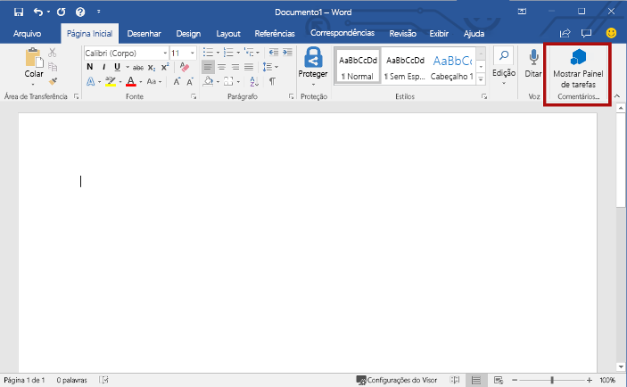
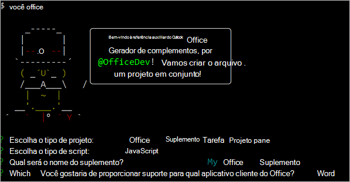

# <a name="build-your-first-word-task-pane-add-in"></a><span data-ttu-id="fb4a7-102">Crie seu primeiro suplemento do painel de tarefas do Word</span><span class="sxs-lookup"><span data-stu-id="fb4a7-102">Build your first PowerPoint task pane add-in</span></span>

<span data-ttu-id="fb4a7-103">_Aplica-se a: Word 2016 ou posterior no Windows, Word para iPad, Word para Mac_</span><span class="sxs-lookup"><span data-stu-id="fb4a7-103">_Applies to: Word 2016 or later for Windows, Word for iPad, Word for Mac_</span></span>

<span data-ttu-id="fb4a7-104">Neste artigo, você aprenderá sobre o processo de criação de um suplemento do painel de tarefas do Word.</span><span class="sxs-lookup"><span data-stu-id="fb4a7-104">In this article, you'll walk through the process of building a PowerPoint task pane add-in.</span></span>

## <a name="create-the-add-in"></a><span data-ttu-id="fb4a7-105">Criar o suplemento</span><span class="sxs-lookup"><span data-stu-id="fb4a7-105">Create the add-in</span></span>

[!include[Choose your editor](../includes/quickstart-choose-editor.md)]

# <a name="visual-studiotabvisual-studio"></a>[<span data-ttu-id="fb4a7-106">Visual Studio</span><span class="sxs-lookup"><span data-stu-id="fb4a7-106">Visual Studio</span></span>](#tab/visual-studio)

### <a name="prerequisites"></a><span data-ttu-id="fb4a7-107">Pré-requisitos</span><span class="sxs-lookup"><span data-stu-id="fb4a7-107">Prerequisites</span></span>

[!include[Quick Start prerequisites](../includes/quickstart-vs-prerequisites.md)]

### <a name="create-the-add-in-project"></a><span data-ttu-id="fb4a7-108">Criar o projeto do suplemento</span><span class="sxs-lookup"><span data-stu-id="fb4a7-108">Create the add-in project</span></span>

1. <span data-ttu-id="fb4a7-109">Na barra de menus do Visual Studio, selecione **Arquivo**  >  **Novo**  >  **Projeto**.</span><span class="sxs-lookup"><span data-stu-id="fb4a7-109">On the Visual Studio menu bar, choose  **File** > **New** > **Project**.</span></span>

2. <span data-ttu-id="fb4a7-110">Na lista de tipos de projeto em **Visual C#** ou em **Visual Basic**, expanda a opção **Office/SharePoint**, escolha **Suplementos** e depois **Suplemento da Web do Word** como o tipo de projeto.</span><span class="sxs-lookup"><span data-stu-id="fb4a7-110">In the list of project types under **Visual C#** or **Visual Basic**, expand  **Office/SharePoint**, choose **Add-ins**, and then choose **Word Web Add-in** as the project type.</span></span> 

3. <span data-ttu-id="fb4a7-111">Dê um nome ao projeto e escolha **OK**.</span><span class="sxs-lookup"><span data-stu-id="fb4a7-111">Name the project, and then choose **OK**.</span></span>

4. <span data-ttu-id="fb4a7-p101">O Visual Studio cria uma solução, e os dois projetos dele são exibidos no **Gerenciador de Soluções**. O arquivo **Home.html** é aberto no Visual Studio.</span><span class="sxs-lookup"><span data-stu-id="fb4a7-p101">Visual Studio creates a solution and its two projects appear in **Solution Explorer**. The **Home.html** file opens in Visual Studio.</span></span>

### <a name="explore-the-visual-studio-solution"></a><span data-ttu-id="fb4a7-114">Explorar a solução do Visual Studio</span><span class="sxs-lookup"><span data-stu-id="fb4a7-114">Explore the Visual Studio solution</span></span>

[!include[Description of Visual Studio projects](../includes/quickstart-vs-solution.md)]

### <a name="update-the-code"></a><span data-ttu-id="fb4a7-115">Atualizar o código</span><span class="sxs-lookup"><span data-stu-id="fb4a7-115">Update the code</span></span>

1. <span data-ttu-id="fb4a7-p102">**Home.html** especifica o HTML que será renderizado no painel de tarefas do suplemento. Em **Home.html**, substitua o elemento `<body>` pela marcação a seguir e salve o arquivo.</span><span class="sxs-lookup"><span data-stu-id="fb4a7-p102">**Home.html** specifies the HTML that will be rendered in the add-in's task pane. In **Home.html**, replace the `<body>` element with the following markup and save the file.</span></span>

    ```html
    <body>
        <div id="content-header">
            <div class="padding">
                <h1>Welcome</h1>
            </div>
        </div>
        <div id="content-main">
            <div class="padding">
                <p>Choose the buttons below to add boilerplate text to the document by using the Word JavaScript API.</p>
                <br />
                <h3>Try it out</h3>
                <button id="emerson">Add quote from Ralph Waldo Emerson</button>
                <br /><br />
                <button id="checkhov">Add quote from Anton Chekhov</button>
                <br /><br />
                <button id="proverb">Add Chinese proverb</button>
            </div>
        </div>
        <br />
        <div id="supportedVersion"/>
    </body>
    ```

2. <span data-ttu-id="fb4a7-p103">Abra o arquivo **Home.js** na raiz do projeto do aplicativo Web. Este arquivo especifica o script do suplemento. Substitua todo o conteúdo pelo código a seguir e salve o arquivo.</span><span class="sxs-lookup"><span data-stu-id="fb4a7-p103">Open the file **Home.js** in the root of the web application project. This file specifies the script for the add-in. Replace the entire contents with the following code and save the file.</span></span>

    ```js
    'use strict';

    (function () {

        Office.onReady(function() {
            // Office is ready
            $(document).ready(function () {
                // The document is ready
                // Use this to check whether the API is supported in the Word client.
                if (Office.context.requirements.isSetSupported('WordApi', 1.1)) {
                    // Do something that is only available via the new APIs
                    $('#emerson').click(insertEmersonQuoteAtSelection);
                    $('#checkhov').click(insertChekhovQuoteAtTheBeginning);
                    $('#proverb').click(insertChineseProverbAtTheEnd);
                    $('#supportedVersion').html('This code is using Word 2016 or later.');
                }
                else {
                    // Just letting you know that this code will not work with your version of Word.
                    $('#supportedVersion').html('This code requires Word 2016 or later.');
                }
            });
        });

        function insertEmersonQuoteAtSelection() {
            Word.run(function (context) {

                // Create a proxy object for the document.
                var thisDocument = context.document;

                // Queue a command to get the current selection.
                // Create a proxy range object for the selection.
                var range = thisDocument.getSelection();

                // Queue a command to replace the selected text.
                range.insertText('"Hitch your wagon to a star."\n', Word.InsertLocation.replace);

                // Synchronize the document state by executing the queued commands,
                // and return a promise to indicate task completion.
                return context.sync().then(function () {
                    console.log('Added a quote from Ralph Waldo Emerson.');
                });
            })
            .catch(function (error) {
                console.log('Error: ' + JSON.stringify(error));
                if (error instanceof OfficeExtension.Error) {
                    console.log('Debug info: ' + JSON.stringify(error.debugInfo));
                }
            });
        }

        function insertChekhovQuoteAtTheBeginning() {
            Word.run(function (context) {

                // Create a proxy object for the document body.
                var body = context.document.body;

                // Queue a command to insert text at the start of the document body.
                body.insertText('"Knowledge is of no value unless you put it into practice."\n', Word.InsertLocation.start);

                // Synchronize the document state by executing the queued commands,
                // and return a promise to indicate task completion.
                return context.sync().then(function () {
                    console.log('Added a quote from Anton Chekhov.');
                });
            })
            .catch(function (error) {
                console.log('Error: ' + JSON.stringify(error));
                if (error instanceof OfficeExtension.Error) {
                    console.log('Debug info: ' + JSON.stringify(error.debugInfo));
                }
            });
        }

        function insertChineseProverbAtTheEnd() {
            Word.run(function (context) {

                // Create a proxy object for the document body.
                var body = context.document.body;

                // Queue a command to insert text at the end of the document body.
                body.insertText('"To know the road ahead, ask those coming back."\n', Word.InsertLocation.end);

                // Synchronize the document state by executing the queued commands,
                // and return a promise to indicate task completion.
                return context.sync().then(function () {
                    console.log('Added a quote from a Chinese proverb.');
                });
            })
            .catch(function (error) {
                console.log('Error: ' + JSON.stringify(error));
                if (error instanceof OfficeExtension.Error) {
                    console.log('Debug info: ' + JSON.stringify(error.debugInfo));
                }
            });
        }
    })();
    ```

3. <span data-ttu-id="fb4a7-p104">Abra o arquivo **Home.css** na raiz do projeto do aplicativo Web. Este arquivo especifica os estilos personalizados para o suplemento. Substitua todo o conteúdo pelo código a seguir e salve o arquivo.</span><span class="sxs-lookup"><span data-stu-id="fb4a7-p104">Open the file **Home.css** in the root of the web application project. This file specifies the custom styles for the add-in. Replace the entire contents with the following code and save the file.</span></span>

    ```css
    #content-header {
        background: #2a8dd4;
        color: #fff;
        position: absolute;
        top: 0;
        left: 0;
        width: 100%;
        height: 80px; 
        overflow: hidden;
    }

    #content-main {
        background: #fff;
        position: fixed;
        top: 80px;
        left: 0;
        right: 0;
        bottom: 0;
        overflow: auto;
    }

    .padding {
        padding: 15px;
    }
    ```

### <a name="update-the-manifest"></a><span data-ttu-id="fb4a7-124">Atualizar o manifesto</span><span class="sxs-lookup"><span data-stu-id="fb4a7-124">Update the manifest</span></span>

1. <span data-ttu-id="fb4a7-125">Abra o arquivo de manifesto XML do projeto do suplemento.</span><span class="sxs-lookup"><span data-stu-id="fb4a7-125">Open the XML manifest file in the add-in project.</span></span> <span data-ttu-id="fb4a7-126">Este arquivo define as configurações e os recursos do suplemento.</span><span class="sxs-lookup"><span data-stu-id="fb4a7-126">This file defines the add-in's settings and capabilities.</span></span>

2. <span data-ttu-id="fb4a7-p106">O elemento `ProviderName` tem um valor de espaço reservado. Substitua-o com seu nome.</span><span class="sxs-lookup"><span data-stu-id="fb4a7-p106">The `ProviderName` element has a placeholder value. Replace it with your name.</span></span>

3. <span data-ttu-id="fb4a7-p107">O atributo `DefaultValue` do elemento `DisplayName` tem um espaço reservado. Substitua-o pelo **suplementos do My Office**.</span><span class="sxs-lookup"><span data-stu-id="fb4a7-p107">The `DefaultValue` attribute of the `DisplayName` element has a placeholder. Replace it with **My Office Add-in**.</span></span>

4. <span data-ttu-id="fb4a7-p108">O atributo `DefaultValue` do elemento `Description` tem um espaço reservado. Substitua-o com **um suplemento do painel de tarefas do PowerPoint**.</span><span class="sxs-lookup"><span data-stu-id="fb4a7-p108">The `DefaultValue` attribute of the `Description` element has a placeholder. Replace it with **A task pane add-in for Word**.</span></span>

5. <span data-ttu-id="fb4a7-133">Salve o arquivo.</span><span class="sxs-lookup"><span data-stu-id="fb4a7-133">Save the file.</span></span>

    ```xml
    ...
    <ProviderName>John Doe</ProviderName>
    <DefaultLocale>en-US</DefaultLocale>
    <!-- The display name of your add-in. Used on the store and various places of the Office UI such as the add-ins dialog. -->
    <DisplayName DefaultValue="My Office Add-in" />
    <Description DefaultValue="A task pane add-in for Word"/>
    ...
    ```

### <a name="try-it-out"></a><span data-ttu-id="fb4a7-134">Experimente</span><span class="sxs-lookup"><span data-stu-id="fb4a7-134">Try it out</span></span>

1. <span data-ttu-id="fb4a7-p109">Usando o Visual Studio, teste o suplemento do Word recém-criado, pressionando **F5** ou escolhendo o botão **Iniciar** para abrir o Word com o botão de suplemento **Mostrar Painel de Tarefas** exibido na faixa de opções. O suplemento será hospedado localmente no IIS.</span><span class="sxs-lookup"><span data-stu-id="fb4a7-p109">Using Visual Studio, test the newly created Word add-in by pressing **F5** or choosing the **Start** button to launch Word with the **Show Taskpane** add-in button displayed in the ribbon. The add-in will be hosted locally on IIS.</span></span>

2. <span data-ttu-id="fb4a7-137">No Word, escolha a guia **Página Inicial** e o botão **Mostrar Painel de Tarefas** na Faixa de Opções para abrir o painel de tarefas do suplemento.</span><span class="sxs-lookup"><span data-stu-id="fb4a7-137">In Word, choose the **Home** tab, and then choose the **Show Taskpane** button in the ribbon to open the add-in task pane.</span></span> <span data-ttu-id="fb4a7-138">Caso esteja usando uma versão de compra avulsa do Office em vez de a versão do Office 365, os botões personalizados não são compatíveis.</span><span class="sxs-lookup"><span data-stu-id="fb4a7-138">(If you are using the one-time purchase version of Office, instead of the Office 365 version, then custom buttons are not supported.</span></span> <span data-ttu-id="fb4a7-139">Em vez disso, o painel de tarefas abrirá imediatamente.)</span><span class="sxs-lookup"><span data-stu-id="fb4a7-139">Instead, the task pane will open immediately.)</span></span>

    

3. <span data-ttu-id="fb4a7-141">No painel de tarefas, escolha qualquer um dos botões para adicionar o texto clichê ao documento.</span><span class="sxs-lookup"><span data-stu-id="fb4a7-141">In the task pane, choose any of the buttons to add boilerplate text to the document.</span></span>

    

# <a name="any-editortabvisual-studio-code"></a>[<span data-ttu-id="fb4a7-143">Qualquer editor</span><span class="sxs-lookup"><span data-stu-id="fb4a7-143">Any editor</span></span>](#tab/visual-studio-code)

### <a name="prerequisites"></a><span data-ttu-id="fb4a7-144">Pré-requisitos</span><span class="sxs-lookup"><span data-stu-id="fb4a7-144">Prerequisites</span></span>

[!include[Yeoman generator prerequisites](../includes/quickstart-yo-prerequisites.md)]

### <a name="create-the-add-in-project"></a><span data-ttu-id="fb4a7-145">Criar o projeto do suplemento</span><span class="sxs-lookup"><span data-stu-id="fb4a7-145">Create the add-in project</span></span>

1. <span data-ttu-id="fb4a7-146">Use o gerador Yeoman para criar um projeto de suplemento do Word.</span><span class="sxs-lookup"><span data-stu-id="fb4a7-146">Use the Yeoman generator to create a Word add-in project.</span></span> <span data-ttu-id="fb4a7-147">Execute o comando a seguir e responda aos prompts da seguinte forma:</span><span class="sxs-lookup"><span data-stu-id="fb4a7-147">Run the following command and then answer the prompts as follows:</span></span>

    ```command&nbsp;line
    yo office
    ```

    - <span data-ttu-id="fb4a7-148">**Escolha o tipo de projeto:** `Office Add-in Task Pane project`</span><span class="sxs-lookup"><span data-stu-id="fb4a7-148">**Choose a project type:** `Office Add-in Task Pane project`</span></span>
    - <span data-ttu-id="fb4a7-149">**Escolha o tipo de script:** `Javascript`</span><span class="sxs-lookup"><span data-stu-id="fb4a7-149">**Choose a script type:** `Javascript`</span></span>
    - <span data-ttu-id="fb4a7-150">**Qual será o nome do suplemento?**</span><span class="sxs-lookup"><span data-stu-id="fb4a7-150">**What do you want to name your add-in?**</span></span> `My Office Add-in`
    - <span data-ttu-id="fb4a7-151">**Você gostaria de proporcionar suporte para qual aplicativo cliente do Office?**</span><span class="sxs-lookup"><span data-stu-id="fb4a7-151">**Which Office client application would you like to support?**</span></span> `Word`

    

    <span data-ttu-id="fb4a7-153">Depois que você concluir o assistente, o gerador criará o projeto e instalará os componentes Node de suporte.</span><span class="sxs-lookup"><span data-stu-id="fb4a7-153">After you complete the wizard, the generator will create the project and install supporting Node components.</span></span>

2. <span data-ttu-id="fb4a7-154">Navegue até a pasta raiz do projeto.</span><span class="sxs-lookup"><span data-stu-id="fb4a7-154">Navigate to the root folder of the project.</span></span>

    ```command&nbsp;line
    cd "My Office Add-in"
    ```

### <a name="explore-the-project"></a><span data-ttu-id="fb4a7-155">Explore o projeto</span><span class="sxs-lookup"><span data-stu-id="fb4a7-155">Explore the project</span></span>

[!include[Yeoman generator add-in project components](../includes/yo-task-pane-project-components-js.md)]

### <a name="try-it-out"></a><span data-ttu-id="fb4a7-156">Experimente</span><span class="sxs-lookup"><span data-stu-id="fb4a7-156">Try it out</span></span>

1. <span data-ttu-id="fb4a7-157">Inicie o servidor Web local e realize o sideload no seu suplemento.</span><span class="sxs-lookup"><span data-stu-id="fb4a7-157">Start the local web server and sideload your add-in.</span></span>

    > [!NOTE]
    > <span data-ttu-id="fb4a7-158">Os Suplementos do Office devem usar HTTPS, e não HTTP, mesmo durante o desenvolvimento.</span><span class="sxs-lookup"><span data-stu-id="fb4a7-158">Office Add-ins should use HTTPS, not HTTP, even when you are developing.</span></span> <span data-ttu-id="fb4a7-159">Se você for solicitado a instalar um certificado após executar um dos seguintes comandos, aceite a solicitação para instalar o certificado que o gerador do Yeoman fornecer.</span><span class="sxs-lookup"><span data-stu-id="fb4a7-159">If you are prompted to install a certificate after you run one of the following commands, accept the prompt to install the certificate that the Yeoman generator provides.</span></span> 

    - <span data-ttu-id="fb4a7-160">Para testar o seu suplemento no Word, execute o seguinte comando.</span><span class="sxs-lookup"><span data-stu-id="fb4a7-160">To test your add-in in PowerPoint, run the following command.</span></span> <span data-ttu-id="fb4a7-161">Quando você executa este comando, o servidor Web local iniciará e o Word abrirá com o seu suplemento carregado.</span><span class="sxs-lookup"><span data-stu-id="fb4a7-161">When you run this command, the local web server will start and PowerPoint will open with your add-in loaded.</span></span>

        ```command&nbsp;line
        npm start
        ```

    - <span data-ttu-id="fb4a7-162">Para testar o seu suplemento no Word Online, execute o seguinte comando.</span><span class="sxs-lookup"><span data-stu-id="fb4a7-162">To test your add-in in PowerPoint Online, run the following command.</span></span> <span data-ttu-id="fb4a7-163">Quando você executa este comando, o servidor Web local iniciará.</span><span class="sxs-lookup"><span data-stu-id="fb4a7-163">When you run this command, the local web server will start.</span></span>

        ```command&nbsp;line
        npm run start:web
        ```

        <span data-ttu-id="fb4a7-164">Para usar o seu suplemento, abra um novo documento no Word Online e, em seguida, realize o sideload no suplemento de acordo com as instruções em [Realizar Sideload nos Suplementos do Office Online](../testing/sideload-office-add-ins-for-testing.md#sideload-an-office-add-in-in-office-online).</span><span class="sxs-lookup"><span data-stu-id="fb4a7-164">To use your add-in, open a new document in PowerPoint Online and then sideload your add-in by following the instructions in [Sideload Office Add-ins in Office Online](../testing/sideload-office-add-ins-for-testing.md#sideload-an-office-add-in-in-office-online).</span></span>

2. <span data-ttu-id="fb4a7-165">No Word, abra um novo documento, escolha a guia **Página Inicial** e o botão **Mostrar Painel de Tarefas** na faixa de opções para abrir o painel de tarefas do suplemento.</span><span class="sxs-lookup"><span data-stu-id="fb4a7-165">In Word, choose the **Home** tab, and then choose the **Show Taskpane** button in the ribbon to open the add-in task pane.</span></span>

    

3. <span data-ttu-id="fb4a7-167">Na parte inferior do painel de tarefas, escolha o link **Executar** para inserir o texto «Olá, Mundo» no documento com a fonte azul.</span><span class="sxs-lookup"><span data-stu-id="fb4a7-167">At the bottom of the task pane, choose the **Run** link to insert the text "Hello World" into the current slide.</span></span>

    

---

## <a name="next-steps"></a><span data-ttu-id="fb4a7-169">Próximas etapas</span><span class="sxs-lookup"><span data-stu-id="fb4a7-169">Next steps</span></span>

<span data-ttu-id="fb4a7-170">Parabéns, você criou com êxito um suplemento do painel de tarefas do Word!</span><span class="sxs-lookup"><span data-stu-id="fb4a7-170">Congratulations, you've successfully created a PowerPoint task pane add-in!</span></span> <span data-ttu-id="fb4a7-171">Em seguida, saiba mais sobre os recursos de um suplemento do Word e crie um suplemento mais complexo seguindo as etapas deste tutorial de suplemento do Word.</span><span class="sxs-lookup"><span data-stu-id="fb4a7-171">Next, learn more about the capabilities of a Word add-in and build a more complex add-in by following along with the Word add-in tutorial.</span></span>

> [!div class="nextstepaction"]
> [<span data-ttu-id="fb4a7-172">Tutorial de suplemento do Word</span><span class="sxs-lookup"><span data-stu-id="fb4a7-172">Word add-in tutorial</span></span>](../tutorials/word-tutorial.md)

## <a name="see-also"></a><span data-ttu-id="fb4a7-173">Confira também</span><span class="sxs-lookup"><span data-stu-id="fb4a7-173">See also</span></span>

* [<span data-ttu-id="fb4a7-174">Visão geral dos suplementos do Word</span><span class="sxs-lookup"><span data-stu-id="fb4a7-174">Word add-ins overview</span></span>](../word/word-add-ins-programming-overview.md)
* <span data-ttu-id="fb4a7-175">
  [Exemplos de código do suplemento do Word](https://developer.microsoft.com/en-us/office/gallery/?filterBy=Samples,Word)</span><span class="sxs-lookup"><span data-stu-id="fb4a7-175">[Word add-in code samples](https://developer.microsoft.com/en-us/office/gallery/?filterBy=Samples,Word)</span></span>
* [<span data-ttu-id="fb4a7-176">Referências da API JavaScript do Word</span><span class="sxs-lookup"><span data-stu-id="fb4a7-176">Word JavaScript API reference</span></span>](/office/dev/add-ins/reference/overview/word-add-ins-reference-overview)
