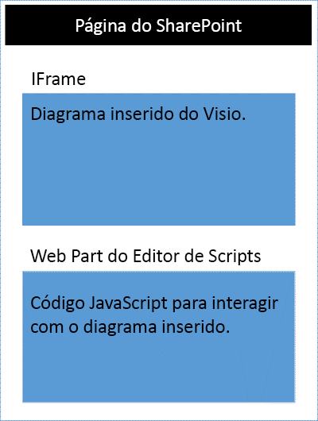
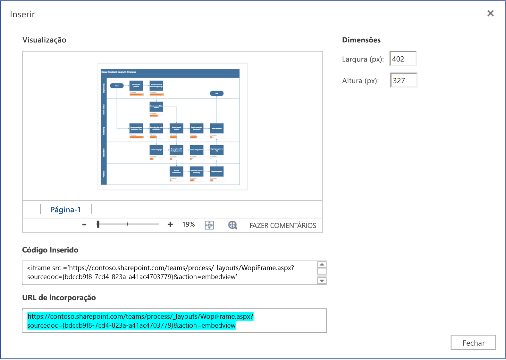

# <a name="visio-javascript-api-overview"></a>Visão geral da API JavaScript do Visio

Você pode usar as APIs do Visio JavaScript para incorporar diagramas do Visio em páginas *clássicas* do SharePoint no Microsoft Office SharePoint Online. (Este recurso de extensibilidade não é compatível com o Microsoft Office SharePoint Online local ou nas páginas do SharePoint Framework.)

Um diagrama integrado do Visio é um diagrama armazenado em uma biblioteca de documentos do SharePoint e exibido em uma página do SharePoint. Para integrar um diagrama do Visio, exiba-o em um elemento `<iframe>` de HTML. Em seguida, você pode usar APIs JavaScript do Visio para trabalhar via programação com o diagrama integrado.



É possível usar as APIs JavaScript do Visio para:

* Interagir com os elementos de diagrama do Visio, como páginas e formas.
* Criar uma marcação visual na tela do diagrama do Visio.
* Adicionar manipuladores personalizados para eventos com o mouse no desenho.
* Expôr dados de diagrama, como texto da forma, dados da forma e hiperlinks, em sua solução.

Este artigo descreve como usar as APIs JavaScript do Visio com o Visio na Web para desenvolver suas soluções para o SharePoint Online. Ele apresenta os principais conceitos que são fundamentais para o uso das APIs, como `EmbeddedSession`, `RequestContext` e dos objetos proxy do JavaScript, além dos métodos `sync()`, `Visio.run()`, and `load()`. Os exemplos de código mostram como aplicar esses conceitos.

## <a name="embeddedsession&quot;></a>EmbeddedSession

O objeto EmbeddedSession inicia a comunicação entre o quadro do desenvolvedor e o quadro do Visio no navegador.

```js
var session = new OfficeExtension.EmbeddedSession(url, { id: &quot;embed-iframe&quot;,container: document.getElementById(&quot;iframeHost") });
session.init().then(function () {
    window.console.log("Session successfully initialized");
});
```

## <a name="visiorunsession-functioncontext--batch-"></a>Visio.run(session, function(context) { batch })

`Visio.run()` executa um script em lote que executa ações no modelo de objeto do Visio. Os comandos em lotes incluem definições de objetos proxy JavaScript locais e métodos `sync()` que sincronizam o estado entre objetos locais e do Visio, e a resolução de promessa. A vantagem do envio de solicitações em lotes com o método `Visio.run()` é que, quando a promessa é resolvida, todos os objetos de página controlados que foram alocados durante a execução são automaticamente liberados.

O método run recebe a sessão e o objeto RequestContext e retorna uma promessa (normalmente, apenas o resultado de `context.sync()`). É possível executar a operação em lote fora do `Visio.run()`. No entanto, todas as referências aos objetos de página devem ser rastreadas e gerenciadas manualmente nesse cenário.

## <a name="requestcontext"></a>RequestContext

O objeto RequestContext facilita as solicitações para o aplicativo Visio. Como o quadro do desenvolvedor e o cliente Web do Visio são executados em dois iframes diferentes, o objeto RequestContext (contexto no próximo exemplo) é necessário para obter acesso ao Visio e a objetos relacionados, como páginas e formas, do quadro do desenvolvedor.

```js
function hideToolbars() {
    Visio.run(session, function(context){
        var app = context.document.application;
        app.showToolbars = false;
        return context.sync().then(function () {
            window.console.log("Toolbars Hidden");
        });
    }).catch(function(error)
    {
        window.console.log("Error: " + error);
    });
};
```

## <a name="proxy-objects"></a>Objetos proxy

Os objetos JavaScript do Visio declarados e usados em uma sessão incorporada são objetos proxy para os objetos reais em um documento do Visio. Todas as ações executadas em objetos proxy não são percebidas no Visio, e o estado do documento do Visio não é percebido em objetos proxy, até que o estado do documento tenha sido sincronizado. O estado do documento é sincronizado quando `context.sync()` é executado.

Por exemplo, o objeto JavaScript local getActivePage é declarado para fazer referência à página selecionada. Você pode usá-lo para colocar a configuração das respectivas propriedades em fila e para invocar métodos. As ações nesses objetos não são realizadas até que o método `sync()` seja executado.

```js
var activePage = context.document.getActivePage();
```

## <a name="sync"></a>sync()

O método `sync()` sincroniza o estado entre objetos proxy JavaScript e objetos reais no Visio, com a execução de instruções enfileiradas no contexto e com a recuperação de propriedades de objetos carregados do Office para uso no código. Este método retorna uma promessa, que é resolvida quando o sistema conclui a sincronização.

## <a name="load"></a>load()

O método `load()` é usado para preencher os objetos proxy criados na camada JavaScript do suplemento. Ao tentar recuperar um objeto, como um documento, um objeto proxy local é criado inicialmente na camada JavaScript. Você pode usar esse objeto para colocar a configuração das respectivas propriedades em fila e para invocar métodos. No entanto, para ler as propriedades ou relações do objeto, os métodos `load()`e `sync()` precisam ser chamados primeiro. O método load() leva nas propriedades e relações que precisam ser carregadas quando o método `sync()` é chamado.

A seguir, é mostrada a sintaxe do método `load()`.

```js
object.load(string: properties); //or object.load(array: properties); //or object.load({loadOption});
```

1. **properties** é a lista de nomes de propriedades a carregar, especificados como cadeias de caracteres delimitadas por vírgulas ou por uma matriz de nomes. Veja os métodos `.load()` em cada objeto para obter detalhes.

2. **loadOption** especifica um objeto que descreve as opções de seleção, expansão, topo e ignorar. Consulte as [opções](/javascript/api/office/officeextension.loadoption) de carregamento do objeto para saber mais.

## <a name="example-printing-all-shapes-text-in-active-page"></a>Exemplo: imprimir todo o texto de formas na página ativa

O exemplo a seguir mostra como imprimir o valor de texto de forma de um objeto de formas de matriz.
O método `Visio.run()` contém um lote de instruções. Como parte deste lote, o sistema cria um objeto proxy que faz referência a formas no documento ativo.

Todos esses comandos são enfileirados e executados quando `context.sync()` é chamado. O método `sync()` retorna uma promessa que pode ser usada para encadeá-lo com outras operações.

```js
Visio.run(session, function (context) {
    var page = context.document.getActivePage();
    var shapes = page.shapes;
    shapes.load();
    return context.sync().then(function () {
        for(var i=0; i<shapes.items.length;i++) {
            var shape = shapes.items[i];
            window.console.log("Shape Text: " + shape.text );
        }
    });
}).catch(function(error) {
    window.console.log("Error: " + error);
    if (error instanceof OfficeExtension.Error) {
        window.console.log ("Debug info: " + JSON.stringify(error.debugInfo));
    }
});
```

## <a name="error-messages"></a>Mensagens de erro

O sistema retorna erros usando um objeto Error composto por um código e uma mensagem. A tabela a seguir fornece uma lista de possíveis condições de erro que podem ocorrer.

| error.code            | error.message |
|-----------------------|----------------------------------------------------------------|
| InvalidArgument       | O argumento é inválido, está ausente ou tem um formato incorreto. |
| GeneralException      | Ocorreu um erro interno ao processar a solicitação. |
| NotImplemented        | O recurso solicitado não foi implementado.  |
| UnsupportedOperation  | Não há suporte para a operação que está sendo tentada. |
| AccessDenied          | Você não pode realizar a operação solicitada. |
| ItemNotFound          | O recurso solicitado não existe. |

## <a name="get-started"></a>Introdução

Você pode usar o exemplo nesta seção para começar. Este exemplo mostra como exibir o texto da forma selecionada em um diagrama do Visio via programação. Para começar, crie uma página clássica no SharePoint Online ou edite uma página existente. Adicione uma Web Part de editor de script à página e copie e cole o código a seguir.

```js
<script src='https://appsforoffice.microsoft.com/embedded/1.0/visio-web-embedded.js' type='text/javascript'></script>

Enter Visio File Url:<br/>
<script language="javascript">
document.write("<input type='text' id='fileUrl' size='120'/>");
document.write("<input type='button' value='InitEmbeddedFrame' onclick='initEmbeddedFrame()' />");
document.write("<br />");
document.write("<input type='button' value='SelectedShapeText' onclick='getSelectedShapeText()' />");
document.write("<textarea id='ResultOutput' style='width:350px;height:60px'> </textarea>");
document.write("<div id='iframeHost' />");

let session; // Global variable to store the session and pass it afterwards in Visio.run()
var textArea;
// Loads the Visio application and Initializes communication between developer frame and Visio online frame
function initEmbeddedFrame() {
    textArea = document.getElementById('ResultOutput');
    var url = document.getElementById('fileUrl').value;
    if (!url) {
        window.alert("File URL should not be empty");
    }
    // APIs are enabled for EmbedView action only.
    url = url.replace("action=view","action=embedview");
    url = url.replace("action=interactivepreview","action=embedview");
    url = url.replace("action=default","action=embedview");
    url = url.replace("action=edit","action=embedview");
  
    session = new OfficeExtension.EmbeddedSession(url, { id: "embed-iframe",container: document.getElementById("iframeHost") });
    return session.init().then(function () {
        // Initialization is successful
        textArea.value  = "Initialization is successful";
    });
}

// Code for getting selected Shape Text using the shapes collection object
function getSelectedShapeText() {
    Visio.run(session, function (context) {
        var page = context.document.getActivePage();
        var shapes = page.shapes;
        shapes.load();
        return context.sync().then(function () {
            textArea.value = "Please select a Shape in the Diagram";
            for(var i=0; i<shapes.items.length;i++) {
                var shape = shapes.items[i];
                if ( shape.select == true) {
                    textArea.value = shape.text;
                    return;
                }
            }
        });
    }).catch(function(error) {
        textArea.value = "Error: ";
        if (error instanceof OfficeExtension.Error) {
            textArea.value += "Debug info: " + JSON.stringify(error.debugInfo);
        }
    });
}
</script>
```

Depois disso, você só precisa da URL de um diagrama do Visio com o qual deseja trabalhar. Basta carregar o diagrama do Visio no SharePoint Online e abri-lo no Visio na Web. A partir daí, abra a caixa de diálogo Inserir e use a URL de integração do exemplo acima.



Se você estiver usando o Visio na Web no modo de edição, abra a caixa de diálogo Inserir escolhendo **Arquivo** > **Compartilhar** > **Inserir**. Se você estiver usando o Visio na Web no modo de exibição, abra a caixa de diálogo Inserir escolhendo '...' e, em seguida, **Inserir**.

## <a name="visio-javascript-api-reference"></a>Referência da API JavaScript do Visio

Para saber mais sobre a API JavaScript do Visio, consulte a [Documentação de referência da API JavaScript do Visio](/javascript/api/visio).
