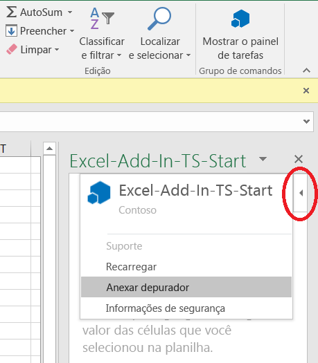
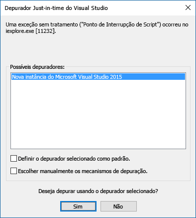

# Anexar um depurador do painel de tarefas

No Office 2016 no Windows, Build 77xx.xxxx ou posterior, é possível anexar o depurador do painel de tarefas. O recurso de anexar o depurador anexará diretamente o depurador ao processo correto do Internet Explorer. É possível anexar um depurador independentemente de você estar utilizando Yeoman Generator, Visual Studio Code, Node.js, Angular ou outra ferramenta.

Para iniciar a ferramenta **Anexar Depurador**, escolha o canto superior direito do painel de tarefas para ativar o menu **Personalidade** (conforme mostrado no círculo vermelho na imagem a seguir).

> [!NOTE]
> - Atualmente, a única ferramenta de depurador é o [Visual Studio 2015](https://www.visualstudio.com/downloads/) com a [Atualização 3](/previous-versions/mt752379(v=vs.140)) ou posterior. Se você não tiver o Visual Studio instalado, selecionar a opção Anexar **Depurador** não resultará em nenhuma ação.
> - Só é possível depurar o JavaScript do lado do cliente com a ferramenta **Anexar Depurador**. Para depurar o código do lado do servidor, como com um servidor Node.js, há várias opções. Confira informações sobre como depurar com o Visual Studio Code em [Depuração do Node.js no VS Code](https://code.visualstudio.com/docs/nodejs/nodejs-debugging). Se você não estiver usando o Visual Studio Code, pesquise por "depurar Node.js" ou "depurar {nome do servidor}".

Selecione **Anexar Depurador**. Isso inicia a caixa de diálogo **Depurador Just-In-Time do Visual Studio**, conforme mostrado na imagem a seguir. 

No Visual Studio, você verá os arquivos de código no **Gerenciador de Soluções**.   Você pode definir pontos de interrupção na linha de código que deseja depurar no Visual Studio.

> [!NOTE]
> Se você não vir o menu Personalidade, é possível depurar o suplemento com o Visual Studio. Certifique-se de que o suplemento do painel tarefas esteja aberto no Office e, em seguida, siga estas etapas:
>
> 1. No Visual Studio, escolha **DEPURAR** > **Anexar ao Processo**.
> 2. Em **Processos disponíveis**, selecione *qualquer um* dos `Iexplore.exe` processos disponíveis *ou* todos os `MicrosoftEdge*.exe` processos disponíveis, dependendo [ se seu suplemento usa Internet Explorer ou Microsoft Edge](../concepts/browsers-used-by-office-web-add-ins.md), e depois clique no botão **Anexar**.

Veja mais informações sobre depuração no Visual Studio, em:

- Para iniciar e usar o Explorador do DOM no Visual Studio, confira a Dica 4 na seção [Dicas e Truques](/archive/blogs/officeapps/building-great-looking-apps-for-office-using-the-new-project-templates#tips_tricks) da publicação [Building great-looking apps for Office using the new project templates](/archive/blogs/officeapps/building-great-looking-apps-for-office-using-the-new-project-templates) (Criar aplicativos atraentes para o Office usando os novos modelos de projeto) do blog.
- Para definir pontos de interrupção, confira [Usar Pontos de Interrupção](/visualstudio/debugger/using-breakpoints?view=vs-2015&preserve-view=true).
- Para usar o F12, confira o artigo [Usando as ferramentas de desenvolvedor F12](/previous-versions/windows/internet-explorer/ie-developer/samples/bg182326(v=vs.85)).
- Para usar as ferramentas de desenvolvedor do Microsoft Edge, confira [Microsoft Edge DevTools](https://www.microsoft.com/p/microsoft-edge-devtools-preview/9mzbfrmz0mnj?activetab=pivot%3Aoverviewtab).

## Confira também

- [Depurar Suplementos do Office no Visual Studio](../develop/debug-office-add-ins-in-visual-studio.md)
- [Publicar seu Suplemento do Office](../publish/publish.md)
- [Extensão de depuração de suplementos do Microsoft Office para o Visual Studio Code](debug-with-vs-extension.md)