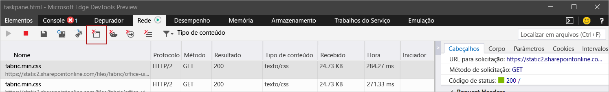
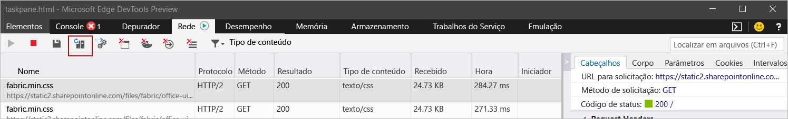

# Limpar o cache do Office

Você pode remover um suplemento em que foi feito sideload no Windows, Mac ou iOS limpando o cache do Office em seu computador. 

Além disso, se você fizer alterações no manifesto do seu suplemento (por exemplo, atualizar nomes de arquivos de ícones ou texto de comandos de suplemento), você deve limpar o cache do Office e, em seguida, fazer o sideload novamente usando o manifesto atualizado. Isso permitirá que o Office processe o suplemento conforme descrito no manifesto atualizado.

## Limpar o cache do Office no Windows

Para remover todos os suplementos com sideload do Excel, Word e PowerPoint, exclua o conteúdo da pasta `%LOCALAPPDATA%\Microsoft\Office\16.0\Wef\`. 

Para remover um suplemento sideloaded do Outlook, use as etapas descritas em [Sideload de suplementos do Outlook para testar](/outlook/add-ins/sideload-outlook-add-ins-for-testing) para localizar o suplemento na seção **Suplementos personalizados** da caixa de diálogo que lista os suplementos instalados. Escolha as reticências (`...`) para o suplemento e, em seguida, escolha **Remover** para remover esse suplemento específico.

Além disso, para limpar o cache do Office no Windows 10 quando o suplemento estiver sendo executado no Microsoft Edge, você pode usar o Microsoft Edge DevTools.

> [!TIP]
> Se você quer apenas que o suplemento sideloaded reflita alterações recentes em seus arquivos de origem HTML ou JavaScript, não deverá ser necessário usar as etapas a seguir para limpar o cache. Em vez disso, coloque o foco no painel de tarefas do suplemento (clicando em qualquer lugar no painel de tarefas) e, em seguida, pressione **F5** para recarregar o suplemento. 

> [!NOTE]
> Para limpar o cache do Office usando as etapas a seguir, seu suplemento deve ter um painel de tarefas. Se o seu suplemento for um suplemento sem interface de usuário, por exemplo, um que use o recurso [em envio](/outlook/add-ins/outlook-on-send-addins), você precisará adicionar um painel de tarefas ao seu suplemento que use o mesmo domínio para [SourceLocation](../reference/manifest/sourcelocation.md), antes de poder usar as etapas a seguir para limpar o cache.

1. Instalar o [Microsoft Edge DevTools](https://www.microsoft.com/p/microsoft-edge-devtools-preview/9mzbfrmz0mnj).

2. Abra seu suplemento no cliente do Office.

3. Execute o Microsoft Edge DevTools.

4. No Microsoft Edge DevTools, abra a guia **Local**. Seu suplemento será listado por nome.

5. Selecione o nome do suplemento para anexar o depurador ao seu suplemento. Uma nova janela do Microsoft Edge DevTools será aberta quando o depurador for anexado ao seu suplemento.

6. Na guia **Network** da nova janela, selecione o botão **Limpar cache**.

    

7. Se concluir essas etapas não produzir o resultado desejado, você também pode selecionar o botão **Sempre atualizar do servidor**.

    

## Limpar o cache do Office no Mac

[!include[additional cache folders on Mac](../includes/mac-cache-folders.md)]

##  Limpar o cache do Office no iOS

Para limpar o cache do Office no iOS, chame `window.location.reload(true)` a partir do JavaScript no suplemento para forçar um recarregamento. Uma outra alternativa é reinstalar o Office.

## Confira também

- [Depurar suplementos do Office](debug-add-ins-using-f12-developer-tools-on-windows-10.md)
- [Depurar seu suplemento com o log do tempo de execução](runtime-logging.md)
- [Realizar sideload de suplementos do Office para teste](sideload-office-add-ins-for-testing.md)
- [Manifesto XML dos Suplementos do Office](../develop/add-in-manifests.md)
- [Validar o manifesto de suplemento do Office](troubleshoot-manifest.md)

