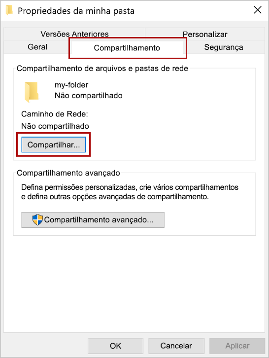
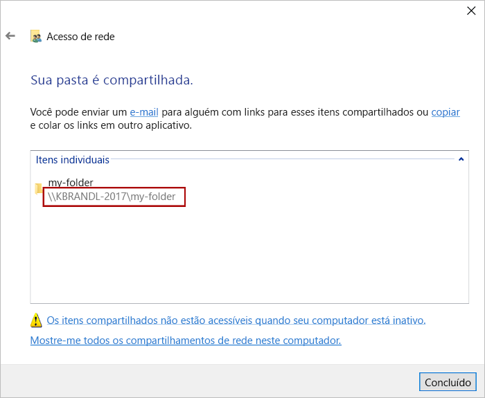
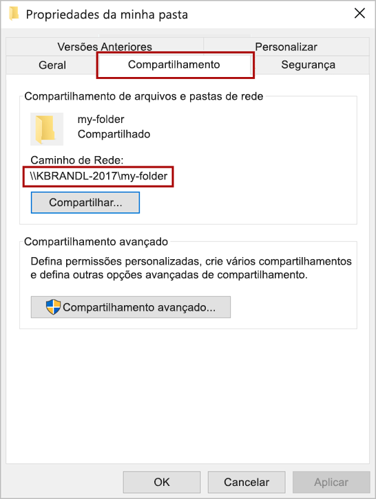
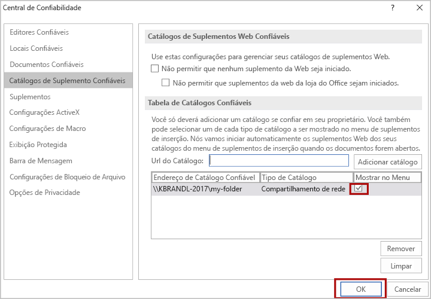

# <a name="sideload-office-add-ins-for-testing-from-a-network-share"></a><span data-ttu-id="ab1b2-103">Realizar sideload de Complementos do Office para teste de um compartilhamento de rede</span><span class="sxs-lookup"><span data-stu-id="ab1b2-103">Sideload Office Add-ins for testing from a network share</span></span>

<span data-ttu-id="ab1b2-104">Você pode testar um Complemento do Office em um cliente do Office que está no Windows publicando o manifesto em um compartilhamento de arquivos de rede (instruções abaixo).</span><span class="sxs-lookup"><span data-stu-id="ab1b2-104">You can test an Office Add-in in an Office client that is on Windows by publishing the manifest to a network file share (instructions below).</span></span> <span data-ttu-id="ab1b2-105">Essa opção de implantação deve ser usada quando você tiver concluído o desenvolvimento e o teste em um localhost e quiser testar o complemento de uma conta de nuvem ou servidor não local.</span><span class="sxs-lookup"><span data-stu-id="ab1b2-105">This deployment option is intended to be used when you have completed development and testing on a localhost and want to test the add-in from a non-local server or cloud account.</span></span>

> [!IMPORTANT]
> <span data-ttu-id="ab1b2-106">A implantação por compartilhamento de rede não tem suporte para os complementos de produção. Esse método tem as seguintes limitações:</span><span class="sxs-lookup"><span data-stu-id="ab1b2-106">Deployment by network share is not supported for production add-ins. This method has the following limitations:</span></span>
> 
> - <span data-ttu-id="ab1b2-107">O complemento só pode ser instalado em computadores Windows.</span><span class="sxs-lookup"><span data-stu-id="ab1b2-107">The add-in can only be installed on Windows computers.</span></span>
> - <span data-ttu-id="ab1b2-108">Se uma nova versão de um complemento mudar a faixa de opções, cada usuário terá que reinstalar o complemento.</span><span class="sxs-lookup"><span data-stu-id="ab1b2-108">If a new version of an add-in changes the ribbon, each user will have to reinstall the add-in.</span></span>


> [!NOTE]
> <span data-ttu-id="ab1b2-109">Se o projeto de suplemento tiver sido criado com uma versão suficientemente recente do [Gerador Yeoman para Suplementos do Office](https://github.com/OfficeDev/generator-office), o suplemento realizará sideload automaticamente no cliente de desktop do Office ao executar o `npm start`.</span><span class="sxs-lookup"><span data-stu-id="ab1b2-109">If your add-in project was created with a sufficiently recent version of the [Yeoman generator for Office Add-ins](https://github.com/OfficeDev/generator-office), the add-in will automatically sideload in the Office desktop client when you run `npm start`.</span></span>

<span data-ttu-id="ab1b2-110">Este artigo se aplica somente ao teste de complementos do Word, Excel, PowerPoint e Project e somente no Windows.</span><span class="sxs-lookup"><span data-stu-id="ab1b2-110">This article applies only to testing Word, Excel, PowerPoint, and Project add-ins and only on Windows.</span></span> <span data-ttu-id="ab1b2-111">Se você deseja testar em outra plataforma ou um suplemento do Outlook, veja os tópicos seguintes para realizar o sideload do suplemento:</span><span class="sxs-lookup"><span data-stu-id="ab1b2-111">If you want to test on another platform or want to test an Outlook add-in, see one of the following topics to sideload your add-in:</span></span>

- [<span data-ttu-id="ab1b2-112">Realizar sideload de suplementos do Office no Office na Web para teste</span><span class="sxs-lookup"><span data-stu-id="ab1b2-112">Sideload Office Add-ins in Office on the web for testing</span></span>](sideload-office-add-ins-for-testing.md)
- [<span data-ttu-id="ab1b2-113">Sideload suplementos do Office para teste em um iPad ou Mac</span><span class="sxs-lookup"><span data-stu-id="ab1b2-113">Sideload Office Add-ins on iPad and Mac for testing</span></span>](sideload-an-office-add-in-on-ipad-and-mac.md)
- [<span data-ttu-id="ab1b2-114">Realizar sideload de suplementos do Outlook para teste</span><span class="sxs-lookup"><span data-stu-id="ab1b2-114">Sideload Outlook add-ins for testing</span></span>](../outlook/sideload-outlook-add-ins-for-testing.md)

<span data-ttu-id="ab1b2-115">O vídeo a seguir oferece orientações para a realização do processo de sideload no suplemento do Office na Web ou para área de trabalho usando um catálogo de pasta compartilhada.</span><span class="sxs-lookup"><span data-stu-id="ab1b2-115">The following video walks you through the process of sideloading your add-in in Office on the web or desktop using a shared folder catalog.</span></span>  

> [!VIDEO https://www.youtube.com/embed/XXsAw2UUiQo]

## <a name="share-a-folder"></a><span data-ttu-id="ab1b2-116">Compartilhar uma pasta</span><span class="sxs-lookup"><span data-stu-id="ab1b2-116">Share a folder</span></span>

1. <span data-ttu-id="ab1b2-117">No computador do Windows, onde você deseja hospedar seu suplemento, acesse a pasta pai ou letra da unidade da pasta que você deseja usar como seu catálogo de pasta compartilhada.</span><span class="sxs-lookup"><span data-stu-id="ab1b2-117">In File Explorer on the Windows computer where you want to host your add-in, go to the parent folder, or drive letter, of the folder you want to use as your shared folder catalog.</span></span>

2. <span data-ttu-id="ab1b2-118">Abra o menu de contexto na pasta que você deseja usar como catálogo de pasta compartilhada (clique com o botão direito) e escolha **Propriedades**.</span><span class="sxs-lookup"><span data-stu-id="ab1b2-118">Open the context menu for the folder you want to use as your shared folder catalog (right-click the folder) and choose **Properties**.</span></span>

3. <span data-ttu-id="ab1b2-119">Dentro da janela de diálogo **Propriedades** abra a guia **Compartilhamento** e escolha o botão **Compartilhar**.</span><span class="sxs-lookup"><span data-stu-id="ab1b2-119">Within the **Properties** dialog window, open the **Sharing** tab and then choose the **Share** button.</span></span>

    

4. <span data-ttu-id="ab1b2-121">Dentro a janela de diálogo **Acesso à rede** adicione você mesmo e quaisquer outros usuários e/ou grupos com quem você deseja compartilhar o suplemento.</span><span class="sxs-lookup"><span data-stu-id="ab1b2-121">Within the **Network access** dialog window, add yourself and any other users and/or groups with whom you want to share your add-in.</span></span> <span data-ttu-id="ab1b2-122">Você precisará de pelo menos da permissão **Leitura/Gravação** para a pasta.</span><span class="sxs-lookup"><span data-stu-id="ab1b2-122">You will need at least **Read/Write** permission to the folder.</span></span> <span data-ttu-id="ab1b2-123">Quando terminar de escolher as pessoas para compartilhar, escolha o botão **Compartilhar**.</span><span class="sxs-lookup"><span data-stu-id="ab1b2-123">After you have finished choosing people to share with, choose the **Share** button.</span></span>

5. <span data-ttu-id="ab1b2-124">Quando você vir a confirmação **Sua pasta foi compartilhada**, anote o caminho de rede completo que é exibido imediatamente após o nome da pasta.</span><span class="sxs-lookup"><span data-stu-id="ab1b2-124">When you see confirmation that **Your folder is shared**, make note of the full network path that's displayed immediately following the folder name.</span></span> <span data-ttu-id="ab1b2-125">(Você precisará inserir esse valor como o **Url Catálogo** quando você [especificar a pasta compartilhada como um catálogo confiável](#specify-the-shared-folder-as-a-trusted-catalog), conforme descrito na próxima seção deste artigo.) Escolha o botão **Concluído** para fechar a janela de diálogo **Acesso à rede**.</span><span class="sxs-lookup"><span data-stu-id="ab1b2-125">(You will need to enter this value as the **Catalog Url** when you [specify the shared folder as a trusted catalog](#specify-the-shared-folder-as-a-trusted-catalog), as described in the next section of this article.) Choose the **Done** button to close the **Network access** dialog window.</span></span>

   

6. <span data-ttu-id="ab1b2-127">Escolha o botão **Fechar** para fechar a caixa de diálogo **Propriedades**.</span><span class="sxs-lookup"><span data-stu-id="ab1b2-127">Choose the **Close** button to close the **Properties** dialog window.</span></span>

## <a name="specify-the-shared-folder-as-a-trusted-catalog"></a><span data-ttu-id="ab1b2-128">Especifique a pasta compartilhada como um catálogo confiável</span><span class="sxs-lookup"><span data-stu-id="ab1b2-128">Specify the shared folder as a trusted catalog</span></span>

### <a name="configure-the-trust-manually"></a><span data-ttu-id="ab1b2-129">Configure a confiança manualmente</span><span class="sxs-lookup"><span data-stu-id="ab1b2-129">Configure the trust manually</span></span>

1. <span data-ttu-id="ab1b2-130">Abra um novo documento no Excel, no Word, no PowerPoint ou no Project.</span><span class="sxs-lookup"><span data-stu-id="ab1b2-130">Open a new document in Excel, Word, PowerPoint, or Project.</span></span>

2. <span data-ttu-id="ab1b2-131">Escolha a guia **Arquivo** e, então, **Opções**.</span><span class="sxs-lookup"><span data-stu-id="ab1b2-131">Choose the **File** tab, and then choose **Options**.</span></span>

3. <span data-ttu-id="ab1b2-132">Escolha **Central de Confiabilidade**, e escolha o botão **Configurações da Central de Confiabilidade**.</span><span class="sxs-lookup"><span data-stu-id="ab1b2-132">Choose **Trust Center**, and then choose the **Trust Center Settings** button.</span></span>

4. <span data-ttu-id="ab1b2-133">Escolha **Catálogos de Suplemento Confiáveis**.</span><span class="sxs-lookup"><span data-stu-id="ab1b2-133">Choose **Trusted Add-in Catalogs**.</span></span>

5. <span data-ttu-id="ab1b2-134">Na caixa **Url catálogo**, digite o caminho completo da rede para a pasta que você [compartilhou](#share-a-folder) anteriormente.</span><span class="sxs-lookup"><span data-stu-id="ab1b2-134">In the **Catalog Url** box, enter the full network path to the folder that you [shared](#share-a-folder) previously.</span></span> <span data-ttu-id="ab1b2-135">Se você não conseguiu anotar todo o caminho de rede da pasta ao compartilhar a pasta, você pode obtê-lo na janela de diálogo **Propriedades**, conforme mostrado na captura de tela a seguir.</span><span class="sxs-lookup"><span data-stu-id="ab1b2-135">If you failed to note the folder's full network path when you shared the folder, you can get it from the folder's **Properties** dialog window, as shown in the following screenshot.</span></span>

    

6. <span data-ttu-id="ab1b2-137">Depois de inserir o caminho de de rede completo da pasta na caixa **Url catálogo**, escolha o botão **Adicionar Catálogo**.</span><span class="sxs-lookup"><span data-stu-id="ab1b2-137">After you've entered the full network path of the folder into the **Catalog Url** box, choose the **Add catalog** button.</span></span>

7. <span data-ttu-id="ab1b2-138">Selecione a caixa de seleção **Mostrar no Menu** no novo item adicionado e, em seguida, escolha o botão **Ok** para fechar a janela de diálogo **Central de Confiabilidade**.</span><span class="sxs-lookup"><span data-stu-id="ab1b2-138">Select the **Show in Menu** check box for the newly-added item, and then choose the **OK** button to close the **Trust Center** dialog window.</span></span> 

    

8. <span data-ttu-id="ab1b2-140">Escolha o **botão OK** para fechar a janela **de diálogo** Opções.</span><span class="sxs-lookup"><span data-stu-id="ab1b2-140">Choose the **OK** button to close the **Options** dialog window.</span></span>

9. <span data-ttu-id="ab1b2-141">Feche e abra novamente o aplicativo do Office para que as alterações tenham efeito.</span><span class="sxs-lookup"><span data-stu-id="ab1b2-141">Close and reopen the Office application so your changes will take effect.</span></span>

### <a name="configure-the-trust-with-a-registry-script"></a><span data-ttu-id="ab1b2-142">Configurar a confiança com um script de Registro</span><span class="sxs-lookup"><span data-stu-id="ab1b2-142">Configure the trust with a Registry script</span></span>

1. <span data-ttu-id="ab1b2-143">Em um editor de texto, crie um arquivo chamado TrustNetworkShareCatalog.reg.</span><span class="sxs-lookup"><span data-stu-id="ab1b2-143">In a text editor, create a file named TrustNetworkShareCatalog.reg.</span></span>

2. <span data-ttu-id="ab1b2-144">Adicione o seguinte conteúdo ao arquivo:</span><span class="sxs-lookup"><span data-stu-id="ab1b2-144">Add the following content to the file:</span></span>

    ```text
    Windows Registry Editor Version 5.00

    [HKEY_CURRENT_USER\Software\Microsoft\Office\16.0\WEF\TrustedCatalogs\{-random-GUID-here-}]
    "Id"="{-random-GUID-here-}"
    "Url"="\\\\-share-\\-folder-"
    "Flags"=dword:00000001
    ```
3. <span data-ttu-id="ab1b2-145">Use uma das várias ferramentas de geração de GUID online, como o [Gerador de GUIDs](https://guidgenerator.com/), para gerar um GUID aleatório e, no arquivo TrustNetworkShareCatalog.reg, substitua a cadeia de caracteres "-random-GUID-here-" *nos dois locais* pelo GUID.</span><span class="sxs-lookup"><span data-stu-id="ab1b2-145">Use one of the many online GUID generation tools, such as [GUID Generator](https://guidgenerator.com/), to generate a random GUID, and within the TrustNetworkShareCatalog.reg file, replace the string "-random-GUID-here-" *in both places* with the GUID.</span></span> <span data-ttu-id="ab1b2-146">(Os símbolos `{}` de delimitação devem permanecer.)</span><span class="sxs-lookup"><span data-stu-id="ab1b2-146">(The enclosing `{}` symbols should remain.)</span></span>

4. <span data-ttu-id="ab1b2-147">Substitua o valor `Url` pelo caminho completo da rede para a pasta que você [compartilhou](#share-a-folder) anteriormente.</span><span class="sxs-lookup"><span data-stu-id="ab1b2-147">Replace the `Url` value with the full network path to the folder that you [shared](#share-a-folder) previously.</span></span> <span data-ttu-id="ab1b2-148">(Observe que quaisquer caracteres `\` na URL devem ser duplicados.) Se você não conseguiu anotar todo o caminho de rede da pasta ao compartilhar a pasta, você pode obtê-lo na janela de diálogo **Propriedades**, conforme mostrado na captura de tela a seguir.</span><span class="sxs-lookup"><span data-stu-id="ab1b2-148">(Note that any `\` characters in the URL must be doubled.) If you failed to note the folder's full network path when you shared the folder, you can get it from the folder's **Properties** dialog window, as shown in the following screenshot.</span></span>

    

5. <span data-ttu-id="ab1b2-150">Agora o arquivo deve ter a aparência a seguir.</span><span class="sxs-lookup"><span data-stu-id="ab1b2-150">The file should now look like the following.</span></span> <span data-ttu-id="ab1b2-151">Salve-o.</span><span class="sxs-lookup"><span data-stu-id="ab1b2-151">Save it.</span></span>

    ```text
    Windows Registry Editor Version 5.00

    [HKEY_CURRENT_USER\Software\Microsoft\Office\16.0\WEF\TrustedCatalogs\{01234567-89ab-cedf-0123-456789abcedf}]
    "Id"="{01234567-89ab-cedf-0123-456789abcedf}"
    "Url"="\\\\TestServer\\OfficeAddinManifests"
    "Flags"=dword:00000001
    ```

6. <span data-ttu-id="ab1b2-152">Feche *todos* os aplicativos do Office.</span><span class="sxs-lookup"><span data-stu-id="ab1b2-152">Close *all* Office applications.</span></span>

7. <span data-ttu-id="ab1b2-153">Execute o TrustNetworkShareCatalog.reg como faria com qualquer arquivo executável, por exemplo, com um clique duplo.</span><span class="sxs-lookup"><span data-stu-id="ab1b2-153">Run the TrustNetworkShareCatalog.reg just as you would any executable, such as double-clicking it.</span></span>

## <a name="sideload-your-add-in"></a><span data-ttu-id="ab1b2-154">Realizar o sideload do seu suplemento</span><span class="sxs-lookup"><span data-stu-id="ab1b2-154">Sideload your add-in</span></span>

1. <span data-ttu-id="ab1b2-155">Coloque o arquivo de manifesto XML de qualquer suplemento que você esteja testando no catálogo de pasta compartilhada.</span><span class="sxs-lookup"><span data-stu-id="ab1b2-155">Put the manifest XML file of any add-in that you are testing in the shared folder catalog.</span></span> <span data-ttu-id="ab1b2-156">Observe que você implanta o próprio aplicativo Web em um servidor Web.</span><span class="sxs-lookup"><span data-stu-id="ab1b2-156">Note that you deploy the web application itself to a web server.</span></span> <span data-ttu-id="ab1b2-157">Não deixe de especificar a URL no elemento **SourceLocation** do arquivo de manifesto.</span><span class="sxs-lookup"><span data-stu-id="ab1b2-157">Be sure to specify the URL in the **SourceLocation** element of the manifest file.</span></span>

    > [!IMPORTANT]
    > [!include[HTTPS guidance](../includes/https-guidance.md)]

2. <span data-ttu-id="ab1b2-158">No Excel, Word ou PowerPoint, selecione **Meus Suplementos** na guia **Inserir** da faixa de opções.</span><span class="sxs-lookup"><span data-stu-id="ab1b2-158">In Excel, Word, or PowerPoint, select **My Add-ins** on the **Insert** tab of the ribbon.</span></span> <span data-ttu-id="ab1b2-159">No Project, selecione **Meus Suplementos** na guia **Projeto** da faixa de opções.</span><span class="sxs-lookup"><span data-stu-id="ab1b2-159">In Project, select **My Add-ins** on the **Project** tab of the ribbon.</span></span>

3. <span data-ttu-id="ab1b2-160">Escolha **PASTA COMPARTILHADA** na parte superior da caixa de diálogo **Suplementos do Office**.</span><span class="sxs-lookup"><span data-stu-id="ab1b2-160">Choose **SHARED FOLDER** at the top of the **Office Add-ins** dialog box.</span></span>

4. <span data-ttu-id="ab1b2-161">Selecione o nome do suplemento e escolha **Adicionar** para inseri-lo.</span><span class="sxs-lookup"><span data-stu-id="ab1b2-161">Select the name of the add-in and choose **Add** to insert the add-in.</span></span>

## <a name="remove-a-sideloaded-add-in"></a><span data-ttu-id="ab1b2-162">Remover um complemento de sideload</span><span class="sxs-lookup"><span data-stu-id="ab1b2-162">Remove a sideloaded add-in</span></span>

<span data-ttu-id="ab1b2-163">Você pode remover um complemento de sideload anteriormente limpando o cache do Office em seu computador.</span><span class="sxs-lookup"><span data-stu-id="ab1b2-163">You can remove a previously sideloaded add-in by clearing the Office cache on your computer.</span></span> <span data-ttu-id="ab1b2-164">Detalhes sobre como limpar o cache no Windows podem ser encontrados no artigo [Limpar o cache do Office.](clear-cache.md#clear-the-office-cache-on-windows)</span><span class="sxs-lookup"><span data-stu-id="ab1b2-164">Details on how to clear the cache on Windows can be found in the article [Clear the Office cache](clear-cache.md#clear-the-office-cache-on-windows).</span></span>

## <a name="see-also"></a><span data-ttu-id="ab1b2-165">Confira também</span><span class="sxs-lookup"><span data-stu-id="ab1b2-165">See also</span></span>

- [<span data-ttu-id="ab1b2-166">Validar o manifesto de Suplemento do Office</span><span class="sxs-lookup"><span data-stu-id="ab1b2-166">Validate an Office Add-in's manifest</span></span>](troubleshoot-manifest.md)
- [<span data-ttu-id="ab1b2-167">Limpar o cache do Office</span><span class="sxs-lookup"><span data-stu-id="ab1b2-167">Clear the Office cache</span></span>](clear-cache.md)
- [<span data-ttu-id="ab1b2-168">Publicar seu Suplemento do Office</span><span class="sxs-lookup"><span data-stu-id="ab1b2-168">Publish your Office Add-in</span></span>](../publish/publish.md)
