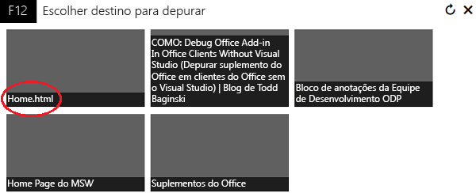
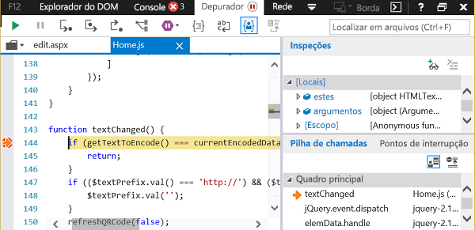

# Depurar suplementos usando as ferramentas de desenvolvedor F12 no Windows 10

As ferramentas de desenvolvedor F12 incluídas no Windows 10 o ajudam a depurar, testar e acelerar suas páginas da Web. Você também pode usá-las para desenvolver e a depurar seu suplemento do Office se não estiver usando um IDE como o Visual Studio ou se precisar investigar um problema durante a execução do suplemento fora do IDE. Você pode iniciar as ferramentas de desenvolvedor F12 depois que o suplemento estiver em execução.

Este artigo mostra como é possível usar a ferramenta Depurador das ferramentas de desenvolvedor F12 no Windows 10 para testar seu suplemento do Office. Você pode testar os suplementos da Office Store ou os suplementos que você adicionou de outros locais. As ferramentas F12 são exibidas em uma janela separada e não usam o Visual Studio.

 >**Observação** O Depurador faz parte das ferramentas de desenvolvedor F12 no Windows 10 e no Internet Explorer. As versões anteriores do Windows não incluem o Depurador. 

### Pré-requisitos

Você precisa dos seguintes softwares:

- As ferramentas do desenvolvedor F12, que estão incluídas no Windows 10. 
    
- O aplicativo cliente do Office que hospeda seu suplemento. 
    
- Seu suplemento. 
    
### Usar o depurador

Este exemplo usa o Word e um suplemento gratuito da Office Store.

1. Abra o Word e escolha um documento em branco. 
    
2. Na guia **Inserir**, no grupo Suplementos, armazene e selecione o suplemento QR4Office. (Você pode carregar qualquer suplemento do repositório ou seu catálogo de suplemento.)
    
3. Inicie as ferramentas de desenvolvimento F12 que correspondem à sua versão do Office:
    
      - Para a versão de 32 bits do Office, use C:\Windows\System32\F12\F12Chooser.exe
    
  - Para a versão de 64 bits do Office, use C:\Windows\SysWOW64\F12\F12Chooser.exe
    

    Quando você inicia F12Chooser, uma janela separada denominada "Escolher destino para depurar" exibe os possíveis aplicativos para depurar. Selecione o aplicativo do seu interesse. Se você estiver escrevendo seu próprio suplemento, selecione o site onde você deseja ter o suplemento implantado, que pode ser uma URL de localhost. 
    
    Por exemplo, selecione **home.html**. 
    
    

4. Na janela F12, selecione o arquivo que você deseja depurar.
    
    Para selecionar o arquivo, escolha o ícone de pasta acima do painel **script** (à esquerda). A lista suspensa mostra os arquivos disponíveis. Selecione home.js.
    
5. Defina o ponto de interrupção.
    
    To set the breakpoint in home.js, choose line 144, which is in the  _textChanged_ function. You will see a red dot to the left of the line and a corresponding line in the **Callstack and Breakpoints** (bottom right) pane. For other ways to set a breakpoint, see [Inspect running JavaScript with the Debugger](https://msdn.microsoft.com/library/dn255007%28v=vs.85%29.aspx). 
    
    

6. Execute o suplemento para acionar o ponto de interrupção.
    
    Escolha a caixa de texto da URL na parte superior do painel QR4Office para alterar o texto. No Depurador, no painel **Pilha de Chamadas e Pontos de Interrupção**, você verá que o ponto de interrupção está disparado e mostra várias informações. Talvez você precise atualizar a ferramenta F12 para ver os resultados.
    
    

## Recursos adicionais

- [Inspecionar executando JavaScript com o Depurador](https://msdn.microsoft.com/library/dn255007%28v=vs.85%29.aspx)
    
- [Usando as ferramentas de desenvolvedor F12](https://msdn.microsoft.com/pt-br/library/bg182326%28v=vs.85%29.aspx)
    
