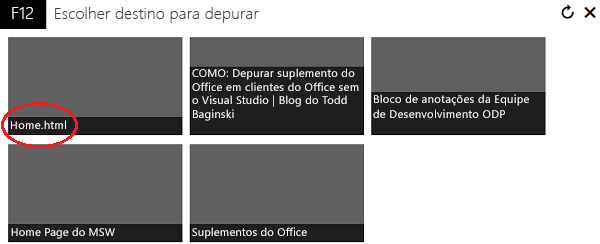
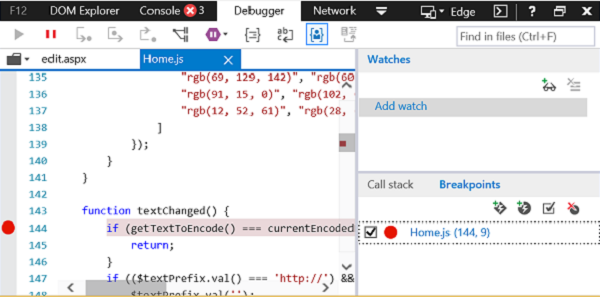
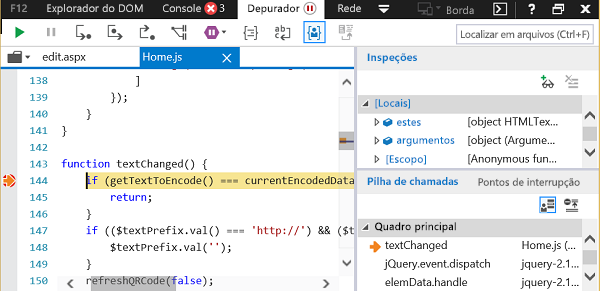

# Depurar suplementos usando as ferramentas de desenvolvedor no Windows 10Debug add-ins using developer tools on Windows 10

Há ferramentas de desenvolvedor fora dos IDEs disponíveis para ajudá-lo a depurar seus suplementos no Windows 10.There are developer tools outside of IDEs available to help you debug your add-ins on Windows 10. Elas são úteis quando você precisa investigar um problema enquanto executa seu suplemento fora do IDE.These are useful when you need to investigate a problem while running your add-in outside the IDE.

A ferramenta que você usa depende se o suplemento está sendo executado no Microsoft Edge ou no Internet Explorer.The tool that you use depends on whether the add-in is running in Microsoft Edge or Internet Explorer. Isso é determinado pela versão do Windows 10 e a versão do Office que estão instaladas no computador.This is determined by the version of Windows 10 and the version of Office that are installed on the computer. Para determinar qual navegador está sendo usado em seu computador de desenvolvimento, confira [Navegadores usados pelos Suplementos do Office](../concepts/browsers-used-by-office-web-add-ins.md).To determine which browser is being used on your development computer, see [Browsers used by Office Add-ins](../concepts/browsers-used-by-office-web-add-ins.md).

> [!NOTE]
> As instruções neste artigo não podem ser utilizadas para depurar um suplemento do Outlook que usa Funções Executar.The instructions in this article cannot be used to debug an Outlook add-in that uses Execute Functions. Para depurar um suplemento do Outlook que usa Funções Executar, é recomendável que você anexe ao Visual Studio no modo de script ou outro depurador de scripts.To debug an Outlook add-in that uses Execute Functions, we recommend that you attach to Visual Studio in script mode or to some other script debugger.

## Quando o suplemento estiver sendo executado no Microsoft EdgeWhen the add-in is running in Microsoft Edge

[!include[Enable debugging on Microsoft Edge DevTools](../includes/enable-debugging-on-edge-devtools.md)]

### Depurar usando o Microsoft Edge DevToolsDebug using Microsoft Edge DevTools

Quando o suplemento estiver sendo executado, você pode usar o [Microsoft Edge DevTools](https://www.microsoft.com/p/microsoft-edge-devtools-preview/9mzbfrmz0mnj?activetab=pivot%3Aoverviewtab).When the add-in is running in Microsoft Edge, you can use the [Microsoft Edge DevTools](https://www.microsoft.com/p/microsoft-edge-devtools-preview/9mzbfrmz0mnj?activetab=pivot%3Aoverviewtab).

1. Execute o suplemento.Run the add-in.

2. Execute o Microsoft Edge DevTools.Run the Microsoft Edge DevTools.

3. Nas ferramentas, abra a guia **Local**. Seu suplemento será listado por nome.In the tools, open the **Local** tab. Your add-in will be listed by its name.

4. Clique no nome do suplemento para abri-lo nas ferramentas.Click the add-in name to open it in the tools.

5. Abra a guia **Depurador**.Open the **Debugger** tab. 

6. Escolha o ícone de pasta acima do painel **script** (à esquerda).Choose the folder icon above the **script** (left) pane. Na lista de arquivos disponíveis exibidos na lista suspensa, selecione o arquivo JavaScript que você deseja depurar.From the list of available files shown in the dropdown list, select the JavaScript file that you want to debug.

7. Para definir um ponto de interrupção, selecione a linha.To set a breakpoint, select the line. Você verá um ponto vermelho à esquerda da linha e uma linha correspondente no painel **Pilha de Chamadas** (canto inferior direito).You will see a red dot to the left of the line and a corresponding line in the **Call stack** (bottom right) pane.

8. Execute funções no suplemento conforme necessário para disparar o ponto de interrupção.Execute functions in the add-in as needed to trigger the breakpoint.

## Quando o suplemento estiver sendo executado no Internet ExplorerWhen the add-in is running in Internet Explorer

Quando o suplemento estiver sendo executado no Internet Explorer, você poderá usar o depurador das ferramentas de desenvolvedor F12 no Windows 10 para testar seu suplemento.When the add-in is running in Internet Explorer, you can use the debugger from the F12 developer tools in Windows 10 to test your add-in. Você pode iniciar as ferramentas de desenvolvedor F12 depois que o suplemento estiver em execução.You can start the F12 developer tools after the add-in is running. As ferramentas F12 são exibidas em uma janela separada e não usam o Visual Studio.The F12 tools are displayed in a separate window and do not use Visual Studio.

> [!NOTE]
> O Depurador faz parte das ferramentas de desenvolvedor F12 no Windows 10 e no Internet Explorer. As versões anteriores do Windows não incluem o Depurador.The Debugger is part of the F12 developer tools in Windows 10 and Internet Explorer. Earlier versions of Windows do not include the Debugger. 

Este exemplo usa o Word e um suplemento gratuito do AppSource.This example uses Word and a free add-in from AppSource.

1. Abra o Word e escolha um documento em branco.Open Word and choose a blank document. 
    
2. Na guia **Inserir**, no grupo Suplementos e selecione **Store** e selecione o suplemento **QR4Office**.On the **Insert** tab, in the Add-ins group, choose **Store** and select the **QR4Office** Add-in. (Você pode carregar qualquer suplemento da Store ou seu catálogo de suplemento.)(You can load any add-in from the Store or your add-in catalog.)
    
3. Inicie as ferramentas de desenvolvimento F12 que correspondem à sua versão do Office:Launch the F12 development tools that corresponds to your version of Office:
    
   - Para a versão de 32 bits do Office, use C:\Windows\System32\F12\F12Chooser.exeFor the 32-bit version of Office, use C:\Windows\System32\F12\IEChooser.exe
    
   - Para a versão de 64 bits do Office, use C:\Windows\SysWOW64\F12\F12Chooser.exeFor the 64-bit version of Office, use C:\Windows\SysWOW64\F12\IEChooser.exe
    
   Quando você inicia IEChooser, uma janela separada denominada "Escolher destino para depurar" exibe os possíveis aplicativos para depurar.When you launch IEChooser, a separate window named "Choose target to debug" displays the possible applications to debug. Selecione o aplicativo do seu interesse.Select the application that you are interested in. Se você estiver escrevendo seu próprio suplemento, selecione o site onde você deseja ter o suplemento implantado, que pode ser uma URL de localhost.If you are writing your own add-in, select the website where you have the add-in deployed, which might be a localhost URL. 
    
   Por exemplo, selecione **home.html**.For example, select **home.html**. 
    
   

4. Na janela F12, selecione o arquivo que você deseja depurar.In the F12 window, select the file you want to debug.
    
   Para selecionar o arquivo na janela F12, escolha o ícone de pasta acima do painel **script** (à esquerda).To select the file in the F12 window, choose the folder icon above the **script** (left) pane. Na lista de arquivos disponíveis exibido na lista suspensa, selecione **Home.js**.From the list of available files shown in the dropdown list, select **Home.js**.
    
5. Defina o ponto de interrupção.Set the breakpoint.
    
   Para definir o ponto de interrupção no **Home.js**, escolha a linha 144, que está na função  `textChanged`.To set the breakpoint in **Home.js**, choose line 144, which is in the  `textChanged` function. Você verá um ponto vermelho à esquerda da linha e uma linha correspondente no painel Pilha de Chamadas e Pontos de Interrupção (canto inferior direito).You will see a red dot to the left of the line and a corresponding line in the **Call stack and Breakpoints** (bottom right) pane. Para ver outras maneiras de definir um ponto de interrupção, confira [Inspecionar executando JavaScript com o Depurador](/previous-versions/windows/internet-explorer/ie-developer/samples/dn255007(v=vs.85)).For other ways to set a breakpoint, see [Inspect running JavaScript with the Debugger](/previous-versions/windows/internet-explorer/ie-developer/samples/dn255007(v=vs.85)). 
    
   

6. Execute o suplemento para acionar o ponto de interrupção.Run your add-in to trigger the breakpoint.
    
   No Word, escolha a caixa de texto na parte superior da URL do painel **QR4Office** e tente digitar algum texto.In Word, choose the URL textbox in the upper part of the **QR4Office** pane and attempt to enter some text. No Depurador, no painel **Pilha de Chamadas e Pontos de Interrupção**, você verá que o ponto de interrupção está disparado e mostra várias informações.In the Debugger, in the **Call stack and Breakpoints** pane, you'll see that the breakpoint has triggered and shows various information. Talvez você precise atualizar o depurador para ver os resultados.You might need to refresh the Debugger to see the results.
    
   

## Confira tambémSee also

- [Inspecionar executando JavaScript com o Depurador](/previous-versions/windows/internet-explorer/ie-developer/samples/dn255007(v=vs.85))[Inspect running JavaScript with the Debugger](/previous-versions/windows/internet-explorer/ie-developer/samples/dn255007(v=vs.85))
- [Usando as ferramentas de desenvolvedor F12](/previous-versions/windows/internet-explorer/ie-developer/samples/bg182326(v=vs.85))[Using the F12 developer tools](/previous-versions/windows/internet-explorer/ie-developer/samples/bg182326(v=vs.85))
