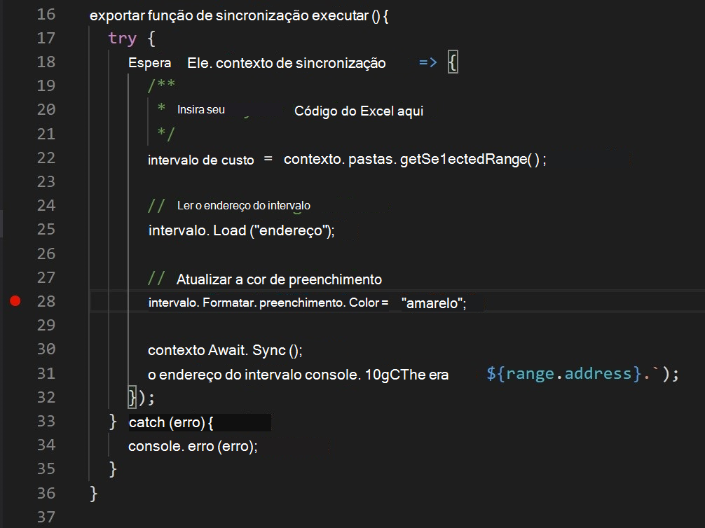

# <a name="debug-add-ins-on-windows-using-visual-studio-code-and-microsoft-edge-webview2-chromium-based"></a>Depurar suplementos no Windows usando Visual Studio Code e Microsoft Edge WebView2 (baseado em Chromium)

Os Suplementos do Office em execução no Windows podem depurar no tempo de execução do Edge Chromium WebView2 diretamente no Visual Studio Code.

> [!IMPORTANT]
> Este artigo só se aplica quando o Office executa os complementos no tempo de execução do Microsoft Edge Chromium WebView2, conforme explicado em [Navegadores usados pelos Suplementos do Office](../concepts/browsers-used-by-office-web-add-ins.md). Para obter instruções sobre depuração no Visual Studio Code em Versão Prévia do Microsoft Edge com o tempo de execução do WebView (EdgeHTML) original, consulte [Extensão do Depurador de Suplemento do Office para Visual Studio Code](debug-with-vs-extension.md).

> [!TIP]
> Se você não pode, ou não deseja, depurar usando ferramentas incorporadas ao Visual Studio Code; ou você está encontrando um problema que ocorre apenas quando o suplemento é executado fora do Visual Studio Code, você pode depurar o tempo de execução do Edge Chromium WebView2 usando as ferramentas de desenvolvedor do Edge (baseado em Chromium), conforme descrito em [Depurar suplementos usando ferramentas de desenvolvedor para Microsoft Edge WebView2](debug-add-ins-using-devtools-edge-chromium.md).

Esse modo de depuração é dinâmico, permitindo definir pontos de interrupção enquanto o código está em execução. Consulte as alterações em seu código imediatamente enquanto o depurador está anexado, tudo sem perder sua sessão de depuração. As alterações de código também persistem, para que você veja os resultados de várias alterações em seu código. A imagem a seguir mostra essa extensão em ação.


## <a name="prerequisites"></a>Pré-requisitos

- [Código do Visual Studio](https://code.visualstudio.com/)
- [Node.js (versão 10+)](https://nodejs.org/)
- Windows 10, 11
- Uma combinação de plataforma e aplicativo do Office que oferece suporte ao Microsoft Edge com WebView2 (baseado em Chromium), conforme explicado em [Navegadores usados pelos Suplementos do Office](../concepts/browsers-used-by-office-web-add-ins.md). Se a sua versão do Microsoft 365 for anterior a 2101, você precisará instalar o WebView2. Use as instruções para instalá-lo em [Microsoft Edge WebView2 / Embedar conteúdo da web ... com Microsoft Edge WebView2](https://developer.microsoft.com/microsoft-edge/webview2/).

## <a name="use-the-visual-studio-code-debugger"></a>Usar o depurador do Visual Studio Code

Estas instruções assumem que você tem experiência com o uso da linha de comando, que entende JavaScript básico e criou um projeto de Suplemento do Office antes de usar o [gerador Yeoman para Suplementos do Office](../develop/yeoman-generator-overview.md). Se você não tiver feito isso antes, veja um de nossos tutoriais, tal como o [tutorial do Suplemento do Office Excel](../tutorials/excel-tutorial.md).

1. A primeira etapa depende do projeto e de como ele foi criado.

   - Se você quiser criar um projeto para experimentar a depuração no Visual Studio Code, use o gerador [Yeoman para suplementos do Office](../develop/yeoman-generator-overview.md). Use qualquer um dos nossos guias de início rápido, como o início rápido do suplemento do [Outlook](../quickstarts/outlook-quickstart.md), para fazer isso.
   - Se você quiser depurar um projeto existente que foi criado com Yo Office, pule para a próxima etapa.
   - Se você quiser depurar um projeto existente que não foi criado com Yo Office, conclua o procedimento no [Apêndice A](#appendix-a) e retorne para a próxima etapa deste procedimento.

1. Abra VS Code e abra seu projeto nele. 

1. Escolha  **Exibir > Executar** ou insira **Ctrl+Shift+D** para alternar para o exibição de depuração.

1. Nas opções **EXECUTAR E DEPURAR**, escolha a opção Chromium de Borda para seu aplicativo host, como **Outlook Desktop (Edge Chromium)**. Selecione **F5** ou escolha **Executar > Iniciar Depuração** no menu para começar a depuração. Esta ação inicia automaticamente um servidor local em uma janela de Nó para hospedar seu suplemento e depois abre automaticamente o aplicativo host, como o Excel ou Word. Isso pode levar vários segundos.

   > [!TIP]
   > Se você não estiver usando um projeto criado com o Yo Office, talvez seja solicitado a ajustar uma chave do registro. Enquanto estiver na pasta raiz do seu projeto, execute o seguinte na linha de comando.
   >
   > ``` command&nbsp;line
   > npx office-addin-debugging start <your manifest path>
   > ```

   > [!IMPORTANT]
   > Se o seu projeto foi criado com versões mais antigas do Yo Office, você poderá ver a caixa de diálogo de erro a seguir cerca de 10 a 30 segundos depois de começar a depuração (nesse ponto você pode já ter passado para outra etapa neste procedimento) e ela pode estar oculta atrás da caixa de diálogo descrita na próxima etapa.
   >
   > 
   >
   > Conclua as tarefas no [Apêndice B](#appendix-b) e reinicie este procedimento.
   
1. No aplicativo host, seu suplemento agora está pronto para uso. Selecione **Mostrar Painel de Tarefas** ou execute qualquer outro comando de suplemento. Uma caixa de diálogo aparecerá com texto semelhante ao seguinte:

   > WebView Stop On Load.
   > Para depurar o modo de exibição da Web, anexe o VS Code à instância de modo de exibição da Web usando o Depurador da Microsoft para extensão do Edge, e clique em OK para continuar. Para impedir que essa caixa de diálogo seja exibida no futuro, clique em Cancelar.

   Clique em **OK**.

   [!INCLUDE [Cancelling the WebView Stop On Load dialog box](../includes/webview-stop-on-load-cancel-dialog.md)]

1. Agora você pode definir pontos de interrupção no código e depuração do projeto. Para definir pontos de interrupção Visual Studio Code, passe o mouse ao lado de uma linha de código e selecione o círculo vermelho que aparece.

    

1. Execute a funcionalidade no seu complemento que chama as linhas com pontos de interrupção. Você verá que os pontos de interrupção foram atingidos e você pode inspecionar variáveis locais.

   > [!NOTE]
   > Pontos de interrupção em chamadas de `Office.initialize` ou `Office.onReady` são ignorados. Para obter detalhes sobre essas funções, consulte [Inicializar seu Suplemento do Office](../develop/initialize-add-in.md).

> [!IMPORTANT]
> A melhor maneira de interromper uma sessão de depuração é selecionar **Shift+F5** ou escolher **Executar > Interromper Depuração** no menu. Esta ação deve fechar a janela do servidor de Nó e tentar fechar o aplicativo host, mas haverá um aviso no aplicativo host perguntando se você deseja salvar o documento ou não. Faça uma escolha apropriada e deixe o aplicativo host fechar. Evite fechar manualmente a janela de Nó ou o aplicativo host. Fazer isso pode causar bugs, especialmente quando você interrompe e inicia sessões de depuração repetidamente.
>
> Se a depuração parar de funcionar; por exemplo, se os pontos de interrupção estão sendo ignorados; interrompa a depuração. Em seguida, se necessário, feche todas as janelas do aplicativo host e a janela de Nó. Finalmente, feche o Visual Studio Code e abra-o novamente.

### <a name="appendix-a"></a>Apêndice A

Se seu projeto não tiver sido criado com o Yo Office, você precisará criar uma configuração de depuração para Visual Studio Code. 

1. Crie um arquivo nomeado `launch.json` na `\.vscode` pasta do projeto se ainda não houver um. 
1. Verifique se o arquivo tem uma `configurations` matriz. A seguir, um exemplo simples de um `launch.json`.

   ```json
   {
     // other properities may be here.
   
     "configurations": [
   
       // configuration objects may be here.
   
     ]
   
     //other properies may be here.
   }
   ```

1. Adicione o objeto a seguir à `configurations` matriz.

   ```json
   {
      "name": "$HOST$ Desktop (Edge Chromium)",
      "type": "pwa-msedge",
      "request": "attach",
      "useWebView": true,
      "port": 9229,
      "timeout": 600000,
      "webRoot": "${workspaceRoot}",
      "preLaunchTask": "Debug: Excel Desktop",
      "postDebugTask": "Stop Debug"
   },
   ```

1. Substitua o espaço reservado `$HOST$` pelo nome do aplicativo do Office em que o suplemento é executado; por exemplo, `Outlook` ou `Word`.
1. Salve e feche o arquivo.

### <a name="appendix-b"></a>Apêndice B

1. Na caixa de diálogo erro, selecione o botão **Cancelar**.
1. Se a depuração não parar automaticamente, selecione **Shift+F5** ou escolha **Executar > Parar Depuração** no menu. 
1. Feche a janela Nó onde o servidor local está sendo executado, se ele não fechar automaticamente.
1. Feche o aplicativo do Office se ele não fechar automaticamente.
1. Abra o `\.vscode\launch.json` arquivo no projeto. 
1. Na matriz `configurations`, há vários objetos de configuração.Localize aquele cujo nome tem o padrão `$HOST$ Desktop (Edge Chromium)`, onde $HOST$ é um aplicativo do Office que seu suplemento executa; por exemplo, `Outlook Desktop (Edge Chromium)` ou `Word Desktop (Edge Chromium)`. 
1. Altere o valor da propriedade `"type"` de `"edge"` para `"pwa-msedge"`.
1. Altere o valor da propriedade `"useWebView"` da cadeia de caracteres `"advanced"` para o booleano `true` (observe que não há aspas ao redor do `true`).
1. Salve o arquivo.
1. Feche VS Code.

## <a name="see-also"></a>Confira também

- [Testar e depurar Suplementos do Office](test-debug-office-add-ins.md)
- [Depurar os suplementos no Windows usando Visual Studio Code e Microsoft Edge WebView herdado (EdgeHTML)](debug-with-vs-extension.md)
- [Depurar os suplementos usando as ferramentas de desenvolvedor para o Internet Explorer](debug-add-ins-using-f12-tools-ie.md)
- [Depurar suplementos usando ferramentas de desenvolvedor para Edge Legacy](debug-add-ins-using-devtools-edge-legacy.md)
- [Depurar suplementos usando ferramentas de desenvolvedor no Microsoft Edge (baseado em Chromium)](debug-add-ins-using-devtools-edge-chromium.md)
- [Anexar um depurador do painel de tarefas](attach-debugger-from-task-pane.md)
- [Runtimes em Suplementos do Office](runtimes.md)
