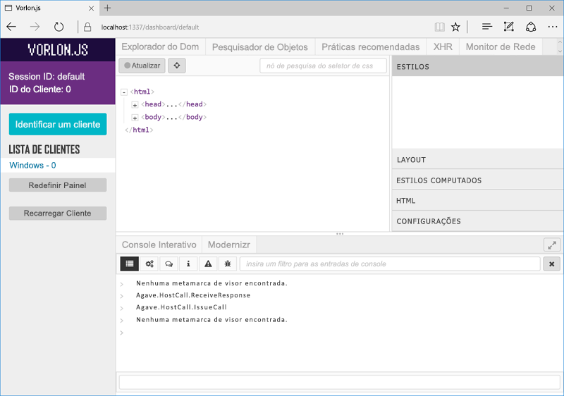

# <a name="debug-office-add-ins-on-ipad-and-mac"></a>Depurar suplementos do Office no iPad e no Mac

Você pode usar o Visual Studio para desenvolver e depurar suplementos no Windows, mas não pode usá-lo para depurar suplementos no iPad ou no Mac. Como os suplementos são desenvolvidos usando HTML e Javascript, são projetados para funcionar em várias plataformas, mas pode haver diferenças sutis em como cada navegador processa o HTML. Este artigo descreve como depurar suplementos em execução em um iPad ou em um Mac. 

## <a name="debugging-with-safari-web-inspector-on-a-mac"></a>Depuração com o Safari Web Inspector em um Mac

Se você tiver um suplemento que mostre a interface do usuário em um painel de tarefas ou em um suplemento de conteúdo, você pode depurar um suplemento do Office usando o Safari Web Inspector. 

Para poder depurar suplementos do Office no Mac, você deve ter o Mac OS High Sierra e Mac Office Versão: 16.9.1 (compilação 18012504) ou posterior. Se você não tiver uma compilação do Office Mac, poderá obter uma ao adquirir o [programa Office 365 Developer](https://aka.ms/o365devprogram).

Para começar, abra um terminal e defina a propriedade `OfficeWebAddinDeveloperExtras` para o aplicativo relevante do Office da seguinte maneira:

- `defaults write com.microsoft.Word OfficeWebAddinDeveloperExtras -bool true`

- `defaults write com.microsoft.Excel OfficeWebAddinDeveloperExtras -bool true`

- `defaults write com.microsoft.Powerpoint OfficeWebAddinDeveloperExtras -bool true`

- `defaults write com.microsoft.Outlook OfficeWebAddinDeveloperExtras -bool true`

Em seguida, abra o aplicativo do Office e insira seu suplemento. Clique com o botão direito no suplemento e você verá a opção **Inspecionar elemento** no menu de contexto.  Selecione essa opção e ela abrirá o Inspetor, onde você pode definir pontos de interrupção e depurar seu suplemento.

> [!NOTE]
> Observe que esse é um recurso experimental e não há garantias de que preservaremos essa funcionalidade em versões futuras de aplicativos do Office.

## <a name="debugging-with-vorlonjs-on-a-ipad-or-mac"></a>Depuração com o Vorlon.JS em um iPad ou Mac

Para depurar um suplemento no iPad ou Mac, você pode usar o Vorlon.JS, um depurador para páginas da Web que é semelhante às ferramentas F12. Ele é projetado para funcionar remotamente e permite depurar páginas da Web em dispositivos diferentes. Para saber mais, veja o [site do Vorlon](http://www.vorlonjs.com).  


### <a name="install-and-set-up-vorlonjs"></a>Instalar e configurar o Vorlon.JS  

1.  Faça logon no dispositivo como um administrador.

2.  Instale o [Node.js](https://nodejs.org) se ele ainda não estiver instalado. 

3.  Abra uma janela do **Terminal** e digite o comando `npm i -g vorlon`. A ferramenta está instalada em `/usr/local/lib/node_modules/vorlon`.


### <a name="configure-vorlonjs-to-use-https"></a>Configurar o Vorlon.JS para usar HTTPS

Para depurar um aplicativo usando o Vorlon.JS, adicione uma marca `<script>` à página de abertura do aplicativo que carrega um script Vorlon.JS de um local conhecido (veja os detalhes no procedimento a seguir). Se um suplementos for protegido por SSL (HTTPS), todos os scripts usados deverão estar hospedados em um servidor HTTPS, inclusive o script Vorlon.JS. Portanto, você precisará configurar o Vorlon.JS para usar SSL se quiser usar esse script com suplementos. 

> [!IMPORTANT]
> [!include[HTTPS guidance](../includes/https-guidance.md)]

1.  No **Localizador**, acesse `/usr/local/lib/node_modules/vorlon`, abra o menu de contexto (clique com o botão direito do mouse) da pasta `/Server` e escolha **Obter Informações**.

2.  Escolha o ícone de cadeado no canto inferior direito da janela **Informações do servidor** para desbloquear a pasta.

3. Na seção **Compartilhamento e Permissões** da janela, defina o **Privilégio** para o grupo **funcionários** como **Leitura/Gravação**.

4. Escolha o ícone de cadeado novamente para ***voltar a bloquear*** a pasta.

5. No **Localizador**, expanda a subpasta `/Server`, clique com botão direito no arquivo `config.json` e selecione **Obter Informações**.

6. Na janela **informações de config.json**, altere os privilégios do arquivo da mesma forma que você fez para sua pasta `/Server` pai. Não se esqueça de bloquear novamente e de fechar a janela.

7. No **Localizador**, clique com botão direito do mouse no arquivo `config.json`, selecione **Abrir com**e selecione **TextEdit**. O arquivo é aberto em um editor de texto.

8. Altere a propriedade **useSSL** para `true`.

9. Na seção **plug-ins**, localize o plug-in com a **id** de `OFFICE` e o **nome** de `Office Addin`. Se a propriedade **enabled** do plug-in ainda não estiver como `true`, defina-a como `true`.

10. Salve o arquivo e feche o editor.

11. No **Localizador**, navegue até `/usr/local/lib/node_modules/vorlon`, clique com botão direito do mouse na subpasta `Server` e selecione **Novo terminal na pasta**. 
    
12. Na janela do **Terminal**, digite `sudo vorlon`. Será solicitado que você digite sua senha de administrador. O servidor Vorlon é iniciado. Deixe aberta a janela do **Terminal**.

13. Abra uma janela do navegador e vá para `https://localhost:1337`, que é a interface do Vorlon.JS. Quando solicitado, escolha **Sempre** para confiar no certificado de segurança. 

    > [!NOTE]
    > Se não for solicitado, talvez seja necessário confiar no certificado manualmente. O arquivo de certificado é `/usr/local/lib/node_modules/vorlon/Server/cert/server.crt`. Experimente as etapas a seguir. Se você tiver problemas, veja a ajuda do Macintosh ou do iPad. 
    >
    > 1. Feche a janela do navegador e na janela do **Terminal** que está executando o servidor Vorlon, use Control-C para parar o servidor.
    > 2. No **Localizador**, clique com botão direito do mouse no arquivo `server.crt` e escolha **Acesso ao Conjunto de Chaves**. A janela **Acesso ao Conjunto de Chaves** é exibida.
    > 3. Na lista **Conjuntos de Chaves** à esquerda, escolha **logon**, caso ainda não estiver marcado, e, em seguida, escolha **Certificados** na seção **Categoria**. Verifique se o **localhost** do certificado está na lista.
    > 4. Clique com botão direito do mouse no **localhost** do certificado e escolha **Obter Informações**. Uma janela do **localhost** é exibida.
    > 5. Na seção **Confiar**, abra o seletor rotulado como **Ao usar este certificado** e escolha **Sempre Confiar**. 
    > 6. Feche a janela do **localhost**. Se a ação for bem-sucedida, o certificado do **localhost** na janela **Acesso ao Conjunto de Chaves** exibirá uma cruz branca em um círculo azul no ícone.


### <a name="configure-the-add-in-for-vorlonjs-debugging"></a>Configurar o suplemento para depuração do Vorlon.JS

1. Adicione a seguinte marca de script à seção `<head>` do arquivo home.html (ou arquivo HTML principal) do seu suplemento:

    ```html
    <script src="https://localhost:1337/vorlon.js"></script>    
    ```  

2. Implante o aplicativo da Web do suplemento em um servidor Web que pode ser acessado do Mac ou iPad, como um site do Azure. 

3. Atualize a URL do suplemento em todos os locais onde a URL aparece no manifesto do suplemento.

4. No Mac ou iPad, copie o manifesto do suplemento na seguinte pasta: `/Users/{your_name_on_the_device}/Library/Containers/com.microsoft.{host_name}/Data/Documents/wef`, onde *{nome_do_host}* é Word, Excel, PowerPoint ou Outlook.


### <a name="inspect-an-add-in-in-vorlonjs"></a>Inspecionar um suplemento no Vorlon.JS

1. Se o servidor Vorlon não estiver sendo executado, no **Localizador**, navegue até `/usr/local/lib/node_modules/vorlon`, clique com botão direito na subpasta `Server` e selecione **Novo terminal na pasta**. 
    
2.  Na janela do **Terminal**, digite `sudo vorlon`. Será solicitado que você digite sua senha de administrador. O servidor Vorlon é iniciado. Deixe aberta a janela do **Terminal**.

3.  Abra uma janela do navegador e vá para `https://localhost:1337`, que é a interface do Vorlon.JS.

4. Faça o sideload do suplemento. Para o Excel, PowerPoint ou Word, faça o sideload conforme descrito em [Fazer sideload de um suplemento do Office no iPad e no Mac](sideload-an-office-add-in-on-ipad-and-mac.md). Se for um suplemento do Outlook, faça o sideload conforme descrito em [Fazer sideload de suplementos do Outlook para teste](https://docs.microsoft.com/outlook/add-ins/sideload-outlook-add-ins-for-testing). Se o suplemento não usar comandos de suplemento, ele será imediatamente aberto. Caso contrário, escolha o botão para abrir o suplemento. Dependendo da compilação do aplicativo host do Office, o botão será exibido na guia **Página Inicial** ou **Suplemento**.

O suplemento aparecerá na lista de Clientes no Vorlon.JS (no lado esquerdo da interface do Vorlon.JS) como **{OS} - n**, para um determinado número *n* e onde *{OS}* é o tipo de dispositivo, como "Macintosh". 



A ferramenta Vorlon tem uma variedade de plug-ins. Os que estiverem habilitados no momento serão exibidos como guias na parte superior da ferramenta. (É possível habilitar mais plug-ins escolhendo o ícone de engrenagem no canto esquerdo). Esses plug-ins são semelhantes às funções nas ferramentas F12. Por exemplo, você pode realçar elementos DOM, executar comandos e muito mais. Para obter mais detalhes, veja [Principais plug-ins da documentação do Vorlon](http://vorlonjs.com/documentation/#console) 

Um plug-in do **Suplemento do Office** adiciona recursos extras ao Office.js, como explorar o modelo de objeto e executar chamadas de Office.js e ler os valores das propriedades de objetos. Para obter instruções, veja [Plug-in do VorlonJS para depuração de suplementos do Office](https://blogs.msdn.microsoft.com/mim/2016/02/18/vorlonjs-plugin-for-debugging-office-addin/).

> [!NOTE]
> Não é possível definir pontos de interrupção no Vorlon.JS.


## <a name="clearing-the-office-applications-cache-on-a-mac-or-ipad"></a>Limpar cache do aplicativo do Office em um Mac ou iPad

Os Suplementos muitas vezes são armazenados em cache no Office para Mac por questão de desempenho. Normalmente, o cache será limpo quando o suplemento for recarregado. Se houver mais de um suplemento no mesmo documento, é provável que o processo de limpeza automática do cache ao recarregar não seja confiável. 

No Mac, o cache pode ser limpo manualmente ao excluir tudo na pasta `/Users/{your_name_on_the_device}/Library/Containers/com.Microsoft.OsfWebHost/Data/`. 

No iPad, você pode chamar `window.location.reload(true)` a partir do JavaScript no suplemento para forçar uma recarrega. Uma outra alternativa é reinstalar o Office.
