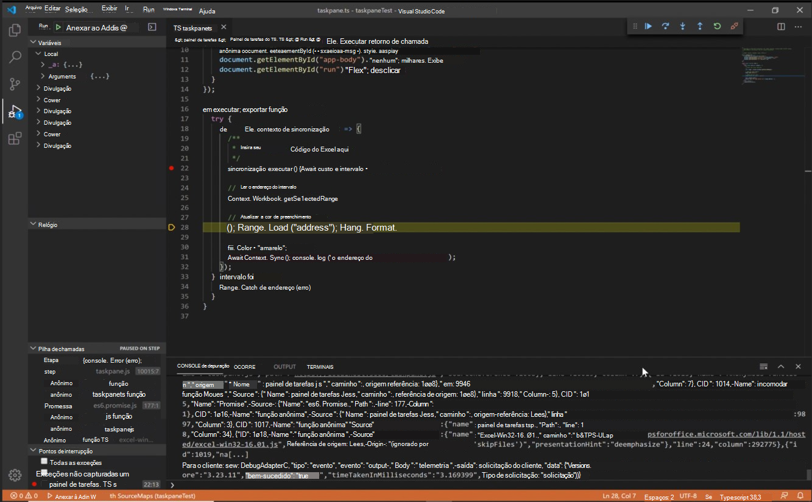
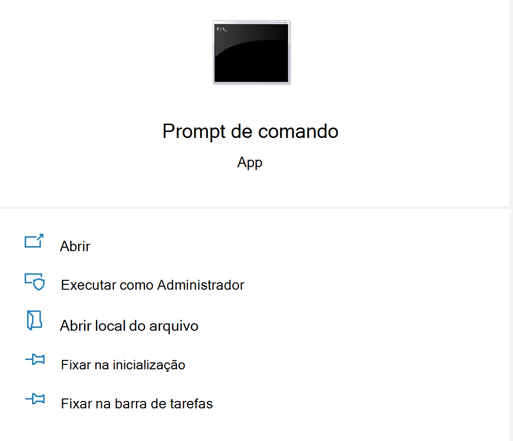

# <a name="microsoft-office-add-in-debugger-extension-for-visual-studio-code"></a><span data-ttu-id="a4b66-103">Extensão de depuração de suplementos do Microsoft Office para o Visual Studio Code</span><span class="sxs-lookup"><span data-stu-id="a4b66-103">Microsoft Office Add-in Debugger Extension for Visual Studio Code</span></span>

<span data-ttu-id="a4b66-104">A Extensão de Depurador de Add-in do Microsoft Office para Visual Studio Code permite que você depure seu Complemento do Office em relação ao tempo de execução do Edge.</span><span class="sxs-lookup"><span data-stu-id="a4b66-104">The Microsoft Office Add-in Debugger Extension for Visual Studio Code allows you to debug your Office Add-in against the Edge runtime.</span></span>

<span data-ttu-id="a4b66-105">Esse modo de depuração é dinâmico, permitindo definir pontos de interrupção enquanto o código está em execução.</span><span class="sxs-lookup"><span data-stu-id="a4b66-105">This debugging mode is dynamic, allowing you to set breakpoints while code is running.</span></span> <span data-ttu-id="a4b66-106">Você pode ver as alterações em seu código imediatamente enquanto o depurador está anexado, tudo sem perder sua sessão de depuração.</span><span class="sxs-lookup"><span data-stu-id="a4b66-106">You can see changes in your code immediately while the debugger is attached, all without losing your debugging session.</span></span> <span data-ttu-id="a4b66-107">As alterações de código também persistem, para que você possa ver os resultados de várias alterações em seu código.</span><span class="sxs-lookup"><span data-stu-id="a4b66-107">Your code changes also persist, so you can see the results of multiple changes to your code.</span></span> <span data-ttu-id="a4b66-108">A imagem a seguir mostra essa extensão em ação.</span><span class="sxs-lookup"><span data-stu-id="a4b66-108">The following image shows this extension in action.</span></span>



## <a name="prerequisites"></a><span data-ttu-id="a4b66-110">Pré-requisitos</span><span class="sxs-lookup"><span data-stu-id="a4b66-110">Prerequisites</span></span>

- <span data-ttu-id="a4b66-111">[Visual Studio Code](https://code.visualstudio.com/) (deve ser executado como administrador)</span><span class="sxs-lookup"><span data-stu-id="a4b66-111">[Visual Studio Code](https://code.visualstudio.com/) (must be run as an administrator)</span></span>
- [<span data-ttu-id="a4b66-112">Node.js (versão 10+)</span><span class="sxs-lookup"><span data-stu-id="a4b66-112">Node.js (version 10+)</span></span>](https://nodejs.org/)
- <span data-ttu-id="a4b66-113">Windows 10</span><span class="sxs-lookup"><span data-stu-id="a4b66-113">Windows 10</span></span>
- [<span data-ttu-id="a4b66-114">Microsoft Edge</span><span class="sxs-lookup"><span data-stu-id="a4b66-114">Microsoft Edge</span></span>](https://www.microsoft.com/edge)

<span data-ttu-id="a4b66-115">Estas instruções presumem que você tenha experiência com o uso da linha de comando, compreenda o JavaScript básico e tenha criado um projeto de complemento do Office antes de usar o gerador Yo Office.</span><span class="sxs-lookup"><span data-stu-id="a4b66-115">These instructions assume you have experience using the command line, understand basic JavaScript, and have created an Office add-in project before using the Yo Office generator.</span></span> <span data-ttu-id="a4b66-116">Se você ainda não fez isso antes, considere visitar um de nossos tutoriais, como este tutorial de Complemento [do Office do Excel.](../tutorials/excel-tutorial.md)</span><span class="sxs-lookup"><span data-stu-id="a4b66-116">If you haven't done this before, consider visiting one of our tutorials, like this [Excel Office Add-in tutorial](../tutorials/excel-tutorial.md).</span></span>

## <a name="install-and-use-the-debugger"></a><span data-ttu-id="a4b66-117">Instalar e usar o depurador</span><span class="sxs-lookup"><span data-stu-id="a4b66-117">Install and use the debugger</span></span>

1. <span data-ttu-id="a4b66-118">Se você precisar criar um projeto de complemento, [use o gerador Yo Office para criar um.](../quickstarts/excel-quickstart-jquery.md?tabs=yeomangenerator)</span><span class="sxs-lookup"><span data-stu-id="a4b66-118">If you need to create an add-in project, [use the Yo Office generator to create one](../quickstarts/excel-quickstart-jquery.md?tabs=yeomangenerator).</span></span> <span data-ttu-id="a4b66-119">Siga os prompts dentro da linha de comando para configurar seu projeto.</span><span class="sxs-lookup"><span data-stu-id="a4b66-119">Follow the prompts within the command line to set up your project.</span></span> <span data-ttu-id="a4b66-120">Você pode escolher qualquer idioma ou tipo de projeto para atender às suas necessidades.</span><span class="sxs-lookup"><span data-stu-id="a4b66-120">You can choose any language or type of project to suit your needs.</span></span>

> [!NOTE]
> <span data-ttu-id="a4b66-121">Se você já tiver um projeto, pule a etapa 1 e vá para a etapa 2.</span><span class="sxs-lookup"><span data-stu-id="a4b66-121">If you already have a project, skip step 1 and move to step 2.</span></span>

2. <span data-ttu-id="a4b66-122">Abra um prompt de comando como administrador.</span><span class="sxs-lookup"><span data-stu-id="a4b66-122">Open a command prompt as administrator.</span></span>
   <span data-ttu-id="a4b66-123"></span><span class="sxs-lookup"><span data-stu-id="a4b66-123"></span></span>

3. <span data-ttu-id="a4b66-124">Navegue até o diretório do projeto.</span><span class="sxs-lookup"><span data-stu-id="a4b66-124">Navigate to your project directory.</span></span>

4. <span data-ttu-id="a4b66-125">Execute o seguinte comando para abrir seu projeto no Visual Studio Code como administrador.</span><span class="sxs-lookup"><span data-stu-id="a4b66-125">Run the following command to open your project in Visual Studio Code as an administrator.</span></span>

```command&nbsp;line
code .
```

<span data-ttu-id="a4b66-126">Depois que o Visual Studio Code for aberto, navegue manualmente até a pasta do projeto.</span><span class="sxs-lookup"><span data-stu-id="a4b66-126">Once Visual Studio Code is open, navigate manually to the project folder.</span></span>

> [!TIP]
> <span data-ttu-id="a4b66-127">Para abrir o Visual Studio Code como administrador, selecione a opção **executar** como administrador ao abrir o Visual Studio Code depois de procurar no Windows.</span><span class="sxs-lookup"><span data-stu-id="a4b66-127">To open Visual Studio Code as an administrator, select the **run as administrator** option when opening Visual Studio Code after searching for it in Windows.</span></span>

5. <span data-ttu-id="a4b66-128">No VS Code, selecione **CTRL + SHIFT + X** para abrir a barra extensões.</span><span class="sxs-lookup"><span data-stu-id="a4b66-128">Within VS Code, select **CTRL + SHIFT + X** to open the Extensions bar.</span></span> <span data-ttu-id="a4b66-129">Procure a extensão "Depurador de Complementos do Microsoft Office" e instale-a.</span><span class="sxs-lookup"><span data-stu-id="a4b66-129">Search for the "Microsoft Office Add-in Debugger" extension and install it.</span></span>

6. <span data-ttu-id="a4b66-130">Na pasta .vscode do seu projeto, abra o **launch.jsno** arquivo.</span><span class="sxs-lookup"><span data-stu-id="a4b66-130">In the .vscode folder of your project, open the **launch.json** file.</span></span> <span data-ttu-id="a4b66-131">Adicione o seguinte código à `configurations` seção:</span><span class="sxs-lookup"><span data-stu-id="a4b66-131">Add the following code to the `configurations` section:</span></span>

```JSON
{
  "type": "office-addin",
  "request": "attach",
  "name": "Attach to Office Add-ins",
  "port": 9222,
  "trace": "verbose",
  "url": "https://localhost:3000/taskpane.html?_host_Info=HOST$Win32$16.01$en-US$$$$0",
  "webRoot": "${workspaceFolder}",
  "timeout": 45000
}
```

7. <span data-ttu-id="a4b66-132">Na seção do JSON que você acabou de copiar, encontre a seção "url".</span><span class="sxs-lookup"><span data-stu-id="a4b66-132">In the section of JSON you just copied, find the "url" section.</span></span> <span data-ttu-id="a4b66-133">Nesta URL, você precisará substituir o texto HOST em maiúsculas pelo aplicativo que está hospedando o seu complemento do Office.</span><span class="sxs-lookup"><span data-stu-id="a4b66-133">In this URL, you will need to replace the uppercase HOST text with the application that is hosting your Office add-in.</span></span> <span data-ttu-id="a4b66-134">Por exemplo, se o seu complemento do Office for para Excel, o valor da URL seria " https://localhost:3000/taskpane.html?_host_Info= <strong>Excel</strong>$Win 32$16.01$en-US$ \$ \$ \$ 0".</span><span class="sxs-lookup"><span data-stu-id="a4b66-134">For example, if your Office add-in is for Excel, your URL value would be "https://localhost:3000/taskpane.html?_host_Info=<strong>Excel</strong>$Win32$16.01$en-US$\$\$\$0".</span></span>

8. <span data-ttu-id="a4b66-135">Abra o prompt de comando e verifique se você está na pasta raiz do seu projeto.</span><span class="sxs-lookup"><span data-stu-id="a4b66-135">Open the command prompt and ensure you are at the root folder of your project.</span></span> <span data-ttu-id="a4b66-136">Execute o comando `npm start` para iniciar o servidor de dev.</span><span class="sxs-lookup"><span data-stu-id="a4b66-136">Run the command `npm start` to start the dev server.</span></span> <span data-ttu-id="a4b66-137">Quando o seu complemento for carregado no cliente do Office, abra o painel de tarefas.</span><span class="sxs-lookup"><span data-stu-id="a4b66-137">When your add-in loads in the Office client, open the task pane.</span></span>

9. <span data-ttu-id="a4b66-138">Retorne ao Visual Studio Code e escolha **Exibir > Depurar** ou insira **CTRL + SHIFT + D** para alternar para o exibição de depuração.</span><span class="sxs-lookup"><span data-stu-id="a4b66-138">Return to Visual Studio Code and choose **View > Debug** or enter **CTRL + SHIFT + D** to switch to debug view.</span></span>

10. <span data-ttu-id="a4b66-139">Nas opções de Depuração, escolha **Anexar aos Complementos do Office.** Selecione **F5** ou **Depurar -> Iniciar Depuração** no menu para começar a depuração.</span><span class="sxs-lookup"><span data-stu-id="a4b66-139">From the Debug options, choose **Attach to Office Add-ins**. Select **F5** or choose **Debug -> Start Debugging** from the menu to begin debugging.</span></span>

11. <span data-ttu-id="a4b66-140">Definir um ponto de interrupção no arquivo do painel de tarefas do projeto.</span><span class="sxs-lookup"><span data-stu-id="a4b66-140">Set a breakpoint in your project's task pane file.</span></span> <span data-ttu-id="a4b66-141">Você pode definir pontos de interrupção no VS Code ao passar o mouse ao lado de uma linha de código e selecionando o círculo vermelho que aparece.</span><span class="sxs-lookup"><span data-stu-id="a4b66-141">You can set breakpoints in VS Code by hovering next to a line of code and selecting the red circle which appears.</span></span>


12. <span data-ttu-id="a4b66-143">Execute o seu complemento.</span><span class="sxs-lookup"><span data-stu-id="a4b66-143">Run your add-in.</span></span> <span data-ttu-id="a4b66-144">Você verá que pontos de interrupção foram atingidos e poderá inspecionar variáveis locais.</span><span class="sxs-lookup"><span data-stu-id="a4b66-144">You will see that breakpoints have been hit and you can inspect local variables.</span></span>

## <a name="see-also"></a><span data-ttu-id="a4b66-145">Confira também</span><span class="sxs-lookup"><span data-stu-id="a4b66-145">See also</span></span>

* [<span data-ttu-id="a4b66-146">Testar e depurar Suplementos do Office</span><span class="sxs-lookup"><span data-stu-id="a4b66-146">Test and debug Office Add-ins</span></span>](test-debug-office-add-ins.md)

* [<span data-ttu-id="a4b66-147">Depurar suplementos usando as ferramentas de desenvolvedor no Windows 10</span><span class="sxs-lookup"><span data-stu-id="a4b66-147">Debug add-ins using developer tools on Windows 10</span></span>](debug-add-ins-using-f12-developer-tools-on-windows-10.md)

* [<span data-ttu-id="a4b66-148">Anexar um depurador do painel de tarefas</span><span class="sxs-lookup"><span data-stu-id="a4b66-148">Attach a debugger from the task pane</span></span>](attach-debugger-from-task-pane.md)