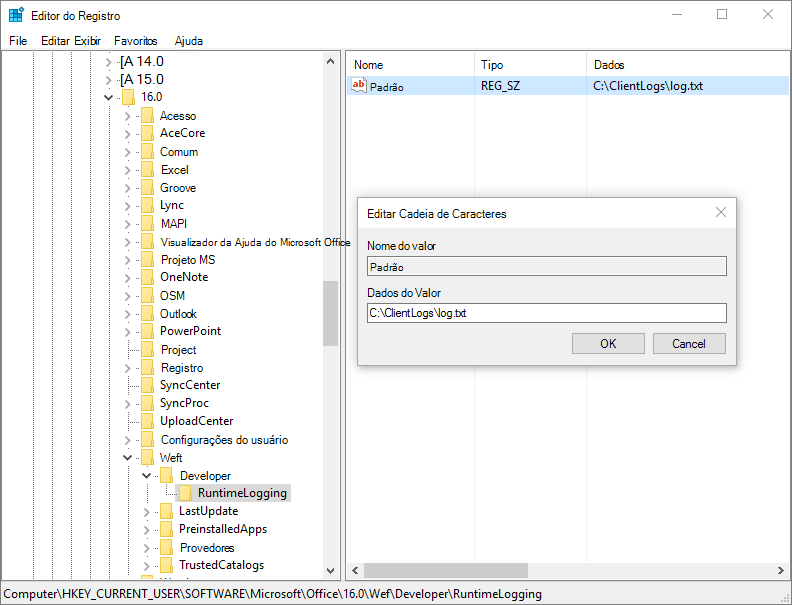

# <a name="debug-your-add-in-with-runtime-logging"></a>Depurar seu suplemento com o log de tempo de execução

Você pode usar o log de tempo de execução para depurar o manifesto do seu suplemento, assim como diversos erros de instalação. Esse recurso pode ajudá-lo a identificar e corrigir problemas com seu manifesto que não são detectados pela validação de esquema XSD, como uma incompatibilidade entre as identificações dos recursos. O log de tempo de execução é particularmente útil para depurar suplementos que implementam comandos de suplemento e funções personalizadas do Excel.

> [!NOTE]
> O recurso de log de tempo de execução está disponível para Office 2016 ou posterior na área de trabalho.

> [!IMPORTANT]
> O log do tempo de execução afeta o desempenho. Ative-o somente quando precisar depurar problemas com seu manifesto de suplemento.

## <a name="use-runtime-logging-from-the-command-line"></a>Use o log de tempo de execução na linha de comandos

Habilitar o log de tempo de execução na linha de comando é a maneira mais rápida de usar essa ferramenta de log. Esse usa npx, que é fornecido por padrão como parte do npm@5.2.0+. Se você possui uma versão anterior do [npm](https://www.npmjs.com/), tente as instruções do [Log de tempo de execução no Windows](#runtime-logging-on-windows) ou do [Log de tempo de execução no Mac](#runtime-logging-on-mac), ou [instale o npx](https://www.npmjs.com/package/npx).

- Para habilitar o log de tempo de execução:

    ```command&nbsp;line
    npx office-addin-dev-settings runtime-log --enable
    ```

- Para habilitar o log de tempo de execução apenas para um arquivo específico, use o mesmo comando com um nome de arquivo:

    ```command&nbsp;line
    npx office-addin-dev-settings runtime-log --enable [filename.txt]
    ```

- Para desabilitar o log de tempo de execução:

    ```command&nbsp;line
    npx office-addin-dev-settings runtime-log --disable
    ```

- Para exibir se o log de tempo de execução está ativado:

    ```command&nbsp;line
    npx office-addin-dev-settings runtime-log
    ```

- Para exibir ajuda na linha de comandos para o log de tempo de execução:

    ```command&nbsp;line
    npx office-addin-dev-settings runtime-log --help
    ```

## <a name="runtime-logging-on-windows"></a>Log de tempo de execução no Windows

1. Verifique se você está executando o Office 2016 para área de trabalho na compilação **16.0.7019** ou posterior.

2. Adicione a chave do registro `RuntimeLogging` em `HKEY_CURRENT_USER\SOFTWARE\Microsoft\Office\16.0\WEF\Developer\`

    [!include[Developer registry key](../includes/developer-registry-key.md)]

3. Defina o valor padrão da chave **RuntimeLogging** para o caminho completo do arquivo em que você deseja que o log seja gravado. Para obter um exemplo, veja [EnableRuntimeLogging.zip](https://github.com/OfficeDev/Office-Add-in-Commands-Samples/raw/master/Tools/RuntimeLogging/EnableRuntimeLogging.zip).

    > [!NOTE]
    > A pasta na qual o arquivo de log será gravado deverá existir e você precisará ter permissões de gravação.

A imagem a seguir mostra qual deve ser a aparência do registro. Para desativar o recurso, remova a chave do registro `RuntimeLogging`.



## <a name="runtime-logging-on-mac"></a>Log de tempo de execução no Mac

1. Verifique se você está executando o build de área de trabalho do Office 2016 **16.27** (19071500) ou posterior.

2. Abra o **Terminal** e defina uma preferência de log de tempo de execução usando o comando `defaults`:

    ```command&nbsp;line
    defaults write <bundle id> CEFRuntimeLoggingFile -string <file_name>
    ```

    `<bundle id>` identifica quais hosts devem ser habilitados no log de tempo de execução. `<file_name>` é o nome do arquivo de texto no qual o log será gravado.

    De definida como um dos seguintes valores para habilitar o log de tempo `<bundle id>` de execução para o aplicativo correspondente.

    - `com.microsoft.Word`
    - `com.microsoft.Excel`
    - `com.microsoft.Powerpoint`
    - `com.microsoft.Outlook`

O exemplo a seguir habilita o log de tempo de execução para o Word e abre o arquivo de log.

```command&nbsp;line
defaults write com.microsoft.Word CEFRuntimeLoggingFile -string "runtime_logs.txt"
open ~/library/Containers/com.microsoft.Word/Data/runtime_logs.txt
```

> [!NOTE]
> Será preciso reiniciar o Office depois de executar o comando `defaults` para habilitar o log de tempo de execução.

Para desativar o log de tempo de execução, use o comando `defaults delete`:

```command&nbsp;line
defaults delete <bundle id> CEFRuntimeLoggingFile
```

O exemplo a seguir desativará o log de tempo de execução do Word.

```command&nbsp;line
defaults delete com.microsoft.Word CEFRuntimeLoggingFile
```

## <a name="use-runtime-logging-to-troubleshoot-issues-with-your-manifest"></a>Use o log do tempo de execução para solucionar problemas em seu manifesto

Para usar o log do tempo de execução para solucionar problemas ao carregar um suplemento:

1. [Realize o sideload do seu suplemento](sideload-office-add-ins-for-testing.md) para teste.

    > [!NOTE]
    > Recomendamos realizar o sideload apenas do suplemento que você está testando para minimizar a quantidade de mensagens no arquivo de log.

2. Se nada acontecer e você não vir seu suplemento (e ele não estiver aparecendo na caixa de diálogo de suplementos), abra o arquivo de log.

3. Procure pela ID de seu suplemento no arquivo de log, definida no seu manifesto. No arquivo de log, essa ID está marcada como `SolutionId`.

## <a name="known-issues-with-runtime-logging"></a>Problemas conhecidos com o log de tempo de execução

Talvez você veja mensagens no arquivo de log que são confusas ou que estão classificadas incorretamente. Por exemplo:

- A mensagem `Medium Current host not in add-in's host list` seguida por `Unexpected Parsed manifest targeting different host` é incorretamente classificada como um erro.

- Se você vir a mensagem `Unexpected Add-in is missing required manifest fields    DisplayName` e ela não contiver uma SolutionId, o erro provavelmente não está relacionado ao suplemento que você está depurando.

- Todas as mensagens `Monitorable` indicam erros esperados do ponto de vista do sistema. Às vezes, indicam um problema com o seu manifesto, como um elemento que foi soletrado incorretamente e que foi ignorado, mas que não fez com que o manifesto falhasse.

## <a name="see-also"></a>Confira também

- [Manifesto XML dos Suplementos do Office](../develop/add-in-manifests.md)
- [Validar o manifesto de suplemento do Office](troubleshoot-manifest.md)
- [Limpar o cache do Office](clear-cache.md)
- [Realizar sideload de suplementos do Office para teste](sideload-office-add-ins-for-testing.md)
- [Depurar suplementos do Office](debug-add-ins-using-f12-developer-tools-on-windows-10.md)
