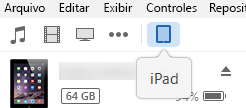
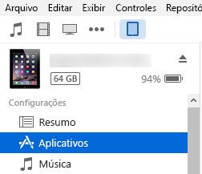

# Realizar o sideload de suplementos do Office em um iPad ou Mac para teste

Para ver como seu suplemento será executado no Office para iOS, você pode realizar o sideload do manifesto do suplemento em um iPad usando o iTunes ou diretamente no Office para Mac. Esta ação não permite definir pontos de interrupção e depurar o código do suplemento enquanto ele estiver sendo executado, mas é possível ver como ele se comporta e se a interface do usuário é utilizável e está sendo processada adequadamente. 

## Pré-requisitos do Office para iOS

- Um computador com Windows ou Mac com [iTunes](http://www.apple.com/itunes/download/) instalado.
    
- Um iPad executando o iOS 8.2 ou posterior com [Excel para iPad](https://itunes.apple.com/us/app/microsoft-excel/id586683407?mt=8) instalado e um cabo de sincronização.
    
- O arquivo de manifesto .xml do suplemento que você deseja testar.
    

## Pré-requisitos do Office para Mac

- Um Mac executando o OS X v10.10 "Yosemite" ou posterior com [Office para Mac](https://products.office.com/buy/compare-microsoft-office-products?tab=omac) instalado.
    
- Word para Mac versão 15.18 (160109).
   
- Excel para Mac versão 15.19 (160206).

- PowerPoint para Mac versão 15.24 (160614)
    
- O arquivo de manifesto .xml do suplemento que você deseja testar.
    

## Realizar o sideload de um suplemento no Excel ou no Word para iPad

1. Use um cabo de sincronização para conectar seu iPad ao computador. Se estiver conectando o iPad ao computador pela primeira vez, deverá responder **Confiar neste computador?** Escolha **Confiar** para continuar.

2. No iTunes, escolha o ícone do **iPad** abaixo da barra de menus.
    
    

3. Em **Ajustes** no lado esquerdo do iTunes, escolha **Aplicativos**.
    
    

4. No lado direito do iTunes, role para baixo até **Compartilhamento de Arquivos**, e escolha **Excel** ou **Word** na coluna **Aplicativos**.
    
    

5. Na parte inferior da coluna Documentos do **Excel** ou do **Word**, escolha **Adicionar Arquivo** e selecione o arquivo de manifesto .xml do suplemento para o qual você deseja realizar sideload. 
    
6. Abra o aplicativo Excel ou Word no seu iPad. Se o aplicativo Excel ou Word já estiver em execução, escolha o botão **Início**, feche e reinicie o aplicativo.
    
7. Abra um documento.
    
8. Escolha **Suplementos** na guia **Inserir**. O suplemento com sideload está disponível para inserção no cabeçalho **Desenvolvedor** da interface de usuário **Suplementos**.
    
    

## Realizar sideload de um suplemento no Office para Mac

> [!NOTE]
> Para realizar o sideload de um suplemento do Outlook para Mac, confira [Realizar sideload de suplementos do Outlook para teste](https://docs.microsoft.com/outlook/add-ins/sideload-outlook-add-ins-for-testing).

1. Abra o **Terminal** e navegue até uma das pastas a seguir, onde você salvará o arquivo de manifesto do suplemento. Se a pasta `wef` não existir em seu computador, crie-a.
    
    - Para o Word:  `/Users/<username>/Library/Containers/com.microsoft.Word/Data/documents/wef`    
    - Para o Excel:  `/Users/<username>/Library/Containers/com.microsoft.Excel/Data/documents/wef`
    - Para o PowerPoint: `/Users/<username>/Library/Containers/com.microsoft.Powerpoint/Data/documents/wef`
    
2. Abra a pasta no **Finder** usando o comando `open .` (incluindo o ponto final). Copie o arquivo de manifesto do suplemento nessa pasta.
    
    

3. Abra o Word e, em seguida, abra um documento. Reinicie o Word se ele já estiver em execução.
    
4. No Word, escolha **Inserir** > **Suplementos** > **Meus Suplementos** (menu suspenso) e escolha o seu suplemento.
    
    

    > [!IMPORTANT]
    > Os suplementos para os quais foi realizado o sideload não aparecerão na caixa de diálogo Meus Suplementos. Eles só ficam visíveis dentro do menu suspenso (pequena seta para baixo à direita de Meus Suplementos na guia **Inserir**). Esse suplementos são exibidos na lista sob o título **Suplementos do Desenvolvedor** nesse menu. 
    
5. Verifique se o seu suplemento é exibido no Word.
    
    
    
    > [!NOTE]
    > Por motivos de desempenho, o Office para Mac costuma armazenar os suplementos no cache. Se você precisar forçar um novo carregamento do suplemento durante o desenvolvimento, pode limpar a pasta `Users/<usr>/Library/Containers/com.Microsoft.OsfWebHost/Data/`. Se essa pasta não existir, exclua os arquivos da pasta `com.microsoft.Office365ServiceV2/Data/Caches/com.microsoft.Office365ServiceV2/`.

## Confira também

- [Depurar suplementos do Office no iPad e no Mac](debug-office-add-ins-on-ipad-and-mac.md)
    
