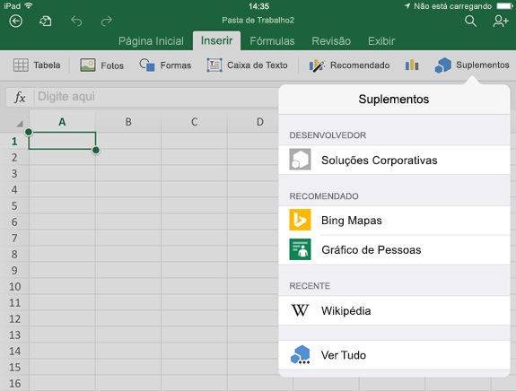
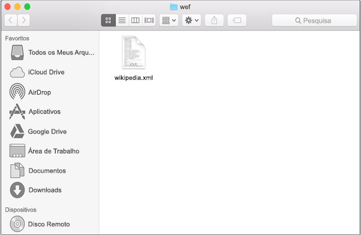
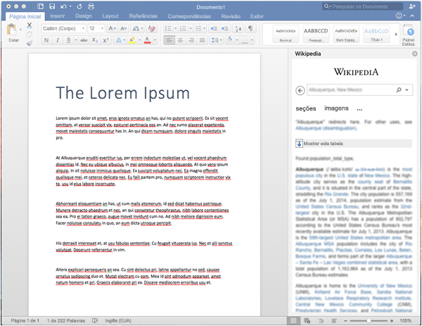

# Realizar o sideload de suplementos do Office em um iPad ou Mac para testeSideload Office Add-ins on iPad and Mac for testing

Para ver como seu suplemento será executado no Office para iOS, você pode realizar o sideload do manifesto do seu suplemento em um iPad usando o iTunes, ou realizar o sideload do manifesto do suplemento diretamente no Office para Mac. Esta ação não permite definir pontos de interrupção e depurar o código do seu suplemento enquanto ele estiver em execução, mas é possível ver como ele se comporta e verificar se a interface do usuário é utilizável e está sendo processada adequadamente.To see how your add-in will run in Office for iOS, you can sideload your add-in's manifest onto an iPad using iTunes, or sideload your add-in's manifest directly in Office for Mac. This action won't enable you to set breakpoints and debug your add-in's code while it's running, but you can see how it behaves and verify that the UI is usable and rendering appropriately. 

## Pré-requisitos do Office para iOSPrerequisites for Office for iOS

- Um computador com Windows ou Mac com [iTunes](https://www.apple.com/itunes/download/) instalado.A Windows or Mac computer with [iTunes](https://www.apple.com/itunes/download/) installed.
    
- Um iPad executando o iOS 8.2 ou posterior com [Excel para iPad](https://itunes.apple.com/us/app/microsoft-excel/id586683407?mt=8) instalado e um cabo de sincronização.An iPad running iOS 8.2 or later with [Excel for iPad](https://itunes.apple.com/us/app/microsoft-excel/id586683407?mt=8) installed, and a sync cable.
    
- O arquivo de manifesto .xml para o suplemento que você deseja testar.The manifest .xml file for the add-in you want to test.
    

## Pré-requisitos do Office para MacPrerequisites for Office for Mac

- Um Mac executando o OS X v10.10 "Yosemite" ou posterior com [Office para Mac](https://products.office.com/buy/compare-microsoft-office-products?tab=omac) instalado.A Mac running OS X v10.10 "Yosemite" or later with [Office for Mac](https://products.office.com/buy/compare-microsoft-office-products?tab=omac) installed.
    
- Word para Mac versão 15.18 (160109).Word for Mac version 15.18 (160109).
   
- Excel para Mac versão 15.19 (160206).Excel for Mac version 15.19 (160206).

- PowerPoint para Mac versão 15.24 (160614)PowerPoint for Mac version 15.24 (160614)
    
- O arquivo de manifesto .xml para o suplemento que você deseja testar.The manifest .xml file for the add-in you want to test.
    

## Realizar um sideload de um suplemento no Excel ou no Word para iPadSideload an add-in on Excel or Word for iPad

1. Use um cabo de sincronização para conectar seu iPad ao computador. Se estiver conectando o iPad ao computador pela primeira vez, será solicitado a responder **Confiar Neste Computador?** Escolha **Confiar** para continuar.Use a sync cable to connect your iPad to your computer. If you're connecting the iPad to your computer for the first time, you'll be prompted with  **Trust This Computer?**. Choose **Trust** to continue.

2. No iTunes, escolha o ícone do **iPad** abaixo da barra de menus.In iTunes, choose the  **iPad** icon below the menu bar.

3. Em **Ajustes** no lado esquerdo do iTunes, escolha **Aplicativos**.Under  **Settings** on the left side of iTunes, choose **Apps**.

4. No lado direito do iTunes, role para baixo até **Compartilhamento de Arquivos**, e escolha **Excel** ou **Word** na coluna **Aplicativos**.On the right side of iTunes, scroll down to  **File Sharing**, and then choose  **Excel** or **Word** in the **Add-ins** column.

5. Na parte inferior da coluna Documentos do **Excel** ou do **Word**, escolha **Adicionar Arquivo** e selecione o arquivo de manifesto .xml do suplemento para o qual você deseja realizar sideload.At the bottom of the  **Excel** or **Word Documents** column, choose **Add File**, and then select the manifest .xml file of the add-in you want to sideload. 
    
6. Abra o aplicativo Excel ou Word em seu iPad. Se já estiver executando o aplicativo Excel ou Word, escolha o botão **Início**, feche e reinicie o aplicativo.Open the Excel or Word app on your iPad. If the Excel or Word app is already running, choose the  **Home** button, and then close and restart the app.
    
7. Abra um documento.Open a document.
    
8. Escolha **Suplementos** na guia **Inserir**. O suplemento com sideload está disponível para inserção no cabeçalho **Desenvolvedor** na interface de usuário **Suplementos**.Choose  **Add-ins** on the **Insert** tab. Your sideloaded add-in is available to insert under the **Developer** heading in the **Add-ins** UI.
    
    

## Realizar sideload de um suplemento no Office para MacSideload an add-in on Office for Mac

> [!NOTE]
> Para realizar o sideload de um suplemento do Outlook para Mac, confira [Realizar sideload de suplementos do Outlook para teste](https://docs.microsoft.com/outlook/add-ins/sideload-outlook-add-ins-for-testing).To sideload Outlook for Mac add-in, see [Sideload Outlook add-ins for testing](https://docs.microsoft.com/outlook/add-ins/sideload-outlook-add-ins-for-testing).

1. Abra o **Terminal** e navegue até uma das pastas a seguir, onde você salvará o arquivo de manifesto do suplemento. Se a pasta `wef` não existir em seu computador, crie-a.Open  **Terminal** and go to one of the following folders where you'll save your add-in's manifest file. If the `wef` folder doesn't exist on your computer, create it.
    
    - Para o Word:  `/Users/<username>/Library/Containers/com.microsoft.Word/Data/documents/wef`For Word:  `/Users/<username>/Library/Containers/com.microsoft.Word/Data/documents/wef`    
    - Para o Excel:  `/Users/<username>/Library/Containers/com.microsoft.Excel/Data/documents/wef`For Excel:  `/Users/<username>/Library/Containers/com.microsoft.Excel/Data/documents/wef`
    - Para o PowerPoint: `/Users/<username>/Library/Containers/com.microsoft.Powerpoint/Data/documents/wef`For PowerPoint: `/Users/<username>/Library/Containers/com.microsoft.Powerpoint/Data/documents/wef`
    
2. Abra a pasta no **Finder** usando o comando `open .` (incluindo o ponto final). Copie o arquivo de manifesto do suplemento nessa pasta.Open the folder in  **Finder** using the command `open .` (including the period or dot). Copy your add-in's manifest file to this folder.
    
    

3. Abra o Word e abra um documento. Reinicie o Word se já estiver em execução.Open Word, and then open a document. Restart Word if it's already running.
    
4. No Word, escolha **Inserir** > **Suplementos** > **Meus Suplementos** (menu suspenso) e escolha seu suplemento.In Word, choose  **Insert** > **Add-ins** > **My Add-ins** (drop-down menu), and then choose your add-in.
    
    

    > [!IMPORTANT]
    > Aplicativos em que foi feito o sideload não aparecerão na caixa de diálogo Meus Suplementos. Eles só ficam visíveis dentro do menu suspenso (pequena seta para baixo à direita de Meus Suplementos na guia **Inserir**). Os suplementos em que foi feito o sideload são exibidos na lista sob o título **Suplementos do Desenvolvedor** nesse menu.Sideloaded add-ins will not show up in the My Add-ins dialog box. They are only visible within the drop-down menu (small down-arrow to the right of My Add-ins on the **Insert** tab). Sideloaded add-ins are listed under the **Developer Add-ins** heading in this menu. 
    
5. Verifique se o seu suplemento é exibido no Word.Verify that your add-in is displayed in Word.
    
    
    
    > [!NOTE]
    > Os Suplementos muitas vezes são armazenados em cache no Office para Mac por questão de desempenho.Add-ins are cached often in Office for Mac, for performance reasons. Se você precisar forçar um recarregamento do seu suplemento durante o seu desenvolvimento, limpe a pasta `Users/<usr>/Library/Containers/com.Microsoft.OsfWebHost/Data/`.If you need to force a reload of your add-in while you're developing it, you can clear the `Users/<usr>/Library/Containers/com.Microsoft.OsfWebHost/Data/` folder. Se a pasta não existir, desmarque os arquivos da pasta `com.microsoft.Office365ServiceV2/Data/Caches/com.microsoft.Office365ServiceV2/`.If that folder doesn't exist, clear the files in the `com.microsoft.Office365ServiceV2/Data/Caches/com.microsoft.Office365ServiceV2/` folder.

## Confira tambémSee also

- [Depurar suplementos do Office no iPad e no MacDebug Office Add-ins on iPad and Mac](debug-office-add-ins-on-ipad-and-mac.md)
