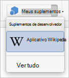

# Realizar o sideload de suplementos do Office em um iPad ou Mac para testeSideload Office Add-ins on iPad and Mac for testing

Para ver como seu suplemento será executado no Office no iOS, você pode realizar o sideload do manifesto do seu suplemento em um iPad usando o iTunes ou realizar o sideload do manifesto do suplemento diretamente no Office no Mac. Esta ação não permite definir pontos de interrupção e depurar o código do seu suplemento enquanto ele estiver em execução, mas é possível ver como ele se comporta e verificar se a interface do usuário é utilizável e está sendo processada adequadamente.To see how your add-in will run in Office on iOS, you can sideload your add-in's manifest onto an iPad using iTunes, or sideload your add-in's manifest directly in Office on Mac. This action won't enable you to set breakpoints and debug your add-in's code while it's running, but you can see how it behaves and verify that the UI is usable and rendering appropriately.

## Pré-requisitos do Office no iOSPrerequisites for Office on iOS

- Um computador com Windows ou Mac com [iTunes](https://www.apple.com/itunes/download/) instalado.A Windows or Mac computer with [iTunes](https://www.apple.com/itunes/download/) installed.
  > [!IMPORTANT]
  > Se você estiver executando o macOS Catalina, [o iTunes](https://support.apple.com/HT210200) não estará mais disponível, portanto, você deve seguir as instruções na seção Sideload de um complemento no Excel ou word no iPad usando [macOS Catalina](#sideload-an-add-in-on-excel-or-word-on-ipad-using-macos-catalina) mais adiante neste artigo.If you're running macOS Catalina, [iTunes is no longer available](https://support.apple.com/HT210200) so you should follow the instructions in the section [Sideload an add-in on Excel or Word on iPad using macOS Catalina](#sideload-an-add-in-on-excel-or-word-on-ipad-using-macos-catalina) later in this article.

- Um iPad executando o iOS 8.2 ou posterior com Excel [ou](https://apps.apple.com/app/microsoft-excel/id586683407) [Word](https://apps.apple.com/app/microsoft-word/id586447913) instalado e um cabo de sincronização.An iPad running iOS 8.2 or later with [Excel](https://apps.apple.com/app/microsoft-excel/id586683407) or [Word](https://apps.apple.com/app/microsoft-word/id586447913) installed, and a sync cable.

- O arquivo de manifesto .xml para o suplemento que você deseja testar.The manifest .xml file for the add-in you want to test.

## Pré-requisitos do Office no MacPrerequisites for Office on Mac

- Um Mac executando OS X v10.10 “Yosemite” ou posterior com [Office no Mac](https://products.office.com/buy/compare-microsoft-office-products?tab=omac) instalado.A Mac running OS X v10.10 "Yosemite" or later with [Office on Mac](https://products.office.com/buy/compare-microsoft-office-products?tab=omac) installed.

- Word no Mac versão 15.18 (160109).Word on Mac version 15.18 (160109).

- Excel no Mac versão 15.19 (160206).Excel on Mac version 15.19 (160206).

- PowerPoint no Mac versão 15.24 (160614)PowerPoint on Mac version 15.24 (160614)

- O arquivo de manifesto .xml para o suplemento que você deseja testar.The manifest .xml file for the add-in you want to test.

## Fazer sideload de um complemento no Excel ou no Word no iPad usando o iTunesSideload an add-in on Excel or Word on iPad using iTunes

1. Use um cabo de sincronização para conectar seu iPad ao computador.Use a sync cable to connect your iPad to your computer. Se você estiver conectando o iPad ao computador pela primeira vez, será solicitado a confiar **neste computador?**.If you're connecting the iPad to your computer for the first time, you'll be prompted with **Trust This Computer?**. Escolha **Confiar** para continuar.Choose **Trust** to continue.

2. No iTunes, escolha o **ícone iPad** abaixo da barra de menus.In iTunes, choose the **iPad** icon below the menu bar.

3. Em **Configurações** lado esquerdo do iTunes, escolha **Aplicativos**.Under **Settings** on the left side of iTunes, choose **Apps**.

4. No lado direito do iTunes, role para baixo  até **Compartilhamento** de Arquivos e escolha Excel ou **Word** na coluna **Complementos.**On the right side of iTunes, scroll down to **File Sharing**, and then choose **Excel** or **Word** in the **Add-ins** column.

5. Na parte inferior da coluna **Excel** ou Documentos do **Word,** escolha **Adicionar** Arquivo e selecione o arquivo .xml de manifesto do complemento que você deseja fazer sideload.At the bottom of the **Excel** or **Word Documents** column, choose **Add File**, and then select the manifest .xml file of the add-in you want to sideload.

6. Abra o aplicativo Excel ou Word em seu iPad.Open the Excel or Word app on your iPad. Se o Excel ou o aplicativo word já estiver em execução, escolha o botão **Início** e feche e reinicie o aplicativo.If the Excel or Word app is already running, choose the **Home** button, and then close and restart the app.

7. Abra um documento.Open a document.

8. Escolha **Complementos na**  guia Inserir. (Na guia Inserir, talvez seja necessário rolar horizontalmente até ver o botão **Adicionar.)**  Seu complemento sideload está disponível para ser inserido no título **Desenvolvedor** na interface do usuário **de complementos.**Choose **Add-ins** on the **Insert** tab. (On the **Insert** tab, you may need to scroll horizontally until you see the **Add-ins** button.) Your sideloaded add-in is available to insert under the **Developer** heading in the **Add-ins** UI.

    

## Fazer sideload de um complemento no Excel ou no Word no iPad usando macOS CatalinaSideload an add-in on Excel or Word on iPad using macOS Catalina

> [!IMPORTANT]
> Com a introdução do macOS Catalina, a Apple descontinuou [o iTunes](https://support.apple.com/HT210200) no Mac e a funcionalidade integrada necessária para sideload de aplicativos **no Finder**.With the introduction of macOS Catalina, [Apple discontinued iTunes on Mac](https://support.apple.com/HT210200) and integrated functionality required to sideload apps into **Finder**.

1. Use um cabo de sincronização para conectar seu iPad ao computador.Use a sync cable to connect your iPad to your computer. Se você estiver conectando o iPad ao computador pela primeira vez, será solicitado a confiar **neste computador?**.If you're connecting the iPad to your computer for the first time, you'll be prompted with **Trust This Computer?**. Escolha **Confiar** para continuar.Choose **Trust** to continue. Você também pode ser perguntado se esse é um novo iPad ou se você está restaurando um.You may also be asked if this is a new iPad or if you're restoring one.

2. No Localizador, em **Locais,** escolha **o** ícone iPad abaixo da barra de menus.In Finder, under **Locations**, choose the **iPad** icon below the menu bar.

3. Na parte superior da janela Localizador, clique em **Arquivos** e, em seguida, localize **Excel** ou **Word**.On the top of the Finder window, click on **Files**, and then locate **Excel** or **Word**.

4. Em uma janela do Finder diferente, arraste e solte o arquivo manifest.xml do complemento que você deseja carregar no arquivo **Excel** ou **Word** na primeira janela do Finder.From a different Finder window, drag and drop the manifest.xml file of the add-in you want to side load onto the **Excel** or **Word** file in the first Finder window.

5. Abra o aplicativo Excel ou Word em seu iPad.Open the Excel or Word app on your iPad. Se o Excel ou o aplicativo word já estiver em execução, escolha o botão **Início** e feche e reinicie o aplicativo.If the Excel or Word app is already running, choose the **Home** button, and then close and restart the app.

6. Abra um documento.Open a document.

7. Escolha **Complementos na**  guia Inserir. (Na guia Inserir, talvez seja necessário rolar horizontalmente até ver o botão **Adicionar.)**  Seu complemento sideload está disponível para ser inserido no título **Desenvolvedor** na interface do usuário **de complementos.**Choose **Add-ins** on the **Insert** tab. (On the **Insert** tab, you may need to scroll horizontally until you see the **Add-ins** button.) Your sideloaded add-in is available to insert under the **Developer** heading in the **Add-ins** UI.

    

## Realizar sideload de um suplemento no Office no MacSideload an add-in in Office on Mac

> [!NOTE]
> Para realizar o sideload de um suplemento do Outlook no Mac, confira [Realizar sideload de suplementos do Outlook para teste](../outlook/sideload-outlook-add-ins-for-testing.md).To sideload an Outlook add-in on Mac, see [Sideload Outlook add-ins for testing](../outlook/sideload-outlook-add-ins-for-testing.md).

1. Abra **Terminal** e vá para uma das seguintes pastas onde você salvará o arquivo de manifesto do seu complemento.Open **Terminal** and go to one of the following folders where you'll save your add-in's manifest file. Se a pasta `wef` não existir em seu computador, crie-a.If the `wef` folder doesn't exist on your computer, create it.

    - Para o Word:  `/Users/<username>/Library/Containers/com.microsoft.Word/Data/Documents/wef`For Word:  `/Users/<username>/Library/Containers/com.microsoft.Word/Data/Documents/wef`
    - Para o Excel:  `/Users/<username>/Library/Containers/com.microsoft.Excel/Data/Documents/wef`For Excel:  `/Users/<username>/Library/Containers/com.microsoft.Excel/Data/Documents/wef`
    - Para o PowerPoint: `/Users/<username>/Library/Containers/com.microsoft.Powerpoint/Data/Documents/wef`For PowerPoint: `/Users/<username>/Library/Containers/com.microsoft.Powerpoint/Data/Documents/wef`

2. Abra a pasta no **Finder** usando o comando `open .` (incluindo o ponto ou ponto).Open the folder in **Finder** using the command `open .` (including the period or dot). Copie o arquivo de manifesto do suplemento nessa pasta.Copy your add-in's manifest file to this folder.

    

3. Abra o Word e abra um documento. Reinicie o Word se já estiver em execução.Open Word, and then open a document. Restart Word if it's already running.

4. No Word, **escolha Inserir** Meus  >    >  **Complementos** (menu suspenso) e escolha o seu complemento.In Word, choose **Insert** > **Add-ins** > **My Add-ins** (drop-down menu), and then choose your add-in.

    

    > [!IMPORTANT]
    > Aplicativos em que foi feito o sideload não aparecerão na caixa de diálogo Meus Suplementos. Eles só ficam visíveis dentro do menu suspenso (pequena seta para baixo à direita de Meus Suplementos na guia **Inserir**). Os suplementos em que foi feito o sideload são exibidos na lista sob o título **Suplementos do Desenvolvedor** nesse menu.Sideloaded add-ins will not show up in the My Add-ins dialog box. They are only visible within the drop-down menu (small down-arrow to the right of My Add-ins on the **Insert** tab). Sideloaded add-ins are listed under the **Developer Add-ins** heading in this menu.

5. Verifique se o seu suplemento é exibido no Word.Verify that your add-in is displayed in Word.

    

## Remover um complemento com sideloadRemove a sideloaded add-in

Você pode remover um complemento com sideload anteriormente limpando o cache Office em seu computador.You can remove a previously sideloaded add-in by clearing the Office cache on your computer. Detalhes sobre como limpar o cache de cada plataforma e aplicativo podem ser encontrados no artigo [Limpar o Office cache](clear-cache.md).Details on how to clear the cache for each platform and application can be found in the article [Clear the Office cache](clear-cache.md).

## Confira tambémSee also

- [Depurar suplementos do Office no iPad e no MacDebug Office Add-ins on iPad and Mac](debug-office-add-ins-on-ipad-and-mac.md)
