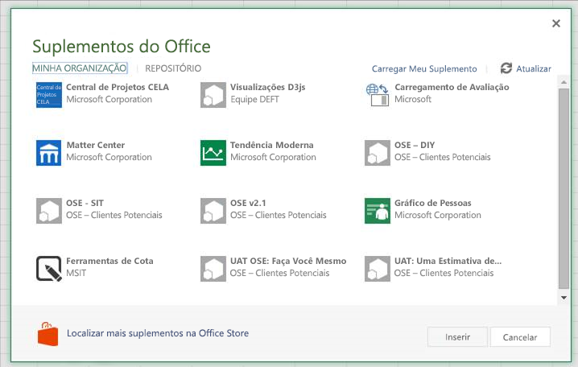
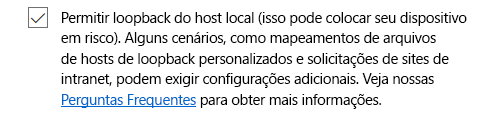

# <a name="sideload-office-add-ins-in-office-online-for-testing"></a><span data-ttu-id="a477f-102">Realizar sideload de suplementos do Office no Office Online para teste</span><span class="sxs-lookup"><span data-stu-id="a477f-102">Sideload Office Add-ins in Office Online for testing</span></span>

<span data-ttu-id="a477f-p101">Você pode instalar um suplemento do Office para teste usando sideload, sem precisar primeiro colocá-lo em um catálogo de suplementos. O sideload pode ser feito no Office 365 ou no Office Online. O procedimento é ligeiramente diferente nas duas plataformas.</span><span class="sxs-lookup"><span data-stu-id="a477f-p101">You can install an Office Add-in for testing without having to first put it in an add-in catalog by using sideloading. Sideloading can be done on either Office 365 or Office Online. The procedure is slightly different for the two platforms.</span></span> 

<span data-ttu-id="a477f-106">Quando você realiza o sideload de um suplemento, o manifesto do suplemento é armazenado localmente do navegador e, portanto, se você limpar o cache do navegador ou alternar para um navegador diferente, precisará realizar o sideload do suplemento novamente.</span><span class="sxs-lookup"><span data-stu-id="a477f-106">When you sideload an add-in, the add-in manifest is stored in the browser's local storage, so if you clear the browser's cache, or switch to a different browser, you have to sideload the add-in again.</span></span>


> [!NOTE]
> <span data-ttu-id="a477f-p102">A realização do sideload como descrito neste artigo tem suporte no Word, no Excel e no PowerPoint. Para realizar o sideload de um suplemento do Outlook, confira [Realizar sideload de suplementos do Outlook para teste](https://docs.microsoft.com/outlook/add-ins/sideload-outlook-add-ins-for-testing).</span><span class="sxs-lookup"><span data-stu-id="a477f-p102">Sideloading as described in this article is supported on Word, Excel, and PowerPoint. To sideload an Outlook add-in, see [Sideload Outlook add-ins for testing](https://docs.microsoft.com/outlook/add-ins/sideload-outlook-add-ins-for-testing).</span></span>

<span data-ttu-id="a477f-109">O vídeo a seguir oferece orientações para o processo de sideload do seu suplemento no Office para área de trabalho ou no Office Online.</span><span class="sxs-lookup"><span data-stu-id="a477f-109">The following video walks you through the process of sideloading your add-in on Office desktop or Office Online.</span></span>  


> [!VIDEO https://www.youtube.com/embed/XXsAw2UUiQo]

## <a name="sideload-an-office-add-in-on-office-365"></a><span data-ttu-id="a477f-110">Realizar sideload de um suplemento do Office no Office 365</span><span class="sxs-lookup"><span data-stu-id="a477f-110">Sideload an Office Add-in on Office 365</span></span>


1. <span data-ttu-id="a477f-111">Entre em sua conta do Office 365.</span><span class="sxs-lookup"><span data-stu-id="a477f-111">Sign in to your Office 365 account.</span></span>
    
2. <span data-ttu-id="a477f-112">Abra o inicializador de aplicativos à esquerda da barra de ferramentas, selecione  **Excel**, **Word** ou **PowerPoint** e crie um novo documento.</span><span class="sxs-lookup"><span data-stu-id="a477f-112">Open the App Launcher on the left end of the toolbar and select  **Excel**,  **Word**, or  **PowerPoint**, and then create a new document.</span></span>
    
3. <span data-ttu-id="a477f-113">Abra a guia **Inserir** na faixa de opções e, na seção **Suplementos**, escolha **Suplementos do Office**.</span><span class="sxs-lookup"><span data-stu-id="a477f-113">Open the  **Insert** tab on the ribbon and, in the **Add-ins** section, choose **Office Add-ins**.</span></span>
    
4. <span data-ttu-id="a477f-114">Na caixa de diálogo **Suplementos do Office**, selecione a guia **MINHA ORGANIZAÇÃO** e **Carregar Meu Suplemento**.</span><span class="sxs-lookup"><span data-stu-id="a477f-114">On the  **Office Add-ins** dialog, select the **MY ORGANIZATION** tab, and then **Upload My Add-in**.</span></span>
    
    

5.  <span data-ttu-id="a477f-116">**Navegue** até o arquivo de manifesto do suplemento e selecione **Carregar**.</span><span class="sxs-lookup"><span data-stu-id="a477f-116">**Browse** to the add-in manifest file, and then select **Upload**.</span></span>
    
    

6. <span data-ttu-id="a477f-p103">Verifique se o suplemento está instalado. Por exemplo, se for um comando do suplemento, ele deve aparecer na faixa de opções ou no menu de contexto. Se for um suplemento de painel de tarefas, o painel deve ser exibido.</span><span class="sxs-lookup"><span data-stu-id="a477f-p103">Verify that your add-in is installed. For example, if it is an add-in command, it should appear on either the ribbon or the context menu. If it is a task pane add-in the pane should appear.</span></span>
    

## <a name="sideload-an-office-add-in-on-office-online"></a><span data-ttu-id="a477f-121">Realizar sideload de um suplemento do Office no Office Online</span><span class="sxs-lookup"><span data-stu-id="a477f-121">Sideload an Office Add-in on Office Online</span></span>


1. <span data-ttu-id="a477f-122">Abra o [Microsoft Office Online](https://office.live.com/).</span><span class="sxs-lookup"><span data-stu-id="a477f-122">Open [Microsoft Office Online](https://office.live.com/).</span></span>
    
2. <span data-ttu-id="a477f-123">Em **Comece a usar os aplicativos online agora**, escolha **Excel**, **Word** ou **PowerPoint** e abra um novo documento.</span><span class="sxs-lookup"><span data-stu-id="a477f-123">In  **Get started with the online apps now**, choose  **Excel**,  **Word**, or  **PowerPoint**; and then open a new document.</span></span>
    
3. <span data-ttu-id="a477f-124">Abra a guia **Inserir** na faixa de opções e, na seção **Suplementos**, escolha **Suplementos do Office**.</span><span class="sxs-lookup"><span data-stu-id="a477f-124">Open the  **Insert** tab on the ribbon and, in the **Add-ins** section, choose **Office Add-ins**.</span></span>
    
4. <span data-ttu-id="a477f-125">Na caixa de diálogo **Suplementos do Office**, selecione a guia **MEUS SUPLEMENTOS**, escolha **Gerenciar Meus Suplementos** e **Carregar Meu Suplemento**.</span><span class="sxs-lookup"><span data-stu-id="a477f-125">On the  **Office Add-ins** dialog, select the **MY ADD-INS** tab, choose **Manage My Add-ins**, and then  **Upload My Add-in**.</span></span>
    
    

5.  <span data-ttu-id="a477f-127">**Navegue** até o arquivo de manifesto do suplemento e selecione **Carregar**.</span><span class="sxs-lookup"><span data-stu-id="a477f-127">**Browse** to the add-in manifest file, and then select **Upload**.</span></span>
    
    

6. <span data-ttu-id="a477f-p104">Verifique se o suplemento está instalado. Por exemplo, se for um comando do suplemento, ele deve aparecer na faixa de opções ou no menu de contexto. Se for um suplemento de painel de tarefas, o painel deve ser exibido.</span><span class="sxs-lookup"><span data-stu-id="a477f-p104">Verify that your add-in is installed. For example, if it is an add-in command, it should appear on either the ribbon or the context menu. If it is a task pane add-in, the pane should appear.</span></span>

> [!NOTE]
><span data-ttu-id="a477f-132">Para testar o seu suplemento do Office com o Edge, digite “**about: flags**na barra de pesquisa do Edge para exibir as opções de Configurações do Desenvolvedor.</span><span class="sxs-lookup"><span data-stu-id="a477f-132">To test your Office Add-in with Edge, enter “**about:flags**” in the Edge search bar to bring up the Developer Settings options.</span></span>  <span data-ttu-id="a477f-133">Marque a opção “**Permitir loopback do host local**” e reinicie o Edge.</span><span class="sxs-lookup"><span data-stu-id="a477f-133">Check the “**Allow localhost loopback**” option and restart Edge.</span></span>

>    

## <a name="sideload-an-add-in-when-using-visual-studio"></a><span data-ttu-id="a477f-135">Fazer sideload de um suplemento usando o Visual Studio</span><span class="sxs-lookup"><span data-stu-id="a477f-135">Sideload an add-in when using Visual Studio</span></span>

<span data-ttu-id="a477f-p106">Se estiver usando o Visual Studio para desenvolver o suplemento, o processo de sideload é semelhante. A única diferença é que você deve atualizar o valor do elemento **SourceURL** no manifesto para incluir a URL completa em que o suplemento for implantado.</span><span class="sxs-lookup"><span data-stu-id="a477f-p106">If you're using Visual Studio to develop your add-in, the process to sideload is similar. The only difference is that you will have to update the value of the **SourceURL** element in your manifest to include the full URL where the add-in is deployed.</span></span> 

<span data-ttu-id="a477f-p107">Se estiver desenvolvendo o suplemento, localize o respectivo arquivo manifest.xml e atualize o valor do elemento **SourceLocation** para incluir um URI absoluto. O Visual Studio vai adicionar um token à implantação do localhost.</span><span class="sxs-lookup"><span data-stu-id="a477f-p107">If you're currently developing your add-in, locate your add-in manifest.xml file, and update the **SourceLocation** element value to include an absolute URI. Visual Studio will put in a token for your localhost deployment.</span></span>

<span data-ttu-id="a477f-140">Por exemplo:</span><span class="sxs-lookup"><span data-stu-id="a477f-140">For example:</span></span> 

```xml
<SourceLocation DefaultValue="https://localhost:44300/App/Home/Home.html" />
```
