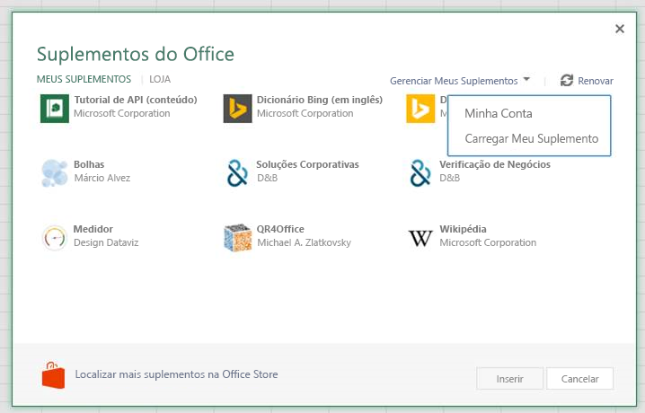
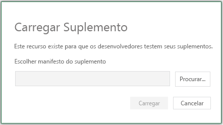

# <a name="sideload-office-add-ins-in-office-on-the-web-for-testing"></a>Realizar sideload de suplementos do Office no Office na Web para teste

Quando você faz sideload de um suplemento, é possível instalar o suplemento sem primeiro colocá-lo no catálogo de suplementos. Isso é útil ao testar e desenvolver seu suplemento porque você pode ver como o suplemento será exibido e funcionará.

Quando você faz sideload de um suplemento, o manifesto do suplemento é armazenado no armazenamento local do navegador, portanto, se você limpar o cache do navegador ou alternar para um navegador diferente, precisará realizar o sideload do suplemento novamente.

O sideload varia entre aplicativos host (por exemplo, Excel).

> [!NOTE]
> O sideload, conforme descrito neste artigo, tem suporte no Excel, no OneNote, no PowerPoint e no Word. Para realizar o sideload de um suplemento do Outlook, confira [Realizar sideload de suplementos do Outlook para teste](../outlook/sideload-outlook-add-ins-for-testing.md).

## <a name="sideload-an-office-add-in-in-office-on-the-web"></a>Realizar sideload de um suplemento do Office no Office na Web

Esse processo tem suporte apenas para **Excel**, **OneNote**, **PowerPoint** e **Word** . Para outros aplicativos host, consulte as instruções de sideload manual na seção a seguir. Este projeto de exemplo pressupõe que você esteja usando um projeto criado com o [gerador Yeoman para suplementos do Office](../develop/yeoman-generator-overview.md).

1. Abra [Office na Web](https://office.live.com/). Usando a **opção** Criar, crie um documento no **Excel**, **OneNote**, **PowerPoint** ou **Word**. Neste novo documento, selecione **Compartilhar na** faixa de opções, selecione Copiar **Link** e copie a URL.

1. No diretório raiz de seus arquivos de projeto do yo office, abra o **arquivo package.json** . Na seção **de configuração** deste arquivo, crie uma `"document"` propriedade. Cole a URL copiada como o valor da `"document"` propriedade. Por exemplo, o seu será semelhante a este:

    ```json
      "config": {
        "document": "<YOUR URL>",
        ...
      }
    ```

    > [!TIP]
    > Se você estiver criando um suplemento que não usa nosso gerador Yeoman, poderá adicionar parâmetros de consulta à URL do documento, acrescentando o seguinte à URL existente.
    >
    > - A porta do servidor de desenvolvimento, como `&wdaddindevserverport=3000`.
    > - O nome do arquivo de manifesto, como `&wdaddinmanifestfile=manifest1.xml`.
    > - O GUID do manifesto, como `&wdaddinmanifestguid=05c2e1c9-3e1d-406e-9a91-e9ac64854143`.
    >
    > Se você estiver usando o gerador Yeoman, não será necessário adicionar essas informações, pois as ferramentas yeoman acrescentarão essas informações automaticamente.
    > Observe que, em ambos os casos, no entanto, você só pode carregar manifestos do localhost.

1. Na linha de comando que começa no diretório raiz do projeto, execute o comando a seguir. Substitua "{url}" pela URL de um documento do Office em seu OneDrive ou uma biblioteca do SharePoint para a qual você tem permissões.

    [!INCLUDE [npm start:web command syntax](../includes/start-web-sideload-instructions.md)]

1. Na primeira vez que usar esse método para realizar o sideload de um suplemento na Web, você verá uma caixa de diálogo solicitando que você habilite o modo de desenvolvedor. Marque a caixa de seleção **Habilitar Modo de Desenvolvedor agora e** selecione **OK**.

1. Você verá uma segunda caixa de diálogo perguntando se deseja registrar um manifesto do Suplemento do Office do seu computador. Você deve selecionar **Sim**.

1. Seu suplemento está instalado. Se for um comando de suplemento, ele deverá aparecer na faixa de opções ou no menu de contexto. Se for um suplemento do painel de tarefas, o painel de tarefas deverá aparecer.

## <a name="sideload-an-office-add-in-in-office-on-the-web-manually"></a>Fazer sideload de um Suplemento do Office Office na Web manualmente

Esse método não usa a linha de comando e pode ser feito usando comandos somente dentro do aplicativo host (como o Excel).

1. Abra [Office na Web](https://office.com/). Abra um documento no **Excel**, **OneNote**, **PowerPoint** ou  **Word**. Na guia **Inserir** na faixa de opções da seção **Suplementos** , escolha **Suplementos do Office**.

1. Na caixa **de diálogo Suplementos do Office** , selecione a guia **MEUS SUPLEMENTOS** , escolha Gerenciar Meus **Suplementos** e Carregue **Meu Suplemento**.

    

1. **Navegue** até o arquivo de manifesto do suplemento e selecione **Carregar**.

    

1. Verifique se o suplemento está instalado. Por exemplo, se for um comando do suplemento, ele deve aparecer na faixa de opções ou no menu de contexto. Se for um suplemento de painel de tarefas, o painel deve ser exibido.

> [!NOTE]
> Para testar seu Suplemento do Office com o Microsoft Edge com o WebView original (EdgeHTML), é necessária uma etapa de configuração adicional. Em um Prompt de Comando do Windows, execute a seguinte linha: `npx office-addin-dev-settings appcontainer EdgeWebView --loopback --yes`. Isso não é necessário quando o Office está usando o Edge WebView2 Chromium baseado em Chromium. Para obter mais informações, confira [Navegadores usados pelos Suplementos do Office](../concepts/browsers-used-by-office-web-add-ins.md).

[!INCLUDE[Office settings tool not supported on Mac](../includes/tool-nonsupport-mac-note.md)]

## <a name="sideload-an-office-add-in"></a>Realizar sideload de um suplemento do Office

1. Entre em sua conta do Microsoft 365.

1. Abra o Inicializador de Aplicativos no lado esquerdo da barra de ferramentas, selecione **Excel**, **PowerPoint** ou **Word** e, em seguida, crie um novo documento.

1. As etapas 3 a 6 são as mesmas da seção anterior **Realize sideload para um suplemento do Office no Office na Web**. 

## <a name="sideload-an-add-in-when-using-visual-studio"></a>Sideload de um suplemento usando o Visual Studio

Se você estiver usando o Visual Studio para desenvolver seu suplemento, o processo de sideload será semelhante ao sideload manual para a Web. A única diferença é que você deve atualizar o valor do elemento **SourceURL** no manifesto para incluir a URL completa em que o suplemento for implantado.

> [!NOTE]
> Embora você possa realizar o sideload de suplementos do Visual Studio para o Office na Web, não é possível depurá-los no Visual Studio. Para depurar você precisará usar as ferramentas de depuração do navegador. Para saber mais, confira [Depurar suplementos no Office na Web](debug-add-ins-in-office-online.md).

1. No Visual Studio, abra a janela **Propriedades** escolhendo **Modo de exibição** > **Janela de propriedades**.
1. No **Gerenciador de Soluções**, selecione o projeto Web. Isso exibirá as propriedades para o projeto na janela **Propriedades**.
1. Na janela Propriedades, copie a **URL de SSL**.
1. No projeto de suplemento, abra o arquivo XML do manifesto. Certifique-se de que você está editando o XML do código-fonte. Para alguns tipos de projeto o Visual Studio abrirá o modo de exibição de visualização do XML que não funcionará para a próxima etapa.
1. Pesquisar e substituir todas as instâncias de **~remoteAppUrl/** pela URL de SSL que você copiou. Você verá várias substituições dependendo do tipo de projeto e as novas URLs serão muito similares a `https://localhost:44300/Home.html`.
1. Salve o arquivo XML.
1. Clique com botão direito do mouse no projeto Web e escolha **Depurar** > **Iniciar nova instância**. Isso executará o projeto Web sem iniciar o Office.
1. No Office na Web, realize o sideload do suplemento usando as etapas descritas anteriormente em [Sideload de um suplemento do Office no Office na Web](#sideload-an-office-add-in-in-office-on-the-web).

## <a name="remove-a-sideloaded-add-in"></a>Remover um suplemento de sideload

Você pode remover um suplemento com sideload anteriormente limpando o cache do navegador. Se você fizer alterações no manifesto do suplemento (por exemplo, atualizar nomes de arquivo de ícones ou texto de comandos de suplemento), talvez seja necessário limpar o cache do navegador e, em seguida, recarregue o suplemento usando o manifesto atualizado. Isso permitirá Office na Web renderizar o suplemento conforme descrito pelo manifesto atualizado.

## <a name="see-also"></a>Confira também

- [Realizar sideload de Suplementos do Office no Mac](sideload-an-office-add-in-on-mac.md)
- [Realizar sideload de Suplementos do Office no iPad](sideload-an-office-add-in-on-ipad.md)
- [Realizar sideload de suplementos do Outlook para teste](../outlook/sideload-outlook-add-ins-for-testing.md)
- [Limpar o cache do Office](clear-cache.md)
