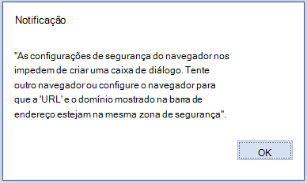

# <a name="troubleshoot-user-errors-with-office-add-ins"></a>Solucionar erros de usuários com suplementos do Office

Às vezes, seus usuários podem encontrar problemas com suplementos do Office desenvolvidos por você. Por exemplo, um suplemento falha ao carregar ou está inacessível. Use as informações neste artigo para ajudar a resolver problemas comuns que os usuários têm com o seu suplemento do Office.

Também é possível usar o [Fiddler](https://www.telerik.com/fiddler) para identificar e depurar problemas com os suplementos.

## <a name="common-errors-and-troubleshooting-steps"></a>Erros comuns e etapas de solução de problemas

A tabela a seguir lista as mensagens de erro comuns que os usuários podem receber e as etapas que os usuários podem seguir para resolver os erros.

|**Mensagem de erro**|**Resolução**|
|:-----|:-----|
|Erro do aplicativo: catálogo não pôde ser alcançado|Verifique as configurações do firewall. "Catálogo" refere-se ao AppSource. Essa mensagem indica que o usuário não consegue acessar o AppSource.|
|ERRO DO APLICATIVO: este aplicativo não pôde ser iniciado. Feche essa caixa de diálogo para ignorar o problema ou clique em "Reiniciar"para tentar novamente.|Verifique se as atualizações mais recentes do Office foram instaladas ou baixe a [atualização do Office 2013](https://support.microsoft.com/kb/2986156/).|
|Erro: objeto não dá suporte à propriedade ou ao método 'defineProperty'|Confirme se o Internet Explorer não está sendo executado no modo de compatibilidade. Vá para Ferramentas > **Modo de Exibição** de Compatibilidade Configurações .|
|Não foi possível carregar o aplicativo porque não há suporte para sua versão do navegador. Clique aqui para obter uma lista de versões do navegador compatíveis.|Verifique se o navegador dá suporte a armazenamento local HTML5 ou redefina as configurações do Internet Explorer. Para saber mais sobre os navegadores compatíveis, confira [Requisitos para a execução de Suplementos do Office](../concepts/requirements-for-running-office-add-ins.md).|

## <a name="when-installing-an-add-in-you-see-error-loading-add-in-in-the-status-bar"></a>Ao instalar um suplemento, você verá “erro ao carregar suplemento” na barra de status

1. Feche o Office.
1. Verifique se o manifesto é valido
1. Reinicie o suplemento
1. Instale o suplemento novamente.

Você também pode enviar comentários: se estiver usando o Excel no Windows ou Mac, envie comentários à equipe de extensibilidade do Office diretamente do Excel. Para fazer isso, selecione **Arquivo** | **Comentário** | **Enviar um Rosto Triste**. Enviando um rosto triste, você fornece os logs necessários para entendermos o problema.

## <a name="outlook-add-in-doesnt-work-correctly"></a>O suplemento do Outlook não funciona corretamente

Se um suplemento do Outlook executado no Windows e [usando o Internet Explorer](../concepts/browsers-used-by-office-web-add-ins.md) não está funcionando corretamente, tente ativar a depuração de scripts no Internet Explorer.

- Vá para Ferramentas > **Opções da Internet**  >  **Avançadas**.
- Em **Navegação, desmarque** **Desabilitar a depuração de script (Internet Explorer)** e **Desabilitar a depuração de script (Outros)**.

Recomendamos que você desmarque essas configurações somente para solucionar o problema. Se você deixar desmarcado, receberá prompts durante a navegação. Depois que o problema for resolvido, verifique **Desabilitar a depuração de script (Internet Explorer)** e **Desabilitar a depuração de script (Outros)** novamente.

## <a name="add-in-doesnt-activate-in-office-2013"></a>O suplemento não é ativado no Office 2013

Se o complemento não for ativado quando o usuário executar as etapas a seguir.

1. Entrar com a conta da Microsoft no Office 2013.

1. Habilitar a verificação de duas etapas para a conta da Microsoft.

1. Verificar a identidade ao ser solicitado quando tentar inserir um suplemento.

Verifique se as atualizações mais recentes do Office foram instaladas ou baixe a [atualização do Office 2013](https://support.microsoft.com/kb/2986156/).

## <a name="add-in-dialog-box-cannot-be-displayed"></a>Não é possível exibir a caixa de diálogo do suplemento

Quando o usuário usa um suplemento do Office, ele é solicitado a permitir a exibição de uma caixa de diálogo. O usuário escolhe **Permitir** e ocorre a seguinte mensagem de erro.

"As configurações de segurança do navegador nos impedem de criar uma caixa de diálogo. Tente outro navegador ou configure o navegador para que a 'URL' e o domínio mostrado na barra de endereço estejam na mesma zona de segurança".



|**Navegadores afetados**|**Plataformas afetadas**|
|:--------------------|:---------------------|
|Internet Explorer, Microsoft Edge|Office na Web|

Para resolver o problema, os administradores ou usuários finais podem adicionar o domínio do suplemento à lista de sites confiáveis no Internet Explorer. Use o mesmo procedimento se estiver trabalhando com o navegador Internet Explorer ou Microsoft Edge.

> [!IMPORTANT]
> Caso não confie no suplemento, não adicione a respectiva URL à lista de sites confiáveis.

Para adicionar uma URL à lista de sites confiáveis:

1. No **Painel de Controle**, abra **Opções da Internet** > **Security**.
1. Escolha a zona de **Sites confiáveis** e escolha **Sites**.
1. Insira a URL exibida na mensagem de erro e escolha **Adicionar**.
1. Tente usar o suplemento novamente. Se o problema persistir, verifique as configurações de outras zonas de segurança e confira se o domínio do suplemento está na mesma zona que a URL exibida na barra de endereços do aplicativo do Office.

Esse problema ocorre quando a API da caixa de diálogo é usada no modo pop-up. Para evitar esse problema, use o sinalizador [displayInFrame](/javascript/api/office/office.ui). Isso requer que a página tenha suporte para exibição dentro de um iframe. O exemplo a seguir mostra como usar o sinalizador.

```js
Office.context.ui.displayDialogAsync(startAddress, {displayInIFrame:true}, callback);
```

## <a name="see-also"></a>Veja também

- [Solucionar erros de desenvolvimento com Suplementos do Office](troubleshoot-development-errors.md)
