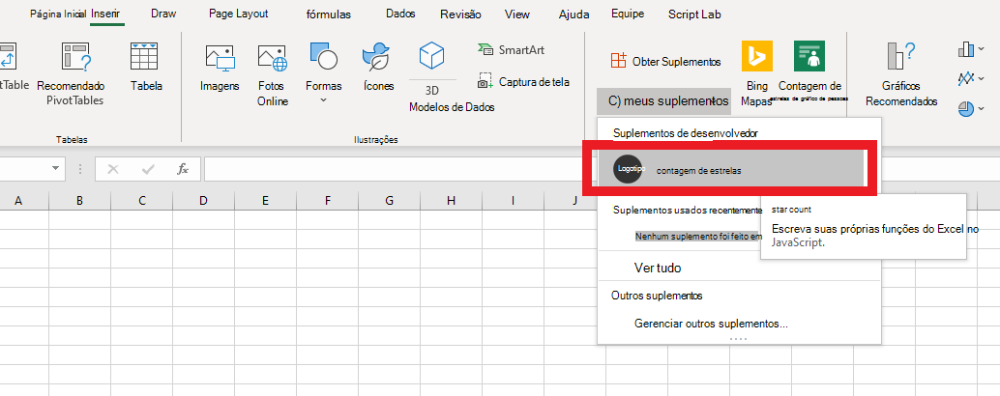

# <a name="tutorial-create-custom-functions-in-excel"></a><span data-ttu-id="e6df4-103">Tutorial: Criar funções personalizadas no Excel</span><span class="sxs-lookup"><span data-stu-id="e6df4-103">Tutorial: Create custom functions in Excel</span></span>

<span data-ttu-id="e6df4-104">Funções personalizadas permitem que você adicione novas funções do Excel definindo essas funções em JavaScript como parte de um suplemento.</span><span class="sxs-lookup"><span data-stu-id="e6df4-104">Custom functions enable you to add new functions to Excel by defining those functions in JavaScript as part of an add-in.</span></span> <span data-ttu-id="e6df4-105">Os usuários do Excel podem acessar funções personalizadas como fariam com qualquer função nativa no Excel, como `SUM()`.</span><span class="sxs-lookup"><span data-stu-id="e6df4-105">Users within Excel can access custom functions as they would any native function in Excel, such as `SUM()`.</span></span> <span data-ttu-id="e6df4-106">Você pode criar funções personalizadas que realizam tarefas simples como cálculos ou tarefas mais complexas, como streaming de dados da web em tempo real em uma planilha.</span><span class="sxs-lookup"><span data-stu-id="e6df4-106">You can create custom functions that perform simple tasks like calculations or more complex tasks such as streaming real-time data from the web into a worksheet.</span></span>

<span data-ttu-id="e6df4-107">Neste tutorial, você vai:</span><span class="sxs-lookup"><span data-stu-id="e6df4-107">In this tutorial, you will:</span></span>
> [!div class="checklist"]
> * <span data-ttu-id="e6df4-108">Crie um suplemento de função personalizada usando o [gerador Yeoman de suplementos do Office](https://www.npmjs.com/package/generator-office).</span><span class="sxs-lookup"><span data-stu-id="e6df4-108">Create a custom function add-in using the [Yeoman generator for Office Add-ins](https://www.npmjs.com/package/generator-office).</span></span> 
> * <span data-ttu-id="e6df4-109">Usar uma função personalizada predefinida para realizar um cálculo simples.</span><span class="sxs-lookup"><span data-stu-id="e6df4-109">Use a prebuilt custom function to perform a simple calculation.</span></span>
> * <span data-ttu-id="e6df4-110">Criar uma função personalizada que solicita dados da web.</span><span class="sxs-lookup"><span data-stu-id="e6df4-110">Create a custom function that gets data from the web.</span></span>
> * <span data-ttu-id="e6df4-111">Criar uma função personalizada que transmite os dados da web em tempo real.</span><span class="sxs-lookup"><span data-stu-id="e6df4-111">Create a custom function that streams real-time data from the web.</span></span>

## <a name="prerequisites"></a><span data-ttu-id="e6df4-112">Pré-requisitos</span><span class="sxs-lookup"><span data-stu-id="e6df4-112">Prerequisites</span></span>

[!include[Yeoman generator prerequisites](../includes/quickstart-yo-prerequisites.md)]

* <span data-ttu-id="e6df4-113">Excel no Windows (versão 1904 ou posterior, conectado a uma assinatura do Microsoft 365) ou na web</span><span class="sxs-lookup"><span data-stu-id="e6df4-113">Excel on Windows (version 1904 or later, connected to a Microsoft 365 subscription) or on the web</span></span>

## <a name="create-a-custom-functions-project"></a><span data-ttu-id="e6df4-114">Criar um projeto com funções personalizadas</span><span class="sxs-lookup"><span data-stu-id="e6df4-114">Create a custom functions project</span></span>

 <span data-ttu-id="e6df4-115">Para começar, você criará o projeto de código para criar o suplemento função personalizada.</span><span class="sxs-lookup"><span data-stu-id="e6df4-115">To start, you'll create the code project to build your custom function add-in.</span></span> <span data-ttu-id="e6df4-116">O [gerador Yeoman para suplementos do Office](https://www.npmjs.com/package/generator-office) configura seu projeto com algumas funções personalizadas predefinidas que você pode experimentar. Se você executou a inicialização rápida de funções personalizadas e gerou um projeto, continue usando o projeto e pule para [esta etapa](#create-a-custom-function-that-requests-data-from-the-web).</span><span class="sxs-lookup"><span data-stu-id="e6df4-116">The [Yeoman generator for Office Add-ins](https://www.npmjs.com/package/generator-office) will set up your project with some prebuilt custom functions that you can try out. If you have already run the custom functions quick start and generated a project, continue to use that project and skip to [this step](#create-a-custom-function-that-requests-data-from-the-web) instead.</span></span>

1. [!include[Yeoman generator create project guidance](../includes/yo-office-command-guidance.md)]
    
    * <span data-ttu-id="e6df4-117">**Escolha o tipo de projeto:** `Excel Custom Functions Add-in project`</span><span class="sxs-lookup"><span data-stu-id="e6df4-117">**Choose a project type:** `Excel Custom Functions Add-in project`</span></span>
    * <span data-ttu-id="e6df4-118">**Escolha o tipo de script:** `JavaScript`</span><span class="sxs-lookup"><span data-stu-id="e6df4-118">**Choose a script type:** `JavaScript`</span></span>
    * <span data-ttu-id="e6df4-119">**Qual será o nome do suplemento?**</span><span class="sxs-lookup"><span data-stu-id="e6df4-119">**What do you want to name your add-in?**</span></span> `starcount`

    
    
    <span data-ttu-id="e6df4-121">O gerador Yeoman criará os arquivos do projeto e instalará os componentes Node de suporte.</span><span class="sxs-lookup"><span data-stu-id="e6df4-121">The Yeoman generator will create the project files and install supporting Node components.</span></span>

    [!include[Yeoman generator next steps](../includes/yo-office-next-steps.md)]

2. <span data-ttu-id="e6df4-122">Navegue até a pasta raiz do projeto.</span><span class="sxs-lookup"><span data-stu-id="e6df4-122">Navigate to the root folder of the project.</span></span>
    
    ```command&nbsp;line
    cd starcount
    ```

3. <span data-ttu-id="e6df4-123">Compile o projeto.</span><span class="sxs-lookup"><span data-stu-id="e6df4-123">Build the project.</span></span>
    
    ```command&nbsp;line
    npm run build
    ```

    > [!NOTE]
    > <span data-ttu-id="e6df4-124">Os Suplementos do Office devem usar HTTPS, e não HTTP, mesmo durante o desenvolvimento.</span><span class="sxs-lookup"><span data-stu-id="e6df4-124">Office Add-ins should use HTTPS, not HTTP, even when you are developing.</span></span> <span data-ttu-id="e6df4-125">Se você for solicitado a instalar um certificado após executar `npm run build`, aceite a solicitação para instalar o certificado que o gerador do Yeoman fornecer.</span><span class="sxs-lookup"><span data-stu-id="e6df4-125">If you are prompted to install a certificate after you run `npm run build`, accept the prompt to install the certificate that the Yeoman generator provides.</span></span>

4. <span data-ttu-id="e6df4-126">Inicie o servidor local da web, que é executado no Node.js.</span><span class="sxs-lookup"><span data-stu-id="e6df4-126">Start the local web server, which runs in Node.js.</span></span> <span data-ttu-id="e6df4-127">Você pode experimentar o suplemento função personalizada no Excel na Web ou no Windows.</span><span class="sxs-lookup"><span data-stu-id="e6df4-127">You can try out the custom function add-in in Excel on the web or Windows.</span></span>

# <a name="excel-on-windows-or-mac"></a>[<span data-ttu-id="e6df4-128">Excel para Windows ou Mac</span><span class="sxs-lookup"><span data-stu-id="e6df4-128">Excel on Windows or Mac</span></span>](#tab/excel-windows)

<span data-ttu-id="e6df4-129">Para testar o seu suplemento no Excel para Windows ou Mac, execute o seguinte comando.</span><span class="sxs-lookup"><span data-stu-id="e6df4-129">To test your add-in in Excel on Windows or Mac, run the following command.</span></span> <span data-ttu-id="e6df4-130">Quando você executa este comando, o servidor Web local iniciará e o Excel abrirá com o seu suplemento carregado.</span><span class="sxs-lookup"><span data-stu-id="e6df4-130">When you run this command, the local web server will start and Excel will open with your add-in loaded.</span></span>

```command&nbsp;line
npm run start:desktop
```

# <a name="excel-on-the-web"></a>[<span data-ttu-id="e6df4-131">Excel na Web</span><span class="sxs-lookup"><span data-stu-id="e6df4-131">Excel on the web</span></span>](#tab/excel-online)

<span data-ttu-id="e6df4-132">Para testar o seu suplemento no Excel em um navegador, execute o seguinte comando.</span><span class="sxs-lookup"><span data-stu-id="e6df4-132">To test your add-in in Excel on a browser, run the following command.</span></span> <span data-ttu-id="e6df4-133">O servidor Web local é iniciado quando este comando é executado.</span><span class="sxs-lookup"><span data-stu-id="e6df4-133">When you run this command, the local web server will start.</span></span>

```command&nbsp;line
npm run start:web
```

<span data-ttu-id="e6df4-134">Para usar o suplemento de funções personalizadas, abra uma nova pasta de trabalho no Excel na Web.</span><span class="sxs-lookup"><span data-stu-id="e6df4-134">To use your custom functions add-in, open a new workbook in Excel on the web.</span></span> <span data-ttu-id="e6df4-135">Nesta pasta de trabalho, conclua as seguintes etapas para realizar o sideload do suplemento.</span><span class="sxs-lookup"><span data-stu-id="e6df4-135">In this workbook, complete the following steps to sideload your add-in.</span></span>

1. <span data-ttu-id="e6df4-136">No Excel, escolha a guia **Inserir** e, em seguida, escolha **Suplementos**.</span><span class="sxs-lookup"><span data-stu-id="e6df4-136">In Excel, choose the **Insert** tab and then choose **Add-ins**.</span></span>

   
   
2. <span data-ttu-id="e6df4-138">Escolha **Gerenciar Meus suplementos** e selecione **Carregar o Suplemento**.</span><span class="sxs-lookup"><span data-stu-id="e6df4-138">Choose **Manage My Add-ins** and select **Upload My Add-in**.</span></span>

3. <span data-ttu-id="e6df4-139">Escolha **Procurar...** e navegue até o diretório raiz do projeto criado pelo gerador Yeoman.</span><span class="sxs-lookup"><span data-stu-id="e6df4-139">Choose **Browse...** and navigate to the root directory of the project that the Yeoman generator created.</span></span>

4. <span data-ttu-id="e6df4-140">Selecione o arquivo **manifest. XML** e escolha **abrir**, escolha **Carregar**.</span><span class="sxs-lookup"><span data-stu-id="e6df4-140">Select the file **manifest.xml** and choose **Open**, then choose **Upload**.</span></span>

--- 
    
## <a name="try-out-a-prebuilt-custom-function"></a><span data-ttu-id="e6df4-141">Experimente uma função personalizada predefinida</span><span class="sxs-lookup"><span data-stu-id="e6df4-141">Try out a prebuilt custom function</span></span>

<span data-ttu-id="e6df4-142">O projeto de funções personalizadas criado contém algumas funções personalizadas predefinidas configuradas no arquivo **src/functions/functions.js**.</span><span class="sxs-lookup"><span data-stu-id="e6df4-142">The custom functions project that you created contains some prebuilt custom functions, defined within the **./src/functions/functions.js** file.</span></span> <span data-ttu-id="e6df4-143">O arquivo **./manifest.xml** especifica que todas as funções personalizadas pertencem a `CONTOSO` namespace.</span><span class="sxs-lookup"><span data-stu-id="e6df4-143">The **./manifest.xml** file specifies that all custom functions belong to the `CONTOSO` namespace.</span></span> <span data-ttu-id="e6df4-144">Você usará o namespace CONTOSO para acessar as funções personalizadas no Excel.</span><span class="sxs-lookup"><span data-stu-id="e6df4-144">You'll use the CONTOSO namespace to access the custom functions in Excel.</span></span>

<span data-ttu-id="e6df4-145">Em seguida você vai experimentar a função personalizada `ADD` preenchendo as seguintes etapas:</span><span class="sxs-lookup"><span data-stu-id="e6df4-145">Next you'll try out the `ADD` custom function by completing the following steps:</span></span>

1. <span data-ttu-id="e6df4-146">No Excel, vá para qualquer célula e digite `=CONTOSO`.</span><span class="sxs-lookup"><span data-stu-id="e6df4-146">In Excel, go to any cell and enter `=CONTOSO`.</span></span> <span data-ttu-id="e6df4-147">Observe que o menu de preenchimento automático mostra a lista de todas as funções na `CONTOSO` namespace.</span><span class="sxs-lookup"><span data-stu-id="e6df4-147">Notice that the autocomplete menu shows the list of all functions in the `CONTOSO` namespace.</span></span>

2. <span data-ttu-id="e6df4-148">Executar a `CONTOSO.ADD` função, com números `10` e `200` como parâmetros de entrada, especificando o valor `=CONTOSO.ADD(10,200)` na célula e pressionando enter.</span><span class="sxs-lookup"><span data-stu-id="e6df4-148">Run the `CONTOSO.ADD` function, with numbers `10` and `200` as input parameters, by typing the value `=CONTOSO.ADD(10,200)` in the cell and pressing enter.</span></span>

<span data-ttu-id="e6df4-149">As `ADD` função personalizada calcula a soma dos dois números que você forneceu e retorna o resultado da **210**.</span><span class="sxs-lookup"><span data-stu-id="e6df4-149">The `ADD` custom function computes the sum of the two numbers that you provided and returns the result of **210**.</span></span>

## <a name="create-a-custom-function-that-requests-data-from-the-web"></a><span data-ttu-id="e6df4-150">Criar uma função personalizada que solicita dados da web</span><span class="sxs-lookup"><span data-stu-id="e6df4-150">Create a custom function that requests data from the web</span></span>

<span data-ttu-id="e6df4-151">Integração de dados da Web é uma ótima maneira de ampliar o Excel por meio de funções personalizadas.</span><span class="sxs-lookup"><span data-stu-id="e6df4-151">Integrating data from the Web is a great way to extend Excel through custom functions.</span></span> <span data-ttu-id="e6df4-152">Em seguida, você criará uma função personalizada chamada `getStarCount` que mostra quantas estrelas um determinado repositório do GitHub tem.</span><span class="sxs-lookup"><span data-stu-id="e6df4-152">Next you'll create a custom function named `getStarCount` that shows how many stars a given Github repository possesses.</span></span>

1. <span data-ttu-id="e6df4-153">No projeto **Contagem de estrelas** localize o arquivo **./src/functions/functions.js** e abra-o no seu editor de código.</span><span class="sxs-lookup"><span data-stu-id="e6df4-153">In the **starcount** project, find the file **./src/functions/functions.js** and open it in your code editor.</span></span> 

2. <span data-ttu-id="e6df4-154">Em **function.js**, adicione o código a seguir:</span><span class="sxs-lookup"><span data-stu-id="e6df4-154">In **function.js**, add the following code:</span></span> 

```JS
/**
  * Gets the star count for a given Github repository.
  * @customfunction 
  * @param {string} userName string name of Github user or organization.
  * @param {string} repoName string name of the Github repository.
  * @return {number} number of stars given to a Github repository.
  */
  async function getStarCount(userName, repoName) {
    try {
      //You can change this URL to any web request you want to work with.
      const url = "https://api.github.com/repos/" + userName + "/" + repoName;
      const response = await fetch(url);
      //Expect that status code is in 200-299 range
      if (!response.ok) {
        throw new Error(response.statusText)
      }
        const jsonResponse = await response.json();
        return jsonResponse.watchers_count;
    }
    catch (error) {
      return error;
    }
  }
```

3. <span data-ttu-id="e6df4-155">Execute o seguinte comando para recriar o projeto.</span><span class="sxs-lookup"><span data-stu-id="e6df4-155">Run the following command to rebuild the project.</span></span>

    ```command&nbsp;line
    npm run build
    ```

4. <span data-ttu-id="e6df4-156">Execute as etapas a seguir (para o Excel na Web, Windows ou Mac) para registrá-lo novamente no Excel.</span><span class="sxs-lookup"><span data-stu-id="e6df4-156">Complete the following steps (for Excel on the web, Windows, or Mac) to re-register the add-in in Excel.</span></span> <span data-ttu-id="e6df4-157">Você deve concluir essas etapas antes que a nova função esteja disponível.</span><span class="sxs-lookup"><span data-stu-id="e6df4-157">You must complete these steps before the new function will be available.</span></span>

### <a name="excel-on-windows-or-mac"></a>[<span data-ttu-id="e6df4-158">Excel para Windows ou Mac</span><span class="sxs-lookup"><span data-stu-id="e6df4-158">Excel on Windows or Mac</span></span>](#tab/excel-windows)

1. <span data-ttu-id="e6df4-159">Feche o Excel e abra-o novamente.</span><span class="sxs-lookup"><span data-stu-id="e6df4-159">Close Excel and then reopen Excel.</span></span>

2. <span data-ttu-id="e6df4-160">No Excel, escolha a guia **Inserir** e, em seguida, escolha a seta para baixo localizada à direita de **Meus Suplementos**.  </span><span class="sxs-lookup"><span data-stu-id="e6df4-160">In Excel, choose the **Insert** tab and then choose the down-arrow located to the right of **My Add-ins**.  </span></span>

3. <span data-ttu-id="e6df4-161">Na lista de suplementos disponíveis, localize a seção **Suplementos do desenvolvedor** e selecione o seu suplemento **contagem de estrelas** para registrá-lo.</span><span class="sxs-lookup"><span data-stu-id="e6df4-161">In the list of available add-ins, find the **Developer Add-ins** section and select the **starcount** add-in to register it.</span></span>
    <span data-ttu-id="e6df4-162"></span><span class="sxs-lookup"><span data-stu-id="e6df4-162"></span></span>


# <a name="excel-on-the-web"></a>[<span data-ttu-id="e6df4-163">Excel na Web</span><span class="sxs-lookup"><span data-stu-id="e6df4-163">Excel on the web</span></span>](#tab/excel-online)

1. <span data-ttu-id="e6df4-164">No Excel, escolha a guia **Inserir** e, em seguida, escolha **Suplementos**.  </span><span class="sxs-lookup"><span data-stu-id="e6df4-164">In Excel, choose the **Insert** tab and then choose **Add-ins**.  </span></span>

2. <span data-ttu-id="e6df4-165">Escolha **Gerenciar Meus suplementos** e selecione **Carregar o Suplemento**.</span><span class="sxs-lookup"><span data-stu-id="e6df4-165">Choose **Manage My Add-ins** and select **Upload My Add-in**.</span></span>

3. <span data-ttu-id="e6df4-166">Escolha **Procurar...** e navegue até o diretório raiz do projeto criado pelo gerador Yeoman.</span><span class="sxs-lookup"><span data-stu-id="e6df4-166">Choose **Browse...** and navigate to the root directory of the project that the Yeoman generator created.</span></span>

4. <span data-ttu-id="e6df4-167">Selecione o arquivo **manifest. XML** e escolha **abrir**, escolha **Carregar**.</span><span class="sxs-lookup"><span data-stu-id="e6df4-167">Select the file **manifest.xml** and choose **Open**, then choose **Upload**.</span></span>

---

<ol start="5">
<li> <span data-ttu-id="e6df4-168">Agora, vamos experimentar a nova função.</span><span class="sxs-lookup"><span data-stu-id="e6df4-168">Try out the new function.</span></span> <span data-ttu-id="e6df4-169">Na célula <strong>B1</strong>, digite o texto <strong>=CONTOSO.GETSTARCOUNT("OfficeDev", "Funções personalizadas do Excel")</strong> e pressione Enter.</span><span class="sxs-lookup"><span data-stu-id="e6df4-169">In cell <strong>B1</strong>, type the text <strong>=CONTOSO.GETSTARCOUNT("OfficeDev", "Excel-Custom-Functions")</strong> and press enter.</span></span> <span data-ttu-id="e6df4-170">Você deve ver que o resultado na célula <strong>B1</strong> é o número atual de estrelas fornecido para o [repositório do GitHub de funções personalizadas do Excel](https://github.com/OfficeDev/Excel-Custom-Functions).</span><span class="sxs-lookup"><span data-stu-id="e6df4-170">You should see that the result in cell <strong>B1</strong> is the current number of stars given to the [Excel-Custom-Functions Github repository](https://github.com/OfficeDev/Excel-Custom-Functions).</span></span></li>
</ol>

## <a name="create-a-streaming-asynchronous-custom-function"></a><span data-ttu-id="e6df4-171">Criar uma função personalizada assíncrona de streaming</span><span class="sxs-lookup"><span data-stu-id="e6df4-171">Create a streaming asynchronous custom function</span></span>

<span data-ttu-id="e6df4-172">A função `getStarCount` retorna o número de estrelas que um repositório tem em um determinado momento.</span><span class="sxs-lookup"><span data-stu-id="e6df4-172">The `getStarCount` function returns the number of stars a repository has at a specific moment in time.</span></span> <span data-ttu-id="e6df4-173">As funções personalizadas também podem retornar dados que estão mudando continuamente.</span><span class="sxs-lookup"><span data-stu-id="e6df4-173">Custom functions can also return data that is continuously changing.</span></span> <span data-ttu-id="e6df4-174">Essas funções são chamadas de funções de streaming.</span><span class="sxs-lookup"><span data-stu-id="e6df4-174">These functions are called streaming functions.</span></span> <span data-ttu-id="e6df4-175">Elas devem incluir um parâmetro `invocation` que se refere à célula na qual a função foi chamada.</span><span class="sxs-lookup"><span data-stu-id="e6df4-175">They must include an `invocation` parameter which refers to the cell where the function was called from.</span></span> <span data-ttu-id="e6df4-176">O parâmetro `invocation` é usado para atualizar o conteúdo da célula a qualquer momento.</span><span class="sxs-lookup"><span data-stu-id="e6df4-176">The `invocation` parameter is used to update the contents of the cell at any time.</span></span>  

<span data-ttu-id="e6df4-177">No exemplo de código a seguir, você perceberá que há duas funções, `currentTime` e `clock`.</span><span class="sxs-lookup"><span data-stu-id="e6df4-177">In the following code sample, you'll notice that there are two functions, `currentTime` and `clock`.</span></span> <span data-ttu-id="e6df4-178">A função `currentTime` é uma função estática que não usa streaming.</span><span class="sxs-lookup"><span data-stu-id="e6df4-178">The `currentTime` function is a static function that does not use streaming.</span></span> <span data-ttu-id="e6df4-179">Ele retorna a data como uma cadeia de caracteres.</span><span class="sxs-lookup"><span data-stu-id="e6df4-179">It returns the date as a string.</span></span> <span data-ttu-id="e6df4-180">A função `clock` usa a função `currentTime` para fornecer o novo horário a cada segundo a uma célula no Excel.</span><span class="sxs-lookup"><span data-stu-id="e6df4-180">The `clock` function uses the `currentTime` function to provide the new time every second to a cell in Excel.</span></span> <span data-ttu-id="e6df4-181">Ele usa o `invocation.setResult` para fornecer o horário para a célula do Excel e `invocation.onCanceled` para controlar o que acontece quando a função é cancelada.</span><span class="sxs-lookup"><span data-stu-id="e6df4-181">It uses `invocation.setResult` to deliver the time to the Excel cell and `invocation.onCanceled` to handle what occurs when the function is canceled.</span></span>

1. <span data-ttu-id="e6df4-182">No projeto **contagem de estrelas**, adicione o código a seguir **./src/functions/functions.js** e salve o arquivo.</span><span class="sxs-lookup"><span data-stu-id="e6df4-182">In the **starcount** project, add the following code to **./src/functions/functions.js** and save the file.</span></span>

```JS
/**
 * Returns the current time
 * @returns {string} String with the current time formatted for the current locale.
 */
function currentTime() {
  return new Date().toLocaleTimeString();
}

 /**
 * Displays the current time once a second
 * @customfunction
 * @param {CustomFunctions.StreamingInvocation<string>} invocation Custom function invocation
 */
function clock(invocation) {
  const timer = setInterval(() => {
    const time = currentTime();
    invocation.setResult(time);
  }, 1000);

  invocation.onCanceled = () => {
    clearInterval(timer);
  };
}
```

2. <span data-ttu-id="e6df4-183">Execute o seguinte comando para recriar o projeto.</span><span class="sxs-lookup"><span data-stu-id="e6df4-183">Run the following command to rebuild the project.</span></span>

    ```command&nbsp;line
    npm run build
    ```

3. <span data-ttu-id="e6df4-184">Execute as etapas a seguir (para o Excel na Web, Windows ou Mac) para registrá-lo novamente no Excel.</span><span class="sxs-lookup"><span data-stu-id="e6df4-184">Complete the following steps (for Excel on the web, Windows, or Mac) to re-register the add-in in Excel.</span></span> <span data-ttu-id="e6df4-185">Você deve concluir essas etapas antes que a nova função esteja disponível.</span><span class="sxs-lookup"><span data-stu-id="e6df4-185">You must complete these steps before the new function will be available.</span></span> 

# <a name="excel-on-windows-or-mac"></a>[<span data-ttu-id="e6df4-186">Excel para Windows ou Mac</span><span class="sxs-lookup"><span data-stu-id="e6df4-186">Excel on Windows or Mac</span></span>](#tab/excel-windows)

1. <span data-ttu-id="e6df4-187">Feche o Excel e abra-o novamente.</span><span class="sxs-lookup"><span data-stu-id="e6df4-187">Close Excel and then reopen Excel.</span></span>

2. <span data-ttu-id="e6df4-188">No Excel, escolha a guia **Inserir** e, em seguida, escolha a seta para baixo localizada à direita de **Meus Suplementos**.  </span><span class="sxs-lookup"><span data-stu-id="e6df4-188">In Excel, choose the **Insert** tab and then choose the down-arrow located to the right of **My Add-ins**.  </span></span>

3. <span data-ttu-id="e6df4-189">Na lista de suplementos disponíveis, localize a seção **Suplementos do desenvolvedor** e selecione o seu suplemento **contagem de estrelas** para registrá-lo.</span><span class="sxs-lookup"><span data-stu-id="e6df4-189">In the list of available add-ins, find the **Developer Add-ins** section and select the **starcount** add-in to register it.</span></span>
    <span data-ttu-id="e6df4-190"></span><span class="sxs-lookup"><span data-stu-id="e6df4-190"></span></span>

# <a name="excel-on-the-web"></a>[<span data-ttu-id="e6df4-191">Excel na Web</span><span class="sxs-lookup"><span data-stu-id="e6df4-191">Excel on the web</span></span>](#tab/excel-online)

1. <span data-ttu-id="e6df4-192">No Excel, escolha a guia **Inserir** e, em seguida, escolha **Suplementos**.  </span><span class="sxs-lookup"><span data-stu-id="e6df4-192">In Excel, choose the **Insert** tab and then choose **Add-ins**.  </span></span>

2. <span data-ttu-id="e6df4-193">Escolha **Gerenciar Meus suplementos** e selecione **Carregar o Suplemento**.</span><span class="sxs-lookup"><span data-stu-id="e6df4-193">Choose **Manage My Add-ins** and select **Upload My Add-in**.</span></span>

3. <span data-ttu-id="e6df4-194">Escolha **Procurar...** e navegue até o diretório raiz do projeto criado pelo gerador Yeoman.</span><span class="sxs-lookup"><span data-stu-id="e6df4-194">Choose **Browse...** and navigate to the root directory of the project that the Yeoman generator created.</span></span>

4. <span data-ttu-id="e6df4-195">Selecione o arquivo **manifest. XML** e escolha **abrir**, escolha **Carregar**.</span><span class="sxs-lookup"><span data-stu-id="e6df4-195">Select the file **manifest.xml** and choose **Open**, then choose **Upload**.</span></span>

--- 

<ol start="4">
<li><span data-ttu-id="e6df4-196">Agora, vamos experimentar a nova função.</span><span class="sxs-lookup"><span data-stu-id="e6df4-196">Try out the new function.</span></span> <span data-ttu-id="e6df4-197">Na célula <strong>C1</strong>, digite o texto <strong>=CONTOSO.CLOCK()</strong> e pressione enter.</span><span class="sxs-lookup"><span data-stu-id="e6df4-197">In cell <strong>C1</strong>, type the text <strong>=CONTOSO.CLOCK()</strong> and press enter.</span></span> <span data-ttu-id="e6df4-198">Você deverá ver a data atual, que transmite uma atualização a cada segundo.</span><span class="sxs-lookup"><span data-stu-id="e6df4-198">You should see the current date, which streams an update every second.</span></span> <span data-ttu-id="e6df4-199">Embora esse relógio seja um cronômetro em um loop, você pode usar a mesma ideia para definir um cronômetro em funções mais complexas que fazem solicitações da Web para dados em tempo real.</span><span class="sxs-lookup"><span data-stu-id="e6df4-199">While this clock is just a timer on a loop, you can use the same idea of setting a timer on more complex functions that make web requests for real-time data.</span></span></li>
</ol>

## <a name="next-steps"></a><span data-ttu-id="e6df4-200">Próximas etapas</span><span class="sxs-lookup"><span data-stu-id="e6df4-200">Next steps</span></span>

<span data-ttu-id="e6df4-201">Parabéns!</span><span class="sxs-lookup"><span data-stu-id="e6df4-201">Congratulations!</span></span> <span data-ttu-id="e6df4-202">Neste tutorial, você criou um novo projeto de funções personalizadas, experimentou uma função predefinida, criou uma função personalizada que solicita dados da Web e criou uma função personalizada que transmite dados.</span><span class="sxs-lookup"><span data-stu-id="e6df4-202">You've created a new custom functions project, tried out a prebuilt function, created a custom function that requests data from the web, and created a custom function that streams data.</span></span> <span data-ttu-id="e6df4-203">Em seguida, você pode modificar seu projeto para usar um tempo de execução compartilhado, facilitando a interação com o painel de tarefas.</span><span class="sxs-lookup"><span data-stu-id="e6df4-203">Next, you can modify your project to use a shared runtime, making it easier for your function to interact with the task pane.</span></span> <span data-ttu-id="e6df4-204">Siga as etapas no seguinte artigo:</span><span class="sxs-lookup"><span data-stu-id="e6df4-204">Follow the steps in the following article:</span></span>

> [!div class="nextstepaction"]
> [<span data-ttu-id="e6df4-205">Configure seu suplemento para usar um tempo de execução compartilhado</span><span class="sxs-lookup"><span data-stu-id="e6df4-205">Configure your add-in to use a shared runtime</span></span>](../excel/configure-your-add-in-to-use-a-shared-runtime.md)
