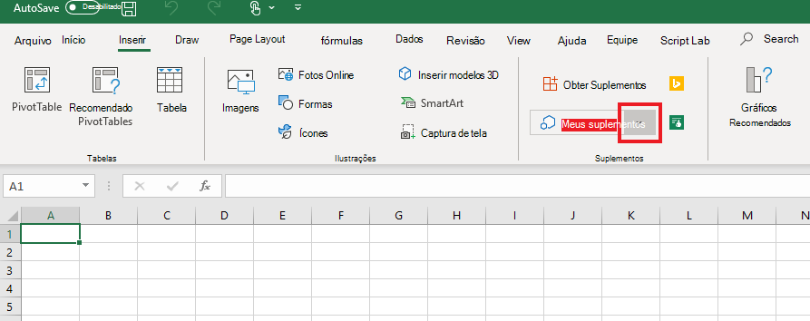
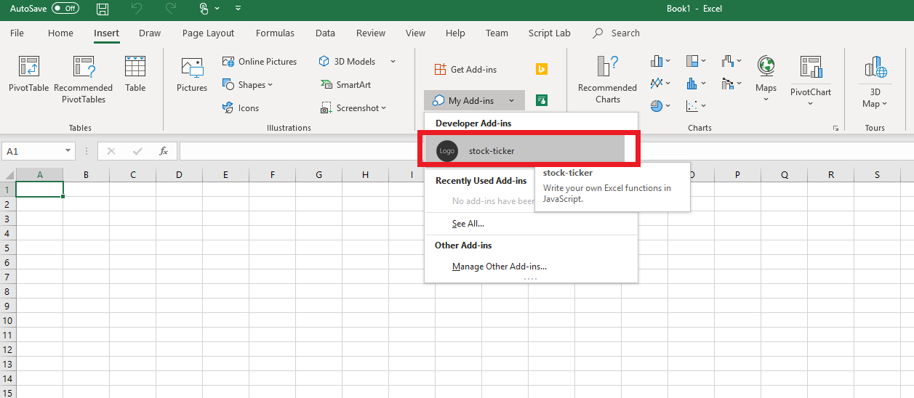

# <a name="tutorial-create-custom-functions-in-excel"></a><span data-ttu-id="71c3c-103">Tutorial: Criar funções personalizadas no Excel</span><span class="sxs-lookup"><span data-stu-id="71c3c-103">Tutorial: Create custom functions in Excel</span></span>

<span data-ttu-id="71c3c-104">Funções personalizadas permitem que você adicione novas funções do Excel definindo essas funções em JavaScript como parte de um suplemento.</span><span class="sxs-lookup"><span data-stu-id="71c3c-104">Custom functions enable you to add new functions to Excel by defining those functions in JavaScript as part of an add-in.</span></span> <span data-ttu-id="71c3c-105">Os usuários do Excel podem acessar funções personalizadas como fariam com qualquer função nativa no Excel, como `SUM()`.</span><span class="sxs-lookup"><span data-stu-id="71c3c-105">Users within Excel can access custom functions as they would any native function in Excel, such as `SUM()`.</span></span> <span data-ttu-id="71c3c-106">Você pode criar funções personalizadas que realizam tarefas simples como cálculos ou tarefas mais complexas, como streaming de dados da web em tempo real em uma planilha.</span><span class="sxs-lookup"><span data-stu-id="71c3c-106">You can create custom functions that perform simple tasks like calculations or more complex tasks such as streaming real-time data from the web into a worksheet.</span></span>

<span data-ttu-id="71c3c-107">Neste tutorial, você vai:</span><span class="sxs-lookup"><span data-stu-id="71c3c-107">In this tutorial, you will:</span></span>
> [!div class="checklist"]
> * <span data-ttu-id="71c3c-108">Crie um suplemento de função personalizada usando o [gerador Yeoman de suplementos do Office](https://www.npmjs.com/package/generator-office).</span><span class="sxs-lookup"><span data-stu-id="71c3c-108">Create a custom function add-in using the [Yeoman generator for Office Add-ins](https://www.npmjs.com/package/generator-office).</span></span> 
> * <span data-ttu-id="71c3c-109">Usar uma função personalizada predefinida para realizar um cálculo simples.</span><span class="sxs-lookup"><span data-stu-id="71c3c-109">Use a prebuilt custom function to perform a simple calculation.</span></span>
> * <span data-ttu-id="71c3c-110">Criar uma função personalizada que solicita dados da web.</span><span class="sxs-lookup"><span data-stu-id="71c3c-110">Create a custom function that gets data from the web.</span></span>
> * <span data-ttu-id="71c3c-111">Criar uma função personalizada que transmite os dados da web em tempo real.</span><span class="sxs-lookup"><span data-stu-id="71c3c-111">Create a custom function that streams real-time data from the web.</span></span>

## <a name="prerequisites"></a><span data-ttu-id="71c3c-112">Pré-requisitos</span><span class="sxs-lookup"><span data-stu-id="71c3c-112">Prerequisites</span></span>

[!include[Yeoman generator prerequisites](../includes/quickstart-yo-prerequisites.md)]

* <span data-ttu-id="71c3c-113">Excel no Windows (versão de 64 bits 1810 ou posterior) ou Excel online</span><span class="sxs-lookup"><span data-stu-id="71c3c-113">Excel on Windows (64-bit version 1810 or later) or Excel Online</span></span>

## <a name="create-a-custom-functions-project"></a><span data-ttu-id="71c3c-114">Criar um projeto com funções personalizadas</span><span class="sxs-lookup"><span data-stu-id="71c3c-114">Create a custom functions project</span></span>

 <span data-ttu-id="71c3c-115">Para começar, você criará o projeto de código para criar o suplemento função personalizada.</span><span class="sxs-lookup"><span data-stu-id="71c3c-115">To start, you'll create the code project to build your custom function add-in.</span></span> <span data-ttu-id="71c3c-116">O [gerador Yeoman para suplementos do Office](https://www.npmjs.com/package/generator-office) configurará seu projeto com algumas funções personalizadas predefinidas que você pode experimentar. Se você já tiver executado o início rápido de funções personalizadas e gerado um projeto, continue a usar esse projeto e pule para [esta etapa](#create-a-custom-function-that-requests-data-from-the-web) .</span><span class="sxs-lookup"><span data-stu-id="71c3c-116">The [Yeoman generator for Office Add-ins](https://www.npmjs.com/package/generator-office) will set up your project with some prebuilt custom functions that you can try out. If you have already run the custom functions quick start and generated a project, continue to use that project and skip to [this step](#create-a-custom-function-that-requests-data-from-the-web) instead.</span></span>

1. <span data-ttu-id="71c3c-117">Execute o comando a seguir e responda aos prompts da seguinte forma.</span><span class="sxs-lookup"><span data-stu-id="71c3c-117">Run the following command and then answer the prompts as follows.</span></span>
    
    ```command&nbsp;line
    yo office
    ```
    
    * <span data-ttu-id="71c3c-118">**Escolha o tipo de projeto:** `Excel Custom Functions Add-in project`</span><span class="sxs-lookup"><span data-stu-id="71c3c-118">**Choose a project type:** `Excel Custom Functions Add-in project`</span></span>
    * <span data-ttu-id="71c3c-119">**Escolha o tipo de script:** `JavaScript`</span><span class="sxs-lookup"><span data-stu-id="71c3c-119">**Choose a script type:** `JavaScript`</span></span>
    * <span data-ttu-id="71c3c-120">**Qual será o nome do suplemento?**</span><span class="sxs-lookup"><span data-stu-id="71c3c-120">**What do you want to name your add-in?**</span></span> `stock-ticker`

    
    
    <span data-ttu-id="71c3c-122">O gerador Yeoman criará os arquivos do projeto e instalará os componentes Node de suporte.</span><span class="sxs-lookup"><span data-stu-id="71c3c-122">The Yeoman generator will create the project files and install supporting Node components.</span></span>

2. <span data-ttu-id="71c3c-123">Navegue até a pasta raiz do projeto.</span><span class="sxs-lookup"><span data-stu-id="71c3c-123">Navigate to the root folder of the project.</span></span>
    
    ```command&nbsp;line
    cd stock-ticker
    ```

3. <span data-ttu-id="71c3c-124">Crie um projeto.</span><span class="sxs-lookup"><span data-stu-id="71c3c-124">Build the project.</span></span>
    
    ```command&nbsp;line
    npm run build
    ```

4. <span data-ttu-id="71c3c-125">Inicie o servidor local da web, que é executado no Node.</span><span class="sxs-lookup"><span data-stu-id="71c3c-125">Start the local web server, which runs in Node.js.</span></span> <span data-ttu-id="71c3c-126">Você pode experimentar o suplemento função personalizada no Excel no Windows ou no Excel online.</span><span class="sxs-lookup"><span data-stu-id="71c3c-126">You can try out the custom function add-in in Excel on Windows or Excel Online.</span></span>

# <a name="excel-on-windowstabexcel-windows"></a>[<span data-ttu-id="71c3c-127">Excel no Windows</span><span class="sxs-lookup"><span data-stu-id="71c3c-127">Excel on Windows</span></span>](#tab/excel-windows)

<span data-ttu-id="71c3c-128">Para testar seu suplemento no Excel no Windows, execute o seguinte comando.</span><span class="sxs-lookup"><span data-stu-id="71c3c-128">To test your add-in in Excel on Windows, run the following command.</span></span> <span data-ttu-id="71c3c-129">Quando você executar este comando, o servidor Web local será iniciado e o Excel no Windows será aberto com seu suplemento carregado.</span><span class="sxs-lookup"><span data-stu-id="71c3c-129">When you run this command, the local web server will start and Excel on Windows will open with your add-in loaded.</span></span>

```command&nbsp;line
npm run start:desktop
```

> [!NOTE]
> <span data-ttu-id="71c3c-130">Os Suplementos do Office devem usar HTTPS, e não HTTP, mesmo durante o desenvolvimento.</span><span class="sxs-lookup"><span data-stu-id="71c3c-130">Office Add-ins should use HTTPS, not HTTP, even when you are developing.</span></span> <span data-ttu-id="71c3c-131">Se você for solicitado a instalar um certificado após executar `npm run start:desktop`, aceite a solicitação para instalar o certificado que o gerador do Yeoman fornecer.</span><span class="sxs-lookup"><span data-stu-id="71c3c-131">If you are prompted to install a certificate after you run `npm run start:desktop`, accept the prompt to install the certificate that the Yeoman generator provides.</span></span>

# <a name="excel-onlinetabexcel-online"></a>[<span data-ttu-id="71c3c-132">Excel Online</span><span class="sxs-lookup"><span data-stu-id="71c3c-132">Excel Online</span></span>](#tab/excel-online)

<span data-ttu-id="71c3c-133">Para testar seu suplemento no Excel online, execute o seguinte comando.</span><span class="sxs-lookup"><span data-stu-id="71c3c-133">To test your add-in in Excel Online, run the following command.</span></span> <span data-ttu-id="71c3c-134">Quando você executa este comando, o servidor Web local iniciará.</span><span class="sxs-lookup"><span data-stu-id="71c3c-134">When you run this command, the local web server will start.</span></span>

```command&nbsp;line
npm run start:web
```

> [!NOTE]
> <span data-ttu-id="71c3c-135">Os Suplementos do Office devem usar HTTPS, e não HTTP, mesmo durante o desenvolvimento.</span><span class="sxs-lookup"><span data-stu-id="71c3c-135">Office Add-ins should use HTTPS, not HTTP, even when you are developing.</span></span> <span data-ttu-id="71c3c-136">Se você for solicitado a instalar um certificado após executar `npm run start:web`, aceite a solicitação para instalar o certificado que o gerador do Yeoman fornecer.</span><span class="sxs-lookup"><span data-stu-id="71c3c-136">If you are prompted to install a certificate after you run `npm run start:web`, accept the prompt to install the certificate that the Yeoman generator provides.</span></span>

<span data-ttu-id="71c3c-137">Para usar seu suplemento de funções personalizadas, abra uma nova pasta de trabalho no Excel online.</span><span class="sxs-lookup"><span data-stu-id="71c3c-137">To use your custom functions add-in, open a new workbook in Excel Online.</span></span> <span data-ttu-id="71c3c-138">Nesta pasta de trabalho, conclua as seguintes etapas para Sideload seu suplemento.</span><span class="sxs-lookup"><span data-stu-id="71c3c-138">In this workbook, complete the following steps to sideload your add-in.</span></span>

1. <span data-ttu-id="71c3c-139">No Excel Online, escolha a guia **inserir** pressione e, em seguida, escolha **suplementos**.</span><span class="sxs-lookup"><span data-stu-id="71c3c-139">In Excel Online, choose the **Insert** tab and then choose **Add-ins**.</span></span>

   
   
2. <span data-ttu-id="71c3c-141">Escolha **Gerenciar Meus suplementos** e selecione **Carregar o Suplemento**.</span><span class="sxs-lookup"><span data-stu-id="71c3c-141">Choose **Manage My Add-ins** and select **Upload My Add-in**.</span></span>

3. <span data-ttu-id="71c3c-142">Escolha \*\*Procurar... \*\* e navegue até o diretório raiz do projeto criado pelo gerador Yeoman.</span><span class="sxs-lookup"><span data-stu-id="71c3c-142">Choose **Browse...** and navigate to the root directory of the project that the Yeoman generator created.</span></span>

4. <span data-ttu-id="71c3c-143">Selecione o arquivo **manifest. XML** e escolha **aberto**, escolha **Carregar**.</span><span class="sxs-lookup"><span data-stu-id="71c3c-143">Select the file **manifest.xml** and choose **Open**, then choose **Upload**.</span></span>

--- 
    
## <a name="try-out-a-prebuilt-custom-function"></a><span data-ttu-id="71c3c-144">Experimente uma função personalizada predefinida</span><span class="sxs-lookup"><span data-stu-id="71c3c-144">Try out a prebuilt custom function</span></span>

<span data-ttu-id="71c3c-145">O projeto de funções personalizadas que você criou contém algumas funções personalizadas predefinidas, definidas no arquivo **./src/Functions/functions.js** .</span><span class="sxs-lookup"><span data-stu-id="71c3c-145">The custom functions project that you created contains some prebuilt custom functions, defined within the **./src/functions/functions.js** file.</span></span> <span data-ttu-id="71c3c-146">O arquivo **./manifest.xml** especifica que todas as funções personalizadas pertencem a `CONTOSO` namespace.</span><span class="sxs-lookup"><span data-stu-id="71c3c-146">The **./manifest.xml** file specifies that all custom functions belong to the `CONTOSO` namespace.</span></span> <span data-ttu-id="71c3c-147">Você usará o namespace CONTOSO para acessar as funções personalizadas no Excel.</span><span class="sxs-lookup"><span data-stu-id="71c3c-147">You'll use the CONTOSO namespace to access the custom functions in Excel.</span></span>

<span data-ttu-id="71c3c-148">Em seguida você vai experimentar a função personalizada `ADD` preenchendo as seguintes etapas:</span><span class="sxs-lookup"><span data-stu-id="71c3c-148">Next you'll try out the `ADD` custom function by completing the following steps:</span></span>

1. <span data-ttu-id="71c3c-149">No Excel, vá para qualquer célula e digite `=CONTOSO`.</span><span class="sxs-lookup"><span data-stu-id="71c3c-149">In Excel, go to any cell and enter `=CONTOSO`.</span></span> <span data-ttu-id="71c3c-150">Observe que o menu de preenchimento automático mostra a lista de todas as funções na `CONTOSO` namespace.</span><span class="sxs-lookup"><span data-stu-id="71c3c-150">Notice that the autocomplete menu shows the list of all functions in the `CONTOSO` namespace.</span></span>

2. <span data-ttu-id="71c3c-151">Executar a `CONTOSO.ADD` função, com números `10` e `200` como parâmetros de entrada, especificando o valor `=CONTOSO.ADD(10,200)` na célula e pressionando enter.</span><span class="sxs-lookup"><span data-stu-id="71c3c-151">Run the `CONTOSO.ADD` function, with numbers `10` and `200` as input parameters, by typing the value `=CONTOSO.ADD(10,200)` in the cell and pressing enter.</span></span>

<span data-ttu-id="71c3c-152">As `ADD` função personalizada calcula a soma dos dois números que você forneceu e retorna o resultado da **210**.</span><span class="sxs-lookup"><span data-stu-id="71c3c-152">The `ADD` custom function computes the sum of the two numbers that you provided and returns the result of **210**.</span></span>

## <a name="create-a-custom-function-that-requests-data-from-the-web"></a><span data-ttu-id="71c3c-153">Criar uma função personalizada que solicita dados da web</span><span class="sxs-lookup"><span data-stu-id="71c3c-153">Create a custom function that requests data from the web</span></span>

<span data-ttu-id="71c3c-154">Integração de dados da Web é uma ótima maneira de ampliar o Excel por meio de funções personalizadas.</span><span class="sxs-lookup"><span data-stu-id="71c3c-154">Integrating data from the Web is a great way to extend Excel through custom functions.</span></span> <span data-ttu-id="71c3c-155">Em seguida, você criará uma função personalizada chamada `stockPrice` que recebe uma citação ações de uma Web API e retorna o resultado para a célula de uma planilha.</span><span class="sxs-lookup"><span data-stu-id="71c3c-155">Next you’ll create a custom function named `stockPrice` that gets a stock quote from a Web API and returns the result to the cell of a worksheet.</span></span> <span data-ttu-id="71c3c-156">Esta função personalizada usa IEX Trading API, que é gratuito e não requer autenticação.</span><span class="sxs-lookup"><span data-stu-id="71c3c-156">You’ll use the IEX Trading API, which is free and does not require authentication.</span></span>

1. <span data-ttu-id="71c3c-157">No projeto de **Cotações de ações** , localize o arquivo **./src/Functions/functions.js** e abra-o no editor de código.</span><span class="sxs-lookup"><span data-stu-id="71c3c-157">In the **stock-ticker** project, find the file **./src/functions/functions.js** and open it in your code editor.</span></span>

2. <span data-ttu-id="71c3c-158">Em **funções. js**, localize a `increment` função e adicione o código a seguir após essa função.</span><span class="sxs-lookup"><span data-stu-id="71c3c-158">In **functions.js**, locate the `increment` function and add the following code after that function.</span></span>

    ```js
    /**
    * Fetches current stock price
    * @customfunction 
    * @param {string} ticker Stock symbol
    * @returns {number} The current stock price.
    */
    function stockPrice(ticker) {
        var url = "https://api.iextrading.com/1.0/stock/" + ticker + "/price";
        return fetch(url)
            .then(function(response) {
                return response.text();
            })
            .then(function(text) {
                return parseFloat(text);
            });

        // Note: in case of an error, the returned rejected Promise
        //    will be bubbled up to Excel to indicate an error.
    }
    CustomFunctions.associate("STOCKPRICE", stockPrice);
    ```

    <span data-ttu-id="71c3c-159">O `CustomFunctions.associate` código associa a `id` da função com o endereço de função da `stockPrice` em JavaScript para que o Excel possa ligar para a função.</span><span class="sxs-lookup"><span data-stu-id="71c3c-159">The `CustomFunctions.associate` code associates the `id` of the function with the function address of `stockPrice` in JavaScript so that Excel can call your function.</span></span>

3. <span data-ttu-id="71c3c-160">Execute o seguinte comando para recriar o projeto.</span><span class="sxs-lookup"><span data-stu-id="71c3c-160">Run the following command to rebuild the project.</span></span>

    ```command&nbsp;line
    npm run build
    ```

4. <span data-ttu-id="71c3c-161">Complete as etapas a seguir (para o Excel no Windows ou o Excel online) para registrar novamente o suplemento no Excel.</span><span class="sxs-lookup"><span data-stu-id="71c3c-161">Complete the following steps (for either Excel on Windows or Excel Online) to re-register the add-in in Excel.</span></span> <span data-ttu-id="71c3c-162">Você deve concluir estas etapas para que a nova função esteja disponível.</span><span class="sxs-lookup"><span data-stu-id="71c3c-162">You must complete these steps before the new function will be available.</span></span> 

# <a name="excel-on-windowstabexcel-windows"></a>[<span data-ttu-id="71c3c-163">Excel no Windows</span><span class="sxs-lookup"><span data-stu-id="71c3c-163">Excel on Windows</span></span>](#tab/excel-windows)

1. <span data-ttu-id="71c3c-164">Feche o Excel e abra novamente o Excel.</span><span class="sxs-lookup"><span data-stu-id="71c3c-164">Close Excel and then reopen Excel.</span></span>

2. <span data-ttu-id="71c3c-165">No Excel, escolha a guia **Inserir** e, em seguida, escolha a seta para baixo localizada à direita de **meus**suplementos.  </span><span class="sxs-lookup"><span data-stu-id="71c3c-165">In Excel, choose the **Insert** tab and then choose the down-arrow located to the right of **My Add-ins**.  </span></span>

3. <span data-ttu-id="71c3c-166">Na lista de suplementos disponíveis, localize a seção**Suplementos do desenvolvedor** e selecione o suplemento **cotações** para registrá-lo.</span><span class="sxs-lookup"><span data-stu-id="71c3c-166">In the list of available add-ins, find the **Developer Add-ins** section and select the **stock-ticker** add-in to register it.</span></span>
    <span data-ttu-id="71c3c-167"></span><span class="sxs-lookup"><span data-stu-id="71c3c-167"></span></span>

# <a name="excel-onlinetabexcel-online"></a>[<span data-ttu-id="71c3c-168">Excel Online</span><span class="sxs-lookup"><span data-stu-id="71c3c-168">Excel Online</span></span>](#tab/excel-online)

1. <span data-ttu-id="71c3c-169">No Excel Online, escolha a guia **Inserir** e, em seguida, escolha **Suplementos**.  </span><span class="sxs-lookup"><span data-stu-id="71c3c-169">In Excel Online, choose the **Insert** tab and then choose **Add-ins**.  </span></span>

2. <span data-ttu-id="71c3c-170">Escolha **Gerenciar Meus suplementos** e selecione **Carregar o Suplemento**.</span><span class="sxs-lookup"><span data-stu-id="71c3c-170">Choose **Manage My Add-ins** and select **Upload My Add-in**.</span></span> 

3. <span data-ttu-id="71c3c-171">Escolha \*\*Procurar... \*\* e navegue até o diretório raiz do projeto criado pelo gerador Yeoman.</span><span class="sxs-lookup"><span data-stu-id="71c3c-171">Choose **Browse...** and navigate to the root directory of the project that the Yeoman generator created.</span></span> 

4. <span data-ttu-id="71c3c-172">Selecione o arquivo **manifest. XML** e escolha **abrir**, escolha **Carregar**.</span><span class="sxs-lookup"><span data-stu-id="71c3c-172">Select the file **manifest.xml** and choose **Open**, then choose **Upload**.</span></span>

---

<ol start="5">
<li> <span data-ttu-id="71c3c-173">Agora, vamos experimentar a nova função.</span><span class="sxs-lookup"><span data-stu-id="71c3c-173">Try out the new function.</span></span> <span data-ttu-id="71c3c-174">Na célula <strong>B1</strong>, digite o texto <strong>= da CONTOSO. STOCKPRICE("msft")</strong> e pressione enter.</span><span class="sxs-lookup"><span data-stu-id="71c3c-174">In cell <strong>B1</strong>, type the text <strong>=CONTOSO.STOCKPRICE("MSFT")</strong> and press enter.</span></span> <span data-ttu-id="71c3c-175">Você verá que o resultado na célula <strong>B1</strong> é o preço atual das ações para uma ação da Microsoft.</span><span class="sxs-lookup"><span data-stu-id="71c3c-175">You should see that the result in cell <strong>B1</strong> is the current stock price for one share of Microsoft stock.</span></span></li>
</ol>

## <a name="create-a-streaming-asynchronous-custom-function"></a><span data-ttu-id="71c3c-176">Criar uma função personalizada assíncrona de streaming</span><span class="sxs-lookup"><span data-stu-id="71c3c-176">Create a streaming asynchronous custom function</span></span>

<span data-ttu-id="71c3c-177">A `stockPrice` função que você acabou de criar retorna o preço de uma ação em um momento específico, mas os preços das ações estão sempre mudando.</span><span class="sxs-lookup"><span data-stu-id="71c3c-177">The `stockPrice` function returns the price of a stock at a specific moment in time, but stock prices are always changing.</span></span> <span data-ttu-id="71c3c-178">Em seguida, você criará uma função personalizada chamada `stockPriceStream` esse é o preço de uma ação a cada 1000 milissegundos.</span><span class="sxs-lookup"><span data-stu-id="71c3c-178">Next you’ll create a custom function named `stockPriceStream` that gets the price of a stock every 1000 milliseconds.</span></span>

1. <span data-ttu-id="71c3c-179">No projeto de **Cotações de ações** , adicione o seguinte código ao **/src/Functions/functions.js** e salve o arquivo.</span><span class="sxs-lookup"><span data-stu-id="71c3c-179">In the **stock-ticker** project, add the following code to **./src/functions/functions.js** and save the file.</span></span>

    ```js
    /**
    * Streams real time stock price
    * @customfunction 
    * @param {string} ticker Stock symbol
    * @param {CustomFunctions.StreamingInvocation<number>} invocation
    */
    function stockPriceStream(ticker, invocation) {
        var updateFrequency = 1000 /* milliseconds*/;
        var isPending = false;

        var timer = setInterval(function() {
            // If there is already a pending request, skip this iteration:
            if (isPending) {
                return;
            }

            var url = "https://api.iextrading.com/1.0/stock/" + ticker + "/price";
            isPending = true;

            fetch(url)
                .then(function(response) {
                    return response.text();
                })
                .then(function(text) {
                    invocation.setResult(parseFloat(text));
                })
                .catch(function(error) {
                    invocation.setResult(error);
                })
                .then(function() {
                    isPending = false;
                });
        }, updateFrequency);

        invocation.onCanceled = () => {
            clearInterval(timer);
        };
    }
    CustomFunctions.associate("STOCKPRICESTREAM", stockPriceStream);
    ```
    
    <span data-ttu-id="71c3c-180">O `CustomFunctions.associate` código associa a `id` da função com o endereço de função da `stockPriceStream` em JavaScript para que o Excel possa ligar para a função.</span><span class="sxs-lookup"><span data-stu-id="71c3c-180">The `CustomFunctions.associate` code associates the `id` of the function with the function address of `stockPriceStream` in JavaScript so that Excel can call your function.</span></span>
    
2. <span data-ttu-id="71c3c-181">Execute o seguinte comando para recriar o projeto.</span><span class="sxs-lookup"><span data-stu-id="71c3c-181">Run the following command to rebuild the project.</span></span>

    ```command&nbsp;line
    npm run build
    ```

3. <span data-ttu-id="71c3c-182">Complete as etapas a seguir (para o Excel no Windows ou o Excel online) para registrar novamente o suplemento no Excel.</span><span class="sxs-lookup"><span data-stu-id="71c3c-182">Complete the following steps (for either Excel on Windows or Excel Online) to re-register the add-in in Excel.</span></span> <span data-ttu-id="71c3c-183">Você deve concluir estas etapas para que a nova função esteja disponível.</span><span class="sxs-lookup"><span data-stu-id="71c3c-183">You must complete these steps before the new function will be available.</span></span> 

# <a name="excel-on-windowstabexcel-windows"></a>[<span data-ttu-id="71c3c-184">Excel no Windows</span><span class="sxs-lookup"><span data-stu-id="71c3c-184">Excel on Windows</span></span>](#tab/excel-windows)

1. <span data-ttu-id="71c3c-185">Feche o Excel e abra novamente o Excel.</span><span class="sxs-lookup"><span data-stu-id="71c3c-185">Close Excel and then reopen Excel.</span></span>

2. <span data-ttu-id="71c3c-186">No Excel, escolha a guia **Inserir** e, em seguida, escolha a seta para baixo localizada à direita de **meus**suplementos.  </span><span class="sxs-lookup"><span data-stu-id="71c3c-186">In Excel, choose the **Insert** tab and then choose the down-arrow located to the right of **My Add-ins**.  </span></span>

3. <span data-ttu-id="71c3c-187">Na lista de suplementos disponíveis, localize a seção**Suplementos do desenvolvedor** e selecione o suplemento **cotações** para registrá-lo.</span><span class="sxs-lookup"><span data-stu-id="71c3c-187">In the list of available add-ins, find the **Developer Add-ins** section and select the **stock-ticker** add-in to register it.</span></span>
    <span data-ttu-id="71c3c-188"></span><span class="sxs-lookup"><span data-stu-id="71c3c-188"></span></span>

# <a name="excel-onlinetabexcel-online"></a>[<span data-ttu-id="71c3c-189">Excel Online</span><span class="sxs-lookup"><span data-stu-id="71c3c-189">Excel Online</span></span>](#tab/excel-online)

1. <span data-ttu-id="71c3c-190">No Excel Online, escolha a guia **Inserir** e, em seguida, escolha **Suplementos**.  </span><span class="sxs-lookup"><span data-stu-id="71c3c-190">In Excel Online, choose the **Insert** tab and then choose **Add-ins**.  </span></span>

2. <span data-ttu-id="71c3c-191">Escolha **Gerenciar Meus suplementos** e selecione **Carregar o Suplemento**.</span><span class="sxs-lookup"><span data-stu-id="71c3c-191">Choose **Manage My Add-ins** and select **Upload My Add-in**.</span></span>

3. <span data-ttu-id="71c3c-192">Escolha \*\*Procurar... \*\* e navegue até o diretório raiz do projeto criado pelo gerador Yeoman.</span><span class="sxs-lookup"><span data-stu-id="71c3c-192">Choose **Browse...** and navigate to the root directory of the project that the Yeoman generator created.</span></span>

4. <span data-ttu-id="71c3c-193">Selecione o arquivo **manifest. XML** e escolha **abrir**, escolha **Carregar**.</span><span class="sxs-lookup"><span data-stu-id="71c3c-193">Select the file **manifest.xml** and choose **Open**, then choose **Upload**.</span></span>

--- 

<ol start="4">
<li><span data-ttu-id="71c3c-194">Agora, vamos experimentar a nova função.</span><span class="sxs-lookup"><span data-stu-id="71c3c-194">Try out the new function.</span></span> <span data-ttu-id="71c3c-195">Na célula <strong>C1</strong>, digite o texto <strong>= da CONTOSO. STOCKPRICESTREAM("msft")</strong> e pressione enter.</span><span class="sxs-lookup"><span data-stu-id="71c3c-195">In cell <strong>C1</strong>, type the text <strong>=CONTOSO.STOCKPRICESTREAM("MSFT")</strong> and press enter.</span></span> <span data-ttu-id="71c3c-196">Desde que o mercado de ações esteja aberto, você verá que o resultado na célula <strong>C1</strong> é constantemente atualizado para refletir o preço em tempo uma ação das ações da Microsoft.</span><span class="sxs-lookup"><span data-stu-id="71c3c-196">Provided that the stock market is open, you should see that the result in cell <strong>C1</strong> is constantly updated to reflect the real-time price for one share of Microsoft stock.</span></span></li>
</ol>

## <a name="next-steps"></a><span data-ttu-id="71c3c-197">Próximas etapas</span><span class="sxs-lookup"><span data-stu-id="71c3c-197">Next steps</span></span>

<span data-ttu-id="71c3c-198">Parabéns!</span><span class="sxs-lookup"><span data-stu-id="71c3c-198">Congratulations!</span></span> <span data-ttu-id="71c3c-199">Neste tutorial, você criou um novo projeto de funções personalizadas, experimentou uma função predefinida, criou uma função personalizada que solicita dados da Web e criou uma função personalizada que transmite dados em tempo real da Web.</span><span class="sxs-lookup"><span data-stu-id="71c3c-199">You've created a new custom functions project, tried out a prebuilt function, created a custom function that requests data from the web, and created a custom function that streams real-time data from the web.</span></span> <span data-ttu-id="71c3c-200">Você também pode experimentar a depuração dessa função usando [as instruções de depuração da função personalizada](../excel/custom-functions-debugging.md).</span><span class="sxs-lookup"><span data-stu-id="71c3c-200">You can also try out debugging this function using [the custom function debugging instructions](../excel/custom-functions-debugging.md).</span></span> <span data-ttu-id="71c3c-201">Para saber mais sobre funções personalizadas no Excel, prossiga para o seguinte artigo:</span><span class="sxs-lookup"><span data-stu-id="71c3c-201">To learn more about custom functions in Excel, continue to the following article:</span></span>

> [!div class="nextstepaction"]
> [<span data-ttu-id="71c3c-202">Criar funções personalizadas no Excel</span><span class="sxs-lookup"><span data-stu-id="71c3c-202">Create custom functions in Excel</span></span>](../excel/custom-functions-overview.md)

### <a name="legal-information"></a><span data-ttu-id="71c3c-203">Informações legais</span><span class="sxs-lookup"><span data-stu-id="71c3c-203">Legal information</span></span>

<span data-ttu-id="71c3c-204">Dados gratuito fornecidos pela [IEX](https://iextrading.com/developer/).</span><span class="sxs-lookup"><span data-stu-id="71c3c-204">Data provided free by [IEX](https://iextrading.com/developer/).</span></span> <span data-ttu-id="71c3c-205">Modo de exibição [termos de uso IEX](https://iextrading.com/api-exhibit-a/).</span><span class="sxs-lookup"><span data-stu-id="71c3c-205">View [IEX's Terms of Use](https://iextrading.com/api-exhibit-a/).</span></span> <span data-ttu-id="71c3c-206">O uso da Microsoft dA API IEX neste tutorial é apenas para fins educacionais.</span><span class="sxs-lookup"><span data-stu-id="71c3c-206">Microsoft's use of the IEX API in this tutorial is for educational purposes only.</span></span>
