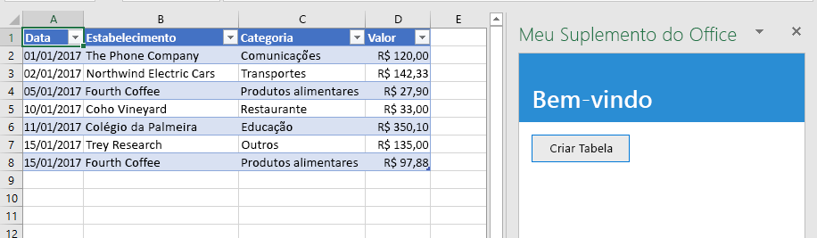
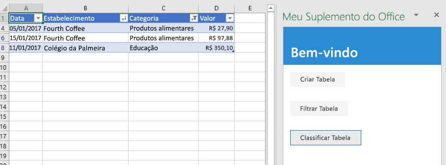
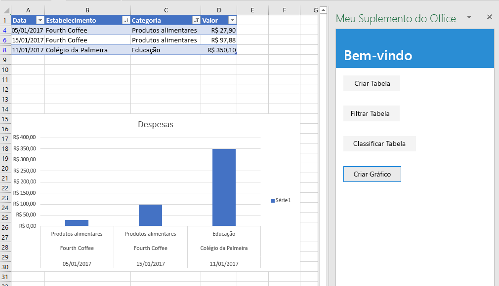
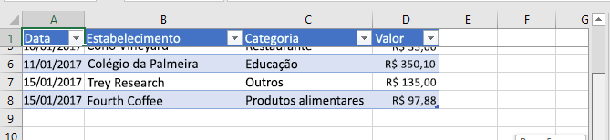
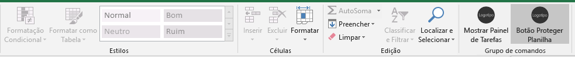

# <a name="tutorial-create-an-excel-task-pane-add-in"></a>Tutorial: criar um suplemento do painel de tarefas no Excel

Neste tutorial: você criará um suplemento do painel de tarefas no Excel

> [!div class="checklist"]
> * Cria uma tabela
> * Filtra e classifica uma tabela
> * Cria um gráfico
> * Congela um cabeçalho de tabela
> * Protege uma planilha
> * Abre uma caixa de diálogo

## <a name="prerequisites"></a>Pré-requisitos

Para usar este tutorial, você precisa instalar o seguinte. 

- Excel 2016, versão 1711 (build 8730.1000 do Clique para Executar) ou posterior. Talvez você precise ser um participante do programa Office Insider para ter essa versão. Para saber mais, confira a página [Seja um Office Insider](https://products.office.com/office-insider?tab=tab-1).

- [Nó](https://nodejs.org/en/) 

- [Git Bash](https://git-scm.com/downloads) (ou outro cliente Git)

- Você precisa ter uma conexão com a Internet para testar o suplemento neste tutorial.

## <a name="create-your-add-in-project"></a>Criar seu projeto do suplemento

Conclua as etapas a seguir para criar o projeto de suplemento do Excel que você vai usar como base para este tutorial.

1. Clone o repositório do GitHub com o [Tutorial de suplemento do Excel](https://github.com/OfficeDev/Excel-Add-in-Tutorial).

2. Abra uma janela Git bash ou um prompt de sistema habilitado para Node.JS e navegue para a pasta **Iniciar** do projeto.

3. Execute o comando `npm install` para instalar as ferramentas e bibliotecas listadas no arquivo package.json. 

4. Execute as etapas de [instalação do certificado autoassinado](https://github.com/OfficeDev/generator-office/blob/master/src/docs/ssl.md) para confiar no certificado para o sistema operacional do seu computador de desenvolvimento.

## <a name="create-a-table"></a>Criar uma tabela

Nesta etapa do tutorial, você testará no programa se o suplemento é compatível com a versão atual do Excel do usuário, adicionará uma tabela a uma planilha, depois preencherá e formatará a tabela com os dados.

### <a name="code-the-add-in"></a>Codificação do suplemento

1. Abra o projeto em seu editor de código.

2. Abra o arquivo index.html.

3. Substitua `TODO1` pela marcação a seguir:

    ```html
    <button class="ms-Button" id="create-table">Create Table</button>
    ```

4. Abra o arquivo app.js.

5. Substitua o `TODO1` pelo código a seguir. O código determina se a versão do Excel do usuário proporciona suporte a uma versão do Excel.js que inclua as APIs com esta série de tutoriais. Em um suplemento de produção, use o corpo do bloco condicional para ocultar ou desabilitar a interface do usuário que chame a APIs sem suporte. Dessa forma, permitirá que o usuário ainda use as partes do suplemento às quais a versão do Excel dá suporte.

    ```js
    if (!Office.context.requirements.isSetSupported('ExcelApi', 1.7)) {
        console.log('Sorry. The tutorial add-in uses Excel.js APIs that are not available in your version of Office.');
    }
    ```

6. Substitua o `TODO2` pelo código a seguir:

    ```js
    $('#create-table').click(createTable);
    ```

7. Substitua o `TODO3` pelo código a seguir. Observação:

   - A lógica de negócios de Excel.js será adicionada à função que passar por `Excel.run`. Essa lógica não é executada imediatamente. Em vez disso, ela é adicionada à fila de comandos pendentes.

   - O método `context.sync` envia todos os comandos da fila para execução no Excel.

   - `Excel.run` é seguido por um bloco `catch`. Essa é uma prática recomendada que você sempre deve seguir. 

    ```js
    function createTable() {
        Excel.run(function (context) {

            // TODO4: Queue table creation logic here.

            // TODO5: Queue commands to populate the table with data.

            // TODO6: Queue commands to format the table.

            return context.sync();
        })
        .catch(function (error) {
            console.log("Error: " + error);
            if (error instanceof OfficeExtension.Error) {
                console.log("Debug info: " + JSON.stringify(error.debugInfo));
            }
        });
    }
    ```

8. Substitua `TODO4` pelo código a seguir. Observação:

   - O código cria uma tabela usando o método `add` de conjunto de tabela da planilha, que sempre existe mesmo que ela esteja vazia. Essa é a maneira padrão de criar objetos no Excel.js. Não há nenhuma API do construtor de classe e você nunca usará um operador `new` para criar um objeto do Excel. Em vez disso, adicione a um objeto de conjunto pai.

   - O primeiro parâmetro do método `add`é o intervalo apenas da linha superior da tabela, não o intervalo inteiro que a tabela por fim usará. Isso ocorre porque, quando o suplemento preenche as linhas de dados (na próxima etapa), ele adicionará novas linhas à tabela, em vez de gravar os valores nas células das linhas existentes. Esse é um padrão mais comum, porque o número de linhas em uma tabela geralmente não é conhecido quando a tabela é criada.

   - Os nomes de tabelas devem ser exclusivos pela pasta de trabalho inteira, não só na planilha.

    ```js
    var currentWorksheet = context.workbook.worksheets.getActiveWorksheet();
    var expensesTable = currentWorksheet.tables.add("A1:D1", true /*hasHeaders*/);
    expensesTable.name = "ExpensesTable";
    ```

9. Substitua `TODO5` pelo código a seguir. Observação:

   - Os valores das células de um intervalo são definidos em uma matriz de matrizes.

   - Novas linhas são criadas em uma tabela ao chamar o método `add` do conjunto de linhas da tabela. Você pode adicionar várias linhas em uma única chamada de `add` ao incluir várias matrizes de valores de células na matriz pai que é passada como segundo parâmetro.

    ```js
    expensesTable.getHeaderRowRange().values =
        [["Date", "Merchant", "Category", "Amount"]];

    expensesTable.rows.add(null /*add at the end*/, [
        ["1/1/2017", "The Phone Company", "Communications", "120"],
        ["1/2/2017", "Northwind Electric Cars", "Transportation", "142.33"],
        ["1/5/2017", "Best For You Organics Company", "Groceries", "27.9"],
        ["1/10/2017", "Coho Vineyard", "Restaurant", "33"],
        ["1/11/2017", "Bellows College", "Education", "350.1"],
        ["1/15/2017", "Trey Research", "Other", "135"],
        ["1/15/2017", "Best For You Organics Company", "Groceries", "97.88"]
    ]);
    ```

10. Substitua `TODO6` pelo código a seguir. Observação:

   - O código recebe uma referência para a coluna **quantidade** ao passar o índice com base em zero para o método `getItemAt` do conjunto de colunas da tabela.

     > [!NOTE]
     > Os objetos do conjunto Excel.js, como `TableCollection`, `WorksheetCollection`, e `TableColumnCollection`, têm a propriedade `items` que é como uma matriz dos tipos de objetos filhos, como `Table` ou `Worksheet` ou `TableColumn`; mas um objeto `*Collection` não é uma matriz.

   - O código formata o intervalo da coluna **quantidade** como Euros com um segundo decimal. 

   - Por fim, isso garante que a largura das colunas e a altura das linhas sejam grandes o suficiente para o maior (ou o mais alto) item de dados. Observe que o código deve receber os objetos `Range` a formatar. Os objetos `TableColumn` e `TableRow` não têm propriedades de formato.

        ```js
        expensesTable.columns.getItemAt(3).getRange().numberFormat = [['€#,##0.00']];
        expensesTable.getRange().format.autofitColumns();
        expensesTable.getRange().format.autofitRows();
        ```

### <a name="test-the-add-in"></a>Testar o suplemento

1. Abra uma janela Git bash ou um prompt de sistema habilitado para Node.JS e navegue para a pasta **Iniciar** do projeto.

2. Execute o comando `npm run build` para transcompilar seu código-fonte do ES6 para uma versão anterior do JavaScript que é suportada pelo Internet Explorer (que é usada por algumas versões do Excel para executar suplementos do Excel).

3. Execute o comando `npm start` para iniciar um servidor Web em um localhost.

4. Realize o sideload do suplemento usando um dos métodos a seguir:

    - Windows: [Realizar sideload de Suplementos do Office no Windows](../testing/create-a-network-shared-folder-catalog-for-task-pane-and-content-add-ins.md)

    - Excel Online: [Realizar sideload dos Suplementos do Office no Office Online](../testing/sideload-office-add-ins-for-testing.md#sideload-an-office-add-in-in-office-online)

    - iPad e Mac: [Realizar sideload dos Suplementos do Office no iPad e Mac](../testing/sideload-an-office-add-in-on-ipad-and-mac.md)

5. No menu **Página Inicial**, escolha **Mostrar Painel de Tarefas**.

6. No painel de tarefas, escolha **Criar Tabela**.

    

## <a name="filter-and-sort-a-table"></a>Filtrar e classificar uma tabela

Nesta etapa do tutorial, você vai filtrar e classificar a tabela que criou anteriormente.

### <a name="filter-the-table"></a>Filtrar a tabela

1. Abra o projeto em seu editor de código.

2. Abra o arquivo index.html.

3. Abaixo do `div`, que contém o botão `create-table`, adicione a marcação a seguir:

    ```html
    <div class="padding">
        <button class="ms-Button" id="filter-table">Filter Table</button>
    </div>
    ```

4. Abra o arquivo app.js.

5. Logo abaixo da linha que atribui um identificador de clique ao botão `create-table`, adicione o seguinte código:

    ```js
    $('#filter-table').click(filterTable);
    ```

6. Logo abaixo da função `createTable`, adicione a função a seguir:

    ```js
    function filterTable() {
        Excel.run(function (context) {

            // TODO1: Queue commands to filter out all expense categories except
            //        Groceries and Education.

            return context.sync();
        })
        .catch(function (error) {
            console.log("Error: " + error);
            if (error instanceof OfficeExtension.Error) {
                console.log("Debug info: " + JSON.stringify(error.debugInfo));
            }
        });
    }
    ```

7. Substitua `TODO1` pelo código a seguir. Observação:

   - O código primeiro faz referência à coluna que precisa de filtragem ao passar o nome da coluna para o método `getItem`, em vez de passar o índice para o método `getItemAt` como o método `createTable` faz. Como os usuários podem mover as colunas da tabela, a coluna de um determinado índice pode mudar depois da criação da tabela. Portanto, é mais seguro usar o nome da coluna como referência dela. Usamos de forma segura `getItemAt` em um tutorial anterior porque usamos o mesmo método que cria a tabela. Assim não existe a chance de um usuário mover a coluna.

   - O método `applyValuesFilter` é um dos vários métodos de filtragem do objeto `Filter`.

    ```js
    var currentWorksheet = context.workbook.worksheets.getActiveWorksheet();
    var expensesTable = currentWorksheet.tables.getItem('ExpensesTable');
    var categoryFilter = expensesTable.columns.getItem('Category').filter;
    categoryFilter.applyValuesFilter(["Education", "Groceries"]);
    ``` 

### <a name="sort-the-table"></a>Classificar a tabela

1. Abra o arquivo index.html.

2. Abaixo do `div` que contém o botão `filter-table`, adicione a marcação a seguir:

    ```html
    <div class="padding">
        <button class="ms-Button" id="sort-table">Sort Table</button>
    </div>
    ```

3. Abra o arquivo app.js.

4. Abaixo da linha que atribui um identificador de clique ao botão `filter-table`, adicione o seguinte código:

    ```js
    $('#sort-table').click(sortTable);
    ```

5. Abaixo da função `filterTable`, adicione a função a seguir.

    ```js
    function sortTable() {
        Excel.run(function (context) {

            // TODO1: Queue commands to sort the table by Merchant name.

            return context.sync();
        })
        .catch(function (error) {
            console.log("Error: " + error);
            if (error instanceof OfficeExtension.Error) {
                console.log("Debug info: " + JSON.stringify(error.debugInfo));
            }
        });
    }
    ```

6. Substitua `TODO1` pelo código a seguir. Observação:

   - O código cria uma matriz de objetos `SortField` que tem apenas um membro, já que o suplemento só classifica a coluna Comerciante.

   - A propriedade `key` de um objeto `SortField` é o índice com base em zero da coluna a classificar.

   - O membro `sort` de uma `Table` é um objeto `TableSort`, não um método. Os `SortField`s são passados para o método `apply` do objeto `TableSort`.

    ```js
    var currentWorksheet = context.workbook.worksheets.getActiveWorksheet();
    var expensesTable = currentWorksheet.tables.getItem('ExpensesTable');
    var sortFields = [
        {
            key: 1,            // Merchant column
            ascending: false,
        }
    ];

    expensesTable.sort.apply(sortFields);
    ```

### <a name="test-the-add-in"></a>Testar o suplemento

1. Se a janela Git bash ou o prompt de sistema habilitado para Node.JS do tutorial anterior ainda estiverem abertos, digite **Ctrl + C** duas vezes para interromper a execução do servidor Web. Caso contrário, abra uma janela Git bash ou um prompt de sistema habilitado para Node.JS e navegue até a pasta **Iniciar** do projeto.

     > [!NOTE]
     > Embora o servidor de sincronização do navegador recarregue o suplemento no painel de tarefas sempre que você fizer uma alteração em algum arquivo, incluindo o arquivo app.js, ele não transcompila o JavaScript, portanto, é necessário repetir o comando de compilação para que as alterações em app.js as entrem em vigor. Para fazer isso, interrompa o processo do servidor para obter uma solicitação para inserir o comando de compilação. Após a compilação, reinicie o servidor. As próximas etapas executam esse processo.

2. Execute o comando `npm run build` para transcompilar seu código-fonte do ES6 para uma versão anterior do JavaScript que é suportada pelo Internet Explorer (que é usada por algumas versões do Excel para executar suplementos do Excel).

3. Execute o comando `npm start` para iniciar um servidor Web em um localhost.

4. Feche o painel de tarefas para recarregá-lo e, no menu **Página Inicial**, selecione **Mostrar Painel de Tarefas** para reabrir o suplemento.

5. Se por qualquer motivo a tabela não estiver na planilha aberta, no painel de tarefas, escolha **Criar Tabela**.

6. Escolha os botões **Filtrar Tabela** e **Classificar Tabela** em qualquer ordem.

    

## <a name="create-a-chart"></a>Criar um gráfico

Nesta etapa do tutorial, você vai criar um gráfico com dados da tabela que você criou anteriormente e depois vai formatar o gráfico.

### <a name="chart-a-chart-using-table-data"></a>Gráfico de um gráfico com dados de tabela

1. Abra o projeto em seu editor de código.

2. Abra o arquivo index.html.

3. Abaixo do `div` que contém o botão `sort-table`, adicione a marcação a seguir:

    ```html
    <div class="padding">
        <button class="ms-Button" id="create-chart">Create Chart</button>
    </div>
    ```

4. Abra o arquivo app.js.

5. Abaixo da linha que atribui um identificador de clique ao botão `sort-chart`, adicione o seguinte código:

    ```js
    $('#create-chart').click(createChart);
    ```

6. Abaixo da função `sortTable`, adicione a função a seguir.

    ```js
    function createChart() {
        Excel.run(function (context) {

            // TODO1: Queue commands to get the range of data to be charted.

            // TODO2: Queue command to create the chart and define its type.

            // TODO3: Queue commands to position and format the chart.

            return context.sync();
        })
        .catch(function (error) {
            console.log("Error: " + error);
            if (error instanceof OfficeExtension.Error) {
                console.log("Debug info: " + JSON.stringify(error.debugInfo));
            }
        });
    }
    ```

7. Substitua `TODO1` pelo código a seguir. Para excluir a linha de cabeçalho, o código usa o método `Table.getDataBodyRange` para acessar o intervalo de dados que você deseja representar graficamente em vez do método `getRange`.

    ```js
    var currentWorksheet = context.workbook.worksheets.getActiveWorksheet();
    var expensesTable = currentWorksheet.tables.getItem('ExpensesTable');
    var dataRange = expensesTable.getDataBodyRange();
    ```

8. Substitua `TODO2` pelo código a seguir. Observe os seguintes parâmetros:

   - O primeiro parâmetro para o método `add` especifica o tipo de gráfico. Há diversos tipos.

   - O segundo parâmetro especifica um intervalo de dados a incluir no gráfico.

   - O terceiro parâmetro determina se uma série de pontos de dados da tabela deve estar representada por linha ou por coluna. A opção `auto` informa ao Excel para decidir o melhor método.

    ```js
    var chart = currentWorksheet.charts.add('ColumnClustered', dataRange, 'auto');
    ```

9. Substitua `TODO3` pelo código a seguir. A maior parte do código é autoexplicativa. Observação:
   
   - Os parâmetros do método `setPosition` especificam as células da esquerda superior e da direita inferior da área da planilha que deve conter o gráfico. O Excel ajusta detalhes como a largura da linha para criar uma boa aparência para o gráfico no espaço fornecido.
   
   - "Série" é um conjunto de pontos de dados de uma coluna da tabela. Como há apenas uma coluna sem cadeia de caracteres na tabela, o Excel deduz que essa é a única coluna de pontos de dados no gráfico. Ele interpreta outras colunas como rótulos do gráfico. Portanto, haverá apenas uma série no gráfico e será necessário o índice 0. Ele será rotulado como "Valor em €".

    ```js
    chart.setPosition("A15", "F30");
    chart.title.text = "Expenses";
    chart.legend.position = "right"
    chart.legend.format.fill.setSolidColor("white");
    chart.dataLabels.format.font.size = 15;
    chart.dataLabels.format.font.color = "black";
    chart.series.getItemAt(0).name = 'Value in €';
    ```

### <a name="test-the-add-in"></a>Testar o suplemento

1. Se a janela Git bash ou o prompt de sistema habilitado para Node.JS do tutorial anterior ainda estiverem abertos, digite **Ctrl + C** duas vezes para interromper a execução do servidor Web. Caso contrário, abra uma janela Git bash ou um prompt de sistema habilitado para Node.JS e navegue até a pasta **Iniciar** do projeto.

     > [!NOTE]
     > Embora o servidor de sincronização do navegador recarregue o suplemento no painel de tarefas sempre que você fizer uma alteração em algum arquivo, incluindo o arquivo app.js, ele não transcompila o JavaScript, portanto, é necessário repetir o comando de compilação para que as alterações em app.js as entrem em vigor. Para fazer isso, interrompa o processo do servidor para obter uma solicitação para inserir o comando de compilação. Após a compilação, reinicie o servidor. As próximas etapas executam esse processo.

2. Execute o comando `npm run build` para transcompilar seu código-fonte do ES6 para uma versão anterior do JavaScript que é suportada pelo Internet Explorer (que é usada por algumas versões do Excel para executar suplementos do Excel).

3. Execute o comando `npm start` para iniciar um servidor Web em um localhost.

4. Feche o painel de tarefas para recarregá-lo e, no menu **Página Inicial**, selecione **Mostrar Painel de Tarefas** para reabrir o suplemento.

5. Se, por algum motivo, a tabela não estiver na planilha aberta, no painel de tarefas, escolha **Criar Tabela** e depois os botões **Filtrar Tabela** e **Classificar Tabela ** em qualquer ordem.

6. Clique no botão **Criar gráfico**. Um gráfico é criado e incluirá somente os dados das linhas que foram filtradas. Os rótulos dos pontos de dados na parte inferior estão na ordem de classificação do gráfico, ou seja, nomes de comerciantes em ordem alfabética inversa.

    

## <a name="freeze-a-table-header"></a>Congelar um cabeçalho de tabela

Quando uma tabela for longa o suficiente para que um usuário precise rolar para ver algumas linhas, a linha de cabeçalho poderá ficar fora da vista. Nesta etapa do tutorial, você precisará congelar a linha do cabeçalho da tabela que criou anteriormente para que ela permaneça visível, mesmo que o usuário role ao longo da planilha.

### <a name="freeze-the-tables-header-row"></a>Congelar a linha de cabeçalho da tabela

1. Abra o projeto em seu editor de código.

2. Abra o arquivo index.html.

3. Abaixo do `div` que contém o botão `create-chart`, adicione a marcação a seguir:

    ```html
    <div class="padding">
        <button class="ms-Button" id="freeze-header">Freeze Header</button>
    </div>
    ```

4. Abra o arquivo app.js.

5. Abaixo da linha que atribui um identificador de clique ao botão `create-chart`, adicione o seguinte código:

    ```js
    $('#freeze-header').click(freezeHeader);
    ```

6. Abaixo da função `createChart`, adicione a função a seguir:

    ```js
    function freezeHeader() {
        Excel.run(function (context) {

            // TODO1: Queue commands to keep the header visible when the user scrolls.

            return context.sync();
        })
        .catch(function (error) {
            console.log("Error: " + error);
            if (error instanceof OfficeExtension.Error) {
                console.log("Debug info: " + JSON.stringify(error.debugInfo));
            }
        });
    }
    ```

7. Substitua `TODO1` pelo código a seguir. Observação:

   - A coleção `Worksheet.freezePanes` é um conjunto de painéis da planilha que fica congelado ou fixado no mesmo lugar quando rolamos a planilha.

   - O método `freezeRows` considera como parâmetro o número de linhas, começando da parte superior, que devem ser fixadas no local. Passamos `1` para fixar a primeira linha no local.

    ```js
    var currentWorksheet = context.workbook.worksheets.getActiveWorksheet();
    currentWorksheet.freezePanes.freezeRows(1);
    ```

### <a name="test-the-add-in"></a>Testar o suplemento

1. Se a janela Git bash ou o prompt de sistema habilitado para Node.JS do tutorial anterior ainda estiverem abertos, digite **Ctrl + C** duas vezes para interromper a execução do servidor Web. Caso contrário, abra uma janela Git bash ou um prompt de sistema habilitado para Node.JS e navegue até a pasta **Iniciar** do projeto.

     > [!NOTE]
     > Embora o servidor de sincronização do navegador recarregue o suplemento no painel de tarefas sempre que você fizer uma alteração em algum arquivo, incluindo o arquivo app.js, ele não transcompila o JavaScript, portanto, é necessário repetir o comando de compilação para que as alterações em app.js as entrem em vigor. Para fazer isso, interrompa o processo do servidor para obter uma solicitação para inserir o comando de compilação. Após a compilação, reinicie o servidor. As próximas etapas executam esse processo.

2. Execute o comando `npm run build` para transcompilar seu código-fonte do ES6 para uma versão anterior do JavaScript que é suportada pelo Internet Explorer (que é usada por algumas versões do Excel para executar suplementos do Excel).

3. Execute o comando `npm start` para iniciar um servidor Web em um localhost.

4. Feche o painel de tarefas para recarregá-lo e, no menu **Início**, selecione **Mostrar Painel de Tarefas** para reabrir o suplemento.

5. Se a tabela estiver na planilha, exclua-a.

6. No painel de tarefas, escolha **Criar Tabela**.

7. Escolha o botão **Congelar Cabeçalho**.

8. Role a planilha para baixo, o suficiente para ver que o cabeçalho da tabela permanece visível na parte superior mesmo ao rolar até que as primeiras linhas fiquem fora da vista.

    

## <a name="protect-a-worksheet"></a>Proteger uma planilha

Nesta etapa do tutorial, você adicionará outro botão à faixa de opções que, quando selecionado, executa uma função que você precisará definir para ativar e desativar a proteção da planilha.

### <a name="configure-the-manifest-to-add-a-second-ribbon-button"></a>Configure o manifesto para adicionar um segundo botão à faixa de opções

1. Abra o arquivo de manifesto my-office-add-in-manifest.xml.

2. Encontre o elemento `<Control>`. Esse elemento define o botão **Mostrar Painel de Tarefas** na faixa de opções **Início** que você usa para iniciar o suplemento. Vamos adicionar um segundo botão ao mesmo grupo na faixa de opções **Início**. Entre a marca de Controle final (`</Control>`) e a marca de Grupo final (`</Group>`), adicione a marcação a seguir.

    ```xml
    <Control xsi:type="Button" id="<!--TODO1: Unique (in manifest) name for button -->">
        <Label resid="<!--TODO2: Button label -->" />
        <Supertip>            
            <Title resid="<!-- TODO3: Button tool tip title -->" />
            <Description resid="<!-- TODO4: Button tool tip description -->" />
        </Supertip>
        <Icon>
            <bt:Image size="16" resid="Contoso.tpicon_16x16" />
            <bt:Image size="32" resid="Contoso.tpicon_32x32" />
            <bt:Image size="80" resid="Contoso.tpicon_80x80" />
        </Icon>
        <Action xsi:type="<!-- TODO5: Specify the type of action-->">
            <!-- TODO6: Identify the function.-->
        </Action>
    </Control>
    ```

3. Substitua `TODO1` por uma cadeia de caracteres que fornece ao botão uma ID exclusiva no arquivo de manifesto. Como nosso botão ativará ou desativará a proteção da planilha, use "ToggleProtection". Quando terminar, a marca de Controle de início inteira deve se parecer com o seguinte:

    ```xml
    <Control xsi:type="Button" id="ToggleProtection">
    ```

4. Os próximos três `TODO`s definem “resid”, que significa ID de recurso. Um recurso é uma cadeia de caracteres e você criará essas três cadeias de caracteres em uma etapa posterior. Por enquanto, você precisa fornecer IDs aos recursos. O rótulo do botão deve ser "Toggle Protection", mas a *ID* dessa cadeia de caracteres será "ProtectionButtonLabel", de forma que o elemento `Label` completo deve se parecer com o código a seguir:

    ```xml
    <Label resid="ProtectionButtonLabel" />
    ```

5. O elemento `SuperTip` define a dica de ferramenta do botão. O título da dica de ferramenta deve ser o mesmo que o rótulo do botão, por isso, usamos a mesma ID de recurso: "ProtectionButtonLabel". A descrição da dica de ferramenta será "Click to turn protection of the worksheet on and off". Mas o `ID` será "ProtectionButtonToolTip". Portanto, quando terminar, a marcação `SuperTip` inteira deve se parecer com o seguinte código: 

    ```xml
    <Supertip>            
        <Title resid="ProtectionButtonLabel" />
        <Description resid="ProtectionButtonToolTip" />
    </Supertip>
    ```

   > [!NOTE] 
   > Em um suplemento de produção,não é recomendável usar o mesmo ícone para dois botões diferentes; mas, para simplificar este tutorial, faremos isso. Portanto, a marcação `Icon` em nosso novo `Control` é apenas uma cópia do elemento `Icon` do `Control` existente. 

6. O elemento `Action` dentro do elemento `Control` original já está presente no manifesto, tem seu tipo definido como `ShowTaskpane`, mas nosso novo botão não abrirá um painel de tarefas, mas sim executará uma função personalizada criada em uma etapa posterior. Portanto, substitua `TODO5` por `ExecuteFunction`, que é o tipo de ação para botões que acionam funções personalizadas. A marca `Action` de início deve ser similar ao código abaixo:
 
    ```xml
    <Action xsi:type="ExecuteFunction">
    ```

7. O elemento `Action` original tem elementos filhos que especificam uma ID do painel de tarefas e uma URL da página que deve ser aberta no painel de tarefas. No entanto, um elemento `Action` do tipo `ExecuteFunction` tem um único elemento filho que nomeia a função executada pelo controle. Você criará essa função em uma etapa posterior e ela será chamada de `toggleProtection`. Então, substitua `TODO6` pela marcação a seguir:
 
    ```xml
    <FunctionName>toggleProtection</FunctionName>
    ```

    A marcação `Control` inteira deve ter a aparência a seguir:

    ```xml
    <Control xsi:type="Button" id="ToggleProtection">
        <Label resid="ProtectionButtonLabel" />
        <Supertip>            
            <Title resid="ProtectionButtonLabel" />
            <Description resid="ProtectionButtonToolTip" />
        </Supertip>
        <Icon>
            <bt:Image size="16" resid="Contoso.tpicon_16x16" />
            <bt:Image size="32" resid="Contoso.tpicon_32x32" />
            <bt:Image size="80" resid="Contoso.tpicon_80x80" />
        </Icon>
        <Action xsi:type="ExecuteFunction">
           <FunctionName>toggleProtection</FunctionName>
        </Action>
    </Control>
    ```

8. Role para baixo até a seção `Resources` do manifesto.

9. Adicione a seguinte marcação como filho do elemento `bt:ShortStrings`.

    ```xml
    <bt:String id="ProtectionButtonLabel" DefaultValue="Toggle Worksheet Protection" />
    ```

10. Adicione a seguinte marcação como filho do elemento `bt:LongStrings`.

    ```xml
    <bt:String id="ProtectionButtonToolTip" DefaultValue="Click to protect or unprotect the current worksheet." />
    ```

11. Salve o arquivo.

### <a name="create-the-function-that-protects-the-sheet"></a>Criar a função que protege a planilha

1. Abra o arquivo \function-file\function-file.js.

2. O arquivo já tem uma Expressão de Função Invocada Imediatamente (IFFE). *Fora do IIFE*, adicione o código a seguir. Observe que é possível especificar um parâmetro `args` para o método e a última linha do método chamará `args.completed`. Esse é um requisito para todos os comandos de suplemento do tipo **ExecuteFunction**. Ele sinaliza para o aplicativo host do Office que a função terminou e que a interface do usuário podem ficar responsiva novamente.

    ```js
    function toggleProtection(args) {
        Excel.run(function (context) {
            
            // TODO1: Queue commands to reverse the protection status of the current worksheet.

            return context.sync();
        })
        .catch(function (error) {
            console.log("Error: " + error);
            if (error instanceof OfficeExtension.Error) {
                console.log("Debug info: " + JSON.stringify(error.debugInfo));
            }
        });
        args.completed();
    }
    ```

3. Substitua `TODO1` pelo código a seguir. O código usa propriedade de proteção do objeto de planilha em um padrão de botão de alternância padrão. O `TODO2` será explicado na próxima seção.

    ```js
    var sheet = context.workbook.worksheets.getActiveWorksheet();

    // TODO2: Queue command to load the sheet's "protection.protected" property from
    //        the document and re-synchronize the document and task pane.

     if (sheet.protection.protected) {
        sheet.protection.unprotect();
    } else {
        sheet.protection.protect();
    }
    ``` 

### <a name="add-code-to-fetch-document-properties-into-the-task-panes-script-objects"></a>Adicione código para buscar propriedades do documento em objetos de script do painel de tarefas

Em todas as funções anteriores desta série de tutoriais, você colocou em fila comandos para *gravar* no documento do Office. Cada função terminou com uma chamada para o método `context.sync()`, que envia os comandos em fila para o documento a ser executado. Entretanto, o código adicionado na última etapa chama a propriedade `sheet.protection.protected` e essa é uma grande diferença das funções anteriores que você escreveu, pois o objeto `sheet` é apenas um objeto de proxy que existe no script do seu painel de tarefas. Ele não sabe qual é o estado real de proteção do documento, portanto, sua propriedade `protection.protected` não pode ter um valor real. É necessário primeiro buscar o status de proteção do documento e definir o valor de `sheet.protection.protected`. Somente então será possível chamar `sheet.protection.protected` sem causar uma exceção. Esse processo de busca tem três etapas:

   1. Coloque em fila um comando para carregar (ou seja, fetch) as propriedades que seu código precisa ler.

   2. Chame o método `sync` do objeto de contexto para enviar o comando em fila para o documento para execução e retornar as informações solicitadas.

   3. Como o método `sync` é assíncrono, certifique-se de que ele tenha sido concluído antes que o código chame as propriedades que foram buscadas.

Essas etapas devem ser concluídas sempre que seu código precisar *ler* informações do documento do Office.

1. Na função `toggleProtection`, substitua `TODO2` pelo seguinte código. Observação:
   
   - Todos os objetos do Excel têm um método `load`. Especifique as propriedades do objeto que você deseja ler no parâmetro como uma cadeia de caracteres de nomes delimitados por vírgulas. Nesse caso, a propriedade que você precisa ler é uma subpropriedade de `protection`. Referencie a subpropriedade quase exatamente como você faria em qualquer lugar do seu código, mas usando uma barra (“/”) em vez de um ponto (".").

   - Para garantir que a lógica de botão de alternância, `sheet.protection.protected`, não seja executada até após `sync` ser concluído e o `sheet.protection.protected` ser atribuída ao valor correto buscado no documento, ele será movido (na próxima etapa) para uma função `then` que não será executada até `sync` ser concluído. 

    ```js
    sheet.load('protection/protected');
    return context.sync()
        .then(
            function() {
                // TODO3: Move the queued toggle logic here.
            }
        )
        // TODO4: Move the final call of `context.sync` here and ensure that it
        //        does not run until the toggle logic has been queued.
    ``` 

2. Você não pode ter duas instruções `return` no mesmo caminho de código sem ramificações, portanto, exclua a linha final `return context.sync();` no final de `Excel.run`. Você adicionará um novo `context.sync` final em uma etapa posterior.

3. Recorte a estrutura `if ... else` na função `toggleProtection` e a cole no lugar de `TODO3`.

4. Substitua `TODO4` pelo código a seguir. Observação:

   - Passar o método `sync` para uma função `then` garante que ele não seja executado até que `sheet.protection.unprotect()` ou `sheet.protection.protect()` seja enfileirado.

   - O método `then` invoca qualquer função que é passada para ele e não é recomendável que `sync` seja chamado duas vezes, portanto, remova os “()” do fim de `context.sync`.

    ```js
    .then(context.sync);
    ```

   Quando terminar, a função inteira deve se parecer com o seguinte:

    ```js
    function toggleProtection(args) {
        Excel.run(function (context) {            
          var sheet = context.workbook.worksheets.getActiveWorksheet();          
          sheet.load('protection/protected');

          return context.sync()
              .then(
                  function() {
                    if (sheet.protection.protected) {
                        sheet.protection.unprotect();
                    } else {
                        sheet.protection.protect();
                    }
                  }
              )
              .then(context.sync);
        })
        .catch(function (error) {
            console.log("Error: " + error);
            if (error instanceof OfficeExtension.Error) {
                console.log("Debug info: " + JSON.stringify(error.debugInfo));
            }
        });
        args.completed();
    }
    ```

### <a name="configure-the-script-loading-html-file"></a>Configure o arquivo HTML de carregamento de script

Abra o arquivo /function-file/function-file.html. Esse é um arquivo HTML sem IU que é chamado quando o usuário pressiona o botão **Ativar/Desativar Proteção da Planilha**. O objetivo é carregar o método JavaScript que deve ser executado quando botão é pressionado. Esse arquivo não será alterado. Basta observar que a segunda marca `<script>` carrega o functionfile.js.

   > [!NOTE]
   > O arquivo function-file.html e o arquivo function-file.js carregado são executados em um processo do IE completamente separado de painel de tarefas do suplemento. Se o function-file.js foi transcompilado no mesmo arquivo bundle.js que o arquivo app.js, o suplemento precisará carregar duas cópias do arquivo bundle.js, o que anule o propósito do agrupamento. Além disso, o arquivo function-file.js não contém qualquer JavaScript incompatível com o Internet Explorer. Por esses dois motivos, esse suplemento não transcompila o function-file.js. 

### <a name="test-the-add-in"></a>Testar o suplemento

1. Feche todos os aplicativos do Office, incluindo o Excel. 

2. Para excluir o cache do Office, exclua o conteúdo da pasta de cache. Isso é necessário para limpar totalmente a versão anterior do suplemento do host. 

    - No Windows: `%LOCALAPPDATA%\Microsoft\Office\16.0\Wef\`.

    - No Mac: `~/Library/Containers/com.Microsoft.OsfWebHost/Data/`. 
    
        [!include[additional cache folders on Mac](../includes/mac-cache-folders.md)]

3. Se, por algum motivo, o servidor não estiver executando, em uma janela do Git Bash ou em um prompt do sistema habilitado para Node.JS, acesse a pasta **Iniciar** do projeto e execute o comando `npm start`. Não é necessário recriar o projeto, pois o único arquivo JavaScript que você alterou não faz parte do bundle.js interno.

4. Usando a nova versão do arquivo de manifesto alterado, repita o processo de sideloading usando um dos seguintes métodos. *Você deve substituir a cópia anterior do arquivo de manifesto.*

    - Windows: [Realizar sideload de Suplementos do Office no Windows](../testing/create-a-network-shared-folder-catalog-for-task-pane-and-content-add-ins.md)

    - Excel Online: [Realizar sideload dos Suplementos do Office no Office Online](../testing/sideload-office-add-ins-for-testing.md#sideload-an-office-add-in-in-office-online)

    - iPad e Mac: [Realizar sideload dos Suplementos do Office no iPad e Mac](../testing/sideload-an-office-add-in-on-ipad-and-mac.md)

5. Abra qualquer planilha no Excel.

6. Na Faixa de Opções, em **Página Inicial**, escolha **Ativar Proteger Planilha**. Observe que a maioria dos controles na Faixa de Opções está desabilitada (e visualmente esmaecida) conforme mostrado na captura de tela abaixo. 

7. Escolha uma célula como se quisesse alterar o conteúdo. Você receberá um erro informando que a planilha está protegida.

8. Escolha **Ativar/Desativar Proteção da Planilha** novamente e os controles serão reabilitados e você poderá alterar os valores das células.

    

## <a name="open-a-dialog"></a>Abrir uma caixa de diálogo

Nesta etapa final do tutorial, você abre uma caixa de diálogo no suplemento, passa uma mensagem do processo de caixa de diálogo para o processo de painel de tarefas e fecha a caixa de diálogo. As caixas de diálogo do Suplemento do Office são *não modais*: o usuário pode continuar a interagir com o documento no aplicativo do Office do host e com a página host no painel de tarefas.

### <a name="create-the-dialog-page"></a>Crie a página da caixa de diálogo

1. Abra o projeto em seu editor de código.

2. Crie um arquivo chamado popup.html na raiz do projeto (onde se encontra index.html).

3. Adicione a marcação a seguir em popup.html. Observação:

   - a página tem um `<input>` em que o usuário insere o nome dele e um botão que envia o nome para a página no painel de tarefas onde ele será exibido.

   - A marcação carrega um script chamado popup.js que você criará em uma etapa posterior.

   - Ela também carrega uma biblioteca Office.JS e jQuery porque elas serão usadas em popup.js.

    ```html
    <!DOCTYPE html>
    <html>
        <head lang="en">
            <title>Dialog for My Office Add-in</title>
            <meta charset="UTF-8">
            <meta name="viewport" content="width=device-width, initial-scale=1">

            <link rel="stylesheet" href="node_modules/office-ui-fabric-js/dist/css/fabric.min.css" />
            <link rel="stylesheet" href="node_modules/office-ui-fabric-js/dist/css/fabric.components.css" />
            <link rel="stylesheet" href="app.css" />

            <script type="text/javascript" src="https://appsforoffice.microsoft.com/lib/1.1/hosted/office.js"></script>
            <script type="text/javascript" src="https://ajax.aspnetcdn.com/ajax/jQuery/jquery-2.2.1.min.js"></script>
            <script type="text/javascript" src="popup.js"></script>

        </head>
        <body style="display:flex;flex-direction:column;align-items:center;justify-content:center">
            <div class="padding">
                <p class="ms-font-xl">ENTER YOUR NAME</p>
            </div>
            <div class="padding">
                <input id="name-box" type="text"/>
            </div>
            <div class="padding">
                <button id="ok-button" class="ms-Button">OK</button>
            </div>
        </body>
    </html>
    ```

4. Crie um arquivo chamado popup.js na raiz do projeto.

5. Adicione o código a seguir a popup.js. Observe o seguinte a respeito deste código:

   - *Todas as páginas que chamam APIs na biblioteca Office.JS devem primeiro garantir que a biblioteca tenha sido totalmente inicializada.* A melhor maneira de fazer isso é chamando o método `Office.onReady()`. Se o suplemento possuir as próprias tarefas de inicialização, o código deverá ser colocado em um método `then()` encadeado à chamada de `Office.onReady()`. Para um exemplo, veja o arquivo app.js na raiz do projeto. A chamada de `Office.onReady()` deve ser executada antes de qualquer chamada para Office.JS; por isso, a tarefa se encontra em um arquivo de script que é carregado pela página, como neste caso.
   - A função `ready` do jQuery é chamada dentro do método `then()`. Na maioria dos casos, o carregamento, a inicialização ou o código de bootstrap de outras bibliotecas JavaScript devem ficar dentro do método `then()` encadeado à chamada de `Office.onReady()`.

    ```js
    (function () {
    "use strict";

        Office.onReady()
            .then(function() {
                $(document).ready(function () {  

                    // TODO1: Assign handler to the OK button.

                });
            });

        // TODO2: Create the OK button handler

    }());
    ```

6. Substitua `TODO1` pelo código a seguir. Você criará a função `sendStringToParentPage` na próxima etapa.

    ```js
    $('#ok-button').click(sendStringToParentPage);
    ```

7. Substitua `TODO2` pelo código a seguir. O método `messageParent` passa seu parâmetro para a página pai, neste caso, a página no painel de tarefas. O parâmetro pode ser um booliano ou uma cadeia de caracteres, que inclui tudo o que pode ser serializado como uma cadeia de caracteres, como XML ou JSON.

    ```js
    function sendStringToParentPage() {
        var userName = $('#name-box').val();
        Office.context.ui.messageParent(userName);
    }
    ```

8. Salve o arquivo.

   > [!NOTE]
   > O arquivo Popup. html e o arquivo Popup. js que ele carrega, são executados em um processo de borda totalmente separado ou Internet Explorer 11 do painel de tarefas do suplemento. Se o popup.js foi transcompilado no mesmo arquivo bundle.js que o arquivo app.js, o suplemento precisará carregar duas cópias do arquivo bundle.js, o que anule o propósito do agrupamento. Além disso, o arquivo Popup. js não contém qualquer JavaScript que não tenha suporte do Internet Explorer 11. Por esses dois motivos, esse suplemento não transcompila o popup.js.

### <a name="open-the-dialog-from-the-task-pane"></a>Abra a caixa de diálogo do painel de tarefas

1. Abra o arquivo index.html.

2. Abaixo do `div` que contém o botão `freeze-header`, adicione a marcação a seguir:

    ```html
    <div class="padding">
        <button class="ms-Button" id="open-dialog">Open Dialog</button>
    </div>
    ```

3. A caixa de diálogo solicitará que o usuário insira um nome e passará o nome de usuário para o painel de tarefas. O painel de tarefas o exibirá em um rótulo. Imediatamente abaixo do `div` que você adicionou, adicione a marcação a seguir:

    ```html
    <div class="padding">
        <label id="user-name"></label>
    </div>
    ```

4. Abra o arquivo app.js.

5. Abaixo da linha que atribui um identificador de clique ao botão `freeze-header`, adicione o seguinte código. Você criará o método `openDialog` em uma etapa posterior.

    ```js
    $('#open-dialog').click(openDialog);
    ```

6. Abaixo da função `freezeHeader`, adicione a declaração seguinte. Essa variável é usada para armazenar um objeto no contexto de execução da página pai que atua como um intermediador no contexto de execução da página da caixa de diálogo.

    ```js
    var dialog = null;
    ```

7. Abaixo da declaração de `dialog`, adicione a função a seguir. É importante observar o que esse código *não* contém: não há nenhuma chamada de `Excel.run`. Isso ocorre porque a API para abrir uma caixa de diálogo é compartilhada com todos os hosts do Office, portanto, ela faz parte da API de Office JavaScript Common, não da API específica do Excel.

    ```js
    function openDialog() {
        // TODO1: Call the Office Common API that opens a dialog
    }
    ```

8. Substitua `TODO1` pelo código a seguir. Observação:

   - O método`displayDialogAsync` abre uma caixa de diálogo no centro da tela.

   - O primeiro parâmetro é a URL da página a ser aberta.

   - O segundo parâmetro passa opções. `height` e `width` são porcentagens do tamanho da janela do aplicativo do Office.

    ```js
    Office.context.ui.displayDialogAsync(
        'https://localhost:3000/popup.html',
        {height: 45, width: 55},

        // TODO2: Add callback parameter.
    );
    ```

### <a name="process-the-message-from-the-dialog-and-close-the-dialog"></a>Processar a mensagem da caixa de diálogo e depois fechá-la

1. Continue no arquivo app.js e substitua `TODO2` pelo código a seguir. Observação:

   - O retorno de chamada é executado logo após a caixa de diálogo ser aberta com êxito e antes de o usuário executar qualquer ação nela.

   - O `result.value` é o objeto que funciona como um tipo de intermediário entre contextos execução das páginas de pai e de caixa de diálogo.

   - A função `processMessage` será criada em uma etapa posterior. Esse identificador processará os valores que sejam enviados da página da caixa de diálogo com chamadas da função `messageParent`.

    ```js
    function (result) {
        dialog = result.value;
        dialog.addEventHandler(Microsoft.Office.WebExtension.EventType.DialogMessageReceived, processMessage);
    }
    ```

2. Abaixo da função `openDialog`, adicione a função a seguir.

    ```js
    function processMessage(arg) {
        $('#user-name').text(arg.message);
        dialog.close();
    }
    ```

### <a name="test-the-add-in"></a>Testar o suplemento

1. Se a janela Git bash ou o prompt de sistema habilitado para Node.JS do tutorial anterior ainda estiverem abertos, digite **Ctrl + C** duas vezes para interromper a execução do servidor Web. Caso contrário, abra uma janela Git bash ou um prompt de sistema habilitado para Node.JS e navegue até a pasta **Iniciar** do projeto.

     > [!NOTE]
     > Embora o servidor de sincronização do navegador recarregue o suplemento no painel de tarefas sempre que você fizer uma alteração em algum arquivo, incluindo o arquivo app.js, ele não transcompila o JavaScript, portanto, é necessário repetir o comando de compilação para que as alterações em app.js as entrem em vigor. Para fazer isso, interrompa o processo do servidor para obter uma solicitação para inserir o comando de compilação. Após a compilação, reinicie o servidor. As próximas etapas executam esse processo.

2. Execute o comando `npm run build` para transcompilar seu código-fonte do ES6 para uma versão anterior do JavaScript que é suportada pelo Internet Explorer (que é usada por algumas versões do Excel para executar suplementos do Excel).

3. Execute o comando `npm start` para iniciar um servidor Web em um localhost.

4. Feche o painel de tarefas para recarregá-lo e, no menu **Início**, selecione **Mostrar Painel de Tarefas** para reabrir o suplemento.

5. Escolha o botão **Abrir Caixa de Diálogo** no painel de tarefas.

6. Quando a caixa de diálogo estiver aberta, arraste-a e redimensione-a. Observe que você pode interagir com a planilha e pressionar outros botões no painel de tarefas. No entanto, não é possível iniciar uma segunda caixa de diálogo na mesma página do painel de tarefas.

7. Na caixa de diálogo, digite um nome e escolha **OK**. O nome aparecerá no painel de tarefas e a caixa de diálogo será fechada.

8. Opcionalmente, comente a linha `dialog.close();` na função `processMessage`. Em seguida, repita as etapas desta seção. A caixa de diálogo permanece aberta e você pode alterar o nome. É possível fechá-la manualmente pressionando o botão **X** no canto superior direito.

    

## <a name="next-steps"></a>Próximas etapas

Neste tutorial você criou um suplemento do Excel que interage com tabelas, gráficos, planilhas e caixas de diálogo em uma pasta de trabalho do Excel. Para saber mais sobre o desenvolvimento de suplementos do Excel, continue no seguinte artigo:

> [!div class="nextstepaction"]
> [Visão geral dos suplementos do Excel](../excel/excel-add-ins-overview.md)
