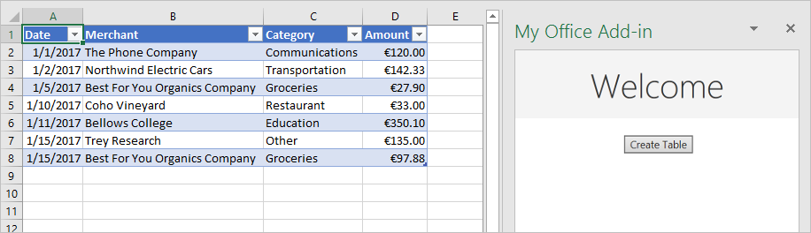

# <a name="tutorial-create-an-excel-task-pane-add-in"></a>Tutorial: criar um suplemento do painel de tarefas no Excel

Neste tutorial: você criará um suplemento do painel de tarefas no Excel

> [!div class="checklist"]
> * Cria uma tabela
> * Filtra e classifica uma tabela
> * Cria um gráfico
> * Congela um cabeçalho de tabela
> * Protege uma planilha
> * Abre uma caixa de diálogo

> [!TIP]
> Se você já concluiu o inicio rápido do [Criar um suplemento do painel de tarefas no Excel](../quickstarts/excel-quickstart-jquery.md) usando o gerador Yeoman e deseja usar esse projeto como ponto de partida para este tutorial, vá diretamente para a seção [Criar uma tabela](#create-a-table) para iniciar este tutorial.

## <a name="prerequisites"></a>Pré-requisitos

[!include[Yeoman generator prerequisites](../includes/quickstart-yo-prerequisites.md)]

## <a name="create-your-add-in-project"></a>Criar seu projeto do suplemento

[!include[Yeoman generator create project guidance](../includes/yo-office-command-guidance.md)]

- **Escolha o tipo de projeto:** `Office Add-in Task Pane project`
- **Escolha o tipo de script:** `Javascript`
- **Qual será o nome do suplemento?** `My Office Add-in`
- **Você gostaria de proporcionar suporte para qual aplicativo cliente do Office?** `Excel`


Depois que você concluir o assistente, o gerador criará o projeto e instalará os componentes Node de suporte.

[!include[Yeoman generator next steps](../includes/yo-office-next-steps.md)]

## <a name="create-a-table"></a>Criar uma tabela

Nesta etapa do tutorial, você testará no programa se o suplemento é compatível com a versão atual do Excel do usuário, adicionará uma tabela a uma planilha, depois preencherá e formatará a tabela com os dados.

### <a name="code-the-add-in"></a>Codificação do suplemento

1. Abra o projeto em seu editor de código.

2. Abra o arquivo **./src/taskpane/taskpane.html**.  Ele contém a marcação HTML para o painel de tarefas.

3. Localize o elemento `<main>` e exclua todas as linhas que aparecem após a marca de abertura `<main>` e antes da marca de fechamento `</main>`.

4. Adicione a seguinte marcação imediatamente após a marca de abertura `<main>`:

    ```html
    <button class="ms-Button" id="create-table">Create Table</button><br/><br/>
    ```

5. Abra o arquivo **./src/taskpane/taskpane.js**. Este arquivo contém o código da API JavaScript do Office que facilita a interação entre o painel de tarefas e o aplicativo do cliente Office.

6. Remova todas as referências ao botão `run` e à função `run()` da seguinte forma:

    - Localize e exclua a linha `document.getElementById("run").onclick = run;`.

    - Localize e exclua toda a função `run()`.

7. Na chamada do método `Office.onReady`, localize a linha `if (info.host === Office.HostType.Excel) {` e adicione o seguinte código imediatamente após ela. Observação:

    - a primeira parte desse código determina se a versão do usuário do Excel é compatível com uma versão do Excel.js que inclui todas as APIs que esta série de tutoriais usará. Em um suplemento de produção, use o corpo do bloco condicional para ocultar ou desabilitar a interface do usuário que chame a APIs sem suporte. Dessa forma, permitirá que o usuário ainda use as partes do suplemento às quais a versão do Excel dá suporte.

    - A segunda parte desse código adiciona um manipulador de eventos para o botão `create-table`.

    ```js
    // Determine if the user's version of Office supports all the Office.js APIs that are used in the tutorial.
    if (!Office.context.requirements.isSetSupported('ExcelApi', '1.7')) {
        console.log('Sorry. The tutorial add-in uses Excel.js APIs that are not available in your version of Office.');
    }

    // Assign event handlers and other initialization logic.
    document.getElementById("create-table").onclick = createTable;
    ```

8. Adicione a seguinte função ao final do arquivo. Observação:

    - A lógica de negócios de Excel.js será adicionada à função que passar por `Excel.run`. Essa lógica não é executada imediatamente. Em vez disso, ela é adicionada à fila de comandos pendentes.

    - O método `context.sync` envia todos os comandos da fila para execução no Excel.

    - `Excel.run` é seguido por um bloco `catch`. Essa é uma prática recomendada que você sempre deve seguir. 

    ```js
    function createTable() {
        Excel.run(function (context) {

            // TODO1: Queue table creation logic here.

            // TODO2: Queue commands to populate the table with data.

            // TODO3: Queue commands to format the table.

            return context.sync();
        })
        .catch(function (error) {
            console.log("Error: " + error);
            if (error instanceof OfficeExtension.Error) {
                console.log("Debug info: " + JSON.stringify(error.debugInfo));
            }
        });
    }
    ```

9. Na função `createTable()`, substitua `TODO1` pelo código a seguir. Observação:

    - O código cria uma tabela usando o método `add` da coleção de tabelas de uma planilha, que sempre existe, mesmo que esteja vazia. Essa é a maneira padrão em que os objetos Excel.js são criados. Não há APIs de construtor de classe e você nunca usa um operador `new` para criar um objeto do Excel. Em vez disso, você adiciona a um objeto de coleção pai.

    - O primeiro parâmetro do método `add` é o intervalo apenas da linha superior da tabela, e não de todo o intervalo que a tabela por fim usará. Isso ocorre porque quando o suplemento preenche as linhas de dados (na próxima etapa), ele adiciona novas linhas à tabela em vez de gravar valores nas células das linhas existentes. Esse é um padrão comum, porque o número de linhas que uma tabela terá geralmente é desconhecido quando a tabela é criada.

    - Os nomes de tabelas devem ser exclusivos pela pasta de trabalho inteira, não só na planilha.

    ```js
    var currentWorksheet = context.workbook.worksheets.getActiveWorksheet();
    var expensesTable = currentWorksheet.tables.add("A1:D1", true /*hasHeaders*/);
    expensesTable.name = "ExpensesTable";
    ```

10. Na função `createTable()`, substitua `TODO2` pelo código a seguir. Observação:

    - Os valores das células de um intervalo são definidos em uma matriz de matrizes.

    - Novas linhas são criadas em uma tabela ao chamar o método `add` do conjunto de linhas da tabela. Você pode adicionar várias linhas em uma única chamada de `add` ao incluir várias matrizes de valores de células na matriz pai que é passada como segundo parâmetro.

    ```js
    expensesTable.getHeaderRowRange().values =
        [["Date", "Merchant", "Category", "Amount"]];

    expensesTable.rows.add(null /*add at the end*/, [
        ["1/1/2017", "The Phone Company", "Communications", "120"],
        ["1/2/2017", "Northwind Electric Cars", "Transportation", "142.33"],
        ["1/5/2017", "Best For You Organics Company", "Groceries", "27.9"],
        ["1/10/2017", "Coho Vineyard", "Restaurant", "33"],
        ["1/11/2017", "Bellows College", "Education", "350.1"],
        ["1/15/2017", "Trey Research", "Other", "135"],
        ["1/15/2017", "Best For You Organics Company", "Groceries", "97.88"]
    ]);
    ```

11. Na função `createTable()`, substitua `TODO3` pelo código a seguir. Observação:

    - O código recebe uma referência para a coluna **quantidade** ao passar o índice com base em zero para o método `getItemAt` do conjunto de colunas da tabela.

        > [!NOTE]
        > Os objetos do conjunto Excel.js, como `TableCollection`, `WorksheetCollection`, e `TableColumnCollection`, têm a propriedade `items` que é como uma matriz dos tipos de objetos filhos, como `Table` ou `Worksheet` ou `TableColumn`; mas um objeto `*Collection` não é uma matriz.

    - O código formata o intervalo da coluna **quantidade** como Euros com um segundo decimal. 

    - Por fim, isso garante que a largura das colunas e a altura das linhas sejam grandes o suficiente para o maior (ou o mais alto) item de dados. Observe que o código deve receber os objetos `Range` a formatar. Os objetos `TableColumn` e `TableRow` não têm propriedades de formato.

    ```js
    expensesTable.columns.getItemAt(3).getRange().numberFormat = [['\u20AC#,##0.00']];
    expensesTable.getRange().format.autofitColumns();
    expensesTable.getRange().format.autofitRows();
    ```

12. Verifique se você salvou todas as alterações feitas no projeto.

### <a name="test-the-add-in"></a>Testar o suplemento

1. Conclua as etapas a seguir para iniciar o servidor Web local e fazer o sideload do seu suplemento.

    > [!NOTE]
    > Os Suplementos do Office devem usar HTTPS, e não HTTP, mesmo durante o desenvolvimento. Se você for solicitado a instalar um certificado após executar um dos seguintes comandos, aceite a solicitação para instalar o certificado que o gerador do Yeoman fornecer.

    > [!TIP]
    > Se você estiver testando seu suplemento no Mac, execute o seguinte comando no diretório raiz do seu projeto antes de continuar. O servidor Web local é iniciado quando este comando é executado.
    >
    > ```command&nbsp;line
    > npm run dev-server
    > ```

    - Para testar o seu suplemento no Excel, execute o seguinte comando no diretório raiz do projeto. Isso inicia o servidor Web local (caso ainda não esteja em execução) e abre o Excel com o suplemento carregado.

        ```command&nbsp;line
        npm start
        ```

    - Para testar seu suplemento no Excel na Web, execute o seguinte comando no diretório raiz do seu projeto. Quando você executar este comando, o servidor da Web local será iniciado (se ainda não estiver em execução).

        ```command&nbsp;line
        npm run start:web
        ```

        Para usar o seu suplemento, abra um novo documento no Excel na Web e em seguida realize o sideload no suplemento de acordo com as instruções em [Realizar Sideload nos Suplementos do Office no Office na Web](../testing/sideload-office-add-ins-for-testing.md#sideload-an-office-add-in-in-office-on-the-web).

2. No Excel, escolha a guia **Página Inicial** e o botão **Mostrar Painel de Tarefas** na faixa de opções para abrir o painel de tarefas do suplemento.

    

3. No painel de tarefas, escolha o botão **Criar tabela**.

    

## <a name="filter-and-sort-a-table"></a>Filtrar e classificar uma tabela

Nesta etapa do tutorial, você vai filtrar e classificar a tabela que criou anteriormente.

### <a name="filter-the-table"></a>Filtrar a tabela

1. Abra o arquivo **./src/taskpane/taskpane.html**.

2. Localize o elemento `<button>` para o botão `create-table` e adicione a seguinte marcação após essa linha:

    ```html
    <button class="ms-Button" id="filter-table">Filter Table</button><br/><br/>
    ```

3. Abra o arquivo **./src/taskpane/taskpane.js**.

4. Na chamada do método `Office.onReady`, localize a linha que atribui um manipulador de cliques ao botão `create-table` e adicione o seguinte código após ela:

    ```js
    document.getElementById("filter-table").onclick = filterTable;
    ```

5. Adicione a seguinte função ao final do arquivo:

    ```js
    function filterTable() {
        Excel.run(function (context) {

            // TODO1: Queue commands to filter out all expense categories except
            //        Groceries and Education.

            return context.sync();
        })
        .catch(function (error) {
            console.log("Error: " + error);
            if (error instanceof OfficeExtension.Error) {
                console.log("Debug info: " + JSON.stringify(error.debugInfo));
            }
        });
    }
    ```

6. Na função `filterTable()`, substitua `TODO1` pelo código a seguir. Observação:

   - O código primeiro faz referência à coluna que precisa de filtragem ao passar o nome da coluna para o método `getItem`, em vez de passar o índice para o método `getItemAt` como o método `createTable` faz. Como os usuários podem mover as colunas da tabela, a coluna de um determinado índice pode mudar depois da criação da tabela. Portanto, é mais seguro usar o nome da coluna como referência dela. Usamos de forma segura `getItemAt` em um tutorial anterior porque usamos o mesmo método que cria a tabela. Assim não existe a chance de um usuário mover a coluna.

   - O método `applyValuesFilter` é um dos vários métodos de filtragem do objeto `Filter`.

    ```js
    var currentWorksheet = context.workbook.worksheets.getActiveWorksheet();
    var expensesTable = currentWorksheet.tables.getItem('ExpensesTable');
    var categoryFilter = expensesTable.columns.getItem('Category').filter;
    categoryFilter.applyValuesFilter(['Education', 'Groceries']);
    ``` 

### <a name="sort-the-table"></a>Classificar a tabela

1. Abra o arquivo **./src/taskpane/taskpane.html**.

2. Localize o elemento `<button>` para o botão `filter-table` e adicione a seguinte marcação após essa linha: 

    ```html
    <button class="ms-Button" id="sort-table">Sort Table</button><br/><br/>
    ```

3. Abra o arquivo **./src/taskpane/taskpane.js**.

4. Na chamada do método `Office.onReady`, localize a linha que atribui um manipulador de cliques ao botão `filter-table` e adicione o seguinte código após ela:

    ```js
    document.getElementById("sort-table").onclick = sortTable;
    ```

5. Adicione a seguinte função ao final do arquivo:

    ```js
    function sortTable() {
        Excel.run(function (context) {

            // TODO1: Queue commands to sort the table by Merchant name.

            return context.sync();
        })
        .catch(function (error) {
            console.log("Error: " + error);
            if (error instanceof OfficeExtension.Error) {
                console.log("Debug info: " + JSON.stringify(error.debugInfo));
            }
        });
    }
    ```

6. Na função `sortTable()`, substitua `TODO1` pelo código a seguir. Observação:

   - O código cria uma matriz de objetos `SortField`, que possui apenas um membro, pois o suplemento é classificado apenas na coluna Merchant.

   - A propriedade `key` de um objeto `SortField` é o índice baseado em zero da coluna usada para classificação. As linhas da tabela são classificadas com base nos valores da coluna referenciada.

   - O membro `sort` de uma `Table` é um objeto `TableSort`, não um método. Os `SortField`s são passados para o método `apply` do objeto `TableSort`.

    ```js
    var currentWorksheet = context.workbook.worksheets.getActiveWorksheet();
    var expensesTable = currentWorksheet.tables.getItem('ExpensesTable');
    var sortFields = [
        {
            key: 1,            // Merchant column
            ascending: false,
        }
    ];

    expensesTable.sort.apply(sortFields);
    ```

7. Verifique se você salvou todas as alterações feitas no projeto.

### <a name="test-the-add-in"></a>Testar o suplemento

1. [!include[Start server and sideload add-in instructions](../includes/tutorial-excel-start-server.md)]

2. Se o painel de tarefas do suplemento ainda não estiver aberto no Excel, vá para a guia **Página Inicial** e escolha o botão **Mostrar Painel de Tarefas** na faixa de opções para abri-lo.

3. Se a tabela que você adicionou anteriormente neste tutorial não estiver presente na planilha aberta, escolha o botão **Criar tabela** no painel de tarefas.

4. Escolha os botões **Filtrar Tabela** e **Classificar Tabela**, em qualquer ordem.

    

## <a name="create-a-chart"></a>Criar um gráfico

Nesta etapa do tutorial, você vai criar um gráfico com dados da tabela que você criou anteriormente e depois vai formatar o gráfico.

### <a name="chart-a-chart-using-table-data"></a>Gráfico de um gráfico com dados de tabela

1. Abra o arquivo **./src/taskpane/taskpane.html**.

2. Localize o elemento `<button>` para o botão `sort-table` e adicione a seguinte marcação após essa linha: 

    ```html
    <button class="ms-Button" id="create-chart">Create Chart</button><br/><br/>
    ```

3. Abra o arquivo **./src/taskpane/taskpane.js**.

4. Na chamada do método `Office.onReady`, localize a linha que atribui um manipulador de cliques ao botão `sort-table` e adicione o seguinte código após ela:

    ```js
    document.getElementById("create-chart").onclick = createChart;
    ```

5. Adicione a seguinte função ao final do arquivo:

    ```js
    function createChart() {
        Excel.run(function (context) {

            // TODO1: Queue commands to get the range of data to be charted.

            // TODO2: Queue command to create the chart and define its type.

            // TODO3: Queue commands to position and format the chart.

            return context.sync();
        })
        .catch(function (error) {
            console.log("Error: " + error);
            if (error instanceof OfficeExtension.Error) {
                console.log("Debug info: " + JSON.stringify(error.debugInfo));
            }
        });
    }
    ```

6. Na função `createChart()`, substitua `TODO1` pelo código a seguir. Para excluir a linha de cabeçalho, o código usa o método `Table.getDataBodyRange` para acessar o intervalo de dados que você deseja representar graficamente em vez do método `getRange`.

    ```js
    var currentWorksheet = context.workbook.worksheets.getActiveWorksheet();
    var expensesTable = currentWorksheet.tables.getItem('ExpensesTable');
    var dataRange = expensesTable.getDataBodyRange();
    ```

7. Na função `createChart()`, substitua `TODO2` pelo código a seguir. Observe os seguintes parâmetros:

   - O primeiro parâmetro para o método `add` especifica o tipo de gráfico. Há diversos tipos.

   - O segundo parâmetro especifica um intervalo de dados a incluir no gráfico.

   - O terceiro parâmetro determina se uma série de pontos de dados da tabela deve estar representada por linha ou por coluna. A opção `auto` informa ao Excel para decidir o melhor método.

    ```js
    var chart = currentWorksheet.charts.add('ColumnClustered', dataRange, 'auto');
    ```

8. Na função `createChart()`, substitua `TODO3` pelo código a seguir. A maior parte do código é autoexplicativa. Observação:
   
   - Os parâmetros do método `setPosition` especificam as células da esquerda superior e da direita inferior da área da planilha que deve conter o gráfico. O Excel ajusta detalhes como a largura da linha para criar uma boa aparência para o gráfico no espaço fornecido.
   
   - “Série” é um conjunto de pontos de dados de uma coluna da tabela. Como há apenas uma coluna sem cadeia de caracteres na tabela, o Excel deduz que essa é a única coluna de pontos de dados no gráfico. Ele interpreta outra colunas como rótulos do gráfico. Portanto, haverá apenas uma série no gráfico e será necessário o índice 0. Ele será rotulado como “Valor em &euro;”.

    ```js
    chart.setPosition("A15", "F30");
    chart.title.text = "Expenses";
    chart.legend.position = "right"
    chart.legend.format.fill.setSolidColor("white");
    chart.dataLabels.format.font.size = 15;
    chart.dataLabels.format.font.color = "black";
    chart.series.getItemAt(0).name = 'Value in &euro;';
    ```

9. Verifique se você salvou todas as alterações feitas no projeto.

### <a name="test-the-add-in"></a>Testar o suplemento

1. [!include[Start server and sideload add-in instructions](../includes/tutorial-excel-start-server.md)]

2. Se o painel de tarefas do suplemento ainda não estiver aberto no Excel, vá para a guia **Página Inicial** e escolha o botão **Mostrar Painel de Tarefas** na faixa de opções para abri-lo.

3. Se a tabela que você adicionou anteriormente neste tutorial não estiver presente na planilha aberta, escolha o botão **Criar tabela** e depois os botões **Filtrar Tabela** e **Classificar Tabela**, em qualquer ordem.

4. Clique no botão **Criar gráfico**. Um gráfico é criado e incluirá somente os dados das linhas que foram filtradas. Os rótulos dos pontos de dados na parte inferior estão na ordem de classificação do gráfico, ou seja, nomes de comerciantes em ordem alfabética inversa.

    

## <a name="freeze-a-table-header"></a>Congelar um cabeçalho de tabela

Quando uma tabela for longa o suficiente para que um usuário precise rolar para ver algumas linhas, a linha de cabeçalho poderá ficar fora da vista. Nesta etapa do tutorial, você precisará congelar a linha do cabeçalho da tabela que criou anteriormente para que ela permaneça visível, mesmo que o usuário role ao longo da planilha.

### <a name="freeze-the-tables-header-row"></a>Congelar a linha de cabeçalho da tabela

1. Abra o arquivo **./src/taskpane/taskpane.html**.

2. Localize o elemento `<button>` para o botão `create-chart` e adicione a seguinte marcação após essa linha: 

    ```html
    <button class="ms-Button" id="freeze-header">Freeze Header</button><br/><br/>
    ```

3. Abra o arquivo **./src/taskpane/taskpane.js**.

4. Na chamada do método `Office.onReady`, localize a linha que atribui um manipulador de cliques ao botão `create-chart` e adicione o seguinte código após ela:

    ```js
    document.getElementById("freeze-header").onclick = freezeHeader;
    ```

5. Adicione a seguinte função ao final do arquivo:

    ```js
    function freezeHeader() {
        Excel.run(function (context) {

            // TODO1: Queue commands to keep the header visible when the user scrolls.

            return context.sync();
        })
        .catch(function (error) {
            console.log("Error: " + error);
            if (error instanceof OfficeExtension.Error) {
                console.log("Debug info: " + JSON.stringify(error.debugInfo));
            }
        });
    }
    ```

6. Na função `freezeHeader()`, substitua `TODO1` pelo código a seguir. Observação:

   - A coleção `Worksheet.freezePanes` é um conjunto de painéis da planilha que fica congelado ou fixado no mesmo lugar quando rolamos a planilha.

   - O método `freezeRows` usa como parâmetro o número de linhas, a partir do topo, que devem ser fixadas no lugar. Passamos `1` para fixar a primeira linha no lugar.

    ```js
    var currentWorksheet = context.workbook.worksheets.getActiveWorksheet();
    currentWorksheet.freezePanes.freezeRows(1);
    ```

7. Verifique se você salvou todas as alterações feitas no projeto.

### <a name="test-the-add-in"></a>Testar o suplemento

1. [!include[Start server and sideload add-in instructions](../includes/tutorial-excel-start-server.md)]

2. Se o painel de tarefas do suplemento ainda não estiver aberto no Excel, vá para a guia **Página Inicial** e escolha o botão **Mostrar Painel de Tarefas** na faixa de opções para abri-lo.

3. Se a tabela que você adicionou anteriormente neste tutorial estiver presente na planilha, faça a exclusão dela.

4. No painel de tarefas, escolha o botão **Criar tabela**.

5. No painel de tarefas, escolha o botão **Congelar Cabeçalho**.

6. Role a planilha para baixo o suficiente para ver que o cabeçalho da tabela permanece visível na parte superior mesmo ao rolar até que as primeiras linhas fiquem fora da vista.

    

## <a name="protect-a-worksheet"></a>Proteger uma planilha

Nesta etapa do tutorial, você adicionará um botão à faixa de opções que ativa ou desativa a proteção da planilha.

### <a name="configure-the-manifest-to-add-a-second-ribbon-button"></a>Configure o manifesto para adicionar um segundo botão à faixa de opções

1. Abra o arquivo de manifesto **./manifest.xml**.

2. Localize o elemento `<Control>`. Esse elemento define o botão **Mostrar Painel de Tarefas** na faixa de opções **Início** que você usa para iniciar o suplemento. Vamos adicionar um segundo botão ao mesmo grupo na faixa de opções **Início**. Entre a marca de fechamento `</Control>` e a marca de fechamento`</Group>`, adicione a marcação a seguir.

    ```xml
    <Control xsi:type="Button" id="<!--TODO1: Unique (in manifest) name for button -->">
        <Label resid="<!--TODO2: Button label -->" />
        <Supertip>            
            <Title resid="<!-- TODO3: Button tool tip title -->" />
            <Description resid="<!-- TODO4: Button tool tip description -->" />
        </Supertip>
        <Icon>
            <bt:Image size="16" resid="Icon.16x16"/>
            <bt:Image size="32" resid="Icon.32x32"/>
            <bt:Image size="80" resid="Icon.80x80"/>
        </Icon>
        <Action xsi:type="<!-- TODO5: Specify the type of action-->">
            <!-- TODO6: Identify the function.-->
        </Action>
    </Control>
    ```

3. No XML que você acabou de adicionar ao arquivo de manifesto, substitua `TODO1` por uma sequência que forneça ao botão um ID exclusivo nesse arquivo de manifesto. Como nosso botão ativará ou desativará a proteção da planilha, use "ToggleProtection". Quando você terminar, a marca de abertura para o elemento `Control` deverá ficar assim:

    ```xml
    <Control xsi:type="Button" id="ToggleProtection">
    ```

4. Os próximos três `TODO`s definem IDs de recurso ou `resid`s. Um recurso é uma cadeia de caracteres e você criará essas três cadeias de caracteres em uma etapa posterior. Por enquanto, você precisa fornecer IDs aos recursos. O rótulo do botão deve ser "Toggle Protection", mas o *ID* dessa cadeia de caracteres deve ser "ProtectionButtonLabel", para que o elemento `Label` fique assim:

    ```xml
    <Label resid="ProtectionButtonLabel" />
    ```

5. O elemento `SuperTip` define a dica de ferramenta do botão. O título da dica de ferramenta deve ser o mesmo que o rótulo do botão, por isso, usamos a mesma ID de recurso: "ProtectionButtonLabel". A descrição da dica de ferramenta será "Click to turn protection of the worksheet on and off". Mas o `resid` será "ProtectionButtonToolTip". Portanto, quando você terminar, o elemento `SuperTip` deverá ficar assim: 

    ```xml
    <Supertip>            
        <Title resid="ProtectionButtonLabel" />
        <Description resid="ProtectionButtonToolTip" />
    </Supertip>
    ```

   > [!NOTE] 
   > Em um suplemento de produção,não é recomendável usar o mesmo ícone para dois botões diferentes; mas, para simplificar este tutorial, faremos isso. Portanto, a marcação `Icon` em nosso novo `Control` é apenas uma cópia do elemento `Icon` do `Control` existente. 

6. O elemento `Action` dentro do elemento original `Control` tem seu tipo definido como `ShowTaskpane`, mas nosso novo botão não abre um painel de tarefas; ele executará uma função personalizada criada em uma etapa posterior. Portanto, substitua `TODO5` por `ExecuteFunction`, que é o tipo de ação para botões que acionam funções personalizadas. A marca de abertura para o elemento `Action` deve ficar assim:
 
    ```xml
    <Action xsi:type="ExecuteFunction">
    ```

7. O elemento `Action` original tem elementos filhos que especificam uma ID do painel de tarefas e uma URL da página que deve ser aberta no painel de tarefas. No entanto, um elemento `Action` do tipo `ExecuteFunction` tem um único elemento filho que nomeia a função executada pelo controle. Você criará essa função em uma etapa posterior e ela será chamada de `toggleProtection`. Então, substitua `TODO6` pela marcação a seguir:
 
    ```xml
    <FunctionName>toggleProtection</FunctionName>
    ```

    A marcação `Control` inteira deve ter a aparência a seguir:

    ```xml
    <Control xsi:type="Button" id="ToggleProtection">
        <Label resid="ProtectionButtonLabel" />
        <Supertip>            
            <Title resid="ProtectionButtonLabel" />
            <Description resid="ProtectionButtonToolTip" />
        </Supertip>
        <Icon>
            <bt:Image size="16" resid="Icon.16x16"/>
            <bt:Image size="32" resid="Icon.32x32"/>
            <bt:Image size="80" resid="Icon.80x80"/>
        </Icon>
        <Action xsi:type="ExecuteFunction">
           <FunctionName>toggleProtection</FunctionName>
        </Action>
    </Control>
    ```

8. Role para baixo até a seção `Resources` do manifesto.

9. Adicione a seguinte marcação como filho do elemento `bt:ShortStrings`.

    ```xml
    <bt:String id="ProtectionButtonLabel" DefaultValue="Toggle Worksheet Protection" />
    ```

10. Adicione a seguinte marcação como filho do elemento `bt:LongStrings`.

    ```xml
    <bt:String id="ProtectionButtonToolTip" DefaultValue="Click to protect or unprotect the current worksheet." />
    ```

11. Salve o arquivo.

### <a name="create-the-function-that-protects-the-sheet"></a>Criar a função que protege a planilha

1. Abra o arquivo **.\commands\commands.js**.

2. Adicione a seguinte função imediatamente após a função `action`. Especificamos um parâmetro `args` para a função, e a última linha da função chama `args.completed`. Esse é um requisito para todos os comandos de suplemento do tipo **ExecuteFunction**. Ele sinaliza para o aplicativo do cliente Office que a função terminou e que a interface do usuário podem ficar responsiva novamente.

    ```js
    function toggleProtection(args) {
        Excel.run(function (context) {
            
            // TODO1: Queue commands to reverse the protection status of the current worksheet.

            return context.sync();
        })
        .catch(function (error) {
            console.log("Error: " + error);
            if (error instanceof OfficeExtension.Error) {
                console.log("Debug info: " + JSON.stringify(error.debugInfo));
            }
        });
        args.completed();
    }
    ```

3. Adicione a seguinte linha ao final do arquivo:

    ```js
    g.toggleProtection = toggleProtection;
    ```

4. Na função `toggleProtection`, substitua `TODO1` pelo código a seguir. O código usa propriedade de proteção do objeto de planilha em um padrão de botão de alternância padrão. O `TODO2` será explicado na próxima seção.

    ```js
    var sheet = context.workbook.worksheets.getActiveWorksheet();

    // TODO2: Queue command to load the sheet's "protection.protected" property from
    //        the document and re-synchronize the document and task pane.

    if (sheet.protection.protected) {
        sheet.protection.unprotect();
    } else {
        sheet.protection.protect();
    }
    ``` 

### <a name="add-code-to-fetch-document-properties-into-the-task-panes-script-objects"></a>Adicione código para buscar propriedades do documento em objetos de script do painel de tarefas

Em cada função criada neste tutorial até agora, você enfileirou comandos para *gravar* no documento do Office. Cada função terminou com uma chamada para o método `context.sync()`, que envia os comandos em fila para o documento a ser executado. No entanto, o código que você adicionou na última etapa chama o `sheet.protection.protected property`. Essa é uma diferença significativa das funções anteriores que você escreveu, porque o objeto `sheet` é apenas um objeto proxy que existe no script do painel de tarefas. O objeto proxy não conhece o estado real de proteção do documento, portanto, sua propriedade `protection.protected` não pode ter um valor real. Para evitar um erro de exceção, você deve primeiro buscar o status de proteção do documento e usá-lo para definir o valor de`sheet.protection.protected`. Esse processo de busca tem três etapas:

   1. Coloque em fila um comando para carregar (ou seja, fetch) as propriedades que seu código precisa ler.

   2. Chame o método `sync` do objeto de contexto para enviar o comando em fila para o documento para execução e retornar as informações solicitadas.

   3. Como o método `sync` é assíncrono, certifique-se de que ele tenha sido concluído antes que o código chame as propriedades que foram buscadas.

Essas etapas devem ser concluídas sempre que seu código precisar *ler* informações do documento do Office.

1. Na função `toggleProtection`, substitua `TODO2` pelo código a seguir. Observação:
   
   - Todos os objetos do Excel têm um método `load`. Especifique as propriedades do objeto que você deseja ler no parâmetro como uma cadeia de caracteres de nomes delimitados por vírgulas. Nesse caso, a propriedade que você precisa ler é uma subpropriedade de `protection`. Referencie a subpropriedade quase exatamente como você faria em qualquer lugar do seu código, mas usando uma barra (“/”) em vez de um ponto (".").

   - Para garantir que a lógica de botão de alternância, `sheet.protection.protected`, não seja executada até após `sync` ser concluído e o `sheet.protection.protected` ser atribuída ao valor correto buscado no documento, ele será movido (na próxima etapa) para uma função `then` que não será executada até `sync` ser concluído. 

    ```js
    sheet.load('protection/protected');
    return context.sync()
        .then(
            function() {
                // TODO3: Move the queued toggle logic here.
            }
        )
        // TODO4: Move the final call of `context.sync` here and ensure that it
        //        does not run until the toggle logic has been queued.
    ``` 

2. Você não pode ter duas instruções `return` no mesmo caminho de código sem ramificações, portanto, exclua a linha final `return context.sync();` no final de `Excel.run`. Você adicionará um novo `context.sync` final em uma etapa posterior.

3. Recorte a estrutura `if ... else` na função `toggleProtection` e a cole no lugar de `TODO3`.

4. Substitua `TODO4` pelo código a seguir. Observação:

   - Passar o método `sync` para uma função `then` garante que ele não seja executado até que `sheet.protection.unprotect()` ou `sheet.protection.protect()` seja enfileirado.

   - O método `then` invoca qualquer função que é passada para ele e não é recomendável que `sync` seja chamado duas vezes, portanto, remova os “()” do fim de `context.sync`.

    ```js
    .then(context.sync);
    ```

   Quando terminar, a função inteira deve se parecer com o seguinte:

    ```js
    function toggleProtection(args) {
        Excel.run(function (context) {            
          var sheet = context.workbook.worksheets.getActiveWorksheet();          
          sheet.load('protection/protected');

          return context.sync()
              .then(
                  function() {
                    if (sheet.protection.protected) {
                        sheet.protection.unprotect();
                    } else {
                        sheet.protection.protect();
                    }
                  }
              )
              .then(context.sync);
        })
        .catch(function (error) {
            console.log("Error: " + error);
            if (error instanceof OfficeExtension.Error) {
                console.log("Debug info: " + JSON.stringify(error.debugInfo));
            }
        });
        args.completed();
    }
    ```

5. Verifique se você salvou todas as alterações feitas no projeto.

### <a name="test-the-add-in"></a>Testar o suplemento

1. Feche todos os aplicativos do Office, incluindo o Excel.

2. Exclua o cache do Office excluindo os conteúdos (todos os arquivos e subpastas) da pasta em cache. Isso é necessário para limpar totalmente a versão anterior do suplemento do

    - No Windows: `%LOCALAPPDATA%\Microsoft\Office\16.0\Wef\`.

    - No Mac: `~/Library/Containers/com.Microsoft.OsfWebHost/Data/`.
    
        > [!NOTE]
        > Se essa pasta não existir, verifique as seguintes pastas. Se encontrada, exclua o conteúdo da pasta:
        >    - `~/Library/Containers/com.microsoft.{host}/Data/Library/Caches/` onde `{host}` é o aplicativo do Office (por exemplo, `Excel`)
        >    - `~/Library/Containers/com.microsoft.{host}/Data/Library/Application Support/Microsoft/Office/16.0/Wef/` onde `{host}` é o aplicativo do Office (por exemplo, `Excel`)
        >    - `com.microsoft.Office365ServiceV2/Data/Caches/com.microsoft.Office365ServiceV2/`
        >    - `com.microsoft.Office365ServiceV2/Data/Library/Caches/com.microsoft.Office365ServiceV2/`

3. Se o servidor da Web local já estiver em execução, feche a janela de comando do nó para interrompê-lo.

4. Como o arquivo de manifesto foi atualizado, você deve carregar o suplemento novamente usando esse arquivo. Inicie o servidor Web local e realize o sideload no seu suplemento: 

    - Para testar o seu suplemento no Excel, execute o seguinte comando no diretório raiz do projeto. Isso inicia o servidor Web local (caso ainda não esteja em execução) e abre o Excel com o suplemento carregado.

        ```command&nbsp;line
        npm start
        ```

    - Para testar seu suplemento no Excel na Web, execute o seguinte comando no diretório raiz do seu projeto. Quando você executar este comando, o servidor da Web local será iniciado (se ainda não estiver em execução).

        ```command&nbsp;line
        npm run start:web
        ```

        Para usar o seu suplemento, abra um novo documento no Excel na Web e em seguida realize o sideload no suplemento de acordo com as instruções em [Realizar Sideload nos Suplementos do Office no Office na Web](../testing/sideload-office-add-ins-for-testing.md#sideload-an-office-add-in-in-office-on-the-web).

5. Na guia **Página Inicial** no Excel, escolha o botão **Proteger Planilha**. A maioria dos controles da faixa de opções está desabilitada e esmaecida, como mostra a captura de tela a seguir. 

    

6. Escolha uma célula como se quisesse alterar o conteúdo. O Excel exibe uma mensagem de erro indicando que a planilha está protegida.

7. Escolha o botão **Proteger Planilha** novamente. Os controles são reabilitados, e você pode alterar os valores das células novamente.

## <a name="open-a-dialog"></a>Abrir uma caixa de diálogo

Nesta etapa final do tutorial, você abre uma caixa de diálogo no suplemento, passa uma mensagem do processo de caixa de diálogo para o processo de painel de tarefas e fecha a caixa de diálogo. As caixas de diálogo do Suplemento do Office são *não modais*: o usuário pode continuar a interagir com o documento no aplicativo do Office e com a página host no painel de tarefas.

### <a name="create-the-dialog-page"></a>Crie a página da caixa de diálogo

1. Na pasta **./src** localizada na raiz do projeto, crie uma pasta chamada **dialogs**.

2. Na pasta **./src/dialogs**, crie um novo arquivo chamado **popup.html**.

3. Adicione a seguinte marcação a **popup.html**. Observação:

   - A página possui um campo `<input>` onde o usuário digitará seu nome e um botão que enviará esse nome para o painel de tarefas em que será exibido.

   - a marcação carrega um script chamado **popup.js** que você criará em uma etapa posterior.

   - Ela também carrega a biblioteca Office.js porque esta será usada em **popup.js**.

    ```html
    <!DOCTYPE html>
    <html>
        <head lang="en">
            <title>Dialog for My Office Add-in</title>
            <meta charset="UTF-8">
            <meta name="viewport" content="width=device-width, initial-scale=1">

            <!-- For more information on Office UI Fabric, visit https://developer.microsoft.com/fabric. -->
            <link rel="stylesheet" href="https://static2.sharepointonline.com/files/fabric/office-ui-fabric-core/9.6.1/css/fabric.min.css"/>

            <script type="text/javascript" src="https://appsforoffice.microsoft.com/lib/1/hosted/office.js"></script>
            <script type="text/javascript" src="popup.js"></script>

        </head>
        <body style="display:flex;flex-direction:column;align-items:center;justify-content:center">
            <p class="ms-font-xl">ENTER YOUR NAME</p>
            <input id="name-box" type="text"/><br/><br/>
            <button id="ok-button" class="ms-Button">OK</button>
        </body>
    </html>
    ```

4. Na pasta **./src/dialogs**, crie um arquivo chamado **popup.js**.

5. Adicione o código a seguir a **popup.js**. Observe o seguinte sobre este código:

   - *Todas as páginas que chamam APIs na biblioteca Office.JS devem primeiro garantir que a biblioteca tenha sido totalmente inicializada.* A melhor maneira de fazer isso é chamando o método `Office.onReady()`. Se o suplemento possuir as próprias tarefas de inicialização, o código deverá ser colocado em um método `then()` encadeado à chamada de `Office.onReady()`. A chamada de `Office.onReady()` deve ser executada antes de qualquer chamada para Office.js; por isso, a tarefa se encontra em um arquivo de script que é carregado pela página, como neste caso.

    ```js
    (function () {
    "use strict";

        Office.onReady()
            .then(function() {

                // TODO1: Assign handler to the OK button.

            });

        // TODO2: Create the OK button handler

    }());
    ```

6. Substitua `TODO1` pelo código a seguir. Você criará a função `sendStringToParentPage` na próxima etapa.

    ```js
    document.getElementById("ok-button").onclick = sendStringToParentPage;
    ```

7. Substitua `TODO2` pelo código a seguir. O método `messageParent` passa seu parâmetro para a página pai, neste caso, a página no painel de tarefas. O parâmetro pode ser um booliano ou uma cadeia de caracteres, que inclui tudo o que pode ser serializado como uma cadeia de caracteres, como XML ou JSON.

    ```js
    function sendStringToParentPage() {
        var userName = document.getElementById("name-box").value;
        Office.context.ui.messageParent(userName);
    }
    ```

> [!NOTE]
> O arquivo **popup.html** e o arquivo **popup.js** que ele carrega são executados em um processo totalmente separado do Microsoft Edge ou do Internet Explorer 11 no painel de tarefas do suplemento. Se o **popup.js** foi transcompilado no mesmo arquivo **bundle.js** que o arquivo **app.js**, o suplemento precisará carregar duas cópias do arquivo **bundle.js**, o que anula o propósito do agrupamento. Portanto, esse suplemento não transcompila o arquivo **popup.js**.

### <a name="update-webpack-config-settings"></a>Atualizar as configurações webpack config

Abra o arquivo **webpack.config.js** no diretório raiz do projeto e conclua as seguintes etapas.

1. Localize o objeto `entry` dentro do objeto `config` e adicione uma nova entrada para `popup`.

    ```js
    popup: "./src/dialogs/popup.js"
    ```

    Após fazer isso, o novo objeto `entry` ficará assim:

    ```js
    entry: {
      polyfill: "@babel/polyfill",
      taskpane: "./src/taskpane/taskpane.js",
      commands: "./src/commands/commands.js",
      popup: "./src/dialogs/popup.js"
    },
    ```
  
2. Localize a matriz `plugins` no objeto `config` e adicione o seguinte objeto ao final dela.

    ```js
    new HtmlWebpackPlugin({
      filename: "popup.html",
      template: "./src/dialogs/popup.html",
      chunks: ["polyfill", "popup"]
    })
    ```

    Após fazer isso, a nova matriz `plugins` ficará assim:

    ```js
    plugins: [
      new CleanWebpackPlugin(),
      new HtmlWebpackPlugin({
        filename: "taskpane.html",
        template: "./src/taskpane/taskpane.html",
        chunks: ['polyfill', 'taskpane']
      }),
      new CopyWebpackPlugin([
      {
        to: "taskpane.css",
        from: "./src/taskpane/taskpane.css"
      }
      ]),
      new HtmlWebpackPlugin({
        filename: "commands.html",
        template: "./src/commands/commands.html",
        chunks: ["polyfill", "commands"]
      }),
      new HtmlWebpackPlugin({
        filename: "popup.html",
        template: "./src/dialogs/popup.html",
        chunks: ["polyfill", "popup"]
      })
    ],
    ```

3. Se o servidor da Web local estiver em execução, feche a janela de comando do nó para interrompê-lo.

4. Execute o seguinte comando para recriar o projeto.

    ```command&nbsp;line
    npm run build
    ```

### <a name="open-the-dialog-from-the-task-pane"></a>Abra a caixa de diálogo do painel de tarefas

1. Abra o arquivo **./src/taskpane/taskpane.html**.

2. Localize o elemento `<button>` para o botão `freeze-header` e adicione a seguinte marcação após essa linha:

    ```html
    <button class="ms-Button" id="open-dialog">Open Dialog</button><br/><br/>
    ```

3. A caixa de diálogo solicitará que o usuário insira um nome e passará o nome de usuário para o painel de tarefas. O painel de tarefas o exibirá em um rótulo. Imediatamente após o `button` que você adicionou, adicione a marcação a seguir:

    ```html
    <label id="user-name"></label><br/><br/>
    ```

4. Abra o arquivo **./src/taskpane/taskpane.js**.

5. Na chamada do método `Office.onReady`, localize a linha que atribui um manipulador de cliques ao botão `freeze-header` e adicione o seguinte código após ela. Você criará o método `openDialog` em uma etapa posterior.

    ```js
    document.getElementById("open-dialog").onclick = openDialog;
    ```

6. Adicione a seguinte declaração ao final do arquivo: Essa variável é usada para armazenar um objeto no contexto de execução da página pai que atua como um intermediador no contexto de execução da página da caixa de diálogo.

    ```js
    var dialog = null;
    ```

7. Adicione a seguinte função ao final do arquivo, após a declaração de `dialog`. É importante observar o que esse código *não* contém: não há nenhuma chamada de `Excel.run`. Isso ocorre porque a API para abrir uma caixa de diálogo é compartilhada com todos os aplicativos do Office, portanto, ela faz parte da API Comum de JavaScript do Office, não da API específica do Excel.

    ```js
    function openDialog() {
        // TODO1: Call the Office Common API that opens a dialog
    }
    ```

8. Substitua `TODO1` pelo código a seguir. Observação:

   - O método`displayDialogAsync` abre uma caixa de diálogo no centro da tela.

   - O primeiro parâmetro é a URL da página a ser aberta.

   - O segundo parâmetro passa opções. `height` e `width` são porcentagens do tamanho da janela do aplicativo do Office.

    ```js
    Office.context.ui.displayDialogAsync(
        'https://localhost:3000/popup.html',
        {height: 45, width: 55},

        // TODO2: Add callback parameter.
    );
    ```

### <a name="process-the-message-from-the-dialog-and-close-the-dialog"></a>Processar a mensagem da caixa de diálogo e depois fechá-la

1. Na função `openDialog` no arquivo **./src/taskpane/taskpane.js**, substitua `TODO2` pelo código a seguir. Observação:

   - O retorno de chamada é executado imediatamente depois que a caixa de diálogo é aberta com êxito e antes de usuário executar a ação na caixa de diálogo.

   - O `result.value` é o objeto que atua como intermediário entre os contextos de execução das páginas pai e de diálogo.

   - A função `processMessage` será criada em uma etapa posterior. Esse identificador processará os valores que sejam enviados da página da caixa de diálogo com chamadas da função `messageParent`.

    ```js
    function (result) {
        dialog = result.value;
        dialog.addEventHandler(Microsoft.Office.WebExtension.EventType.DialogMessageReceived, processMessage);
    }
    ```

2. Adicione a seguinte função após a função `openDialog`.

    ```js
    function processMessage(arg) {
        document.getElementById("user-name").innerHTML = arg.message;
        dialog.close();
    }
    ```

3. Verifique se você salvou todas as alterações feitas no projeto.

### <a name="test-the-add-in"></a>Testar o suplemento

1. [!include[Start server and sideload add-in instructions](../includes/tutorial-excel-start-server.md)]

2. Se o painel de tarefas do suplemento ainda não estiver aberto no Excel, vá para a guia **Página Inicial** e escolha o botão **Mostrar Painel de Tarefas** na faixa de opções para abri-lo.

3. Escolha o botão **Abrir Caixa de Diálogo** no painel de tarefas.

4. Quando a caixa de diálogo estiver aberta, arraste-a e redimensione-a. Observe que você pode interagir com a planilha e pressionar outros botões no painel de tarefas. No entanto, não é possível iniciar uma segunda caixa de diálogo na mesma página do painel de tarefas.

5. Na caixa de diálogo, digite um nome e escolha o botão **OK**. O nome aparecerá no painel de tarefas e a caixa de diálogo será fechada.

6. Opcionalmente, comente a linha `dialog.close();` na função `processMessage`. Em seguida, repita as etapas desta seção. A caixa de diálogo permanece aberta e você pode alterar o nome. É possível fechá-la manualmente pressionando o botão **X** no canto superior direito.

    

## <a name="next-steps"></a>Próximas etapas

Neste tutorial você criou um suplemento do Excel que interage com tabelas, gráficos, planilhas e caixas de diálogo em uma pasta de trabalho do Excel. Para saber mais sobre o desenvolvimento de suplementos do Excel, continue no seguinte artigo:

> [!div class="nextstepaction"]
> [Visão geral dos suplementos do Excel](../excel/excel-add-ins-overview.md)

## <a name="see-also"></a>Confira também

* [Visão geral da plataforma Suplementos do Office](../overview/office-add-ins.md)
* [Desenvolver Suplementos do Office](../develop/develop-overview.md)
* [Modelo de objeto JavaScript do Excel em Suplementos do Office](../excel/excel-add-ins-core-concepts.md)
