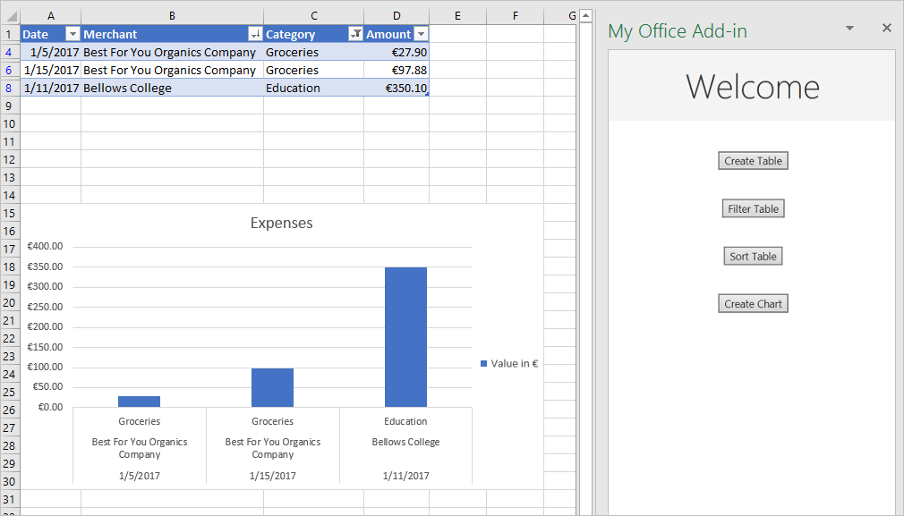

# <a name="tutorial-create-an-excel-task-pane-add-in"></a><span data-ttu-id="3b2e6-103">Tutorial: criar um suplemento do painel de tarefas no Excel</span><span class="sxs-lookup"><span data-stu-id="3b2e6-103">Tutorial: Create an Excel task pane add-in</span></span>

<span data-ttu-id="3b2e6-104">Neste tutorial: você criará um suplemento do painel de tarefas no Excel</span><span class="sxs-lookup"><span data-stu-id="3b2e6-104">In this tutorial, you'll create an Excel task pane add-in that:</span></span>

> [!div class="checklist"]
>
> - <span data-ttu-id="3b2e6-105">Cria uma tabela</span><span class="sxs-lookup"><span data-stu-id="3b2e6-105">Creates a table</span></span>
> - <span data-ttu-id="3b2e6-106">Filtra e classifica uma tabela</span><span class="sxs-lookup"><span data-stu-id="3b2e6-106">Filters and sorts a table</span></span>
> - <span data-ttu-id="3b2e6-107">Cria um gráfico</span><span class="sxs-lookup"><span data-stu-id="3b2e6-107">Creates a chart</span></span>
> - <span data-ttu-id="3b2e6-108">Congela um cabeçalho de tabela</span><span class="sxs-lookup"><span data-stu-id="3b2e6-108">Freezes a table header</span></span>
> - <span data-ttu-id="3b2e6-109">Protege uma planilha</span><span class="sxs-lookup"><span data-stu-id="3b2e6-109">Protects a worksheet</span></span>
> - <span data-ttu-id="3b2e6-110">Abre uma caixa de diálogo</span><span class="sxs-lookup"><span data-stu-id="3b2e6-110">Opens a dialog</span></span>

> [!TIP]
> <span data-ttu-id="3b2e6-111">Se você já concluiu o inicio rápido do [Criar um suplemento do painel de tarefas no Excel](../quickstarts/excel-quickstart-jquery.md) usando o gerador Yeoman e deseja usar esse projeto como ponto de partida para este tutorial, vá diretamente para a seção [Criar uma tabela](#create-a-table) para iniciar este tutorial.</span><span class="sxs-lookup"><span data-stu-id="3b2e6-111">If you've already completed the [Build an Excel task pane add-in](../quickstarts/excel-quickstart-jquery.md) quick start using the Yeoman generator, and want to use that project as a starting point for this tutorial, go directly to the [Create a table](#create-a-table) section to start this tutorial.</span></span>

## <a name="prerequisites"></a><span data-ttu-id="3b2e6-112">Pré-requisitos</span><span class="sxs-lookup"><span data-stu-id="3b2e6-112">Prerequisites</span></span>

[!include[Yeoman generator prerequisites](../includes/quickstart-yo-prerequisites.md)]

## <a name="create-your-add-in-project"></a><span data-ttu-id="3b2e6-113">Criar seu projeto do suplemento</span><span class="sxs-lookup"><span data-stu-id="3b2e6-113">Create your add-in project</span></span>

[!include[Yeoman generator create project guidance](../includes/yo-office-command-guidance.md)]

- <span data-ttu-id="3b2e6-114">**Escolha o tipo de projeto:** `Office Add-in Task Pane project`</span><span class="sxs-lookup"><span data-stu-id="3b2e6-114">**Choose a project type:** `Office Add-in Task Pane project`</span></span>
- <span data-ttu-id="3b2e6-115">**Escolha o tipo de script:** `Javascript`</span><span class="sxs-lookup"><span data-stu-id="3b2e6-115">**Choose a script type:** `Javascript`</span></span>
- <span data-ttu-id="3b2e6-116">**Qual será o nome do suplemento?**</span><span class="sxs-lookup"><span data-stu-id="3b2e6-116">**What do you want to name your add-in?**</span></span> `My Office Add-in`
- <span data-ttu-id="3b2e6-117">**Você gostaria de proporcionar suporte para qual aplicativo cliente do Office?**</span><span class="sxs-lookup"><span data-stu-id="3b2e6-117">**Which Office client application would you like to support?**</span></span> `Excel`


<span data-ttu-id="3b2e6-119">Depois que você concluir o assistente, o gerador criará o projeto e instalará os componentes Node de suporte.</span><span class="sxs-lookup"><span data-stu-id="3b2e6-119">After you complete the wizard, the generator creates the project and installs supporting Node components.</span></span>

[!include[Yeoman generator next steps](../includes/yo-office-next-steps.md)]

## <a name="create-a-table"></a><span data-ttu-id="3b2e6-120">Criar uma tabela</span><span class="sxs-lookup"><span data-stu-id="3b2e6-120">Create a table</span></span>

<span data-ttu-id="3b2e6-121">Nesta etapa do tutorial, você testará no programa se o suplemento é compatível com a versão atual do Excel do usuário, adicionará uma tabela a uma planilha, depois preencherá e formatará a tabela com os dados.</span><span class="sxs-lookup"><span data-stu-id="3b2e6-121">In this step of the tutorial, you'll programmatically test that your add-in supports the user's current version of Excel, add a table to a worksheet, populate the table with data, and format it.</span></span>

### <a name="code-the-add-in"></a><span data-ttu-id="3b2e6-122">Codificação do suplemento</span><span class="sxs-lookup"><span data-stu-id="3b2e6-122">Code the add-in</span></span>

1. <span data-ttu-id="3b2e6-123">Abra o projeto em seu editor de código.</span><span class="sxs-lookup"><span data-stu-id="3b2e6-123">Open the project in your code editor.</span></span>

2. <span data-ttu-id="3b2e6-124">Abra o arquivo **./src/taskpane/taskpane.html**.</span><span class="sxs-lookup"><span data-stu-id="3b2e6-124">Open the file **./src/taskpane/taskpane.html**.</span></span>  <span data-ttu-id="3b2e6-125">Ele contém a marcação HTML para o painel de tarefas.</span><span class="sxs-lookup"><span data-stu-id="3b2e6-125">This file contains the HTML markup for the task pane.</span></span>

3. <span data-ttu-id="3b2e6-126">Localize o elemento `<main>` e exclua todas as linhas que aparecem após a marca de abertura `<main>` e antes da marca de fechamento `</main>`.</span><span class="sxs-lookup"><span data-stu-id="3b2e6-126">Locate the `<main>` element and delete all lines that appear after the opening `<main>` tag and before the closing `</main>` tag.</span></span>

4. <span data-ttu-id="3b2e6-127">Adicione a seguinte marcação imediatamente após a marca de abertura `<main>`:</span><span class="sxs-lookup"><span data-stu-id="3b2e6-127">Add the following markup immediately after the opening `<main>` tag:</span></span>

    ```html
    <button class="ms-Button" id="create-table">Create Table</button><br/><br/>
    ```

5. <span data-ttu-id="3b2e6-128">Abra o arquivo **./src/taskpane/taskpane.js**.</span><span class="sxs-lookup"><span data-stu-id="3b2e6-128">Open the file **./src/taskpane/taskpane.js**.</span></span> <span data-ttu-id="3b2e6-129">Este arquivo contém o código da API JavaScript do Office que facilita a interação entre o painel de tarefas e o aplicativo do cliente Office.</span><span class="sxs-lookup"><span data-stu-id="3b2e6-129">This file contains the Office JavaScript API code that facilitates interaction between the task pane and the Office client application.</span></span>

6. <span data-ttu-id="3b2e6-130">Remova todas as referências ao botão `run` e à função `run()` da seguinte forma:</span><span class="sxs-lookup"><span data-stu-id="3b2e6-130">Remove all references to the `run` button and the `run()` function by doing the following:</span></span>

    - <span data-ttu-id="3b2e6-131">Localize e exclua a linha `document.getElementById("run").onclick = run;`.</span><span class="sxs-lookup"><span data-stu-id="3b2e6-131">Locate and delete the line `document.getElementById("run").onclick = run;`.</span></span>

    - <span data-ttu-id="3b2e6-132">Localize e exclua toda a função `run()`.</span><span class="sxs-lookup"><span data-stu-id="3b2e6-132">Locate and delete the entire `run()` function.</span></span>

7. <span data-ttu-id="3b2e6-133">Na chamada do método `Office.onReady`, localize a linha `if (info.host === Office.HostType.Excel) {` e adicione o seguinte código imediatamente após ela.</span><span class="sxs-lookup"><span data-stu-id="3b2e6-133">Within the `Office.onReady` method call, locate the line `if (info.host === Office.HostType.Excel) {` and add the following code immediately after that line.</span></span> <span data-ttu-id="3b2e6-134">Observação:</span><span class="sxs-lookup"><span data-stu-id="3b2e6-134">Note:</span></span>

    - <span data-ttu-id="3b2e6-135">a primeira parte desse código determina se a versão do usuário do Excel é compatível com uma versão do Excel.js que inclui todas as APIs que esta série de tutoriais usará.</span><span class="sxs-lookup"><span data-stu-id="3b2e6-135">The first part of this code determines whether the user's version of Excel supports a version of Excel.js that includes all the APIs that this series of tutorials will use.</span></span> <span data-ttu-id="3b2e6-136">Em um suplemento de produção, use o corpo do bloco condicional para ocultar ou desabilitar a interface do usuário que chame a APIs sem suporte.</span><span class="sxs-lookup"><span data-stu-id="3b2e6-136">In a production add-in, use the body of the conditional block to hide or disable the UI that would call unsupported APIs.</span></span> <span data-ttu-id="3b2e6-137">Dessa forma, permitirá que o usuário ainda use as partes do suplemento às quais a versão do Excel dá suporte.</span><span class="sxs-lookup"><span data-stu-id="3b2e6-137">This will enable the user to still make use of the parts of the add-in that are supported by their version of Excel.</span></span>

    - <span data-ttu-id="3b2e6-138">A segunda parte desse código adiciona um manipulador de eventos para o botão `create-table`.</span><span class="sxs-lookup"><span data-stu-id="3b2e6-138">The second part of this code adds an event handler for the `create-table` button.</span></span>

    ```js
    // Determine if the user's version of Office supports all the Office.js APIs that are used in the tutorial.
    if (!Office.context.requirements.isSetSupported('ExcelApi', '1.7')) {
        console.log('Sorry. The tutorial add-in uses Excel.js APIs that are not available in your version of Office.');
    }

    // Assign event handlers and other initialization logic.
    document.getElementById("create-table").onclick = createTable;
    ```

8. <span data-ttu-id="3b2e6-139">Adicione a seguinte função ao final do arquivo.</span><span class="sxs-lookup"><span data-stu-id="3b2e6-139">Add the following function to the end of the file.</span></span> <span data-ttu-id="3b2e6-140">Observação:</span><span class="sxs-lookup"><span data-stu-id="3b2e6-140">Note:</span></span>

    - <span data-ttu-id="3b2e6-p106">A lógica de negócios de Excel.js será adicionada à função que passar por `Excel.run`. Essa lógica não é executada imediatamente. Em vez disso, ela é adicionada à fila de comandos pendentes.</span><span class="sxs-lookup"><span data-stu-id="3b2e6-p106">Your Excel.js business logic will be added to the function that is passed to `Excel.run`. This logic does not execute immediately. Instead, it is added to a queue of pending commands.</span></span>

    - <span data-ttu-id="3b2e6-144">O método `context.sync` envia todos os comandos da fila para execução no Excel.</span><span class="sxs-lookup"><span data-stu-id="3b2e6-144">The `context.sync` method sends all queued commands to Excel for execution.</span></span>

    - <span data-ttu-id="3b2e6-p107">`Excel.run` é seguido por um bloco `catch`. Essa é uma prática recomendada que você sempre deve seguir.</span><span class="sxs-lookup"><span data-stu-id="3b2e6-p107">The `Excel.run` is followed by a `catch` block. This is a best practice that you should always follow.</span></span> 

    ```js
    function createTable() {
        Excel.run(function (context) {

            // TODO1: Queue table creation logic here.

            // TODO2: Queue commands to populate the table with data.

            // TODO3: Queue commands to format the table.

            return context.sync();
        })
        .catch(function (error) {
            console.log("Error: " + error);
            if (error instanceof OfficeExtension.Error) {
                console.log("Debug info: " + JSON.stringify(error.debugInfo));
            }
        });
    }
    ```

9. <span data-ttu-id="3b2e6-147">Na função `createTable()`, substitua `TODO1` pelo código a seguir.</span><span class="sxs-lookup"><span data-stu-id="3b2e6-147">Within the `createTable()` function, replace `TODO1` with the following code.</span></span> <span data-ttu-id="3b2e6-148">Observação:</span><span class="sxs-lookup"><span data-stu-id="3b2e6-148">Note:</span></span>

    - <span data-ttu-id="3b2e6-p109">O código cria uma tabela usando o método `add` da coleção de tabelas de uma planilha, que sempre existe, mesmo que esteja vazia. Essa é a maneira padrão em que os objetos Excel.js são criados. Não há APIs de construtor de classe e você nunca usa um operador `new` para criar um objeto do Excel. Em vez disso, você adiciona a um objeto de coleção pai.</span><span class="sxs-lookup"><span data-stu-id="3b2e6-p109">The code creates a table by using the `add` method of a worksheet's table collection, which always exists even if it is empty. This is the standard way that Excel.js objects are created. There are no class constructor APIs, and you never use a `new` operator to create an Excel object. Instead, you add to a parent collection object.</span></span>

    - <span data-ttu-id="3b2e6-p110">O primeiro parâmetro do método `add` é o intervalo apenas da linha superior da tabela, e não de todo o intervalo que a tabela por fim usará. Isso ocorre porque quando o suplemento preenche as linhas de dados (na próxima etapa), ele adiciona novas linhas à tabela em vez de gravar valores nas células das linhas existentes. Esse é um padrão comum, porque o número de linhas que uma tabela terá geralmente é desconhecido quando a tabela é criada.</span><span class="sxs-lookup"><span data-stu-id="3b2e6-p110">The first parameter of the `add` method is the range of only the top row of the table, not the entire range the table will ultimately use. This is because when the add-in populates the data rows (in the next step), it will add new rows to the table instead of writing values to the cells of existing rows. This is a common pattern, because the number of rows a table will have is often unknown when the table is created.</span></span>

    - <span data-ttu-id="3b2e6-156">Os nomes de tabelas devem ser exclusivos pela pasta de trabalho inteira, não só na planilha.</span><span class="sxs-lookup"><span data-stu-id="3b2e6-156">Table names must be unique across the entire workbook, not just the worksheet.</span></span>

    ```js
    var currentWorksheet = context.workbook.worksheets.getActiveWorksheet();
    var expensesTable = currentWorksheet.tables.add("A1:D1", true /*hasHeaders*/);
    expensesTable.name = "ExpensesTable";
    ```

10. <span data-ttu-id="3b2e6-157">Na função `createTable()`, substitua `TODO2` pelo código a seguir.</span><span class="sxs-lookup"><span data-stu-id="3b2e6-157">Within the `createTable()` function, replace `TODO2` with the following code.</span></span> <span data-ttu-id="3b2e6-158">Observação:</span><span class="sxs-lookup"><span data-stu-id="3b2e6-158">Note:</span></span>

    - <span data-ttu-id="3b2e6-159">Os valores das células de um intervalo são definidos em uma matriz de matrizes.</span><span class="sxs-lookup"><span data-stu-id="3b2e6-159">The cell values of a range are set with an array of arrays.</span></span>

    - <span data-ttu-id="3b2e6-p112">Novas linhas são criadas em uma tabela ao chamar o método `add` do conjunto de linhas da tabela. Você pode adicionar várias linhas em uma única chamada de `add` ao incluir várias matrizes de valores de células na matriz pai que é passada como segundo parâmetro.</span><span class="sxs-lookup"><span data-stu-id="3b2e6-p112">New rows are created in a table by calling the `add` method of the table's row collection. You can add multiple rows in a single call of `add` by including multiple cell value arrays in the parent array that is passed as the second parameter.</span></span>

    ```js
    expensesTable.getHeaderRowRange().values =
        [["Date", "Merchant", "Category", "Amount"]];

    expensesTable.rows.add(null /*add at the end*/, [
        ["1/1/2017", "The Phone Company", "Communications", "120"],
        ["1/2/2017", "Northwind Electric Cars", "Transportation", "142.33"],
        ["1/5/2017", "Best For You Organics Company", "Groceries", "27.9"],
        ["1/10/2017", "Coho Vineyard", "Restaurant", "33"],
        ["1/11/2017", "Bellows College", "Education", "350.1"],
        ["1/15/2017", "Trey Research", "Other", "135"],
        ["1/15/2017", "Best For You Organics Company", "Groceries", "97.88"]
    ]);
    ```

11. <span data-ttu-id="3b2e6-162">Na função `createTable()`, substitua `TODO3` pelo código a seguir.</span><span class="sxs-lookup"><span data-stu-id="3b2e6-162">Within the `createTable()` function, replace `TODO3` with the following code.</span></span> <span data-ttu-id="3b2e6-163">Observação:</span><span class="sxs-lookup"><span data-stu-id="3b2e6-163">Note:</span></span>

    - <span data-ttu-id="3b2e6-164">O código recebe uma referência para a coluna **quantidade** ao passar o índice com base em zero para o método `getItemAt` do conjunto de colunas da tabela.</span><span class="sxs-lookup"><span data-stu-id="3b2e6-164">The code gets a reference to the **Amount** column by passing its zero-based index to the `getItemAt` method of the table's column collection.</span></span>

        > [!NOTE]
        > <span data-ttu-id="3b2e6-165">Os objetos do conjunto Excel.js, como `TableCollection`, `WorksheetCollection`, e `TableColumnCollection`, têm a propriedade `items` que é como uma matriz dos tipos de objetos filhos, como `Table` ou `Worksheet` ou `TableColumn`; mas um objeto `*Collection` não é uma matriz.</span><span class="sxs-lookup"><span data-stu-id="3b2e6-165">Excel.js collection objects, such as `TableCollection`, `WorksheetCollection`, and `TableColumnCollection` have an `items` property that is an array of the child object types, such as `Table` or `Worksheet` or `TableColumn`; but a `*Collection` object is not itself an array.</span></span>

    - <span data-ttu-id="3b2e6-166">O código formata o intervalo da coluna **quantidade** como Euros com um segundo decimal.</span><span class="sxs-lookup"><span data-stu-id="3b2e6-166">The code then formats the range of the **Amount** column as Euros to the second decimal.</span></span>

    - <span data-ttu-id="3b2e6-p114">Por fim, isso garante que a largura das colunas e a altura das linhas sejam grandes o suficiente para o maior (ou o mais alto) item de dados. Observe que o código deve receber os objetos `Range` a formatar. Os objetos `TableColumn` e `TableRow` não têm propriedades de formato.</span><span class="sxs-lookup"><span data-stu-id="3b2e6-p114">Finally, it ensures that the width of the columns and height of the rows is big enough to fit the longest (or tallest) data item. Notice that the code must get `Range` objects to format. `TableColumn` and `TableRow` objects do not have format properties.</span></span>

    ```js
    expensesTable.columns.getItemAt(3).getRange().numberFormat = [['\u20AC#,##0.00']];
    expensesTable.getRange().format.autofitColumns();
    expensesTable.getRange().format.autofitRows();
    ```

12. <span data-ttu-id="3b2e6-170">Verifique se você salvou todas as alterações feitas no projeto.</span><span class="sxs-lookup"><span data-stu-id="3b2e6-170">Verify that you've saved all of the changes you've made to the project.</span></span>

### <a name="test-the-add-in"></a><span data-ttu-id="3b2e6-171">Testar o suplemento</span><span class="sxs-lookup"><span data-stu-id="3b2e6-171">Test the add-in</span></span>

1. <span data-ttu-id="3b2e6-172">Conclua as etapas a seguir para iniciar o servidor Web local e fazer o sideload do seu suplemento.</span><span class="sxs-lookup"><span data-stu-id="3b2e6-172">Complete the following steps to start the local web server and sideload your add-in.</span></span>

    > [!NOTE]
    > <span data-ttu-id="3b2e6-173">Os Suplementos do Office devem usar HTTPS, e não HTTP, mesmo durante o desenvolvimento.</span><span class="sxs-lookup"><span data-stu-id="3b2e6-173">Office Add-ins should use HTTPS, not HTTP, even when you are developing.</span></span> <span data-ttu-id="3b2e6-174">Se você for solicitado a instalar um certificado após executar um dos seguintes comandos, aceite a solicitação para instalar o certificado que o gerador do Yeoman fornecer.</span><span class="sxs-lookup"><span data-stu-id="3b2e6-174">If you are prompted to install a certificate after you run one of the following commands, accept the prompt to install the certificate that the Yeoman generator provides.</span></span>

    > [!TIP]
    > <span data-ttu-id="3b2e6-175">Se você estiver testando seu suplemento no Mac, execute o seguinte comando no diretório raiz do seu projeto antes de continuar.</span><span class="sxs-lookup"><span data-stu-id="3b2e6-175">If you're testing your add-in on Mac, run the following command in the root directory of your project before proceeding.</span></span> <span data-ttu-id="3b2e6-176">O servidor Web local é iniciado quando este comando é executado.</span><span class="sxs-lookup"><span data-stu-id="3b2e6-176">When you run this command, the local web server starts.</span></span>
    >
    > ```command&nbsp;line
    > npm run dev-server
    > ```

    - <span data-ttu-id="3b2e6-177">Para testar o seu suplemento no Excel, execute o seguinte comando no diretório raiz do projeto.</span><span class="sxs-lookup"><span data-stu-id="3b2e6-177">To test your add-in in Excel, run the following command in the root directory of your project.</span></span> <span data-ttu-id="3b2e6-178">Isso inicia o servidor Web local (caso ainda não esteja em execução) e abre o Excel com o suplemento carregado.</span><span class="sxs-lookup"><span data-stu-id="3b2e6-178">This starts the local web server (if it's not already running) and opens Excel with your add-in loaded.</span></span>

        ```command&nbsp;line
        npm start
        ```

    - <span data-ttu-id="3b2e6-179">Para testar seu suplemento no Excel na Web, execute o seguinte comando no diretório raiz do seu projeto.</span><span class="sxs-lookup"><span data-stu-id="3b2e6-179">To test your add-in in Excel on the web, run the following command in the root directory of your project.</span></span> <span data-ttu-id="3b2e6-180">Quando você executar este comando, o servidor da Web local será iniciado (se ainda não estiver em execução).</span><span class="sxs-lookup"><span data-stu-id="3b2e6-180">When you run this command, the local web server will start (if it's not already running).</span></span>

        ```command&nbsp;line
        npm run start:web
        ```

        <span data-ttu-id="3b2e6-181">Para usar o seu suplemento, abra um novo documento no Excel na Web e em seguida realize o sideload no suplemento de acordo com as instruções em [Realizar Sideload nos Suplementos do Office no Office na Web](../testing/sideload-office-add-ins-for-testing.md#sideload-an-office-add-in-in-office-on-the-web).</span><span class="sxs-lookup"><span data-stu-id="3b2e6-181">To use your add-in, open a new document in Excel on the web and then sideload your add-in by following the instructions in [Sideload Office Add-ins in Office on the web](../testing/sideload-office-add-ins-for-testing.md#sideload-an-office-add-in-in-office-on-the-web).</span></span>

2. <span data-ttu-id="3b2e6-182">No Excel, escolha a guia **Página Inicial** e o botão **Mostrar Painel de Tarefas** na faixa de opções para abrir o painel de tarefas do suplemento.</span><span class="sxs-lookup"><span data-stu-id="3b2e6-182">In Excel, choose the **Home** tab, and then choose the **Show Taskpane** button in the ribbon to open the add-in task pane.</span></span>

    

3. <span data-ttu-id="3b2e6-184">No painel de tarefas, escolha o botão **Criar tabela**.</span><span class="sxs-lookup"><span data-stu-id="3b2e6-184">In the task pane, choose the **Create Table** button.</span></span>

    

## <a name="filter-and-sort-a-table"></a><span data-ttu-id="3b2e6-186">Filtrar e classificar uma tabela</span><span class="sxs-lookup"><span data-stu-id="3b2e6-186">Filter and sort a table</span></span>

<span data-ttu-id="3b2e6-187">Nesta etapa do tutorial, você vai filtrar e classificar a tabela que criou anteriormente.</span><span class="sxs-lookup"><span data-stu-id="3b2e6-187">In this step of the tutorial, you'll filter and sort the table that you created previously.</span></span>

### <a name="filter-the-table"></a><span data-ttu-id="3b2e6-188">Filtrar a tabela</span><span class="sxs-lookup"><span data-stu-id="3b2e6-188">Filter the table</span></span>

1. <span data-ttu-id="3b2e6-189">Abra o arquivo **./src/taskpane/taskpane.html**.</span><span class="sxs-lookup"><span data-stu-id="3b2e6-189">Open the file **./src/taskpane/taskpane.html**.</span></span>

2. <span data-ttu-id="3b2e6-190">Localize o elemento `<button>` para o botão `create-table` e adicione a seguinte marcação após essa linha:</span><span class="sxs-lookup"><span data-stu-id="3b2e6-190">Locate the `<button>` element for the `create-table` button, and add the following markup after that line:</span></span>

    ```html
    <button class="ms-Button" id="filter-table">Filter Table</button><br/><br/>
    ```

3. <span data-ttu-id="3b2e6-191">Abra o arquivo **./src/taskpane/taskpane.js**.</span><span class="sxs-lookup"><span data-stu-id="3b2e6-191">Open the file **./src/taskpane/taskpane.js**.</span></span>

4. <span data-ttu-id="3b2e6-192">Na chamada do método `Office.onReady`, localize a linha que atribui um manipulador de cliques ao botão `create-table` e adicione o seguinte código após ela:</span><span class="sxs-lookup"><span data-stu-id="3b2e6-192">Within the `Office.onReady` method call, locate the line that assigns a click handler to the `create-table` button, and add the following code after that line:</span></span>

    ```js
    document.getElementById("filter-table").onclick = filterTable;
    ```

5. <span data-ttu-id="3b2e6-193">Adicione a seguinte função ao final do arquivo:</span><span class="sxs-lookup"><span data-stu-id="3b2e6-193">Add the following function to the end of the file:</span></span>

    ```js
    function filterTable() {
        Excel.run(function (context) {

            // TODO1: Queue commands to filter out all expense categories except
            //        Groceries and Education.

            return context.sync();
        })
        .catch(function (error) {
            console.log("Error: " + error);
            if (error instanceof OfficeExtension.Error) {
                console.log("Debug info: " + JSON.stringify(error.debugInfo));
            }
        });
    }
    ```

6. <span data-ttu-id="3b2e6-194">Na função `filterTable()`, substitua `TODO1` pelo código a seguir.</span><span class="sxs-lookup"><span data-stu-id="3b2e6-194">Within the `filterTable()` function, replace `TODO1` with the following code.</span></span> <span data-ttu-id="3b2e6-195">Observação:</span><span class="sxs-lookup"><span data-stu-id="3b2e6-195">Note:</span></span>

   - <span data-ttu-id="3b2e6-p120">O código primeiro faz referência à coluna que precisa de filtragem ao passar o nome da coluna para o método `getItem`, em vez de passar o índice para o método `getItemAt` como o método `createTable` faz. Como os usuários podem mover as colunas da tabela, a coluna de um determinado índice pode mudar depois da criação da tabela. Portanto, é mais seguro usar o nome da coluna como referência dela. Usamos de forma segura `getItemAt` em um tutorial anterior porque usamos o mesmo método que cria a tabela. Assim não existe a chance de um usuário mover a coluna.</span><span class="sxs-lookup"><span data-stu-id="3b2e6-p120">The code first gets a reference to the column that needs filtering by passing the column name to the `getItem` method, instead of passing its index to the `getItemAt` method as the `createTable` method does. Since users can move table columns, the column at a given index might change after the table is created. Hence, it is safer to use the column name to get a reference to the column. We used `getItemAt` safely in the preceding tutorial, because we used it in the very same method that creates the table, so there is no chance that a user has moved the column.</span></span>

   - <span data-ttu-id="3b2e6-200">O método `applyValuesFilter` é um dos vários métodos de filtragem do objeto `Filter`.</span><span class="sxs-lookup"><span data-stu-id="3b2e6-200">The `applyValuesFilter` method is one of several filtering methods on the `Filter` object.</span></span>

    ```js
    var currentWorksheet = context.workbook.worksheets.getActiveWorksheet();
    var expensesTable = currentWorksheet.tables.getItem('ExpensesTable');
    var categoryFilter = expensesTable.columns.getItem('Category').filter;
    categoryFilter.applyValuesFilter(['Education', 'Groceries']);
    ```

### <a name="sort-the-table"></a><span data-ttu-id="3b2e6-201">Classificar a tabela</span><span class="sxs-lookup"><span data-stu-id="3b2e6-201">Sort the table</span></span>

1. <span data-ttu-id="3b2e6-202">Abra o arquivo **./src/taskpane/taskpane.html**.</span><span class="sxs-lookup"><span data-stu-id="3b2e6-202">Open the file **./src/taskpane/taskpane.html**.</span></span>

2. <span data-ttu-id="3b2e6-203">Localize o elemento `<button>` para o botão `filter-table` e adicione a seguinte marcação após essa linha:</span><span class="sxs-lookup"><span data-stu-id="3b2e6-203">Locate the `<button>` element for the `filter-table` button, and add the following markup after that line:</span></span>

    ```html
    <button class="ms-Button" id="sort-table">Sort Table</button><br/><br/>
    ```

3. <span data-ttu-id="3b2e6-204">Abra o arquivo **./src/taskpane/taskpane.js**.</span><span class="sxs-lookup"><span data-stu-id="3b2e6-204">Open the file **./src/taskpane/taskpane.js**.</span></span>

4. <span data-ttu-id="3b2e6-205">Na chamada do método `Office.onReady`, localize a linha que atribui um manipulador de cliques ao botão `filter-table` e adicione o seguinte código após ela:</span><span class="sxs-lookup"><span data-stu-id="3b2e6-205">Within the `Office.onReady` method call, locate the line that assigns a click handler to the `filter-table` button, and add the following code after that line:</span></span>

    ```js
    document.getElementById("sort-table").onclick = sortTable;
    ```

5. <span data-ttu-id="3b2e6-206">Adicione a seguinte função ao final do arquivo:</span><span class="sxs-lookup"><span data-stu-id="3b2e6-206">Add the following function to the end of the file:</span></span>

    ```js
    function sortTable() {
        Excel.run(function (context) {

            // TODO1: Queue commands to sort the table by Merchant name.

            return context.sync();
        })
        .catch(function (error) {
            console.log("Error: " + error);
            if (error instanceof OfficeExtension.Error) {
                console.log("Debug info: " + JSON.stringify(error.debugInfo));
            }
        });
    }
    ```

6. <span data-ttu-id="3b2e6-207">Na função `sortTable()`, substitua `TODO1` pelo código a seguir.</span><span class="sxs-lookup"><span data-stu-id="3b2e6-207">Within the `sortTable()` function, replace `TODO1` with the following code.</span></span> <span data-ttu-id="3b2e6-208">Observação:</span><span class="sxs-lookup"><span data-stu-id="3b2e6-208">Note:</span></span>

   - <span data-ttu-id="3b2e6-209">O código cria uma matriz de objetos `SortField`, que possui apenas um membro, pois o suplemento é classificado apenas na coluna Merchant.</span><span class="sxs-lookup"><span data-stu-id="3b2e6-209">The code creates an array of `SortField` objects, which has just one member since the add-in only sorts on the Merchant column.</span></span>

   - <span data-ttu-id="3b2e6-210">A propriedade `key` de um objeto `SortField` é o índice baseado em zero da coluna usada para classificação.</span><span class="sxs-lookup"><span data-stu-id="3b2e6-210">The `key` property of a `SortField` object is the zero-based index of the column used for sorting.</span></span> <span data-ttu-id="3b2e6-211">As linhas da tabela são classificadas com base nos valores da coluna referenciada.</span><span class="sxs-lookup"><span data-stu-id="3b2e6-211">The rows of the table are sorted based on the values in the referenced column.</span></span>

   - <span data-ttu-id="3b2e6-212">O membro `sort` de uma `Table` é um objeto `TableSort`, não um método.</span><span class="sxs-lookup"><span data-stu-id="3b2e6-212">The `sort` member of a `Table` is a `TableSort` object, not a method.</span></span> <span data-ttu-id="3b2e6-213">Os `SortField`s são passados para o método `apply` do objeto `TableSort`.</span><span class="sxs-lookup"><span data-stu-id="3b2e6-213">The `SortField`s are passed to the `TableSort` object's `apply` method.</span></span>

    ```js
    var currentWorksheet = context.workbook.worksheets.getActiveWorksheet();
    var expensesTable = currentWorksheet.tables.getItem('ExpensesTable');
    var sortFields = [
        {
            key: 1,            // Merchant column
            ascending: false,
        }
    ];

    expensesTable.sort.apply(sortFields);
    ```

7. <span data-ttu-id="3b2e6-214">Verifique se você salvou todas as alterações feitas no projeto.</span><span class="sxs-lookup"><span data-stu-id="3b2e6-214">Verify that you've saved all of the changes you've made to the project.</span></span>

### <a name="test-the-add-in"></a><span data-ttu-id="3b2e6-215">Testar o suplemento</span><span class="sxs-lookup"><span data-stu-id="3b2e6-215">Test the add-in</span></span>

1. [!include[Start server and sideload add-in instructions](../includes/tutorial-excel-start-server.md)]

2. <span data-ttu-id="3b2e6-216">Se o painel de tarefas do suplemento ainda não estiver aberto no Excel, vá para a guia **Página Inicial** e escolha o botão **Mostrar Painel de Tarefas** na faixa de opções para abri-lo.</span><span class="sxs-lookup"><span data-stu-id="3b2e6-216">If the add-in task pane isn't already open in Excel, go to the **Home** tab and choose the **Show Taskpane** button in the ribbon to open it.</span></span>

3. <span data-ttu-id="3b2e6-217">Se a tabela que você adicionou anteriormente neste tutorial não estiver presente na planilha aberta, escolha o botão **Criar tabela** no painel de tarefas.</span><span class="sxs-lookup"><span data-stu-id="3b2e6-217">If the table you added previously in this tutorial is not present in the open worksheet, choose the **Create Table** button in the task pane.</span></span>

4. <span data-ttu-id="3b2e6-218">Escolha os botões **Filtrar Tabela** e **Classificar Tabela**, em qualquer ordem.</span><span class="sxs-lookup"><span data-stu-id="3b2e6-218">Choose the **Filter Table** button and the **Sort Table** button, in either order.</span></span>

    

## <a name="create-a-chart"></a><span data-ttu-id="3b2e6-220">Criar um gráfico</span><span class="sxs-lookup"><span data-stu-id="3b2e6-220">Create a chart</span></span>

<span data-ttu-id="3b2e6-221">Nesta etapa do tutorial, você vai criar um gráfico com dados da tabela que você criou anteriormente e depois vai formatar o gráfico.</span><span class="sxs-lookup"><span data-stu-id="3b2e6-221">In this step of the tutorial, you'll create a chart using data from the table that you created previously, and then format the chart.</span></span>

### <a name="chart-a-chart-using-table-data"></a><span data-ttu-id="3b2e6-222">Gráfico de um gráfico com dados de tabela</span><span class="sxs-lookup"><span data-stu-id="3b2e6-222">Chart a chart using table data</span></span>

1. <span data-ttu-id="3b2e6-223">Abra o arquivo **./src/taskpane/taskpane.html**.</span><span class="sxs-lookup"><span data-stu-id="3b2e6-223">Open the file **./src/taskpane/taskpane.html**.</span></span>

2. <span data-ttu-id="3b2e6-224">Localize o elemento `<button>` para o botão `sort-table` e adicione a seguinte marcação após essa linha:</span><span class="sxs-lookup"><span data-stu-id="3b2e6-224">Locate the `<button>` element for the `sort-table` button, and add the following markup after that line:</span></span> 

    ```html
    <button class="ms-Button" id="create-chart">Create Chart</button><br/><br/>
    ```

3. <span data-ttu-id="3b2e6-225">Abra o arquivo **./src/taskpane/taskpane.js**.</span><span class="sxs-lookup"><span data-stu-id="3b2e6-225">Open the file **./src/taskpane/taskpane.js**.</span></span>

4. <span data-ttu-id="3b2e6-226">Na chamada do método `Office.onReady`, localize a linha que atribui um manipulador de cliques ao botão `sort-table` e adicione o seguinte código após ela:</span><span class="sxs-lookup"><span data-stu-id="3b2e6-226">Within the `Office.onReady` method call, locate the line that assigns a click handler to the `sort-table` button, and add the following code after that line:</span></span>

    ```js
    document.getElementById("create-chart").onclick = createChart;
    ```

5. <span data-ttu-id="3b2e6-227">Adicione a seguinte função ao final do arquivo:</span><span class="sxs-lookup"><span data-stu-id="3b2e6-227">Add the following function to the end of the file:</span></span>

    ```js
    function createChart() {
        Excel.run(function (context) {

            // TODO1: Queue commands to get the range of data to be charted.

            // TODO2: Queue command to create the chart and define its type.

            // TODO3: Queue commands to position and format the chart.

            return context.sync();
        })
        .catch(function (error) {
            console.log("Error: " + error);
            if (error instanceof OfficeExtension.Error) {
                console.log("Debug info: " + JSON.stringify(error.debugInfo));
            }
        });
    }
    ```

6. <span data-ttu-id="3b2e6-228">Na função `createChart()`, substitua `TODO1` pelo código a seguir.</span><span class="sxs-lookup"><span data-stu-id="3b2e6-228">Within the `createChart()` function, replace `TODO1` with the following code.</span></span> <span data-ttu-id="3b2e6-229">Para excluir a linha de cabeçalho, o código usa o método `Table.getDataBodyRange` para acessar o intervalo de dados que você deseja representar graficamente em vez do método `getRange`.</span><span class="sxs-lookup"><span data-stu-id="3b2e6-229">Note that in order to exclude the header row, the code uses the `Table.getDataBodyRange` method to get the range of data you want to chart instead of the `getRange` method.</span></span>

    ```js
    var currentWorksheet = context.workbook.worksheets.getActiveWorksheet();
    var expensesTable = currentWorksheet.tables.getItem('ExpensesTable');
    var dataRange = expensesTable.getDataBodyRange();
    ```

7. <span data-ttu-id="3b2e6-230">Na função `createChart()`, substitua `TODO2` pelo código a seguir.</span><span class="sxs-lookup"><span data-stu-id="3b2e6-230">Within the `createChart()` function, replace `TODO2` with the following code.</span></span> <span data-ttu-id="3b2e6-231">Observe os seguintes parâmetros:</span><span class="sxs-lookup"><span data-stu-id="3b2e6-231">Note the following parameters:</span></span>

   - <span data-ttu-id="3b2e6-p126">O primeiro parâmetro para o método `add` especifica o tipo de gráfico. Há diversos tipos.</span><span class="sxs-lookup"><span data-stu-id="3b2e6-p126">The first parameter to the `add` method specifies the type of chart. There are several dozen types.</span></span>

   - <span data-ttu-id="3b2e6-234">O segundo parâmetro especifica um intervalo de dados a incluir no gráfico.</span><span class="sxs-lookup"><span data-stu-id="3b2e6-234">The second parameter specifies the range of data to include in the chart.</span></span>

   - <span data-ttu-id="3b2e6-235">O terceiro parâmetro determina se uma série de pontos de dados da tabela deve estar representada por linha ou por coluna.</span><span class="sxs-lookup"><span data-stu-id="3b2e6-235">The third parameter determines whether a series of data points from the table should be charted row-wise or column-wise.</span></span> <span data-ttu-id="3b2e6-236">A opção `auto` informa ao Excel para decidir o melhor método.</span><span class="sxs-lookup"><span data-stu-id="3b2e6-236">The option `auto` tells Excel to decide the best method.</span></span>

    ```js
    var chart = currentWorksheet.charts.add('ColumnClustered', dataRange, 'Auto');
    ```

8. <span data-ttu-id="3b2e6-237">Na função `createChart()`, substitua `TODO3` pelo código a seguir.</span><span class="sxs-lookup"><span data-stu-id="3b2e6-237">Within the `createChart()` function, replace `TODO3` with the following code.</span></span> <span data-ttu-id="3b2e6-238">A maior parte do código é autoexplicativa.</span><span class="sxs-lookup"><span data-stu-id="3b2e6-238">Most of this code is self-explanatory.</span></span> <span data-ttu-id="3b2e6-239">Observação:</span><span class="sxs-lookup"><span data-stu-id="3b2e6-239">Note:</span></span>

   - <span data-ttu-id="3b2e6-p129">Os parâmetros do método `setPosition` especificam as células da esquerda superior e da direita inferior da área da planilha que deve conter o gráfico. O Excel ajusta detalhes como a largura da linha para criar uma boa aparência para o gráfico no espaço fornecido.</span><span class="sxs-lookup"><span data-stu-id="3b2e6-p129">The parameters to the `setPosition` method specify the upper left and lower right cells of the worksheet area that should contain the chart. Excel can adjust things like line width to make the chart look good in the space it has been given.</span></span>

   - <span data-ttu-id="3b2e6-p130">“Série” é um conjunto de pontos de dados de uma coluna da tabela. Como há apenas uma coluna sem cadeia de caracteres na tabela, o Excel deduz que essa é a única coluna de pontos de dados no gráfico. Ele interpreta outra colunas como rótulos do gráfico. Portanto, haverá apenas uma série no gráfico e será necessário o índice 0. Ele será rotulado como “Valor em &euro;”.</span><span class="sxs-lookup"><span data-stu-id="3b2e6-p130">A "series" is a set of data points from a column of the table. Since there is only one non-string column in the table, Excel infers that the column is the only column of data points to chart. It interprets the other columns as chart labels. So there will be just one series in the chart and it will have index 0. This is the one to label with "Value in &euro;".</span></span>

    ```js
    chart.setPosition("A15", "F30");
    chart.title.text = "Expenses";
    chart.legend.position = "Right";
    chart.legend.format.fill.setSolidColor("white");
    chart.dataLabels.format.font.size = 15;
    chart.dataLabels.format.font.color = "black";
    chart.series.getItemAt(0).name = 'Value in \u20AC';
    ```

9. <span data-ttu-id="3b2e6-247">Verifique se você salvou todas as alterações feitas no projeto.</span><span class="sxs-lookup"><span data-stu-id="3b2e6-247">Verify that you've saved all of the changes you've made to the project.</span></span>

### <a name="test-the-add-in"></a><span data-ttu-id="3b2e6-248">Testar o suplemento</span><span class="sxs-lookup"><span data-stu-id="3b2e6-248">Test the add-in</span></span>

1. [!include[Start server and sideload add-in instructions](../includes/tutorial-excel-start-server.md)]

2. <span data-ttu-id="3b2e6-249">Se o painel de tarefas do suplemento ainda não estiver aberto no Excel, vá para a guia **Página Inicial** e escolha o botão **Mostrar Painel de Tarefas** na faixa de opções para abri-lo.</span><span class="sxs-lookup"><span data-stu-id="3b2e6-249">If the add-in task pane isn't already open in Excel, go to the **Home** tab and choose the **Show Taskpane** button in the ribbon to open it.</span></span>

3. <span data-ttu-id="3b2e6-250">Se a tabela que você adicionou anteriormente neste tutorial não estiver presente na planilha aberta, escolha o botão **Criar tabela** e depois os botões **Filtrar Tabela** e **Classificar Tabela**, em qualquer ordem.</span><span class="sxs-lookup"><span data-stu-id="3b2e6-250">If the table you added previously in this tutorial is not present in the open worksheet, choose the **Create Table** button, and then the **Filter Table** button and the **Sort Table** button, in either order.</span></span>

4. <span data-ttu-id="3b2e6-p131">Clique no botão **Criar gráfico**. Um gráfico é criado e incluirá somente os dados das linhas que foram filtradas. Os rótulos dos pontos de dados na parte inferior estão na ordem de classificação do gráfico, ou seja, nomes de comerciantes em ordem alfabética inversa.</span><span class="sxs-lookup"><span data-stu-id="3b2e6-p131">Choose the **Create Chart** button. A chart is created and only the data from the rows that have been filtered are included. The labels on the data points across the bottom are in the sort order of the chart; that is, merchant names in reverse alphabetical order.</span></span>

    

## <a name="freeze-a-table-header"></a><span data-ttu-id="3b2e6-255">Congelar um cabeçalho de tabela</span><span class="sxs-lookup"><span data-stu-id="3b2e6-255">Freeze a table header</span></span>

<span data-ttu-id="3b2e6-p132">Quando uma tabela for longa o suficiente para que um usuário precise rolar para ver algumas linhas, a linha de cabeçalho poderá ficar fora da vista. Nesta etapa do tutorial, você precisará congelar a linha do cabeçalho da tabela que criou anteriormente para que ela permaneça visível, mesmo que o usuário role ao longo da planilha.</span><span class="sxs-lookup"><span data-stu-id="3b2e6-p132">When a table is long enough that a user must scroll to see some rows, the header row can scroll out of sight. In this step of the tutorial, you'll freeze the header row of the table that you created previously, so that it remains visible even as the user scrolls down the worksheet.</span></span>

### <a name="freeze-the-tables-header-row"></a><span data-ttu-id="3b2e6-258">Congelar a linha de cabeçalho da tabela</span><span class="sxs-lookup"><span data-stu-id="3b2e6-258">Freeze the table's header row</span></span>

1. <span data-ttu-id="3b2e6-259">Abra o arquivo **./src/taskpane/taskpane.html**.</span><span class="sxs-lookup"><span data-stu-id="3b2e6-259">Open the file **./src/taskpane/taskpane.html**.</span></span>

2. <span data-ttu-id="3b2e6-260">Localize o elemento `<button>` para o botão `create-chart` e adicione a seguinte marcação após essa linha:</span><span class="sxs-lookup"><span data-stu-id="3b2e6-260">Locate the `<button>` element for the `create-chart` button, and add the following markup after that line:</span></span>

    ```html
    <button class="ms-Button" id="freeze-header">Freeze Header</button><br/><br/>
    ```

3. <span data-ttu-id="3b2e6-261">Abra o arquivo **./src/taskpane/taskpane.js**.</span><span class="sxs-lookup"><span data-stu-id="3b2e6-261">Open the file **./src/taskpane/taskpane.js**.</span></span>

4. <span data-ttu-id="3b2e6-262">Na chamada do método `Office.onReady`, localize a linha que atribui um manipulador de cliques ao botão `create-chart` e adicione o seguinte código após ela:</span><span class="sxs-lookup"><span data-stu-id="3b2e6-262">Within the `Office.onReady` method call, locate the line that assigns a click handler to the `create-chart` button, and add the following code after that line:</span></span>

    ```js
    document.getElementById("freeze-header").onclick = freezeHeader;
    ```

5. <span data-ttu-id="3b2e6-263">Adicione a seguinte função ao final do arquivo:</span><span class="sxs-lookup"><span data-stu-id="3b2e6-263">Add the following function to the end of the file:</span></span>

    ```js
    function freezeHeader() {
        Excel.run(function (context) {

            // TODO1: Queue commands to keep the header visible when the user scrolls.

            return context.sync();
        })
        .catch(function (error) {
            console.log("Error: " + error);
            if (error instanceof OfficeExtension.Error) {
                console.log("Debug info: " + JSON.stringify(error.debugInfo));
            }
        });
    }
    ```

6. <span data-ttu-id="3b2e6-264">Na função `freezeHeader()`, substitua `TODO1` pelo código a seguir.</span><span class="sxs-lookup"><span data-stu-id="3b2e6-264">Within the `freezeHeader()` function, replace `TODO1` with the following code.</span></span> <span data-ttu-id="3b2e6-265">Observação:</span><span class="sxs-lookup"><span data-stu-id="3b2e6-265">Note:</span></span>

   - <span data-ttu-id="3b2e6-266">A coleção `Worksheet.freezePanes` é um conjunto de painéis da planilha que fica congelado ou fixado no mesmo lugar quando rolamos a planilha.</span><span class="sxs-lookup"><span data-stu-id="3b2e6-266">The `Worksheet.freezePanes` collection is a set of panes in the worksheet that are pinned, or frozen, in place when the worksheet is scrolled.</span></span>

   - <span data-ttu-id="3b2e6-267">O método `freezeRows` usa como parâmetro o número de linhas, a partir do topo, que devem ser fixadas no lugar.</span><span class="sxs-lookup"><span data-stu-id="3b2e6-267">The `freezeRows` method takes as a parameter the number of rows, from the top, that are to be pinned in place.</span></span> <span data-ttu-id="3b2e6-268">Passamos `1` para fixar a primeira linha no lugar.</span><span class="sxs-lookup"><span data-stu-id="3b2e6-268">We pass `1` to pin the first row in place.</span></span>

    ```js
    var currentWorksheet = context.workbook.worksheets.getActiveWorksheet();
    currentWorksheet.freezePanes.freezeRows(1);
    ```

7. <span data-ttu-id="3b2e6-269">Verifique se você salvou todas as alterações feitas no projeto.</span><span class="sxs-lookup"><span data-stu-id="3b2e6-269">Verify that you've saved all of the changes you've made to the project.</span></span>

### <a name="test-the-add-in"></a><span data-ttu-id="3b2e6-270">Testar o suplemento</span><span class="sxs-lookup"><span data-stu-id="3b2e6-270">Test the add-in</span></span>

1. [!include[Start server and sideload add-in instructions](../includes/tutorial-excel-start-server.md)]

2. <span data-ttu-id="3b2e6-271">Se o painel de tarefas do suplemento ainda não estiver aberto no Excel, vá para a guia **Página Inicial** e escolha o botão **Mostrar Painel de Tarefas** na faixa de opções para abri-lo.</span><span class="sxs-lookup"><span data-stu-id="3b2e6-271">If the add-in task pane isn't already open in Excel, go to the **Home** tab and choose the **Show Taskpane** button in the ribbon to open it.</span></span>

3. <span data-ttu-id="3b2e6-272">Se a tabela que você adicionou anteriormente neste tutorial estiver presente na planilha, faça a exclusão dela.</span><span class="sxs-lookup"><span data-stu-id="3b2e6-272">If the table you added previously in this tutorial is present in the worksheet, delete it.</span></span>

4. <span data-ttu-id="3b2e6-273">No painel de tarefas, escolha o botão **Criar tabela**.</span><span class="sxs-lookup"><span data-stu-id="3b2e6-273">In the task pane, choose the **Create Table** button.</span></span>

5. <span data-ttu-id="3b2e6-274">No painel de tarefas, escolha o botão **Congelar Cabeçalho**.</span><span class="sxs-lookup"><span data-stu-id="3b2e6-274">In the task pane, choose the **Freeze Header** button.</span></span>

6. <span data-ttu-id="3b2e6-275">Role a planilha para baixo o suficiente para ver que o cabeçalho da tabela permanece visível na parte superior mesmo ao rolar até que as primeiras linhas fiquem fora da vista.</span><span class="sxs-lookup"><span data-stu-id="3b2e6-275">Scroll down the worksheet far enough to see that the table header remains visible at the top even when the higher rows scroll out of sight.</span></span>

    

## <a name="protect-a-worksheet"></a><span data-ttu-id="3b2e6-277">Proteger uma planilha</span><span class="sxs-lookup"><span data-stu-id="3b2e6-277">Protect a worksheet</span></span>

<span data-ttu-id="3b2e6-278">Nesta etapa do tutorial, você adicionará um botão à faixa de opções que ativa ou desativa a proteção da planilha.</span><span class="sxs-lookup"><span data-stu-id="3b2e6-278">In this step of the tutorial, you'll add a button to the ribbon that toggles worksheet protection on and off.</span></span>

### <a name="configure-the-manifest-to-add-a-second-ribbon-button"></a><span data-ttu-id="3b2e6-279">Configure o manifesto para adicionar um segundo botão à faixa de opções</span><span class="sxs-lookup"><span data-stu-id="3b2e6-279">Configure the manifest to add a second ribbon button</span></span>

1. <span data-ttu-id="3b2e6-280">Abra o arquivo de manifesto **./manifest.xml**.</span><span class="sxs-lookup"><span data-stu-id="3b2e6-280">Open the manifest file **./manifest.xml**.</span></span>

2. <span data-ttu-id="3b2e6-281">Localize o elemento `<Control>`.</span><span class="sxs-lookup"><span data-stu-id="3b2e6-281">Locate the `<Control>` element.</span></span> <span data-ttu-id="3b2e6-282">Esse elemento define o botão **Mostrar Painel de Tarefas** na faixa de opções **Início** que você usa para iniciar o suplemento.</span><span class="sxs-lookup"><span data-stu-id="3b2e6-282">This element defines the **Show Taskpane** button on the **Home** ribbon you have been using to launch the add-in.</span></span> <span data-ttu-id="3b2e6-283">Vamos adicionar um segundo botão ao mesmo grupo na faixa de opções **Início**.</span><span class="sxs-lookup"><span data-stu-id="3b2e6-283">We're going to add a second button to the same group on the **Home** ribbon.</span></span> <span data-ttu-id="3b2e6-284">Entre a marca de fechamento `</Control>` e a marca de fechamento`</Group>`, adicione a marcação a seguir.</span><span class="sxs-lookup"><span data-stu-id="3b2e6-284">In between the closing `</Control>` tag and the closing `</Group>` tag, add the following markup.</span></span>

    ```xml
    <Control xsi:type="Button" id="<!--TODO1: Unique (in manifest) name for button -->">
        <Label resid="<!--TODO2: Button label -->" />
        <Supertip>
            <Title resid="<!-- TODO3: Button tool tip title -->" />
            <Description resid="<!-- TODO4: Button tool tip description -->" />
        </Supertip>
        <Icon>
            <bt:Image size="16" resid="Icon.16x16"/>
            <bt:Image size="32" resid="Icon.32x32"/>
            <bt:Image size="80" resid="Icon.80x80"/>
        </Icon>
        <Action xsi:type="<!-- TODO5: Specify the type of action-->">
            <!-- TODO6: Identify the function.-->
        </Action>
    </Control>
    ```

3. <span data-ttu-id="3b2e6-285">No XML que você acabou de adicionar ao arquivo de manifesto, substitua `TODO1` por uma sequência que forneça ao botão um ID exclusivo nesse arquivo de manifesto.</span><span class="sxs-lookup"><span data-stu-id="3b2e6-285">Within the XML you just added to the manifest file, replace `TODO1` with a string that gives the button an ID that is unique within this manifest file.</span></span> <span data-ttu-id="3b2e6-286">Como nosso botão ativará ou desativará a proteção da planilha, use "ToggleProtection".</span><span class="sxs-lookup"><span data-stu-id="3b2e6-286">Since our button is going to toggle protection of the worksheet on and off, use "ToggleProtection".</span></span> <span data-ttu-id="3b2e6-287">Quando você terminar, a marca de abertura para o elemento `Control` deverá ficar assim:</span><span class="sxs-lookup"><span data-stu-id="3b2e6-287">When you are done, the opening tag for the `Control` element should look like this:</span></span>

    ```xml
    <Control xsi:type="Button" id="ToggleProtection">
    ```

4. <span data-ttu-id="3b2e6-288">Os próximos três `TODO`s definem IDs de recurso ou `resid`s.</span><span class="sxs-lookup"><span data-stu-id="3b2e6-288">The next three `TODO`s set resource IDs, or `resid`s.</span></span> <span data-ttu-id="3b2e6-289">Um recurso é uma cadeia de caracteres (com um comprimento máximo de 32 caracteres), e você cria essas três cadeias em uma etapa posterior.</span><span class="sxs-lookup"><span data-stu-id="3b2e6-289">A resource is a string (with a maximum length of 32 characters), and you'll create these three strings in a later step.</span></span> <span data-ttu-id="3b2e6-290">Por enquanto, você precisa fornecer IDs aos recursos.</span><span class="sxs-lookup"><span data-stu-id="3b2e6-290">For now, you need to give IDs to the resources.</span></span> <span data-ttu-id="3b2e6-291">O rótulo do botão deve ser "Toggle Protection", mas o *ID* dessa cadeia de caracteres deve ser "ProtectionButtonLabel", para que o elemento `Label` fique assim:</span><span class="sxs-lookup"><span data-stu-id="3b2e6-291">The button label should read "Toggle Protection", but the *ID* of this string should be "ProtectionButtonLabel", so the `Label` element should look like this:</span></span>

    ```xml
    <Label resid="ProtectionButtonLabel" />
    ```

5. <span data-ttu-id="3b2e6-292">O elemento `SuperTip` define a dica de ferramenta do botão.</span><span class="sxs-lookup"><span data-stu-id="3b2e6-292">The `SuperTip` element defines the tool tip for the button.</span></span> <span data-ttu-id="3b2e6-293">O título da dica de ferramenta deve ser o mesmo que o rótulo do botão, por isso, usamos a mesma ID de recurso: "ProtectionButtonLabel".</span><span class="sxs-lookup"><span data-stu-id="3b2e6-293">The tool tip title should be the same as the button label, so we use the very same resource ID: "ProtectionButtonLabel".</span></span> <span data-ttu-id="3b2e6-294">A descrição da dica de ferramenta será "Click to turn protection of the worksheet on and off".</span><span class="sxs-lookup"><span data-stu-id="3b2e6-294">The tool tip description will be "Click to turn protection of the worksheet on and off".</span></span> <span data-ttu-id="3b2e6-295">Mas o `resid` será "ProtectionButtonToolTip".</span><span class="sxs-lookup"><span data-stu-id="3b2e6-295">But the `resid` should be "ProtectionButtonToolTip".</span></span> <span data-ttu-id="3b2e6-296">Portanto, quando você terminar, o elemento `SuperTip` deverá ficar assim:</span><span class="sxs-lookup"><span data-stu-id="3b2e6-296">So, when you are done, the `SuperTip` element should look like this:</span></span>

    ```xml
    <Supertip>
        <Title resid="ProtectionButtonLabel" />
        <Description resid="ProtectionButtonToolTip" />
    </Supertip>
    ```

   > [!NOTE]
   > <span data-ttu-id="3b2e6-p139">Em um suplemento de produção,não é recomendável usar o mesmo ícone para dois botões diferentes; mas, para simplificar este tutorial, faremos isso. Portanto, a marcação `Icon` em nosso novo `Control` é apenas uma cópia do elemento `Icon` do `Control` existente.</span><span class="sxs-lookup"><span data-stu-id="3b2e6-p139">In a production add-in, you would not want to use the same icon for two different buttons; but to simplify this tutorial, we'll do that. So the `Icon` markup in our new `Control` is just a copy of the `Icon` element from the existing `Control`.</span></span>

6. <span data-ttu-id="3b2e6-299">O elemento `Action` dentro do elemento original `Control` tem seu tipo definido como `ShowTaskpane`, mas nosso novo botão não abre um painel de tarefas; ele executará uma função personalizada criada em uma etapa posterior.</span><span class="sxs-lookup"><span data-stu-id="3b2e6-299">The `Action` element inside the original `Control` element has its type set to `ShowTaskpane`, but our new button isn't going to open a task pane; it's going to run a custom function that you create in a later step.</span></span> <span data-ttu-id="3b2e6-300">Portanto, substitua `TODO5` por `ExecuteFunction`, que é o tipo de ação para botões que acionam funções personalizadas.</span><span class="sxs-lookup"><span data-stu-id="3b2e6-300">So, replace `TODO5` with `ExecuteFunction`, which is the action type for buttons that trigger custom functions.</span></span> <span data-ttu-id="3b2e6-301">A marca de abertura para o elemento `Action` deve ficar assim:</span><span class="sxs-lookup"><span data-stu-id="3b2e6-301">The opening tag for the `Action` element should look like this:</span></span>

    ```xml
    <Action xsi:type="ExecuteFunction">
    ```

7. <span data-ttu-id="3b2e6-p141">O elemento `Action` original tem elementos filhos que especificam uma ID do painel de tarefas e uma URL da página que deve ser aberta no painel de tarefas. No entanto, um elemento `Action` do tipo `ExecuteFunction` tem um único elemento filho que nomeia a função executada pelo controle. Você criará essa função em uma etapa posterior e ela será chamada de `toggleProtection`. Então, substitua `TODO6` pela marcação a seguir:</span><span class="sxs-lookup"><span data-stu-id="3b2e6-p141">The original `Action` element has child elements that specify a task pane ID and a URL of the page that should be opened in the task pane. But an `Action` element of the `ExecuteFunction` type has a single child element that names the function that the control executes. You'll create that function in a later step, and it will be called `toggleProtection`. So, replace `TODO6` with the following markup:</span></span>

    ```xml
    <FunctionName>toggleProtection</FunctionName>
    ```

    <span data-ttu-id="3b2e6-306">A marcação `Control` inteira deve ter a aparência a seguir:</span><span class="sxs-lookup"><span data-stu-id="3b2e6-306">The entire `Control` markup should now look like the following:</span></span>

    ```xml
    <Control xsi:type="Button" id="ToggleProtection">
        <Label resid="ProtectionButtonLabel" />
        <Supertip>
            <Title resid="ProtectionButtonLabel" />
            <Description resid="ProtectionButtonToolTip" />
        </Supertip>
        <Icon>
            <bt:Image size="16" resid="Icon.16x16"/>
            <bt:Image size="32" resid="Icon.32x32"/>
            <bt:Image size="80" resid="Icon.80x80"/>
        </Icon>
        <Action xsi:type="ExecuteFunction">
           <FunctionName>toggleProtection</FunctionName>
        </Action>
    </Control>
    ```

8. <span data-ttu-id="3b2e6-307">Role para baixo até a seção `Resources` do manifesto.</span><span class="sxs-lookup"><span data-stu-id="3b2e6-307">Scroll down to the `Resources` section of the manifest.</span></span>

9. <span data-ttu-id="3b2e6-308">Adicione a seguinte marcação como filho do elemento `bt:ShortStrings`.</span><span class="sxs-lookup"><span data-stu-id="3b2e6-308">Add the following markup as a child of the `bt:ShortStrings` element.</span></span>

    ```xml
    <bt:String id="ProtectionButtonLabel" DefaultValue="Toggle Worksheet Protection" />
    ```

10. <span data-ttu-id="3b2e6-309">Adicione a seguinte marcação como filho do elemento `bt:LongStrings`.</span><span class="sxs-lookup"><span data-stu-id="3b2e6-309">Add the following markup as a child of the `bt:LongStrings` element.</span></span>

    ```xml
    <bt:String id="ProtectionButtonToolTip" DefaultValue="Click to protect or unprotect the current worksheet." />
    ```

11. <span data-ttu-id="3b2e6-310">Salve o arquivo.</span><span class="sxs-lookup"><span data-stu-id="3b2e6-310">Save the file.</span></span>

### <a name="create-the-function-that-protects-the-sheet"></a><span data-ttu-id="3b2e6-311">Criar a função que protege a planilha</span><span class="sxs-lookup"><span data-stu-id="3b2e6-311">Create the function that protects the sheet</span></span>

1. <span data-ttu-id="3b2e6-312">Abra o arquivo **.\commands\commands.js**.</span><span class="sxs-lookup"><span data-stu-id="3b2e6-312">Open the file **.\commands\commands.js**.</span></span>

2. <span data-ttu-id="3b2e6-313">Adicione a seguinte função imediatamente após a função `action`.</span><span class="sxs-lookup"><span data-stu-id="3b2e6-313">Add the following function immediately after the `action` function.</span></span> <span data-ttu-id="3b2e6-314">Especificamos um parâmetro `args` para a função, e a última linha da função chama `args.completed`.</span><span class="sxs-lookup"><span data-stu-id="3b2e6-314">Note that we specify an `args` parameter to the function and the very last line of the function calls `args.completed`.</span></span> <span data-ttu-id="3b2e6-315">Esse é um requisito para todos os comandos de suplemento do tipo **ExecuteFunction**.</span><span class="sxs-lookup"><span data-stu-id="3b2e6-315">This is a requirement for all add-in commands of type **ExecuteFunction**.</span></span> <span data-ttu-id="3b2e6-316">Ele sinaliza para o aplicativo do cliente Office que a função terminou e que a interface do usuário podem ficar responsiva novamente.</span><span class="sxs-lookup"><span data-stu-id="3b2e6-316">It signals the Office client application that the function has finished and the UI can become responsive again.</span></span>

    ```js
    function toggleProtection(args) {
        Excel.run(function (context) {

            // TODO1: Queue commands to reverse the protection status of the current worksheet.

            return context.sync();
        })
        .catch(function (error) {
            console.log("Error: " + error);
            if (error instanceof OfficeExtension.Error) {
                console.log("Debug info: " + JSON.stringify(error.debugInfo));
            }
        });
        args.completed();
    }
    ```

3. <span data-ttu-id="3b2e6-317">Adicione a seguinte linha ao final do arquivo:</span><span class="sxs-lookup"><span data-stu-id="3b2e6-317">Add the following line to the end of the file:</span></span>

    ```js
    g.toggleProtection = toggleProtection;
    ```

4. <span data-ttu-id="3b2e6-318">Na função `toggleProtection`, substitua `TODO1` pelo código a seguir.</span><span class="sxs-lookup"><span data-stu-id="3b2e6-318">Within the `toggleProtection` function, replace `TODO1` with the following code.</span></span> <span data-ttu-id="3b2e6-319">O código usa propriedade de proteção do objeto de planilha em um padrão de botão de alternância padrão.</span><span class="sxs-lookup"><span data-stu-id="3b2e6-319">This code uses the worksheet object's protection property in a standard toggle pattern.</span></span> <span data-ttu-id="3b2e6-320">O `TODO2` será explicado na próxima seção.</span><span class="sxs-lookup"><span data-stu-id="3b2e6-320">The `TODO2` will be explained in the next section.</span></span>

    ```js
    var sheet = context.workbook.worksheets.getActiveWorksheet();

    // TODO2: Queue command to load the sheet's "protection.protected" property from
    //        the document and re-synchronize the document and task pane.

    if (sheet.protection.protected) {
        sheet.protection.unprotect();
    } else {
        sheet.protection.protect();
    }
    ```

### <a name="add-code-to-fetch-document-properties-into-the-task-panes-script-objects"></a><span data-ttu-id="3b2e6-321">Adicione código para buscar propriedades do documento em objetos de script do painel de tarefas</span><span class="sxs-lookup"><span data-stu-id="3b2e6-321">Add code to fetch document properties into the task pane's script objects</span></span>

<span data-ttu-id="3b2e6-322">Em cada função criada neste tutorial até agora, você enfileirou comandos para *gravar* no documento do Office.</span><span class="sxs-lookup"><span data-stu-id="3b2e6-322">In each function that you've created in this tutorial until now, you queued commands to *write* to the Office document.</span></span> <span data-ttu-id="3b2e6-323">Cada função terminou com uma chamada para o método `context.sync()`, que envia os comandos em fila para o documento a ser executado.</span><span class="sxs-lookup"><span data-stu-id="3b2e6-323">Each function ended with a call to the `context.sync()` method, which sends the queued commands to the document to be executed.</span></span> <span data-ttu-id="3b2e6-324">No entanto, o código que você adicionou na última etapa chama o `sheet.protection.protected property`.</span><span class="sxs-lookup"><span data-stu-id="3b2e6-324">However, the code you added in the last step calls the `sheet.protection.protected property`.</span></span> <span data-ttu-id="3b2e6-325">Essa é uma diferença significativa das funções anteriores que você escreveu, porque o objeto `sheet` é apenas um objeto proxy que existe no script do painel de tarefas.</span><span class="sxs-lookup"><span data-stu-id="3b2e6-325">This is a significant difference from the earlier functions you wrote, because the `sheet` object is only a proxy object that exists in your task pane's script.</span></span> <span data-ttu-id="3b2e6-326">O objeto proxy não conhece o estado real de proteção do documento, portanto, sua propriedade `protection.protected` não pode ter um valor real.</span><span class="sxs-lookup"><span data-stu-id="3b2e6-326">The proxy object doesn't know the actual protection state of the document, so its `protection.protected` property can't have a real value.</span></span> <span data-ttu-id="3b2e6-327">Para evitar um erro de exceção, você deve primeiro buscar o status de proteção do documento e usá-lo para definir o valor de`sheet.protection.protected`.</span><span class="sxs-lookup"><span data-stu-id="3b2e6-327">To avoid an exception error, you must first fetch the protection status from the document and use it set the value of `sheet.protection.protected`.</span></span> <span data-ttu-id="3b2e6-328">Esse processo de busca tem três etapas:</span><span class="sxs-lookup"><span data-stu-id="3b2e6-328">This fetching process has three steps:</span></span>

   1. <span data-ttu-id="3b2e6-329">Coloque em fila um comando para carregar (ou seja, fetch) as propriedades que seu código precisa ler.</span><span class="sxs-lookup"><span data-stu-id="3b2e6-329">Queue a command to load (that is; fetch) the properties that your code needs to read.</span></span>

   2. <span data-ttu-id="3b2e6-330">Chame o método `sync` do objeto de contexto para enviar o comando em fila para o documento para execução e retornar as informações solicitadas.</span><span class="sxs-lookup"><span data-stu-id="3b2e6-330">Call the context object's `sync` method to send the queued command to the document for execution and return the requested information.</span></span>

   3. <span data-ttu-id="3b2e6-331">Como o método `sync` é assíncrono, certifique-se de que ele tenha sido concluído antes que o código chame as propriedades que foram buscadas.</span><span class="sxs-lookup"><span data-stu-id="3b2e6-331">Because the `sync` method is asynchronous, ensure that it has completed before your code calls the properties that were fetched.</span></span>

<span data-ttu-id="3b2e6-332">Essas etapas devem ser concluídas sempre que seu código precisar *ler* informações do documento do Office.</span><span class="sxs-lookup"><span data-stu-id="3b2e6-332">These steps must be completed whenever your code needs to *read* information from the Office document.</span></span>

1. <span data-ttu-id="3b2e6-333">Na função `toggleProtection`, substitua `TODO2` pelo código a seguir.</span><span class="sxs-lookup"><span data-stu-id="3b2e6-333">Within the `toggleProtection` function, replace `TODO2` with the following code.</span></span> <span data-ttu-id="3b2e6-334">Observação:</span><span class="sxs-lookup"><span data-stu-id="3b2e6-334">Note:</span></span>

   - <span data-ttu-id="3b2e6-p146">Todos os objetos do Excel têm um método `load`. Especifique as propriedades do objeto que você deseja ler no parâmetro como uma cadeia de caracteres de nomes delimitados por vírgulas. Nesse caso, a propriedade que você precisa ler é uma subpropriedade de `protection`. Referencie a subpropriedade quase exatamente como você faria em qualquer lugar do seu código, mas usando uma barra (“/”) em vez de um ponto (".").</span><span class="sxs-lookup"><span data-stu-id="3b2e6-p146">Every Excel object has a `load` method. You specify the properties of the object that you want to read in the parameter as a string of comma-delimited names. In this case, the property you need to read is a subproperty of the `protection` property. You reference the subproperty almost exactly as you would anywhere else in your code, with the exception that you use a forward slash ('/') character instead of a "." character.</span></span>

   - <span data-ttu-id="3b2e6-339">Para garantir que a lógica de botão de alternância, `sheet.protection.protected`, não seja executada até após `sync` ser concluído e o `sheet.protection.protected` ser atribuída ao valor correto buscado no documento, ele será movido (na próxima etapa) para uma função `then` que não será executada até `sync` ser concluído.</span><span class="sxs-lookup"><span data-stu-id="3b2e6-339">To ensure that the toggle logic, which reads `sheet.protection.protected`, does not run until after the `sync` is complete and the `sheet.protection.protected` has been assigned the correct value that is fetched from the document, it will be moved (in the next step) into a `then` function that won't run until the `sync` has completed.</span></span>

    ```js
    sheet.load('protection/protected');
    return context.sync()
        .then(
            function() {
                // TODO3: Move the queued toggle logic here.
            }
        )
        // TODO4: Move the final call of `context.sync` here and ensure that it
        //        does not run until the toggle logic has been queued.
    ```

2. <span data-ttu-id="3b2e6-p147">Você não pode ter duas instruções `return` no mesmo caminho de código sem ramificações, portanto, exclua a linha final `return context.sync();` no final de `Excel.run`. Você adicionará um novo `context.sync` final em uma etapa posterior.</span><span class="sxs-lookup"><span data-stu-id="3b2e6-p147">You can't have two `return` statements in the same unbranching code path, so delete the final line `return context.sync();` at the end of the `Excel.run`. You will add a new final `context.sync`, in a later step.</span></span>

3. <span data-ttu-id="3b2e6-342">Recorte a estrutura `if ... else` na função `toggleProtection` e a cole no lugar de `TODO3`.</span><span class="sxs-lookup"><span data-stu-id="3b2e6-342">Cut the `if ... else` structure in the `toggleProtection` function and paste it in place of `TODO3`.</span></span>

4. <span data-ttu-id="3b2e6-p148">Substitua `TODO4` pelo código a seguir. Observação:</span><span class="sxs-lookup"><span data-stu-id="3b2e6-p148">Replace `TODO4` with the following code. Note:</span></span>

   - <span data-ttu-id="3b2e6-345">Passar o método `sync` para uma função `then` garante que ele não seja executado até que `sheet.protection.unprotect()` ou `sheet.protection.protect()` seja enfileirado.</span><span class="sxs-lookup"><span data-stu-id="3b2e6-345">Passing the `sync` method to a `then` function ensures that it does not run until either `sheet.protection.unprotect()` or `sheet.protection.protect()` has been queued.</span></span>

   - <span data-ttu-id="3b2e6-346">O método `then` invoca qualquer função que é passada para ele e não é recomendável que `sync` seja chamado duas vezes, portanto, remova os “()” do fim de `context.sync`.</span><span class="sxs-lookup"><span data-stu-id="3b2e6-346">The `then` method invokes whatever function is passed to it, and you don't want `sync` to be invoked twice, so leave off the "()" from the end of `context.sync`.</span></span>

    ```js
    .then(context.sync);
    ```

   <span data-ttu-id="3b2e6-347">Quando terminar, a função inteira deve se parecer com o seguinte:</span><span class="sxs-lookup"><span data-stu-id="3b2e6-347">When you are done, the entire function should look like the following:</span></span>

    ```js
    function toggleProtection(args) {
        Excel.run(function (context) {
          var sheet = context.workbook.worksheets.getActiveWorksheet();
          sheet.load('protection/protected');

          return context.sync()
              .then(
                  function() {
                    if (sheet.protection.protected) {
                        sheet.protection.unprotect();
                    } else {
                        sheet.protection.protect();
                    }
                  }
              )
              .then(context.sync);
        })
        .catch(function (error) {
            console.log("Error: " + error);
            if (error instanceof OfficeExtension.Error) {
                console.log("Debug info: " + JSON.stringify(error.debugInfo));
            }
        });
        args.completed();
    }
    ```

5. <span data-ttu-id="3b2e6-348">Verifique se você salvou todas as alterações feitas no projeto.</span><span class="sxs-lookup"><span data-stu-id="3b2e6-348">Verify that you've saved all of the changes you've made to the project.</span></span>

### <a name="test-the-add-in"></a><span data-ttu-id="3b2e6-349">Testar o suplemento</span><span class="sxs-lookup"><span data-stu-id="3b2e6-349">Test the add-in</span></span>

1. <span data-ttu-id="3b2e6-350">Feche todos os aplicativos do Office, incluindo o Excel.</span><span class="sxs-lookup"><span data-stu-id="3b2e6-350">Close all Office applications, including Excel.</span></span>

2. <span data-ttu-id="3b2e6-351">Exclua o cache do Office excluindo os conteúdos (todos os arquivos e subpastas) da pasta em cache.</span><span class="sxs-lookup"><span data-stu-id="3b2e6-351">Delete the Office cache by deleting the contents (all the files and subfolders) of the cache folder.</span></span> <span data-ttu-id="3b2e6-352">Isso é necessário para limpar completamente a versão anterior do suplemento do aplicativo cliente.</span><span class="sxs-lookup"><span data-stu-id="3b2e6-352">This is necessary to completely clear the old version of the add-in from the client application.</span></span>

    - <span data-ttu-id="3b2e6-353">No Windows: `%LOCALAPPDATA%\Microsoft\Office\16.0\Wef\`.</span><span class="sxs-lookup"><span data-stu-id="3b2e6-353">For Windows: `%LOCALAPPDATA%\Microsoft\Office\16.0\Wef\`.</span></span>

    - <span data-ttu-id="3b2e6-354">No Mac: `~/Library/Containers/com.Microsoft.OsfWebHost/Data/`.</span><span class="sxs-lookup"><span data-stu-id="3b2e6-354">For Mac: `~/Library/Containers/com.Microsoft.OsfWebHost/Data/`.</span></span>

      > [!NOTE]
      > <span data-ttu-id="3b2e6-355">Se essa pasta não existir, verifique as seguintes pastas. Se encontrada, exclua o conteúdo da pasta:</span><span class="sxs-lookup"><span data-stu-id="3b2e6-355">If that folder doesn't exist, check for the following folders and if found, delete the contents of the folder:</span></span>
      >  - <span data-ttu-id="3b2e6-356">`~/Library/Containers/com.microsoft.{host}/Data/Library/Caches/` onde `{host}` é o aplicativo do Office (por exemplo, `Excel`)</span><span class="sxs-lookup"><span data-stu-id="3b2e6-356">`~/Library/Containers/com.microsoft.{host}/Data/Library/Caches/` where `{host}` is the Office application (e.g., `Excel`)</span></span>
      >  - <span data-ttu-id="3b2e6-357">`~/Library/Containers/com.microsoft.{host}/Data/Library/Application Support/Microsoft/Office/16.0/Wef/` onde `{host}` é o aplicativo do Office (por exemplo, `Excel`)</span><span class="sxs-lookup"><span data-stu-id="3b2e6-357">`~/Library/Containers/com.microsoft.{host}/Data/Library/Application Support/Microsoft/Office/16.0/Wef/` where `{host}` is the Office application (e.g., `Excel`)</span></span>
      >  - `~/Library/Containers/com.microsoft.Office365ServiceV2/Data/Caches/com.microsoft.Office365ServiceV2/`
      >  - `~/Library/Containers/com.microsoft.Office365ServiceV2/Data/Library/Caches/com.microsoft.Office365ServiceV2/`

3. <span data-ttu-id="3b2e6-358">Se o servidor da Web local já estiver em execução, feche a janela de comando do nó para interrompê-lo.</span><span class="sxs-lookup"><span data-stu-id="3b2e6-358">If the local web server is already running, stop it by closing the node command window.</span></span>

4. <span data-ttu-id="3b2e6-359">Como o arquivo de manifesto foi atualizado, você deve carregar o suplemento novamente usando esse arquivo.</span><span class="sxs-lookup"><span data-stu-id="3b2e6-359">Because your manifest file has been updated, you must sideload your add-in again, using the updated manifest file.</span></span> <span data-ttu-id="3b2e6-360">Inicie o servidor Web local e realize o sideload no seu suplemento:</span><span class="sxs-lookup"><span data-stu-id="3b2e6-360">Start the local web server and sideload your add-in:</span></span>

    - <span data-ttu-id="3b2e6-361">Para testar o seu suplemento no Excel, execute o seguinte comando no diretório raiz do projeto.</span><span class="sxs-lookup"><span data-stu-id="3b2e6-361">To test your add-in in Excel, run the following command in the root directory of your project.</span></span> <span data-ttu-id="3b2e6-362">Isso inicia o servidor Web local (caso ainda não esteja em execução) e abre o Excel com o suplemento carregado.</span><span class="sxs-lookup"><span data-stu-id="3b2e6-362">This starts the local web server (if it's not already running) and opens Excel with your add-in loaded.</span></span>

        ```command&nbsp;line
        npm start
        ```

    - <span data-ttu-id="3b2e6-363">Para testar seu suplemento no Excel na Web, execute o seguinte comando no diretório raiz do seu projeto.</span><span class="sxs-lookup"><span data-stu-id="3b2e6-363">To test your add-in in Excel on the web, run the following command in the root directory of your project.</span></span> <span data-ttu-id="3b2e6-364">Quando você executar este comando, o servidor da Web local será iniciado (se ainda não estiver em execução).</span><span class="sxs-lookup"><span data-stu-id="3b2e6-364">When you run this command, the local web server will start (if it's not already running).</span></span>

        ```command&nbsp;line
        npm run start:web
        ```

        <span data-ttu-id="3b2e6-365">Para usar o seu suplemento, abra um novo documento no Excel na Web e em seguida realize o sideload no suplemento de acordo com as instruções em [Realizar Sideload nos Suplementos do Office no Office na Web](../testing/sideload-office-add-ins-for-testing.md#sideload-an-office-add-in-in-office-on-the-web).</span><span class="sxs-lookup"><span data-stu-id="3b2e6-365">To use your add-in, open a new document in Excel on the web and then sideload your add-in by following the instructions in [Sideload Office Add-ins in Office on the web](../testing/sideload-office-add-ins-for-testing.md#sideload-an-office-add-in-in-office-on-the-web).</span></span>

5. <span data-ttu-id="3b2e6-366">Na guia **Página Inicial** no Excel, escolha o botão **Proteger Planilha**.</span><span class="sxs-lookup"><span data-stu-id="3b2e6-366">On the **Home** tab in Excel, choose the **Toggle Worksheet Protection** button.</span></span> <span data-ttu-id="3b2e6-367">A maioria dos controles da faixa de opções está desabilitada e esmaecida, como mostra a captura de tela a seguir.</span><span class="sxs-lookup"><span data-stu-id="3b2e6-367">Note that most of the controls on the ribbon are disabled (and visually grayed-out) as seen in the following screenshot.</span></span>

    

6. <span data-ttu-id="3b2e6-370">Escolha uma célula como se quisesse alterar o conteúdo.</span><span class="sxs-lookup"><span data-stu-id="3b2e6-370">Choose a cell as you would if you wanted to change its content.</span></span> <span data-ttu-id="3b2e6-371">O Excel exibe uma mensagem de erro indicando que a planilha está protegida.</span><span class="sxs-lookup"><span data-stu-id="3b2e6-371">Excel displays an error message indicating that the worksheet is protected.</span></span>

7. <span data-ttu-id="3b2e6-372">Escolha o botão **Proteger Planilha** novamente. Os controles são reabilitados, e você pode alterar os valores das células novamente.</span><span class="sxs-lookup"><span data-stu-id="3b2e6-372">Choose the **Toggle Worksheet Protection** button again, and the controls are reenabled, and you can change cell values again.</span></span>

## <a name="open-a-dialog"></a><span data-ttu-id="3b2e6-373">Abrir uma caixa de diálogo</span><span class="sxs-lookup"><span data-stu-id="3b2e6-373">Open a dialog</span></span>

<span data-ttu-id="3b2e6-p156">Nesta etapa final do tutorial, você abre uma caixa de diálogo no suplemento, passa uma mensagem do processo de caixa de diálogo para o processo de painel de tarefas e fecha a caixa de diálogo. As caixas de diálogo do Suplemento do Office são *não modais*: o usuário pode continuar a interagir com o documento no aplicativo do Office e com a página host no painel de tarefas.</span><span class="sxs-lookup"><span data-stu-id="3b2e6-p156">In this final step of the tutorial, you'll open a dialog in your add-in, pass a message from the dialog process to the task pane process, and close the dialog. Office Add-in dialogs are *nonmodal*: a user can continue to interact with both the document in the Office application and with the host page in the task pane.</span></span>

### <a name="create-the-dialog-page"></a><span data-ttu-id="3b2e6-376">Crie a página da caixa de diálogo</span><span class="sxs-lookup"><span data-stu-id="3b2e6-376">Create the dialog page</span></span>

1. <span data-ttu-id="3b2e6-377">Na pasta **./src** localizada na raiz do projeto, crie uma pasta chamada **dialogs**.</span><span class="sxs-lookup"><span data-stu-id="3b2e6-377">In the **./src** folder that's located at the root of the project, create a new folder named **dialogs**.</span></span>

2. <span data-ttu-id="3b2e6-378">Na pasta **./src/dialogs**, crie um novo arquivo chamado **popup.html**.</span><span class="sxs-lookup"><span data-stu-id="3b2e6-378">In the **./src/dialogs** folder, create new file named **popup.html**.</span></span>

3. <span data-ttu-id="3b2e6-379">Adicione a seguinte marcação a **popup.html**.</span><span class="sxs-lookup"><span data-stu-id="3b2e6-379">Add the following markup to **popup.html**.</span></span> <span data-ttu-id="3b2e6-380">Observação:</span><span class="sxs-lookup"><span data-stu-id="3b2e6-380">Note:</span></span>

   - <span data-ttu-id="3b2e6-381">A página possui um campo `<input>` onde o usuário digitará seu nome e um botão que enviará esse nome para o painel de tarefas em que será exibido.</span><span class="sxs-lookup"><span data-stu-id="3b2e6-381">The page has an `<input>` field where the user will enter their name, and a button that will send this name to the task pane where it will display.</span></span>

   - <span data-ttu-id="3b2e6-382">a marcação carrega um script chamado **popup.js** que você criará em uma etapa posterior.</span><span class="sxs-lookup"><span data-stu-id="3b2e6-382">The markup loads a script named **popup.js** that you will create in a later step.</span></span>

   - <span data-ttu-id="3b2e6-383">Ela também carrega a biblioteca Office.js porque esta será usada em **popup.js**.</span><span class="sxs-lookup"><span data-stu-id="3b2e6-383">It also loads the Office.js library because it will be used in **popup.js**.</span></span>

    ```html
    <!DOCTYPE html>
    <html>
        <head lang="en">
            <title>Dialog for My Office Add-in</title>
            <meta charset="UTF-8">
            <meta name="viewport" content="width=device-width, initial-scale=1">

            <!-- For more information on Office UI Fabric, visit https://developer.microsoft.com/fabric. -->
            <link rel="stylesheet" href="https://static2.sharepointonline.com/files/fabric/office-ui-fabric-core/9.6.1/css/fabric.min.css"/>

            <script type="text/javascript" src="https://appsforoffice.microsoft.com/lib/1/hosted/office.js"></script>
            <script type="text/javascript" src="popup.js"></script>

        </head>
        <body style="display:flex;flex-direction:column;align-items:center;justify-content:center">
            <p class="ms-font-xl">ENTER YOUR NAME</p>
            <input id="name-box" type="text"/><br/><br/>
            <button id="ok-button" class="ms-Button">OK</button>
        </body>
    </html>
    ```

4. <span data-ttu-id="3b2e6-384">Na pasta **./src/dialogs**, crie um arquivo chamado **popup.js**.</span><span class="sxs-lookup"><span data-stu-id="3b2e6-384">In the **./src/dialogs** folder, create new file named **popup.js**.</span></span>

5. <span data-ttu-id="3b2e6-385">Adicione o código a seguir a **popup.js**.</span><span class="sxs-lookup"><span data-stu-id="3b2e6-385">Add the following code to **popup.js**.</span></span> <span data-ttu-id="3b2e6-386">Observe o seguinte sobre este código:</span><span class="sxs-lookup"><span data-stu-id="3b2e6-386">Note the following about this code:</span></span>

   - <span data-ttu-id="3b2e6-387">*Todas as páginas que chamam APIs na biblioteca Office.JS devem primeiro garantir que a biblioteca tenha sido totalmente inicializada.*</span><span class="sxs-lookup"><span data-stu-id="3b2e6-387">*Every page that calls APIs in the Office.js library must first ensure that the library is fully initialized.*</span></span> <span data-ttu-id="3b2e6-388">A melhor maneira de fazer isso é chamando o método `Office.onReady()`.</span><span class="sxs-lookup"><span data-stu-id="3b2e6-388">The best way to do that is to call the `Office.onReady()` method.</span></span> <span data-ttu-id="3b2e6-389">Se o suplemento possuir as próprias tarefas de inicialização, o código deverá ser colocado em um método `then()` encadeado à chamada de `Office.onReady()`.</span><span class="sxs-lookup"><span data-stu-id="3b2e6-389">If your add-in has its own initialization tasks, the code should go in a `then()` method that is chained to the call of `Office.onReady()`.</span></span> <span data-ttu-id="3b2e6-390">A chamada de `Office.onReady()` deve ser executada antes de qualquer chamada para Office.js; por isso, a tarefa se encontra em um arquivo de script que é carregado pela página, como neste caso.</span><span class="sxs-lookup"><span data-stu-id="3b2e6-390">The call of `Office.onReady()` must run before any calls to Office.js; hence the assignment is in a script file that is loaded by the page, as it is in this case.</span></span>

    ```js
    (function () {
    "use strict";

        Office.onReady()
            .then(function() {

                // TODO1: Assign handler to the OK button.

            });

        // TODO2: Create the OK button handler

    }());
    ```

6. <span data-ttu-id="3b2e6-p160">Substitua `TODO1` pelo código a seguir. Você criará a função `sendStringToParentPage` na próxima etapa.</span><span class="sxs-lookup"><span data-stu-id="3b2e6-p160">Replace `TODO1` with the following code. You'll create the `sendStringToParentPage` function in the next step.</span></span>

    ```js
    document.getElementById("ok-button").onclick = sendStringToParentPage;
    ```

7. <span data-ttu-id="3b2e6-p161">Substitua `TODO2` pelo código a seguir. O método `messageParent` passa seu parâmetro para a página pai, neste caso, a página no painel de tarefas. O parâmetro pode ser um booliano ou uma cadeia de caracteres, que inclui tudo o que pode ser serializado como uma cadeia de caracteres, como XML ou JSON.</span><span class="sxs-lookup"><span data-stu-id="3b2e6-p161">Replace `TODO2` with the following code. The `messageParent` method passes its parameter to the parent page, in this case, the page in the task pane. The parameter can be a boolean or a string, which includes anything that can be serialized as a string, such as XML or JSON.</span></span>

    ```js
    function sendStringToParentPage() {
        var userName = document.getElementById("name-box").value;
        Office.context.ui.messageParent(userName);
    }
    ```

> [!NOTE]
> <span data-ttu-id="3b2e6-396">O arquivo **popup.html** e o arquivo **popup.js** que ele carrega são executados em um processo totalmente separado do Microsoft Edge ou do Internet Explorer 11 no painel de tarefas do suplemento.</span><span class="sxs-lookup"><span data-stu-id="3b2e6-396">The **popup.html** file, and the **popup.js** file that it loads, run in an entirely separate Microsoft Edge or Internet Explorer 11 process from the add-in's task pane.</span></span> <span data-ttu-id="3b2e6-397">Se o **popup.js** foi transcompilado no mesmo arquivo **bundle.js** que o arquivo **app.js**, o suplemento precisará carregar duas cópias do arquivo **bundle.js**, o que anula o propósito do agrupamento.</span><span class="sxs-lookup"><span data-stu-id="3b2e6-397">If **popup.js** was transpiled into the same **bundle.js** file as the **app.js** file, then the add-in would have to load two copies of the **bundle.js** file, which defeats the purpose of bundling.</span></span> <span data-ttu-id="3b2e6-398">Portanto, esse suplemento não transcompila o arquivo **popup.js**.</span><span class="sxs-lookup"><span data-stu-id="3b2e6-398">Therefore, this add-in does not transpile the **popup.js** file at all.</span></span>

### <a name="update-webpack-config-settings"></a><span data-ttu-id="3b2e6-399">Atualizar as configurações webpack config</span><span class="sxs-lookup"><span data-stu-id="3b2e6-399">Update webpack config settings</span></span>

<span data-ttu-id="3b2e6-400">Abra o arquivo **webpack.config.js** no diretório raiz do projeto e conclua as seguintes etapas.</span><span class="sxs-lookup"><span data-stu-id="3b2e6-400">Open the file **webpack.config.js** in the root directory of the project and complete the following steps.</span></span>

1. <span data-ttu-id="3b2e6-401">Localize o objeto `entry` dentro do objeto `config` e adicione uma nova entrada para `popup`.</span><span class="sxs-lookup"><span data-stu-id="3b2e6-401">Locate the `entry` object within the `config` object and add a new entry for `popup`.</span></span>

    ```js
    popup: "./src/dialogs/popup.js"
    ```

    <span data-ttu-id="3b2e6-402">Após fazer isso, o novo objeto `entry` ficará assim:</span><span class="sxs-lookup"><span data-stu-id="3b2e6-402">After you've done this, the new `entry` object will look like this:</span></span>

    ```js
    entry: {
      polyfill: "@babel/polyfill",
      taskpane: "./src/taskpane/taskpane.js",
      commands: "./src/commands/commands.js",
      popup: "./src/dialogs/popup.js"
    },
    ```
  
2. <span data-ttu-id="3b2e6-403">Localize a matriz `plugins` no objeto `config` e adicione o seguinte objeto ao final dela.</span><span class="sxs-lookup"><span data-stu-id="3b2e6-403">Locate the `plugins` array within the `config` object and add the following object to the end of that array.</span></span>

    ```js
    new HtmlWebpackPlugin({
      filename: "popup.html",
      template: "./src/dialogs/popup.html",
      chunks: ["polyfill", "popup"]
    })
    ```

    <span data-ttu-id="3b2e6-404">Após fazer isso, a nova matriz `plugins` ficará assim:</span><span class="sxs-lookup"><span data-stu-id="3b2e6-404">After you've done this, the new `plugins` array will look like this:</span></span>

    ```js
    plugins: [
      new CleanWebpackPlugin(),
      new HtmlWebpackPlugin({
        filename: "taskpane.html",
        template: "./src/taskpane/taskpane.html",
        chunks: ['polyfill', 'taskpane']
      }),
      new CopyWebpackPlugin([
      {
        to: "taskpane.css",
        from: "./src/taskpane/taskpane.css"
      }
      ]),
      new HtmlWebpackPlugin({
        filename: "commands.html",
        template: "./src/commands/commands.html",
        chunks: ["polyfill", "commands"]
      }),
      new HtmlWebpackPlugin({
        filename: "popup.html",
        template: "./src/dialogs/popup.html",
        chunks: ["polyfill", "popup"]
      })
    ],
    ```

3. <span data-ttu-id="3b2e6-405">Se o servidor da Web local estiver em execução, feche a janela de comando do nó para interrompê-lo.</span><span class="sxs-lookup"><span data-stu-id="3b2e6-405">If the local web server is running, stop it by closing the node command window.</span></span>

4. <span data-ttu-id="3b2e6-406">Execute o seguinte comando para recriar o projeto.</span><span class="sxs-lookup"><span data-stu-id="3b2e6-406">Run the following command to rebuild the project.</span></span>

    ```command&nbsp;line
    npm run build
    ```

### <a name="open-the-dialog-from-the-task-pane"></a><span data-ttu-id="3b2e6-407">Abra a caixa de diálogo do painel de tarefas</span><span class="sxs-lookup"><span data-stu-id="3b2e6-407">Open the dialog from the task pane</span></span>

1. <span data-ttu-id="3b2e6-408">Abra o arquivo **./src/taskpane/taskpane.html**.</span><span class="sxs-lookup"><span data-stu-id="3b2e6-408">Open the file **./src/taskpane/taskpane.html**.</span></span>

2. <span data-ttu-id="3b2e6-409">Localize o elemento `<button>` para o botão `freeze-header` e adicione a seguinte marcação após essa linha:</span><span class="sxs-lookup"><span data-stu-id="3b2e6-409">Locate the `<button>` element for the `freeze-header` button, and add the following markup after that line:</span></span>

    ```html
    <button class="ms-Button" id="open-dialog">Open Dialog</button><br/><br/>
    ```

3. <span data-ttu-id="3b2e6-410">A caixa de diálogo solicitará que o usuário insira um nome e passará o nome de usuário para o painel de tarefas.</span><span class="sxs-lookup"><span data-stu-id="3b2e6-410">The dialog will prompt the user to enter a name and pass the user's name to the task pane.</span></span> <span data-ttu-id="3b2e6-411">O painel de tarefas o exibirá em um rótulo.</span><span class="sxs-lookup"><span data-stu-id="3b2e6-411">The task pane will display it in a label.</span></span> <span data-ttu-id="3b2e6-412">Imediatamente após o `button` que você adicionou, adicione a marcação a seguir:</span><span class="sxs-lookup"><span data-stu-id="3b2e6-412">Immediately after the `button` that you just added, add the following markup:</span></span>

    ```html
    <label id="user-name"></label><br/><br/>
    ```

4. <span data-ttu-id="3b2e6-413">Abra o arquivo **./src/taskpane/taskpane.js**.</span><span class="sxs-lookup"><span data-stu-id="3b2e6-413">Open the file **./src/taskpane/taskpane.js**.</span></span>

5. <span data-ttu-id="3b2e6-414">Na chamada do método `Office.onReady`, localize a linha que atribui um manipulador de cliques ao botão `freeze-header` e adicione o seguinte código após ela.</span><span class="sxs-lookup"><span data-stu-id="3b2e6-414">Within the `Office.onReady` method call, locate the line that assigns a click handler to the `freeze-header` button, and add the following code after that line.</span></span> <span data-ttu-id="3b2e6-415">Você criará o método `openDialog` em uma etapa posterior.</span><span class="sxs-lookup"><span data-stu-id="3b2e6-415">You'll create the `openDialog` method in a later step.</span></span>

    ```js
    document.getElementById("open-dialog").onclick = openDialog;
    ```

6. <span data-ttu-id="3b2e6-416">Adicione a seguinte declaração ao final do arquivo:</span><span class="sxs-lookup"><span data-stu-id="3b2e6-416">Add the following declaration to the end of the file.</span></span> <span data-ttu-id="3b2e6-417">Essa variável é usada para armazenar um objeto no contexto de execução da página pai que atua como um intermediador no contexto de execução da página da caixa de diálogo.</span><span class="sxs-lookup"><span data-stu-id="3b2e6-417">This variable is used to hold an object in the parent page's execution context that acts as an intermediator to the dialog page's execution context.</span></span>

    ```js
    var dialog = null;
    ```

7. <span data-ttu-id="3b2e6-418">Adicione a seguinte função ao final do arquivo, após a declaração de `dialog`.</span><span class="sxs-lookup"><span data-stu-id="3b2e6-418">Add the following function to the end of the file (after the declaration of `dialog`).</span></span> <span data-ttu-id="3b2e6-419">É importante observar o que esse código *não* contém: não há nenhuma chamada de `Excel.run`.</span><span class="sxs-lookup"><span data-stu-id="3b2e6-419">The important thing to notice about this code is what is *not* there: there is no call of `Excel.run`.</span></span> <span data-ttu-id="3b2e6-420">Isso ocorre porque a API para abrir uma caixa de diálogo é compartilhada com todos os aplicativos do Office, portanto, ela faz parte da API Comum de JavaScript do Office, não da API específica do Excel.</span><span class="sxs-lookup"><span data-stu-id="3b2e6-420">This is because the API to open a dialog is shared among all Office applications, so it is part of the Office JavaScript Common API, not the Excel-specific API.</span></span>

    ```js
    function openDialog() {
        // TODO1: Call the Office Common API that opens a dialog
    }
    ```

8. <span data-ttu-id="3b2e6-p167">Substitua `TODO1` pelo código a seguir. Observação:</span><span class="sxs-lookup"><span data-stu-id="3b2e6-p167">Replace `TODO1` with the following code. Note:</span></span>

   - <span data-ttu-id="3b2e6-423">O método`displayDialogAsync` abre uma caixa de diálogo no centro da tela.</span><span class="sxs-lookup"><span data-stu-id="3b2e6-423">The `displayDialogAsync` method opens a dialog in the center of the screen.</span></span>

   - <span data-ttu-id="3b2e6-424">O primeiro parâmetro é a URL da página a ser aberta.</span><span class="sxs-lookup"><span data-stu-id="3b2e6-424">The first parameter is the URL of the page to open.</span></span>

   - <span data-ttu-id="3b2e6-p168">O segundo parâmetro passa opções. `height` e `width` são porcentagens do tamanho da janela do aplicativo do Office.</span><span class="sxs-lookup"><span data-stu-id="3b2e6-p168">The second parameter passes options. `height` and `width` are percentages of the size of the Office application's window.</span></span>

    ```js
    Office.context.ui.displayDialogAsync(
        'https://localhost:3000/popup.html',
        {height: 45, width: 55},

        // TODO2: Add callback parameter.
    );
    ```

### <a name="process-the-message-from-the-dialog-and-close-the-dialog"></a><span data-ttu-id="3b2e6-427">Processar a mensagem da caixa de diálogo e depois fechá-la</span><span class="sxs-lookup"><span data-stu-id="3b2e6-427">Process the message from the dialog and close the dialog</span></span>

1. <span data-ttu-id="3b2e6-428">Na função `openDialog` no arquivo **./src/taskpane/taskpane.js**, substitua `TODO2` pelo código a seguir.</span><span class="sxs-lookup"><span data-stu-id="3b2e6-428">Within the `openDialog` function in the file **./src/taskpane/taskpane.js**, replace `TODO2` with the following code.</span></span> <span data-ttu-id="3b2e6-429">Observação:</span><span class="sxs-lookup"><span data-stu-id="3b2e6-429">Note:</span></span>

   - <span data-ttu-id="3b2e6-430">O retorno de chamada é executado imediatamente depois que a caixa de diálogo é aberta com êxito e antes de usuário executar a ação na caixa de diálogo.</span><span class="sxs-lookup"><span data-stu-id="3b2e6-430">The callback is executed immediately after the dialog successfully opens and before the user has taken any action in the dialog.</span></span>

   - <span data-ttu-id="3b2e6-431">O `result.value` é o objeto que atua como intermediário entre os contextos de execução das páginas pai e de diálogo.</span><span class="sxs-lookup"><span data-stu-id="3b2e6-431">The `result.value` is the object that acts as an intermediary between the execution contexts of the parent and dialog pages.</span></span>

   - <span data-ttu-id="3b2e6-p170">A função `processMessage` será criada em uma etapa posterior. Esse identificador processará os valores que sejam enviados da página da caixa de diálogo com chamadas da função `messageParent`.</span><span class="sxs-lookup"><span data-stu-id="3b2e6-p170">The `processMessage` function will be created in a later step. This handler will process any values that are sent from the dialog page with calls of the `messageParent` function.</span></span>

    ```js
    function (result) {
        dialog = result.value;
        dialog.addEventHandler(Office.EventType.DialogMessageReceived, processMessage);
    }
    ```

2. <span data-ttu-id="3b2e6-434">Adicione a seguinte função após a função `openDialog`.</span><span class="sxs-lookup"><span data-stu-id="3b2e6-434">Add the following function after the `openDialog` function.</span></span>

    ```js
    function processMessage(arg) {
        document.getElementById("user-name").innerHTML = arg.message;
        dialog.close();
    }
    ```

3. <span data-ttu-id="3b2e6-435">Verifique se você salvou todas as alterações feitas no projeto.</span><span class="sxs-lookup"><span data-stu-id="3b2e6-435">Verify that you've saved all of the changes you've made to the project.</span></span>

### <a name="test-the-add-in"></a><span data-ttu-id="3b2e6-436">Testar o suplemento</span><span class="sxs-lookup"><span data-stu-id="3b2e6-436">Test the add-in</span></span>

1. [!include[Start server and sideload add-in instructions](../includes/tutorial-excel-start-server.md)]

2. <span data-ttu-id="3b2e6-437">Se o painel de tarefas do suplemento ainda não estiver aberto no Excel, vá para a guia **Página Inicial** e escolha o botão **Mostrar Painel de Tarefas** na faixa de opções para abri-lo.</span><span class="sxs-lookup"><span data-stu-id="3b2e6-437">If the add-in task pane isn't already open in Excel, go to the **Home** tab and choose the **Show Taskpane** button in the ribbon to open it.</span></span>

3. <span data-ttu-id="3b2e6-438">Escolha o botão **Abrir Caixa de Diálogo** no painel de tarefas.</span><span class="sxs-lookup"><span data-stu-id="3b2e6-438">Choose the **Open Dialog** button in the task pane.</span></span>

4. <span data-ttu-id="3b2e6-439">Quando a caixa de diálogo estiver aberta, arraste-a e redimensione-a.</span><span class="sxs-lookup"><span data-stu-id="3b2e6-439">While the dialog is open, drag it and resize it.</span></span> <span data-ttu-id="3b2e6-440">Observe que você pode interagir com a planilha e pressionar outros botões no painel de tarefas. No entanto, não é possível iniciar uma segunda caixa de diálogo na mesma página do painel de tarefas.</span><span class="sxs-lookup"><span data-stu-id="3b2e6-440">Note that you can interact with the worksheet and press other buttons on the task pane, but you cannot launch a second dialog from the same task pane page.</span></span>

5. <span data-ttu-id="3b2e6-441">Na caixa de diálogo, digite um nome e escolha o botão **OK**.</span><span class="sxs-lookup"><span data-stu-id="3b2e6-441">In the dialog, enter a name and choose the **OK** button.</span></span> <span data-ttu-id="3b2e6-442">O nome aparecerá no painel de tarefas e a caixa de diálogo será fechada.</span><span class="sxs-lookup"><span data-stu-id="3b2e6-442">The name appears on the task pane and the dialog closes.</span></span>

6. <span data-ttu-id="3b2e6-p173">Opcionalmente, comente a linha `dialog.close();` na função `processMessage`. Em seguida, repita as etapas desta seção. A caixa de diálogo permanece aberta e você pode alterar o nome. É possível fechá-la manualmente pressionando o botão **X** no canto superior direito.</span><span class="sxs-lookup"><span data-stu-id="3b2e6-p173">Optionally, comment out the line `dialog.close();` in the `processMessage` function. Then repeat the steps of this section. The dialog stays open and you can change the name. You can close it manually by pressing the **X** button in the upper right corner.</span></span>

    

## <a name="next-steps"></a><span data-ttu-id="3b2e6-448">Próximas etapas</span><span class="sxs-lookup"><span data-stu-id="3b2e6-448">Next steps</span></span>

<span data-ttu-id="3b2e6-449">Neste tutorial você criou um suplemento do Excel que interage com tabelas, gráficos, planilhas e caixas de diálogo em uma pasta de trabalho do Excel.</span><span class="sxs-lookup"><span data-stu-id="3b2e6-449">In this tutorial, you've created an Excel task pane add-in that interacts with tables, charts, worksheets, and dialogs in an Excel workbook.</span></span> <span data-ttu-id="3b2e6-450">Para saber mais sobre o desenvolvimento de suplementos do Excel, continue no seguinte artigo:</span><span class="sxs-lookup"><span data-stu-id="3b2e6-450">To learn more about building Excel add-ins, continue to the following article:</span></span>

> [!div class="nextstepaction"]
> [<span data-ttu-id="3b2e6-451">Visão geral dos suplementos do Excel</span><span class="sxs-lookup"><span data-stu-id="3b2e6-451">Excel add-ins overview</span></span>](../excel/excel-add-ins-overview.md)

## <a name="see-also"></a><span data-ttu-id="3b2e6-452">Confira também</span><span class="sxs-lookup"><span data-stu-id="3b2e6-452">See also</span></span>

- [<span data-ttu-id="3b2e6-453">Visão geral da plataforma Suplementos do Office</span><span class="sxs-lookup"><span data-stu-id="3b2e6-453">Office Add-ins platform overview</span></span>](../overview/office-add-ins.md)
- [<span data-ttu-id="3b2e6-454">Desenvolver Suplementos do Office</span><span class="sxs-lookup"><span data-stu-id="3b2e6-454">Develop Office Add-ins</span></span>](../develop/develop-overview.md)
- [<span data-ttu-id="3b2e6-455">Modelo de objeto JavaScript do Excel em Suplementos do Office</span><span class="sxs-lookup"><span data-stu-id="3b2e6-455">Excel JavaScript object model in Office Add-ins</span></span>](../excel/excel-add-ins-core-concepts.md)
