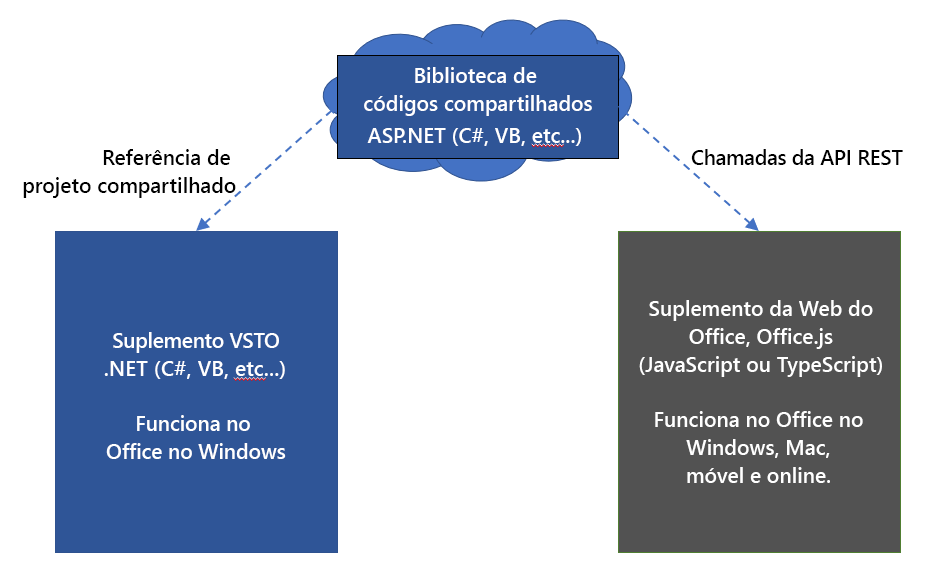
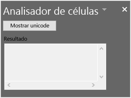

# <a name="tutorial-share-code-between-both-a-vsto-add-in-and-an-office-add-in-with-a-shared-code-library"></a>Tutorial: compartilhar código entre um suplemento VSTO e um suplemento do Office com uma biblioteca de códigos compartilhadas

Os suplementos do Visual Studio Tools for Office (VSTO) são ótimos para a ampliação do Office para fornecer soluções para seus negócios ou para outras pessoas. Eles já estão por aqui há muito tempo e há milhares de soluções criadas com o VSTO. No entanto, eles só são executados no Office no Windows. Não é possível executar suplementos VSTO no Mac, online ou em plataformas móveis.

Os suplementos do Office usam HTML, JavaScript e tecnologias da Web adicionais para criar soluções do Office em todas as plataformas. Migrar seu suplemento existente do VSTO para um suplemento do Office é uma ótima maneira de disponibilizá-lo em todas as plataformas.

Talvez você queira manter o suplemento VSTO e um novo suplemento do Office que tenham a mesma funcionalidade. Isso permite que você continue servindo aos clientes que usam o suplemento VSTO no Office no Windows. Isso também permite fornecer a mesma funcionalidade em um suplemento do Office para clientes em todas as plataformas. Você também pode [tornar seu suplemento do Office compatível com o suplemento VSTO existente](../develop/make-office-add-in-compatible-with-existing-com-add-in.md).

No entanto, é melhor evitar a reconfiguração de todo o código de seu suplemento VSTO para o suplemento do Office. Este tutorial mostra como evitar a reconfiguração de código usando uma biblioteca compartilhadas de códigos para ambos os suplementos.

## <a name="shared-code-library"></a>Biblioteca de códigos compartilhados

Este tutorial orientará você pelas etapas de identificação e compartilhamento de códigos comuns entre seu suplemento VSTO e um suplemento moderno do Office. Ele usa um exemplo de suplemento VSTO muito simples para as etapas para que você possa se concentrar nas habilidades e técnicas necessárias para trabalhar com seus próprios suplementos do VSTO.

O diagrama a seguir mostra como a biblioteca de códigos compartilhada funciona para migração. O código comum é refatorado em uma nova biblioteca de códigos compartilhadas. O código pode permanecer escrito em seu idioma original, como o C# ou o VB. Isso significa que você pode continuar usando o código do suplemento VSTO existente, criando uma referência do projeto. Quando você cria o suplemento do Office, ele também usa a biblioteca compartilhadas de códigos chamando-a por APIs REST.



Habilidades e técnicas neste tutorial:

- Criar uma biblioteca de classe compartilhada, refatorando o código em uma biblioteca de classe do .NET.
- Crie um invólucro da API REST usando ASP.NET Core para a biblioteca de classe compartilhada.
- Chame a API REST do suplemento do Office para acessar o código compartilhado.

## <a name="prerequisites"></a>Pré-requisitos

Para configurar seu ambiente de desenvolvimento:

1. Instalar o [Visual Studio 2019](https://visualstudio.microsoft.com/downloads/).
2. Instalar as seguintes cargas de trabalho:
    - ASP.NET e desenvolvimento na Web
    - Desenvolvimento de várias plataformas do .NET Core.
    - Desenvolvimento do Office/SharePoint
    - Os seguintes componentes**individuais**.
        - Ferramentas do Visual Studio para Office (VSTO)
        - .NET Core 3.0 Runtime.

Também são necessários:

- Uma conta do Microsoft 365. Você pode entrar no [Programa para Desenvolvedores do Microsoft 365](https://aka.ms/devprogramsignup)que inclui uma assinatura gratuita de um ano do Office 365.
- Um Locatário do Microsoft Azure. Você pode adquirir uma assinatura de avaliação no [Microsoft Azure](https://account.windowsazure.com/SignUp).

## <a name="the-cell-analyzer-vsto-add-in"></a>O suplemento VSTO do analisador de células

Este tutorial usa a solução PnP [Biblioteca compartilhada do suplemento VSTO para o suplemento do Office](https://github.com/OfficeDev/PnP-OfficeAddins/tree/master/Samples/VSTO-shared-code-migration). A pasta **/start** contém a solução de suplemento VSTO que você migrará. Sua meta é migrar o suplemento VSTO para um suplemento moderno do Office, quando possível.

> [!NOTE]
> O exemplo usa C#, mas você pode aplicar as técnicas deste tutorial a um suplemento VSTO escrito em qualquer linguagem .NET.

1. Baixe a solução PnP [Biblioteca compartilhada do suplemento VSTO para o suplemento do Office](https://github.com/OfficeDev/PnP-OfficeAddins/tree/master/Samples/VSTO-shared-code-migration)para trabalhar em um arquivo em seu computador.
2. Inicie o Visual Studio 2019 e abra a solução **/start/Cell-Analyzer.sln**.
3. No menu **Depurar**, selecione **Iniciar Depuração**.
3. No **Gerenciador de soluções**, clique com o botão direito do mouse no projeto**Cell-Analyzer** e escolha **Propriedades**.
4. Escolha a categoria **Assinatura** nas propriedades.
5. Escolha **Assinar os manifestos ClickOnce**e, em seguida, escolha **Criar certificado de teste**.
6. Na caixa de diálogo **criar certificado de teste**, digite e confirme a senha. Em seguida, escolha **OK**.

O suplemento é um painel de tarefas personalizado do Excel. Você pode selecionar qualquer célula com o texto e, em seguida, escolher o botão **Mostrar Unicode**. O suplemento exibirá uma lista de cada caractere no texto junto com o número Unicode correspondente.



## <a name="analyze-types-of-code-in-the-vsto-add-in"></a>Análise de tipos de código no suplemento VSTO

A primeira técnica a ser aplicada é analisar o suplemento para quais partes do código podem ser compartilhadas. Em geral, o Project é dividido em três tipos de códigos.

### <a name="ui-code"></a>Código IU

O código da IU interage com o usuário. O código da interface de usuário do VSTO funciona com formulários do Windows. Os suplementos do Office usam HTML, CSS e JavaScript para IU. Devido a essas diferenças, não é possível compartilhar o código da interface do usuário com o suplemento do Office. A IU deve ser recriada em JavaScript.

### <a name="document-code"></a>Código do documento

O código VSTO interage com o documento por meio de objetos .NET, como `Microsoft.Office.Interop.Excel.Range`. No entanto, os suplementos do Office usam a biblioteca Office.js. Embora sejam similares, eles não são exatamente iguais. Portanto, você não pode compartilhar o código de interação do documento com o suplemento do Office.

### <a name="logic-code"></a>Código lógico

A lógica empresarial, algoritmos, funções auxiliares e um código semelhante geralmente formam o coração de um suplemento VSTO. Esse código funciona independentemente da interface de usuário e do código do documento para executar a análise, conectar-se a serviços de backend, executar cálculos e muito mais. Esse é o código que pode ser compartilhado para que você não precise escrevê-lo novamente em JavaScript.

Vamos examinar o suplemento VSTO. No código a seguir, cada seção é identificada como um código de documento, IU ou de algoritmo.

```csharp
// *** UI CODE ***
private void btnUnicode_Click(object sender, EventArgs e)
{
    // *** DOCUMENT CODE ***
    Microsoft.Office.Interop.Excel.Range rangeCell;
    rangeCell = Globals.ThisAddIn.Application.ActiveCell;

    string cellValue = "";

    if (null != rangeCell.Value)
    {
        cellValue = rangeCell.Value.ToString();
    }

    // *** ALGORITHM CODE ***
    //convert string to Unicode listing
    string result = "";
    foreach (char c in cellValue)
    {
        int unicode = c;

        result += $"{c}: {unicode}\r\n";
    }
    
    // *** UI CODE ***
    //Output the result
    txtResult.Text = result;
}
```

Com essa abordagem, você pode ver que uma seção de código pode ser compartilhada com o suplemento do Office. O código a seguir precisará ser refatorado em uma biblioteca de classe separada.

```csharp
// *** ALGORITHM CODE ***
//convert string to Unicode listing
string result = "";
foreach (char c in cellValue)
{
    int unicode = c;

    result += $"{c}: {unicode}\r\n";
}
```

## <a name="create-a-shared-class-library"></a>Criar uma biblioteca de classe compartilhada

Os suplementos do VSTO são criados no Visual Studio como projetos .NET, portanto, reutilizaremos o .NET o máximo possível para simplificar. Nossa próxima técnica é criar uma biblioteca de classe e um código compartilhado de refatoração nessa biblioteca de classe.

1. Caso ainda não o tenha feito, inicie o Visual Studio 2019 e abra a solução **\start\Cell-Analyzer.sln**.
2. Clique com botão direito do mouse da solução no **Gerenciador de Soluções** e escolha **Adicionar > Novo Projeto**.
3. Na caixa de diálogo **Adicionar um novo projeto**, escolha **Biblioteca de Classe (.NET Framework)** e escolha **Próximo**.
    > [!NOTE]
    > Não use a biblioteca de classe central do .NET porque ela não funcionará com seu projeto do VSTO.
4. Na caixa de diálogo **Configure seu novo Project**, defina os seguintes campos.
    - Defina o **Nome do projeto** como **CellAnalyzerSharedLibrary**.
    - Deixe o **Local**com o valor padrão.
    - Defina a **estrutura** como **4.7.2**.
5. Escolha **Criar**.
6. Depois de criar o projeto, renomeie o arquivo **Class1.cs** para **CellOperations.cs**. Será exibida uma solicitação para renomear a classe. Renomeie o nome da classe para que ele corresponda ao nome do arquivo.
7. Adicione o seguinte código à classe `CellOperations` para criar um método chamado `GetUnicodeFromText`.

```csharp
public class CellOperations
{
    static public string GetUnicodeFromText(string value)
    {
        string result = "";
        foreach (char c in value)
        {
            int unicode = c;

            result += $"{c}: {unicode}\r\n";
        }
        return result;
    }
}
```

### <a name="use-the-shared-class-library-in-the-vsto-add-in"></a>Use a biblioteca de classe compartilhada no suplemento VSTO

Agora, você precisa atualizar o suplemento VSTO para usar a biblioteca de classe. É importante que o suplemento VSTO e o suplemento do Office usem a mesma biblioteca de classes compartilhadas para que correções de bugs futuras ou recursos sejam feitos em um único local.

1. No **Gerenciador de soluções**, clique com o botão direito do mouse em **Cell-Analyzer** e escolha **Adicionar referência**.
2. Selecione **CellAnalyzerSharedLibrary**e escolha **OK**.
3. No **Gerenciador de soluções** expanda o arquivo **Cell-Analyzer**, clique com o botão direito do mouse no arquivo **CellAnalyzerPane.cs** e escolha **Exibir Código**.
4. No método `btnUnicode_Click`, exclua as linhas de código a seguir.
    
    ```csharp
    //Convert to Unicode listing
    string result = "";
    foreach (char c in cellValue)
    {
      int unicode = c;
      result += $"{c}: {unicode}\r\n";
    }
    ```
    
5. Atualize a linha de código sob o comentário `//Output the result` para ler da seguinte maneira:
    
    ```csharp
    //Output the result
    txtResult.Text = CellAnalyzerSharedLibrary.CellOperations.GetUnicodeFromText(cellValue);
    ```
    
6. No menu **Depurar**, selecione **Iniciar Depuração**. O painel de tarefas personalizado deve funcionar conforme o esperado. Digite um texto em uma célula e, em seguida, teste para convertê-lo em uma lista Unicode com o suplemento.

## <a name="create-a-rest-api-wrapper"></a>Criar um invólucro da API REST

O suplemento VSTO pode usar a biblioteca de classes compartilhadas diretamente, uma vez que ambos são projetos .NET. No entanto, o suplemento do Office não poderá usar o .NET, uma vez que ele usa o JavaScript. Em seguida, você precisará criar um invólucro da API REST. Isso permite que o suplemento do Office chame uma API REST, que passa a chamada para a biblioteca de classes compartilhadas.

1. No **Gerenciador de soluções**, clique com o botão direito do mouse no **Cell-Analyzer** e escolha **Adicionar > Novo Projeto**.
2. Em **Adicionar uma nova caixa de diálogo do projeto**, escolha **Aplicativo Web ASP.NET Core** e escolha **Próximo**.
3. Na caixa de diálogo **Configure seu novo projeto**, defina os seguintes campos:
    - Defina o **nome do projeto** para **CellAnalyzerRESTAPI**.
    - No campo **Local**, deixe o valor padrão.
4. Escolha **Criar**.
5. Na caixa de diálogo **criar um novo aplicativo Web ASP.NET Core**, selecione **ASP.NET Core 3.1** da versão e selecione **API** na lista de projetos.
6. Deixe todos os outros campos em valores padrão e escolha o botão **Criar**.
7. Depois de criar o projeto, expanda o projeto**CellAnalyzerRESTAPI** no **Gerenciador de soluções**.
8. Clique com o botão direito do mouse em **Dependências**e escolha **Adicionar Referência**.
9. Selecione **CellAnalyzerSharedLibrary**e escolha **OK**.
10. Clique com o botão direito do mouse na pasta **Controladores** e escolha **Adicionar > Controlador**.
11. Na caixa de diálogo **Adicionar Novo Item de Scaffolded**, escolha **controlador da API-vazio** e **Adicionar**.
12. Na caixa de diálogo **Adicionar controlador de API vazio**, nomeie o controlador **AnalyzeUnicodeController**e selecione **Adicionar**.
13. Abra o arquivo **AnalyzeUnicodeController.cs** e adicione o código a seguir como um método para a classe `AnalyzeUnicodeController`.
    
    ```csharp
    [HttpGet]
    public ActionResult<string> AnalyzeUnicode(string value)
    {
      if (value == null)
      {
        return BadRequest();
      }
      return CellAnalyzerSharedLibrary.CellOperations.GetUnicodeFromText(value);
    }
    ```
    
14. Clique com o botão direito do mouse no projeto **CellAnalyzerRESTAPI** e escolha **Definir como inicialização do projeto**.
15. No menu **Depurar**, selecione **Iniciar Depuração**.
16. Um navegador será iniciado. Insira a seguinte URL para testar se a API REST está funcionando: `https://localhost:<ssl port number>/api/analyzeunicode?value=test`. Você pode reutilizar o número da porta na URL no navegador que o Visual Studio iniciou. Você deverá ver uma cadeia de caracteres retornada com valores Unicode para cada caractere.

## <a name="create-the-office-add-in"></a>Criar o suplemento do Office

Quando você cria o suplemento do Office, ele faz uma chamada para a API REST. Mas, primeiro, você precisa obter o número da porta do servidor da API REST e salvá-lo para mais tarde.

### <a name="save-the-ssl-port-number"></a>Salve o número da porta SSL

1. Caso ainda não o tenha feito, inicie o Visual Studio 2019 e abra a solução **\start\Cell-Analyzer.sln**.
2. No projeto **CellAnalyzerRESTAPI**, expanda **Propriedades**e abra o arquivo **launchSettings. JSON**.
3. Localize a linha de código com o valor **sslPort**, copie o número da porta e salve-o em algum lugar.

### <a name="add-the-office-add-in-project"></a>Adicione o projeto de suplemento do Office

Para simplificar, mantenha todo o código em uma solução. Adicione o projeto do suplemento do Office à solução existente do Visual Studio. No entanto, se você estiver familiarizado com o [Gerador Yeoman de Suplementos do Office](https://github.com/OfficeDev/generator-office) e do Código do Visual Studio, também poderá executar `yo office` para criar o projeto. As etapas são muito semelhantes.

1. No **Gerenciador de soluções**, clique com o botão direito do mouse na solução **Cell-Analyzer** e escolha **Adicionar > Novo projeto**.
2. Na**caixa de diálogo Adicionar um novo projeto**, clique em **Suplemento do Web Add-in**e escolha **Próximo**.
3. Na caixa de diálogo **Configure seu novo projeto**, defina os seguintes campos:
    - Defina o **nome do projeto** como**CellAnalyzerOfficeAddin**.
    - Deixe o **Local**com o valor padrão.
    - Defina a **estrutura** como **4.7.2**ou superior.
4. Escolha **Criar**.
5. Na caixa de diálogo**Escolha o tipo de suplemento**, selecione **Adicionar novas funcionalidades ao Excel**e escolha **Concluir**.

Dois projetos serão criados:
- **CellAnalyzerOfficeAddin** - este projeto configura os arquivos XML de manifesto que descrevem o suplemento, para que o Office possa carregá-lo corretamente. Ele contém o ID, nome, descrição e outras informações sobre o suplemento.
- **CellAnalyzerOfficeAddinWeb** - este projeto contém recursos da Web para seu suplemento, como HTML, CSS e scripts. Ele também configura uma instância do IIS Express para hospedar seu suplemento como um aplicativo Web.

### <a name="add-ui-and-functionality-to-the-office-add-in"></a>Adicionar interface de usuário e funcionalidade ao suplemento do Office

1. No **Gerenciador de soluções**, expanda o projeto**CellAnalyzerOfficeAddinWeb**.
2. Abra o arquivo **Home.HTML** e substitua o conteúdo de `<body>` pela seguinte HTML.
    
    ```html
    <button id="btnShowUnicode" onclick="showUnicode()">Show Unicode</button>
    <p>Result:</p>
    <div id="txtResult"></div>
    ```
    
3. Abra o arquivo **Home.js** e substitua todo o conteúdo pelo seguinte código. 
    
    ```js
    (function () {
      "use strict";
      // The initialize function must be run each time a new page is loaded.
      Office.initialize = function (reason) {
        $(document).ready(function () {
        });
      };
    })();
    
    function showUnicode() {
      Excel.run(function (ctx) {
        const range = ctx.workbook.getSelectedRange();
        range.load("values");
        return ctx.sync(range).then(function (range) {
          const url = "https://localhost:<ssl port number>/api/analyzeunicode?value=" + range.values[0][0];
          $.ajax({
            type: "GET",
            url: url,
            success: function (data) {
              let htmlData = data.replace(/\r\n/g, '<br>');
              $("#txtResult").html(htmlData);
            },
            error: function (data) {
                $("#txtResult").html("error occurred in ajax call.");
            }
          });
        });
      });
    }
    ```
    
4. No código anterior, digite o número**sslPort** que você salvou anteriormente pelo arquivo **. JSON**.

No código anterior, a cadeia de caracteres retornada será processada para substituir alimentações de linha de retorno de carro por marcas `<br>` HTML. Algumas vezes, você pode encontrar situações em que um valor de retorno que funcione perfeitamente para o .NET precisará ser ajustado no suplemento do Office para trabalhar conforme o esperado no suplemento VSTO . Nesse caso, a API REST e a biblioteca de classes compartilhadas só se preocupam em retornar a cadeia de caracteres. O método `showUnicode()` é responsável pela formatação de valores retornados corretamente para a apresentação.

### <a name="allow-cors-from-the-office-add-in"></a>Permitir CORS no suplemento do Office

A biblioteca do Office. js exige o CORS nas chamadas de saída, como a realizada na chamada `ajax` para o servidor de API REST. Use as etapas a seguir para permitir chamadas do suplemento do Office para a API REST.

1. No **Gerenciador de soluções**, selecione o projeto **CellAnalyzerOfficeAddinWeb**.
2. No menu **Exibir**, escolha **Janela Propriedades** (se a janela ainda não estiver sendo exibida).
3. Na janela Propriedades, copie o valor da URL **SSL**e salve-a em outro local. Esta é a URL necessária para permitir o CORS.
4. No projeto **CellAnalyzerRESTAPI**, abra o arquivo **Startup.cs**.
5. Na parte superior do método, adicione o seguinte código `ConfigureServices`. Substitua a URL SSL que você copiou anteriormente para a chamada `builder.WithOrigins`.
    
    ```csharp
    services.AddCors(options =>
    {
      options.AddPolicy(MyAllowSpecificOrigins,
      builder =>
      {
        builder.WithOrigins("<your URL SSL>")
        .AllowAnyMethod()
        .AllowAnyHeader();
      });
    });
    ```
    
    > [!NOTE]
    > Mantenha o final `/` da URL ao usá-lo no método `builder.WithOrigins`. Por exemplo, ele deve parecer semelhante a `https://localhost:44000`. Caso contrário, você receberá um erro CORS em tempo de execução.
    
6. Adicione o campo a seguir à classe `Startup`:
    
    ```csharp
    readonly string MyAllowSpecificOrigins = "_myAllowSpecificOrigins";
    ```
    
7. Adicione o seguinte código ao método `configure` logo antes da linha de código para `app.UseEndpoints`.
    
    ```csharp
    app.UseCors(MyAllowSpecificOrigins);
    ```

Quando terminar, sua classe `Startup` deve ser semelhante ao seguinte código (sua URL de localhost pode ser diferente):

```csharp
public class Startup
{
  public Startup(IConfiguration configuration)
    {
      Configuration = configuration;
    }

    readonly string MyAllowSpecificOrigins = "_myAllowSpecificOrigins";

    public IConfiguration Configuration { get; }

    // NOTE: The following code configures CORS for the localhost:44397 port.
    // This is for development purposes. In production code you should update this to 
    // use the appropriate allowed domains.
    public void ConfigureServices(IServiceCollection services)
    {
        services.AddCors(options =>
        {
            options.AddPolicy(MyAllowSpecificOrigins,
            builder =>
            {
                builder.WithOrigins("https://localhost:44397")
                .AllowAnyMethod()
                .AllowAnyHeader();
            });
        });
        services.AddControllers();
    }

    // This method gets called by the runtime. Use this method to configure the HTTP request pipeline.
    public void Configure(IApplicationBuilder app, IWebHostEnvironment env)
    {
        if (env.IsDevelopment())
        {
            app.UseDeveloperExceptionPage();
        }
            
        app.UseHttpsRedirection();

        app.UseRouting();

        app.UseAuthorization();

        app.UseCors(MyAllowSpecificOrigins);

        app.UseEndpoints(endpoints =>
        {
            endpoints.MapControllers();
        });
    }
}
```

### <a name="run-the-add-in"></a>Execute o suplemento

1. No **Explorador de Soluções**, clique com o botão direito do mouse no nó superior ** Solução 'Cell-Analyzer' **e escolha **Definir Projetos de Inicialização**.
2. Na caixa de diálogo **Páginas de propriedades da solução 'Cell-Analyzer'**, selecione **Vários projetos de inicialização**.
3. Defina a propriedade **Action** como **Iniciar** para cada um dos seguintes projetos.
    
    - CellAnalyzerRESTAPI
    - CellAnalyzerOfficeAddin
    - CellAnalyzerOfficeAddinWeb
    
4. Escolha **OK**.
5. No menu **Depurar**, selecione **Iniciar Depuração**.

O Excel será executado e fará o carregamento lateral do suplemento do Office. Você pode testar se o serviço de API do localhost REST está funcionando corretamente, inserindo um valor de texto em uma célula e escolhendo o botão **Mostrar Unicode** no suplemento do Office. Ele deve chamar a API REST e exibir os valores Unicode para os caracteres de texto.

## <a name="publish-to-an-azure-app-service"></a>Publicar em um serviço de aplicativo do Azure

Eventualmente, você deseja publicar o projeto da API REST na nuvem. Nas etapas a seguir, você verá como publicar o projeto**CellAnalyzerRESTAPI** em um serviço de aplicativo do Microsoft Azure. Confira os[pré-requisitos](#prerequisites) para saber mais sobre como obter uma conta do Azure.

1. No **Gerenciador de soluções**, clique com o botão direito do mouse no projeto **CellAnalyzerRESTAPI** e escolha **Publicar**.
2. Na caixa de diálogo **Escolha um destino de publicação**, selecione **Criar Novo**e escolha **Criar Perfil**.
3. Na caixa de diálogo **Serviço de Aplicativo**, selecione a conta correta, caso ainda não esteja selecionada.
4. Os campos para a caixa de diálogo **Serviço de Aplicativo** serão definidos como padrões para a sua conta. Geralmente, os padrões funcionam corretamente, mas você pode alterá-los caso prefira configurações diferentes.
5. Na caixa de diálogo **Serviço de Aplicativo**, escolha **Criar**.
6. O novo perfil será exibido em uma página de**Publicação**. Escolha **Publicar** para criar e implantar o código no serviço de aplicativo.

Agora você pode testar o serviço. Abra um navegador e insira uma URL que vai diretamente para o novo serviço. Por exemplo, use `https://<myappservice>.azurewebsites.net/api/analyzeunicode?value=test` onde *myappservice* é o nome exclusivo que você criou para o novo serviço de aplicativo.

### <a name="use-the-azure-app-service-from-the-office-add-in"></a>Usar o serviço de aplicativo Azure do suplemento do Office

A etapa final é atualizar o código no suplemento do Office para usar o serviço do aplicativo Azure, em vez de localhost.

1. No **Gerenciador de soluções**, expanda o projeto**CellAnalyzerOfficeAddinWeb** e abra o arquivo **Home. js**.
2. Altere a constante `url` para usar a URL do serviço do aplicativo Azure, como mostra a linha de código a seguir. Substitua `<myappservice>` pelo nome exclusivo que você criou para o novo serviço de aplicativo.
    ```JavaScript
    const url = "https://<myappservice>.azurewebsites.net/api/analyzeunicode?value=" + range.values[0][0];
    ```
3. No **Explorador de Soluções**, clique com o botão direito do mouse no nó superior ** Solução 'Cell-Analyzer' **e escolha **Definir Projetos de Inicialização**.
4. Na caixa de diálogo **Páginas de propriedades da solução 'Cell-Analyzer'**, selecione **Vários projetos de inicialização**.
5. Habilite a ação**Iniciar** para cada um dos seguintes projetos:
    - CellAnalyzerOfficeAddinWeb
    - CellAnalyzerOfficeAddin
6. Escolha **OK**.
7. No menu **Depurar**, selecione **Iniciar Depuração**.

O Excel será executado e fará o carregamento lateral do suplemento do Office. Para testar se o serviço de aplicativo está funcionando corretamente, insira um valor de texto em uma célula e escolha **Mostrar Unicode** no suplemento do Office. Ele deve chamar o serviço e exibir os valores Unicode para os caracteres de texto.

## <a name="conclusion"></a>Conclusão

Neste tutorial você aprendeu a criar um suplemento do Office que usa um código compartilhado com o suplemento VSTO original. Você aprendeu como manter o código VSTO do Office no Windows e um suplemento do Office para o Office em outras plataformas. Você refatorou o código C # do VSTO em uma biblioteca compartilhada e o implantou em um Serviço de Aplicativo do Azure. Você criou um suplemento do Office que usa a biblioteca compartilhadas para que não seja necessário regravar o código em JavaScript.
