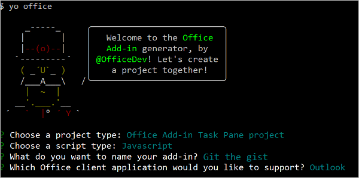

# <a name="tutorial-build-a-message-compose-outlook-add-in"></a><span data-ttu-id="78094-103">Tutorial: criar uma mensagem para compor o suplemento do Outlook</span><span class="sxs-lookup"><span data-stu-id="78094-103">Tutorial: Build a message compose Outlook add-in</span></span>

<span data-ttu-id="78094-104">Este tutorial ensina como criar um suplemento que pode ser usado em mensagens no modo de redação do Outlook para inserir conteúdo no corpo de uma mensagem.</span><span class="sxs-lookup"><span data-stu-id="78094-104">This tutorial teaches you how to build an Outlook add-in that can be used in message compose mode to insert content into the body of a message.</span></span>

<span data-ttu-id="78094-105">Neste tutorial, você vai:</span><span class="sxs-lookup"><span data-stu-id="78094-105">In this tutorial, you will:</span></span>

> [!div class="checklist"]
> * <span data-ttu-id="78094-106">Criar um projeto de um suplemento do Outlook</span><span class="sxs-lookup"><span data-stu-id="78094-106">Create an Outlook add-in project</span></span>
> * <span data-ttu-id="78094-107">Definir botões de renderização na janela de mensagem de texto</span><span class="sxs-lookup"><span data-stu-id="78094-107">Define buttons that will render in the compose message window</span></span>
> * <span data-ttu-id="78094-108">Implementar uma experiência de primeira execução que coleta informações do usuário e busca os dados de um serviço externo</span><span class="sxs-lookup"><span data-stu-id="78094-108">Implement a first-run experience that collects information from the user and fetches data from an external service</span></span>
> * <span data-ttu-id="78094-109">Implementar um botão sem interface do usuário que chame uma função</span><span class="sxs-lookup"><span data-stu-id="78094-109">Implement a UI-less button that invokes a function</span></span>
> * <span data-ttu-id="78094-110">Implementar um painel de tarefas que insere o conteúdo no corpo de uma mensagem</span><span class="sxs-lookup"><span data-stu-id="78094-110">Implement a task pane that inserts content into the body of a message</span></span>

## <a name="prerequisites"></a><span data-ttu-id="78094-111">Pré-requisitos</span><span class="sxs-lookup"><span data-stu-id="78094-111">Prerequisites</span></span>

- <span data-ttu-id="78094-112">[Node.js](https://nodejs.org/) (a versão mais recente de [LTS](https://nodejs.org/about/releases))</span><span class="sxs-lookup"><span data-stu-id="78094-112">[Node.js](https://nodejs.org/) (the latest [LTS](https://nodejs.org/about/releases) version)</span></span>

- <span data-ttu-id="78094-113">A versão mais recente do [Yeoman](https://github.com/yeoman/yo) e do [Yeoman gerador de suplementos do Office](https://github.com/OfficeDev/generator-office). Para instalar essas ferramentas globalmente, execute o seguinte comando por meio do prompt de comando:</span><span class="sxs-lookup"><span data-stu-id="78094-113">The latest version of [Yeoman](https://github.com/yeoman/yo) and the [Yeoman generator for Office Add-ins](https://github.com/OfficeDev/generator-office). To install these tools globally, run the following command via the command prompt:</span></span>

    ```command&nbsp;line
    npm install -g yo generator-office
    ```

    > [!NOTE]
    > <span data-ttu-id="78094-114">Mesmo se você já instalou o gerador Yeoman, recomendamos atualizar seu pacote para a versão mais recente do npm.</span><span class="sxs-lookup"><span data-stu-id="78094-114">Even if you've previously installed the Yeoman generator, we recommend you update your package to the latest version from npm.</span></span>

- <span data-ttu-id="78094-115">Outlook 2016 ou posterior no Windows (conectado a uma conta do Microsoft 365) ou Outlook na Web</span><span class="sxs-lookup"><span data-stu-id="78094-115">Outlook 2016 or later on Windows (connected to a Microsoft 365 account) or Outlook on the web</span></span>

- <span data-ttu-id="78094-116">Uma conta [GitHub](https://www.github.com) </span><span class="sxs-lookup"><span data-stu-id="78094-116">A [GitHub](https://www.github.com) account</span></span>

## <a name="setup"></a><span data-ttu-id="78094-117">Configurar</span><span class="sxs-lookup"><span data-stu-id="78094-117">Setup</span></span>

<span data-ttu-id="78094-118">O suplemento que você criará neste tutorial lerá [gists](https://gist.github.com) da conta do GitHub do usuário e adicionará a essência selecionada ao corpo de uma mensagem.</span><span class="sxs-lookup"><span data-stu-id="78094-118">The add-in that you'll create in this tutorial will read [gists](https://gist.github.com) from the user's GitHub account and add the selected gist to the body of a message.</span></span> <span data-ttu-id="78094-119">Conclua as etapas a seguir para criar duas gists novas que você pode usar para testar o suplemento que você vai criar.</span><span class="sxs-lookup"><span data-stu-id="78094-119">Complete the following steps to create two new gists that you can use to test the add-in you're going to build.</span></span>

1. <span data-ttu-id="78094-120">[Faça logon no GitHub](https://github.com/login).</span><span class="sxs-lookup"><span data-stu-id="78094-120">[Login to GitHub](https://github.com/login).</span></span>

1. <span data-ttu-id="78094-121">[Crie uma nova gist.](https://gist.github.com)</span><span class="sxs-lookup"><span data-stu-id="78094-121">[Create a new gist](https://gist.github.com).</span></span>

    - <span data-ttu-id="78094-122">No campo\*\*descrição do gist... \*\*, insira **a Markdown Olá Mundo**.</span><span class="sxs-lookup"><span data-stu-id="78094-122">In the **Gist description...** field, enter **Hello World Markdown**.</span></span>

    - <span data-ttu-id="78094-123">No campo \*\*nome do arquivo como extensão... \*\* campo, insira **test.md**.</span><span class="sxs-lookup"><span data-stu-id="78094-123">In the **Filename including extension...** field, enter **test.md**.</span></span>

    - <span data-ttu-id="78094-124">Adicione a redução a seguir na caixa de texto multilinha:</span><span class="sxs-lookup"><span data-stu-id="78094-124">Add the following markdown to the multiline textbox:</span></span>

        ```markdown
        # Hello World

        This is content converted from Markdown!

        Here's a JSON sample:

          ```json
          {
            "foo": "bar"
          }
          ```
        ```

    - <span data-ttu-id="78094-125">Selecione o botão **criar gist público**.</span><span class="sxs-lookup"><span data-stu-id="78094-125">Select the **Create public gist** button.</span></span>

1. <span data-ttu-id="78094-126">[Criar outro novo gist](https://gist.github.com).</span><span class="sxs-lookup"><span data-stu-id="78094-126">[Create another new gist](https://gist.github.com).</span></span>

    - <span data-ttu-id="78094-127">No campo\*\*descrição do gist... **, insira \*\* Olá Mundo**.</span><span class="sxs-lookup"><span data-stu-id="78094-127">In the **Gist description...** field, enter **Hello World Html**.</span></span>

    - <span data-ttu-id="78094-128">No campo \*\*nome do arquivo como extensão... \*\* campo, insira **test.html**.</span><span class="sxs-lookup"><span data-stu-id="78094-128">In the **Filename including extension...** field, enter **test.html**.</span></span>

    - <span data-ttu-id="78094-129">Adicione a redução a seguir na caixa de texto multilinha:</span><span class="sxs-lookup"><span data-stu-id="78094-129">Add the following markdown to the multiline textbox:</span></span>

        ```HTML
        <html>
          <head>
            <style>
            h1 {
              font-family: Calibri;
            }
            </style>
          </head>
          <body>
            <h1>Hello World!</h1>
            <p>This is a test</p>
          </body>
        </html>
        ```

    - <span data-ttu-id="78094-130">Selecione o botão **criar gist público**.</span><span class="sxs-lookup"><span data-stu-id="78094-130">Select the **Create public gist** button.</span></span>

## <a name="create-an-outlook-add-in-project"></a><span data-ttu-id="78094-131">Criar um projeto de um suplemento do Outlook</span><span class="sxs-lookup"><span data-stu-id="78094-131">Create an Outlook add-in project</span></span>

1. [!include[Yeoman generator create project guidance](../includes/yo-office-command-guidance.md)]

    - <span data-ttu-id="78094-132">**Escolha o tipo de projeto** - `Office Add-in Task Pane project`</span><span class="sxs-lookup"><span data-stu-id="78094-132">**Choose a project type** - `Office Add-in Task Pane project`</span></span>

    - <span data-ttu-id="78094-133">**Escolha o tipo de script** - `Javascript`</span><span class="sxs-lookup"><span data-stu-id="78094-133">**Choose a script type** - `Javascript`</span></span>

    - <span data-ttu-id="78094-134">**Qual será o nome do suplemento?**</span><span class="sxs-lookup"><span data-stu-id="78094-134">**What do you want to name your add-in?**</span></span> - `Git the gist`

    - <span data-ttu-id="78094-135">**Você gostaria de proporcionar suporte para qual aplicativo cliente do Office?**</span><span class="sxs-lookup"><span data-stu-id="78094-135">**Which Office client application would you like to support?**</span></span> - `Outlook`

    
    
    <span data-ttu-id="78094-137">Depois que você concluir o assistente, o gerador criará o projeto e instalará os componentes Node de suporte.</span><span class="sxs-lookup"><span data-stu-id="78094-137">After you complete the wizard, the generator will create the project and install supporting Node components.</span></span>

    [!include[Yeoman generator next steps](../includes/yo-office-next-steps.md)]

1. <span data-ttu-id="78094-138">Navegue até o diretório raiz do projeto.</span><span class="sxs-lookup"><span data-stu-id="78094-138">Navigate to the root directory of the project.</span></span>

    ```command&nbsp;line
    cd "Git the gist"
    ```

1. <span data-ttu-id="78094-139">Este suplemento usará as seguintes bibliotecas:</span><span class="sxs-lookup"><span data-stu-id="78094-139">This add-in will use the following libraries:</span></span>

    - <span data-ttu-id="78094-140">Biblioteca [Showdown](https://github.com/showdownjs/showdown) para converter o Markdown para HTML</span><span class="sxs-lookup"><span data-stu-id="78094-140">[Showdown](https://github.com/showdownjs/showdown) library to convert Markdown to HTML</span></span>
    - <span data-ttu-id="78094-141">Biblioteca [URI.js](https://github.com/medialize/URI.js) para criar URLs relativos.</span><span class="sxs-lookup"><span data-stu-id="78094-141">[URI.js](https://github.com/medialize/URI.js) library to build relative URLs.</span></span>
    - <span data-ttu-id="78094-142">Biblioteca [jquery](https://jquery.com/) para simplificar as interações com o DOM.</span><span class="sxs-lookup"><span data-stu-id="78094-142">[jquery](https://jquery.com/) library to simplify DOM interactions.</span></span>

     <span data-ttu-id="78094-143">Para instalar essas ferramentas para o seu projeto, execute o seguinte comando no diretório raiz do projeto:</span><span class="sxs-lookup"><span data-stu-id="78094-143">To install these tools for your project, run the following command in the root directory of the project:</span></span>

    ```command&nbsp;line
    npm install showdown urijs jquery --save
    ```

### <a name="update-the-manifest"></a><span data-ttu-id="78094-144">Atualizar o manifesto</span><span class="sxs-lookup"><span data-stu-id="78094-144">Update the manifest</span></span>

<span data-ttu-id="78094-145">O manifesto controla como o suplemento é exibido no Outlook.</span><span class="sxs-lookup"><span data-stu-id="78094-145">The manifest for an add-in controls how it appears in Outlook.</span></span> <span data-ttu-id="78094-146">Ele define a maneira como o suplemento aparece na lista de suplementos e os botões que aparecem na faixa de opções, além de definir as URLs para os arquivos HTML e JavaScript usados pelo suplemento.</span><span class="sxs-lookup"><span data-stu-id="78094-146">It defines the way the add-in appears in the add-in list and the buttons that appear on the ribbon, and it sets the URLs for the HTML and JavaScript files used by the add-in.</span></span>

#### <a name="specify-basic-information"></a><span data-ttu-id="78094-147">Especifique as informações básicas</span><span class="sxs-lookup"><span data-stu-id="78094-147">Specify basic information</span></span>

<span data-ttu-id="78094-148">Faça as seguintes atualizações no arquivo**manifest.xml**para especificar algumas informações básicas sobre o suplemento:</span><span class="sxs-lookup"><span data-stu-id="78094-148">Make the following updates in the **manifest.xml** file to specify some basic information about the add-in:</span></span>

1. <span data-ttu-id="78094-149">Encontre o elemento `ProviderName` e substitua o valor padrão pelo nome da sua empresa.</span><span class="sxs-lookup"><span data-stu-id="78094-149">Locate the `ProviderName` element and replace the default value with your company name.</span></span>

    ```xml
    <ProviderName>Contoso</ProviderName>
    ```
1. <span data-ttu-id="78094-150">Localize o elemento`Description`, substitua o valor padrão com uma descrição do suplemento e salve o arquivo.</span><span class="sxs-lookup"><span data-stu-id="78094-150">Locate the `Description` element, replace the default value with a description of the add-in, and save the file.</span></span>

    ```xml
    <Description DefaultValue="Allows users to access their GitHub gists."/>
    ```

#### <a name="test-the-generated-add-in"></a><span data-ttu-id="78094-151">Testar o suplemento gerado</span><span class="sxs-lookup"><span data-stu-id="78094-151">Test the generated add-in</span></span>

<span data-ttu-id="78094-152">Antes de prosseguir, vamos testar o suplemento básico que criou o gerador para confirmar que o projeto está configurado corretamente.</span><span class="sxs-lookup"><span data-stu-id="78094-152">Before going any further, let's test the basic add-in that the generator created to confirm that the project is set up correctly.</span></span>

> [!NOTE]
> <span data-ttu-id="78094-153">Os Suplementos do Office devem usar HTTPS, e não HTTP, mesmo durante o desenvolvimento.</span><span class="sxs-lookup"><span data-stu-id="78094-153">Office Add-ins should use HTTPS, not HTTP, even when you are developing.</span></span> <span data-ttu-id="78094-154">Se for solicitado a instalação de um certificado após executar um dos seguintes comandos, aceite a solicitação para instalar o certificado que o gerador do Yeoman fornecer.</span><span class="sxs-lookup"><span data-stu-id="78094-154">If you are prompted to install a certificate after you run the following command, accept the prompt to install the certificate that the Yeoman generator provides.</span></span>

1. <span data-ttu-id="78094-155">Execute o seguinte comando no diretório raiz do seu projeto.</span><span class="sxs-lookup"><span data-stu-id="78094-155">Run the following command in the root directory of your project.</span></span> <span data-ttu-id="78094-156">Quando você executar este comando, o servidor da Web local será iniciado (se ainda não estiver em execução).</span><span class="sxs-lookup"><span data-stu-id="78094-156">When you run this command, the local web server will start (if it's not already running).</span></span>

    ```command&nbsp;line
    npm start
    ```

1. <span data-ttu-id="78094-157">Siga as instruções em [Realizar sideload nos Suplementos do Outlook para teste](../outlook/sideload-outlook-add-ins-for-testing.md) para realizar o sideload do arquivo **manifest.xml** que está localizado no diretório raiz do projeto.</span><span class="sxs-lookup"><span data-stu-id="78094-157">Follow the instructions in [Sideload Outlook add-ins for testing](../outlook/sideload-outlook-add-ins-for-testing.md) to sideload the **manifest.xml** file that's located in the root directory of the project.</span></span>

1. <span data-ttu-id="78094-158">No Outlook, abra uma mensagem existente e selecione o botão **Mostrar Painel de Tarefas**.</span><span class="sxs-lookup"><span data-stu-id="78094-158">In Outlook, open an existing message and select the **Show Taskpane** button.</span></span> <span data-ttu-id="78094-159">Se tudo tiver sido configurado corretamente, o painel de tarefas será aberto e exibirá a página de boas-vindas do suplemento.</span><span class="sxs-lookup"><span data-stu-id="78094-159">If everything's been set up correctly, the task pane will open and render the add-in's welcome page.</span></span>

    

## <a name="define-buttons"></a><span data-ttu-id="78094-161">Definir botões</span><span class="sxs-lookup"><span data-stu-id="78094-161">Define buttons</span></span>

<span data-ttu-id="78094-162">Agora que você verificou que o complemento básico funciona, você pode personalizá-lo para adicionar mais funcionalidades.</span><span class="sxs-lookup"><span data-stu-id="78094-162">Now that you've verified the base add-in works, you can customize it to add more functionality.</span></span> <span data-ttu-id="78094-163">Por padrão, o manifesto define apenas os botões para a janela de mensagem de leitura.</span><span class="sxs-lookup"><span data-stu-id="78094-163">By default, the manifest only defines buttons for the read message window.</span></span> <span data-ttu-id="78094-164">Vamos atualizar o manifesto para remover os botões na janela de mensagem de leitura e definir dois novos botões para a janela de mensagem de texto:</span><span class="sxs-lookup"><span data-stu-id="78094-164">Let's update the manifest to remove the buttons from the read message window and define two new buttons for the compose message window:</span></span>

- <span data-ttu-id="78094-165">**Inserir gist**: um botão que abre um painel de tarefas</span><span class="sxs-lookup"><span data-stu-id="78094-165">**Insert gist**: a button that opens a task pane</span></span>

- <span data-ttu-id="78094-166">**Inserir gist padrão**: um botão que invoca uma função</span><span class="sxs-lookup"><span data-stu-id="78094-166">**Insert default gist**: a button that invokes a function</span></span>

### <a name="remove-the-messagereadcommandsurface-extension-point"></a><span data-ttu-id="78094-167">Remover o ponto de extensão MessageReadCommandSurface</span><span class="sxs-lookup"><span data-stu-id="78094-167">Remove the MessageReadCommandSurface extension point</span></span>

<span data-ttu-id="78094-168">Abra o arquivo **manifest. XML** e localize o elemento `ExtensionPoint` com tipo `MessageReadCommandSurface`.</span><span class="sxs-lookup"><span data-stu-id="78094-168">Open the **manifest.xml** file and locate the `ExtensionPoint` element with type `MessageReadCommandSurface`.</span></span> <span data-ttu-id="78094-169">Exclua esse elemento `ExtensionPoint`(incluindo a marca de fechamento) para remover os botões na janela de mensagem de leitura.</span><span class="sxs-lookup"><span data-stu-id="78094-169">Delete this `ExtensionPoint` element (including its closing tag) to remove the buttons from the read message window.</span></span>

### <a name="add-the-messagecomposecommandsurface-extension-point"></a><span data-ttu-id="78094-170">Adicionar o ponto de extensão MessageComposeCommandSurface</span><span class="sxs-lookup"><span data-stu-id="78094-170">Add the MessageComposeCommandSurface extension point</span></span>

<span data-ttu-id="78094-171">Encontre a seguinte linha no manifesto: `</DesktopFormFactor>`.</span><span class="sxs-lookup"><span data-stu-id="78094-171">Locate the line in the manifest that reads `</DesktopFormFactor>`.</span></span> <span data-ttu-id="78094-172">Imediatamente antes dessa linha, insira a marcação XML a seguir.</span><span class="sxs-lookup"><span data-stu-id="78094-172">Immediately before this line, insert the following XML markup.</span></span> <span data-ttu-id="78094-173">Observe o seguinte sobre esta marcação:</span><span class="sxs-lookup"><span data-stu-id="78094-173">Note the following about this markup:</span></span>

- <span data-ttu-id="78094-174">`ExtensionPoint` com `xsi:type="MessageComposeCommandSurface"` indica que você está definindo botões para adicionar à janela de composição de mensagem.</span><span class="sxs-lookup"><span data-stu-id="78094-174">The `ExtensionPoint` with `xsi:type="MessageComposeCommandSurface"` indicates that you're defining buttons to add to the compose message window.</span></span>

- <span data-ttu-id="78094-175">Ao usar um elemento `OfficeTab` com `id="TabDefault"`, você indica que quer adicionar os botões à guia padrão da faixa de opções.</span><span class="sxs-lookup"><span data-stu-id="78094-175">By using an `OfficeTab` element with `id="TabDefault"`, you're indicating you want to add the buttons to the default tab on the ribbon.</span></span>

- <span data-ttu-id="78094-176">O elemento `Group` define o agrupamento dos novos botões, com um rótulo definido pelo recurso `groupLabel`.</span><span class="sxs-lookup"><span data-stu-id="78094-176">The `Group` element defines the grouping for the new buttons, with a label set by the `groupLabel` resource.</span></span>

- <span data-ttu-id="78094-177">O primeiro elemento `Control` contém um elemento `Action` com `xsi:type="ShowTaskPane"`, portanto, esse botão abre um painel de tarefas.</span><span class="sxs-lookup"><span data-stu-id="78094-177">The first `Control` element contains an `Action` element with `xsi:type="ShowTaskPane"`, so this button opens a task pane.</span></span>

- <span data-ttu-id="78094-178">O segundo elemento `Control` contém um elemento `Action` com `xsi:type="ExecuteFunction"`, o que indica que esse botão invoca uma função JavaScript contida no arquivo de função.</span><span class="sxs-lookup"><span data-stu-id="78094-178">The second `Control` element contains an `Action` element with `xsi:type="ExecuteFunction"`, so this button invokes a JavaScript function contained in the function file.</span></span>

```xml
<!-- Message Compose -->
<ExtensionPoint xsi:type="MessageComposeCommandSurface">
  <OfficeTab id="TabDefault">
    <Group id="msgComposeCmdGroup">
      <Label resid="GroupLabel"/>
      <Control xsi:type="Button" id="msgComposeInsertGist">
        <Label resid="TaskpaneButton.Label"/>
        <Supertip>
          <Title resid="TaskpaneButton.Title"/>
          <Description resid="TaskpaneButton.Tooltip"/>
        </Supertip>
        <Icon>
          <bt:Image size="16" resid="Icon.16x16"/>
          <bt:Image size="32" resid="Icon.32x32"/>
          <bt:Image size="80" resid="Icon.80x80"/>
        </Icon>
        <Action xsi:type="ShowTaskpane">
          <SourceLocation resid="Taskpane.Url"/>
        </Action>
      </Control>
      <Control xsi:type="Button" id="msgComposeInsertDefaultGist">
        <Label resid="FunctionButton.Label"/>
        <Supertip>
          <Title resid="FunctionButton.Title"/>
          <Description resid="FunctionButton.Tooltip"/>
        </Supertip>
        <Icon>
          <bt:Image size="16" resid="Icon.16x16"/>
          <bt:Image size="32" resid="Icon.32x32"/>
          <bt:Image size="80" resid="Icon.80x80"/>
        </Icon>
        <Action xsi:type="ExecuteFunction">
          <FunctionName>insertDefaultGist</FunctionName>
        </Action>
      </Control>
    </Group>
  </OfficeTab>
</ExtensionPoint>
```

### <a name="update-resources-in-the-manifest"></a><span data-ttu-id="78094-179">Atualização de recursos no manifesto</span><span class="sxs-lookup"><span data-stu-id="78094-179">Update resources in the manifest</span></span>

<span data-ttu-id="78094-180">O código anterior faz referência a rótulos, dicas de ferramentas e URLs que você precisa definir antes que o manifesto seja válido.</span><span class="sxs-lookup"><span data-stu-id="78094-180">The previous code references labels, tooltips, and URLs that you need to define before the manifest will be valid.</span></span> <span data-ttu-id="78094-181">Você especificará estas informações na seção `Resources` do manifesto.</span><span class="sxs-lookup"><span data-stu-id="78094-181">You'll specify this information in the `Resources` section of the manifest.</span></span>

1. <span data-ttu-id="78094-182">Localize o elemento `Resources` no arquivo do manifesto e exclua o elemento inteiro (incluindo sua marca de fechamento).</span><span class="sxs-lookup"><span data-stu-id="78094-182">Locate the `Resources` element in the manifest file and delete the entire element (including its closing tag).</span></span>

1. <span data-ttu-id="78094-183">No mesmo local, adicione a seguinte marcação para substituir o elemento `Resources` que você acabou de remover:</span><span class="sxs-lookup"><span data-stu-id="78094-183">In that same location, add the following markup to replace the `Resources` element you just removed:</span></span>

    ```xml
    <Resources>
      <bt:Images>
        <bt:Image id="Icon.16x16" DefaultValue="https://localhost:3000/assets/icon-16.png"/>
        <bt:Image id="Icon.32x32" DefaultValue="https://localhost:3000/assets/icon-32.png"/>
        <bt:Image id="Icon.80x80" DefaultValue="https://localhost:3000/assets/icon-80.png"/>
      </bt:Images>
      <bt:Urls>
        <bt:Url id="Commands.Url" DefaultValue="https://localhost:3000/commands.html"/>
        <bt:Url id="Taskpane.Url" DefaultValue="https://localhost:3000/taskpane.html"/>
      </bt:Urls>
      <bt:ShortStrings>
        <bt:String id="GroupLabel" DefaultValue="Git the gist"/>
        <bt:String id="TaskpaneButton.Label" DefaultValue="Insert gist"/>
        <bt:String id="TaskpaneButton.Title" DefaultValue="Insert gist"/>
        <bt:String id="FunctionButton.Label" DefaultValue="Insert default gist"/>
        <bt:String id="FunctionButton.Title" DefaultValue="Insert default gist"/>
      </bt:ShortStrings>
      <bt:LongStrings>
        <bt:String id="TaskpaneButton.Tooltip" DefaultValue="Displays a list of your gists and allows you to insert their contents into the current message."/>
        <bt:String id="FunctionButton.Tooltip" DefaultValue="Inserts the content of the gist you mark as default into the current message."/>
      </bt:LongStrings>
    </Resources>
    ```

1. <span data-ttu-id="78094-184">Salve suas alterações no manifesto.</span><span class="sxs-lookup"><span data-stu-id="78094-184">Save your changes to the manifest.</span></span>

### <a name="reinstall-the-add-in"></a><span data-ttu-id="78094-185">Reinstalar o suplemento</span><span class="sxs-lookup"><span data-stu-id="78094-185">Reinstall the add-in</span></span>

<span data-ttu-id="78094-186">Como você já instalou o suplemento a partir de um arquivo, você precisa reinstalá-lo para que as alterações de manifesto entrem em vigor.</span><span class="sxs-lookup"><span data-stu-id="78094-186">Since you previously installed the add-in from a file, you must reinstall it in order for the manifest changes to take effect.</span></span>

1. <span data-ttu-id="78094-187">Siga as instruções em [Realizar sideload de suplementos do Outlook para teste](../outlook/sideload-outlook-add-ins-for-testing.md) para localizar a seção **Suplementos personalizados** na parte inferior da caixa de diálogo **Meus suplementos**.</span><span class="sxs-lookup"><span data-stu-id="78094-187">Follow the instructions in [Sideload Outlook add-ins for testing](../outlook/sideload-outlook-add-ins-for-testing.md) to locate the **Custom add-ins** section at the bottom of the **My add-ins** dialog box.</span></span>

1. <span data-ttu-id="78094-188">Selecione o botão **...** ao lado da entrada **Git the Gist** e escolha **Remover**.</span><span class="sxs-lookup"><span data-stu-id="78094-188">Select the **...** button next to the **Git the gist** entry and then choose **Remove**.</span></span>

1. <span data-ttu-id="78094-189">Fechar a janela **Meus suplementos**.</span><span class="sxs-lookup"><span data-stu-id="78094-189">Close the **My add-ins** window.</span></span>

1. <span data-ttu-id="78094-190">O botão personalizado deve desaparecer momentaneamente da faixa de opções.</span><span class="sxs-lookup"><span data-stu-id="78094-190">The custom button should disappear from the ribbon momentarily.</span></span>

1. <span data-ttu-id="78094-191">Siga as instruções em [Realizar sideload de suplementos do Outlook para teste](../outlook/sideload-outlook-add-ins-for-testing.md) para reinstalar o suplemento utilizando o arquivo **manifest.xml**.</span><span class="sxs-lookup"><span data-stu-id="78094-191">Follow the instructions in [Sideload Outlook add-ins for testing](../outlook/sideload-outlook-add-ins-for-testing.md) to reinstall the add-in using the updated **manifest.xml** file.</span></span>

<span data-ttu-id="78094-192">Depois de reinstalar o suplemento, você pode verificar se ele foi instalado com êxito verificando os comandos **Inserir gist** e **Inserir gist padrão** na janela de composição de mensagem.</span><span class="sxs-lookup"><span data-stu-id="78094-192">After you've reinstalled the add-in, you can verify that it installed successfully by checking for the commands **Insert gist** and **Insert default gist** in a compose message window.</span></span> <span data-ttu-id="78094-193">Observe que nada acontece quando você escolhe um destes itens, porque você ainda não terminou de criar este suplemento.</span><span class="sxs-lookup"><span data-stu-id="78094-193">Note that nothing will happen if you select either of these items, because you haven't yet finished building this add-in.</span></span>

- <span data-ttu-id="78094-194">Se você estiver executando este suplemento no Outlook 2016 ou posterior no Windows, deverá ver dois novos botões na faixa de opções da janela de composição da mensagem: **Inserir gist** e **Inserir gist padrão**.</span><span class="sxs-lookup"><span data-stu-id="78094-194">If you're running this add-in in Outlook 2016 or later on Windows, you should see two new buttons in the ribbon of the compose message window: **Insert gist** and **Insert default gist**.</span></span>

    

- <span data-ttu-id="78094-196">Se você estiver usando este suplemento no Outlook na Web, você verá um botão na parte inferior da janela de composição de mensagem.</span><span class="sxs-lookup"><span data-stu-id="78094-196">If you're running this add-in in Outlook on the web, you should see a new button at the bottom of the compose message window.</span></span> <span data-ttu-id="78094-197">Selecione esse botão para ver as opções **Insert Gist** e **Insert Default Gist**.</span><span class="sxs-lookup"><span data-stu-id="78094-197">Select that button to see the options **Insert gist** and **Insert default gist**.</span></span>

    

## <a name="implement-a-first-run-experience"></a><span data-ttu-id="78094-199">Implementando uma experiência de primeira execução</span><span class="sxs-lookup"><span data-stu-id="78094-199">Implement a first-run experience</span></span>

<span data-ttu-id="78094-200">Este suplemento precisa ser capaz de ler gists da conta do GitHub do usuário e identificar qual deles o usuário escolheu como a essência padrão.</span><span class="sxs-lookup"><span data-stu-id="78094-200">This add-in needs to be able to read gists from the user's GitHub account and identify which one the user has chosen as the default gist.</span></span> <span data-ttu-id="78094-201">Para obter esses objetivos, o suplemento deverá solicitar ao usuário para fornecer o nome de usuário do GitHub e escolher uma essência padrão do seu conjunto de gists existentes.</span><span class="sxs-lookup"><span data-stu-id="78094-201">In order to achieve these goals, the add-in must prompt the user to provide their GitHub username and choose a default gist from their collection of existing gists.</span></span> <span data-ttu-id="78094-202">Conclua as etapas nesta seção para implementar uma experiência de primeira execução que será exibida uma caixa de diálogo para obter essas informações do usuário.</span><span class="sxs-lookup"><span data-stu-id="78094-202">Complete the steps in this section to implement a first-run experience that will display a dialog to collect this information from the user.</span></span>

### <a name="collect-data-from-the-user"></a><span data-ttu-id="78094-203">Coletar dados do usuário</span><span class="sxs-lookup"><span data-stu-id="78094-203">Collect data from the user</span></span>

<span data-ttu-id="78094-204">Para começar, vamos criar o UI para a caixa de diálogo.</span><span class="sxs-lookup"><span data-stu-id="78094-204">Let's start by creating the UI for the dialog itself.</span></span> <span data-ttu-id="78094-205">Dentro da pasta **./src**, crie uma nova subpasta chamada **configurações**.</span><span class="sxs-lookup"><span data-stu-id="78094-205">Within the **./src** folder, create a new subfolder named **settings**.</span></span> <span data-ttu-id="78094-206">Na pasta **./src/settings**, crie um arquivo chamado **dialog.html** e adicione a marcação a seguir para definir um formulário bem básico com uma entrada de texto para um nome de usuário do GitHub e uma lista vazia para gists que serão preenchidas por meio de JavaScript.</span><span class="sxs-lookup"><span data-stu-id="78094-206">In the **./src/settings** folder, create a file named **dialog.html**, and add the following markup to define a very basic form with a text input for a GitHub username and an empty list for gists that'll be populated via JavaScript.</span></span>

```html
<!DOCTYPE html>
<html>

<head>
  <meta charset="UTF-8" />
  <meta http-equiv="X-UA-Compatible" content="IE=Edge" />
  <title>Settings</title>

  <!-- Office JavaScript API -->
  <script type="text/javascript" src="https://appsforoffice.microsoft.com/lib/1.1/hosted/office.js"></script>

  <!-- For more information on Office UI Fabric, visit https://developer.microsoft.com/fabric. -->
  <link rel="stylesheet" href="https://static2.sharepointonline.com/files/fabric/office-ui-fabric-core/9.6.1/css/fabric.min.css"/>

  <!-- Template styles -->
  <link href="dialog.css" rel="stylesheet" type="text/css" />
</head>

<body class="ms-font-l">
  <main>
    <section class="ms-font-m ms-fontColor-neutralPrimary">
      <div class="not-configured-warning ms-MessageBar ms-MessageBar--warning">
        <div class="ms-MessageBar-content">
          <div class="ms-MessageBar-icon">
            <i class="ms-Icon ms-Icon--Info"></i>
          </div>
          <div class="ms-MessageBar-text">
            Oops! It looks like you haven't configured <strong>Git the gist</strong> yet.
            <br/>
            Please configure your GitHub username and select a default gist, then try that action again!
          </div>
        </div>
      </div>
      <div class="ms-font-xxl">Settings</div>
      <div class="ms-Grid">
        <div class="ms-Grid-row">
          <div class="ms-TextField">
            <label class="ms-Label">GitHub Username</label>
            <input class="ms-TextField-field" id="github-user" type="text" value="" placeholder="Please enter your GitHub username">
          </div>
        </div>
        <div class="error-display ms-Grid-row">
          <div class="ms-font-l ms-fontWeight-semibold">An error occurred:</div>
          <pre><code id="error-text"></code></pre>
        </div>
        <div class="gist-list-container ms-Grid-row">
          <div class="list-title ms-font-xl ms-fontWeight-regular">Choose Default Gist</div>
          <form>
            <div id="gist-list">
            </div>
          </form>
        </div>
      </div>
      <div class="ms-Dialog-actions">
        <div class="ms-Dialog-actionsRight">
          <button class="ms-Dialog-action ms-Button ms-Button--primary" id="settings-done" disabled>
            <span class="ms-Button-label">Done</span>
          </button>
        </div>
      </div>
    </section>
  </main>
  <script type="text/javascript" src="../../node_modules/core-js/client/core.js"></script>
  <script type="text/javascript" src="../../node_modules/jquery/dist/jquery.js"></script>
  <script type="text/javascript" src="../helpers/gist-api.js"></script>
  <script type="text/javascript" src="dialog.js"></script>
</body>

</html>
```

<span data-ttu-id="78094-207">Em seguida, crie um arquivo na pasta **./src/settings** chamado **dialog.css** e adicione o seguinte código para especificar os estilos que são usados pelo **dialog.html**.</span><span class="sxs-lookup"><span data-stu-id="78094-207">Next, create a file in the **./src/settings** folder named **dialog.css**, and add the following code to specify the styles that are used by **dialog.html**.</span></span>

```CSS
section {
  margin: 10px 20px;
}

.not-configured-warning {
  display: none;
}

.error-display {
  display: none;
}

.gist-list-container {
  margin: 10px -8px;
  display: none;
}

.list-title {
  border-bottom: 1px solid #a6a6a6;
  padding-bottom: 5px;
}

ul {
  margin-top: 10px;
}

.ms-ListItem-secondaryText,
.ms-ListItem-tertiaryText {
  padding-left: 15px;
}
```

<span data-ttu-id="78094-208">Agora que você definiu a IU da caixa de diálogo, você pode escrever código que realmente faz alguma coisa.</span><span class="sxs-lookup"><span data-stu-id="78094-208">Now that you've defined the dialog UI, you can write the code that makes it actually do something.</span></span> <span data-ttu-id="78094-209">Crie um arquivo na pasta **./src/settings** chamado **dialog.js** e adicione o seguinte código.</span><span class="sxs-lookup"><span data-stu-id="78094-209">Create a file in the **./src/settings** folder named **dialog.js** and add the following code.</span></span> <span data-ttu-id="78094-210">Observe que o código usa jQuery registrar eventos e usa o `messageParent` função enviar as opções do usuário para o chamador.</span><span class="sxs-lookup"><span data-stu-id="78094-210">Note that this code uses jQuery to register events and uses the `messageParent` function to send the user's choices back to the caller.</span></span>

```js
(function(){
  'use strict';

  // The Office initialize function must be run each time a new page is loaded.
  Office.initialize = function(reason){
    jQuery(document).ready(function(){
      if (window.location.search) {
        // Check if warning should be displayed.
        var warn = getParameterByName('warn');
        if (warn) {
          $('.not-configured-warning').show();
        } else {
          // See if the config values were passed.
          // If so, pre-populate the values.
          var user = getParameterByName('gitHubUserName');
          var gistId = getParameterByName('defaultGistId');

          $('#github-user').val(user);
          loadGists(user, function(success){
            if (success) {
              $('.ms-ListItem').removeClass('is-selected');
              $('input').filter(function() {
                return this.value === gistId;
              }).addClass('is-selected').attr('checked', 'checked');
              $('#settings-done').removeAttr('disabled');
            }
          });
        }
      }

      // When the GitHub username changes,
      // try to load gists.
      $('#github-user').on('change', function(){
        $('#gist-list').empty();
        var ghUser = $('#github-user').val();
        if (ghUser.length > 0) {
          loadGists(ghUser);
        }
      });

      // When the Done button is selected, send the
      // values back to the caller as a serialized
      // object.
      $('#settings-done').on('click', function() {
        var settings = {};

        settings.gitHubUserName = $('#github-user').val();

        var selectedGist = $('.ms-ListItem.is-selected');
        if (selectedGist) {
          settings.defaultGistId = selectedGist.val();

          sendMessage(JSON.stringify(settings));
        }
      });
    });
  };

  // Load gists for the user using the GitHub API
  // and build the list.
  function loadGists(user, callback) {
    getUserGists(user, function(gists, error){
      if (error) {
        $('.gist-list-container').hide();
        $('#error-text').text(JSON.stringify(error, null, 2));
        $('.error-display').show();
        if (callback) callback(false);
      } else {
        $('.error-display').hide();
        buildGistList($('#gist-list'), gists, onGistSelected);
        $('.gist-list-container').show();
        if (callback) callback(true);
      }
    });
  }

  function onGistSelected() {
    $('.ms-ListItem').removeClass('is-selected').removeAttr('checked');
    $(this).children('.ms-ListItem').addClass('is-selected').attr('checked', 'checked');
    $('.not-configured-warning').hide();
    $('#settings-done').removeAttr('disabled');
  }

  function sendMessage(message) {
    Office.context.ui.messageParent(message);
  }

  function getParameterByName(name, url) {
    if (!url) {
      url = window.location.href;
    }
    name = name.replace(/[\[\]]/g, "\\$&");
    var regex = new RegExp("[?&]" + name + "(=([^&#]*)|&|#|$)"),
      results = regex.exec(url);
    if (!results) return null;
    if (!results[2]) return '';
    return decodeURIComponent(results[2].replace(/\+/g, " "));
  }
})();
```

#### <a name="update-webpack-config-settings"></a><span data-ttu-id="78094-211">Atualizar as configurações webpack config</span><span class="sxs-lookup"><span data-stu-id="78094-211">Update webpack config settings</span></span>

<span data-ttu-id="78094-212">Por fim, abra o arquivo **webpack.config.js** no diretório raiz do projeto e conclua as seguintes etapas.</span><span class="sxs-lookup"><span data-stu-id="78094-212">Finally, open the file **webpack.config.js** file in the root directory of the project and complete the following steps.</span></span>

1. <span data-ttu-id="78094-213">Localize o objeto `entry` dentro do objeto `config` e adicione uma nova entrada para `dialog`.</span><span class="sxs-lookup"><span data-stu-id="78094-213">Locate the `entry` object within the `config` object and add a new entry for `dialog`.</span></span>

    ```js
    dialog: "./src/settings/dialog.js"
    ```

    <span data-ttu-id="78094-214">Após fazer isso, o novo objeto `entry` ficará assim:</span><span class="sxs-lookup"><span data-stu-id="78094-214">After you've done this, the new `entry` object will look like this:</span></span>

    ```js
    entry: {
      polyfill: "@babel/polyfill",
      taskpane: "./src/taskpane/taskpane.js",
      commands: "./src/commands/commands.js",
      dialog: "./src/settings/dialog.js"
    },
    ```
  
2. <span data-ttu-id="78094-215">Localize a matriz `plugins` dentro do objeto `config` e adicione estes dois novos objetos no final desta matriz.</span><span class="sxs-lookup"><span data-stu-id="78094-215">Locate the `plugins` array within the `config` object and add these two new objects to the end of that array.</span></span>

    ```js
    new HtmlWebpackPlugin({
      filename: "dialog.html",
      template: "./src/settings/dialog.html",
      chunks: ["polyfill", "dialog"]
    }),
    new CopyWebpackPlugin([
      {
        to: "dialog.css",
        from: "./src/settings/dialog.css"
      }
    ])
    ```

    <span data-ttu-id="78094-216">Após fazer isso, a nova matriz `plugins` ficará assim:</span><span class="sxs-lookup"><span data-stu-id="78094-216">After you've done this, the new `plugins` array will look like this:</span></span>

    ```js
    plugins: [
      new CleanWebpackPlugin(),
      new HtmlWebpackPlugin({
        filename: "taskpane.html",
        template: "./src/taskpane/taskpane.html",
        chunks: ['polyfill', 'taskpane']
      }),
      new CopyWebpackPlugin([
      {
        to: "taskpane.css",
        from: "./src/taskpane/taskpane.css"
      }
      ]),
      new HtmlWebpackPlugin({
        filename: "commands.html",
        template: "./src/commands/commands.html",
        chunks: ["polyfill", "commands"]
      }),
      new HtmlWebpackPlugin({
        filename: "dialog.html",
        template: "./src/settings/dialog.html",
        chunks: ['polyfill', 'dialog']
      }),
      new CopyWebpackPlugin([
      {
        to: "dialog.css",
        from: "./src/settings/dialog.css"
      }
      ])
    ],
    ```

3. <span data-ttu-id="78094-217">Se o servidor Web estiver em execução, feche a janela de comando do nó.</span><span class="sxs-lookup"><span data-stu-id="78094-217">If the web server is running, close the node command window.</span></span>

4. <span data-ttu-id="78094-218">Execute o seguinte comando para recriar o projeto.</span><span class="sxs-lookup"><span data-stu-id="78094-218">Run the following command to rebuild the project.</span></span>

    ```command&nbsp;line
    npm run build
    ```

5. <span data-ttu-id="78094-219">Execute o seguinte comando para iniciar o servidor Web.</span><span class="sxs-lookup"><span data-stu-id="78094-219">Run the following command to start the web server.</span></span>

    ```command&nbsp;line
    npm run dev-server
    ```

### <a name="fetch-data-from-github"></a><span data-ttu-id="78094-220">Buscar dados do GitHub</span><span class="sxs-lookup"><span data-stu-id="78094-220">Fetch data from GitHub</span></span>

<span data-ttu-id="78094-221">As **dialog.js** arquivo que você criou Especifica que o suplemento deverá ser carregada gists quando o `change` incêndios evento para o campo de nome de usuário do GitHub.</span><span class="sxs-lookup"><span data-stu-id="78094-221">The **dialog.js** file you just created specifies that the add-in should load gists when the `change` event fires for the GitHub username field.</span></span> <span data-ttu-id="78094-222">Para recuperar gists do usuário do GitHub, você usará o [GitHub Gists API](https://developer.github.com/v3/gists/).</span><span class="sxs-lookup"><span data-stu-id="78094-222">To retrieve the user's gists from GitHub, you'll use the [GitHub Gists API](https://developer.github.com/v3/gists/).</span></span>

<span data-ttu-id="78094-223">Dentro da pasta **./src**, crie uma nova subpasta chamada **auxiliares**.</span><span class="sxs-lookup"><span data-stu-id="78094-223">Within the **./src** folder, create a new subfolder named **helpers**.</span></span> <span data-ttu-id="78094-224">Na pasta **./src/helpers**, crie um arquivo chamado **gist-api.js** e adicione o seguinte código para recuperar gists do usuário no GitHub e criar a lista de gists.</span><span class="sxs-lookup"><span data-stu-id="78094-224">In the **./src/helpers** folder, create a file named **gist-api.js**, and add the following code to retrieve the user's gists from GitHub and build the list of gists.</span></span>

```js
function getUserGists(user, callback) {
  var requestUrl = 'https://api.github.com/users/' + user + '/gists';

  $.ajax({
    url: requestUrl,
    dataType: 'json'
  }).done(function(gists){
    callback(gists);
  }).fail(function(error){
    callback(null, error);
  });
}

function buildGistList(parent, gists, clickFunc) {
  gists.forEach(function(gist) {

    var listItem = $('<div/>')
      .appendTo(parent);

    var radioItem = $('<input>')
      .addClass('ms-ListItem')
      .addClass('is-selectable')
      .attr('type', 'radio')
      .attr('name', 'gists')
      .attr('tabindex', 0)
      .val(gist.id)
      .appendTo(listItem);

    var desc = $('<span/>')
      .addClass('ms-ListItem-primaryText')
      .text(gist.description)
      .appendTo(listItem);

    var desc = $('<span/>')
      .addClass('ms-ListItem-secondaryText')
      .text(' - ' + buildFileList(gist.files))
      .appendTo(listItem);

    var updated = new Date(gist.updated_at);

    var desc = $('<span/>')
      .addClass('ms-ListItem-tertiaryText')
      .text(' - Last updated ' + updated.toLocaleString())
      .appendTo(listItem);

    listItem.on('click', clickFunc);
  });  
}

function buildFileList(files) {

  var fileList = '';

  for (var file in files) {
    if (files.hasOwnProperty(file)) {
      if (fileList.length > 0) {
        fileList = fileList + ', ';
      }

      fileList = fileList + files[file].filename + ' (' + files[file].language + ')';
    }
  }

  return fileList;
}
```

> [!NOTE]
> <span data-ttu-id="78094-225">Você deve ter notado que não há nenhum botão para invocar a caixa de diálogo de configurações.</span><span class="sxs-lookup"><span data-stu-id="78094-225">You may have noticed that there's no button to invoke the settings dialog.</span></span> <span data-ttu-id="78094-226">Em vez disso, o suplemento verificará se ele foi configurado quando o usuário seleciona o botão **Inserir gist padrão** ou o botão **Inserir gist**.</span><span class="sxs-lookup"><span data-stu-id="78094-226">Instead, the add-in will check whether it has been configured when the user selects either the **Insert default gist** button or the **Insert gist** button.</span></span> <span data-ttu-id="78094-227">Se o suplemento ainda não tiver sido configurado, a caixa de diálogo de configurações solicitará que o usuário o configure antes de prosseguir.</span><span class="sxs-lookup"><span data-stu-id="78094-227">If the add-in has not yet been configured, the settings dialog will prompt the user to configure before proceeding.</span></span>

## <a name="implement-a-ui-less-button"></a><span data-ttu-id="78094-228">Implementar um botão sem interface do usuário</span><span class="sxs-lookup"><span data-stu-id="78094-228">Implement a UI-less button</span></span>

<span data-ttu-id="78094-229">O botão **Inserir gist padrão** do suplemento é um botão sem interface do usuário que invocará uma função JavaScript, em vez de abrir um painel de tarefas como muitos dos botões suplementares.</span><span class="sxs-lookup"><span data-stu-id="78094-229">This add-in's **Insert default gist** button is a UI-less button that will invoke a JavaScript function, rather than open a task pane like many add-in buttons do.</span></span> <span data-ttu-id="78094-230">Quando o usuário seleciona o botão **Inserir gist padrão**, a função JavaScript correspondente verificará se o suplemento foi configurado.</span><span class="sxs-lookup"><span data-stu-id="78094-230">When the user selects the **Insert default gist** button, the corresponding JavaScript function will check whether the add-in has been configured.</span></span>

- <span data-ttu-id="78094-231">Se o suplemento já tiver sido configurado, a função carregará o conteúdo do gist selecionado pelo usuário como padrão e o inserirá no corpo da mensagem.</span><span class="sxs-lookup"><span data-stu-id="78094-231">If the add-in has already been configured, the function will load the content of the gist that the user has selected as the default and insert it into the body of the message.</span></span>

- <span data-ttu-id="78094-232">Se o suplemento ainda não tiver sido configurado, a caixa de diálogo de configurações solicitará ao usuário que forneça as informações necessárias.</span><span class="sxs-lookup"><span data-stu-id="78094-232">If the add-in hasn't yet been configured, then the settings dialog will prompt the user to provide the required information.</span></span>

### <a name="update-the-function-file-html"></a><span data-ttu-id="78094-233">Atualizar o arquivo de função (HTML)</span><span class="sxs-lookup"><span data-stu-id="78094-233">Update the function file (HTML)</span></span>

<span data-ttu-id="78094-234">Uma função invocada por um botão sem interface do usuário devem ser definidas no arquivo especificado pelo elemento `FunctionFile` no manifesto para o fator forma correspondente.</span><span class="sxs-lookup"><span data-stu-id="78094-234">A function that's invoked by a UI-less button must be defined in the file that's specified by the `FunctionFile` element in the manifest for the corresponding form factor.</span></span> <span data-ttu-id="78094-235">O manifesto deste suplemento especifica `https://localhost:3000/commands.html` como o arquivo de função.</span><span class="sxs-lookup"><span data-stu-id="78094-235">This add-in's manifest specifies `https://localhost:3000/commands.html` as the function file.</span></span>

<span data-ttu-id="78094-236">Abra o arquivo **./src/commands/commands.html** e substitua todo o conteúdo pela marcação a seguir.</span><span class="sxs-lookup"><span data-stu-id="78094-236">Open the file **./src/commands/commands.html** and replace the entire contents with the following markup.</span></span>

```html
<!DOCTYPE html>
<html>

<head>
    <meta charset="UTF-8" />
    <meta http-equiv="X-UA-Compatible" content="IE=Edge" />

    <!-- Office JavaScript API -->
    <script type="text/javascript" src="https://appsforoffice.microsoft.com/lib/1.1/hosted/office.js"></script>

    <script type="text/javascript" src="../node_modules/jquery/dist/jquery.js"></script>
    <script type="text/javascript" src="../node_modules/showdown/dist/showdown.min.js"></script>
    <script type="text/javascript" src="../node_modules/urijs/src/URI.min.js"></script>
    <script type="text/javascript" src="../src/helpers/addin-config.js"></script>
    <script type="text/javascript" src="../src/helpers/gist-api.js"></script>
</head>

<body>
  <!-- NOTE: The body is empty on purpose. Since functions in commands.js are
       invoked via a button, there is no UI to render. -->
</body>

</html>
```

### <a name="update-the-function-file-javascript"></a><span data-ttu-id="78094-237">Atualizar o arquivo de função (JavaScript)</span><span class="sxs-lookup"><span data-stu-id="78094-237">Update the function file (JavaScript)</span></span>

<span data-ttu-id="78094-238">Abra o arquivo **./src/commands/commands.js** e substitua todo o conteúdo pelo código a seguir.</span><span class="sxs-lookup"><span data-stu-id="78094-238">Open the file **./src/commands/commands.js** and replace the entire contents with the following code.</span></span> <span data-ttu-id="78094-239">Observe que, se a função`insertDefaultGist` determinar que o suplemento ainda não foi configurado, ele adicionará o parâmetro `?warn=1` à URL de caixa de diálogo.</span><span class="sxs-lookup"><span data-stu-id="78094-239">Note that if the `insertDefaultGist` function determines the add-in has not yet been configured, it adds the `?warn=1` parameter to the dialog URL.</span></span> <span data-ttu-id="78094-240">Isso faz com que a caixa de diálogo de configurações renderize a barra de mensagens que está definida em **./settings/dialog.html**, para informar ao usuário porque está vendo a caixa de diálogo.</span><span class="sxs-lookup"><span data-stu-id="78094-240">Doing so makes the settings dialog render the message bar that's defined in **./settings/dialog.html**, to tell the user why they're seeing the dialog.</span></span>

```js
var config;
var btnEvent;

// The initialize function must be run each time a new page is loaded.
Office.initialize = function (reason) {
};

// Add any UI-less function here.
function showError(error) {
  Office.context.mailbox.item.notificationMessages.replaceAsync('github-error', {
    type: 'errorMessage',
    message: error
  }, function(result){
  });
}

var settingsDialog;

function insertDefaultGist(event) {

  config = getConfig();

  // Check if the add-in has been configured.
  if (config && config.defaultGistId) {
    // Get the default gist content and insert.
    try {
      getGist(config.defaultGistId, function(gist, error) {
        if (gist) {
          buildBodyContent(gist, function (content, error) {
            if (content) {
              Office.context.mailbox.item.body.setSelectedDataAsync(content,
                {coercionType: Office.CoercionType.Html}, function(result) {
                  event.completed();
              });
            } else {
              showError(error);
              event.completed();
            }
          });
        } else {
          showError(error);
          event.completed();
        }
      });
    } catch (err) {
      showError(err);
      event.completed();
    }

  } else {
    // Save the event object so we can finish up later.
    btnEvent = event;
    // Not configured yet, display settings dialog with
    // warn=1 to display warning.
    var url = new URI('../src/settings/dialog.html?warn=1').absoluteTo(window.location).toString();
    var dialogOptions = { width: 20, height: 40, displayInIframe: true };

    Office.context.ui.displayDialogAsync(url, dialogOptions, function(result) {
      settingsDialog = result.value;
      settingsDialog.addEventHandler(Microsoft.Office.WebExtension.EventType.DialogMessageReceived, receiveMessage);
      settingsDialog.addEventHandler(Microsoft.Office.WebExtension.EventType.DialogEventReceived, dialogClosed);
    });
  }
}

function receiveMessage(message) {
  config = JSON.parse(message.message);
  setConfig(config, function(result) {
    settingsDialog.close();
    settingsDialog = null;
    btnEvent.completed();
    btnEvent = null;
  });
}

function dialogClosed(message) {
  settingsDialog = null;
  btnEvent.completed();
  btnEvent = null;
}

function getGlobal() {
  return (typeof self !== "undefined") ? self :
    (typeof window !== "undefined") ? window :
    (typeof global !== "undefined") ? global :
    undefined;
}

var g = getGlobal();

// The add-in command functions need to be available in global scope.
g.insertDefaultGist = insertDefaultGist;
```

### <a name="create-a-file-to-manage-configuration-settings"></a><span data-ttu-id="78094-241">Criar um arquivo para gerenciar configurações</span><span class="sxs-lookup"><span data-stu-id="78094-241">Create a file to manage configuration settings</span></span>

<span data-ttu-id="78094-242">O arquivo de função HTML faz referência a um arquivo chamado **suplemento config.js**, que ainda não existe.</span><span class="sxs-lookup"><span data-stu-id="78094-242">The HTML function file references a file named **addin-config.js**, which doesn't yet exist.</span></span> <span data-ttu-id="78094-243">Crie um arquivo chamado **addin-config.js** na pasta **./src/helpers** e adicione o seguinte código.</span><span class="sxs-lookup"><span data-stu-id="78094-243">Create a file named **addin-config.js** in the **./src/helpers** folder and add the following code.</span></span> <span data-ttu-id="78094-244">O código usa o [Objeto RoamingSettings](/javascript/api/outlook/office.RoamingSettings) para definir valores de configuração.</span><span class="sxs-lookup"><span data-stu-id="78094-244">This code uses the [RoamingSettings object](/javascript/api/outlook/office.RoamingSettings) to get and set configuration values.</span></span>

```js
function getConfig() {
  var config = {};

  config.gitHubUserName = Office.context.roamingSettings.get('gitHubUserName');
  config.defaultGistId = Office.context.roamingSettings.get('defaultGistId');

  return config;
}

function setConfig(config, callback) {
  Office.context.roamingSettings.set('gitHubUserName', config.gitHubUserName);
  Office.context.roamingSettings.set('defaultGistId', config.defaultGistId);

  Office.context.roamingSettings.saveAsync(callback);
}
```

### <a name="create-new-functions-to-process-gists"></a><span data-ttu-id="78094-245">Criar novas funções para processar gists</span><span class="sxs-lookup"><span data-stu-id="78094-245">Create new functions to process gists</span></span>

<span data-ttu-id="78094-246">Em seguida, abra o arquivo **./src/helpers/gist-api.js** e adicione as seguintes funções.</span><span class="sxs-lookup"><span data-stu-id="78094-246">Next, open the **./src/helpers/gist-api.js** file and add the following functions.</span></span> <span data-ttu-id="78094-247">Observe o seguinte:</span><span class="sxs-lookup"><span data-stu-id="78094-247">Note the following:</span></span>

- <span data-ttu-id="78094-248">Se a essência contiver HTML, o suplemento inserirá o HTML como está no corpo da mensagem.</span><span class="sxs-lookup"><span data-stu-id="78094-248">If the gist contains HTML, the add-in will insert the HTML as-is into the body of the message.</span></span>

- <span data-ttu-id="78094-249">Se o gist contiver redução, ele usará a biblioteca[Showdown](https://github.com/showdownjs/showdown) para converter a redução em HTML e, em seguida, inserirá o HTML resultante no corpo da mensagem.</span><span class="sxs-lookup"><span data-stu-id="78094-249">If the gist contains Markdown, the add-in will use the [Showdown](https://github.com/showdownjs/showdown) library to convert the Markdown to HTML, and will then insert the resulting HTML into the body of the message.</span></span>

- <span data-ttu-id="78094-250">Se a essência contiver algo diferente de HTML ou redução, o suplemento a inserirá no corpo da mensagem como um trecho de código.</span><span class="sxs-lookup"><span data-stu-id="78094-250">If the gist contains anything other than HTML or Markdown, the add-in will insert it into the body of the message as a code snippet.</span></span>

```js
function getGist(gistId, callback) {
  var requestUrl = 'https://api.github.com/gists/' + gistId;

  $.ajax({
    url: requestUrl,
    dataType: 'json'
  }).done(function(gist){
    callback(gist);
  }).fail(function(error){
    callback(null, error);
  });
}

function buildBodyContent(gist, callback) {
  // Find the first non-truncated file in the gist
  // and use it.
  for (var filename in gist.files) {
    if (gist.files.hasOwnProperty(filename)) {
      var file = gist.files[filename];
      if (!file.truncated) {
        // We have a winner.
        switch (file.language) {
          case 'HTML':
            // Insert as-is.
            callback(file.content);
            break;
          case 'Markdown':
            // Convert Markdown to HTML.
            var converter = new showdown.Converter();
            var html = converter.makeHtml(file.content);
            callback(html);
            break;
          default:
            // Insert contents as a <code> block.
            var codeBlock = '<pre><code>';
            codeBlock = codeBlock + file.content;
            codeBlock = codeBlock + '</code></pre>';
            callback(codeBlock);
        }
        return;
      }
    }
  }
  callback(null, 'No suitable file found in the gist');
}
```

### <a name="test-the-button"></a><span data-ttu-id="78094-251">Testar o botão</span><span class="sxs-lookup"><span data-stu-id="78094-251">Test the button</span></span>

<span data-ttu-id="78094-252">Salvar todas as suas alterações e executar `npm run dev-server` do prompt de comando, se o servidor não estiver sendo executado.</span><span class="sxs-lookup"><span data-stu-id="78094-252">Save all of your changes and run `npm run dev-server` from the command prompt, if the server isn't already running.</span></span> <span data-ttu-id="78094-253">Conclua as seguintes etapas para testar o botão**Inserir Gist Padrão**.</span><span class="sxs-lookup"><span data-stu-id="78094-253">Then complete the following steps to test the **Insert default gist** button.</span></span>

1. <span data-ttu-id="78094-254">Abra o Outlook e redija uma nova mensagem.</span><span class="sxs-lookup"><span data-stu-id="78094-254">Open Outlook and compose a new message.</span></span>

1. <span data-ttu-id="78094-255">Na janela de mensagem de texto, selecione o botão **Inserir Gist Padrão**.</span><span class="sxs-lookup"><span data-stu-id="78094-255">In the compose message window, select the **Insert default gist** button.</span></span> <span data-ttu-id="78094-256">Você deve ser solicitado a configurar o suplemento.</span><span class="sxs-lookup"><span data-stu-id="78094-256">You should be prompted to configure the add-in.</span></span>

    

1. <span data-ttu-id="78094-258">Na caixa de diálogo de configurações, insira seu nome de usuário do GitHub e, em seguida, **Tab** ou clique em outro lugar na caixa de diálogo para invocar o evento `change` que deve carregar sua lista de gists.</span><span class="sxs-lookup"><span data-stu-id="78094-258">In the settings dialog, enter your GitHub username and then either **Tab** or click elsewhere in the dialog to invoke the `change` event, which should load your list of gists.</span></span> <span data-ttu-id="78094-259">Selecione um gist para ser o padrão e selecione **Done**.</span><span class="sxs-lookup"><span data-stu-id="78094-259">Select a gist to be the default, and select **Done**.</span></span>

    

1. <span data-ttu-id="78094-261">Clique no botão **Insert Default Gist** novamente.</span><span class="sxs-lookup"><span data-stu-id="78094-261">Select the **Insert default gist** button again.</span></span> <span data-ttu-id="78094-262">Desta vez, você deverá ver o conteúdo do gist inserido no corpo do email.</span><span class="sxs-lookup"><span data-stu-id="78094-262">This time, you should see the contents of the gist inserted into the body of the email.</span></span>

   > [!NOTE]
   > <span data-ttu-id="78094-263">Outlook no Windows: Para selecionar as configurações mais recentes, talvez seja necessário fechar e reabrir a janela de composição de mensagens.</span><span class="sxs-lookup"><span data-stu-id="78094-263">Outlook on Windows: To pick up the latest settings, you may need to close and reopen the compose message window.</span></span>

## <a name="implement-a-task-pane"></a><span data-ttu-id="78094-264">Implementar um painel de tarefas</span><span class="sxs-lookup"><span data-stu-id="78094-264">Implement a task pane</span></span>

<span data-ttu-id="78094-265">O botão **Inserir gist** deste suplemento abrirá o painel de tarefas e exibirá os gists do usuário.</span><span class="sxs-lookup"><span data-stu-id="78094-265">This add-in's **Insert gist** button will open a task pane and display the user's gists.</span></span> <span data-ttu-id="78094-266">Em seguida, o usuário pode selecionar uma das gists para inserir no corpo da mensagem.</span><span class="sxs-lookup"><span data-stu-id="78094-266">The user can then select one of the gists to insert into the body of the message.</span></span> <span data-ttu-id="78094-267">Se o usuário ainda não tiver configurado o suplemento, ele será solicitado a fazê-lo.</span><span class="sxs-lookup"><span data-stu-id="78094-267">If the user has not yet configured the add-in, they will be prompted to do so.</span></span>

### <a name="specify-the-html-for-the-task-pane"></a><span data-ttu-id="78094-268">Especificar o arquivo HTML para o painel de tarefas</span><span class="sxs-lookup"><span data-stu-id="78094-268">Specify the HTML for the task pane</span></span>

<span data-ttu-id="78094-269">No projeto que você criou, o painel de tarefas HTML é especificado no arquivo **./src/taskpane/taskpane.html**.</span><span class="sxs-lookup"><span data-stu-id="78094-269">In the project that you've created, the task pane HTML is specified in the file **./src/taskpane/taskpane.html**.</span></span> <span data-ttu-id="78094-270">Abra o arquivo e substitua todo o conteúdo pela seguinte marcação.</span><span class="sxs-lookup"><span data-stu-id="78094-270">Open that file and replace the entire contents with the following markup.</span></span>

```html
<!DOCTYPE html>
<html>

<head>
    <meta charset="UTF-8" />
    <meta http-equiv="X-UA-Compatible" content="IE=Edge" />
    <meta name="viewport" content="width=device-width, initial-scale=1">
    <title>Contoso Task Pane Add-in</title>

    <!-- Office JavaScript API -->
    <script type="text/javascript" src="https://appsforoffice.microsoft.com/lib/1.1/hosted/office.js"></script>

    <!-- For more information on Office UI Fabric, visit https://developer.microsoft.com/fabric. -->
    <link rel="stylesheet" href="https://static2.sharepointonline.com/files/fabric/office-ui-fabric-core/9.6.1/css/fabric.min.css"/>

    <!-- Template styles -->
    <link href="taskpane.css" rel="stylesheet" type="text/css" />
</head>

<body class="ms-font-l ms-landing-page">
  <main class="ms-landing-page__main">
    <section class="ms-landing-page__content ms-font-m ms-fontColor-neutralPrimary">
      <div id="not-configured" style="display: none;">
        <div class="centered ms-font-xxl ms-u-textAlignCenter">Welcome!</div>
        <div class="ms-font-xl" id="settings-prompt">Please choose the <strong>Settings</strong> icon at the bottom of this window to configure this add-in.</div>
      </div>
      <div id="gist-list-container" style="display: none;">
        <form>
          <div id="gist-list">
          </div>
        </form>
      </div>
      <div id="error-display" style="display: none;" class="ms-u-borderBase ms-fontColor-error ms-font-m ms-bgColor-error ms-borderColor-error">
      </div>
    </section>
    <button class="ms-Button ms-Button--primary" id="insert-button" tabindex=0 disabled>
      <span class="ms-Button-label">Insert</span>
    </button>
  </main>
  <footer class="ms-landing-page__footer ms-bgColor-themePrimary">
    <div class="ms-landing-page__footer--left">
      
      <h1 class="ms-font-xl ms-fontWeight-semilight ms-fontColor-white">Git the gist</h1>
    </div>
    <div id="settings-icon" class="ms-landing-page__footer--right" aria-label="Settings" tabindex=0>
      <i class="ms-Icon enlarge ms-Icon--Settings ms-fontColor-white"></i>
    </div>
  </footer>
  <script type="text/javascript" src="../node_modules/jquery/dist/jquery.js"></script>
  <script type="text/javascript" src="../node_modules/showdown/dist/showdown.min.js"></script>
  <script type="text/javascript" src="../node_modules/urijs/src/URI.min.js"></script>
  <script type="text/javascript" src="../src/helpers/addin-config.js"></script>
  <script type="text/javascript" src="../src/helpers/gist-api.js"></script>
  <script type="text/javascript" src="taskpane.js"></script>
</body>

</html>
```

### <a name="specify-the-css-for-the-task-pane"></a><span data-ttu-id="78094-271">Especificar o CSS para o painel de tarefas</span><span class="sxs-lookup"><span data-stu-id="78094-271">Specify the CSS for the task pane</span></span>

<span data-ttu-id="78094-272">No projeto que você criou, o painel de tarefas CSS é especificado no arquivo **./src/taskpane/taskpane.css**.</span><span class="sxs-lookup"><span data-stu-id="78094-272">In the project that you've created, the task pane CSS is specified in the file **./src/taskpane/taskpane.css**.</span></span> <span data-ttu-id="78094-273">Abra o arquivo e substitua todo o conteúdo pelo seguinte código.</span><span class="sxs-lookup"><span data-stu-id="78094-273">Open that file and replace the entire contents with the following code.</span></span>

```css
/* Copyright (c) Microsoft. All rights reserved. Licensed under the MIT license. See full license in root of repo. */
html, body {
  width: 100%;
  height: 100%;
  margin: 0;
  padding: 0;
  overflow: auto; }

body {
  position: relative;
  font-size: 16px; }

main {
  height: 100%;
  overflow-y: auto; }

footer {
  width: 100%;
  position: relative;
  bottom: 0;
  margin-top: 10px;}

p, h1, h2, h3, h4, h5, h6 {
  margin: 0;
  padding: 0; }

ul {
  padding: 0; }

#settings-prompt {
  margin: 10px 0;
}

#error-display {
  padding: 10px;
}

#insert-button {
  margin: 0 10px;
}

.clearfix {
  display: block;
  clear: both;
  height: 0; }

.pointerCursor {
  cursor: pointer; }

.invisible {
  visibility: hidden; }

.undisplayed {
  display: none; }

.ms-Icon.enlarge {
  position: relative;
  font-size: 20px;
  top: 4px; }

.ms-ListItem-secondaryText,
.ms-ListItem-tertiaryText {
  padding-left: 15px;
}

.ms-landing-page {
  display: -webkit-flex;
  display: flex;
  -webkit-flex-direction: column;
          flex-direction: column;
  -webkit-flex-wrap: nowrap;
          flex-wrap: nowrap;
  height: 100%; }
  .ms-landing-page__main {
    display: -webkit-flex;
    display: flex;
    -webkit-flex-direction: column;
            flex-direction: column;
    -webkit-flex-wrap: nowrap;
            flex-wrap: nowrap;
    -webkit-flex: 1 1 0;
            flex: 1 1 0;
    height: 100%; }

  .ms-landing-page__content {
    display: -webkit-flex;
    display: flex;
    -webkit-flex-direction: column;
            flex-direction: column;
    -webkit-flex-wrap: nowrap;
            flex-wrap: nowrap;
    height: 100%;
    -webkit-flex: 1 1 0;
            flex: 1 1 0;
    padding: 20px; }
    .ms-landing-page__content h2 {
      margin-bottom: 20px; }
  .ms-landing-page__footer {
    display: -webkit-inline-flex;
    display: inline-flex;
    -webkit-justify-content: center;
            justify-content: center;
    -webkit-align-items: center;
            align-items: center; }
    .ms-landing-page__footer--left {
      transition: background ease 0.1s, color ease 0.1s;
      display: -webkit-inline-flex;
      display: inline-flex;
      -webkit-justify-content: flex-start;
              justify-content: flex-start;
      -webkit-align-items: center;
              align-items: center;
      -webkit-flex: 1 0 0px;
              flex: 1 0 0px;
      padding: 20px; }
      .ms-landing-page__footer--left:active, .ms-landing-page__footer--left:hover {
        background: #005ca4;
        cursor: pointer; }
      .ms-landing-page__footer--left:active {
        background: #005ca4; }
      .ms-landing-page__footer--left--disabled {
        opacity: 0.6;
        pointer-events: none;
        cursor: not-allowed; }
        .ms-landing-page__footer--left--disabled:active, .ms-landing-page__footer--left--disabled:hover {
          background: transparent; }
      .ms-landing-page__footer--left img {
        width: 40px;
        height: 40px; }
      .ms-landing-page__footer--left h1 {
        -webkit-flex: 1 0 0px;
                flex: 1 0 0px;
        margin-left: 15px;
        text-align: left;
        width: auto;
        max-width: auto;
        overflow: hidden;
        white-space: nowrap;
        text-overflow: ellipsis; }
    .ms-landing-page__footer--right {
      transition: background ease 0.1s, color ease 0.1s;
      padding: 29px 20px; }
      .ms-landing-page__footer--right:active, .ms-landing-page__footer--right:hover {
        background: #005ca4;
        cursor: pointer; }
      .ms-landing-page__footer--right:active {
        background: #005ca4; }
      .ms-landing-page__footer--right--disabled {
        opacity: 0.6;
        pointer-events: none;
        cursor: not-allowed; }
        .ms-landing-page__footer--right--disabled:active, .ms-landing-page__footer--right--disabled:hover {
          background: transparent; }
```

### <a name="specify-the-javascript-for-the-task-pane"></a><span data-ttu-id="78094-274">Especificar o JavaScript para o painel de tarefas</span><span class="sxs-lookup"><span data-stu-id="78094-274">Specify the JavaScript for the task pane</span></span>

<span data-ttu-id="78094-275">No projeto que você criou, o painel de tarefas JavaScript é especificado no arquivo **./src/taskpane/taskpane.js**.</span><span class="sxs-lookup"><span data-stu-id="78094-275">In the project that you've created, the task pane JavaScript is specified in the file **./src/taskpane/taskpane.js**.</span></span> <span data-ttu-id="78094-276">Abra o arquivo e substitua todo o conteúdo pelo seguinte código.</span><span class="sxs-lookup"><span data-stu-id="78094-276">Open that file and replace the entire contents with the following code.</span></span>

```js
(function(){
  'use strict';

  var config;
  var settingsDialog;

  Office.initialize = function(reason){

    jQuery(document).ready(function(){

      config = getConfig();

      // Check if add-in is configured.
      if (config && config.gitHubUserName) {
        // If configured, load the gist list.
        loadGists(config.gitHubUserName);
      } else {
        // Not configured yet.
        $('#not-configured').show();
      }

      // When insert button is selected, build the content
      // and insert into the body.
      $('#insert-button').on('click', function(){
        var gistId = $('.ms-ListItem.is-selected').val();
        getGist(gistId, function(gist, error) {
          if (gist) {
            buildBodyContent(gist, function (content, error) {
              if (content) {
                Office.context.mailbox.item.body.setSelectedDataAsync(content,
                  {coercionType: Office.CoercionType.Html}, function(result) {
                    if (result.status === Office.AsyncResultStatus.Failed) {
                      showError('Could not insert gist: ' + result.error.message);
                    }
                });
              } else {
                showError('Could not create insertable content: ' + error);
              }
            });
          } else {
            showError('Could not retrieve gist: ' + error);
          }
        });
      });

      // When the settings icon is selected, open the settings dialog.
      $('#settings-icon').on('click', function(){
        // Display settings dialog.
        var url = new URI('../src/settings/dialog.html').absoluteTo(window.location).toString();
        if (config) {
          // If the add-in has already been configured, pass the existing values
          // to the dialog.
          url = url + '?gitHubUserName=' + config.gitHubUserName + '&defaultGistId=' + config.defaultGistId;
        }

        var dialogOptions = { width: 20, height: 40, displayInIframe: true };

        Office.context.ui.displayDialogAsync(url, dialogOptions, function(result) {
          settingsDialog = result.value;
          settingsDialog.addEventHandler(Microsoft.Office.WebExtension.EventType.DialogMessageReceived, receiveMessage);
          settingsDialog.addEventHandler(Microsoft.Office.WebExtension.EventType.DialogEventReceived, dialogClosed);
        });
      })
    });
  };

  function loadGists(user) {
    $('#error-display').hide();
    $('#not-configured').hide();
    $('#gist-list-container').show();

    getUserGists(user, function(gists, error) {
      if (error) {

      } else {
        $('#gist-list').empty();
        buildGistList($('#gist-list'), gists, onGistSelected);
      }
    });
  }

  function onGistSelected() {
    $('.ms-ListItem').removeClass('is-selected').removeAttr('checked');
    $(this).children('.ms-ListItem').addClass('is-selected').attr('checked', 'checked');
    $('#insert-button').removeAttr('disabled');
  }

  function showError(error) {
    $('#not-configured').hide();
    $('#gist-list-container').hide();
    $('#error-display').text(error);
    $('#error-display').show();
  }

  function receiveMessage(message) {
    config = JSON.parse(message.message);
    setConfig(config, function(result) {
      settingsDialog.close();
      settingsDialog = null;
      loadGists(config.gitHubUserName);
    });
  }

  function dialogClosed(message) {
    settingsDialog = null;
  }
})();
```

### <a name="test-the-button"></a><span data-ttu-id="78094-277">Testar o botão</span><span class="sxs-lookup"><span data-stu-id="78094-277">Test the button</span></span>

<span data-ttu-id="78094-278">Salvar todas as suas alterações e executar `npm run dev-server` do prompt de comando, se o servidor não estiver sendo executado.</span><span class="sxs-lookup"><span data-stu-id="78094-278">Save all of your changes and run `npm run dev-server` from the command prompt, if the server isn't already running.</span></span> <span data-ttu-id="78094-279">Conclua as seguintes etapas para testar o botão **Inserir gist** botão.</span><span class="sxs-lookup"><span data-stu-id="78094-279">Then complete the following steps to test the **Insert gist** button.</span></span>

1. <span data-ttu-id="78094-280">Abra o Outlook e redija uma nova mensagem.</span><span class="sxs-lookup"><span data-stu-id="78094-280">Open Outlook and compose a new message.</span></span>

1. <span data-ttu-id="78094-281">Na janela de mensagem de texto, selecione o botão **Inserir gist**.</span><span class="sxs-lookup"><span data-stu-id="78094-281">In the compose message window, select the **Insert gist** button.</span></span> <span data-ttu-id="78094-282">Você verá um painel de tarefas aberto à direita do formulário de texto.</span><span class="sxs-lookup"><span data-stu-id="78094-282">You should see a task pane open to the right of the compose form.</span></span>

1. <span data-ttu-id="78094-283">No painel de tarefas, selecione a gist **Olá mundo Html** e selecione **Inserir** para inserir esse gist no corpo da mensagem.</span><span class="sxs-lookup"><span data-stu-id="78094-283">In the task pane, select the **Hello World Html** gist and select **Insert** to insert that gist into the body of the message.</span></span>


## <a name="next-steps"></a><span data-ttu-id="78094-285">Próximas etapas</span><span class="sxs-lookup"><span data-stu-id="78094-285">Next steps</span></span>

<span data-ttu-id="78094-286">Neste tutorial, você criou um suplemento do Outlook que pode ser usado no modo de composição de mensagens para inserir conteúdo no corpo de uma mensagem.</span><span class="sxs-lookup"><span data-stu-id="78094-286">In this tutorial, you've created an Outlook add-in that can be used in message compose mode to insert content into the body of a message.</span></span> <span data-ttu-id="78094-287">Para saber mais sobre o desenvolvimento de suplementos do Outlook, continue no seguinte artigo:</span><span class="sxs-lookup"><span data-stu-id="78094-287">To learn more about developing Outlook add-ins, continue to the following article:</span></span>

> [!div class="nextstepaction"]
> [<span data-ttu-id="78094-288">APIs de suplemento do Outlook</span><span class="sxs-lookup"><span data-stu-id="78094-288">Outlook add-in APIs</span></span>](../outlook/apis.md)
