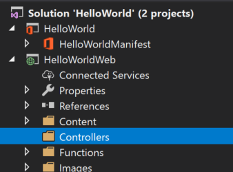
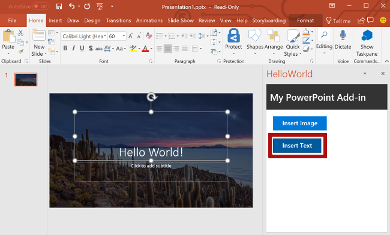

# <a name="tutorial-create-a-powerpoint-task-pane-add-in"></a><span data-ttu-id="73c2c-103">Tutorial: Criar um Suplemento do Painel de Tarefas</span><span class="sxs-lookup"><span data-stu-id="73c2c-103">Tutorial: Create a PowerPoint task pane add-in</span></span>

<span data-ttu-id="73c2c-104">Neste tutorial, você usará o Visual Studio para criar um Suplementos do Painel de Tarefas do PowerPoint:</span><span class="sxs-lookup"><span data-stu-id="73c2c-104">In this tutorial, you'll use Visual Studio to create an PowerPoint task pane add-in that:</span></span>

> [!div class="checklist"]
> * <span data-ttu-id="73c2c-105">Adicionar a foto do dia do [Bing](https://www.bing.com) a um slide</span><span class="sxs-lookup"><span data-stu-id="73c2c-105">Adds the [Bing](https://www.bing.com) photo of the day to a slide</span></span>
> * <span data-ttu-id="73c2c-106">Adicionar texto a um slide</span><span class="sxs-lookup"><span data-stu-id="73c2c-106">Adds text to a slide</span></span>
> * <span data-ttu-id="73c2c-107">Obtém metadados do slide</span><span class="sxs-lookup"><span data-stu-id="73c2c-107">Gets slide metadata</span></span>
> * <span data-ttu-id="73c2c-108">Navega entre slides</span><span class="sxs-lookup"><span data-stu-id="73c2c-108">Navigates between slides</span></span>

## <a name="prerequisites"></a><span data-ttu-id="73c2c-109">Pré-requisitos</span><span class="sxs-lookup"><span data-stu-id="73c2c-109">Prerequisites</span></span>

[!include[Quick Start prerequisites](../includes/quickstart-vs-prerequisites.md)]

## <a name="create-your-add-in-project"></a><span data-ttu-id="73c2c-110">Criar seu projeto do suplemento</span><span class="sxs-lookup"><span data-stu-id="73c2c-110">Create your add-in project</span></span>

<span data-ttu-id="73c2c-111">Conclua as etapas a seguir para criar um projeto de suplemento do PowerPoint usando o Visual Studio.</span><span class="sxs-lookup"><span data-stu-id="73c2c-111">Complete the following steps to create a PowerPoint add-in project using Visual Studio.</span></span>

1. <span data-ttu-id="73c2c-112">Na barra de menus do Visual Studio, selecione **Arquivo**  >  **Novo**  >  **Projeto**.</span><span class="sxs-lookup"><span data-stu-id="73c2c-112">On the Visual Studio menu bar, choose  **File** > **New** > **Project**.</span></span>
    
2. <span data-ttu-id="73c2c-113">Na lista de tipos de projeto em **Visual C#** ou no **Visual Basic**, expanda a opção **Office/SharePoint**, escolha **Suplementos** e depois **Suplemento da Web do PowerPoint** como o tipo de projeto.</span><span class="sxs-lookup"><span data-stu-id="73c2c-113">In the list of project types under **Visual C#** or **Visual Basic**, expand  **Office/SharePoint**, choose **Add-ins**, and then choose **PowerPoint Web Add-in** as the project type.</span></span> 

3. <span data-ttu-id="73c2c-114">Nomeie o projeto como **HelloWorld** e depois selecione o botão **OK**.</span><span class="sxs-lookup"><span data-stu-id="73c2c-114">Name the project **HelloWorld**, and then choose the **OK** button.</span></span>

4. <span data-ttu-id="73c2c-115">Na caixa de diálogo **Criar suplementos do Office**, escolha **Adicionar novas funcionalidades ao PowerPoint**e depois **Concluir** para criar o projeto.</span><span class="sxs-lookup"><span data-stu-id="73c2c-115">In the **Create Office Add-in** dialog window, choose **Add new functionalities to PowerPoint**, and then choose **Finish** to create the project.</span></span>

5. <span data-ttu-id="73c2c-p101">O Visual Studio cria uma solução, e os dois projetos dele são exibidos no **Gerenciador de Soluções**. O arquivo **Home.html** é aberto no Visual Studio.</span><span class="sxs-lookup"><span data-stu-id="73c2c-p101">Visual Studio creates a solution and its two projects appear in **Solution Explorer**. The **Home.html** file opens in Visual Studio.</span></span>

     

### <a name="explore-the-visual-studio-solution"></a><span data-ttu-id="73c2c-119">Explorar a solução do Visual Studio</span><span class="sxs-lookup"><span data-stu-id="73c2c-119">Explore the Visual Studio solution</span></span>

[!include[Description of Visual Studio projects](../includes/quickstart-vs-solution.md)]

### <a name="update-code"></a><span data-ttu-id="73c2c-120">Código de atualização</span><span class="sxs-lookup"><span data-stu-id="73c2c-120">Update code</span></span> 

<span data-ttu-id="73c2c-121">Edite o código do suplemento como mostrado a seguir para criar a estrutura que você usará para implementar a funcionalidade do suplemento nas etapas subsequentes deste tutorial.</span><span class="sxs-lookup"><span data-stu-id="73c2c-121">Edit the add-in code as follows to create the framework that you'll use to implement add-in functionality in subsequent steps of this tutorial.</span></span>

1. <span data-ttu-id="73c2c-p102">**Home.html** especifica o HTML que será renderizado no painel de tarefas do suplemento. Em **Home.html**, encontre a **div** com `id="content-main"`, substitua toda essa **div** pela marcação a seguir e salve o arquivo.</span><span class="sxs-lookup"><span data-stu-id="73c2c-p102">**Home.html** specifies the HTML that will be rendered in the add-in's task pane. In **Home.html**, find the **div** with `id="content-main"`, replace that entire **div** with the following markup, and save the file.</span></span>

    ```html
    <!-- TODO2: Create the content-header div. -->
    <div id="content-main">
        <div class="padding">
            <!-- TODO1: Create the insert-image button. -->
            <!-- TODO3: Create the insert-text button. -->
            <!-- TODO4: Create the get-slide-metadata button. -->
            <!-- TODO5: Create the go-to-slide buttons. -->
        </div>
    </div>
    ```

2. <span data-ttu-id="73c2c-p103">Abra o arquivo **Home.js** na raiz do projeto do aplicativo Web. Este arquivo especifica o script do suplemento. Substitua todo o conteúdo pelo código a seguir e salve o arquivo.</span><span class="sxs-lookup"><span data-stu-id="73c2c-p103">Open the file **Home.js** in the root of the web application project. This file specifies the script for the add-in. Replace the entire contents with the following code and save the file.</span></span>

    ```javascript
    (function () {
        "use strict";

        var messageBanner;

        Office.initialize = function (reason) {
            $(document).ready(function () {
                // Initialize the FabricUI notification mechanism and hide it
                var element = document.querySelector('.ms-MessageBanner');
                messageBanner = new fabric.MessageBanner(element);
                messageBanner.hideBanner();

                // TODO1: Assign event handler for insert-image button.
                // TODO4: Assign event handler for insert-text button.
                // TODO6: Assign event handler for get-slide-metadata button.
                // TODO8: Assign event handlers for the four navigation buttons.
            });
        };

        // TODO2: Define the insertImage function. 

        // TODO3: Define the insertImageFromBase64String function.

        // TODO5: Define the insertText function.

        // TODO7: Define the getSlideMetadata function.

        // TODO9: Define the navigation functions.

        // Helper function for displaying notifications
        function showNotification(header, content) {
            $("#notification-header").text(header);
            $("#notification-body").text(content);
            messageBanner.showBanner();
            messageBanner.toggleExpansion();
        }
    })();
    ```

## <a name="insert-an-image"></a><span data-ttu-id="73c2c-127">Inserir uma imagem</span><span class="sxs-lookup"><span data-stu-id="73c2c-127">Insert an image</span></span>

<span data-ttu-id="73c2c-128">Conclua as seguintes etapas para adicionar o código que recupera a foto do dia do [Bing](https://www.bing.com) e inserir as imagens em um slide.</span><span class="sxs-lookup"><span data-stu-id="73c2c-128">Complete the following steps to add code that retrieves the [Bing](https://www.bing.com) photo of the day and inserts that image into a slide.</span></span>

1. <span data-ttu-id="73c2c-129">Usando o Explorador de soluções, adicione uma nova pasta chamada **Controladores** ao projeto **HelloWorldWeb**.</span><span class="sxs-lookup"><span data-stu-id="73c2c-129">Using Solution Explorer, add a new folder named **Controllers** to the **HelloWorldWeb** project.</span></span>

    

2. <span data-ttu-id="73c2c-131">Clique com o botão direito do mouse na pasta **Controladores** e selecione **Adicionar > Novo item com scaffold...**.</span><span class="sxs-lookup"><span data-stu-id="73c2c-131">Right-click the **Controllers** folder and select **Add > New Scaffolded Item...**.</span></span>

3. <span data-ttu-id="73c2c-132">Na janela da caixa de diálogo **Adicionar Scaffold**, selecione **Controlador da Web API 2 – vazio** e escolha o botão **Adicionar**.</span><span class="sxs-lookup"><span data-stu-id="73c2c-132">In the **Add Scaffold** dialog window, select **Web API 2 Controller - Empty** and choose the **Add** button.</span></span> 

4. <span data-ttu-id="73c2c-p104">Na janela da caixa de diálogo **Adicionar Controlador**, insira **PhotoController** como nome do controlador e escolha o botão **Adicionar**. O Visual Studio criará e abrirá o arquivo **PhotoController.cs**.</span><span class="sxs-lookup"><span data-stu-id="73c2c-p104">In the **Add Controller** dialog window, enter **PhotoController** as the controller name and choose the **Add** button. Visual Studio creates and opens the **PhotoController.cs** file.</span></span>

5. <span data-ttu-id="73c2c-p105">Substitua todo o conteúdo do arquivo **PhotoController.cs** pelo código a seguir, que chama o serviço do Bing para recuperar a foto do dia como uma cadeia de caracteres com codificação Base64. Quando você usar a API JavaScript do Office para inserir uma imagem em um documento, especifique os dados de imagem como uma cadeia de caracteres com codificação Base64.</span><span class="sxs-lookup"><span data-stu-id="73c2c-p105">Replace the entire contents of the **PhotoController.cs** file with the following code that calls the Bing service to retrieve the photo of the day as a Base64 encoded string. When you use the Office JavaScript API to insert an image into a document, the image data must be specified as a Base64 encoded string.</span></span>

    ```csharp
    using System;
    using System.IO;
    using System.Net;
    using System.Text;
    using System.Web.Http;
    using System.Xml;

    namespace HelloWorldWeb.Controllers
    {
        public class PhotoController : ApiController
        {
            public string Get()
            {
                string url = "http://www.bing.com/HPImageArchive.aspx?format=xml&idx=0&n=1";

                // Create the request.
                HttpWebRequest request = (HttpWebRequest)WebRequest.Create(url);
                WebResponse response = request.GetResponse();

                using (Stream responseStream = response.GetResponseStream())
                {
                    // Process the result.
                    StreamReader reader = new StreamReader(responseStream, Encoding.UTF8);
                    string result = reader.ReadToEnd();

                    // Parse the xml response and to get the URL.
                    XmlDocument doc = new XmlDocument();
                    doc.LoadXml(result);
                    string photoURL = "http://bing.com" + doc.SelectSingleNode("/images/image/url").InnerText;

                    // Fetch the photo and return it as a Base64 encoded string.
                    return getPhotoFromURL(photoURL);
                }
            }

            private string getPhotoFromURL(string imageURL)
            {
                var webClient = new WebClient();
                byte[] imageBytes = webClient.DownloadData(imageURL);
                return Convert.ToBase64String(imageBytes);
            }
        }
    }
    ```

6. <span data-ttu-id="73c2c-p106">No arquivo **Home.html**, substitua `TODO1` pela marcação a seguir. Essa marcação define o botão **Inserir Imagem** que aparecerá no painel de tarefas do suplemento.</span><span class="sxs-lookup"><span data-stu-id="73c2c-p106">In the **Home.html** file, replace `TODO1` with the following markup. This markup defines the **Insert Image** button that will appear within the add-in's task pane.</span></span>

    ```html
    <button class="ms-Button ms-Button--primary" id="insert-image">
        <span class="ms-Button-icon"><i class="ms-Icon ms-Icon--plus"></i></span>
        <span class="ms-Button-label">Insert Image</span>
        <span class="ms-Button-description">Gets the photo of the day that shows on the Bing home page and adds it to the slide.</span>
    </button>
    ```

7. <span data-ttu-id="73c2c-139">No arquivo **Home.js**, substitua `TODO1` pelo código a seguir para atribuir o manipulador de eventos ao botão **Inserir Imagem**.</span><span class="sxs-lookup"><span data-stu-id="73c2c-139">In the **Home.js** file, replace `TODO1` with the following code to assign the event handler for the **Insert Image** button.</span></span>

    ```javascript
    $('#insert-image').click(insertImage);
    ```

8. <span data-ttu-id="73c2c-p107">No arquivo **Home.js**, substitua `TODO2` pelo código a seguir para definir a função **insertImage**. Esta função busca a imagem do serviço Web Bing e chama a função `insertImageFromBase64String` para inserir a imagem no documento.</span><span class="sxs-lookup"><span data-stu-id="73c2c-p107">In the **Home.js** file, replace `TODO2` with the following code to define the **insertImage** function. This function fetches the image from the Bing web service and then calls the `insertImageFromBase64String` function to insert that image into the document.</span></span>

    ```javascript
    function insertImage() {
        // Get image from from web service (as a Base64 encoded string).
        $.ajax({
            url: "/api/Photo/", success: function (result) {
                insertImageFromBase64String(result);
            }, error: function (xhr, status, error) {
                showNotification("Error", "Oops, something went wrong.");
            }
        });
    }
    ```

9. <span data-ttu-id="73c2c-p108">No arquivo **Home.js**, substitua `TODO3` pelo código a seguir para definir a função `insertImageFromBase64String`. Esta função usa a API JavaScript do Office para inserir a imagem no documento. Observação:</span><span class="sxs-lookup"><span data-stu-id="73c2c-p108">In the **Home.js** file, replace `TODO3` with the following code to define the `insertImageFromBase64String` function. This function uses the Office JavaScript API to insert the image into the document. Note:</span></span> 

    - <span data-ttu-id="73c2c-145">A opção `coercionType` especificada como segundo parâmetro da solicitação `setSelectedDataAsyc` indica o tipo de dados inserido.</span><span class="sxs-lookup"><span data-stu-id="73c2c-145">The `coercionType` option that's specified as the second parameter of the `setSelectedDataAsyc` request indicates the type of data being inserted.</span></span> 

    - <span data-ttu-id="73c2c-146">O objeto `asyncResult` encapsula o resultado da solicitação `setSelectedDataAsync`, incluindo informações de status e de erro caso a solicitação tenha falhado.</span><span class="sxs-lookup"><span data-stu-id="73c2c-146">The `asyncResult` object encapsulates the result of the `setSelectedDataAsync` request, including status and error information if the request failed.</span></span>

    ```javascript
    function insertImageFromBase64String(image) {
        // Call Office.js to insert the image into the document.
        Office.context.document.setSelectedDataAsync(image, {
            coercionType: Office.CoercionType.Image
        },
            function (asyncResult) {
                if (asyncResult.status === Office.AsyncResultStatus.Failed) {
                    showNotification("Error", asyncResult.error.message);
                }
            });
    }
    ```

### <a name="test-the-add-in"></a><span data-ttu-id="73c2c-147">Testar o suplemento</span><span class="sxs-lookup"><span data-stu-id="73c2c-147">Test the add-in</span></span>

1. <span data-ttu-id="73c2c-p109">Usando o Visual Studio, teste o suplemento do PowerPoint recém-criado, pressionando **F5** ou escolhendo o botão **Iniciar** para abrir o PowerPoint com o botão de suplemento **Mostrar Painel de Tarefas** exibido na faixa de opções. O suplemento será hospedado localmente no IIS.</span><span class="sxs-lookup"><span data-stu-id="73c2c-p109">Using Visual Studio, test the newly created PowerPoint add-in by pressing **F5** or choosing the **Start** button to launch PowerPoint with the **Show Taskpane** add-in button displayed in the ribbon. The add-in will be hosted locally on IIS.</span></span>

    

2. <span data-ttu-id="73c2c-151">No PowerPoint, selecione o botão **Mostrar Painel de Tarefas** na faixa de opções para abrir o painel de tarefas do suplemento.</span><span class="sxs-lookup"><span data-stu-id="73c2c-151">In PowerPoint, select the **Show Taskpane** button in the ribbon to open the add-in task pane.</span></span>

    

3. <span data-ttu-id="73c2c-153">No painel de tarefas, escolha o botão **Inserir Imagem** para adicionar a foto do dia do Bing ao slide atual.</span><span class="sxs-lookup"><span data-stu-id="73c2c-153">In the task pane, choose the **Insert Image** button to add the Bing photo of the day to the current slide.</span></span>

    

4. <span data-ttu-id="73c2c-155">No Visual Studio, interrompa o suplemento pressionando **Shift + F5** ou selecionando o botão **Parar**.</span><span class="sxs-lookup"><span data-stu-id="73c2c-155">In Visual Studio, stop the add-in by pressing **Shift + F5** or choosing the **Stop** button.</span></span> <span data-ttu-id="73c2c-156">O PowerPoint fechará automaticamente quando o suplemento for interrompido.</span><span class="sxs-lookup"><span data-stu-id="73c2c-156">PowerPoint will automatically close when the add-in is stopped.</span></span>

    

## <a name="customize-user-interface-ui-elements"></a><span data-ttu-id="73c2c-158">Personalizar os elementos da IU (interface do usuário)</span><span class="sxs-lookup"><span data-stu-id="73c2c-158">Customize User Interface (UI) elements</span></span>

<span data-ttu-id="73c2c-159">Conclua as seguintes etapas para adicionar a marca que personaliza o painel de tarefas da interface do usuário.</span><span class="sxs-lookup"><span data-stu-id="73c2c-159">Complete the following steps to add markup that customizes the task pane UI.</span></span>

1. <span data-ttu-id="73c2c-p111">No arquivo **Home.html**, substitua `TODO2` pela marcação a seguir para adicionar uma seção de cabeçalho e um título ao painel de tarefas. Observação:</span><span class="sxs-lookup"><span data-stu-id="73c2c-p111">In the **Home.html** file, replace `TODO2` with the following markup to add a header section and title to the task pane. Note:</span></span>

    - <span data-ttu-id="73c2c-p112">Os estilos que começam com `ms-` são definidos pelo [Office UI Fabric](../design/office-ui-fabric.md), uma estrutura de front-end JavaScript para criar experiências do usuário do Office e Office 365. O arquivo **Home.html** inclui uma referência à folha de estilos do Fabric.</span><span class="sxs-lookup"><span data-stu-id="73c2c-p112">The styles that begin with `ms-` are defined by [Office UI Fabric](../design/office-ui-fabric.md), a JavaScript front-end framework for building user experiences for Office and Office 365. The **Home.html** file includes a reference to the Fabric stylesheet.</span></span>

    ```html
    <div id="content-header">
        <div class="ms-Grid ms-bgColor-neutralPrimary">
            <div class="ms-Grid-row">
                <div class="padding ms-Grid-col ms-u-sm12 ms-u-md12 ms-u-lg12"> <div class="ms-font-xl ms-fontColor-white ms-fontWeight-semibold">My PowerPoint add-in</div></div>
            </div>
        </div>
    </div>
    ```

2. <span data-ttu-id="73c2c-164">No arquivo **Home.html**, localize a **div** com `class="footer"` e exclua toda a **div** para remover a seção de rodapé do painel de tarefas.</span><span class="sxs-lookup"><span data-stu-id="73c2c-164">In the **Home.html** file, find the **div** with `class="footer"` and delete that entire **div** to remove the footer section from the task pane.</span></span>

### <a name="test-the-add-in"></a><span data-ttu-id="73c2c-165">Testar o suplemento</span><span class="sxs-lookup"><span data-stu-id="73c2c-165">Test the add-in</span></span>

1. <span data-ttu-id="73c2c-166">Usando o Visual Studio, teste o suplemento do PowerPoint ao pressionar **F5** ou escolha o botão **Iniciar** para abrir o PowerPoint com o botão de suplemento **Mostrar painel de tarefas** exibido na faixa de opções.</span><span class="sxs-lookup"><span data-stu-id="73c2c-166">Using Visual Studio, test the PowerPoint add-in by pressing **F5** or choosing the **Start** button to launch PowerPoint with the **Show Taskpane** add-in button displayed in the ribbon.</span></span> <span data-ttu-id="73c2c-167">O suplemento será hospedado localmente no IIS.</span><span class="sxs-lookup"><span data-stu-id="73c2c-167">The add-in will be hosted locally on IIS.</span></span>

    

2. <span data-ttu-id="73c2c-169">No PowerPoint, selecione o botão **Mostrar Painel de Tarefas** na faixa de opções para abrir o painel de tarefas do suplemento.</span><span class="sxs-lookup"><span data-stu-id="73c2c-169">In PowerPoint, select the **Show Taskpane** button in the ribbon to open the add-in task pane.</span></span>

    

3. <span data-ttu-id="73c2c-171">Observe que agora o painel de tarefas contém uma seção de cabeçalho e um título e não contém mais uma seção de rodapé.</span><span class="sxs-lookup"><span data-stu-id="73c2c-171">Notice that the task pane now contains a header section and title, and no longer contains a footer section.</span></span>

    

4. <span data-ttu-id="73c2c-173">No Visual Studio, interrompa o suplemento pressionando **Shift + F5** ou selecionando o botão **Parar**.</span><span class="sxs-lookup"><span data-stu-id="73c2c-173">In Visual Studio, stop the add-in by pressing **Shift + F5** or choosing the **Stop** button.</span></span> <span data-ttu-id="73c2c-174">O PowerPoint fechará automaticamente quando o suplemento for interrompido.</span><span class="sxs-lookup"><span data-stu-id="73c2c-174">PowerPoint will automatically close when the add-in is stopped.</span></span>

    

## <a name="insert-text"></a><span data-ttu-id="73c2c-176">Inserir texto</span><span class="sxs-lookup"><span data-stu-id="73c2c-176">Insert text</span></span>

<span data-ttu-id="73c2c-177">Conclua as seguintes etapas para adicionar o código que insere texto no slide de título que contém as fotos do dia do [Bing](https://www.bing.com).</span><span class="sxs-lookup"><span data-stu-id="73c2c-177">Complete the following steps to add code that inserts text into the title slide which contains the [Bing](https://www.bing.com) photo of the day.</span></span>

1. <span data-ttu-id="73c2c-p115">No arquivo **Home.html**, substitua `TODO3` pela marcação a seguir. Essa marcação define o botão **Inserir Texto** que aparecerá no painel de tarefas do suplemento.</span><span class="sxs-lookup"><span data-stu-id="73c2c-p115">In the **Home.html** file, replace `TODO3` with the following markup. This markup defines the **Insert Text** button that will appear within the add-in's task pane.</span></span>

    ```html
        <br /><br />
        <button class="ms-Button ms-Button--primary" id="insert-text">
            <span class="ms-Button-icon"><i class="ms-Icon ms-Icon--plus"></i></span>
            <span class="ms-Button-label">Insert Text</span>
            <span class="ms-Button-description">Inserts text into the slide.</span>
        </button>
    ```

2. <span data-ttu-id="73c2c-180">No arquivo **Home.js**, substitua `TODO4` pelo código a seguir para atribuir o manipulador de eventos ao botão **Inserir Texto**.</span><span class="sxs-lookup"><span data-stu-id="73c2c-180">In the **Home.js** file, replace `TODO4` with the following code to assign the event handler for the **Insert Text** button.</span></span>

    ```javascript
    $('#insert-text').click(insertText);
    ```

3. <span data-ttu-id="73c2c-p116">No arquivo **Home.js**, substitua `TODO5` pelo código a seguir para definir a função **insertText**. Esta função insere texto no slide atual.</span><span class="sxs-lookup"><span data-stu-id="73c2c-p116">In the **Home.js** file, replace `TODO5` with the following code to define the **insertText** function. This function inserts text into the current slide.</span></span>

    ```javascript
    function insertText() {
        Office.context.document.setSelectedDataAsync('Hello World!',
            function (asyncResult) {
                if (asyncResult.status === Office.AsyncResultStatus.Failed) {
                    showNotification("Error", asyncResult.error.message);
                }
            });
    }
    ```

### <a name="test-the-add-in"></a><span data-ttu-id="73c2c-183">Testar o suplemento</span><span class="sxs-lookup"><span data-stu-id="73c2c-183">Test the add-in</span></span>

1. <span data-ttu-id="73c2c-184">Usando o Visual Studio, teste o suplemento ao pressionar **F5** ou escolha o botão **Iniciar** para abrir o PowerPoint com o botão de suplemento **Mostrar painel de tarefas** exibido na faixa de opções.</span><span class="sxs-lookup"><span data-stu-id="73c2c-184">Using Visual Studio, test the add-in by pressing **F5** or choosing the **Start** button to launch PowerPoint with the **Show Taskpane** add-in button displayed in the ribbon.</span></span> <span data-ttu-id="73c2c-185">O suplemento será hospedado localmente no IIS.</span><span class="sxs-lookup"><span data-stu-id="73c2c-185">The add-in will be hosted locally on IIS.</span></span>

    

2. <span data-ttu-id="73c2c-187">No PowerPoint, selecione o botão **Mostrar Painel de Tarefas** na faixa de opções para abrir o painel de tarefas do suplemento.</span><span class="sxs-lookup"><span data-stu-id="73c2c-187">In PowerPoint, select the **Show Taskpane** button in the ribbon to open the add-in task pane.</span></span>

    

3. <span data-ttu-id="73c2c-189">No painel de tarefas, escolha o botão **Inserir Imagem** para adicionar a foto do dia do Bing ao slide atual e escolher um design para o slide que contém uma caixa de texto como título.</span><span class="sxs-lookup"><span data-stu-id="73c2c-189">In the task pane, choose the **Insert Image** button to add the Bing photo of the day to the current slide and choose a design for the slide that contains a text box for the title.</span></span>

    

4. <span data-ttu-id="73c2c-191">Coloque o cursor na caixa de texto no slide de título e depois, no painel de tarefas, escolha o botão **Inserir Texto** para adicionar texto ao slide.</span><span class="sxs-lookup"><span data-stu-id="73c2c-191">Put your cursor in the text box on the title slide and then in the task pane, choose the **Insert Text** button to add text to the slide.</span></span>

    


5. <span data-ttu-id="73c2c-193">No Visual Studio, interrompa o suplemento pressionando **Shift + F5** ou selecionando o botão **Parar**.</span><span class="sxs-lookup"><span data-stu-id="73c2c-193">In Visual Studio, stop the add-in by pressing **Shift + F5** or choosing the **Stop** button.</span></span> <span data-ttu-id="73c2c-194">O PowerPoint fechará automaticamente quando o suplemento for interrompido.</span><span class="sxs-lookup"><span data-stu-id="73c2c-194">PowerPoint will automatically close when the add-in is stopped.</span></span>

    

## <a name="get-slide-metadata"></a><span data-ttu-id="73c2c-196">Obter metadados do slide</span><span class="sxs-lookup"><span data-stu-id="73c2c-196">Get slide metadata</span></span>

<span data-ttu-id="73c2c-197">Conclua as seguintes etapas para adicionar o código que recupera os metadados para o slide selecionado.</span><span class="sxs-lookup"><span data-stu-id="73c2c-197">Complete the following steps to add code that retrieves metadata for the selected slide.</span></span>

1. <span data-ttu-id="73c2c-p119">No arquivo **Home.html**, substitua `TODO4` pela marcação a seguir. Essa marcação define o botão **Obter metadados do slide** que aparecerá no painel de tarefas do suplemento.</span><span class="sxs-lookup"><span data-stu-id="73c2c-p119">In the **Home.html** file, replace `TODO4` with the following markup. This markup defines the **Get Slide Metadata** button that will appear within the add-in's task pane.</span></span>

    ```html
    <br /><br />
    <button class="ms-Button ms-Button--primary" id="get-slide-metadata">
        <span class="ms-Button-icon"><i class="ms-Icon ms-Icon--plus"></i></span>
        <span class="ms-Button-label">Get Slide Metadata</span>
        <span class="ms-Button-description">Gets metadata for the selected slide(s).</span>
    </button>
    ```

2. <span data-ttu-id="73c2c-200">No arquivo **Home.js**, substitua `TODO6` pelo código a seguir para atribuir o manipulador de eventos para o botão **Obter Metadados do Slide**.</span><span class="sxs-lookup"><span data-stu-id="73c2c-200">In the **Home.js** file, replace `TODO6` with the following code to assign the event handler for the **Get Slide Metadata** button.</span></span>

    ```javascript
    $('#get-slide-metadata').click(getSlideMetadata);
    ```

3. <span data-ttu-id="73c2c-p120">No arquivo **Home.js**, substitua `TODO7` pelo código a seguir para definir a função **getSlideMetadata**. Esta função recupera metadados dos slides selecionados e os grava em uma janela pop-up da caixa de diálogo no painel de tarefas do suplemento.</span><span class="sxs-lookup"><span data-stu-id="73c2c-p120">In the **Home.js** file, replace `TODO7` with the following code to define the **getSlideMetadata** function. This function retrieves metadata for the selected slide(s) and writes it to a popup dialog window within the add-in task pane.</span></span>

    ```javascript
    function getSlideMetadata() {
        Office.context.document.getSelectedDataAsync(Office.CoercionType.SlideRange,
            function (asyncResult) {
                if (asyncResult.status === Office.AsyncResultStatus.Failed) {
                    showNotification("Error", asyncResult.error.message);
                } else {
                    showNotification("Metadata for selected slide(s):", JSON.stringify(asyncResult.value), null, 2);
                }
            }
        );
    }
    ```

### <a name="test-the-add-in"></a><span data-ttu-id="73c2c-203">Testar o suplemento</span><span class="sxs-lookup"><span data-stu-id="73c2c-203">Test the add-in</span></span>

1. <span data-ttu-id="73c2c-204">Usando o Visual Studio, teste o suplemento ao pressionar **F5** ou escolha o botão **Iniciar** para abrir o PowerPoint com o botão de suplemento **Mostrar painel de tarefas** exibido na faixa de opções.</span><span class="sxs-lookup"><span data-stu-id="73c2c-204">Using Visual Studio, test the add-in by pressing **F5** or choosing the **Start** button to launch PowerPoint with the **Show Taskpane** add-in button displayed in the ribbon.</span></span> <span data-ttu-id="73c2c-205">O suplemento será hospedado localmente no IIS.</span><span class="sxs-lookup"><span data-stu-id="73c2c-205">The add-in will be hosted locally on IIS.</span></span>

    

2. <span data-ttu-id="73c2c-207">No PowerPoint, selecione o botão **Mostrar Painel de Tarefas** na faixa de opções para abrir o painel de tarefas do suplemento.</span><span class="sxs-lookup"><span data-stu-id="73c2c-207">In PowerPoint, select the **Show Taskpane** button in the ribbon to open the add-in task pane.</span></span>

    

3. <span data-ttu-id="73c2c-p122">No painel de tarefas, escolha o botão **Obter metadados do slide** para obter os metadados do slide selecionado. Os metadados do slide serão gravados na janela pop-up da caixa de diálogo na parte inferior do painel de tarefas. Nesse caso, a matriz `slides` dos metadados JSON contém um objeto que especifica `id`, `title` e `index` do slide selecionado. Se vários slides tivessem sido selecionados na recuperação de metadados do slide, a matriz `slides` dos metadados JSON conteria um objeto para cada slide selecionado.</span><span class="sxs-lookup"><span data-stu-id="73c2c-p122">In the task pane, choose the **Get Slide Metadata** button to get the metadata for the selected slide. The slide metadata is written to the popup dialog window at the bottom of the task pane. In this case, the `slides` array within the JSON metadata contains one object that specifies the `id`, `title`, and `index` of the selected slide. If multiple slides had been selected when you retrieved slide metadata, the `slides` array within the JSON metadata would contain one object for each selected slide.</span></span>

    

4. <span data-ttu-id="73c2c-214">No Visual Studio, interrompa o suplemento pressionando **Shift + F5** ou selecionando o botão **Parar**.</span><span class="sxs-lookup"><span data-stu-id="73c2c-214">In Visual Studio, stop the add-in by pressing **Shift + F5** or choosing the **Stop** button.</span></span> <span data-ttu-id="73c2c-215">O PowerPoint fechará automaticamente quando o suplemento for interrompido.</span><span class="sxs-lookup"><span data-stu-id="73c2c-215">PowerPoint will automatically close when the add-in is stopped.</span></span>

    

## <a name="navigate-between-slides"></a><span data-ttu-id="73c2c-217">Navegar entre slides</span><span class="sxs-lookup"><span data-stu-id="73c2c-217">Navigate between slides</span></span>

<span data-ttu-id="73c2c-218">Conclua as seguintes etapas para adicionar o código que navega entre os slides de um documento.</span><span class="sxs-lookup"><span data-stu-id="73c2c-218">Complete the following steps to add code that navigates between the slides of a document.</span></span>

1. <span data-ttu-id="73c2c-p124">No arquivo **Home.html**, substitua `TODO5` pela marcação a seguir. Essa marcação define os quatro botões de navegação que aparecerão no painel de tarefas do suplemento.</span><span class="sxs-lookup"><span data-stu-id="73c2c-p124">In the **Home.html** file, replace `TODO5` with the following markup. This markup defines the four navigation buttons that will appear within the add-in's task pane.</span></span>

    ```html
    <br /><br />
    <button class="ms-Button ms-Button--primary" id="go-to-first-slide">
        <span class="ms-Button-icon"><i class="ms-Icon ms-Icon--plus"></i></span>
        <span class="ms-Button-label">Go to First Slide</span>
        <span class="ms-Button-description">Go to the first slide.</span>
    </button>
    <br /><br />
    <button class="ms-Button ms-Button--primary" id="go-to-next-slide">
        <span class="ms-Button-icon"><i class="ms-Icon ms-Icon--plus"></i></span>
        <span class="ms-Button-label">Go to Next Slide</span>
        <span class="ms-Button-description">Go to the next slide.</span>
    </button>
    <br /><br />
    <button class="ms-Button ms-Button--primary" id="go-to-previous-slide">
        <span class="ms-Button-icon"><i class="ms-Icon ms-Icon--plus"></i></span>
        <span class="ms-Button-label">Go to Previous Slide</span>
        <span class="ms-Button-description">Go to the previous slide.</span>
    </button>
    <br /><br />
    <button class="ms-Button ms-Button--primary" id="go-to-last-slide">
        <span class="ms-Button-icon"><i class="ms-Icon ms-Icon--plus"></i></span>
        <span class="ms-Button-label">Go to Last Slide</span>
        <span class="ms-Button-description">Go to the last slide.</span>
    </button>
    ```

2. <span data-ttu-id="73c2c-221">No arquivo **Home.js**, substitua `TODO8` pelo código a seguir para atribuir o manipulador de eventos aos quatro botões de navegação.</span><span class="sxs-lookup"><span data-stu-id="73c2c-221">In the **Home.js** file, replace `TODO8` with the following code to assign the event handlers for the four navigation buttons.</span></span>

    ```javascript
    $('#go-to-first-slide').click(goToFirstSlide);
    $('#go-to-next-slide').click(goToNextSlide);
    $('#go-to-previous-slide').click(goToPreviousSlide);
    $('#go-to-last-slide').click(goToLastSlide);
    ```

3. <span data-ttu-id="73c2c-222">No arquivo **Home.js**, substitua `TODO9` pelo código a seguir para definir as funções de navegação.</span><span class="sxs-lookup"><span data-stu-id="73c2c-222">In the **Home.js** file, replace `TODO9` with the following code to define the navigation functions.</span></span> <span data-ttu-id="73c2c-223">Cada uma dessas funções usa a função `goToByIdAsync` para selecionar um slide com base em sua posição no documento (primeiro, último, anterior e próximo).</span><span class="sxs-lookup"><span data-stu-id="73c2c-223">Each of these functions uses the `goToByIdAsync` function to select a slide based upon its position in the document (first, last, previous, and next).</span></span>

    ```javascript
    function goToFirstSlide() {
        Office.context.document.goToByIdAsync(Office.Index.First, Office.GoToType.Index,
            function (asyncResult) {
                if (asyncResult.status == "failed") {
                    showNotification("Error", asyncResult.error.message);
                }
            });
    }

    function goToLastSlide() {
        Office.context.document.goToByIdAsync(Office.Index.Last, Office.GoToType.Index,
            function (asyncResult) {
                if (asyncResult.status == "failed") {
                    showNotification("Error", asyncResult.error.message);
                }
            });
    }

    function goToPreviousSlide() {
        Office.context.document.goToByIdAsync(Office.Index.Previous, Office.GoToType.Index,
            function (asyncResult) {
                if (asyncResult.status == "failed") {
                    showNotification("Error", asyncResult.error.message);
                }
            });
    }

    function goToNextSlide() {
        Office.context.document.goToByIdAsync(Office.Index.Next, Office.GoToType.Index,
            function (asyncResult) {
                if (asyncResult.status == "failed") {
                    showNotification("Error", asyncResult.error.message);
                }
            });
    }
    ```

### <a name="test-the-add-in"></a><span data-ttu-id="73c2c-224">Testar o suplemento</span><span class="sxs-lookup"><span data-stu-id="73c2c-224">Test the add-in</span></span>

1. <span data-ttu-id="73c2c-225">Usando o Visual Studio, teste o suplemento ao pressionar **F5** ou escolha o botão **Iniciar** para abrir o PowerPoint com o botão de suplemento **Mostrar painel de tarefas** exibido na faixa de opções.</span><span class="sxs-lookup"><span data-stu-id="73c2c-225">Using Visual Studio, test the add-in by pressing **F5** or choosing the **Start** button to launch PowerPoint with the **Show Taskpane** add-in button displayed in the ribbon.</span></span> <span data-ttu-id="73c2c-226">O suplemento será hospedado localmente no IIS.</span><span class="sxs-lookup"><span data-stu-id="73c2c-226">The add-in will be hosted locally on IIS.</span></span>

    

2. <span data-ttu-id="73c2c-228">No PowerPoint, selecione o botão **Mostrar Painel de Tarefas** na faixa de opções para abrir o painel de tarefas do suplemento.</span><span class="sxs-lookup"><span data-stu-id="73c2c-228">In PowerPoint, select the **Show Taskpane** button in the ribbon to open the add-in task pane.</span></span>

    


3. <span data-ttu-id="73c2c-230">Use o botão **Novo Slide** na faixa de opções da guia **Página Inicial** para adicionar dois novos slides ao documento.</span><span class="sxs-lookup"><span data-stu-id="73c2c-230">Use the **New Slide** button in the ribbon of the **Home** tab to add two new slides to the document.</span></span> 

4. <span data-ttu-id="73c2c-p127">No painel de tarefas, escolha o botão **Ir para o primeiro Slide**. O primeiro slide no documento é selecionado e exibido.</span><span class="sxs-lookup"><span data-stu-id="73c2c-p127">In the task pane, choose the **Go to First Slide** button. The first slide in the document is selected and displayed.</span></span>

    

5. <span data-ttu-id="73c2c-p128">No painel de tarefas, escolha o botão **Ir para o próximo Slide**. O próximo slide no documento é selecionado e exibido.</span><span class="sxs-lookup"><span data-stu-id="73c2c-p128">In the task pane, choose the **Go to Next Slide** button. The next slide in the document is selected and displayed.</span></span>

    

6. <span data-ttu-id="73c2c-p129">No painel de tarefas, escolha o botão **Ir Para o Slide Anterior**. O slide anterior no documento é selecionado e exibido.</span><span class="sxs-lookup"><span data-stu-id="73c2c-p129">In the task pane, choose the **Go to Previous Slide** button. The previous slide in the document is selected and displayed.</span></span>

    

7. <span data-ttu-id="73c2c-p130">No painel de tarefas, escolha o botão **Ir Para o Último Slide**. O último slide no documento é selecionado e exibido.</span><span class="sxs-lookup"><span data-stu-id="73c2c-p130">In the task pane, choose the **Go to Last Slide** button. The last slide in the document is selected and displayed.</span></span>

    

8. <span data-ttu-id="73c2c-243">No Visual Studio, interrompa o suplemento pressionando **Shift + F5** ou selecionando o botão **Parar**.</span><span class="sxs-lookup"><span data-stu-id="73c2c-243">In Visual Studio, stop the add-in by pressing **Shift + F5** or choosing the **Stop** button.</span></span> <span data-ttu-id="73c2c-244">O PowerPoint fechará automaticamente quando o suplemento for interrompido.</span><span class="sxs-lookup"><span data-stu-id="73c2c-244">PowerPoint will automatically close when the add-in is stopped.</span></span>

    

## <a name="next-steps"></a><span data-ttu-id="73c2c-246">Próximas etapas</span><span class="sxs-lookup"><span data-stu-id="73c2c-246">Next steps</span></span>

<span data-ttu-id="73c2c-247">Neste tutorial, você criou um suplemento do PowerPoint que insere imagem, texto, obtém metadados do slide e navega entre slides.</span><span class="sxs-lookup"><span data-stu-id="73c2c-247">In this tutorial, you've created a PowerPoint add-in that inserts an image, inserts text, gets slide metadata, and navigates between slides.</span></span> <span data-ttu-id="73c2c-248">Para saber mais sobre a criação de suplementos do PowerPoint, continue no seguinte artigo:</span><span class="sxs-lookup"><span data-stu-id="73c2c-248">To learn more about building PowerPoint add-ins, continue to the following article:</span></span>

> [!div class="nextstepaction"]
> [<span data-ttu-id="73c2c-249">Visão geral dos Suplementos do SharePoint</span><span class="sxs-lookup"><span data-stu-id="73c2c-249">PowerPoint add-ins overview</span></span>](../powerpoint/powerpoint-add-ins.md)
