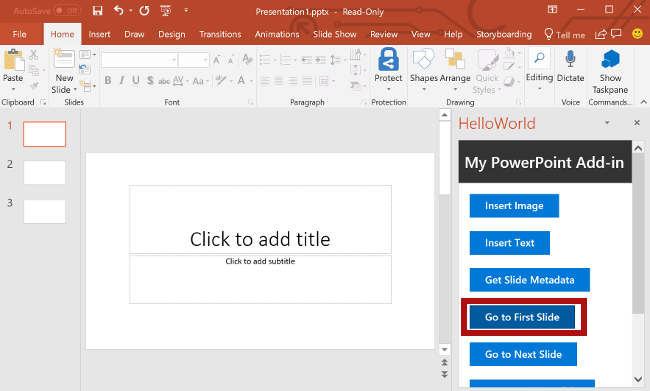

# <a name="tutorial-create-a-powerpoint-task-pane-add-in"></a>Tutorial: Criar um Suplemento do Painel de Tarefas

Neste tutorial, você usará o Visual Studio para criar um Suplementos do Painel de Tarefas do PowerPoint:

> [!div class="checklist"]
>
> - Adicionar a foto do dia do [Bing](https://www.bing.com) a um slide
> - Adicionar texto a um slide
> - Obtém metadados do slide
> - Navega entre slides

## <a name="prerequisites"></a>Pré-requisitos

- [Visual Studio 2019, *versão 16.10.3 ou anterior* ou Visual Studio 2022](https://www.visualstudio.com/vs/), com a carga de trabalho de **Desenvolvimento do Office/SharePoint** instalada.

    > [!IMPORTANT]
    > Algumas versões do Visual Studio 2019 após 16.10.3 têm um bug que impede que esse tutorial seja concluído. Use uma versão anterior do Visual Studio 2019 ou use o Visual Studio 2022.

    > [!NOTE]
    > Se você já instalou o Visual Studio, [use o Instalador do Visual Studio](/visualstudio/install/modify-visual-studio) para garantir que a carga de trabalho **de desenvolvimento do Office/SharePoint** esteja instalada.

- Office conectado a uma assinatura Microsoft 365 (incluindo o Office na web).

    > [!NOTE]
    > Se você ainda não tem o Office, poderá [ingressar no programa para desenvolvedores do Microsoft 365](https://developer.microsoft.com/office/dev-program) para obter uma assinatura do Microsoft 365 gratuita e renovável por 90 dias para usar durante o desenvolvimento.

## <a name="create-your-add-in-project"></a>Criar seu projeto do suplemento

Conclua as etapas a seguir para criar um projeto de suplemento do PowerPoint usando o Visual Studio.

1. Escolha **Criar um novo projeto**.

1. Usando a caixa de pesquisa, insira **suplemento**. Escolha **Suplemento do PowerPoint Web**, em seguida, selecione **Próximo**.

1. Nomeie o projeto como `HelloWorld` e selecione **Criar**.

1. Na caixa de diálogo **Criar suplementos do Office**, escolha **Adicionar novas funcionalidades ao PowerPoint** e depois **Concluir** para criar o projeto.

1. O Visual Studio cria uma solução, e os dois projetos dele são exibidos no **Gerenciador de Soluções**. O arquivo **Home.html** é aberto no Visual Studio.

     

1. Os seguintes pacotes NuGet devem ser instalados. Instale-os usando o **Gerenciador de Pacotes NuGet** no Visual Studio. Consulte a ajuda do Visual Studio para obter instruções. O segundo deles pode ser instalado automaticamente quando você instala o primeiro.

   - Microsoft.AspNet.WebApi.WebHost
   - Microsoft.AspNet.WebApi.Core

### <a name="explore-the-visual-studio-solution"></a>Explorar a solução do Visual Studio

[!include[Description of Visual Studio projects](../includes/quickstart-vs-solution.md)]

### <a name="update-code"></a>Código de atualização

Edite o código do suplemento como mostrado a seguir para criar a estrutura que você usará para implementar a funcionalidade do suplemento nas etapas subsequentes deste tutorial.

1. **Home.html** especifica o HTML que será renderizado no painel de tarefas do suplemento. Em **Home.html**, encontre a **div** com `id="content-main"`, substitua toda essa **div** pela marcação a seguir e salve o arquivo.

    ```html
    <!-- TODO2: Create the content-header div. -->
    <div id="content-main">
        <div class="padding">
            <!-- TODO1: Create the insert-image button. -->
            <!-- TODO3: Create the insert-text button. -->
            <!-- TODO4: Create the get-slide-metadata button. -->
            <!-- TODO5: Create the go-to-slide buttons. -->
        </div>
    </div>
    ```

1. Abra o arquivo **Home.js** na raiz do projeto do aplicativo Web. Este arquivo especifica o script do suplemento. Substitua todo o conteúdo pelo código a seguir e salve o arquivo.

    ```js
    (function () {
        "use strict";

        let messageBanner;

        Office.onReady(function () {
            $(document).ready(function () {
                // Initialize the FabricUI notification mechanism and hide it
                const element = document.querySelector('.MessageBanner');
                messageBanner = new components.MessageBanner(element);
                messageBanner.hideBanner();

                // TODO1: Assign event handler for insert-image button.
                // TODO4: Assign event handler for insert-text button.
                // TODO6: Assign event handler for get-slide-metadata button.
                // TODO8: Assign event handlers for the four navigation buttons.
            });
        });

        // TODO2: Define the insertImage function. 

        // TODO3: Define the insertImageFromBase64String function.

        // TODO5: Define the insertText function.

        // TODO7: Define the getSlideMetadata function.

        // TODO9: Define the navigation functions.

        // Helper function for displaying notifications
        function showNotification(header, content) {
            $("#notification-header").text(header);
            $("#notification-body").text(content);
            messageBanner.showBanner();
            messageBanner.toggleExpansion();
        }
    })();
    ```

## <a name="insert-an-image"></a>Inserir uma imagem

Conclua as seguintes etapas para adicionar o código que recupera a foto do dia do [Bing](https://www.bing.com) e inserir as imagens em um slide.

1. Usando o Explorador de soluções, adicione uma nova pasta chamada **Controladores** ao projeto **HelloWorldWeb**.

    

1. Clique com o botão direito do mouse na pasta **Controladores** e selecione **Adicionar > Novo item com scaffold...**.

1. Na janela da caixa de diálogo **Adicionar Scaffold**, selecione **Controlador da Web API 2 – vazio** e escolha o botão **Adicionar**.

1. Na janela da caixa de diálogo **Adicionar Controlador**, insira **PhotoController** como nome do controlador e escolha o botão **Adicionar**. O Visual Studio criará e abrirá o arquivo **PhotoController.cs**.

    > [!NOTE]
    > O processo de scaffolding não foi concluído corretamente em algumas versões do Visual Studio 2019 após a versão 16.10.3. O Visual Studio 2022 não foi afetado.

1. Substitua todo o conteúdo do arquivo **PhotoController.cs** pelo código a seguir, que chama o serviço do Bing para recuperar a foto do dia como uma cadeia de caracteres com codificação Base64. Quando você usar a API JavaScript do Office para inserir uma imagem em um documento, especifique os dados de imagem como uma cadeia de caracteres com codificação Base64.

    ```csharp
    using System;
    using System.IO;
    using System.Net;
    using System.Text;
    using System.Web.Http;
    using System.Xml;

    namespace HelloWorldWeb.Controllers
    {
        public class PhotoController : ApiController
        {
            public string Get()
            {
                string url = "http://www.bing.com/HPImageArchive.aspx?format=xml&idx=0&n=1";

                // Create the request.
                HttpWebRequest request = (HttpWebRequest)WebRequest.Create(url);
                WebResponse response = request.GetResponse();

                using (Stream responseStream = response.GetResponseStream())
                {
                    // Process the result.
                    StreamReader reader = new StreamReader(responseStream, Encoding.UTF8);
                    string result = reader.ReadToEnd();

                    // Parse the xml response and to get the URL.
                    XmlDocument doc = new XmlDocument();
                    doc.LoadXml(result);
                    string photoURL = "http://bing.com" + doc.SelectSingleNode("/images/image/url").InnerText;

                    // Fetch the photo and return it as a Base64 encoded string.
                    return getPhotoFromURL(photoURL);
                }
            }

            private string getPhotoFromURL(string imageURL)
            {
                var webClient = new WebClient();
                byte[] imageBytes = webClient.DownloadData(imageURL);
                return Convert.ToBase64String(imageBytes);
            }
        }
    }
    ```

1. No arquivo **Home.html**, substitua `TODO1` pela marcação a seguir. Essa marcação define o botão **Inserir Imagem** que aparecerá no painel de tarefas do suplemento.

    ```html
    <button class="Button Button--primary" id="insert-image">
        <span class="Button-icon"><i class="ms-Icon ms-Icon--plus"></i></span>
        <span class="Button-label">Insert Image</span>
        <span class="Button-description">Gets the photo of the day that shows on the Bing home page and adds it to the slide.</span>
    </button>
    ```

1. No arquivo **Home.js**, substitua `TODO1` pelo código a seguir para atribuir o manipulador de eventos ao botão **Inserir Imagem**.

    ```js
    $('#insert-image').click(insertImage);
    ```

1. No arquivo **Home.js**, substitua `TODO2` pelo código a seguir para definir a função `insertImage`. Esta função busca a imagem do serviço Web Bing e chama a função `insertImageFromBase64String` para inserir a imagem no documento.

    ```js
    function insertImage() {
        // Get image from from web service (as a Base64 encoded string).
        $.ajax({
            url: "/api/Photo/", success: function (result) {
                insertImageFromBase64String(result);
            }, error: function (xhr, status, error) {
                showNotification("Error", "Oops, something went wrong.");
            }
        });
    }
    ```

1. No arquivo **Home.js**, substitua `TODO3` pelo código a seguir para definir a função `insertImageFromBase64String`. Esta função usa a API JavaScript do Office para inserir a imagem no documento. Observação:

    - A opção `coercionType` especificada como segundo parâmetro da solicitação `setSelectedDataAsync` indica o tipo de dados inserido.

    - O objeto `asyncResult` encapsula o resultado da solicitação `setSelectedDataAsync`, incluindo informações de status e de erro caso a solicitação tenha falhado.

    ```js
    function insertImageFromBase64String(image) {
        // Call Office.js to insert the image into the document.
        Office.context.document.setSelectedDataAsync(image, {
            coercionType: Office.CoercionType.Image
        },
            function (asyncResult) {
                if (asyncResult.status === Office.AsyncResultStatus.Failed) {
                    showNotification("Error", asyncResult.error.message);
                }
            });
    }
    ```

### <a name="test-the-add-in"></a>Testar o suplemento

1. Usando o Visual Studio, teste o suplemento do PowerPoint recém-criado, pressionando **F5** ou escolhendo o botão **Iniciar** para abrir o PowerPoint com o botão de suplemento **Mostrar Painel de Tarefas** exibido na faixa de opções. O suplemento será hospedado localmente no IIS.

    

1. No PowerPoint, selecione o botão **Mostrar Painel de Tarefas** na faixa de opções para abrir o painel de tarefas do suplemento.

    

1. No painel de tarefas, escolha o botão **Inserir Imagem** para adicionar a foto do dia do Bing ao slide atual.

    

1. No Visual Studio, pare o suplemento pressionando **Shift + F5** ou escolhendo o botão **Parar**. O PowerPoint fechará automaticamente quando o suplemento for interrompido.

    

## <a name="customize-user-interface-ui-elements"></a>Personalizar os elementos da IU (interface do usuário)

Conclua as seguintes etapas para adicionar a marca que personaliza o painel de tarefas da interface do usuário.

1. No arquivo **Home.html**, substitua `TODO2` pela marcação a seguir para adicionar uma seção de cabeçalho e um título ao painel de tarefas. Observação:

    - Os estilos que começam com `ms-` são definidos pelo [Núcleo da Malha em Suplementos do Office](../design/fabric-core.md), uma estrutura de front-end JavaScript para criar experiências do usuário do Office. O arquivo **Home.html** inclui uma referência à folha de estilos do Fabric.

    ```html
    <div id="content-header">
        <div class="ms-Grid ms-bgColor-neutralPrimary">
            <div class="ms-Grid-row">
                <div class="padding ms-Grid-col ms-u-sm12 ms-u-md12 ms-u-lg12"> <div class="ms-font-xl ms-fontColor-white ms-fontWeight-semibold">My PowerPoint add-in</div></div>
            </div>
        </div>
    </div>
    ```

1. No arquivo **Home.html**, localize a **div** com `class="footer"` e exclua toda a **div** para remover a seção de rodapé do painel de tarefas.

### <a name="test-the-add-in"></a>Testar o suplemento

1. Usando o Visual Studio, teste o suplemento do PowerPoint pressionando **F5** ou escolhendo o botão **Iniciar** para abrir o PowerPoint com o botão de suplemento **Mostrar painel de tarefas** exibido na faixa de opções. O suplemento será hospedado localmente no IIS.

    

1. No PowerPoint, selecione o botão **Mostrar Painel de Tarefas** na faixa de opções para abrir o painel de tarefas do suplemento.

    

1. Observe que agora o painel de tarefas contém uma seção de cabeçalho e um título e não contém mais uma seção de rodapé.

    

1. No Visual Studio, pare o suplemento pressionando **Shift + F5** ou escolhendo o botão **Parar**. O PowerPoint fechará automaticamente quando o suplemento for interrompido.

    

## <a name="insert-text"></a>Inserir texto

Conclua as seguintes etapas para adicionar o código que insere texto no slide de título que contém as fotos do dia do [Bing](https://www.bing.com).

1. No arquivo **Home.html**, substitua `TODO3` pela marcação a seguir. Essa marcação define o botão **Inserir Texto** que aparecerá no painel de tarefas do suplemento.

    ```html
        <br /><br />
        <button class="Button Button--primary" id="insert-text">
            <span class="Button-icon"><i class="ms-Icon ms-Icon--plus"></i></span>
            <span class="Button-label">Insert Text</span>
            <span class="Button-description">Inserts text into the slide.</span>
        </button>
    ```

1. No arquivo **Home.js**, substitua `TODO4` pelo código a seguir para atribuir o manipulador de eventos ao botão **Inserir Texto**.

    ```js
    $('#insert-text').click(insertText);
    ```

1. No arquivo **Home.js**, substitua `TODO5` pelo código a seguir para definir a função `insertText`. Esta função insere texto no slide atual.

    ```js
    function insertText() {
        Office.context.document.setSelectedDataAsync('Hello World!',
            function (asyncResult) {
                if (asyncResult.status === Office.AsyncResultStatus.Failed) {
                    showNotification("Error", asyncResult.error.message);
                }
            });
    }
    ```

### <a name="test-the-add-in"></a>Testar o suplemento

1. Usando o Visual Studio, teste o suplemento pressionando **F5** ou escolhendo o botão **Iniciar** para abrir o PowerPoint com o botão de suplemento **Mostrar Painel de Tarefas** exibido na faixa de opções. O suplemento será hospedado localmente no IIS.

    

1. No PowerPoint, selecione o botão **Mostrar Painel de Tarefas** na faixa de opções para abrir o painel de tarefas do suplemento.

    

1. No painel de tarefas, escolha o botão **Inserir Imagem** para adicionar a foto do dia do Bing ao slide atual e escolher um design para o slide que contém uma caixa de texto como título.

    

1. Coloque o cursor na caixa de texto no slide de título e depois, no painel de tarefas, escolha o botão **Inserir Texto** para adicionar texto ao slide.

    

1. No Visual Studio, pare o suplemento pressionando **Shift + F5** ou escolhendo o botão **Parar**. O PowerPoint fechará automaticamente quando o suplemento for interrompido.

    

## <a name="get-slide-metadata"></a>Obter metadados do slide

Conclua as seguintes etapas para adicionar o código que recupera os metadados para o slide selecionado.

1. No arquivo **Home.html**, substitua `TODO4` pela marcação a seguir. Essa marcação define o botão **Obter metadados do slide** que aparecerá no painel de tarefas do suplemento.

    ```html
    <br /><br />
    <button class="Button Button--primary" id="get-slide-metadata">
        <span class="Button-icon"><i class="ms-Icon ms-Icon--plus"></i></span>
        <span class="Button-label">Get Slide Metadata</span>
        <span class="Button-description">Gets metadata for the selected slide(s).</span>
    </button>
    ```

1. No arquivo **Home.js**, substitua `TODO6` pelo código a seguir para atribuir o manipulador de eventos para o botão **Obter Metadados do Slide**.

    ```js
    $('#get-slide-metadata').click(getSlideMetadata);
    ```

1. No arquivo **Home.js**, substitua `TODO7` pelo código a seguir para definir a função `getSlideMetadata`. Esta função recupera metadados dos slides selecionados e os grava em uma janela pop-up da caixa de diálogo no painel de tarefas do suplemento.

    ```js
    function getSlideMetadata() {
        Office.context.document.getSelectedDataAsync(Office.CoercionType.SlideRange,
            function (asyncResult) {
                if (asyncResult.status === Office.AsyncResultStatus.Failed) {
                    showNotification("Error", asyncResult.error.message);
                } else {
                    showNotification("Metadata for selected slide(s):", JSON.stringify(asyncResult.value), null, 2);
                }
            }
        );
    }
    ```

### <a name="test-the-add-in"></a>Testar o suplemento

1. Usando o Visual Studio, teste o suplemento pressionando **F5** ou escolhendo o botão **Iniciar** para abrir o PowerPoint com o botão de suplemento **Mostrar Painel de Tarefas** exibido na faixa de opções. O suplemento será hospedado localmente no IIS.

    

1. No PowerPoint, selecione o botão **Mostrar Painel de Tarefas** na faixa de opções para abrir o painel de tarefas do suplemento.

    

1. No painel de tarefas, escolha o botão **Obter metadados do slide** para obter os metadados do slide selecionado. Os metadados do slide serão gravados na janela pop-up da caixa de diálogo na parte inferior do painel de tarefas. Nesse caso, a matriz `slides` dos metadados JSON contém um objeto que especifica `id`, `title` e `index` do slide selecionado. Se vários slides tivessem sido selecionados na recuperação de metadados do slide, a matriz `slides` dos metadados JSON conteria um objeto para cada slide selecionado.

    

1. No Visual Studio, pare o suplemento pressionando **Shift + F5** ou escolhendo o botão **Parar**. O PowerPoint fechará automaticamente quando o suplemento for interrompido.

    

## <a name="navigate-between-slides"></a>Navegar entre slides

Conclua as seguintes etapas para adicionar o código que navega entre os slides de um documento.

1. No arquivo **Home.html**, substitua `TODO5` pela marcação a seguir. Essa marcação define os quatro botões de navegação que aparecerão no painel de tarefas do suplemento.

    ```html
    <br /><br />
    <button class="Button Button--primary" id="go-to-first-slide">
        <span class="Button-icon"><i class="ms-Icon ms-Icon--plus"></i></span>
        <span class="Button-label">Go to First Slide</span>
        <span class="Button-description">Go to the first slide.</span>
    </button>
    <br /><br />
    <button class="Button Button--primary" id="go-to-next-slide">
        <span class="Button-icon"><i class="ms-Icon ms-Icon--plus"></i></span>
        <span class="Button-label">Go to Next Slide</span>
        <span class="Button-description">Go to the next slide.</span>
    </button>
    <br /><br />
    <button class="Button Button--primary" id="go-to-previous-slide">
        <span class="Button-icon"><i class="ms-Icon ms-Icon--plus"></i></span>
        <span class="Button-label">Go to Previous Slide</span>
        <span class="Button-description">Go to the previous slide.</span>
    </button>
    <br /><br />
    <button class="Button Button--primary" id="go-to-last-slide">
        <span class="Button-icon"><i class="ms-Icon ms-Icon--plus"></i></span>
        <span class="Button-label">Go to Last Slide</span>
        <span class="Button-description">Go to the last slide.</span>
    </button>
    ```

1. No arquivo **Home.js**, substitua `TODO8` pelo código a seguir para atribuir o manipulador de eventos aos quatro botões de navegação.

    ```js
    $('#go-to-first-slide').click(goToFirstSlide);
    $('#go-to-next-slide').click(goToNextSlide);
    $('#go-to-previous-slide').click(goToPreviousSlide);
    $('#go-to-last-slide').click(goToLastSlide);
    ```

1. No arquivo **Home.js**, substitua `TODO9` pelo código a seguir para definir as funções de navegação. Cada uma dessas funções usa o método `goToByIdAsync` para selecionar um slide com base em sua posição no documento (primeiro, último, anterior e próximo).

    ```js
    function goToFirstSlide() {
        Office.context.document.goToByIdAsync(Office.Index.First, Office.GoToType.Index,
            function (asyncResult) {
                if (asyncResult.status == "failed") {
                    showNotification("Error", asyncResult.error.message);
                }
            });
    }

    function goToLastSlide() {
        Office.context.document.goToByIdAsync(Office.Index.Last, Office.GoToType.Index,
            function (asyncResult) {
                if (asyncResult.status == "failed") {
                    showNotification("Error", asyncResult.error.message);
                }
            });
    }

    function goToPreviousSlide() {
        Office.context.document.goToByIdAsync(Office.Index.Previous, Office.GoToType.Index,
            function (asyncResult) {
                if (asyncResult.status == "failed") {
                    showNotification("Error", asyncResult.error.message);
                }
            });
    }

    function goToNextSlide() {
        Office.context.document.goToByIdAsync(Office.Index.Next, Office.GoToType.Index,
            function (asyncResult) {
                if (asyncResult.status == "failed") {
                    showNotification("Error", asyncResult.error.message);
                }
            });
    }
    ```

### <a name="test-the-add-in"></a>Testar o suplemento

1. Usando o Visual Studio, teste o suplemento pressionando **F5** ou escolhendo o botão **Iniciar** para abrir o PowerPoint com o botão de suplemento **Mostrar Painel de Tarefas** exibido na faixa de opções. O suplemento será hospedado localmente no IIS.

    

1. No PowerPoint, selecione o botão **Mostrar Painel de Tarefas** na faixa de opções para abrir o painel de tarefas do suplemento.

    

1. Use o botão **Novo Slide** na faixa de opções da guia **Página Inicial** para adicionar dois novos slides ao documento.

1. No painel de tarefas, escolha o botão **Ir para o primeiro Slide**. O primeiro slide no documento é selecionado e exibido.

    

1. No painel de tarefas, escolha o botão **Ir para o próximo Slide**. O próximo slide no documento é selecionado e exibido.

    

1. No painel de tarefas, escolha o botão **Ir Para o Slide Anterior**. O slide anterior no documento é selecionado e exibido.

    

1. No painel de tarefas, escolha o botão **Ir Para o Último Slide**. O último slide no documento é selecionado e exibido.

    

1. No Visual Studio, pare o suplemento pressionando **Shift + F5** ou escolhendo o botão **Parar**. O PowerPoint fechará automaticamente quando o suplemento for interrompido.

    

## <a name="next-steps"></a>Próximas etapas

Neste tutorial, você criou um suplemento do PowerPoint que insere imagem, texto, obtém metadados do slide e navega entre slides. Para saber mais sobre como criar suplementos do PowerPoint, prossiga para o artigo a seguir.

> [!div class="nextstepaction"]
> [Visão geral dos Suplementos do SharePoint](../powerpoint/powerpoint-add-ins.md)

## <a name="see-also"></a>Confira também

- [Visão geral da plataforma Suplementos do Office](../overview/office-add-ins.md)
- [Desenvolver Suplementos do Office ](../develop/develop-overview.md)
