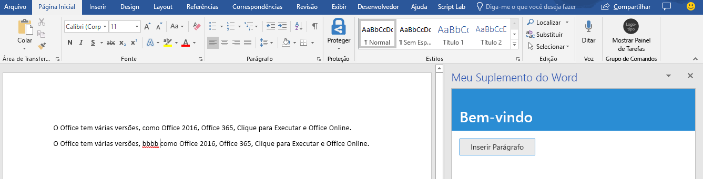
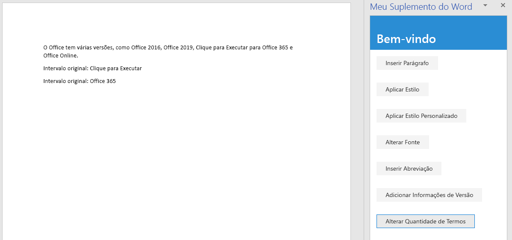
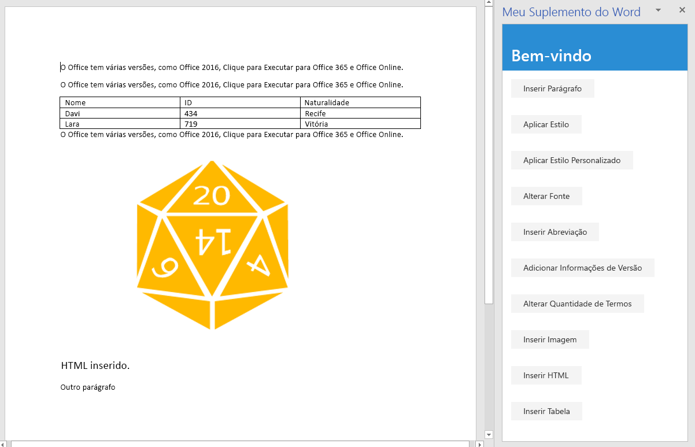
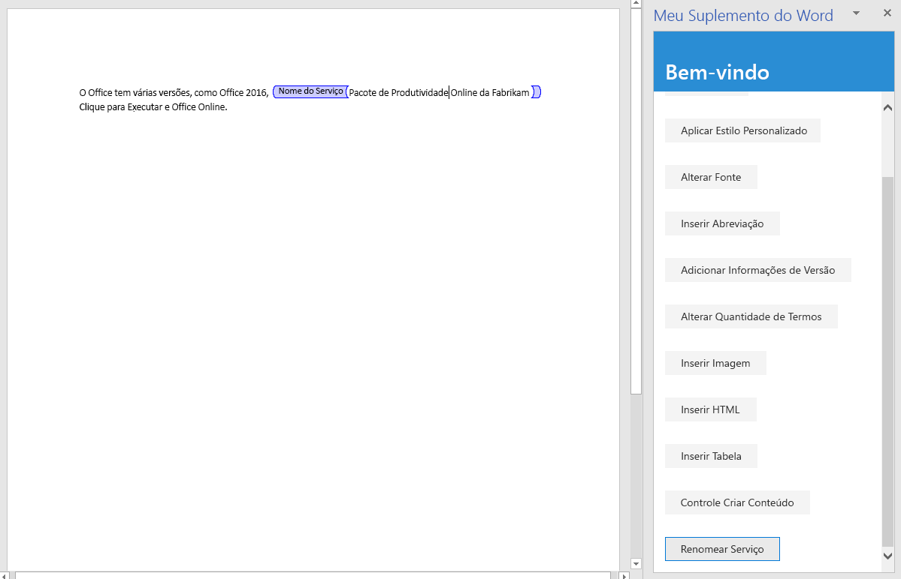

# <a name="tutorial-create-a-word-task-pane-add-in"></a><span data-ttu-id="d5260-104">Tutorial: Criar Suplemento do Painel de Tarefas no Word</span><span class="sxs-lookup"><span data-stu-id="d5260-104">Tutorial: Create a Word task pane add-in</span></span>

<span data-ttu-id="d5260-105">Neste tutorial: você criará um suplemento do painel de tarefas no Word:</span><span class="sxs-lookup"><span data-stu-id="d5260-105">In this tutorial, you'll create a Word task pane add-in that:</span></span>

> [!div class="checklist"]
> * <span data-ttu-id="d5260-106">Insere um intervalo de texto</span><span class="sxs-lookup"><span data-stu-id="d5260-106">Inserts a range of text</span></span>
> * <span data-ttu-id="d5260-107">Formatos de texto</span><span class="sxs-lookup"><span data-stu-id="d5260-107">Formats text</span></span>
> * <span data-ttu-id="d5260-108">Substitui e insere texto em vários locais</span><span class="sxs-lookup"><span data-stu-id="d5260-108">Replaces text and inserts text in various locations</span></span>
> * <span data-ttu-id="d5260-109">Insere imagens, HTML e tabelas</span><span class="sxs-lookup"><span data-stu-id="d5260-109">Inserts images, HTML, and tables</span></span>
> * <span data-ttu-id="d5260-110">Cria e atualiza os controles de conteúdo</span><span class="sxs-lookup"><span data-stu-id="d5260-110">Creates and updates content controls</span></span> 

## <a name="prerequisites"></a><span data-ttu-id="d5260-111">Pré-requisitos</span><span class="sxs-lookup"><span data-stu-id="d5260-111">Prerequisites</span></span>

<span data-ttu-id="d5260-112">Para usar este tutorial, você precisa instalar o seguinte.</span><span class="sxs-lookup"><span data-stu-id="d5260-112">To use this tutorial, you need to have the following installed.</span></span>

- <span data-ttu-id="d5260-p102">Word 2016, versão 1711 (build 8730.1000 do Clique para Executar) ou posterior. Talvez você precise ser um participante do programa Office Insider para ter essa versão. Para saber mais, confira a página [Seja um Office Insider](https://products.office.com/office-insider?tab=tab-1).</span><span class="sxs-lookup"><span data-stu-id="d5260-p102">Word 2016, version 1711 (Build 8730.1000 Click-to-Run) or later. You might need to be an Office Insider to get this version. For more information, see [Be an Office Insider](https://products.office.com/office-insider?tab=tab-1).</span></span>

- [<span data-ttu-id="d5260-116">Nó</span><span class="sxs-lookup"><span data-stu-id="d5260-116">Node</span></span>](https://nodejs.org/en/) 

- <span data-ttu-id="d5260-117">[Git Bash](https://git-scm.com/downloads) (ou outro cliente Git)</span><span class="sxs-lookup"><span data-stu-id="d5260-117">[Git Bash](https://git-scm.com/downloads) (or another Git client)</span></span>

## <a name="create-your-add-in-project"></a><span data-ttu-id="d5260-118">Criar seu projeto do suplemento</span><span class="sxs-lookup"><span data-stu-id="d5260-118">Create your add-in project</span></span>

<span data-ttu-id="d5260-119">Conclua as etapas a seguir para criar o projeto de suplemento do Word que você vai usar como base para este tutorial.</span><span class="sxs-lookup"><span data-stu-id="d5260-119">Complete the following steps to create the Word add-in project that you'll use as the basis for this tutorial.</span></span>

1. <span data-ttu-id="d5260-120">Clone o repositório do GitHub com o [Tutorial de suplemento do Word](https://github.com/OfficeDev/Word-Add-in-Tutorial).</span><span class="sxs-lookup"><span data-stu-id="d5260-120">Clone the GitHub repository [Word add-in tutorial](https://github.com/OfficeDev/Word-Add-in-Tutorial).</span></span>

2. <span data-ttu-id="d5260-121">Abra uma janela Git bash ou um prompt de sistema habilitado para Node.JS e navegue para a pasta **Iniciar** do projeto.</span><span class="sxs-lookup"><span data-stu-id="d5260-121">Open a Git bash window, or Node.JS-enabled system prompt, and navigate to the **Start** folder of the project.</span></span>

3. <span data-ttu-id="d5260-122">Execute o comando `npm install` para instalar as ferramentas e bibliotecas listadas no arquivo package.json.</span><span class="sxs-lookup"><span data-stu-id="d5260-122">Run the command `npm install` to install the tools and libraries listed in the package.json file.</span></span> 

4. <span data-ttu-id="d5260-123">Execute as etapas de [instalação do certificado autoassinado](https://github.com/OfficeDev/generator-office/blob/master/src/docs/ssl.md) para confiar no certificado para o sistema operacional do seu computador de desenvolvimento.</span><span class="sxs-lookup"><span data-stu-id="d5260-123">Carry out the steps in [Installing the self-signed certificate](https://github.com/OfficeDev/generator-office/blob/master/src/docs/ssl.md) to trust the certificate for your development computer's operating system.</span></span>

## <a name="insert-a-range-of-text"></a><span data-ttu-id="d5260-124">Inserir um intervalo de texto</span><span class="sxs-lookup"><span data-stu-id="d5260-124">Insert a range of text</span></span>

<span data-ttu-id="d5260-125">Nesta etapa do tutorial, você testará programaticamente se o suplemento oferece suporte à versão atual do Word do usuário e inserirá um parágrafo no documento.</span><span class="sxs-lookup"><span data-stu-id="d5260-125">In this step of the tutorial, you'll programmatically test that your add-in supports the user's current version of Word, and then insert a paragraph into the document.</span></span>

### <a name="code-the-add-in"></a><span data-ttu-id="d5260-126">Codificação do suplemento</span><span class="sxs-lookup"><span data-stu-id="d5260-126">Code the add-in</span></span>

1. <span data-ttu-id="d5260-127">Abra o projeto em seu editor de código.</span><span class="sxs-lookup"><span data-stu-id="d5260-127">Open the project in your code editor.</span></span>

2. <span data-ttu-id="d5260-128">Abra o arquivo index.html.</span><span class="sxs-lookup"><span data-stu-id="d5260-128">Open the file index.html.</span></span>

3. <span data-ttu-id="d5260-129">Substitua `TODO1` pela marcação a seguir:</span><span class="sxs-lookup"><span data-stu-id="d5260-129">Replace the `TODO1` with the following markup:</span></span>

    ```html
    <button class="ms-Button" id="insert-paragraph">Insert Paragraph</button>
    ```

4. <span data-ttu-id="d5260-130">Abra o arquivo app.js.</span><span class="sxs-lookup"><span data-stu-id="d5260-130">Open the app.js file.</span></span>

5. <span data-ttu-id="d5260-p103">Substitua o `TODO1` pelo código a seguir. O código determina se a versão do Word do usuário suporta uma versão do Word.js que inclui todas as APIs usadas em todos os estágios deste tutorial.dae Em um suplemento de produção, use o corpo do bloco condicional para ocultar ou desabilitar a interface do usuário que chame a APIs sem suporte. Isso permitirá que o usuário ainda use as partes do suplemento às quais a versão do Word dá suporte.</span><span class="sxs-lookup"><span data-stu-id="d5260-p103">Replace the `TODO1` with the following code. This code determines whether the user's version of Word supports a version of Word.js that includes all the APIs that are used in all the stages of this tutorial. In a production add-in, use the body of the conditional block to hide or disable the UI that would call unsupported APIs. This will enable the user to still use the parts of the add-in that are supported by their version of Word.</span></span>

    ```js
    if (!Office.context.requirements.isSetSupported('WordApi', '1.3')) {
        console.log('Sorry. The tutorial add-in uses Word.js APIs that are not available in your version of Office.');
    }
    ```

6. <span data-ttu-id="d5260-135">Substitua o `TODO2` pelo código a seguir:</span><span class="sxs-lookup"><span data-stu-id="d5260-135">Replace the `TODO2` with the following code:</span></span>

    ```js
    $('#insert-paragraph').click(insertParagraph);
    ```

7. <span data-ttu-id="d5260-136">Substitua o `TODO3` pelo código a seguir.</span><span class="sxs-lookup"><span data-stu-id="d5260-136">Replace the `TODO3` with the following code.</span></span> <span data-ttu-id="d5260-137">Observação:</span><span class="sxs-lookup"><span data-stu-id="d5260-137">Note:</span></span>

   - <span data-ttu-id="d5260-p105">A lógica de negócios de Word.js será adicionada à função que passar por `Word.run`. Essa lógica não é executada imediatamente. Em vez disso, ela é adicionada à fila de comandos pendentes.</span><span class="sxs-lookup"><span data-stu-id="d5260-p105">Your Word.js business logic will be added to the function that is passed to `Word.run`. This logic does not execute immediately. Instead, it is added to a queue of pending commands.</span></span>

   - <span data-ttu-id="d5260-141">O método `context.sync` envia todos os comandos da fila para execução no Word.</span><span class="sxs-lookup"><span data-stu-id="d5260-141">The `context.sync` method sends all queued commands to Word for execution.</span></span>

   - <span data-ttu-id="d5260-p106">O `Word.run` é seguido por um bloco `catch`. Essa é uma prática recomendada que você sempre deve seguir.</span><span class="sxs-lookup"><span data-stu-id="d5260-p106">The `Word.run` is followed by a `catch` block. This is a best practice that you should always follow.</span></span> 

    ```js
    function insertParagraph() {
        Word.run(function (context) {

            // TODO4: Queue commands to insert a paragraph into the document.

            return context.sync();
        })
        .catch(function (error) {
            console.log("Error: " + error);
            if (error instanceof OfficeExtension.Error) {
                console.log("Debug info: " + JSON.stringify(error.debugInfo));
            }
        });
    }
    ```

8. <span data-ttu-id="d5260-144">Substitua `TODO4` pelo código a seguir.</span><span class="sxs-lookup"><span data-stu-id="d5260-144">Replace `TODO4` with the following code.</span></span> <span data-ttu-id="d5260-145">Observação:</span><span class="sxs-lookup"><span data-stu-id="d5260-145">Note:</span></span>

   - <span data-ttu-id="d5260-146">O primeiro parâmetro para o método `insertParagraph` é o texto para o novo parágrafo.</span><span class="sxs-lookup"><span data-stu-id="d5260-146">The first parameter to the `insertParagraph` method is the text for the new paragraph.</span></span>

   - <span data-ttu-id="d5260-p108">O segundo parâmetro é o local dentro do corpo onde o parágrafo será inserido. Outras opções para inserir parágrafo, quando o objeto pai é o corpo, são "End" e "Replace".</span><span class="sxs-lookup"><span data-stu-id="d5260-p108">The second parameter is the location within the body where the paragraph will be inserted. Other options for insert paragraph, when the parent object is the body, are "End" and "Replace".</span></span>

    ```js
    var docBody = context.document.body;
    docBody.insertParagraph("Office has several versions, including Office 2016, Office 365 Click-to-Run, and Office on the web.",
                            "Start");
    ```

### <a name="test-the-add-in"></a><span data-ttu-id="d5260-149">Testar o suplemento</span><span class="sxs-lookup"><span data-stu-id="d5260-149">Test the add-in</span></span>

1. <span data-ttu-id="d5260-150">Abra uma janela Git bash ou um prompt de sistema habilitado para Node.JS e navegue para a pasta **Iniciar** do projeto.</span><span class="sxs-lookup"><span data-stu-id="d5260-150">Open a Git bash window, or Node.JS-enabled system prompt, and navigate to the **Start** folder of the project.</span></span>

2. <span data-ttu-id="d5260-151">Execute o comando `npm run build` para transcompilar seu código-fonte ES6 para uma versão anterior do JavaScript com suporte de todos os hosts nos quais os suplementos do Office podem ser executados.</span><span class="sxs-lookup"><span data-stu-id="d5260-151">Run the command `npm run build` to transpile your ES6 source code to an earlier version of JavaScript that is supported by all the hosts where Office Add-ins can run.</span></span>

3. <span data-ttu-id="d5260-152">Execute o comando `npm start` para iniciar um servidor Web em um localhost.</span><span class="sxs-lookup"><span data-stu-id="d5260-152">Run the command `npm start` to start a web server running on localhost.</span></span>

4. <span data-ttu-id="d5260-153">Realize o sideload do suplemento usando um dos métodos a seguir:</span><span class="sxs-lookup"><span data-stu-id="d5260-153">Sideload the add-in by using one of the following methods:</span></span>

    - <span data-ttu-id="d5260-154">Windows: [Realizar sideload de Suplementos do Office no Windows](../testing/create-a-network-shared-folder-catalog-for-task-pane-and-content-add-ins.md)</span><span class="sxs-lookup"><span data-stu-id="d5260-154">Windows: [Sideload Office Add-ins on Windows](../testing/create-a-network-shared-folder-catalog-for-task-pane-and-content-add-ins.md)</span></span>

    - <span data-ttu-id="d5260-155">Navegador da Web: [Sideload suplementos do Office no Office na Web](../testing/sideload-office-add-ins-for-testing.md#sideload-an-office-add-in-in-office-on-the-web)</span><span class="sxs-lookup"><span data-stu-id="d5260-155">Web browser: [Sideload Office Add-ins in Office on the web](../testing/sideload-office-add-ins-for-testing.md#sideload-an-office-add-in-in-office-on-the-web)</span></span>

    - <span data-ttu-id="d5260-156">iPad e Mac: [Realizar sideload dos Suplementos do Office no iPad e Mac](../testing/sideload-an-office-add-in-on-ipad-and-mac.md)</span><span class="sxs-lookup"><span data-stu-id="d5260-156">iPad and Mac: [Sideload Office Add-ins on iPad and Mac](../testing/sideload-an-office-add-in-on-ipad-and-mac.md)</span></span>

5. <span data-ttu-id="d5260-157">No menu **Página Inicial** do Word, selecione **Mostrar Painel de Tarefas**.</span><span class="sxs-lookup"><span data-stu-id="d5260-157">On the **Home** menu of Word, select **Show Taskpane**.</span></span>

6. <span data-ttu-id="d5260-158">No painel de tarefas, escolha **Inserir Parágrafo**.</span><span class="sxs-lookup"><span data-stu-id="d5260-158">In the task pane, choose **Insert Paragraph**.</span></span>

7. <span data-ttu-id="d5260-159">Faça uma alteração no parágrafo.</span><span class="sxs-lookup"><span data-stu-id="d5260-159">Make a change in the paragraph.</span></span>

8. <span data-ttu-id="d5260-160">Escolha novamente **Inserir Parágrafo**.</span><span class="sxs-lookup"><span data-stu-id="d5260-160">Choose **Insert Paragraph** again.</span></span> <span data-ttu-id="d5260-161">O novo parágrafo está acima do anterior porque o método `insertParagraph` está inserido no início do corpo do documento.</span><span class="sxs-lookup"><span data-stu-id="d5260-161">Note that the new paragraph is above the previous one because the `insertParagraph` method is inserting at the start of the document's body.</span></span>

    

## <a name="format-text"></a><span data-ttu-id="d5260-163">Formatar texto</span><span class="sxs-lookup"><span data-stu-id="d5260-163">Format text</span></span>

<span data-ttu-id="d5260-164">Nesta etapa do tutorial, você aplicará um estilo interno ao texto, aplicará um estilo personalizado ao texto e alterará a fonte do texto.</span><span class="sxs-lookup"><span data-stu-id="d5260-164">In this step of the tutorial, you'll apply a built-in style to text, apply a custom style to text, and change the font of text.</span></span>

### <a name="apply-a-built-in-style-to-text"></a><span data-ttu-id="d5260-165">Aplicar um estilo interno ao texto</span><span class="sxs-lookup"><span data-stu-id="d5260-165">Apply a built-in style to text</span></span>

1. <span data-ttu-id="d5260-166">Abra o projeto em seu editor de código.</span><span class="sxs-lookup"><span data-stu-id="d5260-166">Open the project in your code editor.</span></span> 

2. <span data-ttu-id="d5260-167">Abra o arquivo index.html.</span><span class="sxs-lookup"><span data-stu-id="d5260-167">Open the file index.html.</span></span>

3. <span data-ttu-id="d5260-168">Abaixo do `div`, que contém o botão `insert-paragraph`, adicione a marcação a seguir:</span><span class="sxs-lookup"><span data-stu-id="d5260-168">Just below the `div` that contains the `insert-paragraph` button, add the following markup:</span></span>

    ```html
    <div class="padding">            
        <button class="ms-Button" id="apply-style">Apply Style</button>            
    </div>
    ```

4. <span data-ttu-id="d5260-169">Abra o arquivo app.js.</span><span class="sxs-lookup"><span data-stu-id="d5260-169">Open the app.js file.</span></span>

5. <span data-ttu-id="d5260-170">Logo abaixo da linha que atribui um identificador de clique ao botão `insert-paragraph`, adicione o seguinte código:</span><span class="sxs-lookup"><span data-stu-id="d5260-170">Just below the line that assigns a click handler to the `insert-paragraph` button, add the following code:</span></span>

    ```js
    $('#apply-style').click(applyStyle);
    ```

6. <span data-ttu-id="d5260-171">Logo abaixo da função `insertParagraph`, adicione a função a seguir:</span><span class="sxs-lookup"><span data-stu-id="d5260-171">Just below the `insertParagraph` function, add the following function:</span></span>

    ```js
    function applyStyle() {
        Word.run(function (context) {
            
            // TODO1: Queue commands to style text.

            return context.sync();
        })
        .catch(function (error) {
            console.log("Error: " + error);
            if (error instanceof OfficeExtension.Error) {
                console.log("Debug info: " + JSON.stringify(error.debugInfo));
            }
        });
    }
    ``` 

7. <span data-ttu-id="d5260-p110">Substitua `TODO1` pelo código a seguir. O código aplica um estilo a um parágrafo, mas também é possível aplicar estilos em intervalos de texto.</span><span class="sxs-lookup"><span data-stu-id="d5260-p110">Replace `TODO1` with the following code. Note that the code applies a style to a paragraph, but styles can also be applied to ranges of text.</span></span>

    ```js
    var firstParagraph = context.document.body.paragraphs.getFirst();
    firstParagraph.styleBuiltIn = Word.Style.intenseReference;
    ``` 

### <a name="apply-a-custom-style-to-text"></a><span data-ttu-id="d5260-174">Aplicar um estilo personalizado ao texto</span><span class="sxs-lookup"><span data-stu-id="d5260-174">Apply a custom style to text</span></span>

1. <span data-ttu-id="d5260-175">Abra o arquivo index.html.</span><span class="sxs-lookup"><span data-stu-id="d5260-175">Open the file index.html.</span></span>

2. <span data-ttu-id="d5260-176">Abaixo do `div` que contém o botão `apply-style`, adicione a marcação a seguir:</span><span class="sxs-lookup"><span data-stu-id="d5260-176">Below the `div` that contains the `apply-style` button, add the following markup:</span></span>

    ```html
    <div class="padding">            
        <button class="ms-Button" id="apply-custom-style">Apply Custom Style</button>            
    </div>
    ```

3. <span data-ttu-id="d5260-177">Abra o arquivo app.js.</span><span class="sxs-lookup"><span data-stu-id="d5260-177">Open the app.js file.</span></span>

4. <span data-ttu-id="d5260-178">Abaixo da linha que atribui um identificador de clique ao botão `apply-style`, adicione o seguinte código:</span><span class="sxs-lookup"><span data-stu-id="d5260-178">Below the line that assigns a click handler to the `apply-style` button, add the following code:</span></span>

    ```js
    $('#apply-custom-style').click(applyCustomStyle);
    ```

5. <span data-ttu-id="d5260-179">Abaixo da função `applyStyle`, adicione a função a seguir:</span><span class="sxs-lookup"><span data-stu-id="d5260-179">Below the `applyStyle` function, add the following function:</span></span>

    ```js
    function applyCustomStyle() {
        Word.run(function (context) {
            
            // TODO1: Queue commands to apply the custom style.

            return context.sync();
        })
        .catch(function (error) {
            console.log("Error: " + error);
            if (error instanceof OfficeExtension.Error) {
                console.log("Debug info: " + JSON.stringify(error.debugInfo));
            }
        });
    }
    ``` 

6. <span data-ttu-id="d5260-p111">Substitua `TODO1` pelo código a seguir. O código aplica um estilo personalizado que ainda não existe. Você criará um estilo com o nome **MyCustomStyle** na etapa [Testar o suplemento](#test-the-add-in).</span><span class="sxs-lookup"><span data-stu-id="d5260-p111">Replace `TODO1` with the following code. Note that the code applies a custom style that does not exist yet. You'll create a style with the name **MyCustomStyle** in the [Test the add-in](#test-the-add-in) step.</span></span>

    ```js
    var lastParagraph = context.document.body.paragraphs.getLast();
    lastParagraph.style = "MyCustomStyle";
    ``` 

### <a name="change-the-font-of-text"></a><span data-ttu-id="d5260-183">Alterar a fonte do texto</span><span class="sxs-lookup"><span data-stu-id="d5260-183">Change the font of text</span></span>

1. <span data-ttu-id="d5260-184">Abra o arquivo index.html.</span><span class="sxs-lookup"><span data-stu-id="d5260-184">Open the file index.html.</span></span>

2. <span data-ttu-id="d5260-185">Abaixo do `div` que contém o botão `apply-custom-style`, adicione a marcação a seguir:</span><span class="sxs-lookup"><span data-stu-id="d5260-185">Below the `div` that contains the `apply-custom-style` button, add the following markup:</span></span>

    ```html
    <div class="padding">            
        <button class="ms-Button" id="change-font">Change Font</button>            
    </div>
    ```

3. <span data-ttu-id="d5260-186">Abra o arquivo app.js.</span><span class="sxs-lookup"><span data-stu-id="d5260-186">Open the app.js file.</span></span>

4. <span data-ttu-id="d5260-187">Abaixo da linha que atribui um identificador de clique ao botão `apply-custom-style`, adicione o seguinte código:</span><span class="sxs-lookup"><span data-stu-id="d5260-187">Below the line that assigns a click handler to the `apply-custom-style` button, add the following code:</span></span>

    ```js
    $('#change-font').click(changeFont);
    ```

5. <span data-ttu-id="d5260-188">Abaixo da função `applyCustomStyle`, adicione a função a seguir:</span><span class="sxs-lookup"><span data-stu-id="d5260-188">Below the `applyCustomStyle` function, add the following function:</span></span>

    ```js
    function changeFont() {
        Word.run(function (context) {
            
            // TODO1: Queue commands to apply a different font.

            return context.sync();
        })
        .catch(function (error) {
            console.log("Error: " + error);
            if (error instanceof OfficeExtension.Error) {
                console.log("Debug info: " + JSON.stringify(error.debugInfo));
            }
        });
    }
    ``` 

6. <span data-ttu-id="d5260-p112">Substitua `TODO1` pelo código a seguir. O código recebe uma referência para o segundo parágrafo usando o método `ParagraphCollection.getFirst` encadeado para o método `Paragraph.getNext`.</span><span class="sxs-lookup"><span data-stu-id="d5260-p112">Replace `TODO1` with the following code. Note that the code gets a reference to the second paragraph by using the `ParagraphCollection.getFirst` method chained to the `Paragraph.getNext` method.</span></span>

    ```js
    var secondParagraph = context.document.body.paragraphs.getFirst().getNext();
    secondParagraph.font.set({
            name: "Courier New",
            bold: true,
            size: 18
        });
    ``` 

### <a name="test-the-add-in"></a><span data-ttu-id="d5260-191">Testar o suplemento</span><span class="sxs-lookup"><span data-stu-id="d5260-191">Test the add-in</span></span>

1. <span data-ttu-id="d5260-192">Na janela Git bash ou o prompt de sistema habilitado para Node.JS do tutorial anterior ainda estão abertos, digite Ctrl + C duas vezes para interromper a execução do servidor Web.</span><span class="sxs-lookup"><span data-stu-id="d5260-192">In the Git bash window, or Node.JS-enabled system prompt, from the previous stage tutorial is still open, enter Ctrl+C twice to stop the running web server.</span></span> <span data-ttu-id="d5260-193">Caso contrário, abra uma janela Git bash ou um prompt de sistema habilitado para Node.JS e navegue até a pasta **Iniciar** do projeto.</span><span class="sxs-lookup"><span data-stu-id="d5260-193">Otherwise, open a Git bash window, or Node.JS-enabled system prompt, and navigate to the **Start** folder of the project.</span></span>

     > [!NOTE]
     > <span data-ttu-id="d5260-p114">Embora o servidor de sincronização do navegador recarregue o suplemento no painel de tarefas sempre que você fizer uma alteração em algum arquivo, incluindo o arquivo app.js, ele não transcompila o JavaScript, portanto, é necessário repetir o comando de compilação para que as alterações em app.js as entrem em vigor. Para fazer isso, interrompa o processo do servidor para que o prompt apareça e você possa inserir o comando de compilação. Após a compilação, reinicie o servidor. As próximas etapas executam esse processo.</span><span class="sxs-lookup"><span data-stu-id="d5260-p114">Although the browser-sync server reloads your add-in in the task pane every time you make a change to any file, including the app.js file, it does not retranspile the JavaScript, so you must repeat the build command in order for your changes to app.js to take effect. In order to do this, you need to kill the server process so that the prompt appears and you can enter the build command. After the build, you restart the server. The next few steps carry out this process.</span></span>

2. <span data-ttu-id="d5260-198">Execute o comando `npm run build` para transcompilar seu código-fonte ES6 para uma versão anterior do JavaScript com suporte de todos os hosts nos quais os suplementos do Office podem ser executados.</span><span class="sxs-lookup"><span data-stu-id="d5260-198">Run the command `npm run build` to transpile your ES6 source code to an earlier version of JavaScript that is supported by all the hosts where Office Add-ins can run.</span></span>

3. <span data-ttu-id="d5260-199">Execute o comando `npm start` para iniciar um servidor Web em um localhost.</span><span class="sxs-lookup"><span data-stu-id="d5260-199">Run the command `npm start` to start a web server running on localhost.</span></span>   

4. <span data-ttu-id="d5260-200">Feche o painel de tarefas para recarregá-lo e, no menu **Início**, selecione **Mostrar Painel de Tarefas** para reabrir o suplemento.</span><span class="sxs-lookup"><span data-stu-id="d5260-200">Reload the task pane by closing it, and then on the **Home** menu select **Show Taskpane** to reopen the add-in.</span></span>

5. <span data-ttu-id="d5260-p115">Verifique se há pelo menos três parágrafos no documento. É possível escolher **Inserir Parágrafo** três vezes. *Verifique com atenção se não há um parágrafo em branco no final do documento. Se houver, exclua-o.*</span><span class="sxs-lookup"><span data-stu-id="d5260-p115">Be sure there are at least three paragraphs in the document. You can choose **Insert Paragraph** three times. *Check carefully that there's no blank paragraph at the end of the document. If there is, delete it.*</span></span>

6. <span data-ttu-id="d5260-p116">No Word, crie um estilo personalizado chamado "MyCustomStyle". Pode ter a formatação que você quiser.</span><span class="sxs-lookup"><span data-stu-id="d5260-p116">In Word, create a custom style named "MyCustomStyle". It can have any formatting that you want.</span></span>

7. <span data-ttu-id="d5260-p117">Escolha o botão **Aplicar Estilo**. O primeiro parágrafo receberá o estilo interno **Referência Intensa**.</span><span class="sxs-lookup"><span data-stu-id="d5260-p117">Choose the **Apply Style** button. The first paragraph will be styled with the built-in style **Intense Reference**.</span></span>

8. <span data-ttu-id="d5260-p118">Escolha o botão **Aplicar Estilo Personalizado**. O último parágrafo receberá seu estilo personalizado. (Se parecer que nada acontece, talvez o último parágrafo esteja em branco. Se estiver, adicione um texto a ele).</span><span class="sxs-lookup"><span data-stu-id="d5260-p118">Choose the **Apply Custom Style** button. The last paragraph will be styled with your custom style. (If nothing seems to happen, the last paragraph might be blank. If so, add some text to it.)</span></span>

9. <span data-ttu-id="d5260-p119">Escolha o botão **Alterar Fonte**. A fonte do segundo parágrafo muda para 18 pt, negrito, Courier New.</span><span class="sxs-lookup"><span data-stu-id="d5260-p119">Choose the **Change Font** button. The font of the second paragraph changes to 18 pt., bold, Courier New.</span></span>

    

## <a name="replace-text-and-insert-text"></a><span data-ttu-id="d5260-215">Substituir texto e inserir texto</span><span class="sxs-lookup"><span data-stu-id="d5260-215">Replace text and insert text</span></span>

<span data-ttu-id="d5260-216">Nesta etapa o tutorial, você adicionará texto dentro e fora dos intervalos de texto selecionados, e substituirá o texto de um intervalo selecionado.</span><span class="sxs-lookup"><span data-stu-id="d5260-216">In this step of the tutorial, you'll add text inside and outside of selected ranges of text, and replace the text of a selected range.</span></span>

### <a name="add-text-inside-a-range"></a><span data-ttu-id="d5260-217">Adicionar texto dentro de um intervalo</span><span class="sxs-lookup"><span data-stu-id="d5260-217">Add text inside a range</span></span>

1. <span data-ttu-id="d5260-218">Abra o projeto em seu editor de código.</span><span class="sxs-lookup"><span data-stu-id="d5260-218">Open the project in your code editor.</span></span>

2. <span data-ttu-id="d5260-219">Abra o arquivo index.html.</span><span class="sxs-lookup"><span data-stu-id="d5260-219">Open the file index.html.</span></span>

3. <span data-ttu-id="d5260-220">Abaixo do `div` que contém o botão `change-font`, adicione a marcação a seguir:</span><span class="sxs-lookup"><span data-stu-id="d5260-220">Below the `div` that contains the `change-font` button, add the following markup:</span></span>

    ```html
    <div class="padding">
        <button class="ms-Button" id="insert-text-into-range">Insert Abbreviation</button>
    </div>
    ```

4. <span data-ttu-id="d5260-221">Abra o arquivo app.js.</span><span class="sxs-lookup"><span data-stu-id="d5260-221">Open the app.js file.</span></span>

5. <span data-ttu-id="d5260-222">Abaixo da linha que atribui um identificador de clique ao botão `change-font`, adicione o seguinte código:</span><span class="sxs-lookup"><span data-stu-id="d5260-222">Below the line that assigns a click handler to the `change-font` button, add the following code:</span></span>

    ```js
    $('#insert-text-into-range').click(insertTextIntoRange);
    ```

6. <span data-ttu-id="d5260-223">Abaixo da função `changeFont`, adicione a função a seguir:</span><span class="sxs-lookup"><span data-stu-id="d5260-223">Below the `changeFont` function, add the following function:</span></span>

    ```js
    function insertTextIntoRange() {
        Word.run(function (context) {

            // TODO1: Queue commands to insert text into a selected range.

            // TODO2: Load the text of the range and sync so that the
            //        current range text can be read.

            // TODO3: Queue commands to repeat the text of the original
            //        range at the end of the document.

            return context.sync();
        })
        .catch(function (error) {
            console.log("Error: " + error);
            if (error instanceof OfficeExtension.Error) {
                console.log("Debug info: " + JSON.stringify(error.debugInfo));
            }
        });
    }
    ``` 

7. <span data-ttu-id="d5260-224">Substitua `TODO1` pelo código a seguir.</span><span class="sxs-lookup"><span data-stu-id="d5260-224">Replace `TODO1` with the following code.</span></span> <span data-ttu-id="d5260-225">Observação:</span><span class="sxs-lookup"><span data-stu-id="d5260-225">Note:</span></span>

   - <span data-ttu-id="d5260-p121">o método serve para inserir a abreviação ["(C2R)"] no final do Intervalo cujo texto é "Clique para Executar". Para simplificar, ele faz uma pressuposição de que a cadeia de caracteres está presente, e que o usuário a selecionou.</span><span class="sxs-lookup"><span data-stu-id="d5260-p121">The method is intended to insert the abbreviation ["(C2R)"] into the end of the Range whose text is "Click-to-Run". It makes a simplifying assumption that the string is present and the user has selected it.</span></span>

   - <span data-ttu-id="d5260-228">O primeiro parâmetro do método `Range.insertText` é a cadeia de caracteres a ser inserida no objeto `Range`.</span><span class="sxs-lookup"><span data-stu-id="d5260-228">The first parameter of the `Range.insertText` method is the string to insert into the `Range` object.</span></span>

   - <span data-ttu-id="d5260-p122">O segundo parâmetro especifica onde no intervalo, o texto adicional deve ser inserido. Além de "Fim", as outras opções possíveis são "Início", "Antes", "Depois" e "Substituir".</span><span class="sxs-lookup"><span data-stu-id="d5260-p122">The second parameter specifies where in the range the additional text should be inserted. Besides "End", the other possible options are "Start", "Before", "After", and "Replace".</span></span> 

   - <span data-ttu-id="d5260-p123">A diferença entre "Fim" e "Depois" é que "Fim" insere o novo texto dentro o final do intervalo existente, mas "Depois" cria um novo intervalo com a cadeia de caracteres e insere o novo intervalo após o intervalo existente. Da mesma forma, "Início" insere o texto dentro do início do intervalo existente, e "Antes" insere um novo intervalo. "Substituir" substitui o texto do intervalo existente pela cadeia de caracteres do primeiro parâmetro.</span><span class="sxs-lookup"><span data-stu-id="d5260-p123">The difference between "End" and "After" is that "End" inserts the new text inside the end of the existing range, but "After" creates a new range with the string and inserts the new range after the existing range. Similarly, "Start" inserts text inside the beginning of the existing range and "Before" inserts a new range. "Replace" replaces the text of the existing range with the string in the first parameter.</span></span>

   - <span data-ttu-id="d5260-p124">Você viu em um estágio anterior do tutorial que os métodos insert\* do objeto de corpo não têm as opções "Antes" e "Depois". Isso ocorre porque não é possível colocar o conteúdo fora do corpo do documento.</span><span class="sxs-lookup"><span data-stu-id="d5260-p124">You saw in an earlier stage of the tutorial that the insert\* methods of the body object do not have the "Before" and "After" options. This is because you can't put content outside of the document's body.</span></span>

    ```js
    var doc = context.document;
    var originalRange = doc.getSelection();
    originalRange.insertText(" (C2R)", "End");
    ```

8. <span data-ttu-id="d5260-p125">Vamos deixar `TODO2` de lado até a próxima seção. Substitua `TODO3` pelo código a seguir. Esse código é semelhante ao código que você criou no primeiro estágio do tutorial, exceto que, agora, você está inserindo um novo parágrafo no final do documento, em vez de no início. Este novo parágrafo demonstrará que o novo texto agora faz parte do intervalo original.</span><span class="sxs-lookup"><span data-stu-id="d5260-p125">We'll skip over `TODO2` until the next section. Replace `TODO3` with the following code. This code is similar to the code you created in the first stage of the tutorial, except that now you are inserting a new paragraph at the end of the document instead of at the start. This new paragraph will demonstrate that the new text is now part of the original range.</span></span>

    ```js
    doc.body.insertParagraph("Original range: " + originalRange.text, "End");
    ```

### <a name="add-code-to-fetch-document-properties-into-the-task-panes-script-objects"></a><span data-ttu-id="d5260-240">Adicione código para buscar propriedades do documento em objetos de script do painel de tarefas</span><span class="sxs-lookup"><span data-stu-id="d5260-240">Add code to fetch document properties into the task pane's script objects</span></span>

<span data-ttu-id="d5260-p126">Em todas as funções anteriores desta série de tutoriais, você colocou em fila comandos para *gravar* no documento do Office. Cada função terminou com uma chamada para o método `context.sync()`, que envia os comandos em fila para o documento a ser executado. Entretanto, o código adicionado na última etapa chama a propriedade `originalRange.text` e essa é uma grande diferença das funções anteriores que você escreveu, pois o objeto `originalRange` é apenas um objeto de proxy que existe no script do seu painel de tarefas. Ele não sabe qual é o texto real do intervalo no documento, portanto, sua propriedade `text` não pode ter um valor real. Primeiro, é necessário buscar o valor de texto do intervalo no documento e usá-lo para definir o valor de `originalRange.text`. Somente então será possível chamar `originalRange.text` sem causar uma exceção. Esse processo de busca tem três etapas:</span><span class="sxs-lookup"><span data-stu-id="d5260-p126">In all the previous functions in this series of tutorials, you queued commands to *write* to the Office document. Each function ended with a call to the `context.sync()` method which sends the queued commands to the document to be executed. But the code you added in the last step calls the `originalRange.text` property, and this is a significant difference from the earlier functions you wrote, because the `originalRange` object is only a proxy object that exists in your task pane's script. It doesn't know what the actual text of the range in the document is, so its `text` property can't have a real value. It is necessary to first fetch the text value of the range from the document and use it to set the value of `originalRange.text`. Only then can `originalRange.text` be called without causing an exception to be thrown. This fetching process has three steps:</span></span>

   1. <span data-ttu-id="d5260-248">Coloque em fila um comando para carregar (ou seja, fetch) as propriedades que seu código precisa ler.</span><span class="sxs-lookup"><span data-stu-id="d5260-248">Queue a command to load (that is; fetch) the properties that your code needs to read.</span></span>

   2. <span data-ttu-id="d5260-249">Chame o método `sync` do objeto de contexto para enviar o comando em fila para o documento para execução e retornar as informações solicitadas.</span><span class="sxs-lookup"><span data-stu-id="d5260-249">Call the context object's `sync` method to send the queued command to the document for execution and return the requested information.</span></span>

   3. <span data-ttu-id="d5260-250">Como o método `sync` é assíncrono, certifique-se de que ele tenha sido concluído antes que o código chame as propriedades que foram buscadas.</span><span class="sxs-lookup"><span data-stu-id="d5260-250">Because the `sync` method is asynchronous, ensure that it has completed before your code calls the properties that were fetched.</span></span>

<span data-ttu-id="d5260-251">Estas etapas devem ser concluídas sempre que seu código precisar *ler* informações do documento do Office.</span><span class="sxs-lookup"><span data-stu-id="d5260-251">These steps must be completed whenever your code needs to *read* information from the Office document.</span></span>

1. <span data-ttu-id="d5260-252">Substitua `TODO2` pelo código a seguir.</span><span class="sxs-lookup"><span data-stu-id="d5260-252">Replace `TODO2` with the following code.</span></span>
  
    ```js
    originalRange.load("text");
    return context.sync()
        .then(function() {

                // TODO4: Move the doc.body.insertParagraph line here.

            }
        )
            // TODO5: Move the final call of context.sync here and ensure
            //        that it does not run until the insertParagraph has
            //        been queued.
    ```

2. <span data-ttu-id="d5260-p127">Você não pode ter duas instruções `return` no mesmo caminho de código sem ramificações, portanto, exclua a linha final `return context.sync();` no final de `Word.run`. Você adicionará um novo final `context.sync` posteriormente neste tutorial.</span><span class="sxs-lookup"><span data-stu-id="d5260-p127">You can't have two `return` statements in the same unbranching code path, so delete the final line `return context.sync();` at the end of the `Word.run`. You'll add a new final `context.sync` later in this tutorial.</span></span>

3. <span data-ttu-id="d5260-255">Recorte a linha `doc.body.insertParagraph` e cole no lugar de `TODO4`.</span><span class="sxs-lookup"><span data-stu-id="d5260-255">Cut the `doc.body.insertParagraph` line and paste in place of `TODO4`.</span></span>

4. <span data-ttu-id="d5260-p128">Substitua `TODO5` pelo código a seguir. Observação:</span><span class="sxs-lookup"><span data-stu-id="d5260-p128">Replace `TODO5` with the following code. Note:</span></span>

   - <span data-ttu-id="d5260-258">Passar o método `sync` para uma função `then` garante que ele não seja executado até que a lógica `insertParagraph` tenha sido enfileirada.</span><span class="sxs-lookup"><span data-stu-id="d5260-258">Passing the `sync` method to a `then` function ensures that it does not run until the `insertParagraph` logic has been queued.</span></span>

   - <span data-ttu-id="d5260-259">O método `then` invoca qualquer função que é passada para ele e não é recomendável que `sync` seja chamado duas vezes, portanto, remova os "()" do fim de context.sync.</span><span class="sxs-lookup"><span data-stu-id="d5260-259">The `then` method invokes whatever function is passed to it, and you don't want `sync` to be invoked twice, so leave off the "()" from the end of context.sync.</span></span>

    ```js
    .then(context.sync);
    ```

<span data-ttu-id="d5260-260">Quando terminar, a função inteira deve se parecer com o seguinte:</span><span class="sxs-lookup"><span data-stu-id="d5260-260">When you're done, the entire function should look like the following:</span></span>

```js
function insertTextIntoRange() {
    Word.run(function (context) {

        var doc = context.document;
        var originalRange = doc.getSelection();
        originalRange.insertText(" (C2R)", "End");

        originalRange.load("text");
        return context.sync()
            .then(function() {
                        doc.body.insertParagraph("Current text of original range: " + originalRange.text,
                                                "End");
                }
            )
            .then(context.sync);
    })
    .catch(function (error) {
        console.log("Error: " + error);
        if (error instanceof OfficeExtension.Error) {
            console.log("Debug info: " + JSON.stringify(error.debugInfo));
        }
    });
}
```

### <a name="add-text-between-ranges"></a><span data-ttu-id="d5260-261">Adicionar texto entre intervalos</span><span class="sxs-lookup"><span data-stu-id="d5260-261">Add text between ranges</span></span>

1. <span data-ttu-id="d5260-262">Abra o arquivo index.html.</span><span class="sxs-lookup"><span data-stu-id="d5260-262">Open the file index.html.</span></span>

2. <span data-ttu-id="d5260-263">Abaixo do `div` que contém o botão `insert-text-into-range`, adicione a marcação a seguir:</span><span class="sxs-lookup"><span data-stu-id="d5260-263">Below the `div` that contains the `insert-text-into-range` button, add the following markup:</span></span>

    ```html
    <div class="padding">
        <button class="ms-Button" id="insert-text-outside-range">Add Version Info</button>
    </div>
    ```

3. <span data-ttu-id="d5260-264">Abra o arquivo app.js.</span><span class="sxs-lookup"><span data-stu-id="d5260-264">Open the app.js file.</span></span>

4. <span data-ttu-id="d5260-265">Abaixo da linha que atribui um identificador de clique ao botão `insert-text-into-range`, adicione o seguinte código:</span><span class="sxs-lookup"><span data-stu-id="d5260-265">Below the line that assigns a click handler to the `insert-text-into-range` button, add the following code:</span></span>

    ```js
    $('#insert-text-outside-range').click(insertTextBeforeRange);
    ```

5. <span data-ttu-id="d5260-266">Abaixo da função `insertTextIntoRange`, adicione a função a seguir:</span><span class="sxs-lookup"><span data-stu-id="d5260-266">Below the `insertTextIntoRange` function, add the following function:</span></span>

    ```js
    function insertTextBeforeRange() {
        Word.run(function (context) {

            // TODO1: Queue commands to insert a new range before the
            //        selected range.

            // TODO2: Load the text of the original range and sync so that the
            //        range text can be read and inserted.

        })
        .catch(function (error) {
            console.log("Error: " + error);
            if (error instanceof OfficeExtension.Error) {
                console.log("Debug info: " + JSON.stringify(error.debugInfo));
            }
        });
    }
    ```

6. <span data-ttu-id="d5260-267">Substitua `TODO1` pelo código a seguir.</span><span class="sxs-lookup"><span data-stu-id="d5260-267">Replace `TODO1` with the following code.</span></span> <span data-ttu-id="d5260-268">Observação:</span><span class="sxs-lookup"><span data-stu-id="d5260-268">Note:</span></span>

   - <span data-ttu-id="d5260-p130">O método serve para adicionar um intervalo cujo texto seja "Office 2019", antes do intervalo com o texto "Office 365". Para simplificar, ele faz uma pressuposição de que a cadeia de caracteres está presente, e que o usuário a selecionou.</span><span class="sxs-lookup"><span data-stu-id="d5260-p130">The method is intended to add a range whose text is "Office 2019, " before the range with text "Office 365". It makes a simplifying assumption that the string is present and the user has selected it.</span></span>

   - <span data-ttu-id="d5260-271">O primeiro parâmetro do método `Range.insertText` é a cadeia de caracteres a ser adicionada.</span><span class="sxs-lookup"><span data-stu-id="d5260-271">The first parameter of the `Range.insertText` method is the string to add.</span></span>

   - <span data-ttu-id="d5260-p131">O segundo parâmetro especifica onde no intervalo, o texto adicional deve ser inserido. Para ter mais detalhes sobre as opções de local, confira a discussão anterior sobre a função `insertTextIntoRange`.</span><span class="sxs-lookup"><span data-stu-id="d5260-p131">The second parameter specifies where in the range the additional text should be inserted. For more details about the location options, see the previous discussion of the `insertTextIntoRange` function.</span></span>

    ```js
    var doc = context.document;
    var originalRange = doc.getSelection();
    originalRange.insertText("Office 2019, ", "Before");
    ```

7. <span data-ttu-id="d5260-274">Substitua `TODO2` pelo código a seguir.</span><span class="sxs-lookup"><span data-stu-id="d5260-274">Replace `TODO2` with the following code.</span></span>

     ```js
    originalRange.load("text");
    return context.sync()
        .then(function() {

                // TODO3: Queue commands to insert the original range as a
                //        paragraph at the end of the document.

                }
            )

            // TODO4: Make a final call of context.sync here and ensure
            //        that it does not run until the insertParagraph has
            //        been queued.
    ```

8. <span data-ttu-id="d5260-p132">Substitua `TODO3` pelo código a seguir. Este novo parágrafo demonstrará que o novo texto ***não*** faz parte do intervalo original selecionado. O intervalo original ainda contém o texto que tinha quando foi selecionado.</span><span class="sxs-lookup"><span data-stu-id="d5260-p132">Replace `TODO3` with the following code. This new paragraph will demonstrate the fact that the new text is ***not*** part of the original selected range. The original range still has only the text it had when it was selected.</span></span>

    ```js
    doc.body.insertParagraph("Current text of original range: " + originalRange.text,
                             "End");
    ```

9. <span data-ttu-id="d5260-278">Substitua `TODO4` pelo código a seguir:</span><span class="sxs-lookup"><span data-stu-id="d5260-278">Replace `TODO4` with the following code:</span></span>

    ```js
    .then(context.sync);
    ```

### <a name="replace-the-text-of-a-range"></a><span data-ttu-id="d5260-279">Substitua o texto de um intervalo.</span><span class="sxs-lookup"><span data-stu-id="d5260-279">Replace the text of a range</span></span>

1. <span data-ttu-id="d5260-280">Abra o arquivo index.html.</span><span class="sxs-lookup"><span data-stu-id="d5260-280">Open the file index.html.</span></span>

2. <span data-ttu-id="d5260-281">Abaixo do `div` que contém o botão `insert-text-outside-range`, adicione a marcação a seguir:</span><span class="sxs-lookup"><span data-stu-id="d5260-281">Below the `div` that contains the `insert-text-outside-range` button, add the following markup:</span></span>

    ```html
    <div class="padding">
        <button class="ms-Button" id="replace-text">Change Quantity Term</button>
    </div>
    ```

3. <span data-ttu-id="d5260-282">Abra o arquivo app.js.</span><span class="sxs-lookup"><span data-stu-id="d5260-282">Open the app.js file.</span></span>

4. <span data-ttu-id="d5260-283">Abaixo da linha que atribui um identificador de clique ao botão `insert-text-outside-range`, adicione o seguinte código:</span><span class="sxs-lookup"><span data-stu-id="d5260-283">Below the line that assigns a click handler to the `insert-text-outside-range` button, add the following code:</span></span>

    ```js
    $('#replace-text').click(replaceText);
    ```

5. <span data-ttu-id="d5260-284">Abaixo da função `insertTextBeforeRange`, adicione a função a seguir:</span><span class="sxs-lookup"><span data-stu-id="d5260-284">Below the `insertTextBeforeRange` function, add the following function:</span></span>

    ```js
    function replaceText() {
        Word.run(function (context) {

            // TODO1: Queue commands to replace the text.

            return context.sync();
        })
        .catch(function (error) {
            console.log("Error: " + error);
            if (error instanceof OfficeExtension.Error) {
                console.log("Debug info: " + JSON.stringify(error.debugInfo));
            }
        });
    }
    ```

6. <span data-ttu-id="d5260-p133">Substitua `TODO1` pelo código a seguir. O método serve para substituir a cadeia de caracteres "várias" pela cadeia "muitos". Para simplificar, ele faz uma pressuposição de que a cadeia de caracteres está presente, e que o usuário a selecionou.</span><span class="sxs-lookup"><span data-stu-id="d5260-p133">Replace `TODO1` with the following code. Note that the method is intended to replace the string "several" with the string "many". It makes a simplifying assumption that the string is present and the user has selected it.</span></span>

    ```js
    var doc = context.document;
    var originalRange = doc.getSelection();
    originalRange.insertText("many", "Replace");
    ```

### <a name="test-the-add-in"></a><span data-ttu-id="d5260-288">Testar o suplemento</span><span class="sxs-lookup"><span data-stu-id="d5260-288">Test the add-in</span></span>

1. <span data-ttu-id="d5260-p134">Se a janela Git bash ou o prompt de sistema habilitado para Node.JS do tutorial anterior ainda estiverem abertos, digite Ctrl + C duas vezes para interromper a execução do servidor Web. Caso contrário, abra uma janela Git bash ou um prompt de sistema habilitado para Node.JS e navegue até a pasta **Iniciar** do projeto.</span><span class="sxs-lookup"><span data-stu-id="d5260-p134">If the Git bash window, or Node.JS-enabled system prompt, from the previous stage tutorial is still open, enter Ctrl-C twice to stop the running web server. Otherwise, open a Git bash window, or Node.JS-enabled system prompt, and navigate to the **Start** folder of the project.</span></span>

     > [!NOTE]
     > <span data-ttu-id="d5260-p135">Embora o servidor de sincronização do navegador recarregue o suplemento no painel de tarefas sempre que você fizer uma alteração em algum arquivo, incluindo o arquivo app.js, ele não transcompila o JavaScript, portanto, é necessário repetir o comando de compilação para que as alterações em app.js as entrem em vigor. Para fazer isso, interrompa o processo do servidor para que o prompt apareça e você possa inserir o comando de compilação. Após a compilação, reinicie o servidor. As próximas etapas executam esse processo.</span><span class="sxs-lookup"><span data-stu-id="d5260-p135">Although the browser-sync server reloads your add-in in the task pane every time you make a change to any file, including the app.js file, it does not retranspile the JavaScript, so you must repeat the build command in order for your changes to app.js to take effect. In order to do this, you need to kill the server process so that the prompt appears and you can enter the build command. After the build, restart the server. The next few steps carry out this process.</span></span>

2. <span data-ttu-id="d5260-295">Execute o comando `npm run build` para transcompilar seu código-fonte ES6 para uma versão anterior do JavaScript com suporte de todos os hosts nos quais os suplementos do Office podem ser executados.</span><span class="sxs-lookup"><span data-stu-id="d5260-295">Run the command `npm run build` to transpile your ES6 source code to an earlier version of JavaScript that is supported by all the hosts where Office Add-ins can run.</span></span>

3. <span data-ttu-id="d5260-296">Execute o comando `npm start` para iniciar um servidor Web em um localhost.</span><span class="sxs-lookup"><span data-stu-id="d5260-296">Run the command `npm start` to start a web server running on localhost.</span></span>

4. <span data-ttu-id="d5260-297">Feche o painel de tarefas para recarregá-lo e, no menu **Página Inicial**, selecione **Mostrar Painel de Tarefas** para reabrir o suplemento.</span><span class="sxs-lookup"><span data-stu-id="d5260-297">Reload the task pane by closing it, and then on the **Home** menu, select **Show Taskpane** to reopen the add-in.</span></span>

5. <span data-ttu-id="d5260-298">No painel de tarefas, escolha **Inserir Parágrafo** para garantir que haja um parágrafo no início do documento.</span><span class="sxs-lookup"><span data-stu-id="d5260-298">In the task pane, choose **Insert Paragraph** to ensure that there is a paragraph at the start of the document.</span></span>

6. <span data-ttu-id="d5260-p136">Selecione um texto. Selecionar a frase "Clique para Executar" fará mais sentido. *Tenha cuidado para não incluir o espaço anterior ou seguinte na seleção.*</span><span class="sxs-lookup"><span data-stu-id="d5260-p136">Select some text. Selecting the phrase "Click-to-Run" will make the most sense. *Be careful not to include the preceding or following space in the selection.*</span></span>

7. <span data-ttu-id="d5260-p137">Escolha o botão **Inserir Abreviação**. "(C2R)" é adicionado. Na parte inferior do documento, um novo parágrafo é adicionado com o texto inteiro expandido porque a nova cadeia de caracteres foi adicionada ao intervalo existente.</span><span class="sxs-lookup"><span data-stu-id="d5260-p137">Choose the **Insert Abbreviation** button. Note that " (C2R)" is added. Note also that at the bottom of the document a new paragraph is added with the entire expanded text because the new string was added to the existing range.</span></span>

8. <span data-ttu-id="d5260-p138">Selecione um texto. Selecionar a frase "Office 365" fará mais sentido. *Tenha cuidado para não incluir o espaço anterior ou seguinte na seleção.*</span><span class="sxs-lookup"><span data-stu-id="d5260-p138">Select some text. Selecting the phrase "Office 365" will make the most sense. *Be careful not to include the preceding or following space in the selection.*</span></span>

9. <span data-ttu-id="d5260-p139">Escolha o botão **Adicionar Informações de Versão**. "Office 2019" está inserido entre "Office 2016" e "Office 365". Na parte inferior do documento um novo parágrafo foi adicionado, mas ele contém apenas o texto selecionado originalmente porque a nova cadeia de caracteres tornou-se um intervalo novo, em vez de ser adicionada ao intervalo original.</span><span class="sxs-lookup"><span data-stu-id="d5260-p139">Choose the **Add Version Info** button. Note that "Office 2019, " is inserted between "Office 2016" and "Office 365". Note also that at the bottom of the document a new paragraph is added but it contains only the originally selected text because the new string became a new range rather than being added to the original range.</span></span>

10. <span data-ttu-id="d5260-p140">Selecione um texto. Selecionar a palavra "vários" fará mais sentido. *Tenha cuidado para não incluir o espaço anterior ou seguinte na seleção.*</span><span class="sxs-lookup"><span data-stu-id="d5260-p140">Select some text. Selecting the word "several" will make the most sense. *Be careful not to include the preceding or following space in the selection.*</span></span>

11. <span data-ttu-id="d5260-p141">Escolha o botão **Alterar Termo de Quantidade**. "muitos" substitui o texto selecionado.</span><span class="sxs-lookup"><span data-stu-id="d5260-p141">Choose the **Change Quantity Term** button. Note that "many" replaces the selected text.</span></span>

    

## <a name="insert-images-html-and-tables"></a><span data-ttu-id="d5260-317">Inserir imagens, HTML e tabelas</span><span class="sxs-lookup"><span data-stu-id="d5260-317">Insert images, HTML, and tables</span></span>

<span data-ttu-id="d5260-318">Nesta etapa do tutorial, você aprenderá a inserir imagens, HTML e tabelas no documento.</span><span class="sxs-lookup"><span data-stu-id="d5260-318">In this step of the tutorial, you'll learn how to insert images, HTML, and tables into the document.</span></span>

### <a name="insert-an-image"></a><span data-ttu-id="d5260-319">Inserir uma imagem</span><span class="sxs-lookup"><span data-stu-id="d5260-319">Insert an image</span></span>

1. <span data-ttu-id="d5260-320">Abra o projeto em seu editor de código.</span><span class="sxs-lookup"><span data-stu-id="d5260-320">Open the project in your code editor.</span></span>

2. <span data-ttu-id="d5260-321">Abra o arquivo index.html.</span><span class="sxs-lookup"><span data-stu-id="d5260-321">Open the file index.html.</span></span>

3. <span data-ttu-id="d5260-322">Abaixo do `div` que contém o botão `replace-text`, adicione a marcação a seguir:</span><span class="sxs-lookup"><span data-stu-id="d5260-322">Below the `div` that contains the `replace-text` button, add the following markup:</span></span>

    ```html
    <div class="padding">
        <button class="ms-Button" id="insert-image">Insert Image</button>
    </div>
    ```

4. <span data-ttu-id="d5260-323">Abra o arquivo app.js.</span><span class="sxs-lookup"><span data-stu-id="d5260-323">Open the app.js file.</span></span>

5. <span data-ttu-id="d5260-p142">Na parte superior do arquivo, logo abaixo da linha use-strict, adicione a seguinte linha. Essa linha importa uma variável de outro arquivo. A variável é uma cadeia de caracteres base 64 que codifica uma imagem. Para ver a cadeia de caracteres codificada, abra o arquivo base64Image.js na raiz do projeto.</span><span class="sxs-lookup"><span data-stu-id="d5260-p142">Near the top of the file, just below the use-strict line, add the following line. This line imports a variable from another file. The variable is a base 64 string that encodes an image. To see the encoded string, open the base64Image.js file in the root of the project.</span></span>

    ```js
    import { base64Image } from "./base64Image";
    ```

6. <span data-ttu-id="d5260-328">Abaixo da linha que atribui um identificador de clique ao botão `replace-text`, adicione o seguinte código:</span><span class="sxs-lookup"><span data-stu-id="d5260-328">Below the line that assigns a click handler to the `replace-text` button, add the following code:</span></span>

    ```js
    $('#insert-image').click(insertImage);
    ```

7. <span data-ttu-id="d5260-329">Abaixo da função `replaceText`, adicione a função a seguir:</span><span class="sxs-lookup"><span data-stu-id="d5260-329">Below the `replaceText` function, add the following function:</span></span>

    ```js
    function insertImage() {
        Word.run(function (context) {

            // TODO1: Queue commands to insert an image.

            return context.sync();
        })
        .catch(function (error) {
            console.log("Error: " + error);
            if (error instanceof OfficeExtension.Error) {
                console.log("Debug info: " + JSON.stringify(error.debugInfo));
            }
        });
    }
    ```

8. <span data-ttu-id="d5260-p143">Substitua `TODO1` pelo código a seguir. Esta linha insere a imagem codificada em base 64 no final do documento. (O objeto `Paragraph` também tem um método `insertInlinePictureFromBase64` e outros métodos `insert*`. Confira a seção insertHTML a seguir para conferir um exemplo).</span><span class="sxs-lookup"><span data-stu-id="d5260-p143">Replace `TODO1` with the following code. Note that this line inserts the base 64 encoded image at the end of the document. (The `Paragraph` object also has an `insertInlinePictureFromBase64` method and other `insert*` methods. See the following insertHTML section for an example.)</span></span>

    ```js
    context.document.body.insertInlinePictureFromBase64(base64Image, "End");
    ```

### <a name="insert-html"></a><span data-ttu-id="d5260-334">Inserir HTML</span><span class="sxs-lookup"><span data-stu-id="d5260-334">Insert HTML</span></span>

1. <span data-ttu-id="d5260-335">Abra o arquivo index.html.</span><span class="sxs-lookup"><span data-stu-id="d5260-335">Open the file index.html.</span></span>

2. <span data-ttu-id="d5260-336">Abaixo do `div` que contém o botão `insert-image`, adicione a marcação a seguir:</span><span class="sxs-lookup"><span data-stu-id="d5260-336">Below the `div` that contains the `insert-image` button, add the following markup:</span></span>

    ```html
    <div class="padding">
        <button class="ms-Button" id="insert-html">Insert HTML</button>
    </div>
    ```

3. <span data-ttu-id="d5260-337">Abra o arquivo app.js.</span><span class="sxs-lookup"><span data-stu-id="d5260-337">Open the app.js file.</span></span>

4. <span data-ttu-id="d5260-338">Abaixo da linha que atribui um identificador de clique ao botão `insert-image`, adicione o seguinte código:</span><span class="sxs-lookup"><span data-stu-id="d5260-338">Below the line that assigns a click handler to the `insert-image` button, add the following code:</span></span>

    ```js
    $('#insert-html').click(insertHTML);
    ```

5. <span data-ttu-id="d5260-339">Abaixo da função `insertImage`, adicione a função a seguir:</span><span class="sxs-lookup"><span data-stu-id="d5260-339">Below the `insertImage` function, add the following function:</span></span>

    ```js
    function insertHTML() {
        Word.run(function (context) {

            // TODO1: Queue commands to insert a string of HTML.

            return context.sync();
        })
        .catch(function (error) {
            console.log("Error: " + error);
            if (error instanceof OfficeExtension.Error) {
                console.log("Debug info: " + JSON.stringify(error.debugInfo));
            }
        });
    }
    ```

6. <span data-ttu-id="d5260-340">Substitua `TODO1` pelo código a seguir.</span><span class="sxs-lookup"><span data-stu-id="d5260-340">Replace `TODO1` with the following code.</span></span> <span data-ttu-id="d5260-341">Observação:</span><span class="sxs-lookup"><span data-stu-id="d5260-341">Note:</span></span>

   - <span data-ttu-id="d5260-342">A primeira linha adiciona um parágrafo em branco ao final do documento.</span><span class="sxs-lookup"><span data-stu-id="d5260-342">The first line adds a blank paragraph to the end of the document.</span></span> 

   - <span data-ttu-id="d5260-p145">A segunda linha insere uma cadeia de caracteres de HTML no final do parágrafo; especificamente dois parágrafos, um formatado com a fonte Verdana, e o outro com estilo padrão de documento do Word. (Conforme mostrado anteriormente no método `insertImage`, o objeto `context.document.body` também tem os métodos `insert*`).</span><span class="sxs-lookup"><span data-stu-id="d5260-p145">The second line inserts a string of HTML at the end of the paragraph; specifically two paragraphs, one formatted with Verdana font, the other with the default styling of the Word document. (As you saw in the `insertImage` method earlier, the `context.document.body` object also has the `insert*` methods.)</span></span>

    ```js
    var blankParagraph = context.document.body.paragraphs.getLast().insertParagraph("", "After");
    blankParagraph.insertHtml('<p style="font-family: verdana;">Inserted HTML.</p><p>Another paragraph</p>', "End");
    ```

### <a name="insert-a-table"></a><span data-ttu-id="d5260-345">Inserir uma tabela</span><span class="sxs-lookup"><span data-stu-id="d5260-345">Insert a table</span></span>

1. <span data-ttu-id="d5260-346">Abra o arquivo index.html.</span><span class="sxs-lookup"><span data-stu-id="d5260-346">Open the file index.html.</span></span>

2. <span data-ttu-id="d5260-347">Abaixo do `div` que contém o botão `insert-html`, adicione a marcação a seguir:</span><span class="sxs-lookup"><span data-stu-id="d5260-347">Below the `div` that contains the `insert-html` button, add the following markup:</span></span>

    ```html
    <div class="padding">
        <button class="ms-Button" id="insert-table">Insert Table</button>
    </div>
    ```

3. <span data-ttu-id="d5260-348">Abra o arquivo app.js.</span><span class="sxs-lookup"><span data-stu-id="d5260-348">Open the app.js file.</span></span>

4. <span data-ttu-id="d5260-349">Abaixo da linha que atribui um identificador de clique ao botão `insert-html`, adicione o seguinte código:</span><span class="sxs-lookup"><span data-stu-id="d5260-349">Below the line that assigns a click handler to the `insert-html` button, add the following code:</span></span>

    ```js
    $('#insert-table').click(insertTable);
    ```

5. <span data-ttu-id="d5260-350">Abaixo da função `insertHTML`, adicione a função a seguir:</span><span class="sxs-lookup"><span data-stu-id="d5260-350">Below the `insertHTML` function, add the following function:</span></span>

    ```js
    function insertTable() {
        Word.run(function (context) {

            // TODO1: Queue commands to get a reference to the paragraph
            //        that will proceed the table.

            // TODO2: Queue commands to create a table and populate it with data.

            return context.sync();
        })
        .catch(function (error) {
            console.log("Error: " + error);
            if (error instanceof OfficeExtension.Error) {
                console.log("Debug info: " + JSON.stringify(error.debugInfo));
            }
        });
    }
    ```

6. <span data-ttu-id="d5260-p146">Substitua `TODO1` pelo código a seguir. Essa linha usa o método `ParagraphCollection.getFirst` para obter uma referência do primeiro parágrafo e, depois, usa o método `Paragraph.getNext` para obter uma referência para o segundo parágrafo.</span><span class="sxs-lookup"><span data-stu-id="d5260-p146">Replace `TODO1` with the following code. Note that this line uses the `ParagraphCollection.getFirst` method to get a reference ot the first paragraph and then uses the `Paragraph.getNext` method to get a reference to the second paragraph.</span></span>

    ```js
    var secondParagraph = context.document.body.paragraphs.getFirst().getNext();
    ```

7. <span data-ttu-id="d5260-353">Substitua `TODO2` pelo código a seguir.</span><span class="sxs-lookup"><span data-stu-id="d5260-353">Replace `TODO2` with the following code.</span></span> <span data-ttu-id="d5260-354">Observação:</span><span class="sxs-lookup"><span data-stu-id="d5260-354">Note:</span></span>

   - <span data-ttu-id="d5260-355">Os dois primeiros parâmetros do método `insertTable` especificam o número de linhas e colunas.</span><span class="sxs-lookup"><span data-stu-id="d5260-355">The first two parameters of the `insertTable` method specify the number of rows and columns.</span></span>

   - <span data-ttu-id="d5260-356">O terceiro parâmetro especifica onde inserir a tabela, nesse caso, depois do parágrafo.</span><span class="sxs-lookup"><span data-stu-id="d5260-356">The third parameter specifies where to insert the table, in this case after the paragraph.</span></span>

   - <span data-ttu-id="d5260-357">O quarto parâmetro é uma matriz bidimensional que define os valores das células da tabela.</span><span class="sxs-lookup"><span data-stu-id="d5260-357">The fourth parameter is a two-dimensional array that sets the values of the table cells.</span></span>

   - <span data-ttu-id="d5260-358">A tabela terá um estilo padrão simples, mas o método `insertTable` retornará um objeto `Table` com muitos membros, e alguns deles são usados para alterar o estilo de tabela.</span><span class="sxs-lookup"><span data-stu-id="d5260-358">The table will have plain default styling, but the `insertTable` method returns a `Table` object with many members, some of which are used to style the table.</span></span>

    ```js
    var tableData = [
            ["Name", "ID", "Birth City"],
            ["Bob", "434", "Chicago"],
            ["Sue", "719", "Havana"],
        ];
    secondParagraph.insertTable(3, 3, "After", tableData);
    ```

### <a name="test-the-add-in"></a><span data-ttu-id="d5260-359">Testar o suplemento</span><span class="sxs-lookup"><span data-stu-id="d5260-359">Test the add-in</span></span>

1. <span data-ttu-id="d5260-p148">Se a janela Git bash ou o prompt de sistema habilitado para Node.JS do tutorial anterior ainda estiverem abertos, digite Ctrl+C duas vezes para interromper a execução do servidor Web. Caso contrário, abra uma janela Git bash ou um prompt de sistema habilitado para Node.JS e navegue até a pasta **Iniciar** do projeto.</span><span class="sxs-lookup"><span data-stu-id="d5260-p148">If the Git bash window, or Node.JS-enabled system prompt, from the previous stage tutorial is still open, enter Ctrl+C twice to stop the running web server. Otherwise, open a Git bash window, or Node.JS-enabled system prompt, and navigate to the **Start** folder of the project.</span></span>

     > [!NOTE]
     > <span data-ttu-id="d5260-p149">Embora o servidor de sincronização do navegador recarregue o suplemento no painel de tarefas sempre que você fizer uma alteração em algum arquivo, incluindo o arquivo app.js, ele não transcompila o JavaScript, portanto, é necessário repetir o comando de compilação para que as alterações em app.js as entrem em vigor. Para fazer isso, interrompa o processo do servidor para que o prompt apareça e você possa inserir o comando de compilação. Após a compilação, reinicie o servidor. As próximas etapas executam esse processo.</span><span class="sxs-lookup"><span data-stu-id="d5260-p149">Although the browser-sync server reloads your add-in in the task pane every time you make a change to any file, including the app.js file, it does not retranspile the JavaScript, so you must repeat the build command in order for your changes to app.js to take effect. In order to do this, you need to kill the server process so that the prompt appears and you can enter the build command. After the build, restart the server. The next few steps carry out this process.</span></span>

2. <span data-ttu-id="d5260-366">Execute o comando `npm run build` para transcompilar seu código-fonte ES6 para uma versão anterior do JavaScript com suporte de todos os hosts nos quais os suplementos do Office podem ser executados.</span><span class="sxs-lookup"><span data-stu-id="d5260-366">Run the command `npm run build` to transpile your ES6 source code to an earlier version of JavaScript that is supported by all the hosts where Office Add-ins can run.</span></span>

3. <span data-ttu-id="d5260-367">Execute o comando `npm start` para iniciar um servidor Web em um localhost.</span><span class="sxs-lookup"><span data-stu-id="d5260-367">Run the command `npm start` to start a web server running on localhost.</span></span>

4. <span data-ttu-id="d5260-368">Feche o painel de tarefas para recarregá-lo e, no menu **Página Inicial**, selecione **Mostrar Painel de Tarefas** para reabrir o suplemento.</span><span class="sxs-lookup"><span data-stu-id="d5260-368">Reload the task pane by closing it, and then on the **Home** menu, select **Show Taskpane** to reopen the add-in.</span></span>

5. <span data-ttu-id="d5260-369">No painel de tarefas, escolha **Inserir Parágrafo** pelo menos três vezes para garantir que haja alguns parágrafos no documento.</span><span class="sxs-lookup"><span data-stu-id="d5260-369">In the task pane, choose **Insert Paragraph** at least three times to ensure that there are a few paragraphs in the document.</span></span>

6. <span data-ttu-id="d5260-370">Escolha o botão **Inserir Imagem**. Uma imagem é inserida no final do documento.</span><span class="sxs-lookup"><span data-stu-id="d5260-370">Choose the **Insert Image** button and note that an image is inserted at the end of the document.</span></span>

7. <span data-ttu-id="d5260-371">Escolha o botão **Inserir HTML**. Dois parágrafos são inseridos no final do documento, e o primeiro tem a fonte Verdana.</span><span class="sxs-lookup"><span data-stu-id="d5260-371">Choose the **Insert HTML** button and note that two paragraphs are inserted at the end of the document, and that the first one has Verdana font.</span></span>

8. <span data-ttu-id="d5260-372">Escolha o botão **Inserir Tabela**. Uma tabela é inserida após o segundo parágrafo.</span><span class="sxs-lookup"><span data-stu-id="d5260-372">Choose the **Insert Table** button and note that a table is inserted after the second paragraph.</span></span>

    

## <a name="create-and-update-content-controls"></a><span data-ttu-id="d5260-374">Criar e atualizar os controles de conteúdo</span><span class="sxs-lookup"><span data-stu-id="d5260-374">Create and update content controls</span></span>

<span data-ttu-id="d5260-375">Nesta etapa do tutorial, você aprenderá a criar controles de conteúdo de Rich Text no documento e, depois, como inserir e substituir conteúdo nos controles.</span><span class="sxs-lookup"><span data-stu-id="d5260-375">In this step of the tutorial, you'll learn how to create Rich Text content controls in the document, and then how to insert and replace content in the controls.</span></span>

> [!NOTE]
> <span data-ttu-id="d5260-376">Há vários tipos de controles de conteúdo que podem ser adicionados a um documento do Word por meio da interface do usuário. Porém, no momento, só há suporte para controles de conteúdo de Rich Text no Word.js.</span><span class="sxs-lookup"><span data-stu-id="d5260-376">There are several types of content controls that can be added to a Word document through the UI; but currently only Rich Text content controls are supported by Word.js.</span></span>
>
> <span data-ttu-id="d5260-p150">Antes de começar esta etapa do tutorial, recomendamos a criação e manipulação dos controles de conteúdo de Rich Text por meio da interface do usuário do Word, para se familiarizar com os controles e suas propriedades. Para saber mais detalhes, confira [Criar formulários para preenchimento ou impressão no Word](https://support.office.com/article/create-forms-that-users-complete-or-print-in-word-040c5cc1-e309-445b-94ac-542f732c8c8b).</span><span class="sxs-lookup"><span data-stu-id="d5260-p150">Before you start this step of the tutorial, we recommend that you create and manipulate Rich Text content controls through the Word UI, so you can be familiar with the controls and their properties. For details, see [Create forms that users complete or print in Word](https://support.office.com/article/create-forms-that-users-complete-or-print-in-word-040c5cc1-e309-445b-94ac-542f732c8c8b).</span></span>

### <a name="create-a-content-control"></a><span data-ttu-id="d5260-379">Criar um controle de conteúdo</span><span class="sxs-lookup"><span data-stu-id="d5260-379">Create a content control</span></span>

1. <span data-ttu-id="d5260-380">Abra o projeto em seu editor de código.</span><span class="sxs-lookup"><span data-stu-id="d5260-380">Open the project in your code editor.</span></span>

2. <span data-ttu-id="d5260-381">Abra o arquivo index.html.</span><span class="sxs-lookup"><span data-stu-id="d5260-381">Open the file index.html.</span></span>

3. <span data-ttu-id="d5260-382">Abaixo do `div` que contém o botão `replace-text`, adicione a marcação a seguir:</span><span class="sxs-lookup"><span data-stu-id="d5260-382">Below the `div` that contains the `replace-text` button, add the following markup:</span></span>

    ```html
    <div class="padding">
        <button class="ms-Button" id="create-content-control">Create Content Control</button>
    </div>
    ```

4. <span data-ttu-id="d5260-383">Abra o arquivo app.js.</span><span class="sxs-lookup"><span data-stu-id="d5260-383">Open the app.js file.</span></span>

5. <span data-ttu-id="d5260-384">Abaixo da linha que atribui um identificador de clique ao botão `insert-table`, adicione o seguinte código:</span><span class="sxs-lookup"><span data-stu-id="d5260-384">Below the line that assigns a click handler to the `insert-table` button, add the following code:</span></span>

    ```js
    $('#create-content-control').click(createContentControl);
    ```

6. <span data-ttu-id="d5260-385">Abaixo da função `insertTable`, adicione a função a seguir:</span><span class="sxs-lookup"><span data-stu-id="d5260-385">Below the `insertTable` function, add the following function:</span></span>

    ```js
    function createContentControl() {
        Word.run(function (context) {

            // TODO1: Queue commands to create a content control.

            return context.sync();
        })
        .catch(function (error) {
            console.log("Error: " + error);
            if (error instanceof OfficeExtension.Error) {
                console.log("Debug info: " + JSON.stringify(error.debugInfo));
            }
        });
    }
    ```

7. <span data-ttu-id="d5260-386">Substitua `TODO1` pelo código a seguir.</span><span class="sxs-lookup"><span data-stu-id="d5260-386">Replace `TODO1` with the following code.</span></span> <span data-ttu-id="d5260-387">Observação:</span><span class="sxs-lookup"><span data-stu-id="d5260-387">Note:</span></span>

   - <span data-ttu-id="d5260-p152">o código tem como objetivo dispor a frase "Office 365" em um controle de conteúdo. Para simplificar, ele faz uma pressuposição de que a cadeia de caracteres está presente, e que o usuário a selecionou.</span><span class="sxs-lookup"><span data-stu-id="d5260-p152">This code is intended to wrap the phrase "Office 365" in a content control. It makes a simplifying assumption that the string is present and the user has selected it.</span></span>

   - <span data-ttu-id="d5260-390">A propriedade `ContentControl.title` especifica o título visível do controle de conteúdo.</span><span class="sxs-lookup"><span data-stu-id="d5260-390">The `ContentControl.title` property specifies the visible title of the content control.</span></span>

   - <span data-ttu-id="d5260-391">A propriedade `ContentControl.tag` especifica uma marca que pode ser usada para obter uma referência a um controle de conteúdo usando o método `ContentControlCollection.getByTag`, que você usará em uma função posterior.</span><span class="sxs-lookup"><span data-stu-id="d5260-391">The `ContentControl.tag` property specifies an tag that can be used to get a reference to a content control using the `ContentControlCollection.getByTag` method, which you'll use in a later function.</span></span>

   - <span data-ttu-id="d5260-p153">A propriedade `ContentControl.appearance` especifica a aparência do controle. Usar o valor "Tags" significa que o controle será encapsulado entre marcas de abertura e fechamento, e a marca de abertura terá o título do controle de conteúdo. Outros valores possíveis são "BoundingBox" e "None".</span><span class="sxs-lookup"><span data-stu-id="d5260-p153">The `ContentControl.appearance` property specifies the visual look of the control. Using the value "Tags" means that the control will be wrapped in opening and closing tags, and the opening tag will have the content control's title. Other possible values are "BoundingBox" and "None".</span></span>

   - <span data-ttu-id="d5260-395">A propriedade `ContentControl.color` especifica a cor das marcas ou da borda da caixa delimitadora.</span><span class="sxs-lookup"><span data-stu-id="d5260-395">The `ContentControl.color` property specifies the color of the tags or the border of the bounding box.</span></span>

    ```js
    var serviceNameRange = context.document.getSelection();
    var serviceNameContentControl = serviceNameRange.insertContentControl();
    serviceNameContentControl.title = "Service Name";
    serviceNameContentControl.tag = "serviceName";
    serviceNameContentControl.appearance = "Tags";
    serviceNameContentControl.color = "blue";
    ```

### <a name="replace-the-content-of-the-content-control"></a><span data-ttu-id="d5260-396">Substituir o conteúdo do controle de conteúdo</span><span class="sxs-lookup"><span data-stu-id="d5260-396">Replace the content of the content control</span></span>

1. <span data-ttu-id="d5260-397">Abra o arquivo index.html.</span><span class="sxs-lookup"><span data-stu-id="d5260-397">Open the file index.html.</span></span>

2. <span data-ttu-id="d5260-398">Abaixo do `div` que contém o botão `create-content-control`, adicione a marcação a seguir:</span><span class="sxs-lookup"><span data-stu-id="d5260-398">Below the `div` that contains the `create-content-control` button, add the following markup:</span></span>

    ```html
    <div class="padding">
        <button class="ms-Button" id="replace-content-in-control">Rename Service</button>
    </div>
    ```

3. <span data-ttu-id="d5260-399">Abra o arquivo app.js.</span><span class="sxs-lookup"><span data-stu-id="d5260-399">Open the app.js file.</span></span>

4. <span data-ttu-id="d5260-400">Abaixo da linha que atribui um identificador de clique ao botão `create-content-control`, adicione o seguinte código:</span><span class="sxs-lookup"><span data-stu-id="d5260-400">Below the line that assigns a click handler to the `create-content-control` button, add the following code:</span></span>

    ```js
    $('#replace-content-in-control').click(replaceContentInControl);
    ```

5. <span data-ttu-id="d5260-401">Abaixo da função `createContentControl`, adicione a função a seguir:</span><span class="sxs-lookup"><span data-stu-id="d5260-401">Below the `createContentControl` function, add the following function:</span></span>

    ```js
    function replaceContentInControl() {
        Word.run(function (context) {

            // TODO1: Queue commands to replace the text in the Service Name
            //        content control.

            return context.sync();
        })
        .catch(function (error) {
            console.log("Error: " + error);
            if (error instanceof OfficeExtension.Error) {
                console.log("Debug info: " + JSON.stringify(error.debugInfo));
            }
        });
    }
    ```

6. <span data-ttu-id="d5260-p154">Substitua `TODO1` pelo código a seguir. Observação:</span><span class="sxs-lookup"><span data-stu-id="d5260-p154">Replace `TODO1` with the following code. Note:</span></span>

    - <span data-ttu-id="d5260-404">O método `ContentControlCollection.getByTag` retorna um `ContentControlCollection` de todos os controles de conteúdo da marca especificada.</span><span class="sxs-lookup"><span data-stu-id="d5260-404">The `ContentControlCollection.getByTag` method returns a `ContentControlCollection` of all content controls of the specified tag.</span></span> <span data-ttu-id="d5260-405">Usamos `getFirst` para obter uma referência do controle desejado.</span><span class="sxs-lookup"><span data-stu-id="d5260-405">We use `getFirst` to get a reference to the desired control.</span></span>

    ```js
    var serviceNameContentControl = context.document.contentControls.getByTag("serviceName").getFirst();
    serviceNameContentControl.insertText("Fabrikam Online Productivity Suite", "Replace");
    ```

### <a name="test-the-add-in"></a><span data-ttu-id="d5260-406">Testar o suplemento</span><span class="sxs-lookup"><span data-stu-id="d5260-406">Test the add-in</span></span>

1. <span data-ttu-id="d5260-p156">Se a janela Git bash ou o prompt de sistema habilitado para Node.JS do tutorial anterior ainda estiverem abertos, digite Ctrl+C duas vezes para interromper a execução do servidor Web. Caso contrário, abra uma janela Git bash ou um prompt de sistema habilitado para Node.JS e navegue até a pasta **Iniciar** do projeto.</span><span class="sxs-lookup"><span data-stu-id="d5260-p156">If the Git bash window, or Node.JS-enabled system prompt, from the previous stage tutorial is still open, enter Ctrl+C twice to stop the running web server. Otherwise, open a Git bash window, or Node.JS-enabled system prompt, and navigate to the **Start** folder of the project.</span></span>

     > [!NOTE]
     > <span data-ttu-id="d5260-p157">Embora o servidor de sincronização do navegador recarregue o suplemento no painel de tarefas sempre que você fizer uma alteração em algum arquivo, incluindo o arquivo app.js, ele não transcompila o JavaScript, portanto, é necessário repetir o comando de compilação para que as alterações em app.js as entrem em vigor. Para fazer isso, interrompa o processo do servidor para que o prompt apareça e você possa inserir o comando de compilação. Após a compilação, reinicie o servidor. As próximas etapas executam esse processo.</span><span class="sxs-lookup"><span data-stu-id="d5260-p157">Although the browser-sync server reloads your add-in in the task pane every time you make a change to any file, including the app.js file, it does not retranspile the JavaScript, so you must repeat the build command in order for your changes to app.js to take effect. In order to do this, you need to kill the server process so that the prompt appears and you can enter the build command. After the build, restart the server. The next few steps carry out this process.</span></span>

2. <span data-ttu-id="d5260-413">Execute o comando `npm run build` para transcompilar seu código-fonte ES6 para uma versão anterior do JavaScript com suporte de todos os hosts nos quais os suplementos do Office podem ser executados.</span><span class="sxs-lookup"><span data-stu-id="d5260-413">Run the command `npm run build` to transpile your ES6 source code to an earlier version of JavaScript that is supported by all the hosts where Office Add-ins can run.</span></span>

3. <span data-ttu-id="d5260-414">Execute o comando `npm start` para iniciar um servidor Web em um localhost.</span><span class="sxs-lookup"><span data-stu-id="d5260-414">Run the command `npm start` to start a web server running on localhost.</span></span>

4. <span data-ttu-id="d5260-415">Feche o painel de tarefas para recarregá-lo e, no menu **Página Inicial**, selecione **Mostrar Painel de Tarefas** para reabrir o suplemento.</span><span class="sxs-lookup"><span data-stu-id="d5260-415">Reload the task pane by closing it, and then on the **Home** menu, select **Show Taskpane** to reopen the add-in.</span></span>

5. <span data-ttu-id="d5260-416">No painel de tarefas, escolha **Inserir Parágrafo** para garantir que haja um parágrafo com "Office 365" no início do documento.</span><span class="sxs-lookup"><span data-stu-id="d5260-416">In the task pane, choose **Insert Paragraph** to ensure that there is a paragraph with "Office 365" at the top of the document.</span></span>

6. <span data-ttu-id="d5260-p158">Selecione a frase "Office 365" no parágrafo que você adicionou e escolha o botão **Criar Controle de Conteúdo**. A frase está envolvida por marcas chamadas "Nome do Serviço".</span><span class="sxs-lookup"><span data-stu-id="d5260-p158">Select the phrase "Office 365" in the paragraph you just added, and then choose the **Create Content Control** button. Note that the phrase is wrapped in tags labelled "Service Name".</span></span>

7. <span data-ttu-id="d5260-419">Escolha o botão **Renomear Serviço**. O texto do controle de conteúdo muda para "Fabrikam Online Productivity Suite".</span><span class="sxs-lookup"><span data-stu-id="d5260-419">Choose the **Rename Service** button and note that the text of the content control changes to "Fabrikam Online Productivity Suite".</span></span>

    

## <a name="next-steps"></a><span data-ttu-id="d5260-421">Próximas etapas</span><span class="sxs-lookup"><span data-stu-id="d5260-421">Next steps</span></span>

<span data-ttu-id="d5260-422">Neste tutorial, você criou um suplemento do painel de tarefas do Word que insere e substitui texto, imagens e outro conteúdo em um documento do Word.</span><span class="sxs-lookup"><span data-stu-id="d5260-422">In this tutorial, you've created a Word task pane add-in that inserts and replaces text, images, and other content in a Word document.</span></span> <span data-ttu-id="d5260-423">Para saber mais sobre o desenvolvimento de suplementos do Word, continue no seguinte artigo:</span><span class="sxs-lookup"><span data-stu-id="d5260-423">To learn more about building Word add-ins, continue to the following article:</span></span>

> [!div class="nextstepaction"]
> [<span data-ttu-id="d5260-424">Visão geral dos suplementos do Word</span><span class="sxs-lookup"><span data-stu-id="d5260-424">Word add-ins overview</span></span>](../word/word-add-ins-programming-overview.md)
