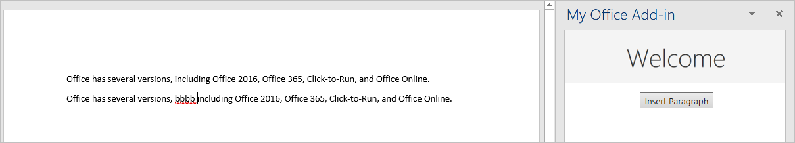
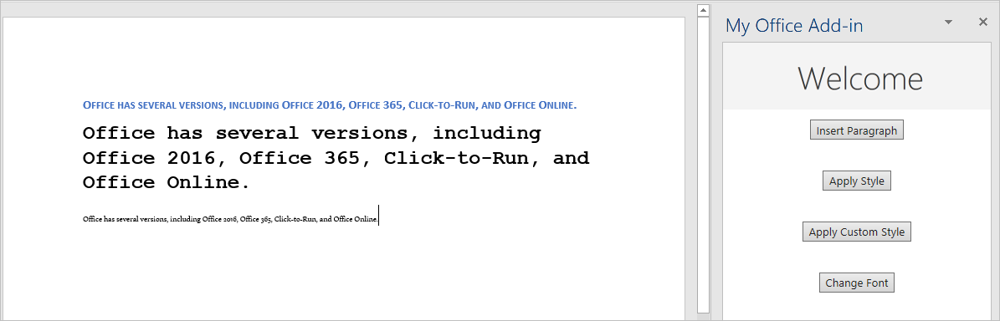

# <a name="tutorial-create-a-word-task-pane-add-in"></a>Tutorial: Criar Suplemento do Painel de Tarefas no Word

Neste tutorial: você criará um suplemento do painel de tarefas no Word:

> [!div class="checklist"]
> * Insere um intervalo de texto
> * Formatos de texto
> * Substitui e insere texto em vários locais
> * Insere imagens, HTML e tabelas
> * Cria e atualiza os controles de conteúdo 

> [!TIP]
> Se você já concluiu o início rápido da [compilação do seu primeiro suplemento do painel de tarefas do Word](../quickstarts/word-quickstart.md) e deseja usar esse projeto como ponto de partida para este tutorial, vá diretamente para a seção [Inserir um intervalo de texto](#insert-a-range-of-text) para iniciar este tutorial.

## <a name="prerequisites"></a>Pré-requisitos

[!include[Yeoman generator prerequisites](../includes/quickstart-yo-prerequisites.md)]

## <a name="create-your-add-in-project"></a>Criar seu projeto do suplemento

[!include[Yeoman generator create project guidance](../includes/yo-office-command-guidance.md)]

- **Escolha o tipo de projeto:** `Office Add-in Task Pane project`
- **Escolha o tipo de script:** `Javascript`
- **Qual será o nome do suplemento?** `My Office Add-in`
- **Você gostaria de proporcionar suporte para qual aplicativo cliente do Office?** `Word`


Depois que você concluir o assistente, o gerador criará o projeto e instalará os componentes de suporte do nó.

[!include[Yeoman generator next steps](../includes/yo-office-next-steps.md)]

## <a name="insert-a-range-of-text"></a>Inserir um intervalo de texto

Nesta etapa do tutorial, você testará programaticamente se o suplemento oferece suporte à versão atual do Word do usuário e inserirá um parágrafo no documento.

### <a name="code-the-add-in"></a>Codificação do suplemento

1. Abra o projeto em seu editor de código.

2. Abra o arquivo **./src/TaskPane/TaskPane.html**. Este arquivo contém a marcação HTML para o painel de tarefas.

3. Localize o `<main>` elemento e exclua todas as linhas que aparecem após `<main>` a marca de abertura e `</main>` antes da marca de fechamento.

4. Adicione a seguinte marcação imediatamente após a marca `<main>` de abertura:

    ```html
    <button class="ms-Button" id="insert-paragraph">Insert Paragraph</button><br/><br/>
    ```

5. Abra o arquivo **./src/TaskPane/TaskPane.js**. Este arquivo contém o código da API JavaScript do Office que facilita a interação entre o painel de tarefas e o aplicativo host do Office.

6. Remova todas as referências para `run` o botão e `run()` a função fazendo o seguinte:

    - Localize e exclua a `document.getElementById("run").onclick = run;`linha.

    - Localize e exclua a `run()` função inteira.

7. Dentro da `Office.onReady` chamada do método, localize a `if (info.host === Office.HostType.Word) {` linha e adicione o seguinte código imediatamente após essa linha. Observação:

    - A primeira parte deste código determina se a versão do Word do usuário é compatível com uma versão do Word. js que inclui todas as APIs usadas em todos os estágios deste tutorial. Em um suplemento de produção, use o corpo do bloco condicional para ocultar ou desabilitar a interface do usuário que chame a APIs sem suporte. Isso permitirá que o usuário ainda use as partes do suplemento às quais a versão do Word dá suporte.
    - A segunda parte deste código adiciona um manipulador de eventos para o `insert-paragraph` botão.

    ```js
    // Determine if the user's version of Office supports all the Office.js APIs that are used in the tutorial.
    if (!Office.context.requirements.isSetSupported('WordApi', '1.3')) {
        console.log('Sorry. The tutorial add-in uses Word.js APIs that are not available in your version of Office.');
    }

    // Assign event handlers and other initialization logic.
    document.getElementById("insert-paragraph").onclick = insertParagraph;
    ```

8. Adicione a função a seguir ao final do arquivo. Observação:

   - A lógica de negócios de Word.js será adicionada à função que passar por `Word.run`. Essa lógica não é executada imediatamente. Em vez disso, ela é adicionada à fila de comandos pendentes.

   - O método `context.sync` envia todos os comandos da fila para execução no Word.

   - O `Word.run` é seguido por um bloco `catch`. Essa é uma prática recomendada que você sempre deve seguir. 

    ```js
    function insertParagraph() {
        Word.run(function (context) {

            // TODO1: Queue commands to insert a paragraph into the document.

            return context.sync();
        })
        .catch(function (error) {
            console.log("Error: " + error);
            if (error instanceof OfficeExtension.Error) {
                console.log("Debug info: " + JSON.stringify(error.debugInfo));
            }
        });
    }
    ```

9. Dentro da `insertParagraph()` função, substitua `TODO1` pelo código a seguir. Observação:

   - O primeiro parâmetro para o método `insertParagraph` é o texto para o novo parágrafo.

   - O segundo parâmetro é o local dentro do corpo onde o parágrafo será inserido. Outras opções para inserir parágrafo, quando o objeto pai é o corpo, são "End" e "Replace".

    ```js
    var docBody = context.document.body;
    docBody.insertParagraph("Office has several versions, including Office 2016, Office 365 Click-to-Run, and Office on the web.",
                            "Start");
    ```

10. Verifique se você salvou todas as alterações feitas no projeto.

### <a name="test-the-add-in"></a>Testar o suplemento

1. Conclua as etapas a seguir para iniciar o servidor Web local e Sideload seu suplemento.

    > [!NOTE]
    > Os Suplementos do Office devem usar HTTPS, e não HTTP, mesmo durante o desenvolvimento. Se você for solicitado a instalar um certificado após executar um dos seguintes comandos, aceite a solicitação para instalar o certificado que o gerador do Yeoman fornecer.

    > [!TIP]
    > Se você estiver testando seu suplemento no Mac, execute o seguinte comando no diretório raiz do seu projeto antes de prosseguir. Quando você executa esse comando, o servidor Web local é iniciado.
    >
    > ```command&nbsp;line
    > npm run dev-server
    > ```

    - Para testar seu suplemento no Word, execute o seguinte comando no diretório raiz do seu projeto. Isso inicia o servidor Web local (se ele ainda não estiver sendo executado) e abre o Word com seu suplemento carregado.

        ```command&nbsp;line
        npm start
        ```

    - Para testar seu suplemento no Word na Web, execute o seguinte comando no diretório raiz do seu projeto. Quando você executar este comando, o servidor Web local será iniciado (se ainda não estiver sendo executado).

        ```command&nbsp;line
        npm run start:web
        ```

        Para usar seu suplemento, abra um novo documento no Word na Web e, em seguida, Sideload seu suplemento seguindo as instruções em [suplementos do Sideload Office no Office na Web](../testing/sideload-office-add-ins-for-testing.md#sideload-an-office-add-in-in-office-on-the-web).

2. No Word, escolha a guia **Página Inicial** e o botão **Mostrar Painel de Tarefas** na Faixa de Opções para abrir o painel de tarefas do suplemento.

    

3. No painel de tarefas, escolha o botão **Inserir parágrafo** .

4. Faça uma alteração no parágrafo.

5. Escolha o botão **Inserir parágrafo** novamente. Observe que o novo parágrafo aparece acima do anterior porque o `insertParagraph` método está inserido no início do corpo do documento.

    

## <a name="format-text"></a>Formatar texto

Nesta etapa do tutorial, você aplicará um estilo interno ao texto, aplicará um estilo personalizado ao texto e alterará a fonte do texto.

### <a name="apply-a-built-in-style-to-text"></a>Aplicar um estilo interno ao texto

1. Abra o arquivo **./src/TaskPane/TaskPane.html**.

2. Localize o `<button>` elemento do `insert-paragraph` botão e adicione a seguinte marcação após essa linha:

    ```html
    <button class="ms-Button" id="apply-style">Apply Style</button><br/><br/>
    ```

3. Abra o arquivo **./src/TaskPane/TaskPane.js**.

4. Dentro da `Office.onReady` chamada do método, localize a linha que atribui um manipulador de cliques para o `insert-paragraph` botão e adicione o seguinte código após essa linha:

    ```js
    document.getElementById("apply-style").onclick = applyStyle;
    ```

5. Adicione a seguinte função ao final do arquivo:

    ```js
    function applyStyle() {
        Word.run(function (context) {
            
            // TODO1: Queue commands to style text.

            return context.sync();
        })
        .catch(function (error) {
            console.log("Error: " + error);
            if (error instanceof OfficeExtension.Error) {
                console.log("Debug info: " + JSON.stringify(error.debugInfo));
            }
        });
    }
    ``` 

6. Dentro da `applyStyle()` função, substitua `TODO1` pelo código a seguir. O código aplica um estilo a um parágrafo, mas também é possível aplicar estilos em intervalos de texto.

    ```js
    var firstParagraph = context.document.body.paragraphs.getFirst();
    firstParagraph.styleBuiltIn = Word.Style.intenseReference;
    ``` 

### <a name="apply-a-custom-style-to-text"></a>Aplicar um estilo personalizado ao texto

1. Abra o arquivo **./src/TaskPane/TaskPane.html**.

2. Localize o `<button>` elemento do `apply-style` botão e adicione a seguinte marcação após essa linha: 

    ```html
    <button class="ms-Button" id="apply-custom-style">Apply Custom Style</button><br/><br/>
    ```

3. Abra o arquivo **./src/TaskPane/TaskPane.js**.

4. Dentro da `Office.onReady` chamada do método, localize a linha que atribui um manipulador de cliques para o `apply-style` botão e adicione o seguinte código após essa linha:

    ```js
    document.getElementById("apply-custom-style").onclick = applyCustomStyle;
    ```

5. Adicione a seguinte função ao final do arquivo:

    ```js
    function applyCustomStyle() {
        Word.run(function (context) {
            
            // TODO1: Queue commands to apply the custom style.

            return context.sync();
        })
        .catch(function (error) {
            console.log("Error: " + error);
            if (error instanceof OfficeExtension.Error) {
                console.log("Debug info: " + JSON.stringify(error.debugInfo));
            }
        });
    }
    ``` 

6. Dentro da `applyCustomStyle()` função, substitua `TODO1` pelo código a seguir. O código aplica um estilo personalizado que ainda não existe. Você criará um estilo com o nome **MyCustomStyle** na etapa [Testar o suplemento](#test-the-add-in-1).

    ```js
    var lastParagraph = context.document.body.paragraphs.getLast();
    lastParagraph.style = "MyCustomStyle";
    ``` 

7. Verifique se você salvou todas as alterações feitas no projeto.

### <a name="change-the-font-of-text"></a>Alterar a fonte do texto

1. Abra o arquivo **./src/TaskPane/TaskPane.html**.

2. Localize o `<button>` elemento do `apply-custom-style` botão e adicione a seguinte marcação após essa linha: 

    ```html
    <button class="ms-Button" id="change-font">Change Font</button><br/><br/>
    ```

3. Abra o arquivo **./src/TaskPane/TaskPane.js**.

4. Dentro da `Office.onReady` chamada do método, localize a linha que atribui um manipulador de cliques para o `apply-custom-style` botão e adicione o seguinte código após essa linha:

    ```js
    document.getElementById("change-font").onclick = changeFont;
    ```

5. Adicione a seguinte função ao final do arquivo:

    ```js
    function changeFont() {
        Word.run(function (context) {
            
            // TODO1: Queue commands to apply a different font.

            return context.sync();
        })
        .catch(function (error) {
            console.log("Error: " + error);
            if (error instanceof OfficeExtension.Error) {
                console.log("Debug info: " + JSON.stringify(error.debugInfo));
            }
        });
    }
    ``` 

6. Dentro da `changeFont()` função, substitua `TODO1` pelo código a seguir. O código recebe uma referência para o segundo parágrafo usando o método `ParagraphCollection.getFirst` encadeado para o método `Paragraph.getNext`.

    ```js
    var secondParagraph = context.document.body.paragraphs.getFirst().getNext();
    secondParagraph.font.set({
            name: "Courier New",
            bold: true,
            size: 18
        });
    ``` 

7. Verifique se você salvou todas as alterações feitas no projeto.

### <a name="test-the-add-in"></a>Testar o suplemento

1. [!include[Start server and sideload add-in instructions](../includes/tutorial-word-start-server.md)]

2. Se o painel de tarefas do suplemento ainda não estiver aberto no Word, vá para a guia **página inicial** e escolha o botão **Mostrar painel de tarefas** na faixa de opções para abri-lo.

3. Verifique se há pelo menos três parágrafos no documento. Você pode escolher o botão **Inserir parágrafo** três vezes. *Verifique com atenção se não há um parágrafo em branco no final do documento. Se houver, exclua-o.*

4. No Word, crie um [estilo personalizado](https://support.office.com/article/Customize-or-create-new-styles-d38d6e47-f6fc-48eb-a607-1eb120dec563) chamado "mycustomstyle". Pode ter a formatação que você quiser.

5. Escolha o botão **Aplicar Estilo**. O primeiro parágrafo receberá o estilo interno **Referência Intensa**.

6. Escolha o botão **Aplicar Estilo Personalizado**. O último parágrafo receberá seu estilo personalizado. (Se parecer que nada acontece, talvez o último parágrafo esteja em branco. Se estiver, adicione um texto a ele).

7. Escolha o botão **Alterar Fonte**. A fonte do segundo parágrafo muda para 18 pt, negrito, Courier New.

    

## <a name="replace-text-and-insert-text"></a>Substituir texto e inserir texto

Nesta etapa o tutorial, você adicionará texto dentro e fora dos intervalos de texto selecionados, e substituirá o texto de um intervalo selecionado.

### <a name="add-text-inside-a-range"></a>Adicionar texto dentro de um intervalo

1. Abra o arquivo **./src/TaskPane/TaskPane.html**.

2. Localize o `<button>` elemento do `change-font` botão e adicione a seguinte marcação após essa linha: 

    ```html
    <button class="ms-Button" id="insert-text-into-range">Insert Abbreviation</button><br/><br/>
    ```

3. Abra o arquivo **./src/TaskPane/TaskPane.js**.

4. Dentro da `Office.onReady` chamada do método, localize a linha que atribui um manipulador de cliques para o `change-font` botão e adicione o seguinte código após essa linha:

    ```js
    document.getElementById("insert-text-into-range").onclick = insertTextIntoRange;
    ```
5. Adicione a seguinte função ao final do arquivo:

    ```js
    function insertTextIntoRange() {
        Word.run(function (context) {

            // TODO1: Queue commands to insert text into a selected range.

            // TODO2: Load the text of the range and sync so that the
            //        current range text can be read.

            // TODO3: Queue commands to repeat the text of the original
            //        range at the end of the document.

            return context.sync();
        })
        .catch(function (error) {
            console.log("Error: " + error);
            if (error instanceof OfficeExtension.Error) {
                console.log("Debug info: " + JSON.stringify(error.debugInfo));
            }
        });
    }
    ``` 

6. Dentro da `insertTextIntoRange()` função, substitua `TODO1` pelo código a seguir. Observação:

   - o método serve para inserir a abreviação ["(C2R)"] no final do Intervalo cujo texto é "Clique para Executar". Para simplificar, ele faz uma pressuposição de que a cadeia de caracteres está presente, e que o usuário a selecionou.

   - O primeiro parâmetro do método `Range.insertText` é a cadeia de caracteres a ser inserida no objeto `Range`.

   - O segundo parâmetro especifica onde no intervalo, o texto adicional deve ser inserido. Além de "Fim", as outras opções possíveis são "Início", "Antes", "Depois" e "Substituir". 

   - A diferença entre "Fim" e "Depois" é que "Fim" insere o novo texto dentro o final do intervalo existente, mas "Depois" cria um novo intervalo com a cadeia de caracteres e insere o novo intervalo após o intervalo existente. Da mesma forma, "Início" insere o texto dentro do início do intervalo existente, e "Antes" insere um novo intervalo. "Substituir" substitui o texto do intervalo existente pela cadeia de caracteres do primeiro parâmetro.

   - Você viu em um estágio anterior do tutorial que os métodos insert* do objeto de corpo não têm as opções "Antes" e "Depois". Isso ocorre porque não é possível colocar o conteúdo fora do corpo do documento.

    ```js
    var doc = context.document;
    var originalRange = doc.getSelection();
    originalRange.insertText(" (C2R)", "End");
    ```

7. Vamos deixar `TODO2` de lado até a próxima seção. Dentro da `insertTextIntoRange()` função, substitua `TODO3` pelo código a seguir. Esse código é semelhante ao código que você criou no primeiro estágio do tutorial, exceto que, agora, você está inserindo um novo parágrafo no final do documento, em vez de no início. Este novo parágrafo demonstrará que o novo texto agora faz parte do intervalo original.

    ```js
    doc.body.insertParagraph("Original range: " + originalRange.text, "End");
    ```

### <a name="add-code-to-fetch-document-properties-into-the-task-panes-script-objects"></a>Adicione código para buscar propriedades do documento em objetos de script do painel de tarefas

Em todas as funções anteriores desta série de tutoriais, você colocou em fila comandos para *gravar* no documento do Office. Cada função terminou com uma chamada para o método `context.sync()`, que envia os comandos em fila para o documento a ser executado. Entretanto, o código adicionado na última etapa chama a propriedade `originalRange.text` e essa é uma grande diferença das funções anteriores que você escreveu, pois o objeto `originalRange` é apenas um objeto de proxy que existe no script do seu painel de tarefas. Ele não sabe qual é o texto real do intervalo no documento, portanto, sua propriedade `text` não pode ter um valor real. Primeiro, é necessário buscar o valor de texto do intervalo no documento e usá-lo para definir o valor de `originalRange.text`. Somente então será possível chamar `originalRange.text` sem causar uma exceção. Esse processo de busca tem três etapas:

   1. Coloque em fila um comando para carregar (ou seja, fetch) as propriedades que seu código precisa ler.

   2. Chame o método `sync` do objeto de contexto para enviar o comando em fila para o documento para execução e retornar as informações solicitadas.

   3. Como o método `sync` é assíncrono, certifique-se de que ele tenha sido concluído antes que o código chame as propriedades que foram buscadas.

Estas etapas devem ser concluídas sempre que seu código precisar *ler* informações do documento do Office.

1. Dentro da `insertTextIntoRange()` função, substitua `TODO2` pelo código a seguir.
  
    ```js
    originalRange.load("text");
    return context.sync()
        .then(function() {
            // TODO4: Move the doc.body.insertParagraph line here.
        })
        // TODO5: Move the final call of context.sync here and ensure
        //        that it does not run until the insertParagraph has
        //        been queued.
    ```

2. Você não pode ter duas instruções `return` no mesmo caminho de código sem ramificações, portanto, exclua a linha final `return context.sync();` no final de `Word.run`. Você adicionará um novo final `context.sync` posteriormente neste tutorial.

3. Recorte a linha `doc.body.insertParagraph` e cole no lugar de `TODO4`.

4. Substitua `TODO5` pelo código a seguir. Observação:

   - Passar o método `sync` para uma função `then` garante que ele não seja executado até que a lógica `insertParagraph` tenha sido enfileirada.

   - O `then` método invoca qualquer função que é passada e você não deseja `sync` invocar duas vezes, portanto, omita o "()" do final do Context. Sync.

    ```js
    .then(context.sync);
    ```

Quando terminar, a função inteira deve se parecer com o seguinte:

```js
function insertTextIntoRange() {
    Word.run(function (context) {

        var doc = context.document;
        var originalRange = doc.getSelection();
        originalRange.insertText(" (C2R)", "End");

        originalRange.load("text");
        return context.sync()
            .then(function() {
                doc.body.insertParagraph("Current text of original range: " + originalRange.text, "End");
            })
            .then(context.sync);
    })
    .catch(function (error) {
        console.log("Error: " + error);
        if (error instanceof OfficeExtension.Error) {
            console.log("Debug info: " + JSON.stringify(error.debugInfo));
        }
    });
}
```

### <a name="add-text-between-ranges"></a>Adicionar texto entre intervalos

1. Abra o arquivo **./src/TaskPane/TaskPane.html**.

2. Localize o `<button>` elemento do `insert-text-into-range` botão e adicione a seguinte marcação após essa linha: 

    ```html
    <button class="ms-Button" id="insert-text-outside-range">Add Version Info</button><br/><br/>
    ```

3. Abra o arquivo **./src/TaskPane/TaskPane.js**.

4. Dentro da `Office.onReady` chamada do método, localize a linha que atribui um manipulador de cliques para o `insert-text-into-range` botão e adicione o seguinte código após essa linha:

    ```js
    document.getElementById("insert-text-outside-range").onclick = insertTextBeforeRange;
    ```

5. Adicione a seguinte função ao final do arquivo:

    ```js
    function insertTextBeforeRange() {
        Word.run(function (context) {

            // TODO1: Queue commands to insert a new range before the
            //        selected range.

            // TODO2: Load the text of the original range and sync so that the
            //        range text can be read and inserted.

        })
        .catch(function (error) {
            console.log("Error: " + error);
            if (error instanceof OfficeExtension.Error) {
                console.log("Debug info: " + JSON.stringify(error.debugInfo));
            }
        });
    }
    ```

6. Dentro da `insertTextBeforeRange()` função, substitua `TODO1` pelo código a seguir. Observação:

   - O método serve para adicionar um intervalo cujo texto seja "Office 2019", antes do intervalo com o texto "Office 365". Para simplificar, ele faz uma pressuposição de que a cadeia de caracteres está presente, e que o usuário a selecionou.

   - O primeiro parâmetro do método `Range.insertText` é a cadeia de caracteres a ser adicionada.

   - O segundo parâmetro especifica onde no intervalo, o texto adicional deve ser inserido. Para ter mais detalhes sobre as opções de local, confira a discussão anterior sobre a função `insertTextIntoRange`.

    ```js
    var doc = context.document;
    var originalRange = doc.getSelection();
    originalRange.insertText("Office 2019, ", "Before");
    ```

7. Dentro da `insertTextBeforeRange()` função, substitua `TODO2` pelo código a seguir.

     ```js
    originalRange.load("text");
    return context.sync()
        .then(function() {
            // TODO3: Queue commands to insert the original range as a
            //        paragraph at the end of the document.
        })
        // TODO4: Make a final call of context.sync here and ensure
        //        that it does not run until the insertParagraph has
        //        been queued.
    ```

8. Substitua `TODO3` pelo código a seguir. Este novo parágrafo demonstrará que o novo texto ***não*** faz parte do intervalo original selecionado. O intervalo original ainda contém o texto que tinha quando foi selecionado.

    ```js
    doc.body.insertParagraph("Current text of original range: " + originalRange.text, "End");
    ```

9. Substitua `TODO4` pelo código a seguir:

    ```js
    .then(context.sync);
    ```

### <a name="replace-the-text-of-a-range"></a>Substitua o texto de um intervalo.

1. Abra o arquivo **./src/TaskPane/TaskPane.html**.

2. Localize o `<button>` elemento do `insert-text-outside-range` botão e adicione a seguinte marcação após essa linha: 

    ```html
    <button class="ms-Button" id="replace-text">Change Quantity Term</button><br/><br/>
    ```

3. Abra o arquivo **./src/TaskPane/TaskPane.js**.

4. Dentro da `Office.onReady` chamada do método, localize a linha que atribui um manipulador de cliques para o `insert-text-outside-range` botão e adicione o seguinte código após essa linha:

    ```js
    document.getElementById("replace-text").onclick = replaceText;
    ```

5. Adicione a seguinte função ao final do arquivo:

    ```js
    function replaceText() {
        Word.run(function (context) {

            // TODO1: Queue commands to replace the text.

            return context.sync();
        })
        .catch(function (error) {
            console.log("Error: " + error);
            if (error instanceof OfficeExtension.Error) {
                console.log("Debug info: " + JSON.stringify(error.debugInfo));
            }
        });
    }
    ```

6. Dentro da `replaceText()` função, substitua `TODO1` pelo código a seguir. O método serve para substituir a cadeia de caracteres "várias" pela cadeia "muitos". Para simplificar, ele faz uma pressuposição de que a cadeia de caracteres está presente, e que o usuário a selecionou.

    ```js
    var doc = context.document;
    var originalRange = doc.getSelection();
    originalRange.insertText("many", "Replace");
    ```

7. Verifique se você salvou todas as alterações feitas no projeto.

### <a name="test-the-add-in"></a>Testar o suplemento

1. [!include[Start server and sideload add-in instructions](../includes/tutorial-word-start-server.md)]

2. Se o painel de tarefas do suplemento ainda não estiver aberto no Word, vá para a guia **página inicial** e escolha o botão **Mostrar painel de tarefas** na faixa de opções para abri-lo.

3. No painel de tarefas, escolha o botão **Inserir parágrafo** para garantir que haja um parágrafo no início do documento.

4. No documento, selecione a frase "clique para executar". *Tenha cuidado para não incluir o espaço precedente ou a vírgula seguinte na seleção.*

5. Escolha o botão **Inserir Abreviação**. "(C2R)" é adicionado. Na parte inferior do documento, um novo parágrafo é adicionado com o texto inteiro expandido porque a nova cadeia de caracteres foi adicionada ao intervalo existente.

6. No documento, selecione a frase "Office 365". *Tenha cuidado para não incluir o espaço anterior ou seguinte na seleção.*

7. Escolha o botão **Adicionar Informações de Versão**. "Office 2019" está inserido entre "Office 2016" e "Office 365". Na parte inferior do documento um novo parágrafo foi adicionado, mas ele contém apenas o texto selecionado originalmente porque a nova cadeia de caracteres tornou-se um intervalo novo, em vez de ser adicionada ao intervalo original.

8. No documento, selecione a palavra "vários". *Tenha cuidado para não incluir o espaço anterior ou seguinte na seleção.*

9. Escolha o botão **Alterar Termo de Quantidade**. "muitos" substitui o texto selecionado.

    

## <a name="insert-images-html-and-tables"></a>Inserir imagens, HTML e tabelas

Nesta etapa do tutorial, você aprenderá a inserir imagens, HTML e tabelas no documento.

### <a name="define-an-image"></a>Definir uma imagem

Complete as etapas a seguir para definir a imagem que será inserida no documento na próxima parte deste tutorial. 

1. Na raiz do projeto, crie um novo arquivo chamado **base64Image. js**.

2. Abra o arquivo **base64Image. js** e adicione o código a seguir para especificar a cadeia de caracteres codificada em base64 que representa uma imagem.

    ```js
    export const base64Image =
        "iVBORw0KGgoAAAANSUhEUgAAAZAAAAEFCAIAAABCdiZrAAAACXBIWXMAAAsSAAALEgHS3X78AAAgAElEQVR42u2dzW9bV3rGn0w5wLBTRpSACAUDmDRowGoj1DdAtBA6suksZmtmV3Qj+i8w3XUB00X3pv8CX68Gswq96aKLhI5bCKiM+gpVphIa1qQBcQbyQB/hTJlpOHUXlyEvD885vLxfvCSfH7KIJVuUrnif+z7nPOd933v37h0IIWQe+BEvASGEgkUIIRQsQggFixBCKFiEEELBIoRQsAghhIJFCCEULEIIBYsQQihYhBBCwSKEULAIIYSCRQghFCxCCAWLEEIoWIQQQsEihCwQCV4CEgDdJvYM9C77f9x8gkyJV4UEznvs6U780rvAfgGdg5EPbr9CyuC1IbSEJGa8KopqBWC/gI7Fa0MoWCROHJZw/lxWdl3isITeBa8QoWCRyOk2JR9sVdF+qvwnnQPsF+SaRSEjFCwSCr0LNCo4rYkfb5s4vj/h33YOcFSWy59VlIsgIRQs4pHTGvYMdJvIjupOx5Ir0Tjtp5K/mTKwXsSLq2hUWG0R93CXkKg9oL0+ldnFpil+yhlicIM06NA2cXgXySyuV7Fe5CUnFCziyQO2qmg8BIDUDWzVkUiPfHY8xOCGT77EWkH84FEZbx4DwOotbJpI5nj5CQWLTOMBj8votuRqBWDP8KJWABIr2KpLwlmHpeHKff4BsmXxFQmhYBGlBxzoy7YlljxOcfFAMottS6JH+4Xh69IhEgoWcesBNdVQozLyd7whrdrGbSYdIqFgkQkecMD4epO9QB4I46v4tmbtGeK3QYdIKFhE7gEHjO/odSzsfRzkS1+5h42q+MGOhf2CuPlIh0goWPSAogcccP2RJHI1riP+kQYdVK9Fh0goWPSAk82a5xCDG4zPJaWTxnvSIVKwKFj0gEq1go8QgxtUQQeNZtEhUrB4FZbaA9pIN+98hhhcatbNpqRoGgRKpdAhUrDIMnpAjVrpJSNApK/uRi7pEClYZIk84KDGGQ+IBhhicMP6HRg1ycedgVI6RELBWl4POFCr8VWkszpe3o76G1aFs9ws+dMhUrDIInvAAeMB0ZBCDG6QBh2kgVI6RAoWWRYPqBEI9+oQEtKgg3sNpUOkYJGF8oADxgOioUauXKIKOkxV99EhUrDIgnhAG+mCUQQhBpeaNb4JgOn3AegQKVhkvj2gjXRLLrIQgxtUQYdpNYsOkYJF5tUDarQg4hCDS1u3VZd83IOw0iFSsMiceUCNWp3WYH0Wx59R6ls9W1c6RAoWmQ8PaCNdz55hiMEN4zsDNhMDpXSIFCwylx5Qo1a9C3yVi69a2ajCWZ43NOkQKVgkph5wwHi+KQ4hBs9SC9+RMTpEChaJlwfUFylWEafP5uMKqIIOPv0sHSIFi8TFAzpLiXxF/KCbdetEGutFUSa6TXQsdKypv42UgZQhfrWOhbO6q8nPqqCD/zU4OkQKFpm9B7SRbrTpQwzJHNaL/VHyiRVF0dfC2xpOzMnKlUgjW0amhGRW/ZM+w5sqzuqTNWtb9nKBZDLoEClYZGYe0EYaENWHGDaquHJv5CPnz/H9BToWkjmsFkTdOX0GS22p1ovYNEdUr9vCeR3dJlIG1gojn2o8RKPiRX+D0iw6RAoWmYEH1HioiQZqq47VW32dalUlfi1fQf7ByEdUQpMpYfOJ46UPcFweKaMSaWyaWL8z/Mibxzgqe3G4CC6pT4dIwSLReUCNWrkJMdjh8sMSuk1d3bReRGb3hy97iS/SEl+5bQ0LqM4B9gvytaptC6kbwz++vD3ZG0r3EBDoWUg6RAoWCd0D9isXReTKTYghZbhdUB/UYlKV2TSHitZtYc9QrqynDGy/GnGg+4XJr779ShJ0gNdAKR3i/PAjXoIZe8BGBS+uhqtWAF4VXUWu3G//ORVqdVRiEumhWgFoVHT7gB1LnFAvVaJxYZJ+qx/XRuo1X0+RFqzPsF/QFZuEgrVcHnDPCGbFylnajN/wAZZvqgpR8IzO275tTvjnwl/4sORC6C9xWJLoYCKNrbpuR3Jazp/jxdUJmksoWIvvAfcLsD4LuLfn5hOJhWlVQ+lyNZDFcUl636GY5/Wpyzo3FRZ+WBeT1JhpGDVlIMMbjYfYM3Ba4zuXgkUPGBD5B5Kl6LaJ4/uh/CCDTvDjW4ROxZm4gj7+dwZLY24067AkF9OtesCaRYdIwaIHDIzMrmSzv2NNTgl4fLlSXw6kjs8pWN+FfHu3n8p/xpSBjWrwL0eHSMGiB/TL+h1JnNJ+xTA6MawXh1ogTWA5S5tvLS8vMVUM6s1j+TKZEASjQ6RgkVl6wH4pcUM+zs8qBq9WyRyMGozP+5J0/nzygrrLSkS4ONPmNg/vyr1npiQG9+kQKVhkBh5woFbSI8EuQwxTkS1j2xoG0zsHeBVcRsl/RNMqyoMOG9WRjAUd4pzD4GhoHjDsMIEqchX48JuUgU1zJN+kSa4D+LnjHfXiqqsa5Oejb8J/fs9TAZjFtiXXvgADpaqXZsqUFRY94NRq1agErFbrRWzVR9Tq9JlOrWy75NncCf982n+o+sYCDJTSIVKw6AGnRhoQbZsBv3S+MlyxAtC7xPF9WMUJDsi5M+gmVCWImpvolorOgXzTMPBAKR0iBWvuPWB4+4CiWj2Rz3MPcFSXHb90NmawbWDLRVZAc2pHZTkF2fWDKugQRqBUCvcQKVj0gI6qRxYQtfvGBIUdvHQ2fmk/VR7fk5Q5jr+2fmfygrpTfM+fu8qa6lEFHcIIlGocolWkQwwcLrr79oBB9YRxg7SDXbDjJISue71LHJWnrno+vRh+BX2Xq2QOO6+Hf3TTXsYl43M3BhVcZFNjEyvIluUNvAgrrIX1gINqRdpvM0C1EhatbBvowaM5neOVe/L2VX176/jip88CUysAhyV5SRheoFRSfV+i8RAvckH+XKyweBW8qNWeEelEP1XkKqgQw3j/T3sxyNv6cSKNm02xA3KrOvLV1gq4Xh1u3vUusWcE7KESK7jZlHvSoDqU+q/4CAUrItomWtUoRvup1KpRCWxb0KiNqFXvcoreWCem/ETh+ILRYJnvJzlxz+7wrt/l9qkuHUIIrMk9bxaZEjIltl2mYMWDjoVWFae1sAouVeQq2LUYZwfRaVG1dR9PnKp802EpxG016TCOgZsOb6tk9RayZVZVFKwZ8cff4b/+Htcq8sd17wInJt5UA17SUqnVWR0vbwf5Qn5KgPO6bo0mU0K2LJetbgtvqjgxQw8uqcbthDH+OrHS/5FV19MuJDXreoSCFQC9C3yxisQK8hVk1dteZ3W8qQY2VFm68OF/emj0JNJ430DKQCKN3gU6FrrNSHf9VaMrfI68F+ynXVKpkhxndRyX0TlQzv4hFKyABWuwMPGROWxiJ6kdmmibaJu+7gTpPRbgDbZsqJa9/T8AMrvIlnWx/m4Tx+XhY4yC5RXGGjzRbeHlbd3ZsWQO+Qp2mth84nFtSBoQtS0M1cobqqCD50BpMovrj/Dpufyk1OBXZueKgyq6KVjEI/bZMf3ef6aErTp2XiOzO8UtIe0gCuCoHMWm5MLWyJfK09HTdihdvwPjc+w0J4wvbJv4KhfF2VIKFnHLm8f4KjfhkF0yh00TN5vYfDJ510wVED0qR7ENv7Sa5SZQmlhB/gF2XsOoTdj+O6tjz8Dh3Tlbaow9XMNy/153rGGpDIJ+Ycv5bm6bcvVR5YaiPFCy8Kze6s+4lj4VpIHS1Vv4sORqa09YrlL5fa5hUbBmLFiDd/am6Soi0LtAqzqyMK9Sq8BDDEQVdMBooDSxgvXihAV14RfqxgBSsChYcREsmyv3lImtcU5raJs4q8sjV/MYYpgLrj9SxlP2C/iuiXxFl1EYL4GPym5/TRQsCla8BKu/3qFNbLl80a9yVKuwUIWzpmKQrnIPBcsrXHQPT+AucXzf70l91lahclT2FV7tNmEV8fI2t24jI8FLEC52Ysv9wpbAtsVLGNNy2+VyFWGFNX+4SWyReYHpKgrWUuAmsUXiDNNVFKwlsxJBLGyRGVh7LlfFAq5hzeTd38LL27oo0ABpnykSIG766pzWYH3GS0XBWvJr7yLg8/1F1J18l4pk1lXuhM1CaQkJPixN/jvXKlGMpVpa8u7CvSkj9CGshIIV92e7tOvxeBXGhGFIrN6Sp0ZPa5Jw1gfsdEzBWmbGb4BuE4d3JbdKtszHe1jllZTjsqTBvJtymFCwFpbxpRM77nAouzE+MnnBAiazK++rYZ9Flw4B4mODgrWkpG5I1nHf1gDFrPa1gveRNmQc+5jnOL2L/pDqzoGkN2mArpChFgrWXD3eS5J38KDJjDTKsMG4aaDlrXTjr1UdJkJPTLpCChYBAEmzSqcHOX8utySZXV65AFBFGezjgULBS1dIwaIflDzehVVeVZHFiIN/VFEGoZtVtyUxbtwrpGDNDb3fheUH26Z4Nq3bkhw5TKT9dtciqihDtynpWN2mK6RgzS/vemH5QemU9kZF0tohX6Er8VteSTmWPQlOZa5w4gwRQsFaZD/Yu5APLOhdyvs6XOfqu+faVhFlOKsrfwXjRRZHzFOwlumeKbkqr2xaVUmOdL3IiEPA5ZXmhPn4b2edy1gUrOVh/O2uaY/Vu2TEITi1eiCPMrRNnD9XC9Yz0Zgnc3SFFKxl9YPd5oT+Su2nkgQjIw7TklhR7ldMbOBzQldIwVpOxu+Z8SWScY7K8iKLEQf3bFTlUYZWdZjXVT4zTLrCGD16eAlm6QfdCJZ9WEdYLbYjDmG3FU/mRqoJD90EV3+Ga//o5aUPS77m2QiFrbQm6l24+ok6B+g2R0pj2xWy9SgFa6HV6o74kO9Ykx/vNsdlyficfGVkanRIgpV/4Euw3v/E4xZBMheYYKn2VZ0HcfS0quK6YaaE4/t8U9MSLlN55X4aRedAXouxVZab54Q0ytBtTnH933KvkIJFwdIEGsaRVjeZEiMOHsurRmWKyTfdlrj1wb1CCtZy+cHT2nSjorotuWbFvMj6w6/xhxN81xL/G/zsvY7ks384wfdBDHBURRmkB3EmukIBHpOaBVzDmlF55Wa5ffyeyZZF4VsrILM79e0XGb/5JX7zS8nHt+r92rDz79gvhPPWVkcZpF0S9cgTpHf51maFtQSCpTqOo0d1WCfPQRUyVFGGs7ouKaq5+IJmJdJYv8PLTMFaDj/ojcZDyd5ZMkd7IqKKMsDHqEcGsihYS+oHT0zvX016v3FQhYBqrV1/EGeCKxw7pkPBomAtGokV8W3dbXq/Z6A4rMNpYE5Wb8mjDPA9SZuucOb3Ey9B6OVVUH5wwFEZW3Xxg5kSTkxfUmjj/MrCdz7+ovpvclxYo2HTVKqVz5xtqyo6zfWil+VIQsGaGz/4xnevBelhHQD5Cl7eDqA88fCpcX6cns0Fv3JPHmUQWrZ7Y/yYDvcKaQkX2Q+6P46j5+uS5IN2xCEO9C7xrTWbC36toiyOpgq+KS25SVfICmtpyqsTM5ivbA/7HN8Iy1emjqQKOGu0lIHrj+SfEhD+5mFJ0t85AlQDJrrNwA6Kt01xuZCukIK1sILlIS+qolGRLJDZEQc/N6dmxqfmU85dufbTANbpPKCa3wXfa+3Co6JjIWX4coWzWt2jJSRT+EGftc/4nSNdlMmWo86R5ivDg3XdlryBVwR8ZCrVIdiTACdjrnBaJx7g24CCRcIqrwKvO1pVifNKpCPtoZwyRlrQfD0jM6iJMgQuoEyQUrAWX7B6F8ELVu8S38jMTqYUXS8BZ4ag8VBnGyP7NgQb6z/qMX7ZhV/lepGnoyhYMeP/vouRHxzw5rG80V0008CcZrBzEORS0VSoogxQDBz0D6fpULAWSrAi8IPDukYmE2uF0LfbBTPooQVCIGiiDG0zrEbG7ac8pkPBWiCEwEG3GeLOd/up3IiFXWQ5Xdjx/ZntfKmiDEC4FR9dIQVrQUhmxQXgsLf5pXem0JE9PDN4/jyAELnnS62JMoTa8P7EpCukYC0EH4QZv5JiH9YZJ6SIg9MM9i5nZgY1VWQgB3EmXnNh9ZCCRcGaSz4cvYE7VhQjoaSHdUKKODjNYIDzuKZl9ZZSI76pRJF1oiukYC2CH3TGoBHccRw99mGdcQKPODjN4Omz2YTabVRa3G3izeMovoHxc+wssihYc+8H30Z1Szcq8tBmgKvv8TGDmV3xweC8DtEwPk2HgkXBmm8/eFoLd+lXuH+kCzcBRhycZtAqzibUDiCxoiyvzuqRjuQQyuf1Ilu/UrDm2Q9G7Jikh3WCKrKcZvDN41BC7X/+NzBq+Nk3yurJZnx6UPTllap8/oBFFgVrfv1gxILVu5QfnUvmcOWe3y8+CBB0DuRHgvyI1F//Cp9+i7/6Bdbv4E/zuv5/yayyH3QYB3EmVrXCr/jDEu8DCtZ8+sG2OYNz+e2n8m27a76ngQ3+eYDtrlZv9UXqp3+BRMrVP9FUi1/PQiwEwUoZdIUULPrBaZAeoAtqUEXj4SzbOWmiDG0zuuVC4bcsyDddIQVrDhCO43iblhrMLfRMmSP1+fCP4ITz//4WHUuZ7dpQJ0VndfR6vHkDXSEFa/4E68Sc5Tejuns/Mn3dmVY4tUOvg9//J379C/zbTdQ/wN7HcsHSRBla1dmUV3SFFKy5JHVD7HAS9nEcPefP5YZ0rTDd8BtBBIMKtf/oJwDwP/+N869w/Hf44n3861/iP/4WFy+U/0QTZfB/EGe9qOyo5bKkFa4MXWE4sKd7OOVVtxnFcRw9x2X5cs+miRdXXX2Fb62RwRMB5hga/4Df/2o6+dNEGfwfxLle7ddEnqOwp7WRY9gfliJK27PCIh4f0YJDmTmqwzruIw69C5zVh/8FyG//aTq10nRl8H8QJ1/pq1VmVzKIyCXCpaYrpGDNkx98W4vFN3ZUlucPrlXm7JhueE2vEukRKfS8kdo5EDdPPWsfoWBF6gfP6gEvAKcM5Cv9/zIl5a0rKZEu5bVeUBGHaFi9pbz5/R/E2aiOaHcy611oTkwKVti89+7dO14Fd49QC3sfyz+183qkwjosBXacba2AfEVcJrdlSHUKR9SmFdxsyjXuRW6WO2vu+eRL5USc/YKvaHvKwPYriZV+kfPy1ZJZ7Iz63D1DuZT5c953rLBi4gcDyYsmc9g08cmXkk29xAryD3CzqbyNBXVTzbnyE3GIrnrdVf6YpzW/B3Gc247dVl++PRdZ3Za40qf5OrM6N07Boh8U7yKfO1a2VO28njCeM7GCT750dWupDuv4iThEQ2JFZ119TsRZL478+F+Xhsthnv2ysPSu6TbzLYc/U7BmgvCm9Bm/ShnYtiRS1TlA4yEaD3H+fEQQN5+46imq2q3fqMb62mbLyvld/g/iOM8k2mcDBl/Tc5ElFNfJXHQDIilYxIVa3Rm5o3wex0kZ2KqL+3ftp3hxFXsGGhU0Ktgv4Is0Xt4eytaVe5MrAlXT95Qx9Zj1yNBEGXoXk+c5pwydZR5EGWzXPCjWfBZZvUvxicWldwrWbHjXm1xe+Vy92jRH1KpzgL2P5U3Tz+ojp2TyD5SVyADV9r+wTRYfNFGGVnWC706kYdTwyZfYqktkS4gytKrDKzxw9EEVWexBSsGaDb3fTRYsP3lRofl65wD7BV1fBGFH302RJbWrwt0bEzRRBjcHca79UECt3pLIllOju60RKXd+cW9F1umzkQV1ukIKVoz8oLME8Hkcx6l9vUvsFyZvJDnv29XC5JdQFVlOfxSf8krFUXlCeZXMiWLnlC3BBY+30BqUb56LrBO6QgpWHAUr0OV2Z49NVUJdoGMNb103iqNq+o7wx0RPV2yqowzd5uSMW7eJPUOymDiQLWc1NL6057/Icr9XSChY8ypYmnUQvWYNcBPLUk3WEfb4Z0ggUYZuE1YR1meSWmxgBp1r7SrF8VZkdQ5Glh2TubjHRyhYS+cHO5bfXXan9LhPFTrvBDfHiVWHdRCbiIMmynBWn24T9rSGr3LKo9HfXygX9Z11nLciS7jIbOlHwYpXeeW/PcP3DpHSz4xRlVQu+x84N8WcxCHikFjR7QB4OOdsByBe3pYsLyaz2H6FTVOuj4PX8lZkveVeIQUrzoI10cQl0hNaxDkrLDfbdon0yMKT+0Mqvcv4Rhw2qsqqx89BnLM69gx5CZzZxc5ryev6LLKEGauJdGCjISlYxK8fnHgcZ72Im01dh1+MtsfL7E7OVW1UR/bLT8wpvn/VYZ3ZRhxSN3S1jM+DOGuF4b6EcFoAwJV7uNkUk1+DqtlbkSUU3SyyKFhzU14Zn/crF826eO9iZP9r09S1kcmWR+zb6bOpl/xVh3VmGHHQ7FT6b9k+qJJ6l3hVxJ4h7jYOjpQPtKljDWs6D0UWE6QUrFiQWBl53gpCI7d7Pyyg6B/UDUer39Vb2KpLNCuRxkYV1x+NfHEPjX1Vh3Uwo4jD+h2lmvufiOM85m235ek2cVjCy9uizUysYPMJdn6QLT8rWcI0HbpCCtZ8lFdOd5C6oSuy7LvIaZGcD/y1AjIlbFsjDY57l97HmqpM1kwiDvryymcDDLuNcrclbpKe1bFfwOFd8esns9h80k9s+SmyGMgKGjbwc81ZvT+Rwfh85J3npodcIo2bzb4rPH+O/cIEQRQOFWqe4frjOxPZfCIvHAY/bDTkHyjlwE6BBjVAO5nTLd7lH8i+gdbQIx/endp6f3o+LJN7F/hitf//mq6EhBVWkH7QqVbdpqutK2d4WjO7eFCyfZVD4+GEgz7+1QrqoMBaIbqIw8QoQ1BqBXXyw3adL65KfpvOFT2fK1l0hRSsOfCD475m05zwdLXvnz0DL66i8VByx3YOsGcEMDJeOPo7UvVENahCE2VwcxAnQLpN7Bfw8rZygd/DShb3CilYMRKsN67Xp3sXw/Upu1mopn2KfXzXqGHnNfIPROGwTWVQM01VveGTuSgiDvoog+cpgT69/4scju8HU9kJx3TWi3M2ryhmcA1rmvexVcSnjntbM5ZCxaY5YrXsjaSOhY6FRBopA8kcUoauIUnjod8tM0kxpVhC6l0o85ZBoVnKiXgdTeJV09iojvy+vM2nEC6vPaOEa1gUrNAFq22OpNWPyl5GeAqa5Z7z52hUAh5oOkAY/DOgbeLwbmjl6h0Yak/tcyJOYDWggY1qf9vUw6I7xqbpnNZgfUbBoiWM3A96a89wWJrabpw+w8vb2C+EpVZQr75nSiFGHDRRhrYZC7Wy6+j9AqzPvKRzB3WZc7WRrpAVVhRc/AvSPxOfk37sxnoRawUkc0ikJR6w28J5HWd1nNYiGgm1/Up+cigka3blnq4/xLzMTPT2wx6WkCmxwqJghcnvj/DTDXElItgVk/cNAPjWms3QOjtbr6oKA/5h1eNdAbSqOL6/UG+exMrI6udpDYk0BYuCFSZ//B3+5M/6/9+7wFe5IPNBMUG1sBJsehPA9Ue6iTgLeW2FvHHHcttEiDjgGpZrBmqFIKalxhPVYZ1gIw6a+V0I4iBOPBEie1QrCtbM3nwLQ+dAua6cLQfWxeEjU/mpbhONh4t5bdtPOZ6egjULuk1f01JjjqrpeyLtfYC7k9VburWbwCNmfM5RsFheLbQcqyfrCJMTvaFpu9qxIj2IEz0nJu8eClb0tf2iv+1Uh3Xgu1XWlXu6TqpH5QW/sOfPAztQRcEiruhYvqalzgW9S3yjsGZrBe/9BhIruKZ2fGf1uCRFWZ5TsFjVzxlvHitrAc9FluawN3y3bGd5TsEiEt4uzRNStf6dzMkb3enRRxna5uLXrf0K/SCApkAULOK2nl+k8yITaoGnyqOL2fLUp+E+Mr2II4t0QsHyJVhLhUpH7L4r7pkYZViex8BSFekULApWpGgm60wVcdCom7N59JLQbXHp3TMJXgK3vOvBqKF3gY6FbhPdJr5rLn5p8HVppJeTk+tVV10c9ONjF/UgzshNtoKUgR+nkTKGbRqJJ3j42f8Ds4luEx2rr2XfX6BjLdRNqJqsA8AqTgj967sydJt4cXWh3gypG8M2DKsFAGzJQMGaE2wzdV7v/3/vYl43wpJZbFty0ZmoOJr5XQiha02U1+QnOSRz/ZbWdmsgTWiDULDmkt5Fv93VfPlKje40KsrjykJr4HFBn23Lds9ujoaOgkVfGWtfqXF2mvZVQgcogZi0bKebo2CRBfSVmo7G0gahmv6lsy2v6OYoWMuL7ewiftPPyleqJutA1oJd1SFe9fcXz83ZD5vvmlPPXiUUrBBpm8Pooz1gZmAr7LtlYXylZiqXUDFldnVtZAIfHTZbN6e67IkVZMvIllm+UbDiR6uKRkWuDs5HfTI39CPz6Cs10/QGa1L6KIOf4ayzdXNTFbaZXWxUKVUUrBhjh7bdJyHt289pW+LvKzUrU4OIgz7KoNlVjJub8ybxmV3kK9xJpGDNj2wdlX3Fi2LuKzV7f0dlvK3pogzjW4rxdHOef3H5CvcWKVhzSLeJ43KQrd/j4yuTOeUqsl21ae7YjoXT2tyUk1N51Y9MShUFa845q6NRCTdtNFtfGc9rjgiDIMks8hXuA1KwFojTGo7LUcfZZ+srI3Nz3/3g6aKP2nITkIK1yLRNHJVnHF6fua/06eZsVYrDYaYr93CtQqmiYC00024jRkZMfKUtSQM3B8RxLAU3ASlYSydb31Tw5vEcfKsh+cqZuznPV2OjyhHzFKylpNtEozKXzVXc+8p4ujkPpG7gepWbgBSspSeCbcRoGA+LzkX3GDdmmZuAsXpc8hLMkrUC1uo4q+Pr0nINYpiLQjJb1kX2ySzgEIp4yNZOE5tPkMzyYsSlYLzZpFpRsIiaTAnbFvIPph75R4L8Lexi5/WEIdWEgkUAIJFGvoKbTS+jlYlPVm9h5zU2TUYWKFhketnaeY3MLi9GRFL1yZfYqlOqKFjEK8kcNk1sv+qHoUgoFzmLzSfYqjOyQMEiQZAysFXHJ19OMWaZuCpjV3D9EXbYv5iCRQJnrYBti9uIgUmVvYzBIcUAAAIqSURBVAmYLfNiULBIaGRK2GlyG9HfNdzFtsVNQAoWiYrBNiJlayq4CUjBIjMyNWnkK9i2uI3oVqq4CUjBIjPG3kbcec1tRPUlysL4nJuAFCwSJ9mytxEpWyNF6Ao2n2CnqZyXQShYZGasFbBV5zZiX6rsTUDmFShYJNbY24jXHy3venxmt39omZuAFCwyH2TLy7iNuH6nvwlIqaJgkXmzRcu0jWhvAho1bgJSsMg8M9hGXL+zoD9gtp9X4CYgBYssjmwZtUXbRrQPLe80KVUULLKI2NuIxudzv41obwJuW9wEpGCRRWe92O/FPKfr8VfucROQgkWWjExp/rYR7c7FG1VKFQWLLB+DXszx30a0NwF5aJlQsChb/W3EeMpW6gY3AQkFi4xipx9itY1obwJuW5QqIj5keQkIEJuRrhxfSlhhkSlka4YjXTm+lFCwyNREP9KV40sJBYv4sGY/bCNeuRfuC63ewvYrbgISChYJQrY2qmFtIw46F6cMXmlCwSIBEfhIV44vJRQsEi6BjHTl+FJCwSLR4XmkK8eXEgoWmQ3TjnTl+FJCwSIzZjDSVQPHl5JAee/du3e8CsQX3Sa6Y730pB8khIJFCKElJIQQChYhhFCwCCEULEIIoWARQggFixBCwSKEEAoWIYRQsAghFCxCCKFgEUIIBYsQQsEihBAKFiGEULAIIRQsQgihYBFCCAWLEELBIoQQChYhhILFS0AIoWARQkjA/D87uqZQTj7xTgAAAABJRU5ErkJggg==";
    ```

### <a name="insert-an-image"></a>Inserir uma imagem

1. Abra o arquivo **./src/TaskPane/TaskPane.html**.

2. Localize o `<button>` elemento do `replace-text` botão e adicione a seguinte marcação após essa linha: 

    ```html
    <button class="ms-Button" id="insert-image">Insert Image</button><br/><br/>
    ```

3. Abra o arquivo **./src/TaskPane/TaskPane.js**.

4. Localize a `Office.onReady` chamada do método próxima à parte superior do arquivo e adicione o código a seguir imediatamente antes dessa linha. Este código importa a variável que você definiu anteriormente no arquivo **./base64Image.js**.

    ```js
    import { base64Image } from "../../base64Image";
    ```

5. Dentro da `Office.onReady` chamada do método, localize a linha que atribui um manipulador de cliques para o `replace-text` botão e adicione o seguinte código após essa linha:

    ```js
    document.getElementById("insert-image").onclick = insertImage;
    ```

6. Adicione a seguinte função ao final do arquivo:

    ```js
    function insertImage() {
        Word.run(function (context) {

            // TODO1: Queue commands to insert an image.

            return context.sync();
        })
        .catch(function (error) {
            console.log("Error: " + error);
            if (error instanceof OfficeExtension.Error) {
                console.log("Debug info: " + JSON.stringify(error.debugInfo));
            }
        });
    }
    ```

7. Dentro da `insertImage()` função, substitua `TODO1` pelo código a seguir. Esta linha insere a imagem codificada em base 64 no final do documento. (O objeto `Paragraph` também tem um método `insertInlinePictureFromBase64` e outros métodos `insert*`. Confira a seção insertHTML a seguir para conferir um exemplo).

    ```js
    context.document.body.insertInlinePictureFromBase64(base64Image, "End");
    ```

### <a name="insert-html"></a>Inserir HTML

1. Abra o arquivo **./src/TaskPane/TaskPane.html**.

2. Localize o `<button>` elemento do `insert-image` botão e adicione a seguinte marcação após essa linha: 

    ```html
    <button class="ms-Button" id="insert-html">Insert HTML</button><br/><br/>
    ```

3. Abra o arquivo **./src/TaskPane/TaskPane.js**.

4. Dentro da `Office.onReady` chamada do método, localize a linha que atribui um manipulador de cliques para o `insert-image` botão e adicione o seguinte código após essa linha:

    ```js
    document.getElementById("insert-html").onclick = insertHTML;
    ```
5. Adicione a seguinte função ao final do arquivo:

    ```js
    function insertHTML() {
        Word.run(function (context) {

            // TODO1: Queue commands to insert a string of HTML.

            return context.sync();
        })
        .catch(function (error) {
            console.log("Error: " + error);
            if (error instanceof OfficeExtension.Error) {
                console.log("Debug info: " + JSON.stringify(error.debugInfo));
            }
        });
    }
    ```

6. Dentro da `insertHTML()` função, substitua `TODO1` pelo código a seguir. Observação:

   - A primeira linha adiciona um parágrafo em branco ao final do documento. 

   - A segunda linha insere uma cadeia de caracteres de HTML no final do parágrafo; especificamente dois parágrafos, um formatado com a fonte Verdana, e o outro com estilo padrão de documento do Word. (Conforme mostrado anteriormente no método `insertImage`, o objeto `context.document.body` também tem os métodos `insert*`).

    ```js
    var blankParagraph = context.document.body.paragraphs.getLast().insertParagraph("", "After");
    blankParagraph.insertHtml('<p style="font-family: verdana;">Inserted HTML.</p><p>Another paragraph</p>', "End");
    ```

### <a name="insert-a-table"></a>Inserir uma tabela

1. Abra o arquivo **./src/TaskPane/TaskPane.html**.

2. Localize o `<button>` elemento do `insert-html` botão e adicione a seguinte marcação após essa linha: 

    ```html
    <button class="ms-Button" id="insert-table">Insert Table</button><br/><br/>
    ```

3. Abra o arquivo **./src/TaskPane/TaskPane.js**.

4. Dentro da `Office.onReady` chamada do método, localize a linha que atribui um manipulador de cliques para o `insert-html` botão e adicione o seguinte código após essa linha:

    ```js
    document.getElementById("insert-table").onclick = insertTable;
    ```

5. Adicione a seguinte função ao final do arquivo:

    ```js
    function insertTable() {
        Word.run(function (context) {

            // TODO1: Queue commands to get a reference to the paragraph
            //        that will proceed the table.

            // TODO2: Queue commands to create a table and populate it with data.

            return context.sync();
        })
        .catch(function (error) {
            console.log("Error: " + error);
            if (error instanceof OfficeExtension.Error) {
                console.log("Debug info: " + JSON.stringify(error.debugInfo));
            }
        });
    }
    ```

6. Dentro da `insertTable()` função, substitua `TODO1` pelo código a seguir. Essa linha usa o método `ParagraphCollection.getFirst` para obter uma referência do primeiro parágrafo e, depois, usa o método `Paragraph.getNext` para obter uma referência para o segundo parágrafo.

    ```js
    var secondParagraph = context.document.body.paragraphs.getFirst().getNext();
    ```

7. Dentro da `insertTable()` função, substitua `TODO2` pelo código a seguir. Observação:

   - Os dois primeiros parâmetros do método `insertTable` especificam o número de linhas e colunas.

   - O terceiro parâmetro especifica onde inserir a tabela, nesse caso, depois do parágrafo.

   - O quarto parâmetro é uma matriz bidimensional que define os valores das células da tabela.

   - A tabela terá um estilo padrão simples, mas o método `insertTable` retornará um objeto `Table` com muitos membros, e alguns deles são usados para alterar o estilo de tabela.

    ```js
    var tableData = [
            ["Name", "ID", "Birth City"],
            ["Bob", "434", "Chicago"],
            ["Sue", "719", "Havana"],
        ];
    secondParagraph.insertTable(3, 3, "After", tableData);
    ```

8. Verifique se você salvou todas as alterações feitas no projeto.

### <a name="test-the-add-in"></a>Testar o suplemento

1. [!include[Start server and sideload add-in instructions](../includes/tutorial-word-start-server.md)]

2. Se o painel de tarefas do suplemento ainda não estiver aberto no Word, vá para a guia **página inicial** e escolha o botão **Mostrar painel de tarefas** na faixa de opções para abri-lo.

3. No painel de tarefas, escolha o botão **Inserir parágrafo** pelo menos três vezes para garantir que haja alguns parágrafos no documento.

4. Escolha o botão **Inserir Imagem**. Uma imagem é inserida no final do documento.

5. Escolha o botão **Inserir HTML**. Dois parágrafos são inseridos no final do documento, e o primeiro tem a fonte Verdana.

6. Escolha o botão **Inserir Tabela**. Uma tabela é inserida após o segundo parágrafo.

    

## <a name="create-and-update-content-controls"></a>Criar e atualizar os controles de conteúdo

Nesta etapa do tutorial, você aprenderá a criar controles de conteúdo de Rich Text no documento e, depois, como inserir e substituir conteúdo nos controles.

> [!NOTE]
> Há vários tipos de controles de conteúdo que podem ser adicionados a um documento do Word através da interface do usuário, mas atualmente somente os controles de conteúdo Rich Text são suportados pelo Word. js.
>
> Antes de começar esta etapa do tutorial, recomendamos a criação e manipulação dos controles de conteúdo de Rich Text por meio da interface do usuário do Word, para se familiarizar com os controles e suas propriedades. Para saber mais detalhes, confira [Criar formulários para preenchimento ou impressão no Word](https://support.office.com/article/create-forms-that-users-complete-or-print-in-word-040c5cc1-e309-445b-94ac-542f732c8c8b).

### <a name="create-a-content-control"></a>Criar um controle de conteúdo

1. Abra o arquivo **./src/TaskPane/TaskPane.html**.

2. Localize o `<button>` elemento do `insert-table` botão e adicione a seguinte marcação após essa linha: 

    ```html
    <button class="ms-Button" id="create-content-control">Create Content Control</button><br/><br/>
    ```

3. Abra o arquivo **./src/TaskPane/TaskPane.js**.

4. Dentro da `Office.onReady` chamada do método, localize a linha que atribui um manipulador de cliques para o `insert-table` botão e adicione o seguinte código após essa linha:

    ```js
    document.getElementById("create-content-control").onclick = createContentControl;
    ```
5. Adicione a seguinte função ao final do arquivo:

    ```js
    function createContentControl() {
        Word.run(function (context) {

            // TODO1: Queue commands to create a content control.

            return context.sync();
        })
        .catch(function (error) {
            console.log("Error: " + error);
            if (error instanceof OfficeExtension.Error) {
                console.log("Debug info: " + JSON.stringify(error.debugInfo));
            }
        });
    }
    ```

6. Dentro da `createContentControl()` função, substitua `TODO1` pelo código a seguir. Observação:

   - o código tem como objetivo dispor a frase "Office 365" em um controle de conteúdo. Para simplificar, ele faz uma pressuposição de que a cadeia de caracteres está presente, e que o usuário a selecionou.

   - A propriedade `ContentControl.title` especifica o título visível do controle de conteúdo.

   - A propriedade `ContentControl.tag` especifica uma marca que pode ser usada para obter uma referência a um controle de conteúdo usando o método `ContentControlCollection.getByTag`, que você usará em uma função posterior.

   - A propriedade `ContentControl.appearance` especifica a aparência do controle. Usar o valor "Tags" significa que o controle será encapsulado entre marcas de abertura e fechamento, e a marca de abertura terá o título do controle de conteúdo. Outros valores possíveis são "BoundingBox" e "None".

   - A propriedade `ContentControl.color` especifica a cor das marcas ou da borda da caixa delimitadora.

    ```js
    var serviceNameRange = context.document.getSelection();
    var serviceNameContentControl = serviceNameRange.insertContentControl();
    serviceNameContentControl.title = "Service Name";
    serviceNameContentControl.tag = "serviceName";
    serviceNameContentControl.appearance = "Tags";
    serviceNameContentControl.color = "blue";
    ```

### <a name="replace-the-content-of-the-content-control"></a>Substituir o conteúdo do controle de conteúdo

1. Abra o arquivo **./src/TaskPane/TaskPane.html**.

2. Localize o `<button>` elemento do `create-content-control` botão e adicione a seguinte marcação após essa linha: 

    ```html
    <button class="ms-Button" id="replace-content-in-control">Rename Service</button><br/><br/>
    ```

3. Abra o arquivo **./src/TaskPane/TaskPane.js**.

4. Dentro da `Office.onReady` chamada do método, localize a linha que atribui um manipulador de cliques para o `create-content-control` botão e adicione o seguinte código após essa linha:

    ```js
    document.getElementById("replace-content-in-control").onclick = replaceContentInControl;
    ```

5. Adicione a seguinte função ao final do arquivo:

    ```js
    function replaceContentInControl() {
        Word.run(function (context) {

            // TODO1: Queue commands to replace the text in the Service Name
            //        content control.

            return context.sync();
        })
        .catch(function (error) {
            console.log("Error: " + error);
            if (error instanceof OfficeExtension.Error) {
                console.log("Debug info: " + JSON.stringify(error.debugInfo));
            }
        });
    }
    ```

6. Dentro da `replaceContentInControl()` função, substitua `TODO1` pelo código a seguir. Observação:

    - O método `ContentControlCollection.getByTag` retorna um `ContentControlCollection` de todos os controles de conteúdo da marca especificada. Usamos `getFirst` para obter uma referência do controle desejado.

    ```js
    var serviceNameContentControl = context.document.contentControls.getByTag("serviceName").getFirst();
    serviceNameContentControl.insertText("Fabrikam Online Productivity Suite", "Replace");
    ```

7. Verifique se você salvou todas as alterações feitas no projeto.

### <a name="test-the-add-in"></a>Testar o suplemento

1. [!include[Start server and sideload add-in instructions](../includes/tutorial-word-start-server.md)]

2. Se o painel de tarefas do suplemento ainda não estiver aberto no Word, vá para a guia **página inicial** e escolha o botão **Mostrar painel de tarefas** na faixa de opções para abri-lo.

3. No painel de tarefas, escolha o botão **Inserir parágrafo** para garantir que haja um parágrafo com "Office 365" na parte superior do documento.

4. No documento, selecione o texto "Office 365" e, em seguida, escolha o botão **criar controle de conteúdo** . A frase está envolvida por marcas chamadas "Nome do Serviço".

7. Escolha o botão **Renomear Serviço**. O texto do controle de conteúdo muda para "Fabrikam Online Productivity Suite".

    

## <a name="next-steps"></a>Próximas etapas

Neste tutorial, você criou um suplemento do painel de tarefas do Word que insere e substitui texto, imagens e outro conteúdo em um documento do Word. Para saber mais sobre o desenvolvimento de suplementos do Word, continue no seguinte artigo:

> [!div class="nextstepaction"]
> [Visão geral dos suplementos do Word](../word/word-add-ins-programming-overview.md)
