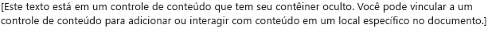
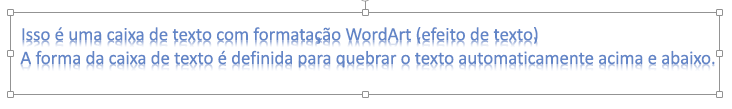
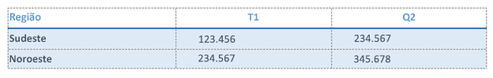
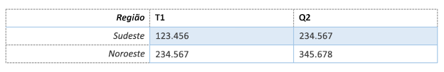
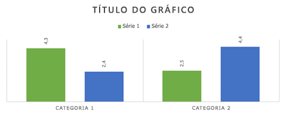
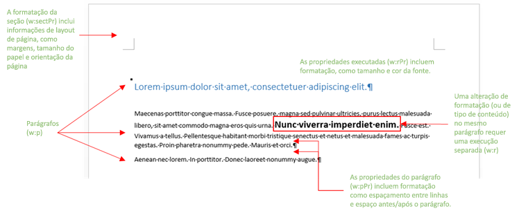
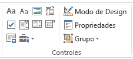

# <a name="create-better-add-ins-for-word-with-office-open-xml"></a>Criar suplementos melhores para o Word com o Office Open XML

**Fornecido por:** Stephanie Krieger, Microsoft Corporation | Juan Balmori Labra, Microsoft Corporation

Se você está criando suplementos do Office para serem executados no Word, talvez já saiba que a API JavaScript para Office (Office.js) oferece vários formatos para ler e gravar o conteúdo de documentos. Eles são chamados de tipos de coerção e incluem texto sem formatação, tabelas, HTML e Office Open XML.

Então, quais são suas opções quando você precisa adicionar conteúdo avançado a um documento, como imagens, tabelas formatadas, gráficos ou apenas texto formatado? Você pode usar HTML para inserir alguns tipos de conteúdo avançado, como imagens. Dependendo do cenário, pode haver desvantagens na coerção de HTML, como limitações nas opções de formatação e posicionamento disponíveis para o conteúdo. Como o Office Open XML é a linguagem na qual os documentos do Word (como .docx e .dotx) são gravados, você pode inserir praticamente qualquer tipo de conteúdo que um usuário pode adicionar a um documento do Word, com praticamente qualquer tipo de formatação que o usuário possa aplicar. Determinar a marcação do Office Open XML necessária para fazer isso é mais fácil do que você imagina.

> [!NOTE]
> O Office Open XML também é a linguagem por trás dos documentos do PowerPoint e do Excel (e, a partir do Office 2013, do Visio). No entanto, atualmente, você pode fazer a coerção de conteúdo como Office Open XML somente em Suplementos do Office criados para o Word. Para saber mais sobre o Office Open XML, incluindo a documentação de referência completa da linguagem, confira [Recursos adicionais](#see-also).

Para começar, veja alguns dos tipos de conteúdo que você pode inserir usando a coerção do Office Open XML. Baixe o exemplo de código [Word-Add-in-Load-and-write-Open-XML](https://github.com/OfficeDev/Word-Add-in-Load-and-write-Open-XML), que contém a marcação do Office Open XML e o código Office.js necessário para inserir qualquer um dos exemplos a seguir no Word.

> [!NOTE]
> Ao longo deste artigo, os termos **tipos de conteúdo** e **conteúdo avançado** referem-se aos tipos de conteúdo avançado que você pode inserir em um documento do Word.


*Figura 1. Texto com formatação direta*


Você pode usar a formatação direta para especificar a aparência exata que o texto terá, independentemente da formatação existente no documento do usuário.

*Figura 2. Texto formatado com um estilo*


Você pode usar um estilo para coordenar automaticamente a aparência do texto que insere com o documento do usuário.

*Figura 3. Uma imagem simples*


Você pode usar o mesmo método para inserir qualquer formato de imagem compatível com o Office.

*Figura 4. Uma imagem formatada usando efeitos e estilos de imagem*


A adição de efeitos e formatação de alta qualidade às imagens requer muito menos marcação do que você poderia esperar.

*Figura 5. Um controle de conteúdo*




Você pode usar controles de conteúdo com o suplemento para adicionar conteúdo em um local especificado (associado) em vez de na seleção.

*Figura 6. Uma caixa de texto com formatação do WordArt*




Os efeitos de texto estão disponíveis no Word para o texto dentro de uma caixa de texto (como mostrado aqui) ou para o corpo do texto normal.

*Figura 7. Uma forma*


Você pode inserir formas de desenho internas ou personalizadas, com ou sem texto e efeitos de formatação.

*Figura 8. Uma tabela com formatação direta*




Você pode incluir formatação de texto, bordas, sombreamento, dimensionamento de células ou qualquer formatação de tabela que seja necessária.

*Figura 9. Uma tabela formatada usando um estilo de tabela*




Você pode usar estilos de tabela internos ou personalizados com a mesma facilidade com que usa um estilo de parágrafo para o texto.

*Figura 10. Um diagrama do SmartArt*


O Microsoft Office oferece uma ampla variedade de layouts de diagrama do SmartArt (e você pode usar o Office Open XML para criar os seus próprios).

*Figura 11. Um gráfico*




Você pode inserir gráficos do Excel como gráficos dinâmicos em documentos do Word, o que também significa que você pode usá-los no seu suplemento do Word. Como você pode ver pelos exemplos anteriores, é possível usar a coerção do Office Open XML para inserir praticamente qualquer tipo de conteúdo que um usuário pode inserir em seu próprio documento. Há duas maneiras simples de obter a marcação do Office Open XML necessária. Adicionar conteúdo avançado a um documento do Word em branco e salvar o arquivo no formato de Documento XML do Word ou usar um suplemento de teste com o método [getSelectedDataAsync](/javascript/api/office/office.document#getselecteddataasync-coerciontype--options--callback-) para obter a marcação. As duas abordagens fornecem basicamente o mesmo resultado.


> [!NOTE]
> Um documento do Office Open XML é realmente um pacote compactado de arquivos que representa o conteúdo do documento. Salvar o arquivo no formato de Documento XML do Word lhe fornece todo o pacote do Office Open XML compactado em um arquivo XML, que também é o que você obtém ao usar **getSelectedDataAsync** para recuperar a marcação XML do Office Open XML.

Se você salvar o arquivo em um formato XML do Word, observe que há duas opções na lista Salvar como Tipo na caixa de diálogo Salvar como para arquivos no formato .xml. Certifique-se de escolher **Documento XML do Word** e não a opção do Word 2003. Baixe o código de exemplo nomeado [Word-Add-in-Get-Set-EditOpen-XML](https://github.com/OfficeDev/Word-Add-in-Get-Set-EditOpen-XML), que pode ser usado como uma ferramenta para recuperar e testar sua marcação. Então é só isso que preciso fazer? Bem, não exatamente. Sim, para muitos cenários, você poderia usar todo o resultado compactado do Office Open XML que obtém com um dos métodos anteriores, e ele funcionaria. A boa notícia é que você provavelmente não precisa da maioria dessa marcação. Se você é um dos muitos desenvolvedores de suplementos que estão vendo a marcação do Office Open XML pela primeira vez, tentar entender a grande quantidade de marcação obtida até para o conteúdo mais simples pode parecer assustador, mas não precisa ser assim. Neste tópico, usaremos alguns cenários comuns que obtivemos da comunidade de desenvolvedores de Suplementos do Office para mostrar técnicas que simplificam o Office Open XML para uso em suplementos. Exploraremos a marcação para alguns tipos de conteúdo mostrados anteriormente, além das informações necessárias para minimizar a carga do Office Open XML. Também examinaremos o código necessário para inserir conteúdo avançado em um documento na seleção ativa e a maneira de usar o Office Open XML com o objeto de associação para adicionar ou substituir conteúdo em locais específicos.

## <a name="exploring-the-office-open-xml-document-package"></a>Explorar o pacote de documento do Office Open XML


Ao usar [getSelectedDataAsync](/javascript/api/office/office.document#getselecteddataasync-coerciontype--options--callback-) para recuperar o Office Open XML para uma seleção de conteúdo (ou ao salvar o documento no formato de Documento XML do Word), o que você obtém não é apenas a marcação que descreve o conteúdo selecionado, é um documento inteiro com várias opções e configurações das quais você certamente não necessita. De fato, se você usar esse método com um documento que contenha um suplemento de painel de tarefas, a marcação obtida incluirá até mesmo o painel de tarefas.

Até mesmo um pacote de documento simples do Word inclui partes para propriedades de documentos, estilos, tema (configurações de formatação), configurações da Web, fontes e muito mais, além de partes para o conteúdo real.

Por exemplo, digamos que você queira inserir apenas um parágrafo de texto com formatação direta, conforme mostrado anteriormente na Figura 1. Ao usar o Office Open XML para o texto formatado com **getSelectedDataAsync**, você vê uma grande quantidade de marcação. A marcação inclui um elemento de pacote que representa um documento inteiro, que contém várias partes (comumente conhecidas como partes do documento ou, no Office Open XML, partes do pacote), como pode ver listado na Figura 13. Cada parte representa um arquivo separado dentro do pacote.


> [!TIP]
> Você pode editar a marcação do Office Open XML em um editor de texto como o Bloco de Notas. Se abri-lo no Visual Studio, pode usar **Editar > Avançado > Formatar Documento** (Ctrl+K, Ctrl+D) para formatar o pacote, facilitando a edição. Em seguida, você pode recolher ou expandir partes de um documento ou seções delas, conforme mostrado na Figura 12, para examinar e editar mais facilmente o conteúdo do pacote do Office Open XML. Cada parte do documento começa com uma marca **pkg:part**.


*Figura 12. Recolher e expandir partes do pacote para facilitar a edição no Visual Studio*


*Figura 13. As partes incluídas em um pacote de documento básico do Office Open XML do Word*


Com toda essa marcação, você poderá se surpreender ao descobrir que os únicos elementos realmente necessários para inserir o exemplo de texto formatado são pedaços da parte .rels e a parte document.xml.


> [!NOTE]
> As duas linhas de marcação acima da marca do pacote (as declarações de XML para a versão e a ID do programa do Office) são pressupostas quando você usa o tipo de coerção do Office Open XML, assim, não é preciso incluí-las. Mantenha-as se você quiser abrir a marcação editada como um documento do Word para testá-la.

Vários dos outros tipos de conteúdo mostrados no início deste tópico também exigem partes adicionais (além daquelas mostradas na Figura 13), e vamos abordá-los mais adiante neste tópico. Enquanto isso, como você verá a maioria das partes mostradas na Figura 13 na marcação de qualquer pacote de documento do Word, aqui está um resumo rápido do que cada uma das partes faz e quando você precisa delas:


- Dentro da marca de pacote, a primeira parte é o arquivo .rels, que define as relações entre as partes de nível superior do pacote (elas normalmente são as propriedades do documento, a miniatura, se houver, e o corpo do documento principal). Sempre é necessário algum conteúdo nessa parte na marcação, pois você precisa definir a relação entre a parte do documento principal (em que o conteúdo reside) e o pacote de documento.

- A parte document.xml.rels define as relações para as partes adicionais necessárias para a parte document.xml (corpo principal), se houver.


   > [!IMPORTANT]
   > Os arquivos .rels no pacote (como .rels de nível superior, document.xml.rels e outros que você pode ver para tipos específicos de conteúdo) são uma ferramenta extremamente importante que você pode usar como guia para ajudá-lo a editar rapidamente o pacote do Office Open XML. Para saber mais sobre como fazer isso, confira [Criar sua própria marcação: práticas recomendadas](#creating-your-own-markup-best-practices) mais adiante neste tópico.


- A parte document.xml é o conteúdo no corpo principal do documento. Você precisa de elementos dessa parte, claro, pois é onde o conteúdo aparece. Porém, você não precisa de tudo o que vê nessa parte. Examinaremos isso em mais detalhes posteriormente.

- Muitas partes são automaticamente ignoradas pelos métodos Set ao se inserir conteúdo em um documento usando a coerção do Office Open XML, assim, você pode removê-las. Isso inclui o arquivo theme1.xml (o tema de formatação do documento), as partes de propriedades do documento (núcleo, suplemento e miniatura) e arquivos de configurações (incluindo settings, webSettings e fontTable).

- No exemplo da Figura 1, a formatação de texto é aplicada diretamente (ou seja, cada configuração de fonte e de formatação de parágrafo é aplicada individualmente). Contudo, se você usar um estilo (por exemplo, se desejar que o texto assuma automaticamente a formatação do estilo Título 1 no documento de destino) como mostrado anteriormente na Figura 2, precisará da parte styles.xml, bem como de uma definição de relacionamento para ele. Para saber mais, confira a seção do tópico [Adicionar objetos que usam partes adicionais do Office Open XML](#adding-objects-that-use-additional-office-open-xml-parts).


## <a name="inserting-document-content-at-the-selection"></a>Inserir conteúdo de documento na seleção


Vamos examinar a marcação mínima do Office Open XML necessária para o exemplo de texto formatado mostrado na Figura 1 e o JavaScript necessário para inseri-la na seleção ativa no documento.


### <a name="simplified-office-open-xml-markup"></a>Marcação simplificada do Office Open XML

Editamos o exemplo do Office Open XML mostrado aqui, conforme descrito na seção anterior, para deixar apenas as partes do documento obrigatórias e somente os elementos necessários em cada uma dessas partes. Vamos examinar como editar a marcação você mesmo (e explicar um pouco mais as partes restantes aqui) na próxima seção do tópico.


```XML
<pkg:package xmlns:pkg="http://schemas.microsoft.com/office/2006/xmlPackage">
  <pkg:part pkg:name="/_rels/.rels" pkg:contentType="application/vnd.openxmlformats-package.relationships+xml" pkg:padding="512">
    <pkg:xmlData>
      <Relationships xmlns="http://schemas.openxmlformats.org/package/2006/relationships">
        <Relationship Id="rId1" Type="http://schemas.openxmlformats.org/officeDocument/2006/relationships/officeDocument" Target="word/document.xml"/>
      </Relationships>
    </pkg:xmlData>
  </pkg:part>
  <pkg:part pkg:name="/word/document.xml" pkg:contentType="application/vnd.openxmlformats-officedocument.wordprocessingml.document.main+xml">
    <pkg:xmlData>
      <w:document xmlns:w="http://schemas.openxmlformats.org/wordprocessingml/2006/main" >
        <w:body>
          <w:p>
            <w:pPr>
              <w:spacing w:before="360" w:after="0" w:line="480" w:lineRule="auto"/>
              <w:rPr>
                <w:color w:val="70AD47" w:themeColor="accent6"/>
                <w:sz w:val="28"/>
              </w:rPr>
            </w:pPr>
            <w:r>
              <w:rPr>
                <w:color w:val="70AD47" w:themeColor="accent6"/>
                <w:sz w:val="28"/>
              </w:rPr>
              <w:t>This text has formatting directly applied to achieve its font size, color, line spacing, and paragraph spacing.</w:t>
            </w:r>
          </w:p>
        </w:body>
      </w:document>
    </pkg:xmlData>
  </pkg:part>
</pkg:package>
```


> [!NOTE]
> Se você adicionar a marcação mostrada aqui a um arquivo XML com as marcas de declaração de XML para versão e mso-application na parte superior do arquivo (mostrado na Figura 13), você poderá abri-lo no Word como um documento do Word. Ou, sem essas marcas, ainda poderá abri-lo usando **Arquivo > Abrir** no Word. Você verá **Modo de Compatibilidade** na barra de título no Word, pois removeu as configurações que avisam ao Word que se trata de um documento. Como você está adicionando a marcação a um documento existente do Word, isso não afetará o conteúdo de forma alguma.


### <a name="javascript-for-using-setselecteddataasync"></a>JavaScript para usar setSelectedDataAsync


Após salvar o Office Open XML anterior como um arquivo XML que pode ser acessado por meio de sua solução, você poderá usar a função a seguir para definir o conteúdo de texto formatado no documento usando a coerção do Office Open XML. 

Nessa função, observe que, exceto pela última linha, tudo é usado para acessar a marcação salva para uso na chamada de método [setSelectedDataAsync](/javascript/api/office/office.document#setselecteddataasync-data--options--callback-) no fim da função. **setSelectedDataASync** requer apenas que você especifique o conteúdo a ser inserido e o tipo de coerção.


> [!NOTE]
> Substitua _yourXMLfilename_ pelo nome e pelo caminho do arquivo XML que você salvou na solução. Se não tiver certeza de onde incluir arquivos XML na solução ou como referenciá-los no código, confira o exemplo de código [Word-Add-in-Load-and-write-Open-XML](https://github.com/OfficeDev/Word-Add-in-Load-and-write-Open-XML) para obter exemplos disso e um exemplo operacional da marcação e do JavaScript mostrado aqui.


```js
function writeContent() {
    var myOOXMLRequest = new XMLHttpRequest();
    var myXML;
    myOOXMLRequest.open('GET', 'yourXMLfilename', false);
    myOOXMLRequest.send();
    if (myOOXMLRequest.status === 200) {
        myXML = myOOXMLRequest.responseText;
    }
    Office.context.document.setSelectedDataAsync(myXML, { coercionType: 'ooxml' });
}
```


## <a name="creating-your-own-markup-best-practices"></a>Criar sua própria marcação: práticas recomendadas


Vamos examinar mais detalhadamente a marcação que deve ser inserida no exemplo de texto formatado anterior.

Para o exemplo, comece simplesmente excluindo todas as partes de documento do pacote, exceto .rels e document.xml. Em seguida, editaremos essas duas partes necessárias para simplificar tudo ainda mais.


> [!IMPORTANT]
> Use as partes .rels como um mapa para avaliar rapidamente o que está incluído no pacote e determinar quais partes você pode excluir completamente (ou seja, as partes não relacionadas ou nem referenciadas pelo conteúdo). Lembre-se de que todas as partes do documento devem ter uma relação definida no pacote e as relações aparecem nos arquivos .rels. Assim, você deve ver todas elas listadas em .rels, em document.xml.rels ou em um arquivo .rels específico do conteúdo.

A marcação a seguir mostra a parte .rels necessária antes da edição. Como estamos excluindo o suplemento, partes de propriedade do documento principal e a parte de miniatura, também precisamos excluir essas relações de .rels. Observe que isso deixará somente a relação (com a ID de relação "rID1" no exemplo a seguir) para document.xml.


```XML
<pkg:part pkg:name="/_rels/.rels" pkg:contentType="application/vnd.openxmlformats-package.relationships+xml" pkg:padding="512">
  <pkg:xmlData>
    <Relationships xmlns="http://schemas.openxmlformats.org/package/2006/relationships">
      <Relationship Id="rId3" Type="http://schemas.openxmlformats.org/package/2006/relationships/metadata/core-properties" Target="docProps/core.xml"/>
      <Relationship Id="rId2" Type="http://schemas.openxmlformats.org/package/2006/relationships/metadata/thumbnail" Target="docProps/thumbnail.emf"/>
      <Relationship Id="rId1" Type="http://schemas.openxmlformats.org/officeDocument/2006/relationships/officeDocument" Target="word/document.xml"/>
      <Relationship Id="rId4" Type="http://schemas.openxmlformats.org/officeDocument/2006/relationships/extended-properties" Target="docProps/app.xml"/>
    </Relationships>
  </pkg:xmlData>
</pkg:part>
```


> [!IMPORTANT]
> Remova as relações (ou seja, a marca **Relationship**) de todas as partes que você remover completamente do pacote. Incluir uma parte sem uma relação correspondente ou excluir uma parte e deixar sua relação no pacote resultará em um erro.

A marcação a seguir mostra a parte document.xml, que inclui o conteúdo de texto formatado de exemplo antes da edição.

```XML
<pkg:part pkg:name="/word/document.xml" pkg:contentType="application/vnd.openxmlformats-officedocument.wordprocessingml.document.main+xml">
    <pkg:xmlData>
      <w:document mc:Ignorable="w14 w15 wp14" xmlns:wpc="http://schemas.microsoft.com/office/word/2010/wordprocessingCanvas" xmlns:mc="http://schemas.openxmlformats.org/markup-compatibility/2006" xmlns:o="urn:schemas-microsoft-com:office:office" xmlns:r="http://schemas.openxmlformats.org/officeDocument/2006/relationships" xmlns:m="http://schemas.openxmlformats.org/officeDocument/2006/math" xmlns:v="urn:schemas-microsoft-com:vml" xmlns:wp14="http://schemas.microsoft.com/office/word/2010/wordprocessingDrawing" xmlns:wp="http://schemas.openxmlformats.org/drawingml/2006/wordprocessingDrawing" xmlns:w10="urn:schemas-microsoft-com:office:word" xmlns:w="http://schemas.openxmlformats.org/wordprocessingml/2006/main" xmlns:w14="http://schemas.microsoft.com/office/word/2010/wordml" xmlns:w15="http://schemas.microsoft.com/office/word/2012/wordml" xmlns:wpg="http://schemas.microsoft.com/office/word/2010/wordprocessingGroup" xmlns:wpi="http://schemas.microsoft.com/office/word/2010/wordprocessingInk" xmlns:wne="http://schemas.microsoft.com/office/word/2006/wordml" xmlns:wps="http://schemas.microsoft.com/office/word/2010/wordprocessingShape">
        <w:body>
          <w:p>
            <w:pPr>
              <w:spacing w:before="360" w:after="0" w:line="480" w:lineRule="auto"/>
              <w:rPr>
                <w:color w:val="70AD47" w:themeColor="accent6"/>
                <w:sz w:val="28"/>
              </w:rPr>
            </w:pPr>
            <w:r>
              <w:rPr>
                <w:color w:val="70AD47" w:themeColor="accent6"/>
                <w:sz w:val="28"/>
              </w:rPr>
              <w:t>This text has formatting directly applied to achieve its font size, color, line spacing, and paragraph spacing.</w:t>
            </w:r>
            <w:bookmarkStart w:id="0" w:name="_GoBack"/>
            <w:bookmarkEnd w:id="0"/>
          </w:p>
          <w:p/>
          <w:sectPr>
            <w:pgSz w:w="12240" w:h="15840"/>
            <w:pgMar w:top="1440" w:right="1440" w:bottom="1440" w:left="1440" w:header="720" w:footer="720" w:gutter="0"/>
            <w:cols w:space="720"/>
          </w:sectPr>
        </w:body>
      </w:document>
    </pkg:xmlData>
</pkg:part>
```

Como document.xml é a parte do documento principal em que você coloca o conteúdo, vamos dar uma olhada rápida nessa parte. (A Figura 14, exibida após a lista, fornece uma referência visual para mostrar como parte do conteúdo principal e das marcas de formatação explicadas aqui se relacionam ao que você vê em um documento do Word.)


- A marca de abertura **w:document** inclui várias listagens de namespaces (**xmlns**). Muitos desses namespaces referem-se a tipos específicos de conteúdo, e você só precisa deles caso sejam relevantes para o conteúdo.

    O prefixo para as marcas em uma parte do documento remete aos namespaces. Neste exemplo, o único prefixo usado nas marcas em todo o document.xml é **w:**, portanto o único namespace que precisamos deixar na marca de abertura **w:document** é **xmlns:w**.


> [!TIP]
> Se você estiver editando a marcação no Visual Studio, após excluir namespaces em qualquer parte, examine todas as marcas dessa parte. Se tiver removido um namespace necessário para a marcação, você verá um pequeno sublinhado ondulado vermelho no prefixo relevante das marcas afetadas. Se remover o namespace **xmlns:mc**, você também deverá remover o atributo **mc:Ignorable** que precede as listagens de namespace.


- Dentro da marca de abertura do corpo, você verá uma marca de parágrafo (**w:p**), que inclui o conteúdo para este exemplo.

- A marca **w:pPr** inclui propriedades para formatação de parágrafo aplicada diretamente, como um espaço antes ou depois do parágrafo, o alinhamento do parágrafo ou os recuos. (A formatação direta refere-se aos atributos que você aplica individualmente ao conteúdo, não como parte de um estilo.) Essa marca também inclui formatação de fonte direta que é aplicada a todo o parágrafo, em uma marca aninhada **w:rPr** (propriedades de execução), que contém a cor da fonte e o tamanho definido no exemplo.


   > [!NOTE]
   > Talvez você perceba que tamanhos de fonte e outras configurações de formatação na marcação do Word do Office Open XML parecem ter o dobro do tamanho real. Isso ocorre porque o espaçamento de parágrafo e linha, bem como algumas propriedades de formatação de seção mostradas na marcação anterior, são especificados em twips (um vigésimo de um ponto). Dependendo dos tipos de conteúdo com os quais trabalha no Office Open XML, você pode ver várias unidades de medida adicionais, incluindo Unidades Métricas em Inglês (914.400 EMUs para uma polegada), que são usadas para alguns valores de Arte do Office (drawingML) e 100.000 vezes o valor real, que é usado em drawingML e na marcação do PowerPoint. O PowerPoint também expressa alguns valores como 100 vezes o valor real, e o Excel comumente usa os valores reais.


- Em um parágrafo, qualquer conteúdo com propriedades semelhantes é incluído em uma execução (**w:r**), como é o caso do texto de exemplo. Sempre que há uma alteração no tipo de conteúdo ou formatação, uma nova execução é iniciada. (Ou seja, se apenas uma palavra no texto de exemplo estivesse em negrito, ela seria separada em sua própria execução.) Neste exemplo, o conteúdo inclui apenas o texto de uma execução.

    Como a formatação incluída neste exemplo é a formatação da fonte (ou seja, a formatação que pode ser aplicada a apenas um caractere), ela também aparece nas propriedades para a execução individual.

- Observe também as marcas para o indicador oculto "_GoBack" (**w:bookmarkStart** e **w:bookmarkEnd**), que aparecem nos documentos do Word por padrão. Você sempre pode excluir as marcas de início e de término do indicador GoBack da marcação.

- A última parte do corpo do documento é a marca **w:sectPr**, ou propriedades de seção. Essa marca inclui configurações como margens e orientação da página. O conteúdo que você inserir usando **setSelectedDataAsync** adotará as propriedades da seção ativa no documento de destino por padrão. Portanto, a menos que o conteúdo inclua uma quebra de seção (nesse caso, haverá mais de uma marca **w:sectPr**), você pode excluir essa marca.


*Figura 14. Como marcas comuns em document.xml estão relacionadas ao conteúdo e ao layout de um documento do Word*



> [!TIP]
> Na marcação que você criar, talvez haja outro atributo em várias marcas que inclui os caracteres **w:rsid**, que você não vê nos exemplos usados neste tópico. Esses são identificadores de revisão. Eles são usados no Word para o recurso Combinar Documentos e estão ativados por padrão. Você nunca precisará deles na marcação que está inserindo com o suplemento, e desativá-los torna a marcação bem mais limpa. Você pode facilmente remover marcas RSID existentes ou desabilitar o recurso (conforme descrito no procedimento a seguir) para que eles não sejam adicionados à marcação para o novo conteúdo.

Lembre-se de que se você usar os recursos de coautoria no Word (como a capacidade de editar simultaneamente documentos com outras pessoas), você deve ativar o recurso novamente quando tiver terminado de gerar a marcação para seu suplemento.

Para desativar atributos RSID no Word para documentos que você criar no futuro, faça o seguinte: 

1. No Word, escolha a guia **Arquivo** e escolha **Opções**.
2. Na caixa de diálogo Opções do Word, escolha **Central de Confiabilidade** e escolha **Configurações da Central de Confiabilidade**.
3. Na caixa de diálogo Central de Confiabilidade, escolha **Opções de privacidade** e desative a configuração **Armazenar número aleatório para melhorar a precisão da combinação**.

Para remover marcas RSID de um documento existente, tente o seguinte atalho com o documento aberto no Office Open XML:


1. Com o ponto de inserção no corpo do documento principal, pressione **Ctrl+Home** para ir para a parte superior do documento.
2. No teclado, pressione **Barra de espaços**, **Delete**, **Barra de espaços**. Em seguida, salve o documento.

Após remover a maior parte da marcação do pacote, resta a marcação mínima que precisa ser inserida para o exemplo, conforme mostrado na seção anterior.


## <a name="using-the-same-office-open-xml-structure-for-different-content-types"></a>Usar a mesma estrutura do Office Open XML para diferentes tipos de conteúdo


Vários tipos de conteúdo avançado exigem somente os componentes .rels e document.xml mostrados no exemplo anterior, incluindo controles de conteúdo, formas de desenho e caixas de texto do Office e tabelas (a menos que um estilo seja aplicado à tabela). De fato, você pode reutilizar as mesmas partes de pacote editadas e trocar apenas o conteúdo de **body** em document.xml para a marcação do conteúdo.

Para verificar a marcação do Office Open XML para os exemplos de cada um dos tipos de conteúdo mostrados anteriormente nas Figuras 5 a 8, explore o exemplo de código [Word-Add-in-Load-and-write-Open-XML](https://github.com/OfficeDev/Word-Add-in-Load-and-write-Open-XML) referenciado na seção Visão geral.

Antes de continuarmos, vamos dar uma olhada nas diferenças relevantes para alguns desses tipos de conteúdo e como trocar as partes de que você necessita.


### <a name="understanding-drawingml-markup-office-graphics-in-word-what-are-fallbacks"></a>Compreender a marcação de drawingML (elementos gráficos do Office) no Word: O que são fallbacks?

Se a marcação da forma ou da caixa de texto parece muito mais complexa do que o esperado, há um motivo para isso. Com o lançamento do Office 2007, houve a introdução dos Formatos do Office Open XML e de um novo mecanismo de elementos gráficos do Office que o PowerPoint e o Excel adotaram plenamente. Na versão 2007, o Word só incorporou parte desse mecanismo de elementos gráficos, adotando o mecanismo de elementos gráficos atualizado do Excel, elementos gráficos SmartArt e ferramentas de imagem avançadas. Para formas e caixas de texto, o Word 2007 continua a usar objetos de desenho herdados (VML). Na versão 2010, o Word lançou etapas adicionais com o mecanismo de elementos gráficos para incorporar formas e ferramentas de desenho atualizadas.

Portanto, para dar suporte a formas e caixas de texto em documentos do Word no Formato do Office Open XML quando abertos no Word 2007, as formas (incluindo caixas de texto) exigem marcação VML de fallback.

Normalmente, como você pode ver nos exemplos de forma e caixa de texto incluídos no exemplo de código [Word-Add-in-Load-and-write-Open-XML](https://github.com/OfficeDev/Word-Add-in-Load-and-write-Open-XML), a marcação da reparação pode ser removida. O Word adiciona automaticamente a marcação de reparação ausente às formas quando um documento é salvo. No entanto, se você prefere manter a marcação de reparação para garantir o suporte a todos os cenários de usuário, não há problema em mantê-la.

Se houver objetos de desenho agrupados incluídos no conteúdo, você verá marcação adicional (e aparentemente repetitiva), mas isso deve ser mantido. Partes da marcação para formas de desenho são duplicadas quando o objeto é incluído em um grupo.


> [!IMPORTANT]
> Ao trabalhar com caixas de texto e formas de desenho, verifique os namespaces cuidadosamente antes de removê-los de document.xml. (Ou então, se você estiver reutilizando marcação de outro tipo de objeto, adicione novamente quaisquer namespaces necessários que tenham sido removidos anteriormente de document.xml.) Uma parte substancial dos namespaces incluídos por padrão em document.xml está presente devido a requisitos de objeto de desenho.


#### <a name="about-graphic-positioning"></a>Sobre o posicionamento de gráficos

Nos exemplos de código [Word-Add-in-Load-and-write-Open-XML](https://github.com/OfficeDev/Word-Add-in-Load-and-write-Open-XML) e [Word-Add-in-Get-Set-EditOpen-XML](https://github.com/OfficeDev/Word-Add-in-Get-Set-EditOpen-XML), a caixa de texto e a forma são configuradas usando diferentes tipos de configurações de posicionamento e disposição de texto. (Lembre-se também de que os exemplos de imagem nesses exemplos de código são configurados usando formatação embutida com texto, que posiciona um objeto gráfico na linha de base do texto.)

A forma nesses exemplos de código é posicionada em relação às margens direita e inferior da página. O posicionamento relativo permite fazer a coordenação mais facilmente com a configuração de documento desconhecida do usuário, pois ela se ajustará às margens do usuário e haverá menos risco de causar uma aparência estranha devido às configurações de tamanho do papel, orientação ou margem. Para manter as configurações de posicionamento relativas ao inserir um objeto gráfico, você deve manter a marca de parágrafo (w:p) em que o posicionamento (conhecido no Word como uma âncora) é armazenado. Se inserir o conteúdo em uma marca de parágrafo existente em vez de incluir a sua próprio, você poderá manter a mesma aparência inicial, mas muitos tipos de referências relativas que habilitam o posicionamento a se ajustar automaticamente ao layout do usuário poderão ser perdidos.


### <a name="working-with-content-controls"></a>Trabalho com controles de conteúdo

Os controles de conteúdo são um recurso importante no Word que pode aprimorar consideravelmente a capacidade do suplemento para o Word de várias maneiras, incluindo permitindo-lhe inserir o conteúdo em locais designados no documento, em vez de apenas na seleção.

No Word, localize os controles de conteúdo na guia Desenvolvedor da faixa de opções, conforme mostrado aqui na Figura 15.


*Figura 15. O grupo Controles na guia Desenvolvedor no Word*



Os tipos de controles de conteúdo no Word incluem RTF, texto sem formatação, imagem, galeria de blocos de construção, caixa de seleção, lista suspensa, caixa de combinação, seletor de data e seção de repetição.


- Use o comando **Propriedades**, mostrado na Figura 15, para editar o título do controle e para definir preferências, como ocultar o contêiner de controle.

- Habilite **Modo de Design** para editar o conteúdo de espaço reservado no controle.

Se o suplemento funciona com um modelo do Word, você pode incluir controles no modelo para aprimorar o comportamento do conteúdo. Você também pode usar uma associação de dados XML em um documento do Word para associar controles de conteúdo a dados, como propriedades de documento, para preencher facilmente formulários ou realizar tarefas semelhantes. (Localize os controles que já estão associados a propriedades internas do documento no Word na guia **Inserir** em **Partes Rápidas**.)

Ao usar controles de conteúdo com o suplemento, você também pode expandir muito as opções para o que o suplemento pode fazer usando um tipo diferente de associação. Você pode associar a um controle de conteúdo de dentro do suplemento e, depois, escrever conteúdo para a associação em vez de para a seleção ativa.


> [!NOTE]
> Não confunda a associação de dados XML no Word com a capacidade de associar a um controle por meio do suplemento. Esses são recursos completamente separados. No entanto, você pode incluir controles de conteúdo nomeados no conteúdo que inserir por meio do suplemento usando a coerção de OOXML e usar código no suplemento para associar a esses controles.

Além disso, lembre-se de que associação de dados XML e o Office.js podem interagir com partes XML personalizadas no aplicativo. Portanto, é possível integrar essas poderosas ferramentas. Para saber mais sobre como trabalhar com partes XML personalizadas na API JavaScript para Office, confira a seção [Recursos adicionais](#see-also) deste tópico.

O trabalho com associações no suplemento do Word é abordado na próxima seção do tópico. Primeiro, vamos conferir um exemplo do Office Open XML necessário para inserir um controle de conteúdo RTF que você pode associar usando o suplemento.


> [!IMPORTANT]
> Controles RTF são o único tipo de controle de conteúdo que você pode usar para associar a um controle de conteúdo de dentro do suplemento.


```XML
<pkg:package xmlns:pkg="http://schemas.microsoft.com/office/2006/xmlPackage">
  <pkg:part pkg:name="/_rels/.rels" pkg:contentType="application/vnd.openxmlformats-package.relationships+xml" pkg:padding="512">
    <pkg:xmlData>
      <Relationships xmlns="http://schemas.openxmlformats.org/package/2006/relationships">
        <Relationship Id="rId1" Type="http://schemas.openxmlformats.org/officeDocument/2006/relationships/officeDocument" Target="word/document.xml"/>
      </Relationships>
    </pkg:xmlData>
  </pkg:part>
  <pkg:part pkg:name="/word/document.xml" pkg:contentType="application/vnd.openxmlformats-officedocument.wordprocessingml.document.main+xml">
    <pkg:xmlData>
      <w:document xmlns:w="http://schemas.openxmlformats.org/wordprocessingml/2006/main" xmlns:w15="http://schemas.microsoft.com/office/word/2012/wordml" >
        <w:body>
          <w:p/>
          <w:sdt>
              <w:sdtPr>
                <w:alias w:val="MyContentControlTitle"/>
                <w:id w:val="1382295294"/>
                <w15:appearance w15:val="hidden"/>
                <w:showingPlcHdr/>
              </w:sdtPr>
              <w:sdtContent>
                <w:p>
                  <w:r>
                  <w:t>[This text is inside a content control that has its container hidden. You can bind to a content control to add or interact with content at a specified location in the document.]</w:t>
                </w:r>
                </w:p>
              </w:sdtContent>
            </w:sdt>
          </w:body>
      </w:document>
    </pkg:xmlData>
  </pkg:part>
 </pkg:package>
```

Como já mencionado, os controles de conteúdo, como texto formatado, não exigem partes de documento adicionais. Portanto, somente editadas versões das partes .rels e document.xml são incluídas aqui.

A marca **w:sdt** que você vê no corpo de document.xml representa o controle de conteúdo. Se gerar a marcação do Office Open XML para um controle de conteúdo, você verá que vários atributos foram removidos do exemplo, incluindo a marca e as propriedades de parte de documento. Somente elementos essenciais (e alguns de práticas recomendadas) foram mantidos, incluindo o seguinte:


- O **alias** é a propriedade de título da caixa de diálogo Propriedades de Controle de Conteúdo no Word. Essa é uma propriedade necessária (representando o nome do item) se você planeja associar ao controle de dentro do suplemento.

- A **id** exclusiva é uma propriedade necessária. Se você associar ao controle de dentro do suplemento, a ID será a propriedade que a vinculação usa no documento para identificar o controle de conteúdo nomeado aplicável.

- O atributo **aparência** é usado para ocultar o contêiner de controle, para gerar uma aparência mais limpa. Esse é um novo recurso no Word 2013, como você pode ver pelo uso do namespace w15. Como essa propriedade é usada, o namespace w15 é mantida no início da parte document.xml.

- O atributo **showingPlcHdr** é uma configuração opcional que define o conteúdo padrão que você inclui no controle (texto, neste exemplo) como conteúdo de espaço reservado. Portanto, se o usuário clica ou toca na área de controle, todo o conteúdo é selecionado, em vez de se comportar como conteúdo editável no qual o usuário pode fazer alterações.

- Embora a marca de parágrafo vazia (**w:p /**) que precede a marca **sdt** não seja necessária para adicionar um controle de conteúdo (e adicionará espaço vertical acima do controle no documento do Word), ela garante que o controle seja colocado em seu próprio parágrafo. Isso pode ser importante, dependendo do tipo e da formatação do conteúdo será adicionado ao controle.

- Se você pretende associar ao controle, o conteúdo padrão para o controle (o que está dentro da marca **sdtContent**) deve incluir pelo menos um parágrafo completo (como neste exemplo), para que a associação aceite o conteúdo avançado com vários parágrafos.


> [!NOTE]
> O atributo de parte de documento que foi removido desta marca de exemplo **w:sdt** pode aparecer em um controle de conteúdo para fazer referência a uma parte separada no pacote em que as informações de conteúdo de espaço reservado podem ser armazenadas (partes localizados em um diretório de glossário no pacote do Office Open XML). Embora parte de documento seja o termo usado para partes XML (ou seja, arquivos) dentro de um pacote do Office Open XML, o termo partes de documento, conforme usado na propriedade sdt, refere-se ao mesmo termo no Word que é usado para descrever alguns tipos de conteúdo, incluindo blocos de construção e partes rápidas de propriedade de documento (por exemplo, controles associados a dados XML internos). Se houver partes em um diretório de glossário no pacote do Office Open XML, talvez você precise mantê-las se o conteúdo que estiver inserindo incluir esses recursos. Para um controle de conteúdo típico que você pretende usar para associar do suplemento, elas não são necessárias. Lembre-se apenas de que, se você excluir as partes de glossário do pacote, também deverá remover o atributo de parte de documento da marca w:sdt.

A próxima seção abordará como criar e usar associações no suplemento do Word.


## <a name="inserting-content-at-a-designated-location"></a>Inserir conteúdo em um local designado


Já vimos como inserir o conteúdo na seleção ativa em um documento do Word. Se associar a um controle de conteúdo nomeado no documento, você poderá inserir qualquer um dos mesmos tipos de conteúdo no controle. 

Então, quando convém usar essa abordagem?


- Quando você precisa adicionar ou substituir conteúdo em locais específicos em um modelo, como para preencher partes do documento de um banco de dados

- Quando você quer a opção de substituir o conteúdo que está inserindo na seleção ativa, como para fornecer opções de elemento de design ao usuário

- Quando você quer que o usuário adicione dados no documento que você possa acessar para uso com o suplemento, como para preencher campos no painel de tarefas com base em informações que o usuário adiciona ao documento

Baixe o código de exemplo [Word-Add-in-JavaScript-AddPopulateBindings](https://github.com/OfficeDev/Word-Add-in-JavaScript-AddPopulateBindings), que fornece um exemplo de como inserir e associar a um controle de conteúdo e como preencher a associação.


### <a name="add-and-bind-to-a-named-content-control"></a>Adicionar e associar a um controle de conteúdo nomeado


Ao examinar o JavaScript a seguir, considere estes requisitos:


- Conforme mencionado anteriormente, você deve usar um controle de conteúdo avançado para associar ao controle do suplemento do Word.

- O controle de conteúdo deve ter um nome (esse é o campo **Título** na caixa de diálogo Propriedades de Controle de Conteúdo, que corresponde à marca **alias** na marcação do Office Open XML). Isso é como o código identifica onde colocar a associação.

- Você pode ter vários controles nomeados e associá-los conforme necessário. Use um nome de controle de conteúdo, uma ID de controle de conteúdo e uma ID de associação exclusivos.


```js
function addAndBindControl() {
    Office.context.document.bindings.addFromNamedItemAsync("MyContentControlTitle", "text", { id: 'myBinding' }, function (result) {
        if (result.status == "failed") {
            if (result.error.message == "The named item does not exist.")
                var myOOXMLRequest = new XMLHttpRequest();
                var myXML;
                myOOXMLRequest.open('GET', '../../Snippets_BindAndPopulate/ContentControl.xml', false);
                myOOXMLRequest.send();
                if (myOOXMLRequest.status === 200) {
                    myXML = myOOXMLRequest.responseText;
                }
                Office.context.document.setSelectedDataAsync(myXML, { coercionType: 'ooxml' }, function (result) {
                    Office.context.document.bindings.addFromNamedItemAsync("MyContentControlTitle", "text", { id: 'myBinding' });
                });
        }
    });
}
```

O código mostrado aqui realiza as seguintes etapas:


- Tenta associar ao controle de conteúdo nomeado, usando [addFromNamedItemAsync](/javascript/api/office/office.bindings#addfromnameditemasync-itemname--bindingtype--options--callback-).

  Execute esta etapa primeiro se houver uma possibilidade para seu suplemento em que o controle nomeado pode já existir no documento quando o código for executado. Por exemplo, faça isto se o suplemento foi inserido em e salvo com um modelo projetado para funcionar com o suplemento, em que o controle foi colocado anteriormente. Você também precisa fazer isto caso necessite associar a um controle que foi colocado anteriormente pelo suplemento.

- O retorno de chamada na primeira chamada ao método **addFromNamedItemAsync** verifica o status do resultado para ver se a associação falhou porque o item nomeado não existe no documento (ou seja, o controle de conteúdo chamado MyContentControlTitle neste exemplo). Nesse caso, o código adiciona o controle no ponto de seleção ativo (usando **setSelectedDataAsync**) e associa a ele.


> [!NOTE]
> Como mencionado anteriormente e mostrado no código anterior, o nome do controle de conteúdo é usado para determinar onde criar a associação. No entanto, na marcação do Office Open XML, o código adiciona a associação ao documento usando o nome e o atributo de ID do controle de conteúdo.

Após a execução de código, se examinar a marcação do documento no qual o suplemento criou associações, você verá duas partes para cada associação. Na marcação do controle de conteúdo em que uma associação foi adicionada (em document.xml), você verá o atributo **w15:webExtensionLinked/**.

Na parte do documento chamada webExtensions1.xml, você verá uma lista das associações que criou. Cada uma delas é identificada usando a ID de associação e o atributo de ID do controle aplicável, como o item a seguir, em que o atributo **appref** é a ID de controle de conteúdo: ** **we:binding id="myBinding" type="text" appref="1382295294"/**.


> [!IMPORTANT]
> Você deve adicionar a associação no momento em que pretende agir sobre ela. Não inclua a marcação da associação no Office Open XML para inserir o controle de conteúdo, pois o processo de inserção dessa marcação removerá a associação.


### <a name="populate-a-binding"></a>Preencher uma associação


O código para gravar conteúdo para uma associação é semelhante ao usado para gravar conteúdo para uma seleção.


```js
function populateBinding(filename) {
  var myOOXMLRequest = new XMLHttpRequest();
  var myXML;
  myOOXMLRequest.open('GET', filename, false);
  myOOXMLRequest.send();
  if (myOOXMLRequest.status === 200) {
      myXML = myOOXMLRequest.responseText;
  }
  Office.select("bindings#myBinding").setDataAsync(myXML, { coercionType: 'ooxml' });
}
```

Assim como ocorre com **setSelectedDataAsync**, você especifica o conteúdo a ser inserido e o tipo de coerção. O único requisito adicional para gravar em uma associação é identificá-la por ID. Observe como a ID de associação usada neste código (bindings#myBinding) corresponde à ID de associação estabelecida (myBinding) quando a associação foi criada na função anterior.


> [!NOTE]
> O código anterior é tudo de que você precisará se estiver preenchendo ou substituindo inicialmente o conteúdo em uma associação. Quando você insere um novo item de conteúdo em um local associado, o conteúdo existente na associação é substituído automaticamente. Confira um exemplo disso no exemplo de código referenciado anteriormente, [Word-Add-in-JavaScript-AddPopulateBindings](https://github.com/OfficeDev/Word-Add-in-JavaScript-AddPopulateBindings), que fornece dois exemplos de conteúdo separados que você pode intercambiar para preencher a mesma associação.


## <a name="adding-objects-that-use-additional-office-open-xml-parts"></a>Adicione objetos que usam partes adicionais do Office Open XML


Muitos tipos de conteúdo exigem partes adicionais do documento no pacote do Office Open XML, o que significa que fazem referência a informações em outra parte ou o próprio conteúdo é armazenado em uma ou mais partes adicionais e referenciado em document.xml.

Por exemplo, considere a seguinte situação:


- O conteúdo que usa estilos para formatação (como o texto com estilo mostrado anteriormente na Figura 2 ou a tabela com estilo mostrada na Figura 9) requer a parte styles.xml.

- Imagens (como as mostradas na Figuras 3 e 4) incluem os dados de imagem binários em uma e, às vezes, em duas partes adicionais.

- Diagramas SmartArt (como o que é mostrado na Figura 10) exigem várias partes adicionais para descrever o layout e o conteúdo.

- Gráficos (como o que é mostrado na Figura 11) exigem várias partes adicionais, incluindo sua própria parte de relação (.rels).

Você pode ver exemplos editados da marcação para todos esses tipos de conteúdo no exemplo de código referenciado anteriormente, [Word-Add-in-Load-and-write-Open-XML](https://github.com/OfficeDev/Word-Add-in-Load-and-write-Open-XML). Você pode inserir todos esses tipos de conteúdo usando o mesmo código JavaScript mostrado anteriormente (e fornecido nos exemplos de código referenciados) para inserir o conteúdo na seleção ativa e gravar conteúdo em um local específico usando associações.

Antes que você explore os exemplos, vamos conferir algumas dicas para trabalhar com cada um desses tipos de conteúdo.


> [!IMPORTANT]
> Lembre-se: se mantiver partes adicionais referenciadas em document.xml, você precisará manter document.xml.rels e as definições de relação das partes aplicáveis que está mantendo, como styles.xml ou um arquivo de imagem.


### <a name="working-with-styles"></a>Como trabalhar com estilos

A mesma abordagem para edição de marcação que vimos no exemplo anterior com texto formatado diretamente é aplicada ao se usar estilos de parágrafo ou estilos de tabela para formatar o conteúdo. No entanto, a marcação para trabalhar com estilos de parágrafo é consideravelmente mais simples. Portanto, esse é o exemplo descrito aqui.


#### <a name="editing-the-markup-for-content-using-paragraph-styles"></a>Editar a marcação de conteúdo usando estilos de parágrafo

A marcação a seguir representa o conteúdo do corpo para o exemplo de texto com estilo mostrado na Figura 2.


```XML
<w:body>
  <w:p>
    <w:pPr>
      <w:pStyle w:val="Heading1"/>
    </w:pPr>
    <w:r>
      <w:t>This text is formatted using the Heading 1 paragraph style.</w:t>
    </w:r>
  </w:p>
</w:body>
```


> [!NOTE]
> Como você pode ver, a marcação de texto formatado em document.xml é consideravelmente mais simples quando você usa um estilo, pois o estilo contém toda a formatação de parágrafo e fonte que, caso contrário, você precisa referenciar individualmente. No entanto, conforme explicado anteriormente, talvez você queira usar estilos ou formatação direta para fins diferentes: usar formatação direta para especificar a aparência do texto independentemente da formatação no documento do usuário; usar um estilo de parágrafo (particularmente um nome de estilo de parágrafo interno, como Título 1, mostrado aqui) para que a formatação do texto seja automaticamente coordenada com o documento do usuário.

O uso de um estilo é um bom exemplo da importância de ler e entender a marcação para o conteúdo que você está inserindo, pois não é explícito que outra parte do documento é referenciada aqui. Se você incluir a definição de estilo na marcação e não incluir a parte styles.xml, as informações de estilo em document.xml serão ignoradas independentemente de esse estilo estar ou não em uso no documento do usuário.

No entanto, se analisar a parte styles.xml, verá que apenas uma pequena parte dessa longa marcação é necessária ao editar a marcação para uso no suplemento:


- A parte styles.xml inclui vários namespaces por padrão. Se você estiver mantendo apenas as informações de estilo necessárias para o conteúdo, na maioria dos casos, só precisará manter o namespace **xmlns:w**.

- O conteúdo da marca **w:docDefaults** que fica no início da parte styles será ignorado quando a marcação for inserida por meio do suplemento e pode ser removido.

- A maior marcação em uma parte styles.xml é para a marca **w:latentStyles** que aparece depois de docDefaults, que fornece informações (como atributos de aparência para o painel Estilos e a galeria de Estilos) para todos os estilos disponíveis. Essas informações também serão ignoradas ao se inserir conteúdo por meio do suplemento e, assim, podem ser removidas.

- Após as informações de estilos latentes, você vê uma definição de cada estilo em uso no documento a partir do qual a marcação foi gerada. Isso inclui alguns estilos padrão que estão em uso quando você cria um novo documento e podem não ser relevantes ao conteúdo. Você pode excluir as definições de estilos que não são usadas pelo conteúdo.


   > [!NOTE]
   > Cada estilo de título interno tem um estilo Char associado que é uma versão de estilo de caractere do mesmo formato do título. A menos que tenha aplicado o estilo de título como um estilo de caractere, você pode removê-lo. Se o estilo for usado como um estilo de caractere, ele aparecerá em document.xml em uma marca de propriedades de execução (**w:rPr**) em vez de uma marca de propriedades de parágrafo (**w:pPr**). Isso só deverá ocorrer se você tiver aplicado o estilo apenas a parte de um parágrafo, mas poderá ocorrer inadvertidamente se o estilo tiver sido aplicado de forma incorreta.


- Se estiver usando um estilo interno para o conteúdo, você não precisará incluir uma definição completa. Você só deve incluir o nome do estilo, a ID do estilo e pelo menos um atributo de formatação para que o Office Open XML com coerção aplique o estilo ao conteúdo durante a inserção.

    No entanto, a prática recomendada é incluir uma definição de estilo completa (mesmo que seja o padrão para os estilos internos). Se um estilo já estiver sendo usado no documento de destino, seu conteúdo adotará a definição do residente para o estilo, independentemente de você incluir no styles.xml. Se o estilo ainda não estiver sendo usado no documento de destino, seu conteúdo usará a definição de estilo que você forneceu na marcação.

Portanto, por exemplo, o único conteúdo que é preciso manter da parte styles.xml para o texto de exemplo mostrado na Figura 2, que é formatado com o estilo Título 1, é indicado a seguir.


> [!NOTE]
> Uma definição completa do Word para o estilo Título 1 foi mantida neste exemplo.


```XML
<pkg:part pkg:name="/word/styles.xml" pkg:contentType="application/vnd.openxmlformats-officedocument.wordprocessingml.styles+xml">
  <pkg:xmlData>
    <w:styles xmlns:w="http://schemas.openxmlformats.org/wordprocessingml/2006/main" >
      <w:style w:type="paragraph" w:styleId="Heading1">
        <w:name w:val="heading 1"/>
        <w:basedOn w:val="Normal"/>
        <w:next w:val="Normal"/>
        <w:link w:val="Heading1Char"/>
        <w:uiPriority w:val="9"/>
        <w:qFormat/>
        <w:pPr>
          <w:keepNext/>
          <w:keepLines/>
          <w:spacing w:before="240" w:after="0" w:line="259" w:lineRule="auto"/>
          <w:outlineLvl w:val="0"/>
        </w:pPr>
        <w:rPr>
          <w:rFonts w:asciiTheme="majorHAnsi" w:eastAsiaTheme="majorEastAsia" w:hAnsiTheme="majorHAnsi" w:cstheme="majorBidi"/>
          <w:color w:val="2E74B5" w:themeColor="accent1" w:themeShade="BF"/>
          <w:sz w:val="32"/>
          <w:szCs w:val="32"/>
        </w:rPr>
      </w:style>
    </w:styles>
  </pkg:xmlData>
</pkg:part>
```


#### <a name="editing-the-markup-for-content-using-table-styles"></a>Como editar a marcação de conteúdo usando estilos de tabela


Quando o conteúdo usa um estilo de tabela, você precisa da mesma parte relativa de styles.xml conforme descrito para trabalhar com estilos de parágrafo. Ou seja, você só precisa manter as informações do estilo que está usando no conteúdo e deve incluir o nome, a ID e pelo menos um atributo de formatação, mas é melhor incluir uma definição de estilo completa para lidar com todos os cenários de usuário possíveis.

No entanto, ao conferir a marcação da tabela em document.xml e da definição de estilo de tabela em styles.xml, você vê muito mais marcação do que ao trabalhar com estilos de parágrafo.


- Em document.xml, a formatação é aplicada por célula, mesmo que esteja incluída em um estilo. O uso de um estilo de tabela não reduz o volume de marcação. A vantagem de usar estilos de tabela para o conteúdo é facilitar a atualização e coordenar facilmente a aparência de várias tabelas.

- Em styles.xml, você verá uma grande quantidade de marcação para um único estilo de tabela, pois estilos de tabela incluem vários tipos de atributos de formatação possíveis para cada uma das várias áreas da tabela, como a tabela inteira, linhas de título, linhas e colunas em faixas pares e ímpares (separadamente), a primeira coluna etc.


### <a name="working-with-images"></a>Trabalhar com imagens


A marcação de uma imagem inclui uma referência a pelo menos uma parte que inclua os dados binários para descrever a imagem. Para uma imagem complexa, isso pode consistir em centenas de páginas de marcação, e você não pode editá-la. Como nunca precisa alterar a(s) parte(s) binária(s), você poderá simplesmente recolhê-la(s) se estiver usando um editor estruturado como o Visual Studio, para que ainda possa examinar e editar facilmente o restante do pacote.

Se examinar a marcação de exemplo da imagem simples mostrada anteriormente na Figura 3, disponível no exemplo de código mencionado anteriormente, [Word-Add-in-Load-and-write-Open-XML](https://github.com/OfficeDev/Word-Add-in-Load-and-write-Open-XML), você verá que a marcação da imagem em document.xml inclui informações de tamanho e posição, bem como uma referência de relação para a parte que contém os dados de imagem binários. Essa referência é incluída na marca **a:blip**, da seguinte maneira:


```XML
<a:blip r:embed="rId4" cstate="print">
```

Lembre-se de que, como uma referência de relação é usada explicitamente (**r:embed="rID4"**) e essa parte relacionada é necessária para processar a imagem, se você não incluir os dados binários no pacote do Office Open XML, receberá um erro. Isso é diferente do styles.xml, explicado anteriormente, que não gerará um erro se for omitido, pois a relação não é referenciada explicitamente e a relação é para uma parte que fornece atributos ao conteúdo (formatação), em vez de fazer parte do próprio conteúdo.


> [!NOTE]
> Ao examinar a marcação, observe os namespaces adicionais usados na marca a:blip. Você verá em document.xml que o namespace **xlmns:a** (o namespace drawingML principal) é colocado dinamicamente no início do uso de referências de drawingML, em vez de no início da parte document.xml. No entanto, o namespace de relações (r) deve ser mantido onde aparece no início de document.xml. Verifique se a marcação de imagem tem requisitos de namespace adicionais. Lembre-se de que você não precisa memorizar quais tipos de conteúdo exigem quais namespaces. Você pode distingui-los facilmente examinando os prefixos das marcas em todo o document.xml.


### <a name="understanding-additional-image-parts-and-formatting"></a>Noções básicas sobre partes de imagem e formatação adicionais


Quando você usa alguns efeitos de formatação do Office na imagem, como para a imagem mostrada na Figura 4, que usa configurações ajustadas de brilho e contraste (além de estilo de imagem), pode ser necessária uma segunda parte de dados binários de uma cópia de formato HD dos dados da imagem. Esse formato HD adicional é necessário para a formatação que é considerada um efeito de camadas, e a referência a ele aparece em document.xml, de forma semelhante ao seguinte:


```XML
<a14:imgLayer r:embed="rId5">
```

Veja a marcação necessária para a imagem formatada mostrada na Figura 4 (que usa efeitos das camadas, entre outras) no exemplo de código [Word-Add-in-Load-and-write-Open-XML](https://github.com/OfficeDev/Word-Add-in-Load-and-write-Open-XML).


### <a name="working-with-smartart-diagrams"></a>Trabalhar com diagramas SmartArt


Um diagrama SmartArt tem quatro partes associadas, mas apenas duas são sempre necessárias. Você pode examinar um exemplo de marcação SmartArt no exemplo de código [Word-Add-in-Load-and-write-Open-XML](https://github.com/OfficeDev/Word-Add-in-Load-and-write-Open-XML). Primeiro, confira uma breve descrição de cada uma das partes e por que elas são necessárias ou não:


> [!NOTE]
> Se o conteúdo incluir mais de um diagrama, eles serão numerados consecutivamente, substituindo o 1 nos nomes de arquivo listados aqui.


- layout1.xml: essa parte é necessária. Ela inclui a definição de marcação para a funcionalidade e aparência de layout.

- data1.xml: essa parte é necessária. Ela inclui os dados em uso na instância do diagrama.

- drawing1.xml: essa parte nem sempre é necessária, mas, se você aplicar formatação personalizada a elementos na instância de um diagrama, como formatar diretamente formas individuais, talvez seja necessário mantê-la.

- colors1.xml: essa parte não é necessária. Ela inclui informações de estilo de cor, mas as cores do diagrama serão coordenadas por padrão com as cores do tema de formatação ativo no documento de destino, com base no estilo de cor SmartArt que você aplicar da guia de design Ferramentas SmartArt no Word antes de salvar a marcação do Office Open XML.

- quickStyles1.xml: essa parte não é necessária. De forma semelhante à parte de cores, você pode removê-la, pois o diagrama adotará a definição do estilo SmartArt aplicado que está disponível no documento de destino (ou seja, ele será coordenado automaticamente com o tema de formatação no documento de destino).


> [!TIP]
> O arquivo SmartArt layout1.xml é um bom exemplo de locais em que talvez você consiga cortar ainda mais a marcação, mas talvez não valha a pena o tempo extra para fazer isso (porque é removida uma pequena quantidade de marcação em relação ao pacote inteiro). Se quiser remover todas as linhas de marcação que puder, você poderá excluir a marca **dgm:sampData** e seu conteúdo. Esses dados de exemplo definem como a visualização de miniatura do diagrama será exibida nas galerias de estilos SmartArt. No entanto, se forem omitidos, dados de exemplo padrão serão usados.

Lembre-se de que a marcação de um diagrama SmartArt em document.xml contém referências de ID de relação para partes de layout, dados, cores e estilos rápidos. Você pode excluir as referências em document.xml das partes de cores e estilos ao excluir essas partes e suas definições de relação (e certamente é uma prática recomendada fazer isso, pois você está excluindo essas relações), mas não receberá um erro se as mantiver, pois não são necessárias para que o diagrama seja inserido em um documento. Localize essas referências em document.xml na marca **dgm:relIds**. Independentemente de você executar esta etapa ou não, mantenha as referências de ID de relação para as partes de dados e layout necessárias.


### <a name="working-with-charts"></a>Trabalhar com gráficos


De forma semelhante aos diagramas SmartArt, os gráficos contêm várias partes adicionais. No entanto, a configuração para os gráficos é um pouco diferente do SmartArt, pois um gráfico tem seu próprio arquivo de relação. A seguir há uma descrição das partes de documento necessárias e removíveis para um gráfico:


> [!NOTE]
> Assim como ocorre com diagramas SmartArt, se o conteúdo incluir mais de um gráfico, eles serão numerados consecutivamente, substituindo o 1 nos nomes de arquivos listados aqui.


- Em document.xml.rels, você verá uma referência à parte necessária que contém os dados que descrevem o gráfico (chart1.xml).

- Você também verá um arquivo de relação separada para cada gráfico no pacote do Office Open XML, como chart1.xml.rels.

    Há três arquivos referenciados em chart1.xml.rels, mas apenas um é obrigatório. Eles são os dados binários da pasta de trabalho do Excel (obrigatório) e as cores e partes do estilo (colors1.xml e styles1.xml), que você pode remover.

Os gráficos que você pode criar e editar de forma nativa no Word são gráficos do Excel, e seus dados são mantidos em uma planilha do Excel que é inserida como dados binários no pacote do Office Open XML. Assim como as partes de dados binários para imagens, esses dados binários do Excel são necessários, mas não há nada para editar nessa parte. Portanto, você pode simplesmente recolher a parte no editor para evitar ter que rolar manualmente por ela para examinar o restante do pacote do Office Open XML.

No entanto, de forma semelhante ao SmartArt, você pode excluir as partes de cores e estilos. Se você tiver usado os estilos de gráfico e de cor disponíveis para formatar o gráfico, o gráfico adotará a formatação aplicável automaticamente quando for inserido no documento de destino.

Confira a marcação editada do gráfico de exemplo mostrado na Figura 11 no exemplo de código [Word-Add-in-Load-and-write-Open-XML](https://github.com/OfficeDev/Word-Add-in-Load-and-write-Open-XML).


## <a name="editing-the-office-open-xml-for-use-in-your-task-pane-add-in"></a>Edição do Office Open XML para uso no suplemento de painel de tarefas


Você já viu como identificar e editar o conteúdo na marcação. Se a tarefa ainda parecer difícil quando você examinar o enorme pacote do Office Open XML gerado para o documento, veja a seguir um resumo rápido das etapas recomendadas para ajudá-lo a editar o pacote rapidamente:


> [!NOTE]
> Lembre-se de que você pode usar todas as partes .rels no pacote como um mapa para verificar rapidamente se há partes do documento que pode remover.


1. Abra o arquivo XML compactado no Visual Studio e pressione Ctrl+K, Ctrl+D para formatar o arquivo. Em seguida, use os botões de recolher/expandir à esquerda para recolher as partes que você sabe que precisa remover. Também convém recolher partes longas de que você precisa, mas que sabe que não precisará editar (como os dados binários em base64 para um arquivo de imagem), tornando a verificação visual da marcação mais rápida e fácil.

2. Há várias partes do pacote de documento que você quase sempre pode remover ao preparar a marcação do Office Open XML para uso no suplemento. Convém começar removendo-as (bem como suas definições de relação associadas), o que reduzirá bastante o pacote de imediato. Elas incluem theme1, fontTable, settings, webSettings, thumbnail, os arquivos de propriedades principal e do suplemento e quaisquer partes de `taskpane` ou de `webExtension`.

3. Remova as partes que não estão relacionadas ao conteúdo, como notas de rodapé, cabeçalhos ou rodapés dos quais não precisa. Novamente, lembre-se de também excluir suas relações associadas.

4. Examine a parte document.xml.rels para ver se arquivos referenciados nessa parte são necessários para o conteúdo, como um arquivo de imagem, a parte styles ou partes de diagramas SmartArt. Exclua as relações das partes que o conteúdo não requer e confirme se também excluiu a parte associada. Se o conteúdo não exigir nenhuma das partes de documento referenciadas em document.xml.rels, você poderá excluir esse arquivo também.

5. Se o conteúdo tiver uma parte .rels adicional (como chart#.xml.rels), examine-o para ver se há outras partes referenciadas que você pode remover (como estilos rápidos para gráficos) e exclua a relação desse arquivo e a parte associada.

6. Edite document.xml para remover namespaces não referenciados na parte, propriedades da seção se o conteúdo não incluir uma quebra de seção e qualquer marcação que não esteja relacionada ao conteúdo que você deseja inserir. Se você está inserindo formas ou caixas de texto, também convém remover a marcação de fallback ampla.

7. Edite quaisquer peças necessárias adicionais em que você sabe que pode remover marcação substancial sem afetar o conteúdo, como a parte styles.

Após executar as sete etapas anteriores, você provavelmente terá removido cerca de 90% a 100% da marcação que pode remover, dependendo do conteúdo. Na maioria dos casos, provavelmente esse é o máximo que você deseja cortar.

Independentemente de você parar por aqui ou optar por se aprofundar ainda mais no conteúdo para localizar todas as linhas de marcação que pode recortar, lembre-se de que pode usar o exemplo de código referenciado anteriormente, [Word-Add-in-Get-Set-EditOpen-XML](https://github.com/OfficeDev/Word-Add-in-Get-Set-EditOpen-XML), como um bloco de rascunho para testar com rapidez e facilidade a marcação editada.

> [!TIP]
> Se você atualizar um trecho do Office Open XML em uma solução existente durante o desenvolvimento, limpe arquivos temporários de Internet antes de executar a solução novamente para atualizar o Office Open XML usado pelo código. A marcação incluída na solução em arquivos XML é armazenada em cache no computador. Claro, você pode limpar os arquivos temporários de Internet do navegador Web padrão. Para acessar as opções da Internet e excluir essas configurações de dentro do Visual Studio 2019, no menu **Depurar**, escolha **Opções**. Em seguida, em **Ambiente**, escolha **Navegador da Web** e **Opções do Internet Explorer**.

## <a name="creating-an-add-in-for-both-template-and-stand-alone-use"></a>Criação de um suplemento para o modelo e para uso autônomo

Neste tópico, você viu vários exemplos do que pode fazer com o Office Open XML em suplementos. Vimos uma ampla variedade de exemplos de tipo de conteúdo avançado que você pode inserir em documentos usando o tipo de coerção do Office Open XML, juntamente com os métodos de JavaScript para inserir o conteúdo na seleção ou em um local específico (associado).

Portanto, o que mais você precisa saber se estiver criando o suplemento para uso autônomo (ou seja, inserido da Loja ou em um local de servidor proprietário) e para uso em um modelo pré-criado projetado para funcionar com o suplemento? A resposta pode ser que você já sabe tudo o que precisa saber.

A marcação de determinado tipo de conteúdo e os métodos para inseri-la são os mesmos, quer o suplemento seja projetado como autônomo, quer seja para uso com um modelo. Se você estiver usando modelos projetados para funcionar com o suplemento, verifique se o JavaScript inclui retornos de chamada que levam em conta cenários em que o conteúdo referenciado pode já existir no documento (conforme demonstrado no exemplo de associação mostrado na seção [Adicionar uma associação a um controle de conteúdo nomeado](#add-and-bind-to-a-named-content-control)).

Ao usar modelos com o aplicativo, se o suplemento será residente no modelo no momento em que o usuário criou o documento ou se o suplemento inserirá um modelo, também convém incorporar outros elementos da API para ajudá-lo a criar uma experiência mais robusta e interativa. Por exemplo, convém incluir a identificação de dados em uma parte customXML que você pode usar para determinar o tipo de modelo para oferecer opções específicas de modelo para o usuário. Para saber mais sobre como trabalhar com XML personalizado em suplementos, confira os recursos adicionais a seguir.


## <a name="see-also"></a>Confira também

- [API JavaScript para Office](/office/dev/add-ins/reference/javascript-api-for-office)
- [Padrão ECMA-376: Formatos do Office Open XML](https://www.ecma-international.org/publications/standards/Ecma-376.htm) (acesse a referência de linguagem completa e a documentação relacionada do Open XML aqui)
- [Como explorar a API JavaScript para Office: associação de dados e partes XML personalizadas](https://msdn.microsoft.com/magazine/dn166930.aspx)
