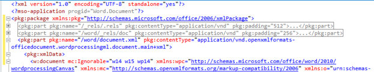

# <a name="create-better-add-ins-for-word-with-office-open-xml"></a><span data-ttu-id="24284-102">Criar suplementos melhores para o Word com o Office Open XML</span><span class="sxs-lookup"><span data-stu-id="24284-102">Create better add-ins for Word with Office Open XML</span></span>

<span data-ttu-id="24284-103">**Fornecido por:** Stephanie Krieger, Microsoft Corporation | Juan Balmori Labra, Microsoft Corporation</span><span class="sxs-lookup"><span data-stu-id="24284-103">**Provided by:** Stephanie Krieger, Microsoft Corporation | Juan Balmori Labra, Microsoft Corporation</span></span>

<span data-ttu-id="24284-p101">Se voc? est? criando suplementos do Office para serem executados no Word, talvez j? saiba que a API JavaScript para Office (Office.js) oferece v?rios formatos para ler e gravar o conte?do de documentos. Eles s?o chamados de tipos de coer??o e incluem texto sem formata??o, tabelas, HTML e Office Open XML.</span><span class="sxs-lookup"><span data-stu-id="24284-p101">If you're building Office Add-ins to run in Word, you might already know that the JavaScript API for Office (Office.js) offers several formats for reading and writing document content. These are called coercion types, and they include plain text, tables, HTML, and Office Open XML.</span></span>

<span data-ttu-id="24284-p102">Ent?o, quais s?o suas op??es quando voc? precisa adicionar conte?do avan?ado a um documento, como imagens, tabelas formatadas, gr?ficos ou apenas texto formatado? Voc? pode usar HTML para inserir alguns tipos de conte?do avan?ado, como imagens. Dependendo do cen?rio, pode haver desvantagens na coer??o de HTML, como limita??es nas op??es de formata??o e posicionamento dispon?veis para o conte?do. Como o Office Open XML ? a linguagem na qual os documentos do Word (como .docx e .dotx) s?o gravados, voc? pode inserir praticamente qualquer tipo de conte?do que um usu?rio pode adicionar a um documento do Word, com praticamente qualquer tipo de formata??o que o usu?rio possa aplicar. Determinar a marca??o do Office Open XML necess?ria para fazer isso ? mais f?cil do que voc? imagina.</span><span class="sxs-lookup"><span data-stu-id="24284-p102">So what are your options when you need to add rich content to a document, such as images, formatted tables, charts, or even just formatted text? You can use HTML for inserting some types of rich content, such as pictures. Depending on your scenario, there can be drawbacks to HTML coercion, such as limitations in the formatting and positioning options available to your content. Because Office Open XML is the language in which Word documents (such as .docx and .dotx) are written, you can insert virtually any type of content that a user can add to a Word document, with virtually any type of formatting the user can apply. Determining the Office Open XML markup you need to get it done is easier than you might think.</span></span>

> [!NOTE]
> <span data-ttu-id="24284-p103">O Office Open XML tamb?m ? a linguagem por tr?s dos documentos do PowerPoint e do Excel (e, a partir do Office 2013, do Visio). No entanto, atualmente, voc? pode fazer a coer??o de conte?do como Office Open XML somente em Suplementos do Office criados para o Word. Para saber mais sobre o Office Open XML, incluindo a documenta??o de refer?ncia completa da linguagem, confira [Recursos adicionais](#see-also).</span><span class="sxs-lookup"><span data-stu-id="24284-p103">Office Open XML is also the language behind PowerPoint and Excel (and, as of Office 2013, Visio) documents. However, currently, you can coerce content as Office Open XML only in Office Add-ins created for Word. For more information about Office Open XML, including the complete language reference documentation, see [Additional resources](#see-also).</span></span>

<span data-ttu-id="24284-p104">Para come?ar, veja alguns dos tipos de conte?do que voc? pode inserir usando a coer??o do Office Open XML. Baixe o exemplo de c?digo [Word-Add-in-Load-and-write-Open-XML](https://github.com/OfficeDev/Word-Add-in-Load-and-write-Open-XML), que cont?m a marca??o do Office Open XML e o c?digo Office.js necess?rio para inserir qualquer um dos exemplos a seguir no Word.</span><span class="sxs-lookup"><span data-stu-id="24284-p104">To begin, take a look at some of the content types you can insert using Office Open XML coercion. Download the code sample [Word-Add-in-Load-and-write-Open-XML](https://github.com/OfficeDev/Word-Add-in-Load-and-write-Open-XML), which contains the Office Open XML markup and Office.js code required for inserting any of the following examples into Word.</span></span>

> [!NOTE]
> <span data-ttu-id="24284-116">Ao longo deste artigo, os termos **tipos de conte?do** e **conte?do avan?ado** referem-se aos tipos de conte?do avan?ado que voc? pode inserir em um documento do Word.</span><span class="sxs-lookup"><span data-stu-id="24284-116">Throughout this article, the terms  **content types** and **rich content** refer to the types of rich content you can insert into a Word document.</span></span>


<span data-ttu-id="24284-117">*Figura 1. Texto com formata??o direta*</span><span class="sxs-lookup"><span data-stu-id="24284-117">*Figure 1. Text with direct formatting*</span></span>


<span data-ttu-id="24284-119">Voc? pode usar a formata??o direta para especificar a apar?ncia exata que o texto ter?, independentemente da formata??o existente no documento do usu?rio.</span><span class="sxs-lookup"><span data-stu-id="24284-119">You can use direct formatting to specify exactly what the text will look like regardless of existing formatting in the user's document.</span></span>

<span data-ttu-id="24284-120">*Figura 2. Texto formatado com um estilo*</span><span class="sxs-lookup"><span data-stu-id="24284-120">*Figure 2. Text formatted using a style*</span></span>


<span data-ttu-id="24284-122">Voc? pode usar um estilo para coordenar automaticamente a apar?ncia do texto que insere com o documento do usu?rio.</span><span class="sxs-lookup"><span data-stu-id="24284-122">You can use a style to automatically coordinate the look of text you insert with the user's document.</span></span>

<span data-ttu-id="24284-123">*Figura 3. Uma imagem simples*</span><span class="sxs-lookup"><span data-stu-id="24284-123">*Figure 3. A simple image*</span></span>


<span data-ttu-id="24284-125">Voc? pode usar o mesmo m?todo para inserir qualquer formato de imagem compat?vel com o Office.</span><span class="sxs-lookup"><span data-stu-id="24284-125">You can use the same method for inserting any Office-supported image format.</span></span>

<span data-ttu-id="24284-126">*Figura 4. Uma imagem formatada usando efeitos e estilos de imagem*</span><span class="sxs-lookup"><span data-stu-id="24284-126">*Figure 4. An image formatted using picture styles and effects*</span></span>


<span data-ttu-id="24284-128">A adi??o de efeitos e formata??o de alta qualidade ?s imagens requer muito menos marca??o do que voc? poderia esperar.</span><span class="sxs-lookup"><span data-stu-id="24284-128">Adding high quality formatting and effects to your images requires much less markup than you might expect.</span></span>

<span data-ttu-id="24284-129">*Figura 5. Um controle de conte?do*</span><span class="sxs-lookup"><span data-stu-id="24284-129">*Figure 5. A content control*</span></span>


<span data-ttu-id="24284-131">Voc? pode usar controles de conte?do com o suplemento para adicionar conte?do em um local especificado (associado) em vez de na sele??o.</span><span class="sxs-lookup"><span data-stu-id="24284-131">You can use content controls with your add-in to add content at a specified (bound) location rather than at the selection.</span></span>

<span data-ttu-id="24284-132">*Figura 6. Uma caixa de texto com formata??o do WordArt*</span><span class="sxs-lookup"><span data-stu-id="24284-132">*Figure 6. A text box with WordArt formatting*</span></span>


<span data-ttu-id="24284-134">Os efeitos de texto est?o dispon?veis no Word para o texto dentro de uma caixa de texto (como mostrado aqui) ou para o corpo do texto normal.</span><span class="sxs-lookup"><span data-stu-id="24284-134">Text effects are available in Word for text inside a text box (as shown here) or for regular body text.</span></span>

<span data-ttu-id="24284-135">*Figura 7. Uma forma*</span><span class="sxs-lookup"><span data-stu-id="24284-135">*Figure 7. A shape*</span></span>


<span data-ttu-id="24284-137">Voc? pode inserir formas de desenho internas ou personalizadas, com ou sem texto e efeitos de formata??o.</span><span class="sxs-lookup"><span data-stu-id="24284-137">You can insert built-in or custom drawing shapes, with or without text and formatting effects.</span></span>

<span data-ttu-id="24284-138">*Figura 8. Uma tabela com formata??o direta*</span><span class="sxs-lookup"><span data-stu-id="24284-138">*Figure 8. A table with direct formatting*</span></span>


<span data-ttu-id="24284-140">Voc? pode incluir formata??o de texto, bordas, sombreamento, dimensionamento de c?lulas ou qualquer formata??o de tabela que seja necess?ria.</span><span class="sxs-lookup"><span data-stu-id="24284-140">You can include text formatting, borders, shading, cell sizing, or any table formatting you need.</span></span>

<span data-ttu-id="24284-141">*Figura 9. Uma tabela formatada usando um estilo de tabela*</span><span class="sxs-lookup"><span data-stu-id="24284-141">*Figure 9. A table formatted using a table style*</span></span>


<span data-ttu-id="24284-143">Voc? pode usar estilos de tabela internos ou personalizados com a mesma facilidade com que usa um estilo de par?grafo para o texto.</span><span class="sxs-lookup"><span data-stu-id="24284-143">You can use built-in or custom table styles just as easily as using a paragraph style for text.</span></span>

<span data-ttu-id="24284-144">*Figura 10. Um diagrama do SmartArt*</span><span class="sxs-lookup"><span data-stu-id="24284-144">*Figure 10. A SmartArt diagram*</span></span>


<span data-ttu-id="24284-146">O Office 2013 oferece uma ampla variedade de layouts de diagrama do SmartArt (e voc? pode usar o Office Open XML para criar os seus pr?prios).</span><span class="sxs-lookup"><span data-stu-id="24284-146">Office 2013 offers a wide array of SmartArt diagram layouts (and you can use Office Open XML to create your own).</span></span>

<span data-ttu-id="24284-147">*Figura 11. Um gr?fico*</span><span class="sxs-lookup"><span data-stu-id="24284-147">*Figure 11. A chart*</span></span>


<span data-ttu-id="24284-p105">Voc? pode inserir gr?ficos do Excel como gr?ficos din?micos em documentos do Word, o que tamb?m significa que voc? pode us?-los no seu suplemento do Word. Como voc? pode ver pelos exemplos anteriores, ? poss?vel usar a coer??o do Office Open XML para inserir praticamente qualquer tipo de conte?do que um usu?rio pode inserir em seu pr?prio documento. H? duas maneiras simples de obter a marca??o do Office Open XML necess?ria. Adicionar conte?do avan?ado a um documento do Word 2013 em branco e salvar o arquivo no formato de Documento XML do Word ou usar um suplemento de teste com o m?todo [getSelectedDataAsync](https://dev.office.com/reference/add-ins/shared/document.setselecteddataasync) para obter a marca??o. As duas abordagens fornecem basicamente o mesmo resultado.</span><span class="sxs-lookup"><span data-stu-id="24284-p105">You can insert Excel charts as live charts in Word documents, which also means you can use them in your add-in for Word. As you can see by the preceding examples, you can use Office Open XML coercion to insert essentially any type of content that a user can insert into their own document. There are two simple ways to get theOffice Open XML markup you need. Either add your rich content to an otherwise blank Word 2013 document and then save the file in Word XML Document format or use a test add-in with the [getSelectedDataAsync](https://dev.office.com/reference/add-ins/shared/document.setselecteddataasync) method to grab the markup. Both approaches provide essentially the same result.</span></span>

    
> [!NOTE]
> <span data-ttu-id="24284-p106">Um documento do Office Open XML ? realmente um pacote compactado de arquivos que representa o conte?do do documento. Salvar o arquivo no formato de Documento XML do Word lhe fornece todo o pacote do Office Open XML compactado em um arquivo XML, que tamb?m ? o que voc? obt?m ao usar **getSelectedDataAsync** para recuperar a marca??o XML do Office Open XML.</span><span class="sxs-lookup"><span data-stu-id="24284-p106">An Office Open XML document is actually a compressed package of files that represent the document contents. Saving the file in the Word XML Document format gives you the entireOffice Open XML package flattened into one XML file, which is also what you get when using  **getSelectedDataAsync** to retrieve the Office Open XML markup.</span></span>

<span data-ttu-id="24284-p107">Se voc? salvar o arquivo em um formato XML do Word, observe que h? duas op??es na lista Salvar como Tipo na caixa de di?logo Salvar como para arquivos no formato .xml. Certifique-se de escolher **Documento XML do Word** e n?o a op??o do Word 2003. Baixe o c?digo de exemplo nomeado [Word-Add-in-Get-Set-EditOpen-XML](https://github.com/OfficeDev/Word-Add-in-Get-Set-EditOpen-XML), que pode ser usado como uma ferramenta para recuperar e testar sua marca??o. Ent?o ? s? isso que preciso fazer? Bem, n?o exatamente. Sim, para muitos cen?rios, voc? poderia usar todo o resultado compactado do Office Open XML que obt?m com um dos m?todos anteriores, e ele funcionaria. A boa not?cia ? que voc? provavelmente n?o precisa da maioria dessa marca??o. Se voc? ? um dos muitos desenvolvedores de suplementos que est?o vendo a marca??o do Office Open XML pela primeira vez, tentar entender a grande quantidade de marca??o obtida at? para o conte?do mais simples pode parecer assustador, mas n?o precisa ser assim. Neste t?pico, usaremos alguns cen?rios comuns que obtivemos da comunidade de desenvolvedores de Suplementos do Office para mostrar t?cnicas que simplificam o Office Open XML para uso em suplementos. Exploraremos a marca??o para alguns tipos de conte?do mostrados anteriormente, al?m das informa??es necess?rias para minimizar a carga do Office Open XML. Tamb?m examinaremos o c?digo necess?rio para inserir conte?do avan?ado em um documento na sele??o ativa e a maneira de usar o Office Open XML com o objeto de associa??o para adicionar ou substituir conte?do em locais espec?ficos.</span><span class="sxs-lookup"><span data-stu-id="24284-p107">If you save the file to an XML format from Word, note that there are two options under the Save as Type list in the Save As dialog box for .xml format files. Be sure to choose  **Word XML Document** and not the Word 2003 option. Download the code sample named [Word-Add-in-Get-Set-EditOpen-XML](https://github.com/OfficeDev/Word-Add-in-Get-Set-EditOpen-XML), which you can use as a tool to retrieve and test your markup. So is that all there is to it? Well, not quite. Yes, for many scenarios, you could use the full, flattened Office Open XML result you see with either of the preceding methods and it would work. The good news is that you probably don't need most of that markup. If you're one of the many add-in developers seeing Office Open XML markup for the first time, trying to make sense of the massive amount of markup you get for the simplest piece of content might seem overwhelming, but it doesn't have to be. In this topic, we'll use some common scenarios we've been hearing from the Office Add-ins developer community to show you techniques for simplifying Office Open XML for use in your add-in. We'll explore the markup for some types of content shown earlier along with the information you need for minimizing the Office Open XML payload. We'll also look at the code you need for inserting rich content into a document at the active selection and how to use Office Open XML with the bindings object to add or replace content at specified locations.</span></span>

## <a name="exploring-the-office-open-xml-document-package"></a><span data-ttu-id="24284-167">Explorar o pacote de documento do Office Open XML</span><span class="sxs-lookup"><span data-stu-id="24284-167">Exploring the Office Open XML document package</span></span>


<span data-ttu-id="24284-p108">Ao usar [getSelectedDataAsync](https://dev.office.com/reference/add-ins/shared/document.getselecteddataasync) para recuperar o Office Open XML para uma sele??o de conte?do (ou ao salvar o documento no formato de Documento XML do Word), o que voc? obt?m n?o ? apenas a marca??o que descreve o conte?do selecionado, ? um documento inteiro com v?rias op??es e configura??es das quais voc? certamente n?o necessita. De fato, se voc? usar esse m?todo com um documento que contenha um suplemento de painel de tarefas, a marca??o obtida incluir? at? mesmo o painel de tarefas.</span><span class="sxs-lookup"><span data-stu-id="24284-p108">When you use [getSelectedDataAsync](https://dev.office.com/reference/add-ins/shared/document.getselecteddataasync) to retrieve the Office Open XML for a selection of content (or when you save the document in Word XML Document format), what you're getting is not just the markup that describes your selected content; it's an entire document with many options and settings that you almost certainly don't need. In fact, if you use that method from a document that contains a task pane add-in, the markup you get even includes your task pane.</span></span>

<span data-ttu-id="24284-170">At? mesmo um pacote de documento simples do Word inclui partes para propriedades de documentos, estilos, tema (configura??es de formata??o), configura??es da Web, fontes e muito mais, al?m de partes para o conte?do real.</span><span class="sxs-lookup"><span data-stu-id="24284-170">Even a simple Word document package includes parts for document properties, styles, theme (formatting settings), web settings, fonts, and then some, in addition to parts for the actual content.</span></span>

<span data-ttu-id="24284-p109">Por exemplo, digamos que voc? queira inserir apenas um par?grafo de texto com formata??o direta, conforme mostrado anteriormente na Figura 1. Ao usar o Office Open XML para o texto formatado com **getSelectedDataAsync**, voc? v? uma grande quantidade de marca??o. A marca??o inclui um elemento de pacote que representa um documento inteiro, que cont?m v?rias partes (comumente conhecidas como partes do documento ou, no Office Open XML, partes do pacote), como pode ver listado na Figura 13. Cada parte representa um arquivo separado dentro do pacote.</span><span class="sxs-lookup"><span data-stu-id="24284-p109">For example, say that you want to insert just a paragraph of text with direct formatting, as shown earlier in Figure 1. When you grab the Office Open XML for the formatted text using  **getSelectedDataAsync**, you see a large amount of markup. That markup includes a package element that represents an entire document, which contains several parts (commonly referred to as document parts or, in the Office Open XML, as package parts), as you see listed in Figure 13. Each part represents a separate file within the package.</span></span>


> [!TIP]
> <span data-ttu-id="24284-p110">Voc? pode editar a marca??o do Office Open XML em um editor de texto como o Bloco de Notas. Se abri-lo no Visual Studio 2015, pode usar **Editar > Avan?ado > Formatar Documento** (Ctrl+K, Ctrl+D) para formatar o pacote, facilitando a edi??o. Em seguida, voc? pode recolher ou expandir partes de um documento ou se??es delas, conforme mostrado na Figura 12, para examinar e editar mais facilmente o conte?do do pacote do Office Open XML. Cada parte do documento come?a com uma marca **pkg:part**.</span><span class="sxs-lookup"><span data-stu-id="24284-p110">You can edit Office Open XML markup in a text editor like Notepad. If you open it in Visual Studio 2015, you can use  **Edit >Advanced > Format Document** (Ctrl+K, Ctrl+D) to format the package for easier editing. Then you can collapse or expand document parts or sections of them, as shown in Figure 12, to more easily review and edit the content of the Office Open XML package. Each document part begins with a **pkg:part** tag.</span></span>


<span data-ttu-id="24284-179">*Figura 12. Recolher e expandir partes do pacote para facilitar a edi??o no Visual Studio 2015*</span><span class="sxs-lookup"><span data-stu-id="24284-179">*Figure 12. Collapse and expand package parts for easier editing in Visual Studio 2015*</span></span>



<span data-ttu-id="24284-181">*Figura 13. As partes inclu?das em um pacote de documento b?sico do Office Open XML do Word*</span><span class="sxs-lookup"><span data-stu-id="24284-181">*Figure 13. The parts included in a basic Word Office Open XML document package*</span></span>


<span data-ttu-id="24284-183">Com toda essa marca??o, voc? poder? se surpreender ao descobrir que os ?nicos elementos realmente necess?rios para inserir o exemplo de texto formatado s?o peda?os da parte .rels e a parte document.xml.</span><span class="sxs-lookup"><span data-stu-id="24284-183">With all that markup, you might be surprised to discover that the only elements you actually need to insert the formatted text example are pieces of the .rels part and the document.xml part.</span></span>


    
> [!NOTE]
> <span data-ttu-id="24284-p111">As duas linhas de marca??o acima da marca do pacote (as declara??es de XML para a vers?o e a ID do programa do Office) s?o pressupostas quando voc? usa o tipo de coer??o do Office Open XML, assim, n?o ? preciso inclu?-las. Mantenha-as se voc? quiser abrir a marca??o editada como um documento do Word para test?-la.</span><span class="sxs-lookup"><span data-stu-id="24284-p111">The two lines of markup above the package tag (the XML declarations for version and Office program ID) are assumed when you use the Office Open XML coercion type, so you don't need to include them. Keep them if you want to open your edited markup as a Word document to test it.</span></span>

<span data-ttu-id="24284-p112">V?rios dos outros tipos de conte?do mostrados no in?cio deste t?pico tamb?m exigem partes adicionais (al?m daquelas mostradas na Figura 13), e vamos abord?-los mais adiante neste t?pico. Enquanto isso, como voc? ver? a maioria das partes mostradas na Figura 13 na marca??o de qualquer pacote de documento do Word, aqui est? um resumo r?pido do que cada uma das partes faz e quando voc? precisa delas:</span><span class="sxs-lookup"><span data-stu-id="24284-p112">Several of the other types of content shown at the start of this topic require additional parts as well (beyond those shown in Figure 13), and we'll address those later in this topic. Meanwhile, since you'll see most of the parts shown in Figure 13 in the markup for any Word document package, here's a quick summary of what each of these parts is for and when you need it:</span></span>


- <span data-ttu-id="24284-p113">Dentro da marca de pacote, a primeira parte ? o arquivo .rels, que define as rela??es entre as partes de n?vel superior do pacote (elas normalmente s?o as propriedades do documento, a miniatura, se houver, e o corpo do documento principal). Sempre ? necess?rio algum conte?do nessa parte na marca??o, pois voc? precisa definir a rela??o entre a parte do documento principal (em que o conte?do reside) e o pacote de documento.</span><span class="sxs-lookup"><span data-stu-id="24284-p113">Inside the package tag, the first part is the .rels file, which defines relationships between the top-level parts of the package (these are typically the document properties, thumbnail (if any), and main document body). Some of the content in this part is always required in your markup because you need to define the relationship of the main document part (where your content resides) to the document package.</span></span>
    
- <span data-ttu-id="24284-190">A parte document.xml.rels define as rela??es para as partes adicionais necess?rias para a parte document.xml (corpo principal), se houver.</span><span class="sxs-lookup"><span data-stu-id="24284-190">The document.xml.rels part defines relationships for additional parts required by the document.xml (main body) part, if any.</span></span> 
    

    
   > [!IMPORTANT]
   > <span data-ttu-id="24284-p114">Os arquivos .rels no pacote (como .rels de n?vel superior, document.xml.rels e outros que voc? pode ver para tipos espec?ficos de conte?do) s?o uma ferramenta extremamente importante que voc? pode usar como guia para ajud?-lo a editar rapidamente o pacote do Office Open XML. Para saber mais sobre como fazer isso, confira [Criar sua pr?pria marca??o: pr?ticas recomendadas](#creating-your-own-markup-best-practices) mais adiante neste t?pico.</span><span class="sxs-lookup"><span data-stu-id="24284-p114">The .rels files in your package (such as the top-level .rels, document.xml.rels, and others you may see for specific types of content) are an extremely important tool that you can use as a guide for helping you quickly edit down your Office Open XML package. To learn more about how to do this, see [Creating your own markup: best practices](#creating-your-own-markup-best-practices) later in this topic.</span></span>


- <span data-ttu-id="24284-p115">A parte document.xml ? o conte?do no corpo principal do documento. Voc? precisa de elementos dessa parte, claro, pois ? onde o conte?do aparece. Por?m, voc? n?o precisa de tudo o que v? nessa parte. Examinaremos isso em mais detalhes posteriormente.</span><span class="sxs-lookup"><span data-stu-id="24284-p115">The document.xml part is the content in the main body of the document. You need elements of this part, of course, since that's where your content appears. But, you don't need everything you see in this part. We'll look at that in more detail later.</span></span>
    
- <span data-ttu-id="24284-p116">Muitas partes s?o automaticamente ignoradas pelos m?todos Set ao se inserir conte?do em um documento usando a coer??o do Office Open XML, assim, voc? pode remov?-las. Isso inclui o arquivo theme1.xml (o tema de formata??o do documento), as partes de propriedades do documento (n?cleo, suplemento e miniatura) e arquivos de configura??es (incluindo settings, webSettings e fontTable).</span><span class="sxs-lookup"><span data-stu-id="24284-p116">Many parts are automatically ignored by the Set methods when inserting content into a document using Office Open XML coercion, so you might as well remove them. These include the theme1.xml file (the document's formatting theme), the document properties parts (core, add-in, and thumbnail), and setting files (including settings, webSettings, and fontTable).</span></span>
    
- <span data-ttu-id="24284-p117">No exemplo da Figura 1, a formata??o de texto ? aplicada diretamente (ou seja, cada configura??o de fonte e de formata??o de par?grafo ? aplicada individualmente). Contudo, se voc? usar um estilo (por exemplo, se desejar que o texto assuma automaticamente a formata??o do estilo T?tulo 1 no documento de destino) como mostrado anteriormente na Figura 2, precisar? da parte styles.xml, bem como de uma defini??o de relacionamento para ele. Para saber mais, confira a se??o do t?pico [Adicionar objetos que usam partes adicionais do Office Open XML](#adding-objects-that-use-additional-office-open-xml-parts).</span><span class="sxs-lookup"><span data-stu-id="24284-p117">In the Figure 1 example, text formatting is directly applied (that is, each font and paragraph formatting setting applied individually). But, if you use a style (such as if you want your text to automatically take on the formatting of the Heading 1 style in the destination document) as shown earlier in Figure 2, then you would need part of the styles.xml part as well as a relationship definition for it. For more information, see the topic section [Adding objects that use additional Office Open XML parts](#adding-objects-that-use-additional-office-open-xml-parts).</span></span>
    

## <a name="inserting-document-content-at-the-selection"></a><span data-ttu-id="24284-202">Inserir conte?do de documento na sele??o</span><span class="sxs-lookup"><span data-stu-id="24284-202">Inserting document content at the selection</span></span>


<span data-ttu-id="24284-203">Vamos examinar a marca??o m?nima do Office Open XML necess?ria para o exemplo de texto formatado mostrado na Figura 1 e o JavaScript necess?rio para inseri-la na sele??o ativa no documento.</span><span class="sxs-lookup"><span data-stu-id="24284-203">Let's take a look at the minimal Office Open XML markup required for the formatted text example shown in Figure 1 and the JavaScript required for inserting it at the active selection in the document.</span></span>


### <a name="simplified-office-open-xml-markup"></a><span data-ttu-id="24284-204">Marca??o simplificada do Office Open XML</span><span class="sxs-lookup"><span data-stu-id="24284-204">Simplified Office Open XML markup</span></span>

<span data-ttu-id="24284-p118">Editamos o exemplo do Office Open XML mostrado aqui, conforme descrito na se??o anterior, para deixar apenas as partes do documento obrigat?rias e somente os elementos necess?rios em cada uma dessas partes. Vamos examinar como editar a marca??o voc? mesmo (e explicar um pouco mais as partes restantes aqui) na pr?xima se??o do t?pico.</span><span class="sxs-lookup"><span data-stu-id="24284-p118">We've edited the Office Open XML example shown here, as described in the preceding section, to leave just required document parts and only required elements within each of those parts. We'll walk through how to edit the markup yourself (and explain a bit more about the pieces that remain here) in the next section of the topic.</span></span>


```XML
<pkg:package xmlns:pkg="http://schemas.microsoft.com/office/2006/xmlPackage">
  <pkg:part pkg:name="/_rels/.rels" pkg:contentType="application/vnd.openxmlformats-package.relationships+xml" pkg:padding="512">
    <pkg:xmlData>
      <Relationships xmlns="http://schemas.openxmlformats.org/package/2006/relationships">
        <Relationship Id="rId1" Type="http://schemas.openxmlformats.org/officeDocument/2006/relationships/officeDocument" Target="word/document.xml"/>
      </Relationships>
    </pkg:xmlData>
  </pkg:part>
  <pkg:part pkg:name="/word/document.xml" pkg:contentType="application/vnd.openxmlformats-officedocument.wordprocessingml.document.main+xml">
    <pkg:xmlData>
      <w:document xmlns:w="http://schemas.openxmlformats.org/wordprocessingml/2006/main" >
        <w:body>
          <w:p>
            <w:pPr>
              <w:spacing w:before="360" w:after="0" w:line="480" w:lineRule="auto"/>
              <w:rPr>
                <w:color w:val="70AD47" w:themeColor="accent6"/>
                <w:sz w:val="28"/>
              </w:rPr>
            </w:pPr>
            <w:r>
              <w:rPr>
                <w:color w:val="70AD47" w:themeColor="accent6"/>
                <w:sz w:val="28"/>
              </w:rPr>
              <w:t>This text has formatting directly applied to achieve its font size, color, line spacing, and paragraph spacing.</w:t>
            </w:r>
          </w:p>
        </w:body>
      </w:document>
    </pkg:xmlData>
  </pkg:part>
</pkg:package>
```


> [!NOTE]
> <span data-ttu-id="24284-p119">Se voc? adicionar a marca??o mostrada aqui a um arquivo XML com as marcas de declara??o de XML para vers?o e mso-application na parte superior do arquivo (mostrado na Figura 13), voc? poder? abri-lo no Word como um documento do Word. Ou, sem essas marcas, ainda poder? abri-lo usando **Arquivo > Abrir** no Word. Voc? ver? **Modo de Compatibilidade** na barra de t?tulo no Word 2013, pois removeu as configura??es que avisam ao Word que se trata de um documento da vers?o 2013. Como voc? est? adicionando a marca??o a um documento existente do Word 2013, isso n?o afetar? o conte?do de forma alguma.</span><span class="sxs-lookup"><span data-stu-id="24284-p119">If you add the markup shown here to an XML file along with the XML declaration tags for version and mso-application at the top of the file (shown in Figure 13), you can open it in Word as a Word document. Or, without those tags, you can still open it using  **File> Open** in Word. You'll see **Compatibility Mode** on the title bar in Word 2013, because you removed the settings that tell Word this is a 2013 document. Since you're adding this markup to an existing Word 2013 document, that won't affect your content at all.</span></span>


### <a name="javascript-for-using-setselecteddataasync"></a><span data-ttu-id="24284-211">JavaScript para usar setSelectedDataAsync</span><span class="sxs-lookup"><span data-stu-id="24284-211">JavaScript for using setSelectedDataAsync</span></span>


<span data-ttu-id="24284-212">Ap?s salvar o Office Open XML anterior como um arquivo XML que pode ser acessado por meio de sua solu??o, voc? poder? usar a fun??o a seguir para definir o conte?do de texto formatado no documento usando a coer??o do Office Open XML.</span><span class="sxs-lookup"><span data-stu-id="24284-212">Once you save the preceding Office Open XML as an XML file that's accessible from your solution, you can use the following function to set the formatted text content in the document using Office Open XML coercion.</span></span> 

<span data-ttu-id="24284-p120">Nessa fun??o, observe que, exceto pela ?ltima linha, tudo ? usado para acessar a marca??o salva para uso na chamada de m?todo [setSelectedDataAsync](https://dev.office.com/reference/add-ins/shared/document.setselecteddataasync) no fim da fun??o. **setSelectedDataASync** requer apenas que voc? especifique o conte?do a ser inserido e o tipo de coer??o.</span><span class="sxs-lookup"><span data-stu-id="24284-p120">In this function, notice that all but the last line are used to get your saved markup for use in the [setSelectedDataAsync](https://dev.office.com/reference/add-ins/shared/document.setselecteddataasync) method call at the end of the function. **setSelectedDataASync** requires only that you specify the content to be inserted and the coercion type.</span></span>


> [!NOTE]
> <span data-ttu-id="24284-p121">Substitua _yourXMLfilename_ pelo nome e pelo caminho do arquivo XML que voc? salvou na solu??o. Se n?o tiver certeza de onde incluir arquivos XML na solu??o ou como referenci?-los no c?digo, confira o exemplo de c?digo [Word-Add-in-Load-and-write-Open-XML](https://github.com/OfficeDev/Word-Add-in-Load-and-write-Open-XML) para obter exemplos disso e um exemplo operacional da marca??o e do JavaScript mostrado aqui.</span><span class="sxs-lookup"><span data-stu-id="24284-p121">Replace  _yourXMLfilename_ with the name and path of the XML file as you've saved it in your solution. If you're not sure where to include XML files in your solution or how to reference them in your code, see the [Word-Add-in-Load-and-write-Open-XML](https://github.com/OfficeDev/Word-Add-in-Load-and-write-Open-XML) code sample for examples of that and a working example of the markup and JavaScript shown here.</span></span>


```js
function writeContent() {
    var myOOXMLRequest = new XMLHttpRequest();
    var myXML;
    myOOXMLRequest.open('GET', 'yourXMLfilename', false);
    myOOXMLRequest.send();
    if (myOOXMLRequest.status === 200) {
        myXML = myOOXMLRequest.responseText;
    }
    Office.context.document.setSelectedDataAsync(myXML, { coercionType: 'ooxml' });
}
```


## <a name="creating-your-own-markup-best-practices"></a><span data-ttu-id="24284-217">Criar sua pr?pria marca??o: pr?ticas recomendadas</span><span class="sxs-lookup"><span data-stu-id="24284-217">Creating your own markup: best practices</span></span>


<span data-ttu-id="24284-218">Vamos examinar mais detalhadamente a marca??o que deve ser inserida no exemplo de texto formatado anterior.</span><span class="sxs-lookup"><span data-stu-id="24284-218">Let's take a closer look at the markup you need to insert the preceding formatted text example.</span></span>

<span data-ttu-id="24284-p122">Para o exemplo, comece simplesmente excluindo todas as partes de documento do pacote, exceto .rels e document.xml. Em seguida, editaremos essas duas partes necess?rias para simplificar tudo ainda mais.</span><span class="sxs-lookup"><span data-stu-id="24284-p122">For this example, start by simply deleting all document parts from the package other than .rels and document.xml. Then, we'll edit those two required parts to simplify things further.</span></span>


> [!IMPORTANT]
> <span data-ttu-id="24284-p123">Use as partes .rels como um mapa para avaliar rapidamente o que est? inclu?do no pacote e determinar quais partes voc? pode excluir completamente (ou seja, as partes n?o relacionadas ou nem referenciadas pelo conte?do). Lembre-se de que todas as partes do documento devem ter uma rela??o definida no pacote e as rela??es aparecem nos arquivos .rels. Assim, voc? deve ver todas elas listadas em .rels, em document.xml.rels ou em um arquivo .rels espec?fico do conte?do.</span><span class="sxs-lookup"><span data-stu-id="24284-p123">Use the .rels parts as a map to quickly gauge what's included in the package and determine what parts you can delete completely (that is, any parts not related to or referenced by your content). Remember that every document part must have a relationship defined in the package and those relationships appear in the .rels files. So you should see all of them listed in either .rels, document.xml.rels, or a content-specific .rels file.</span></span>

<span data-ttu-id="24284-p124">A marca??o a seguir mostra a parte .rels necess?ria antes da edi??o. Como estamos excluindo o suplemento, partes de propriedade do documento principal e a parte de miniatura, tamb?m precisamos excluir essas rela??es de .rels. Observe que isso deixar? somente a rela??o (com a ID de rela??o "rID1" no exemplo a seguir) para document.xml.</span><span class="sxs-lookup"><span data-stu-id="24284-p124">The following markup shows the required .rels part before editing. Since we're deleting the add-in and core document property parts, and the thumbnail part, we need to delete those relationships from .rels as well. Notice that this will leave only the relationship (with the relationship ID "rID1" in the following example) for document.xml.</span></span>


```XML
<pkg:part pkg:name="/_rels/.rels" pkg:contentType="application/vnd.openxmlformats-package.relationships+xml" pkg:padding="512">
  <pkg:xmlData>
    <Relationships xmlns="http://schemas.openxmlformats.org/package/2006/relationships">
      <Relationship Id="rId3" Type="http://schemas.openxmlformats.org/package/2006/relationships/metadata/core-properties" Target="docProps/core.xml"/>
      <Relationship Id="rId2" Type="http://schemas.openxmlformats.org/package/2006/relationships/metadata/thumbnail" Target="docProps/thumbnail.emf"/>
      <Relationship Id="rId1" Type="http://schemas.openxmlformats.org/officeDocument/2006/relationships/officeDocument" Target="word/document.xml"/>
      <Relationship Id="rId4" Type="http://schemas.openxmlformats.org/officeDocument/2006/relationships/extended-properties" Target="docProps/app.xml"/>
    </Relationships>
  </pkg:xmlData>
</pkg:part>
```


> [!IMPORTANT]
> <span data-ttu-id="24284-p125">Remova as rela??es (ou seja, a marca **Relationship**) de todas as partes que voc? remover completamente do pacote. Incluir uma parte sem uma rela??o correspondente ou excluir uma parte e deixar sua rela??o no pacote resultar? em um erro.</span><span class="sxs-lookup"><span data-stu-id="24284-p125">Remove the relationships (that is, the **Relationship** tag) for any parts that you completely remove from the package. Including a part without a corresponding relationship, or excluding a part and leaving its relationship in the package, will result in an error.</span></span>

<span data-ttu-id="24284-229">A marca??o a seguir mostra a parte document.xml, que inclui o conte?do de texto formatado de exemplo antes da edi??o.</span><span class="sxs-lookup"><span data-stu-id="24284-229">The following markup shows the document.xml part, which includes our sample formatted text content before editing.</span></span>

```XML
<pkg:part pkg:name="/word/document.xml" pkg:contentType="application/vnd.openxmlformats-officedocument.wordprocessingml.document.main+xml">
    <pkg:xmlData>
      <w:document mc:Ignorable="w14 w15 wp14" xmlns:wpc="http://schemas.microsoft.com/office/word/2010/wordprocessingCanvas" xmlns:mc="http://schemas.openxmlformats.org/markup-compatibility/2006" xmlns:o="urn:schemas-microsoft-com:office:office" xmlns:r="http://schemas.openxmlformats.org/officeDocument/2006/relationships" xmlns:m="http://schemas.openxmlformats.org/officeDocument/2006/math" xmlns:v="urn:schemas-microsoft-com:vml" xmlns:wp14="http://schemas.microsoft.com/office/word/2010/wordprocessingDrawing" xmlns:wp="http://schemas.openxmlformats.org/drawingml/2006/wordprocessingDrawing" xmlns:w10="urn:schemas-microsoft-com:office:word" xmlns:w="http://schemas.openxmlformats.org/wordprocessingml/2006/main" xmlns:w14="http://schemas.microsoft.com/office/word/2010/wordml" xmlns:w15="http://schemas.microsoft.com/office/word/2012/wordml" xmlns:wpg="http://schemas.microsoft.com/office/word/2010/wordprocessingGroup" xmlns:wpi="http://schemas.microsoft.com/office/word/2010/wordprocessingInk" xmlns:wne="http://schemas.microsoft.com/office/word/2006/wordml" xmlns:wps="http://schemas.microsoft.com/office/word/2010/wordprocessingShape">
        <w:body>
          <w:p>
            <w:pPr>
              <w:spacing w:before="360" w:after="0" w:line="480" w:lineRule="auto"/>
              <w:rPr>
                <w:color w:val="70AD47" w:themeColor="accent6"/>
                <w:sz w:val="28"/>
              </w:rPr>
            </w:pPr>
            <w:r>
              <w:rPr>
                <w:color w:val="70AD47" w:themeColor="accent6"/>
                <w:sz w:val="28"/>
              </w:rPr>
              <w:t>This text has formatting directly applied to achieve its font size, color, line spacing, and paragraph spacing.</w:t>
            </w:r>
            <w:bookmarkStart w:id="0" w:name="_GoBack"/>
            <w:bookmarkEnd w:id="0"/>
          </w:p>
          <w:p/>
          <w:sectPr>
            <w:pgSz w:w="12240" w:h="15840"/>
            <w:pgMar w:top="1440" w:right="1440" w:bottom="1440" w:left="1440" w:header="720" w:footer="720" w:gutter="0"/>
            <w:cols w:space="720"/>
          </w:sectPr>
        </w:body>
      </w:document>
    </pkg:xmlData>
</pkg:part>
```

<span data-ttu-id="24284-p126">Como document.xml ? a parte do documento principal em que voc? coloca o conte?do, vamos dar uma olhada r?pida nessa parte. (A Figura 14, exibida ap?s a lista, fornece uma refer?ncia visual para mostrar como parte do conte?do principal e das marcas de formata??o explicadas aqui se relacionam ao que voc? v? em um documento do Word.)</span><span class="sxs-lookup"><span data-stu-id="24284-p126">Since document.xml is the primary document part where you place your content, let's take a quick walk through that part. (Figure 14, which follows this list, provides a visual reference to show how some of the core content and formatting tags explained here relate to what you see in a Word document.)</span></span> 


- <span data-ttu-id="24284-p127">A marca de abertura **w:document** inclui v?rias listagens de namespaces (**xmlns**). Muitos desses namespaces referem-se a tipos espec?ficos de conte?do, e voc? s? precisa deles caso sejam relevantes para o conte?do.</span><span class="sxs-lookup"><span data-stu-id="24284-p127">The opening **w:document** tag includes several namespace ( **xmlns** ) listings. Many of those namespaces refer to specific types of content and you only need them if they're relevant to your content.</span></span>
    
    <span data-ttu-id="24284-p128">O prefixo para as marcas em uma parte do documento remete aos namespaces. Neste exemplo, o ?nico prefixo usado nas marcas em todo o document.xml ? **w:**, portanto o ?nico namespace que precisamos deixar na marca de abertura **w:document** ? **xmlns:w**.</span><span class="sxs-lookup"><span data-stu-id="24284-p128">Notice that the prefix for the tags throughout a document part refers back to the namespaces. In this example, the only prefix used in the tags throughout the document.xml part is  **w:**, so the only namespace that we need to leave in the opening **w:document** tag is **xmlns:w**.</span></span>
    

> [!TIP]
> <span data-ttu-id="24284-p129">Se voc? estiver editando a marca??o no Visual Studio de 2015, ap?s excluir namespaces em qualquer parte, examine todas as marcas dessa parte. Se tiver removido um namespace necess?rio para a marca??o, voc? ver? um pequeno sublinhado ondulado vermelho no prefixo relevante das marcas afetadas. Se remover o namespace **xmlns:mc**, voc? tamb?m dever? remover o atributo **mc:Ignorable** que precede as listagens de namespace.</span><span class="sxs-lookup"><span data-stu-id="24284-p129">If you're editing your markup in Visual Studio 2015, after you delete namespaces in any part, look through all tags of that part. If you've removed a namespace that's required for your markup, you'll see a red squiggly underline on the relevant prefix for affected tags. If you remove the **xmlns:mc** namespace, you must also remove the **mc:Ignorable** attribute that precedes the namespace listings.</span></span>


- <span data-ttu-id="24284-239">Dentro da marca de abertura do corpo, voc? ver? uma marca de par?grafo (**w:p**), que inclui o conte?do para este exemplo.</span><span class="sxs-lookup"><span data-stu-id="24284-239">Inside the opening body tag, you see a paragraph tag ( **w:p** ), which includes our sample content for this example.</span></span>
    
- <span data-ttu-id="24284-p130">A marca **w:pPr** inclui propriedades para formata??o de par?grafo aplicada diretamente, como um espa?o antes ou depois do par?grafo, o alinhamento do par?grafo ou os recuos. (A formata??o direta refere-se aos atributos que voc? aplica individualmente ao conte?do, n?o como parte de um estilo.) Essa marca tamb?m inclui formata??o de fonte direta que ? aplicada a todo o par?grafo, em uma marca aninhada **w:rPr** (propriedades de execu??o), que cont?m a cor da fonte e o tamanho definido no exemplo.</span><span class="sxs-lookup"><span data-stu-id="24284-p130">The **w:pPr** tag includes properties for directly-applied paragraph formatting, such as space before or after the paragraph, paragraph alignment, or indents. (Direct formatting refers to attributes that you apply individually to content rather than as part of a style.) This tag also includes direct font formatting that's applied to the entire paragraph, in a nested **w:rPr** (run properties) tag, which contains the font color and size set in our sample.</span></span>
    

   > [!NOTE]
   > <span data-ttu-id="24284-p131">Talvez voc? perceba que tamanhos de fonte e outras configura??es de formata??o na marca??o do Word do Office Open XML parecem ter o dobro do tamanho real. Isso ocorre porque o espa?amento de par?grafo e linha, bem como algumas propriedades de formata??o de se??o mostradas na marca??o anterior, s?o especificados em twips (um vig?simo de um ponto). Dependendo dos tipos de conte?do com os quais trabalha no Office Open XML, voc? pode ver v?rias unidades de medida adicionais, incluindo Unidades M?tricas em Ingl?s (914.400 EMUs para uma polegada), que s?o usadas para alguns valores de Arte do Office (drawingML) e 100.000 vezes o valor real, que ? usado em drawingML e na marca??o do PowerPoint. O PowerPoint tamb?m expressa alguns valores como 100 vezes o valor real, e o Excel comumente usa os valores reais.</span><span class="sxs-lookup"><span data-stu-id="24284-p131">You might notice that font sizes and some other formatting settings in Word Office Open XML markup look like they're double the actual size. That's because paragraph and line spacing, as well some section formatting properties shown in the preceding markup, are specified in twips (one-twentieth of a point). Depending on the types of content you work with in Office Open XML, you may see several additional units of measure, including English Metric Units (914,400 EMUs to an inch), which are used for some Office Art (drawingML) values and 100,000 times actual value, which is used in both drawingML and PowerPoint markup. PowerPoint also expresses some values as 100 times actual and Excel commonly uses actual values.</span></span>


- <span data-ttu-id="24284-p132">Em um par?grafo, qualquer conte?do com propriedades semelhantes ? inclu?do em uma execu??o (**w:r**), como ? o caso do texto de exemplo. Sempre que h? uma altera??o no tipo de conte?do ou formata??o, uma nova execu??o ? iniciada. (Ou seja, se apenas uma palavra no texto de exemplo estivesse em negrito, ela seria separada em sua pr?pria execu??o.) Neste exemplo, o conte?do inclui apenas o texto de uma execu??o.</span><span class="sxs-lookup"><span data-stu-id="24284-p132">Within a paragraph, any content with like properties is included in a run ( **w:r** ), such as is the case with the sample text. Each time there's a change in formatting or content type, a new run starts. (That is, if just one word in the sample text was bold, it would be separated into its own run.) In this example, the content includes just the one text run.</span></span>
    
    <span data-ttu-id="24284-249">Como a formata??o inclu?da neste exemplo ? a formata??o da fonte (ou seja, a formata??o que pode ser aplicada a apenas um caractere), ela tamb?m aparece nas propriedades para a execu??o individual.</span><span class="sxs-lookup"><span data-stu-id="24284-249">Notice that, because the formatting included in this sample is font formatting (that is, formatting that can be applied to as little as one character), it also appears in the properties for the individual run.</span></span> 
    
- <span data-ttu-id="24284-p133">Observe tamb?m as marcas para o indicador oculto "_GoBack" (**w:bookmarkStart** e **w:bookmarkEnd**), que aparecem nos documentos do Word 2013 por padr?o. Voc? sempre pode excluir as marcas de in?cio e de t?rmino do indicador GoBack da marca??o.</span><span class="sxs-lookup"><span data-stu-id="24284-p133">Also notice the tags for the hidden "_GoBack" bookmark (**w:bookmarkStart** and **w:bookmarkEnd** ), which appear in Word 2013 documents by default. You can always delete the start and end tags for the GoBack bookmark from your markup.</span></span>
    
- <span data-ttu-id="24284-p134">A ?ltima parte do corpo do documento ? a marca **w:sectPr**, ou propriedades de se??o. Essa marca inclui configura??es como margens e orienta??o da p?gina. O conte?do que voc? inserir usando **setSelectedDataAsync** adotar? as propriedades da se??o ativa no documento de destino por padr?o. Portanto, a menos que o conte?do inclua uma quebra de se??o (nesse caso, haver? mais de uma marca **w:sectPr**), voc? pode excluir essa marca.</span><span class="sxs-lookup"><span data-stu-id="24284-p134">The last piece of the document body is the **w:sectPr** tag, or section properties. This tag includes settings such as margins and page orientation. The content you insert using **setSelectedDataAsync** will take on the active section properties in the destination document by default. So, unless your content includes a section break (in which case you'll see more than one **w:sectPr** tag), you can delete this tag.</span></span>
    

<span data-ttu-id="24284-256">*Figura 14. Como marcas comuns em document.xml est?o relacionadas ao conte?do e ao layout de um documento do Word*</span><span class="sxs-lookup"><span data-stu-id="24284-256">*Figure 14. How common tags in document.xml relate to the content and layout of a Word document*</span></span>


    
> [!TIP]
> <span data-ttu-id="24284-p135">Na marca??o que voc? criar, talvez haja outro atributo em v?rias marcas que inclui os caracteres **w:rsid**, que voc? n?o v? nos exemplos usados neste t?pico. Esses s?o identificadores de revis?o. Eles s?o usados no Word para o recurso Combinar Documentos e est?o ativados por padr?o. Voc? nunca precisar? deles na marca??o que est? inserindo com o suplemento, e desativ?-los torna a marca??o bem mais limpa. Voc? pode facilmente remover marcas RSID existentes ou desabilitar o recurso (conforme descrito no procedimento a seguir) para que eles n?o sejam adicionados ? marca??o para o novo conte?do.</span><span class="sxs-lookup"><span data-stu-id="24284-p135">In markup you create, you might see another attribute in several tags that includes the characters **w:rsid**, which you don't see in the examples used in this topic. These are revision identifiers. They're used in Word for the Combine Documents feature and they're on by default. You'll never need them in markup you're inserting with your add-in and turning them off makes for much cleaner markup. You can easily remove existing RSID tags or disable the feature (as described in the following procedure) so that they're not added to your markup for new content.</span></span>
 
<span data-ttu-id="24284-263">Lembre-se de que se voc? usar os recursos de coautoria no Word (como a capacidade de editar simultaneamente documentos com outras pessoas), voc? deve ativar o recurso novamente quando tiver terminado de gerar a marca??o para seu suplemento.</span><span class="sxs-lookup"><span data-stu-id="24284-263">Be aware that if you use the co-authoring capabilities in Word (such as the ability to simultaneously edit documents with others), you should enable the feature again when finished generating the markup for your add-in.</span></span>
   
<span data-ttu-id="24284-264">Para desativar atributos RSID no Word para documentos que voc? criar no futuro, fa?a o seguinte:</span><span class="sxs-lookup"><span data-stu-id="24284-264">To turn off RSID attributes in Word for documents you create going forward, do the following:</span></span> 

1. <span data-ttu-id="24284-265">No Word 2013, escolha a guia **Arquivo** e escolha **Op??es**.</span><span class="sxs-lookup"><span data-stu-id="24284-265">In Word 2013, choose **File** and then choose **Options**.</span></span>
2. <span data-ttu-id="24284-266">Na caixa de di?logo Op??es do Word, escolha **Central de Confiabilidade** e escolha **Configura??es da Central de Confiabilidade**.</span><span class="sxs-lookup"><span data-stu-id="24284-266">In the Word Options dialog box, choose **Trust Center** and then choose **Trust Center Settings**.</span></span>
3. <span data-ttu-id="24284-267">Na caixa de di?logo Central de Confiabilidade, escolha **Op??es de privacidade** e desative a configura??o **Armazenar n?mero aleat?rio para melhorar a precis?o da combina??o**.</span><span class="sxs-lookup"><span data-stu-id="24284-267">In the Trust Center dialog box, choose **Privacy Options** and then disable the setting **Store Random Number to Improve Combine Accuracy**.</span></span>

<span data-ttu-id="24284-268">Para remover marcas RSID de um documento existente, tente o seguinte atalho com o documento aberto no Office Open XML:</span><span class="sxs-lookup"><span data-stu-id="24284-268">To remove RSID tags from an existing document, try the following shortcut with the document open in Office Open XML:</span></span>


1. <span data-ttu-id="24284-269">Com o ponto de inser??o no corpo do documento principal, pressione **Ctrl+Home** para ir para a parte superior do documento.</span><span class="sxs-lookup"><span data-stu-id="24284-269">With your insertion point in the main body of the document, press **Ctrl+Home** to go to the top of the document.</span></span>
2. <span data-ttu-id="24284-p136">No teclado, pressione **Barra de espa?os**, **Delete**, **Barra de espa?os**. Em seguida, salve o documento.</span><span class="sxs-lookup"><span data-stu-id="24284-p136">On the keyboard, press **Spacebar**, **Delete**, **Spacebar**. Then, save the document.</span></span>

<span data-ttu-id="24284-272">Ap?s remover a maior parte da marca??o do pacote, resta a marca??o m?nima que precisa ser inserida para o exemplo, conforme mostrado na se??o anterior.</span><span class="sxs-lookup"><span data-stu-id="24284-272">After removing the majority of the markup from this package, we're left with the minimal markup that needs to be inserted for the sample, as shown in the preceding section.</span></span>


## <a name="using-the-same-office-open-xml-structure-for-different-content-types"></a><span data-ttu-id="24284-273">Usar a mesma estrutura do Office Open XML para diferentes tipos de conte?do</span><span class="sxs-lookup"><span data-stu-id="24284-273">Using the same Office Open XML structure for different content types</span></span>


<span data-ttu-id="24284-p137">V?rios tipos de conte?do avan?ado exigem somente os componentes .rels e document.xml mostrados no exemplo anterior, incluindo controles de conte?do, formas de desenho e caixas de texto do Office e tabelas (a menos que um estilo seja aplicado ? tabela). De fato, voc? pode reutilizar as mesmas partes de pacote editadas e trocar apenas o conte?do de **body** em document.xml para a marca??o do conte?do.</span><span class="sxs-lookup"><span data-stu-id="24284-p137">Several types of rich content require only the .rels and document.xml components shown in the preceding example, including content controls, Office drawing shapes and text boxes, and tables (unless a style is applied to the table). In fact, you can reuse the same edited package parts and swap out just the **body** content in document.xml for the markup of your content.</span></span>

<span data-ttu-id="24284-276">Para verificar a marca??o do Office Open XML para os exemplos de cada um dos tipos de conte?do mostrados anteriormente nas Figuras 5 a 8, explore o exemplo de c?digo [Word-Add-in-Load-and-write-Open-XML](https://github.com/OfficeDev/Word-Add-in-Load-and-write-Open-XML) referenciado na se??o Vis?o geral.</span><span class="sxs-lookup"><span data-stu-id="24284-276">To check out the Office Open XML markup for the examples of each of these content types shown earlier in Figures 5 through 8, explore the [Word-Add-in-Load-and-write-Open-XML](https://github.com/OfficeDev/Word-Add-in-Load-and-write-Open-XML) code sample referenced in the overview section.</span></span>

<span data-ttu-id="24284-277">Antes de continuarmos, vamos dar uma olhada nas diferen?as relevantes para alguns desses tipos de conte?do e como trocar as partes de que voc? necessita.</span><span class="sxs-lookup"><span data-stu-id="24284-277">Before we move on, let's take a look at differences to note for a couple of these content types and how to swap out the pieces you need.</span></span>


### <a name="understanding-drawingml-markup-office-graphics-in-word-what-are-fallbacks"></a><span data-ttu-id="24284-278">Compreender a marca??o de drawingML (elementos gr?ficos do Office) no Word: O que s?o fallbacks?</span><span class="sxs-lookup"><span data-stu-id="24284-278">Understanding drawingML markup (Office graphics) in Word: What are fallbacks?</span></span>

<span data-ttu-id="24284-p138">Se a marca??o da forma ou da caixa de texto parece muito mais complexa do que o esperado, h? um motivo para isso. Com o lan?amento do Office 2007, houve a introdu??o dos Formatos do Office Open XML e de um novo mecanismo de elementos gr?ficos do Office que o PowerPoint e o Excel adotaram plenamente. Na vers?o 2007, o Word s? incorporou parte desse mecanismo de elementos gr?ficos, adotando o mecanismo de elementos gr?ficos atualizado do Excel, elementos gr?ficos SmartArt e ferramentas de imagem avan?adas. Para formas e caixas de texto, o Word 2007 continua a usar objetos de desenho herdados (VML). Na vers?o 2010, o Word lan?ou etapas adicionais com o mecanismo de elementos gr?ficos para incorporar formas e ferramentas de desenho atualizadas.</span><span class="sxs-lookup"><span data-stu-id="24284-p138">If the markup for your shape or text box looks far more complex than you would expect, there is a reason for it. With the release of Office 2007, we saw the introduction of the Office Open XML Formats as well as the introduction of a new Office graphics engine that PowerPoint and Excel fully adopted. In the 2007 release, Word only incorporated part of that graphics engine, adopting the updated Excel charting engine, SmartArt graphics, and advanced picture tools. For shapes and text boxes, Word 2007 continued to use legacy drawing objects (VML). It was in the 2010 release that Word took the additional steps with the graphics engine to incorporate updated shapes and drawing tools.</span></span>

<span data-ttu-id="24284-284">Portanto, para dar suporte a formas e caixas de texto em documentos do Word no Formato do Office Open XML quando abertos no Word 2007, as formas (incluindo caixas de texto) exigem marca??o VML de fallback.</span><span class="sxs-lookup"><span data-stu-id="24284-284">So, to support shapes and text boxes in Office Open XML Format Word documents when opened in Word 2007, shapes (including text boxes) require fallback VML markup.</span></span>

<span data-ttu-id="24284-p139">Normalmente, como voc? pode ver nos exemplos de forma e caixa de texto inclu?dos no exemplo de c?digo [Word-Add-in-Load-and-write-Open-XML](https://github.com/OfficeDev/Word-Add-in-Load-and-write-Open-XML), a marca??o de fallback pode ser removida. O Word 2013 adiciona automaticamente a marca??o de fallback ausente ?s formas quando um documento ? salvo. No entanto, se voc? prefere manter a marca??o de fallback para garantir o suporte a todos os cen?rios de usu?rio, n?o h? problema em mant?-la.</span><span class="sxs-lookup"><span data-stu-id="24284-p139">Typically, as you see for the shape and text box examples included in the [Word-Add-in-Load-and-write-Open-XML](https://github.com/OfficeDev/Word-Add-in-Load-and-write-Open-XML) code sample, the fallback markup can be removed. Word 2013 automatically adds missing fallback markup to shapes when a document is saved. However, if you prefer to keep the fallback markup to ensure that you're supporting all user scenarios, there's no harm in retaining it.</span></span>

<span data-ttu-id="24284-p140">Se houver objetos de desenho agrupados inclu?dos no conte?do, voc? ver? marca??o adicional (e aparentemente repetitiva), mas isso deve ser mantido. Partes da marca??o para formas de desenho s?o duplicadas quando o objeto ? inclu?do em um grupo.</span><span class="sxs-lookup"><span data-stu-id="24284-p140">If you have grouped drawing objects included in your content, you'll see additional (and apparently repetitive) markup, but this must be retained. Portions of the markup for drawing shapes are duplicated when the object is included in a group.</span></span>


> [!IMPORTANT]
> <span data-ttu-id="24284-p141">Ao trabalhar com caixas de texto e formas de desenho, verifique os namespaces cuidadosamente antes de remov?-los de document.xml. (Ou ent?o, se voc? estiver reutilizando marca??o de outro tipo de objeto, adicione novamente quaisquer namespaces necess?rios que tenham sido removidos anteriormente de document.xml.) Uma parte substancial dos namespaces inclu?dos por padr?o em document.xml est? presente devido a requisitos de objeto de desenho.</span><span class="sxs-lookup"><span data-stu-id="24284-p141">When working with text boxes and drawing shapes, be sure to check namespaces carefully before removing them from document.xml. (Or, if you're reusing markup from another object type, be sure to add back any required namespaces you might have previously removed from document.xml.) A substantial portion of the namespaces included by default in document.xml are there for drawing object requirements.</span></span>


#### <a name="about-graphic-positioning"></a><span data-ttu-id="24284-292">Sobre o posicionamento de gr?ficos</span><span class="sxs-lookup"><span data-stu-id="24284-292">About graphic positioning</span></span>

<span data-ttu-id="24284-p142">Nos exemplos de c?digo [Word-Add-in-Load-and-write-Open-XML](https://github.com/OfficeDev/Word-Add-in-Load-and-write-Open-XML) e [Word-Add-in-Get-Set-EditOpen-XML](https://github.com/OfficeDev/Word-Add-in-Get-Set-EditOpen-XML), a caixa de texto e a forma s?o configuradas usando diferentes tipos de configura??es de posicionamento e disposi??o de texto. (Lembre-se tamb?m de que os exemplos de imagem nesses exemplos de c?digo s?o configurados usando formata??o embutida com texto, que posiciona um objeto gr?fico na linha de base do texto.)</span><span class="sxs-lookup"><span data-stu-id="24284-p142">In the code samples [Word-Add-in-Load-and-write-Open-XML](https://github.com/OfficeDev/Word-Add-in-Load-and-write-Open-XML) and [Word-Add-in-Get-Set-EditOpen-XML](https://github.com/OfficeDev/Word-Add-in-Get-Set-EditOpen-XML), the text box and shape are setup using different types of text wrapping and positioning settings. (Also be aware that the image examples in those code samples are setup using in line with text formatting, which positions a graphic object on the text baseline.)</span></span>

<span data-ttu-id="24284-p143">A forma nesses exemplos de c?digo ? posicionada em rela??o ?s margens direita e inferior da p?gina. O posicionamento relativo permite fazer a coordena??o mais facilmente com a configura??o de documento desconhecida do usu?rio, pois ela se ajustar? ?s margens do usu?rio e haver? menos risco de causar uma apar?ncia estranha devido ?s configura??es de tamanho do papel, orienta??o ou margem. Para manter as configura??es de posicionamento relativas ao inserir um objeto gr?fico, voc? deve manter a marca de par?grafo (w:p) em que o posicionamento (conhecido no Word como uma ?ncora) ? armazenado. Se inserir o conte?do em uma marca de par?grafo existente em vez de incluir a sua pr?prio, voc? poder? manter a mesma apar?ncia inicial, mas muitos tipos de refer?ncias relativas que habilitam o posicionamento a se ajustar automaticamente ao layout do usu?rio poder?o ser perdidos.</span><span class="sxs-lookup"><span data-stu-id="24284-p143">The shape in those code samples is positioned relative to the right and bottom page margins. Relative positioning lets you more easily coordinate with a user's unknown document setup because it will adjust to the user's margins and run less risk of looking awkward because of paper size, orientation, or margin settings. To retain relative positioning settings when you insert a graphic object, you must retain the paragraph mark (w:p) in which the positioning (known in Word as an anchor) is stored. If you insert the content into an existing paragraph mark rather than including your own, you may be able to retain the same initial visual, but many types of relative references that enable the positioning to automatically adjust to the user's layout may be lost.</span></span>


### <a name="working-with-content-controls"></a><span data-ttu-id="24284-299">Trabalho com controles de conte?do</span><span class="sxs-lookup"><span data-stu-id="24284-299">Working with content controls</span></span>

<span data-ttu-id="24284-300">Os controles de conte?do s?o um recurso importante no Word 2013 que pode aprimorar consideravelmente a capacidade do suplemento para o Word de v?rias maneiras, incluindo permitindo-lhe inserir o conte?do em locais designados no documento, em vez de apenas na sele??o.</span><span class="sxs-lookup"><span data-stu-id="24284-300">Content controls are an important feature in Word 2013 that can greatly enhance the power of your add-in for Word in multiple ways, including giving you the ability to insert content at designated places in the document rather than only at the selection.</span></span>

<span data-ttu-id="24284-301">No Word, localize os controles de conte?do na guia Desenvolvedor da faixa de op??es, conforme mostrado aqui na Figura 15.</span><span class="sxs-lookup"><span data-stu-id="24284-301">In Word, find content controls on the Developer tab of the ribbon, as shown here in Figure 15.</span></span>


<span data-ttu-id="24284-302">*Figura 15. O grupo Controles na guia Desenvolvedor no Word*</span><span class="sxs-lookup"><span data-stu-id="24284-302">*Figure 15. The Controls group on the Developer tab in Word*</span></span>


<span data-ttu-id="24284-304">Os tipos de controles de conte?do no Word incluem RTF, texto sem formata??o, imagem, galeria de blocos de constru??o, caixa de sele??o, lista suspensa, caixa de combina??o, seletor de data e se??o de repeti??o.</span><span class="sxs-lookup"><span data-stu-id="24284-304">Types of content controls in Word include rich text, plain text, picture, building block gallery, check box, dropdown list, combo box, date picker, and repeating section.</span></span> 


- <span data-ttu-id="24284-305">Use o comando **Propriedades**, mostrado na Figura 15, para editar o t?tulo do controle e para definir prefer?ncias, como ocultar o cont?iner de controle.</span><span class="sxs-lookup"><span data-stu-id="24284-305">Use the  **Properties** command, shown in Figure 15, to edit the title of the control and to set preferences such as hiding the control container.</span></span>
    
- <span data-ttu-id="24284-306">Habilite **Modo de Design** para editar o conte?do de espa?o reservado no controle.</span><span class="sxs-lookup"><span data-stu-id="24284-306">Enable  **Design Mode** to edit placeholder content in the control.</span></span>
    
<span data-ttu-id="24284-p144">Se o suplemento funciona com um modelo do Word, voc? pode incluir controles no modelo para aprimorar o comportamento do conte?do. Voc? tamb?m pode usar uma associa??o de dados XML em um documento do Word para associar controles de conte?do a dados, como propriedades de documento, para preencher facilmente formul?rios ou realizar tarefas semelhantes. (Localize os controles que j? est?o associados a propriedades internas do documento no Word na guia **Inserir** em **Partes R?pidas**.)</span><span class="sxs-lookup"><span data-stu-id="24284-p144">If your add-in works with a Word template, you can include controls in that template to enhance the behavior of the content. You can also use XML data binding in a Word document to bind content controls to data, such as document properties, for easy form completion or similar tasks. (Find controls that are already bound to built-in document properties in Word on the  **Insert** tab, under **Quick Parts**.)</span></span>

<span data-ttu-id="24284-p145">Ao usar controles de conte?do com o suplemento, voc? tamb?m pode expandir muito as op??es para o que o suplemento pode fazer usando um tipo diferente de associa??o. Voc? pode associar a um controle de conte?do de dentro do suplemento e, depois, escrever conte?do para a associa??o em vez de para a sele??o ativa.</span><span class="sxs-lookup"><span data-stu-id="24284-p145">When you use content controls with your add-in, you can also greatly expand the options for what your add-in can do using a different type of binding. You can bind to a content control from within the add-in and then write content to the binding rather than to the active selection.</span></span>


    
> [!NOTE]
> <span data-ttu-id="24284-p146">N?o confunda a associa??o de dados XML no Word com a capacidade de associar a um controle por meio do suplemento. Esses s?o recursos completamente separados. No entanto, voc? pode incluir controles de conte?do nomeados no conte?do que inserir por meio do suplemento usando a coer??o de OOXML e usar c?digo no suplemento para associar a esses controles.</span><span class="sxs-lookup"><span data-stu-id="24284-p146">Don't confuse XML data binding in Word with the ability to bind to a control via your add-in. These are completely separate features. However, you can include named content controls in the content you insert via your add-in using OOXML coercion and then use code in the add-in to bind to those controls.</span></span>

<span data-ttu-id="24284-p147">Al?m disso, lembre-se de que associa??o de dados XML e o Office.js podem interagir com partes XML personalizadas no aplicativo. Portanto, ? poss?vel integrar essas poderosas ferramentas. Para saber mais sobre como trabalhar com partes XML personalizadas na API JavaScript para Office, confira a se??o [Recursos adicionais](#see-also) deste t?pico.</span><span class="sxs-lookup"><span data-stu-id="24284-p147">Also be aware that both XML data binding and Office.js can interact with custom XML parts in your app, so it is possible to integrate these powerful tools. To learn about working with custom XML parts in the Office JavaScript API, see the [Additional resources](#see-also) section of this topic.</span></span>

<span data-ttu-id="24284-p148">O trabalho com associa??es no suplemento do Word ? abordado na pr?xima se??o do t?pico. Primeiro, vamos conferir um exemplo do Office Open XML necess?rio para inserir um controle de conte?do RTF que voc? pode associar usando o suplemento.</span><span class="sxs-lookup"><span data-stu-id="24284-p148">Working with bindings in your Word add-in is covered in the next section of the topic. First, let's take a look at an example of the Office Open XML required for inserting a rich text content control that you can bind to using your add-in.</span></span>


    
> [!IMPORTANT]
> <span data-ttu-id="24284-319">Controles RTF s?o o ?nico tipo de controle de conte?do que voc? pode usar para associar a um controle de conte?do de dentro do suplemento.</span><span class="sxs-lookup"><span data-stu-id="24284-319">Rich text controls are the only type of content control you can use to bind to a content control from within your add-in.</span></span>


```XML
<pkg:package xmlns:pkg="http://schemas.microsoft.com/office/2006/xmlPackage">
  <pkg:part pkg:name="/_rels/.rels" pkg:contentType="application/vnd.openxmlformats-package.relationships+xml" pkg:padding="512">
    <pkg:xmlData>
      <Relationships xmlns="http://schemas.openxmlformats.org/package/2006/relationships">
        <Relationship Id="rId1" Type="http://schemas.openxmlformats.org/officeDocument/2006/relationships/officeDocument" Target="word/document.xml"/>
      </Relationships>
    </pkg:xmlData>
  </pkg:part>
  <pkg:part pkg:name="/word/document.xml" pkg:contentType="application/vnd.openxmlformats-officedocument.wordprocessingml.document.main+xml">
    <pkg:xmlData>
      <w:document xmlns:w="http://schemas.openxmlformats.org/wordprocessingml/2006/main" xmlns:w15="http://schemas.microsoft.com/office/word/2012/wordml" >
        <w:body>
          <w:p/>
          <w:sdt>
              <w:sdtPr>
                <w:alias w:val="MyContentControlTitle"/>
                <w:id w:val="1382295294"/>
                <w15:appearance w15:val="hidden"/>
                <w:showingPlcHdr/>
              </w:sdtPr>
              <w:sdtContent>
                <w:p>
                  <w:r>
                  <w:t>[This text is inside a content control that has its container hidden. You can bind to a content control to add or interact with content at a specified location in the document.]</w:t>
                </w:r>
                </w:p>
              </w:sdtContent>
            </w:sdt>
          </w:body>
      </w:document>
    </pkg:xmlData>
  </pkg:part>
 </pkg:package>
```

<span data-ttu-id="24284-320">Como j? mencionado, os controles de conte?do, como texto formatado, n?o exigem partes de documento adicionais. Portanto, somente editadas vers?es das partes .rels e document.xml s?o inclu?das aqui.</span><span class="sxs-lookup"><span data-stu-id="24284-320">As already mentioned, content controls, like formatted text, don't require additional document parts, so only edited versions of the .rels and document.xml parts are included here.</span></span> 

<span data-ttu-id="24284-p149">A marca **w:sdt** que voc? v? no corpo de document.xml representa o controle de conte?do. Se gerar a marca??o do Office Open XML para um controle de conte?do, voc? ver? que v?rios atributos foram removidos do exemplo, incluindo a marca e as propriedades de parte de documento. Somente elementos essenciais (e alguns de pr?ticas recomendadas) foram mantidos, incluindo o seguinte:</span><span class="sxs-lookup"><span data-stu-id="24284-p149">The **w:sdt** tag that you see within the document.xml body represents the content control. If you generate the Office Open XML markup for a content control, you'll see that several attributes have been removed from this example, including the tag and document part properties. Only essential (and a couple of best practice) elements have been retained, including the following:</span></span>


- <span data-ttu-id="24284-p150">O **alias** ? a propriedade de t?tulo da caixa de di?logo Propriedades de Controle de Conte?do no Word. Essa ? uma propriedade necess?ria (representando o nome do item) se voc? planeja associar ao controle de dentro do suplemento.</span><span class="sxs-lookup"><span data-stu-id="24284-p150">The  **alias** is the title property from the Content Control Properties dialog box in Word. This is a required property (representing the name of the item) if you plan to bind to the control from within your add-in.</span></span>
    
- <span data-ttu-id="24284-p151">A **id** exclusiva ? uma propriedade necess?ria. Se voc? associar ao controle de dentro do suplemento, a ID ser? a propriedade que a vincula??o usa no documento para identificar o controle de conte?do nomeado aplic?vel.</span><span class="sxs-lookup"><span data-stu-id="24284-p151">The unique **id** is a required property. If you bind to the control from within your add-in, the ID is the property the binding uses in the document to identify the applicable named content control.</span></span>
    
- <span data-ttu-id="24284-p152">O atributo **appearance** ? usado para ocultar o cont?iner de controle, para gerar uma apar?ncia mais limpa. Esse ? um novo recurso no Word 2013, como voc? pode ver pelo uso do namespace w15. Como essa propriedade ? usada, o namespace w15 ? mantido no in?cio da parte document.xml.</span><span class="sxs-lookup"><span data-stu-id="24284-p152">The  **appearance** attribute is used to hide the control container, for a cleaner look. This is a new feature in Word 2013, as you see by the use of the w15 namespace. Because this property is used, the w15 namespace is retained at the start of the document.xml part.</span></span>
    
- <span data-ttu-id="24284-p153">O atributo **showingPlcHdr** ? uma configura??o opcional que define o conte?do padr?o que voc? inclui no controle (texto, neste exemplo) como conte?do de espa?o reservado. Portanto, se o usu?rio clica ou toca na ?rea de controle, todo o conte?do ? selecionado, em vez de se comportar como conte?do edit?vel no qual o usu?rio pode fazer altera??es.</span><span class="sxs-lookup"><span data-stu-id="24284-p153">The  **showingPlcHdr** attribute is an optional setting that sets the default content you include inside the control (text in this example) as placeholder content. So, if the user clicks or taps in the control area, the entire content is selected rather than behaving like editable content in which the user can make changes.</span></span>
    
- <span data-ttu-id="24284-p154">Embora a marca de par?grafo vazia (**w:p /**) que precede a marca **sdt** n?o seja necess?ria para adicionar um controle de conte?do (e adicionar? espa?o vertical acima do controle no documento do Word), ela garante que o controle seja colocado em seu pr?prio par?grafo. Isso pode ser importante, dependendo do tipo e da formata??o do conte?do ser? adicionado ao controle.</span><span class="sxs-lookup"><span data-stu-id="24284-p154">Although the empty paragraph mark ( **w:p/** ) that precedes the **sdt** tag is not required for adding a content control (and will add vertical space above the control in the Word document), it ensures that the control is placed in its own paragraph. This may be important, depending upon the type and formatting of content that will be added in the control.</span></span>
    
- <span data-ttu-id="24284-335">Se voc? pretende associar ao controle, o conte?do padr?o para o controle (o que est? dentro da marca **sdtContent**) deve incluir pelo menos um par?grafo completo (como neste exemplo), para que a associa??o aceite o conte?do avan?ado com v?rios par?grafos.</span><span class="sxs-lookup"><span data-stu-id="24284-335">If you intend to bind to the control, the default content for the control (what's inside the **sdtContent** tag) must include at least one complete paragraph (as in this example), in order for your binding to accept multi-paragraph rich content.</span></span>
    

    
> [!NOTE]
> <span data-ttu-id="24284-p155">O atributo de parte de documento que foi removido desta marca de exemplo **w:sdt** pode aparecer em um controle de conte?do para fazer refer?ncia a uma parte separada no pacote em que as informa??es de conte?do de espa?o reservado podem ser armazenadas (partes localizados em um diret?rio de gloss?rio no pacote do Office Open XML). Embora parte de documento seja o termo usado para partes XML (ou seja, arquivos) dentro de um pacote do Office Open XML, o termo partes de documento, conforme usado na propriedade sdt, refere-se ao mesmo termo no Word que ? usado para descrever alguns tipos de conte?do, incluindo blocos de constru??o e partes r?pidas de propriedade de documento (por exemplo, controles associados a dados XML internos). Se houver partes em um diret?rio de gloss?rio no pacote do Office Open XML, talvez voc? precise mant?-las se o conte?do que estiver inserindo incluir esses recursos. Para um controle de conte?do t?pico que voc? pretende usar para associar do suplemento, elas n?o s?o necess?rias. Lembre-se apenas de que, se voc? excluir as partes de gloss?rio do pacote, tamb?m dever? remover o atributo de parte de documento da marca w:sdt.</span><span class="sxs-lookup"><span data-stu-id="24284-p155">The document part attribute that was removed from this sample **w:sdt** tag may appear in a content control to reference a separate part in the package where placeholder content information can be stored (parts located in a glossary directory in the Office Open XML package). Although document part is the term used for XML parts (that is, files) within an Office Open XML package, the term document parts as used in the sdt property refers to the same term in Word that is used to describe some content types including building blocks and document property quick parts (for example, built-in XML data-bound controls). If you see parts under a glossary directory in your Office Open XML package, you may need to retain them if the content you're inserting includes these features. For a typical content control that you intend to use to bind to from your add-in, they're not required. Just remember that, if you do delete the glossary parts from the package, you must also remove the document part attribute from the w:sdt tag.</span></span>

<span data-ttu-id="24284-341">A pr?xima se??o abordar? como criar e usar associa??es no suplemento do Word.</span><span class="sxs-lookup"><span data-stu-id="24284-341">The next section will discuss how to create and use bindings in your Word add-in.</span></span>


## <a name="inserting-content-at-a-designated-location"></a><span data-ttu-id="24284-342">Inserir conte?do em um local designado</span><span class="sxs-lookup"><span data-stu-id="24284-342">Inserting content at a designated location</span></span>


<span data-ttu-id="24284-p156">J? vimos como inserir o conte?do na sele??o ativa em um documento do Word. Se associar a um controle de conte?do nomeado no documento, voc? poder? inserir qualquer um dos mesmos tipos de conte?do no controle.</span><span class="sxs-lookup"><span data-stu-id="24284-p156">We've already looked at how to insert content at the active selection in a Word document. If you bind to a named content control that's in the document, you can insert any of the same content types into that control.</span></span> 

<span data-ttu-id="24284-345">Ent?o, quando conv?m usar essa abordagem?</span><span class="sxs-lookup"><span data-stu-id="24284-345">So when might you want to use this approach?</span></span>


- <span data-ttu-id="24284-346">Quando voc? precisa adicionar ou substituir conte?do em locais espec?ficos em um modelo, como para preencher partes do documento de um banco de dados</span><span class="sxs-lookup"><span data-stu-id="24284-346">When you need to add or replace content at specified locations in a template, such as to populate portions of the document from a database</span></span>
    
- <span data-ttu-id="24284-347">Quando voc? quer a op??o de substituir o conte?do que est? inserindo na sele??o ativa, como para fornecer op??es de elemento de design ao usu?rio</span><span class="sxs-lookup"><span data-stu-id="24284-347">When you want the option to replace content that you're inserting at the active selection, such as to provide design element options to the user</span></span>
    
- <span data-ttu-id="24284-348">Quando voc? quer que o usu?rio adicione dados no documento que voc? possa acessar para uso com o suplemento, como para preencher campos no painel de tarefas com base em informa??es que o usu?rio adiciona ao documento</span><span class="sxs-lookup"><span data-stu-id="24284-348">When you want the user to add data in the document that you can access for use with your add-in, such as to populate fields in the task pane based upon information the user adds in the document</span></span>
    
<span data-ttu-id="24284-349">Baixe o c?digo de exemplo [Word-Add-in-JavaScript-AddPopulateBindings](https://github.com/OfficeDev/Word-Add-in-JavaScript-AddPopulateBindings), que fornece um exemplo de como inserir e associar a um controle de conte?do e como preencher a associa??o.</span><span class="sxs-lookup"><span data-stu-id="24284-349">Download the code sample [Word-Add-in-JavaScript-AddPopulateBindings](https://github.com/OfficeDev/Word-Add-in-JavaScript-AddPopulateBindings), which provides a working example of how to insert and bind to a content control, and how to populate the binding.</span></span>


### <a name="add-and-bind-to-a-named-content-control"></a><span data-ttu-id="24284-350">Adicionar e associar a um controle de conte?do nomeado</span><span class="sxs-lookup"><span data-stu-id="24284-350">Add and bind to a named content control</span></span>


<span data-ttu-id="24284-351">Ao examinar o JavaScript a seguir, considere estes requisitos:</span><span class="sxs-lookup"><span data-stu-id="24284-351">As you examine the JavaScript that follows, consider these requirements:</span></span>


- <span data-ttu-id="24284-352">Conforme mencionado anteriormente, voc? deve usar um controle de conte?do avan?ado para associar ao controle do suplemento do Word.</span><span class="sxs-lookup"><span data-stu-id="24284-352">As previously mentioned, you must use a rich text content control in order to bind to the control from your Word add-in.</span></span>
    
- <span data-ttu-id="24284-p157">O controle de conte?do deve ter um nome (esse ? o campo **T?tulo** na caixa de di?logo Propriedades de Controle de Conte?do, que corresponde ? marca **alias** na marca??o do Office Open XML). Isso ? como o c?digo identifica onde colocar a associa??o.</span><span class="sxs-lookup"><span data-stu-id="24284-p157">The content control must have a name (this is the  **Title** field in the Content Control Properties dialog box, which corresponds to the **Alias** tag in the Office Open XML markup). This is how the code identifies where to place the binding.</span></span>
    
- <span data-ttu-id="24284-p158">Voc? pode ter v?rios controles nomeados e associ?-los conforme necess?rio. Use um nome de controle de conte?do, uma ID de controle de conte?do e uma ID de associa??o exclusivos.</span><span class="sxs-lookup"><span data-stu-id="24284-p158">You can have several named controls and bind to them as needed. Use a unique content control name, unique content control ID, and a unique binding ID.</span></span>
    

```js
function addAndBindControl() {
    Office.context.document.bindings.addFromNamedItemAsync("MyContentControlTitle", "text", { id: 'myBinding' }, function (result) {
        if (result.status == "failed") {
            if (result.error.message == "The named item does not exist.")
                var myOOXMLRequest = new XMLHttpRequest();
                var myXML;
                myOOXMLRequest.open('GET', '../../Snippets_BindAndPopulate/ContentControl.xml', false);
                myOOXMLRequest.send();
                if (myOOXMLRequest.status === 200) {
                    myXML = myOOXMLRequest.responseText;
                }
                Office.context.document.setSelectedDataAsync(myXML, { coercionType: 'ooxml' }, function (result) {
                    Office.context.document.bindings.addFromNamedItemAsync("MyContentControlTitle", "text", { id: 'myBinding' });
                });
        }
    });
}
```

<span data-ttu-id="24284-357">O c?digo mostrado aqui realiza as seguintes etapas:</span><span class="sxs-lookup"><span data-stu-id="24284-357">The code shown here takes the following steps:</span></span>


- <span data-ttu-id="24284-358">Tenta associar ao controle de conte?do nomeado, usando [addFromNamedItemAsync](https://dev.office.com/reference/add-ins/shared/bindings.addfromnameditemasync).</span><span class="sxs-lookup"><span data-stu-id="24284-358">Attempts to bind to the named content control, using [addFromNamedItemAsync](https://dev.office.com/reference/add-ins/shared/bindings.addfromnameditemasync).</span></span> 
    
    <span data-ttu-id="24284-p159">Execute esta etapa primeiro se houver uma possibilidade para seu suplemento em que o controle nomeado pode j? existir no documento quando o c?digo for executado. Por exemplo, fa?a isto se o suplemento foi inserido em e salvo com um modelo projetado para funcionar com o suplemento, em que o controle foi colocado anteriormente. Voc? tamb?m precisa fazer isto caso necessite associar a um controle que foi colocado anteriormente pelo suplemento.</span><span class="sxs-lookup"><span data-stu-id="24284-p159">Take this step first if there is a possible scenario for your add-in where the named control could already exist in the document when the code executes. For example, you'll want to do this if the add-in was inserted into and saved with a template that's been designed to work with the add-in, where the control was placed in advance. You also need to do this if you need to bind to a control that was placed earlier by the add-in.</span></span>
    
- <span data-ttu-id="24284-p160">O retorno de chamada na primeira chamada ao m?todo **addFromNamedItemAsync** verifica o status do resultado para ver se a associa??o falhou porque o item nomeado n?o existe no documento (ou seja, o controle de conte?do chamado MyContentControlTitle neste exemplo). Nesse caso, o c?digo adiciona o controle no ponto de sele??o ativo (usando **setSelectedDataAsync**) e associa a ele.</span><span class="sxs-lookup"><span data-stu-id="24284-p160">The callback in the first call to the  **addFromNamedItemAsync** method checks the status of the result to see if the binding failed because the named item doesn't exist in the document (that is, the content control named MyContentControlTitle in this example). If so, the code adds the control at the active selection point (using **setSelectedDataAsync** ) and then binds to it.</span></span>
    

> [!NOTE]
> <span data-ttu-id="24284-p161">Como mencionado anteriormente e mostrado no c?digo anterior, o nome do controle de conte?do ? usado para determinar onde criar a associa??o. No entanto, na marca??o do Office Open XML, o c?digo adiciona a associa??o ao documento usando o nome e o atributo de ID do controle de conte?do.</span><span class="sxs-lookup"><span data-stu-id="24284-p161">As mentioned earlier and shown in the preceding code, the name of the content control is used to determine where to create the binding. However, in the Office Open XML markup, the code adds the binding to the document using both the name and the ID attribute of the content control.</span></span>

<span data-ttu-id="24284-p162">Ap?s a execu??o de c?digo, se examinar a marca??o do documento no qual o suplemento criou associa??es, voc? ver? duas partes para cada associa??o. Na marca??o do controle de conte?do em que uma associa??o foi adicionada (em document.xml), voc? ver? o atributo **w15:webExtensionLinked/**.</span><span class="sxs-lookup"><span data-stu-id="24284-p162">After code execution, if you examine the markup of the document in which your add-in created bindings, you'll see two parts to each binding. In the markup for the content control where a binding was added (in document.xml), you'll see the attribute  **w15:webExtensionLinked/**.</span></span>

<span data-ttu-id="24284-p163">Na parte do documento chamada webExtensions1.xml, voc? ver? uma lista das associa??es que criou. Cada uma delas ? identificada usando a ID de associa??o e o atributo de ID do controle aplic?vel, como o item a seguir, em que o atributo **appref** ? a ID de controle de conte?do: ** **we:binding id="myBinding" type="text" appref="1382295294"/**.</span><span class="sxs-lookup"><span data-stu-id="24284-p163">In the document part named webExtensions1.xml, you'll see a list of the bindings you've created. Each is identified using the binding ID and the ID attribute of the applicable control, such as the following, where the **appref** attribute is the content control ID: ** **we:binding id="myBinding" type="text" appref="1382295294"/**.</span></span>


> [!IMPORTANT]
> <span data-ttu-id="24284-p164">Voc? deve adicionar a associa??o no momento em que pretende agir sobre ela. N?o inclua a marca??o da associa??o no Office Open XML para inserir o controle de conte?do, pois o processo de inser??o dessa marca??o remover? a associa??o.</span><span class="sxs-lookup"><span data-stu-id="24284-p164">You must add the binding at the time you intend to act upon it. Don't include the markup for the binding in the Office Open XML for inserting the content control because the process of inserting that markup will strip the binding.</span></span>


### <a name="populate-a-binding"></a><span data-ttu-id="24284-372">Preencher uma associa??o</span><span class="sxs-lookup"><span data-stu-id="24284-372">Populate a binding</span></span>


<span data-ttu-id="24284-373">O c?digo para gravar conte?do para uma associa??o ? semelhante ao usado para gravar conte?do para uma sele??o.</span><span class="sxs-lookup"><span data-stu-id="24284-373">The code for writing content to a binding is similar to that for writing content to a selection.</span></span>


```js
function populateBinding(filename) {
  var myOOXMLRequest = new XMLHttpRequest();
  var myXML;
  myOOXMLRequest.open('GET', filename, false);
  myOOXMLRequest.send();
  if (myOOXMLRequest.status === 200) {
      myXML = myOOXMLRequest.responseText;
  }
  Office.select("bindings#myBinding").setDataAsync(myXML, { coercionType: 'ooxml' });
}
```

<span data-ttu-id="24284-p165">Assim como ocorre com **setSelectedDataAsync**, voc? especifica o conte?do a ser inserido e o tipo de coer??o. O ?nico requisito adicional para gravar em uma associa??o ? identific?-la por ID. Observe como a ID de associa??o usada neste c?digo (bindings#myBinding) corresponde ? ID de associa??o estabelecida (myBinding) quando a associa??o foi criada na fun??o anterior.</span><span class="sxs-lookup"><span data-stu-id="24284-p165">As with  **setSelectedDataAsync**, you specify the content to be inserted and the coercion type. The only additional requirement for writing to a binding is to identify the binding by ID. Notice how the binding ID used in this code (bindings#myBinding) corresponds to the binding ID established (myBinding) when the binding was created in the previous function.</span></span>


> [!NOTE]
> <span data-ttu-id="24284-p166">O c?digo anterior ? tudo de que voc? precisar? se estiver preenchendo ou substituindo inicialmente o conte?do em uma associa??o. Quando voc? insere um novo item de conte?do em um local associado, o conte?do existente na associa??o ? substitu?do automaticamente. Confira um exemplo disso no exemplo de c?digo referenciado anteriormente, [Word-Add-in-JavaScript-AddPopulateBindings](https://github.com/OfficeDev/Word-Add-in-JavaScript-AddPopulateBindings), que fornece dois exemplos de conte?do separados que voc? pode intercambiar para preencher a mesma associa??o.</span><span class="sxs-lookup"><span data-stu-id="24284-p166">The preceding code is all you need whether you are initially populating or replacing the content in a binding. When you insert a new piece of content at a bound location, the existing content in that binding is automatically replaced. Check out an example of this in the previously-referenced code sample [Word-Add-in-JavaScript-AddPopulateBindings](https://github.com/OfficeDev/Word-Add-in-JavaScript-AddPopulateBindings), which provides two separate content samples that you can use interchangeably to populate the same binding.</span></span>


## <a name="adding-objects-that-use-additional-office-open-xml-parts"></a><span data-ttu-id="24284-380">Adicione objetos que usam partes adicionais do Office Open XML</span><span class="sxs-lookup"><span data-stu-id="24284-380">Adding objects that use additional Office Open XML parts</span></span>


<span data-ttu-id="24284-381">Muitos tipos de conte?do exigem partes adicionais do documento no pacote do Office Open XML, o que significa que fazem refer?ncia a informa??es em outra parte ou o pr?prio conte?do ? armazenado em uma ou mais partes adicionais e referenciado em document.xml.</span><span class="sxs-lookup"><span data-stu-id="24284-381">Many types of content require additional document parts in the Office Open XML package, meaning that they either reference information in another part or the content itself is stored in one or more additional parts and referenced in document.xml.</span></span>

<span data-ttu-id="24284-382">Por exemplo, considere a seguinte situa??o:</span><span class="sxs-lookup"><span data-stu-id="24284-382">For example, consider the following:</span></span>


- <span data-ttu-id="24284-383">O conte?do que usa estilos para formata??o (como o texto com estilo mostrado anteriormente na Figura 2 ou a tabela com estilo mostrada na Figura 9) requer a parte styles.xml.</span><span class="sxs-lookup"><span data-stu-id="24284-383">Content that uses styles for formatting (such as the styled text shown earlier in Figure 2 or the styled table shown in Figure 9) requires the styles.xml part.</span></span>
    
- <span data-ttu-id="24284-384">Imagens (como as mostradas na Figuras 3 e 4) incluem os dados de imagem bin?rios em uma e, ?s vezes, em duas partes adicionais.</span><span class="sxs-lookup"><span data-stu-id="24284-384">Images (such as those shown in Figures 3 and 4) include the binary image data in one (and sometimes two) additional parts.</span></span>
    
- <span data-ttu-id="24284-385">Diagramas SmartArt (como o que ? mostrado na Figura 10) exigem v?rias partes adicionais para descrever o layout e o conte?do.</span><span class="sxs-lookup"><span data-stu-id="24284-385">SmartArt diagrams (such as the one shown in Figure 10) require multiple additional parts to describe the layout and content.</span></span>
    
- <span data-ttu-id="24284-386">Gr?ficos (como o que ? mostrado na Figura 11) exigem v?rias partes adicionais, incluindo sua pr?pria parte de rela??o (.rels).</span><span class="sxs-lookup"><span data-stu-id="24284-386">Charts (such as the one shown in Figure 11) require multiple additional parts, including their own relationship (.rels) part.</span></span>
    
<span data-ttu-id="24284-p167">Voc? pode ver exemplos editados da marca??o para todos esses tipos de conte?do no exemplo de c?digo referenciado anteriormente, [Word-Add-in-Load-and-write-Open-XML](https://github.com/OfficeDev/Word-Add-in-Load-and-write-Open-XML). Voc? pode inserir todos esses tipos de conte?do usando o mesmo c?digo JavaScript mostrado anteriormente (e fornecido nos exemplos de c?digo referenciados) para inserir o conte?do na sele??o ativa e gravar conte?do em um local espec?fico usando associa??es.</span><span class="sxs-lookup"><span data-stu-id="24284-p167">You can see edited examples of the markup for all of these content types in the previously-referenced code sample [Word-Add-in-Load-and-write-Open-XML](https://github.com/OfficeDev/Word-Add-in-Load-and-write-Open-XML). You can insert all of these content types using the same JavaScript code shown earlier (and provided in the referenced code samples) for inserting content at the active selection and writing content to a specified location using bindings.</span></span>

<span data-ttu-id="24284-389">Antes que voc? explore os exemplos, vamos conferir algumas dicas para trabalhar com cada um desses tipos de conte?do.</span><span class="sxs-lookup"><span data-stu-id="24284-389">Before you explore the samples, let's take a look at few tips for working with each of these content types.</span></span>


> [!IMPORTANT]
> <span data-ttu-id="24284-390">Lembre-se: se mantiver partes adicionais referenciadas em document.xml, voc? precisar? manter document.xml.rels e as defini??es de rela??o das partes aplic?veis que est? mantendo, como styles.xml ou um arquivo de imagem.</span><span class="sxs-lookup"><span data-stu-id="24284-390">Remember, if you are retaining any additional parts referenced in document.xml, you will need to retain document.xml.rels and the relationship definitions for the applicable parts you're keeping, such as styles.xml or an image file.</span></span>


### <a name="working-with-styles"></a><span data-ttu-id="24284-391">Como trabalhar com estilos</span><span class="sxs-lookup"><span data-stu-id="24284-391">Working with styles</span></span>

<span data-ttu-id="24284-p168">A mesma abordagem para edi??o de marca??o que vimos no exemplo anterior com texto formatado diretamente ? aplicada ao se usar estilos de par?grafo ou estilos de tabela para formatar o conte?do. No entanto, a marca??o para trabalhar com estilos de par?grafo ? consideravelmente mais simples. Portanto, esse ? o exemplo descrito aqui.</span><span class="sxs-lookup"><span data-stu-id="24284-p168">The same approach to editing the markup that we looked at for the preceding example with directly-formatted text applies when using paragraph styles or table styles to format your content. However, the markup for working with paragraph styles is considerably simpler, so that is the example described here.</span></span>


#### <a name="editing-the-markup-for-content-using-paragraph-styles"></a><span data-ttu-id="24284-394">Editar a marca??o de conte?do usando estilos de par?grafo</span><span class="sxs-lookup"><span data-stu-id="24284-394">Editing the markup for content using paragraph styles</span></span>

<span data-ttu-id="24284-395">A marca??o a seguir representa o conte?do do corpo para o exemplo de texto com estilo mostrado na Figura 2.</span><span class="sxs-lookup"><span data-stu-id="24284-395">The following markup represents the body content for the styled text example shown in Figure 2.</span></span>


```XML
<w:body>
  <w:p>
    <w:pPr>
      <w:pStyle w:val="Heading1"/>
    </w:pPr>
    <w:r>
      <w:t>This text is formatted using the Heading 1 paragraph style.</w:t>
    </w:r>
  </w:p>
</w:body>
```


> [!NOTE]
> <span data-ttu-id="24284-p169">Como voc? pode ver, a marca??o de texto formatado em document.xml ? consideravelmente mais simples quando voc? usa um estilo, pois o estilo cont?m toda a formata??o de par?grafo e fonte que, caso contr?rio, voc? precisa referenciar individualmente. No entanto, conforme explicado anteriormente, talvez voc? queira usar estilos ou formata??o direta para fins diferentes: usar formata??o direta para especificar a apar?ncia do texto independentemente da formata??o no documento do usu?rio; usar um estilo de par?grafo (particularmente um nome de estilo de par?grafo interno, como T?tulo 1, mostrado aqui) para que a formata??o do texto seja automaticamente coordenada com o documento do usu?rio.</span><span class="sxs-lookup"><span data-stu-id="24284-p169">As you see, the markup for formatted text in document.xml is considerably simpler when you use a style, because the style contains all of the paragraph and font formatting that you otherwise need to reference individually. However, as explained earlier, you might want to use styles or direct formatting for different purposes: use direct formatting to specify the appearance of your text regardless of the formatting in the user's document; use a paragraph style (particularly a built-in paragraph style name, such as Heading 1 shown here) to have the text formatting automatically coordinate with the user's document.</span></span>

<span data-ttu-id="24284-p170">O uso de um estilo ? um bom exemplo da import?ncia de ler e entender a marca??o para o conte?do que voc? est? inserindo, pois n?o ? expl?cito que outra parte do documento ? referenciada aqui. Se voc? incluir a defini??o de estilo na marca??o e n?o incluir a parte styles.xml, as informa??es de estilo em document.xml ser?o ignoradas independentemente de esse estilo estar ou n?o em uso no documento do usu?rio.</span><span class="sxs-lookup"><span data-stu-id="24284-p170">Use of a style is a good example of how important it is to read and understand the markup for the content you're inserting, because it's not explicit that another document part is referenced here. If you include the style definition in this markup and don't include the styles.xml part, the style information in document.xml will be ignored regardless of whether or not that style is in use in the user's document.</span></span>

<span data-ttu-id="24284-400">No entanto, se analisar a parte styles.xml, ver? que apenas uma pequena parte dessa longa marca??o ? necess?ria ao editar a marca??o para uso no suplemento:</span><span class="sxs-lookup"><span data-stu-id="24284-400">However, if you take a look at the styles.xml part, you'll see that only a small portion of this long piece of markup is required when editing markup for use in your add-in:</span></span>


- <span data-ttu-id="24284-p171">A parte styles.xml inclui v?rios namespaces por padr?o. Se voc? estiver mantendo apenas as informa??es de estilo necess?rias para o conte?do, na maioria dos casos, s? precisar? manter o namespace **xmlns:w**.</span><span class="sxs-lookup"><span data-stu-id="24284-p171">The styles.xml part includes several namespaces by default. If you are only retaining the required style information for your content, in most cases you only need to keep the **xmlns:w** namespace.</span></span>
    
- <span data-ttu-id="24284-403">O conte?do da marca **w:docDefaults** que fica no in?cio da parte styles ser? ignorado quando a marca??o for inserida por meio do suplemento e pode ser removido.</span><span class="sxs-lookup"><span data-stu-id="24284-403">The **w:docDefaults** tag content that falls at the top of the styles part will be ignored when your markup is inserted via the add-in and can be removed.</span></span>
    
- <span data-ttu-id="24284-p172">A maior marca??o em uma parte styles.xml ? para a marca **w:latentStyles** que aparece depois de docDefaults, que fornece informa??es (como atributos de apar?ncia para o painel Estilos e a galeria de Estilos) para todos os estilos dispon?veis. Essas informa??es tamb?m ser?o ignoradas ao se inserir conte?do por meio do suplemento e, assim, podem ser removidas.</span><span class="sxs-lookup"><span data-stu-id="24284-p172">The largest piece of markup in a styles.xml part is for the **w:latentStyles** tag that appears after docDefaults, which provides information (such as appearance attributes for the Styles pane and Styles gallery) for every available style. This information is also ignored when inserting content via your add-in and so it can be removed.</span></span>
    
- <span data-ttu-id="24284-p173">Ap?s as informa??es de estilos latentes, voc? v? uma defini??o de cada estilo em uso no documento a partir do qual a marca??o foi gerada. Isso inclui alguns estilos padr?o que est?o em uso quando voc? cria um novo documento e podem n?o ser relevantes ao conte?do. Voc? pode excluir as defini??es de estilos que n?o s?o usadas pelo conte?do.</span><span class="sxs-lookup"><span data-stu-id="24284-p173">Following the latent styles information, you see a definition for each style in use in the document from which you're markup was generated. This includes some default styles that are in use when you create a new document and may not be relevant to your content. You can delete the definitions for any styles that aren't used by your content.</span></span>
    

   > [!NOTE]
   > <span data-ttu-id="24284-p174">Cada estilo de t?tulo interno tem um estilo Char associado que ? uma vers?o de estilo de caractere do mesmo formato do t?tulo. A menos que tenha aplicado o estilo de t?tulo como um estilo de caractere, voc? pode remov?-lo. Se o estilo for usado como um estilo de caractere, ele aparecer? em document.xml em uma marca de propriedades de execu??o (**w:rPr**) em vez de uma marca de propriedades de par?grafo (**w:pPr**). Isso s? dever? ocorrer se voc? tiver aplicado o estilo apenas a parte de um par?grafo, mas poder? ocorrer inadvertidamente se o estilo tiver sido aplicado de forma incorreta.</span><span class="sxs-lookup"><span data-stu-id="24284-p174">Each built-in heading style has an associated Char style that is a character style version of the same heading format. Unless you've applied the heading style as a character style, you can remove it. If the style is used as a character style, it appears in document.xml in a run properties tag ( **w:rPr** ) rather than a paragraph properties ( **w:pPr** ) tag. This should only be the case if you've applied the style to just part of a paragraph, but it can occur inadvertently if the style was incorrectly applied.</span></span>


- <span data-ttu-id="24284-p175">Se estiver usando um estilo interno para o conte?do, voc? n?o precisar? incluir uma defini??o completa. Voc? s? deve incluir o nome do estilo, a ID do estilo e pelo menos um atributo de formata??o para que o Office Open XML com coer??o aplique o estilo ao conte?do durante a inser??o.</span><span class="sxs-lookup"><span data-stu-id="24284-p175">If you're using a built-in style for your content, you don't have to include a full definition. You only must include the style name, style ID, and at least one formatting attribute in order for the coerced Office Open XML to apply the style to your content upon insertion.</span></span>
    
    <span data-ttu-id="24284-p176">No entanto, a pr?tica recomendada ? incluir uma defini??o de estilo completa (mesmo que seja o padr?o para os estilos internos). Se um estilo j? estiver sendo usado no documento de destino, seu conte?do adotar? a defini??o do residente para o estilo, independentemente de voc? incluir no styles.xml. Se o estilo ainda n?o estiver sendo usado no documento de destino, seu conte?do usar? a defini??o de estilo que voc? forneceu na marca??o.</span><span class="sxs-lookup"><span data-stu-id="24284-p176">However, it's a best practice to include a complete style definition (even if it's the default for built-in styles). If a style is already in use in the destination document, your content will take on the resident definition for the style, regardless of what you include in styles.xml. If the style isn't yet in use in the destination document, your content will use the style definition you provide in the markup.</span></span>
    
<span data-ttu-id="24284-418">Portanto, por exemplo, o ?nico conte?do que ? preciso manter da parte styles.xml para o texto de exemplo mostrado na Figura 2, que ? formatado com o estilo T?tulo 1, ? indicado a seguir.</span><span class="sxs-lookup"><span data-stu-id="24284-418">So, for example, the only content we needed to retain from the styles.xml part for the sample text shown in Figure 2, which is formatted using Heading 1 style, is the following.</span></span> 


> [!NOTE]
> <span data-ttu-id="24284-419">Uma defini??o completa do Word 2013 para o estilo T?tulo 1 foi mantida neste exemplo.</span><span class="sxs-lookup"><span data-stu-id="24284-419">A complete Word 2013 definition for the Heading 1 style has been retained in this example.</span></span>


```XML
<pkg:part pkg:name="/word/styles.xml" pkg:contentType="application/vnd.openxmlformats-officedocument.wordprocessingml.styles+xml">
  <pkg:xmlData>
    <w:styles xmlns:w="http://schemas.openxmlformats.org/wordprocessingml/2006/main" >
      <w:style w:type="paragraph" w:styleId="Heading1">
        <w:name w:val="heading 1"/>
        <w:basedOn w:val="Normal"/>
        <w:next w:val="Normal"/>
        <w:link w:val="Heading1Char"/>
        <w:uiPriority w:val="9"/>
        <w:qFormat/>
        <w:pPr>
          <w:keepNext/>
          <w:keepLines/>
          <w:spacing w:before="240" w:after="0" w:line="259" w:lineRule="auto"/>
          <w:outlineLvl w:val="0"/>
        </w:pPr>
        <w:rPr>
          <w:rFonts w:asciiTheme="majorHAnsi" w:eastAsiaTheme="majorEastAsia" w:hAnsiTheme="majorHAnsi" w:cstheme="majorBidi"/>
          <w:color w:val="2E74B5" w:themeColor="accent1" w:themeShade="BF"/>
          <w:sz w:val="32"/>
          <w:szCs w:val="32"/>
        </w:rPr>
      </w:style>
    </w:styles>
  </pkg:xmlData>
</pkg:part>
```


#### <a name="editing-the-markup-for-content-using-table-styles"></a><span data-ttu-id="24284-420">Como editar a marca??o de conte?do usando estilos de tabela</span><span class="sxs-lookup"><span data-stu-id="24284-420">Editing the markup for content using table styles</span></span>


<span data-ttu-id="24284-p177">Quando o conte?do usa um estilo de tabela, voc? precisa da mesma parte relativa de styles.xml conforme descrito para trabalhar com estilos de par?grafo. Ou seja, voc? s? precisa manter as informa??es do estilo que est? usando no conte?do e deve incluir o nome, a ID e pelo menos um atributo de formata??o, mas ? melhor incluir uma defini??o de estilo completa para lidar com todos os cen?rios de usu?rio poss?veis.</span><span class="sxs-lookup"><span data-stu-id="24284-p177">When your content uses a table style, you need the same relative part of styles.xml as described for working with paragraph styles. That is, you only need to retain the information for the style you're using in your content, and you must include the name, ID, and at least one formatting attribute, but are better off including a complete style definition to address all potential user scenarios.</span></span>

<span data-ttu-id="24284-423">No entanto, ao conferir a marca??o da tabela em document.xml e da defini??o de estilo de tabela em styles.xml, voc? v? muito mais marca??o do que ao trabalhar com estilos de par?grafo.</span><span class="sxs-lookup"><span data-stu-id="24284-423">However, when you look at the markup both for your table in document.xml and for your table style definition in styles.xml, you see enormously more markup than when working with paragraph styles.</span></span>


- <span data-ttu-id="24284-p178">Em document.xml, a formata??o ? aplicada por c?lula, mesmo que esteja inclu?da em um estilo. O uso de um estilo de tabela n?o reduz o volume de marca??o. A vantagem de usar estilos de tabela para o conte?do ? facilitar a atualiza??o e coordenar facilmente a apar?ncia de v?rias tabelas.</span><span class="sxs-lookup"><span data-stu-id="24284-p178">In document.xml, formatting is applied by cell even if it's included in a style. Using a table style won't reduce the volume of markup. The benefit of using table styles for the content is for easy updating and easily coordinating the look of multiple tables.</span></span>
    
- <span data-ttu-id="24284-427">Em styles.xml, voc? ver? uma grande quantidade de marca??o para um ?nico estilo de tabela, pois estilos de tabela incluem v?rios tipos de atributos de formata??o poss?veis para cada uma das v?rias ?reas da tabela, como a tabela inteira, linhas de t?tulo, linhas e colunas em faixas pares e ?mpares (separadamente), a primeira coluna etc.</span><span class="sxs-lookup"><span data-stu-id="24284-427">In styles.xml, you'll see a substantial amount of markup for a single table style as well, because table styles include several types of possible formatting attributes for each of several table areas, such as the entire table, heading rows, odd and even banded rows and columns (separately), the first column, etc.</span></span> 
    

### <a name="working-with-images"></a><span data-ttu-id="24284-428">Trabalhar com imagens</span><span class="sxs-lookup"><span data-stu-id="24284-428">Working with images</span></span>


<span data-ttu-id="24284-p179">A marca??o de uma imagem inclui uma refer?ncia a pelo menos uma parte que inclua os dados bin?rios para descrever a imagem. Para uma imagem complexa, isso pode consistir em centenas de p?ginas de marca??o, e voc? n?o pode edit?-la. Como nunca precisa alterar a(s) parte(s) bin?ria(s), voc? poder? simplesmente recolh?-la(s) se estiver usando um editor estruturado como o Visual Studio, para que ainda possa examinar e editar facilmente o restante do pacote.</span><span class="sxs-lookup"><span data-stu-id="24284-p179">The markup for an image includes a reference to at least one part that includes the binary data to describe your image. For a complex image, this can be hundreds of pages of markup and you can't edit it. Since you don't ever have to touch the binary part(s), you can simply collapse it if you're using a structured editor such as Visual Studio, so that you can still easily review and edit the rest of the package.</span></span>

<span data-ttu-id="24284-p180">Se examinar a marca??o de exemplo da imagem simples mostrada anteriormente na Figura 3, dispon?vel no exemplo de c?digo mencionado anteriormente, [Word-Add-in-Load-and-write-Open-XML](https://github.com/OfficeDev/Word-Add-in-Load-and-write-Open-XML), voc? ver? que a marca??o da imagem em document.xml inclui informa??es de tamanho e posi??o, bem como uma refer?ncia de rela??o para a parte que cont?m os dados de imagem bin?rios. Essa refer?ncia ? inclu?da na marca **a:blip**, da seguinte maneira:</span><span class="sxs-lookup"><span data-stu-id="24284-p180">If you check out the example markup for the simple image shown earlier in Figure 3, available in the previously-referenced code sample [Word-Add-in-Load-and-write-Open-XML](https://github.com/OfficeDev/Word-Add-in-Load-and-write-Open-XML), you'll see that the markup for the image in document.xml includes size and position information as well as a relationship reference to the part that contains the binary image data. That reference is included in the **a:blip** tag, as follows:</span></span>


```XML
<a:blip r:embed="rId4" cstate="print">
```

<span data-ttu-id="24284-p181">Lembre-se de que, como uma refer?ncia de rela??o ? usada explicitamente (**r:embed="rID4"**) e essa parte relacionada ? necess?ria para processar a imagem, se voc? n?o incluir os dados bin?rios no pacote do Office Open XML, receber? um erro. Isso ? diferente do styles.xml, explicado anteriormente, que n?o gerar? um erro se for omitido, pois a rela??o n?o ? referenciada explicitamente e a rela??o ? para uma parte que fornece atributos ao conte?do (formata??o), em vez de fazer parte do pr?prio conte?do.</span><span class="sxs-lookup"><span data-stu-id="24284-p181">Be aware that, because a relationship reference is explicitly used ( **r:embed="rID4"** ) and that related part is required in order to render the image, if you don't include the binary data in your Office Open XML package, you will get an error. This is different from styles.xml, explained previously, which won't throw an error if omitted since the relationship is not explicitly referenced and the relationship is to a part that provides attributes to the content (formatting) rather than being part of the content itself.</span></span>


> [!NOTE]
> <span data-ttu-id="24284-p182">Ao examinar a marca??o, observe os namespaces adicionais usados na marca a:blip. Voc? ver? em document.xml que o namespace **xlmns:a** (o namespace drawingML principal) ? colocado dinamicamente no in?cio do uso de refer?ncias de drawingML, em vez de no in?cio da parte document.xml. No entanto, o namespace de rela??es (r) deve ser mantido onde aparece no in?cio de document.xml. Verifique se a marca??o de imagem tem requisitos de namespace adicionais. Lembre-se de que voc? n?o precisa memorizar quais tipos de conte?do exigem quais namespaces. Voc? pode distingui-los facilmente examinando os prefixos das marcas em todo o document.xml.</span><span class="sxs-lookup"><span data-stu-id="24284-p182">When you review the markup, notice the additional namespaces used in the a:blip tag. You'll see in document.xml that the  **xlmns:a** namespace (the main drawingML namespace) is dynamically placed at the beginning of the use of drawingML references rather than at the top of the document.xml part. However, the relationships namespace (r) must be retained where it appears at the start of document.xml. Check your picture markup for additional namespace requirements. Remember that you don't have to memorize which types of content require what namespaces, you can easily tell by reviewing the prefixes of the tags throughout document.xml.</span></span>


### <a name="understanding-additional-image-parts-and-formatting"></a><span data-ttu-id="24284-441">No??es b?sicas sobre partes de imagem e formata??o adicionais</span><span class="sxs-lookup"><span data-stu-id="24284-441">Understanding additional image parts and formatting</span></span>


<span data-ttu-id="24284-p183">Quando voc? usa alguns efeitos de formata??o do Office na imagem, como para a imagem mostrada na Figura 4, que usa configura??es ajustadas de brilho e contraste (al?m de estilo de imagem), pode ser necess?ria uma segunda parte de dados bin?rios de uma c?pia de formato HD dos dados da imagem. Esse formato HD adicional ? necess?rio para a formata??o que ? considerada um efeito de camadas, e a refer?ncia a ele aparece em document.xml, de forma semelhante ao seguinte:</span><span class="sxs-lookup"><span data-stu-id="24284-p183">When you use some Office picture formatting effects on your image, such as for the image shown in Figure 4, which uses adjusted brightness and contrast settings (in addition to picture styling), a second binary data part for an HD format copy of the image data may be required. This additional HD format is required for formatting considered a layering effect, and the reference to it appears in document.xml similar to the following:</span></span>


```XML
<a14:imgLayer r:embed="rId5">
```

<span data-ttu-id="24284-444">Veja a marca??o necess?ria para a imagem formatada mostrada na Figura 4 (que usa efeitos das camadas, entre outras) no exemplo de c?digo [Word-Add-in-Load-and-write-Open-XML](https://github.com/OfficeDev/Word-Add-in-Load-and-write-Open-XML).</span><span class="sxs-lookup"><span data-stu-id="24284-444">See the required markup for the formatted image shown in Figure 4 (which uses layering effects among others) in the [Word-Add-in-Load-and-write-Open-XML](https://github.com/OfficeDev/Word-Add-in-Load-and-write-Open-XML) code sample.</span></span>


### <a name="working-with-smartart-diagrams"></a><span data-ttu-id="24284-445">Trabalhar com diagramas SmartArt</span><span class="sxs-lookup"><span data-stu-id="24284-445">Working with SmartArt diagrams</span></span>


<span data-ttu-id="24284-p184">Um diagrama SmartArt tem quatro partes associadas, mas apenas duas s?o sempre necess?rias. Voc? pode examinar um exemplo de marca??o SmartArt no exemplo de c?digo [Word-Add-in-Load-and-write-Open-XML](https://github.com/OfficeDev/Word-Add-in-Load-and-write-Open-XML). Primeiro, confira uma breve descri??o de cada uma das partes e por que elas s?o necess?rias ou n?o:</span><span class="sxs-lookup"><span data-stu-id="24284-p184">A SmartArt diagram has four associated parts, but only two are always required. You can examine an example of SmartArt markup in the [Word-Add-in-Load-and-write-Open-XML](https://github.com/OfficeDev/Word-Add-in-Load-and-write-Open-XML) code sample. First, take a look at a brief description of each of the parts and why they are or are not required:</span></span>


> [!NOTE]
> <span data-ttu-id="24284-449">Se o conte?do incluir mais de um diagrama, eles ser?o numerados consecutivamente, substituindo o 1 nos nomes de arquivo listados aqui.</span><span class="sxs-lookup"><span data-stu-id="24284-449">If your content includes more than one diagram, they will be numbered consecutively, replacing the 1 in the file names listed here.</span></span>


- <span data-ttu-id="24284-p185">layout1.xml: essa parte ? necess?ria. Ela inclui a defini??o de marca??o para a funcionalidade e apar?ncia de layout.</span><span class="sxs-lookup"><span data-stu-id="24284-p185">layout1.xml: This part is required. It includes the markup definition for the layout appearance and functionality.</span></span>
    
- <span data-ttu-id="24284-p186">data1.xml: essa parte ? necess?ria. Ela inclui os dados em uso na inst?ncia do diagrama.</span><span class="sxs-lookup"><span data-stu-id="24284-p186">data1.xml: This part is required. It includes the data in use in your instance of the diagram.</span></span>
    
- <span data-ttu-id="24284-454">drawing1.xml: essa parte nem sempre ? necess?ria, mas, se voc? aplicar formata??o personalizada a elementos na inst?ncia de um diagrama, como formatar diretamente formas individuais, talvez seja necess?rio mant?-la.</span><span class="sxs-lookup"><span data-stu-id="24284-454">drawing1.xml: This part is not always required but if you apply custom formatting to elements in your instance of a diagram, such as directly formatting individual shapes, you might need to retain it.</span></span>
    
- <span data-ttu-id="24284-p187">colors1.xml: essa parte n?o ? necess?ria. Ela inclui informa??es de estilo de cor, mas as cores do diagrama ser?o coordenadas por padr?o com as cores do tema de formata??o ativo no documento de destino, com base no estilo de cor SmartArt que voc? aplicar da guia de design Ferramentas SmartArt no Word antes de salvar a marca??o do Office Open XML.</span><span class="sxs-lookup"><span data-stu-id="24284-p187">colors1.xml: This part is not required. It includes color style information, but the colors of your diagram will coordinate by default with the colors of the active formatting theme in the destination document, based on the SmartArt color style you apply from the SmartArt Tools design tab in Word before saving out your Office Open XML markup.</span></span>
    
- <span data-ttu-id="24284-p188">quickStyles1.xml: essa parte n?o ? necess?ria. De forma semelhante ? parte de cores, voc? pode remov?-la, pois o diagrama adotar? a defini??o do estilo SmartArt aplicado que est? dispon?vel no documento de destino (ou seja, ele ser? coordenado automaticamente com o tema de formata??o no documento de destino).</span><span class="sxs-lookup"><span data-stu-id="24284-p188">quickStyles1.xml: This part is not required. Similar to the colors part, you can remove this as your diagram will take on the definition of the applied SmartArt style that's available in the destination document (that is, it will automatically coordinate with the formatting theme in the destination document).</span></span>
    

> [!TIP]
> <span data-ttu-id="24284-p189">O arquivo SmartArt layout1.xml ? um bom exemplo de locais em que talvez voc? consiga cortar ainda mais a marca??o, mas talvez n?o valha a pena o tempo extra para fazer isso (porque ? removida uma pequena quantidade de marca??o em rela??o ao pacote inteiro). Se quiser remover todas as linhas de marca??o que puder, voc? poder? excluir a marca **dgm:sampData** e seu conte?do. Esses dados de exemplo definem como a visualiza??o de miniatura do diagrama ser? exibida nas galerias de estilos SmartArt. No entanto, se forem omitidos, dados de exemplo padr?o ser?o usados.</span><span class="sxs-lookup"><span data-stu-id="24284-p189">The SmartArt layout1.xml file is a good example of places you may be able to further trim your markup but might not be worth the extra time to do so (because it removes such a small amount of markup relative to the entire package). If you would like to get rid of every last line you can of markup, you can delete the **dgm:sampData** tag and its contents. This sample data defines how the thumbnail preview for the diagram will appear in the SmartArt styles galleries. However, if it's omitted, default sample data is used.</span></span>

<span data-ttu-id="24284-p190">Lembre-se de que a marca??o de um diagrama SmartArt em document.xml cont?m refer?ncias de ID de rela??o para partes de layout, dados, cores e estilos r?pidos. Voc? pode excluir as refer?ncias em document.xml das partes de cores e estilos ao excluir essas partes e suas defini??es de rela??o (e certamente ? uma pr?tica recomendada fazer isso, pois voc? est? excluindo essas rela??es), mas n?o receber? um erro se as mantiver, pois n?o s?o necess?rias para que o diagrama seja inserido em um documento. Localize essas refer?ncias em document.xml na marca **dgm:relIds**. Independentemente de voc? executar esta etapa ou n?o, mantenha as refer?ncias de ID de rela??o para as partes de dados e layout necess?rias.</span><span class="sxs-lookup"><span data-stu-id="24284-p190">Be aware that the markup for a SmartArt diagram in document.xml contains relationship ID references to the layout, data, colors, and quick styles parts. You can delete the references in document.xml to the colors and styles parts when you delete those parts and their relationship definitions (and it's certainly a best practice to do so, since you're deleting those relationships), but you won't get an error if you leave them, since they aren't required for your diagram to be inserted into a document. Find these references in document.xml in the  **dgm:relIds** tag. Regardless of whether or not you take this step, retain the relationship ID references for the required layout and data parts.</span></span>


### <a name="working-with-charts"></a><span data-ttu-id="24284-467">Trabalhar com gr?ficos</span><span class="sxs-lookup"><span data-stu-id="24284-467">Working with charts</span></span>


<span data-ttu-id="24284-p191">De forma semelhante aos diagramas SmartArt, os gr?ficos cont?m v?rias partes adicionais. No entanto, a configura??o para os gr?ficos ? um pouco diferente do SmartArt, pois um gr?fico tem seu pr?prio arquivo de rela??o. A seguir h? uma descri??o das partes de documento necess?rias e remov?veis para um gr?fico:</span><span class="sxs-lookup"><span data-stu-id="24284-p191">Similar to SmartArt diagrams, charts contain several additional parts. However, the setup for charts is a bit different from SmartArt, in that a chart has its own relationship file. Following is a description of required and removable document parts for a chart:</span></span>


> [!NOTE]
> <span data-ttu-id="24284-471">Assim como ocorre com diagramas SmartArt, se o conte?do incluir mais de um gr?fico, eles ser?o numerados consecutivamente, substituindo o 1 nos nomes de arquivos listados aqui.</span><span class="sxs-lookup"><span data-stu-id="24284-471">As with SmartArt diagrams, if your content includes more than one chart, they will be numbered consecutively, replacing the 1 in the file names listed here.</span></span>


- <span data-ttu-id="24284-472">Em document.xml.rels, voc? ver? uma refer?ncia ? parte necess?ria que cont?m os dados que descrevem o gr?fico (chart1.xml).</span><span class="sxs-lookup"><span data-stu-id="24284-472">In document.xml.rels, you'll see a reference to the required part that contains the data that describes the chart (chart1.xml).</span></span>
    
- <span data-ttu-id="24284-473">Voc? tamb?m ver? um arquivo de rela??o separada para cada gr?fico no pacote do Office Open XML, como chart1.xml.rels.</span><span class="sxs-lookup"><span data-stu-id="24284-473">You also see a separate relationship file for each chart in your Office Open XML package, such as chart1.xml.rels.</span></span>
    
    <span data-ttu-id="24284-p192">H? tr?s arquivos referenciados em chart1.xml.rels, mas apenas um ? obrigat?rio. Eles s?o os dados bin?rios da pasta de trabalho do Excel (obrigat?rio) e as cores e partes do estilo (colors1.xml e styles1.xml), que voc? pode remover.</span><span class="sxs-lookup"><span data-stu-id="24284-p192">There are three files referenced in chart1.xml.rels, but only one is required. These include the binary Excel workbook data (required) and the color and style parts (colors1.xml and styles1.xml) that you can remove.</span></span>
    
<span data-ttu-id="24284-p193">Os gr?ficos que voc? pode criar e editar de forma nativa no Word 2013 s?o gr?ficos do Excel 2013, e seus dados s?o mantidos em uma planilha do Excel que ? inserida como dados bin?rios no pacote do Office Open XML. Assim como as partes de dados bin?rios para imagens, esses dados bin?rios do Excel s?o necess?rios, mas n?o h? nada para editar nessa parte. Portanto, voc? pode simplesmente recolher a parte no editor para evitar ter que rolar manualmente por ela para examinar o restante do pacote do Office Open XML.</span><span class="sxs-lookup"><span data-stu-id="24284-p193">Charts that you can create and edit natively in Word 2013 are Excel 2013 charts, and their data is maintained on an Excel worksheet that's embedded as binary data in your Office Open XML package. Like the binary data parts for images, this Excel binary data is required, but there's nothing to edit in this part. So you can just collapse the part in the editor to avoid having to manually scroll through it all to examine the rest of your Office Open XML package.</span></span>

<span data-ttu-id="24284-p194">No entanto, de forma semelhante ao SmartArt, voc? pode excluir as partes de cores e estilos. Se voc? tiver usado os estilos de gr?fico e de cor dispon?veis para formatar o gr?fico, o gr?fico adotar? a formata??o aplic?vel automaticamente quando for inserido no documento de destino.</span><span class="sxs-lookup"><span data-stu-id="24284-p194">However, similar to SmartArt, you can delete the colors and styles parts. If you've used the chart styles and color styles available in to format your chart, the chart will take on the applicable formatting automatically when it is inserted into the destination document.</span></span>

<span data-ttu-id="24284-481">Confira a marca??o editada do gr?fico de exemplo mostrado na Figura 11 no exemplo de c?digo [Word-Add-in-Load-and-write-Open-XML](https://github.com/OfficeDev/Word-Add-in-Load-and-write-Open-XML).</span><span class="sxs-lookup"><span data-stu-id="24284-481">See the edited markup for the example chart shown in Figure 11 in the [Word-Add-in-Load-and-write-Open-XML](https://github.com/OfficeDev/Word-Add-in-Load-and-write-Open-XML) code sample.</span></span>


## <a name="editing-the-office-open-xml-for-use-in-your-task-pane-add-in"></a><span data-ttu-id="24284-482">Edi??o do Office Open XML para uso no suplemento de painel de tarefas</span><span class="sxs-lookup"><span data-stu-id="24284-482">Editing the Office Open XML for use in your task pane add-in</span></span>


<span data-ttu-id="24284-p195">Voc? j? viu como identificar e editar o conte?do na marca??o. Se a tarefa ainda parecer dif?cil quando voc? examinar o enorme pacote do Office Open XML gerado para o documento, veja a seguir um resumo r?pido das etapas recomendadas para ajud?-lo a editar o pacote rapidamente:</span><span class="sxs-lookup"><span data-stu-id="24284-p195">You've already seen how to identify and edit the content in your markup. If the task still seems difficult when you take a look at the massive Office Open XML package generated for your document, following is a quick summary of recommended steps to help you edit that package down quickly:</span></span>


> [!NOTE]
> <span data-ttu-id="24284-485">Lembre-se de que voc? pode usar todas as partes .rels no pacote como um mapa para verificar rapidamente se h? partes do documento que pode remover.</span><span class="sxs-lookup"><span data-stu-id="24284-485">Remember that you can use all .rels parts in the package as a map to quickly check for document parts that you can remove.</span></span>


1. <span data-ttu-id="24284-p196">Abra o arquivo XML compactado no Visual Studio 2015 e pressione Ctrl+K, Ctrl+D para formatar o arquivo. Em seguida, use os bot?es de recolher/expandir ? esquerda para recolher as partes que voc? sabe que precisa remover. Tamb?m conv?m recolher partes longas de que voc? precisa, mas que sabe que n?o precisar? editar (como os dados bin?rios em base 64 para um arquivo de imagem), tornando a verifica??o visual da marca??o mais r?pida e f?cil.</span><span class="sxs-lookup"><span data-stu-id="24284-p196">Open the flattened XML file in Visual Studio 2015 and press Ctrl+K, Ctrl+D to format the file. Then use the collapse/expand buttons on the left to collapse the parts you know you need to remove. You might also want to collapse long parts you need, but know you won't need to edit (such as the base64 binary data for an image file), making the markup faster and easier to visually scan.</span></span>
    
2. <span data-ttu-id="24284-p197">H? v?rias partes do pacote de documento que voc? quase sempre pode remover ao preparar a marca??o do Office Open XML para uso no suplemento. Conv?m come?ar removendo-as (bem como suas defini??es de rela??o associadas), o que reduzir? bastante o pacote de imediato. Elas incluem theme1, fontTable, settings, webSettings, thumbnail, os arquivos de propriedades principal e do suplemento e quaisquer partes de painel de tarefas ou webExtension.</span><span class="sxs-lookup"><span data-stu-id="24284-p197">There are several parts of the document package that you can almost always remove when you are preparing Office Open XML markup for use in your add-in. You might want to start by removing these (and their associated relationship definitions), which will greatly reduce the package right away. These include the theme1, fontTable, settings, webSettings, thumbnail, both the core and add-in properties files, and any taskpane or webExtension parts.</span></span>
    
3. <span data-ttu-id="24284-p198">Remova as partes que n?o est?o relacionadas ao conte?do, como notas de rodap?, cabe?alhos ou rodap?s dos quais n?o precisa. Novamente, lembre-se de tamb?m excluir suas rela??es associadas.</span><span class="sxs-lookup"><span data-stu-id="24284-p198">Remove any parts that don't relate to your content, such as footnotes, headers, or footers that you don't require. Again, remember to also delete their associated relationships.</span></span>
    
4. <span data-ttu-id="24284-p199">Examine a parte document.xml.rels para ver se arquivos referenciados nessa parte s?o necess?rios para o conte?do, como um arquivo de imagem, a parte styles ou partes de diagramas SmartArt. Exclua as rela??es das partes que o conte?do n?o requer e confirme se tamb?m excluiu a parte associada. Se o conte?do n?o exigir nenhuma das partes de documento referenciadas em document.xml.rels, voc? poder? excluir esse arquivo tamb?m.</span><span class="sxs-lookup"><span data-stu-id="24284-p199">Review the document.xml.rels part to see if any files referenced in that part are required for your content, such as an image file, the styles part, or SmartArt diagram parts. Delete the relationships for any parts your content doesn't require and confirm that you have also deleted the associated part. If your content doesn't require any of the document parts referenced in document.xml.rels, you can delete that file also.</span></span>
    
5. <span data-ttu-id="24284-497">Se o conte?do tiver uma parte .rels adicional (como chart#.xml.rels), examine-o para ver se h? outras partes referenciadas que voc? pode remover (como estilos r?pidos para gr?ficos) e exclua a rela??o desse arquivo e a parte associada.</span><span class="sxs-lookup"><span data-stu-id="24284-497">If your content has an additional .rels part (such as chart#.xml.rels), review it to see if there are other parts referenced there that you can remove (such as quick styles for charts) and delete both the relationship from that file as well as the associated part.</span></span>
    
6. <span data-ttu-id="24284-p200">Edite document.xml para remover namespaces n?o referenciados na parte, propriedades da se??o se o conte?do n?o incluir uma quebra de se??o e qualquer marca??o que n?o esteja relacionada ao conte?do que voc? deseja inserir. Se voc? est? inserindo formas ou caixas de texto, tamb?m conv?m remover a marca??o de fallback ampla.</span><span class="sxs-lookup"><span data-stu-id="24284-p200">Edit document.xml to remove namespaces not referenced in the part, section properties if your content doesn't include a section break, and any markup that's not related to the content that you want to insert. If inserting shapes or text boxes, you might also want to remove extensive fallback markup.</span></span>
    
7. <span data-ttu-id="24284-500">Edite quaisquer pe?as necess?rias adicionais em que voc? sabe que pode remover marca??o substancial sem afetar o conte?do, como a parte styles.</span><span class="sxs-lookup"><span data-stu-id="24284-500">Edit any additional required parts where you know that you can remove substantial markup without affecting your content, such as the styles part.</span></span>
    
<span data-ttu-id="24284-p201">Ap?s executar as sete etapas anteriores, voc? provavelmente ter? removido cerca de 90% a 100% da marca??o que pode remover, dependendo do conte?do. Na maioria dos casos, provavelmente esse ? o m?ximo que voc? deseja cortar.</span><span class="sxs-lookup"><span data-stu-id="24284-p201">After you've taken the preceding seven steps, you've likely cut between about 90 and 100 percent of the markup you can remove, depending on your content. In most cases, this is likely to be as far as you want to trim.</span></span>

<span data-ttu-id="24284-503">Independentemente de voc? parar por aqui ou optar por se aprofundar ainda mais no conte?do para localizar todas as linhas de marca??o que pode recortar, lembre-se de que pode usar o exemplo de c?digo referenciado anteriormente, [Word-Add-in-Get-Set-EditOpen-XML](https://github.com/OfficeDev/Word-Add-in-Get-Set-EditOpen-XML), como um bloco de rascunho para testar com rapidez e facilidade a marca??o editada.</span><span class="sxs-lookup"><span data-stu-id="24284-503">Regardless of whether you leave it here or choose to delve further into your content to find every last line of markup you can cut, remember that you can use the previously-referenced code sample [Word-Add-in-Get-Set-EditOpen-XML](https://github.com/OfficeDev/Word-Add-in-Get-Set-EditOpen-XML) as a scratch pad to quickly and easily test your edited markup.</span></span>


> [!TIP]
> <span data-ttu-id="24284-p202">Se voc? atualizar um trecho do Office Open XML em uma solu??o existente durante o desenvolvimento, limpe arquivos de Internet tempor?rios antes de executar a solu??o novamente para atualizar o Office Open XML usado pelo c?digo. A marca??o inclu?da na solu??o em arquivos XML ? armazenada em cache no computador. Claro, voc? pode limpar os arquivos de Internet tempor?rios do navegador da Web padr?o. Para acessar as op??es da Internet e excluir essas configura??es de dentro do Visual Studio 2015, no menu **Depurar**, escolha **Op??es e Configura??es**. Em seguida, em **Ambiente**, escolha **Navegador da Web** e **Op??es do Internet Explorer**.</span><span class="sxs-lookup"><span data-stu-id="24284-p202">If you update an Office Open XML snippet in an existing solution while developing, clear temporary Internet files before you run the solution again to update the Office Open XML used by your code. Markup that's included in your solution in XML files is cached on your computer. You can, of course, clear temporary Internet files from your default web browser. To access Internet options and delete these settings from inside Visual Studio 2015, on the  **Debug** menu, choose **Options and Settings**. Then, under  **Environment**, choose  **Web Browser** and then choose **Internet Explorer Options**.</span></span>


## <a name="creating-an-add-in-for-both-template-and-stand-alone-use"></a><span data-ttu-id="24284-509">Cria??o de um suplemento para o modelo e para uso aut?nomo</span><span class="sxs-lookup"><span data-stu-id="24284-509">Creating an add-in for both template and stand-alone use</span></span>


<span data-ttu-id="24284-p203">Neste t?pico, voc? viu v?rios exemplos do que pode fazer com o Office Open XML em suplementos. Vimos uma ampla variedade de exemplos de tipo de conte?do avan?ado que voc? pode inserir em documentos usando o tipo de coer??o do Office Open XML, juntamente com os m?todos de JavaScript para inserir o conte?do na sele??o ou em um local espec?fico (associado).</span><span class="sxs-lookup"><span data-stu-id="24284-p203">In this topic, you've seen several examples of what you can do with Office Open XML in your add-ins for . We've looked at a wide range of rich content type examples that you can insert into documents by using the Office Open XML coercion type, together with the JavaScript methods for inserting that content at the selection or to a specified (bound) location.</span></span>

<span data-ttu-id="24284-p204">Portanto, o que mais voc? precisa saber se estiver criando o suplemento para uso aut?nomo (ou seja, inserido da Loja ou em um local de servidor propriet?rio) e para uso em um modelo pr?-criado projetado para funcionar com o suplemento? A resposta pode ser que voc? j? sabe tudo o que precisa saber.</span><span class="sxs-lookup"><span data-stu-id="24284-p204">So, what else do you need to know if you're creating your add-in both for stand-alone use (that is, inserted from the Store or a proprietary server location) and for use in a pre-created template that's designed to work with your add-in? The answer might be that you already know all you need.</span></span>

<span data-ttu-id="24284-p205">A marca??o de determinado tipo de conte?do e os m?todos para inseri-la s?o os mesmos, quer o suplemento seja projetado como aut?nomo, quer seja para uso com um modelo. Se voc? estiver usando modelos projetados para funcionar com o suplemento, verifique se o JavaScript inclui retornos de chamada que levam em conta cen?rios em que o conte?do referenciado pode j? existir no documento (conforme demonstrado no exemplo de associa??o mostrado na se??o [Adicionar uma associa??o a um controle de conte?do nomeado](#add-and-bind-to-a-named-content-control)).</span><span class="sxs-lookup"><span data-stu-id="24284-p205">The markup for a given content type and methods for inserting it are the same whether your add-in is designed to stand-alone or work with a template. If you are using templates designed to work with your add-in, just be sure that your JavaScript includes callbacks that account for scenarios where referenced content might already exist in the document (such as demonstrated in the binding example shown in the section [Add and bind to a named content control](#add-and-bind-to-a-named-content-control)).</span></span>

<span data-ttu-id="24284-p206">Ao usar modelos com o aplicativo, se o suplemento ser? residente no modelo no momento em que o usu?rio criou o documento ou se o suplemento inserir? um modelo, tamb?m conv?m incorporar outros elementos da API para ajud?-lo a criar uma experi?ncia mais robusta e interativa. Por exemplo, conv?m incluir a identifica??o de dados em uma parte customXML que voc? pode usar para determinar o tipo de modelo para oferecer op??es espec?ficas de modelo para o usu?rio. Para saber mais sobre como trabalhar com XML personalizado em suplementos, confira os recursos adicionais a seguir.</span><span class="sxs-lookup"><span data-stu-id="24284-p206">When using templates with your app, whether the add-in will be resident in the template at the time that the user created the document or the add-in will be inserting a template, you might also want to incorporate other elements of the API to help you create a more robust, interactive experience. For example, you may want to include identifying data in a customXML part that you can use to determine the template type in order to provide template-specific options to the user. To learn more about how to work with custom XML in your add-ins, see the additional resources that follow.</span></span>


## <a name="see-also"></a><span data-ttu-id="24284-519">Veja tamb?m</span><span class="sxs-lookup"><span data-stu-id="24284-519">See also</span></span>

- [<span data-ttu-id="24284-520">API JavaScript para Office </span><span class="sxs-lookup"><span data-stu-id="24284-520">JavaScript API for Office </span></span>](https://dev.office.com/reference/add-ins/javascript-api-for-office) 
- <span data-ttu-id="24284-521">[Padr?o ECMA-376: Formatos do Office Open XML](http://www.ecma-international.org/publications/standards/Ecma-376.htm) (acesse a refer?ncia de linguagem completa e a documenta??o relacionada do Open XML aqui)</span><span class="sxs-lookup"><span data-stu-id="24284-521">[Standard ECMA-376: Office Open XML File Formats](http://www.ecma-international.org/publications/standards/Ecma-376.htm) (access the complete language reference and related documentation on Open XML here)</span></span> 
- [<span data-ttu-id="24284-522">OpenXMLDeveloper.org</span><span class="sxs-lookup"><span data-stu-id="24284-522">OpenXMLDeveloper.org</span></span>](http://www.openxmldeveloper.org)
- [<span data-ttu-id="24284-523">Como explorar a API JavaScript para Office: associa??o de dados e partes XML personalizadas</span><span class="sxs-lookup"><span data-stu-id="24284-523">Exploring the JavaScript API for Office: Data Binding and Custom XML Parts</span></span>](https://msdn.microsoft.com/en-us/magazine/dn166930.aspx)
    
