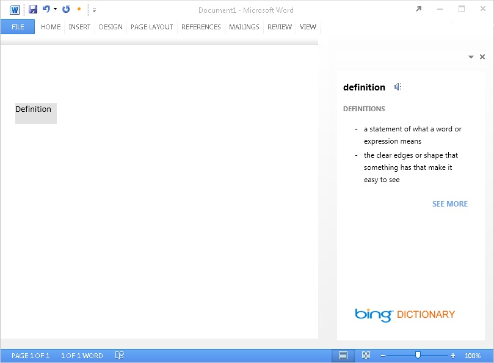
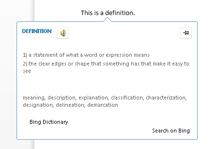

# <a name="create-a-dictionary-task-pane-add-in"></a><span data-ttu-id="c4a1a-103">Criar um suplemento de painel de tarefas de dicionário</span><span class="sxs-lookup"><span data-stu-id="c4a1a-103">Create a dictionary task pane add-in</span></span>


<span data-ttu-id="c4a1a-104">Este artigo mostra um exemplo de um suplemento de painel de tarefas e o serviço Web correspondente que fornece definições de dicionário ou sinônimos de dicionário de sinônimos para a seleção do usuário atual em um documento do Word 2013.</span><span class="sxs-lookup"><span data-stu-id="c4a1a-104">This article shows you an example of a task pane add-in with an accompanying web service that provides dictionary definitions or thesaurus synonyms for the user's current selection in a Word 2013 document.</span></span> 

<span data-ttu-id="c4a1a-105">Um Suplemento do Office de dicionário baseia-se no suplemento de painel de tarefas padrão, com recursos adicionais para dar suporte a consultas e exibir definições de um serviço Web XML de dicionário em locais adicionais na interface do usuário do aplicativo do Office.</span><span class="sxs-lookup"><span data-stu-id="c4a1a-105">A dictionary Office Add-in is based on the standard task pane add-in with additional features to support querying and displaying definitions from a dictionary XML web service in additional places in the Office application's UI.</span></span> 

<span data-ttu-id="c4a1a-p101">Em um suplemento de painel de tarefas de dicionário típico, um usuário seleciona uma palavra ou frase no documento e a lógica de JavaScript por trás do suplemento passa essa seleção ao serviço Web XML do provedor do dicionário. A página Web do provedor do dicionário então é atualizada para mostrar as definições para a seleção ao usuário. O componente do serviço Web XML retorna até três definições no formato definido pelo esquema OfficeDefinitions XML, que são exibidas para o usuário em outros locais na interface do usuário do aplicativo host do Office. A Figura 1 mostra a experiência de seleção e exibição para um suplemento de dicionário com a marca do Bing que está em execução no Word 2013.</span><span class="sxs-lookup"><span data-stu-id="c4a1a-p101">In a typical dictionary task pane add-in, a user selects a word or phrase in their document, and the JavaScript logic behind the add-in passes this selection to the dictionary provider's XML web service. The dictionary provider's webpage then updates to show the definitions for the selection to the user. The XML web service component returns up to three definitions in the format defined by the OfficeDefinitions XML schema, which are then displayed to the user in other places in the hosting Office application's UI. Figure 1 shows the selection and display experience for a Bing-branded dictionary add-in that is running in Word 2013.</span></span>

<span data-ttu-id="c4a1a-110">*Figura 1. Suplemento de dicionário exibindo definições para a palavra selecionada*</span><span class="sxs-lookup"><span data-stu-id="c4a1a-110">*Figure 1. Dictionary add-in displaying definitions for the selected word*</span></span>



<span data-ttu-id="c4a1a-112">Você pode determinar se clicar no **link** Ver Mais na interface do usuário HTML do complemento do dicionário exibe mais informações no painel de tarefas ou abre uma janela separada do navegador para a página da Web completa para a palavra ou frase selecionada.</span><span class="sxs-lookup"><span data-stu-id="c4a1a-112">It is up to you to determine if clicking the **See More** link in the dictionary add-in's HTML UI displays more information within the task pane or opens a separate browser window to the full webpage for the selected word or phrase.</span></span>
<span data-ttu-id="c4a1a-113">A Figura 2 mostra o **comando de** menu Definir contexto que permite aos usuários iniciar rapidamente dicionários instalados.</span><span class="sxs-lookup"><span data-stu-id="c4a1a-113">Figure 2 shows the **Define** context menu command that enables users to quickly launch installed dictionaries.</span></span> <span data-ttu-id="c4a1a-114">As Figuras 3 a 5 mostram os locais na interface do usuário do Office em que os serviços de dicionário XML são usados para fornecer definições no Word 2013.</span><span class="sxs-lookup"><span data-stu-id="c4a1a-114">Figures 3 through 5 show the places in the Office UI where the dictionary XML services are used to provide definitions in Word 2013.</span></span>

<span data-ttu-id="c4a1a-115">*Figura 2. Comando Definir no menu de contexto*</span><span class="sxs-lookup"><span data-stu-id="c4a1a-115">*Figure 2. Define command in the context menu*</span></span>


<span data-ttu-id="c4a1a-117">*Figura 3. Definições nos painéis Ortografia e Gramática*</span><span class="sxs-lookup"><span data-stu-id="c4a1a-117">*Figure 3. Definitions in the Spelling and Grammar panes*</span></span>


<span data-ttu-id="c4a1a-119">*Figura 4. Definições no painel Dicionário de Sinônimos*</span><span class="sxs-lookup"><span data-stu-id="c4a1a-119">*Figure 4. Definitions in the Thesaurus pane*</span></span>


<span data-ttu-id="c4a1a-121">*Figura 5. Definições no Modo de Leitura*</span><span class="sxs-lookup"><span data-stu-id="c4a1a-121">*Figure 5. Definitions in Reading Mode*</span></span>



<span data-ttu-id="c4a1a-123&quot;>Para criar um suplemento de painel de tarefas que forneça uma pesquisa de dicionário, crie dois componentes principais:</span><span class=&quot;sxs-lookup&quot;><span data-stu-id=&quot;c4a1a-123&quot;>To create a task pane add-in that provides a dictionary lookup, you create two main components:</span></span> 


- <span data-ttu-id=&quot;c4a1a-124&quot;>Um serviço Web XML que pesquisa definições de um serviço de dicionário e, em seguida, retorna os valores em um formato XML que pode ser consumido e exibido pelo suplemento de dicionário.</span><span class=&quot;sxs-lookup&quot;><span data-stu-id=&quot;c4a1a-124&quot;>An XML web service that looks up definitions from a dictionary service, and then returns those values in an XML format that can be consumed and displayed by the dictionary add-in.</span></span>
    
- <span data-ttu-id=&quot;c4a1a-125&quot;>Um suplemento de painel de tarefas que envia a seleção atual do usuário ao serviço Web de dicionário, exibe definições e, opcionalmente, pode inserir esses valores no documento.</span><span class=&quot;sxs-lookup&quot;><span data-stu-id=&quot;c4a1a-125&quot;>A task pane add-in that submits the user's current selection to the dictionary web service, displays definitions, and can optionally insert those values into the document.</span></span>
    
<span data-ttu-id=&quot;c4a1a-126&quot;>As seções a seguir fornecem exemplos de como criar esses componentes.</span><span class=&quot;sxs-lookup&quot;><span data-stu-id=&quot;c4a1a-126&quot;>The following sections provide examples of how to create these components.</span></span>

## <a name=&quot;creating-a-dictionary-xml-web-service&quot;></a><span data-ttu-id=&quot;c4a1a-127&quot;>Criar um serviço Web XML de dicionário</span><span class=&quot;sxs-lookup&quot;><span data-stu-id=&quot;c4a1a-127&quot;>Creating a dictionary XML web service</span></span>


<span data-ttu-id=&quot;c4a1a-p103&quot;>O serviço Web XML deve retornar consultas ao serviço Web como XML que estejam de acordo com o esquema XML OfficeDefinitions. As duas seções a seguir descrevem o esquema XML OfficeDefinitions e fornecem um exemplo de como escrever código para um serviço Web XML que retorna consultas nesse formato XML.</span><span class=&quot;sxs-lookup&quot;><span data-stu-id=&quot;c4a1a-p103&quot;>The XML web service must return queries to the web service as XML that conforms to the OfficeDefinitions XML schema. The following two sections describe the OfficeDefinitions XML schema, and provide an example of how to code an XML web service that returns queries in that XML format.</span></span>


### <a name=&quot;officedefinitions-xml-schema&quot;></a><span data-ttu-id=&quot;c4a1a-130&quot;>Esquema XML OfficeDefinitions</span><span class=&quot;sxs-lookup&quot;><span data-stu-id=&quot;c4a1a-130&quot;>OfficeDefinitions XML schema</span></span>

<span data-ttu-id=&quot;c4a1a-131&quot;>O código a seguir mostra o XSD para o esquema XML OfficeDefinitions.</span><span class=&quot;sxs-lookup&quot;><span data-stu-id=&quot;c4a1a-131&quot;>The following code shows the XSD for the OfficeDefinitions XML Schema.</span></span>


```XML
<?xml version=&quot;1.0&quot; encoding=&quot;utf-8&quot;?>
<xs:schema
  xmlns:xsi=&quot;http://www.w3.org/2001/XMLSchema-instance&quot;
  xmlns:xs=&quot;https://www.w3.org/2001/XMLSchema&quot;
  targetNamespace=&quot;http://schemas.microsoft.com/NLG/2011/OfficeDefinitions&quot;
  xmlns=&quot;http://schemas.microsoft.com/NLG/2011/OfficeDefinitions&quot;>
  <xs:element name=&quot;Result&quot;>
    <xs:complexType>
      <xs:sequence>
        <xs:element name=&quot;SeeMoreURL&quot; type=&quot;xs:anyURI&quot;/>
        <xs:element name=&quot;Definitions&quot; type=&quot;DefinitionListType&quot;/>
      </xs:sequence>
    </xs:complexType>
  </xs:element>
  <xs:complexType name=&quot;DefinitionListType&quot;>
    <xs:sequence>
      <xs:element name=&quot;Definition&quot; maxOccurs=&quot;3&quot;>
        <xs:simpleType>
          <xs:restriction base=&quot;xs:normalizedString&quot;>
            <xs:maxLength value=&quot;400&quot;/>
          </xs:restriction>
        </xs:simpleType>
      </xs:element>
    </xs:sequence>
  </xs:complexType>
</xs:schema>
```

<span data-ttu-id=&quot;c4a1a-132&quot;>O XML retornado que está em conformidade com o esquema OfficeDefinitions consiste em um elemento raiz que contém um elemento com de zero a três elementos filhos, cada um deles contém definições que não têm mais de `Result` `Definitions` `Definition` 400 caracteres.</span><span class=&quot;sxs-lookup&quot;><span data-stu-id=&quot;c4a1a-132&quot;>Returned XML that conforms to the OfficeDefinitions schema consists of a root `Result` element that contains a `Definitions` element with from zero to three `Definition` child elements, each of which contains definitions that are no more than 400 characters in length.</span></span> <span data-ttu-id=&quot;c4a1a-133&quot;>Além disso, a URL para a página completa no site do dicionário deve ser fornecida no `SeeMoreURL` elemento.</span><span class=&quot;sxs-lookup&quot;><span data-stu-id=&quot;c4a1a-133&quot;>Additionally, the URL to the full page on the dictionary site must be provided in the `SeeMoreURL` element.</span></span> <span data-ttu-id=&quot;c4a1a-134&quot;>O exemplo a seguir mostra a estrutura do XML retornado que está em conformidade com o esquema OfficeDefinitions.</span><span class=&quot;sxs-lookup&quot;><span data-stu-id=&quot;c4a1a-134&quot;>The following example shows the structure of returned XML that conforms to the OfficeDefinitions schema.</span></span>

```XML
<?xml version=&quot;1.0&quot; encoding=&quot;utf-8&quot;?>
<Result xmlns=&quot;http://schemas.microsoft.com/NLG/2011/OfficeDefinitions&quot;>
  <SeeMoreURL xmlns=&quot;&quot;>www.bing.com/dictionary/search?q=example</SeeMoreURL>
  <Definitions xmlns=&quot;&quot;>
    <Definition>Definition1</Definition>
    <Definition>Definition2</Definition>
    <Definition>Definition3</Definition>
  </Definitions>
 </Result>

```


### <a name=&quot;sample-dictionary-xml-web-service&quot;></a><span data-ttu-id=&quot;c4a1a-135&quot;>Serviço Web XML de dicionário de exemplo</span><span class=&quot;sxs-lookup&quot;><span data-stu-id=&quot;c4a1a-135&quot;>Sample dictionary XML web service</span></span>

<span data-ttu-id=&quot;c4a1a-136&quot;>O código C# a seguir fornece um exemplo simples de como escrever código para um serviço Web XML que retorna o resultado de uma consulta ao dicionário no formato XML OfficeDefinitions.</span><span class=&quot;sxs-lookup&quot;><span data-stu-id=&quot;c4a1a-136&quot;>The following C# code provides a simple example of how to write code for an XML web service that returns the result of a dictionary query in the OfficeDefinitions XML format.</span></span>


```cs
using System;
using System.Collections.Generic;
using System.Linq;
using System.Web;
using System.Web.Services;
using System.Xml;
using System.Text;
using System.IO;
using System.Net;

/// <summary>
/// Summary description for _Default
/// </summary>
[WebService(Namespace = &quot;http://tempuri.org/")]
[WebServiceBinding(ConformsTo = WsiProfiles.BasicProfile1_1)]
// To allow this web service to be called from script, using ASP.NET AJAX, uncomment the following line. 
// [System.Web.Script.Services.ScriptService]
public class WebService : System.Web.Services.WebService {

    public WebService () {

        // Uncomment the following line if using designed components 
        // InitializeComponent(); 
    }

    // You can replace this method entirely with your own method that gets definitions
    // from your data source, and then formats it into the OfficeDefinitions XML format. 
    // If you need a reference for constructing the returned XML, you can use this example as a basis.
    [WebMethod]
    public XmlDocument Define(string word)
    {

        StringBuilder sb = new StringBuilder();
        XmlWriter writer = XmlWriter.Create(sb);
        {
            writer.WriteStartDocument();
            
                writer.WriteStartElement("Result", "http://schemas.microsoft.com/NLG/2011/OfficeDefinitions");

            // See More URL should be changed to the dictionary publisher's page for that word on their website.
                    writer.WriteElementString("SeeMoreURL", "http://www.bing.com/search?q=" + word);

                    writer.WriteStartElement("Definitions");
            
                        writer.WriteElementString("Definition", "Definition 1 of " + word);
                        writer.WriteElementString("Definition", "Definition 2 of " + word);
                        writer.WriteElementString("Definition", "Definition 3 of " + word);
                   
                    writer.WriteEndElement();


                writer.WriteEndElement();
            
            writer.WriteEndDocument();
        }
        writer.Close();

        XmlDocument doc = new XmlDocument();
        doc.LoadXml(sb.ToString());

        return doc;
    }
}
```


## <a name="creating-the-components-of-a-dictionary-add-in"></a><span data-ttu-id="c4a1a-137">Criar os componentes de um suplemento de dicionário</span><span class="sxs-lookup"><span data-stu-id="c4a1a-137">Creating the components of a dictionary add-in</span></span>


<span data-ttu-id="c4a1a-138">Um suplemento de dicionário consiste em três arquivos de componentes principais:</span><span class="sxs-lookup"><span data-stu-id="c4a1a-138">A dictionary add-in consists of three main component files:</span></span>


- <span data-ttu-id="c4a1a-139">Um arquivo de manifesto XML que descreve o suplemento.</span><span class="sxs-lookup"><span data-stu-id="c4a1a-139">An XML manifest file that describes the add-in.</span></span>
    
- <span data-ttu-id="c4a1a-140">Um arquivo HTML que fornece a interface do usuário do suplemento.</span><span class="sxs-lookup"><span data-stu-id="c4a1a-140">An HTML file that provides the add-in's UI.</span></span>
    
- <span data-ttu-id="c4a1a-141">Um arquivo JavaScript que fornece a lógica para obter a seleção do usuário do documento, envia a seleção como uma consulta ao serviço Web e exibe os resultados retornados na interface do usuário do suplemento.</span><span class="sxs-lookup"><span data-stu-id="c4a1a-141">A JavaScript file that provides logic to get the user's selection from the document, sends the selection as a query to the web service, and then displays returned results in the add-in's UI.</span></span>
    

### <a name="creating-a-dictionary-add-ins-manifest-file"></a><span data-ttu-id="c4a1a-142">Criar um arquivo de manifesto de um suplemento de dicionário</span><span class="sxs-lookup"><span data-stu-id="c4a1a-142">Creating a dictionary add-in's manifest file</span></span>

<span data-ttu-id="c4a1a-143">A seguir há um arquivo de manifesto de exemplo para um suplemento de dicionário.</span><span class="sxs-lookup"><span data-stu-id="c4a1a-143">The following is an example manifest file for a dictionary add-in.</span></span>


```XML
<?xml version="1.0" encoding="utf-8"?>
<OfficeApp xmlns="http://schemas.microsoft.com/office/appforoffice/1.0" xmlns:xsi="http://www.w3.org/2001/XMLSchema-instance" xsi:type="TaskPaneApp">
  <Id>7164e750-dc86-49c0-b548-1bac57abdc7c</Id>
  <Version>15.0</Version>
  <ProviderName>Microsoft Office Demo Dictionary</ProviderName>
  <DefaultLocale>en-us</DefaultLocale>
  <!--DisplayName is the name that will appear in the user's list of applications.-->
  <DisplayName DefaultValue="Microsoft Office Demo Dictionary" />
  <!--Description is a 2-3 sentence description of this dictionary. -->
  <Description DefaultValue="The Microsoft Office Demo Dictionary is an example built to demonstrate how a publisher could create a dictionary that integrates with Office. It does not return real definitions." />
  <!--IconUrl is the URI for the icon that will appear in the user's list of applications.-->
  <IconUrl DefaultValue="http://officeimg.vo.msecnd.net/_layouts/images/general/office_logo.jpg" />
  <SupportUrl DefaultValue="[Insert the URL of a page that provides support information for the app]" />
  <!--Capabilities specifies the kind of Office application your dictionary add-in will support. You shouldn't have to modify this area.-->
  <Capabilities>
    <Capability Name="Workbook"/>
    <Capability Name="Document"/>
    <Capability Name="Project"/>
  </Capabilities>
  <DefaultSettings>
    <!--SourceLocation is the URL for your dictionary-->
    <SourceLocation DefaultValue="http://christophernlg/ExampleDictionary/DictionaryHome.html" />
  </DefaultSettings>
  <!--Permissions is the set of permissions a user will have to give your dictionary. If you need write access, such as to allow a user to replace the highlighted word with a synonym, use ReadWriteDocument. -->
  <Permissions>ReadDocument</Permissions>
  <Dictionary>
    <!--TargetDialects is the set of regional languages your dictionary contains. For example, if your dictionary applies to Spanish (Mexico) and Spanish (Peru), but not Spanish (Spain), you can specify that here. Do not put more than one language (for example, Spanish and English) here. Publish separate languages as separate dictionaries. -->
    <TargetDialects>
      <TargetDialect>EN-AU</TargetDialect>
      <TargetDialect>EN-BZ</TargetDialect>
      <TargetDialect>EN-CA</TargetDialect>
      <TargetDialect>EN-029</TargetDialect>
      <TargetDialect>EN-HK</TargetDialect>
      <TargetDialect>EN-IN</TargetDialect>
      <TargetDialect>EN-ID</TargetDialect>
      <TargetDialect>EN-IE</TargetDialect>
      <TargetDialect>EN-JM</TargetDialect>
      <TargetDialect>EN-MY</TargetDialect>
      <TargetDialect>EN-NZ</TargetDialect>
      <TargetDialect>EN-PH</TargetDialect>
      <TargetDialect>EN-SG</TargetDialect>
      <TargetDialect>EN-ZA</TargetDialect>
      <TargetDialect>EN-TT</TargetDialect>
      <TargetDialect>EN-GB</TargetDialect>
      <TargetDialect>EN-US</TargetDialect>
      <TargetDialect>EN-ZW</TargetDialect>
    </TargetDialects>
    <!--QueryUri is the address of this dictionary's XML web service (which is used to put definitions in additional contexts, such as the spelling checker.)-->
    <QueryUri DefaultValue="http://christophernlg/ExampleDictionary/WebService.asmx/Define?word="/>
    <!--Citation Text, Dictionary Name, and Dictionary Home Page will be combined to form the citation line (for example, this would produce "Examples by: Microsoft", where "Microsoft" is a hyperlink to http://www.microsoft.com).-->
    <CitationText DefaultValue="Examples by: " />
    <DictionaryName DefaultValue="Microsoft" />
    <DictionaryHomePage DefaultValue="http://www.microsoft.com" />
  </Dictionary>
</OfficeApp>
```

<span data-ttu-id="c4a1a-144">O elemento e seus elementos filho específicos da criação do arquivo de manifesto de um complemento de dicionário `Dictionary` são descritos nas seções a seguir.</span><span class="sxs-lookup"><span data-stu-id="c4a1a-144">The `Dictionary` element and its child elements that are specific to creating a dictionary add-in's manifest file are described in the following sections.</span></span> <span data-ttu-id="c4a1a-145">Para obter informações sobre os outros elementos no arquivo de manifesto, confira [Manifesto XML de suplementos do Office](../develop/add-in-manifests.md).</span><span class="sxs-lookup"><span data-stu-id="c4a1a-145">For information about the other elements in the manifest file, see [Office Add-ins XML manifest](../develop/add-in-manifests.md).</span></span>


### <a name="dictionary-element"></a><span data-ttu-id="c4a1a-146">Elemento Dictionary</span><span class="sxs-lookup"><span data-stu-id="c4a1a-146">Dictionary element</span></span>


<span data-ttu-id="c4a1a-147">Especifica configurações para suplementos de dicionário.</span><span class="sxs-lookup"><span data-stu-id="c4a1a-147">Specifies settings for dictionary add-ins.</span></span>

 <span data-ttu-id="c4a1a-148">**Elemento pai**</span><span class="sxs-lookup"><span data-stu-id="c4a1a-148">**Parent element**</span></span>

 `<OfficeApp>`

 <span data-ttu-id="c4a1a-149">**Elementos filho**</span><span class="sxs-lookup"><span data-stu-id="c4a1a-149">**Child elements**</span></span>

 <span data-ttu-id="c4a1a-150">`<TargetDialects>`, `<QueryUri>`, `<CitationText>`, `<DictionaryName>`, `<DictionaryHomePage>`</span><span class="sxs-lookup"><span data-stu-id="c4a1a-150">`<TargetDialects>`, `<QueryUri>`, `<CitationText>`, `<DictionaryName>`, `<DictionaryHomePage>`</span></span>

 <span data-ttu-id="c4a1a-151">**Comentários**</span><span class="sxs-lookup"><span data-stu-id="c4a1a-151">**Remarks**</span></span>

<span data-ttu-id="c4a1a-152">O elemento e seus elementos filho são adicionados ao manifesto de um complemento do painel de tarefas quando você cria um `Dictionary` complemento de dicionário.</span><span class="sxs-lookup"><span data-stu-id="c4a1a-152">The `Dictionary` element and its child elements are added to the manifest of a task pane add-in when you create a dictionary add-in.</span></span>


#### <a name="targetdialects-element"></a><span data-ttu-id="c4a1a-153">Elemento TargetDialects</span><span class="sxs-lookup"><span data-stu-id="c4a1a-153">TargetDialects element</span></span>


<span data-ttu-id="c4a1a-p106">Especifica os idiomas regionais aos quais o dicionário oferece suporte. Necessário para suplementos de dicionário.</span><span class="sxs-lookup"><span data-stu-id="c4a1a-p106">Specifies the regional languages that this dictionary supports. Required for dictionary add-ins.</span></span>

 <span data-ttu-id="c4a1a-156">**Elemento pai**</span><span class="sxs-lookup"><span data-stu-id="c4a1a-156">**Parent element**</span></span>

 `<Dictionary>`

 <span data-ttu-id="c4a1a-157">**Elemento filho**</span><span class="sxs-lookup"><span data-stu-id="c4a1a-157">**Child element**</span></span>

 `<TargetDialect>`

 <span data-ttu-id="c4a1a-158">**Comentários**</span><span class="sxs-lookup"><span data-stu-id="c4a1a-158">**Remarks**</span></span>

<span data-ttu-id="c4a1a-159">O `TargetDialects` elemento e seus elementos filho especificam o conjunto de idiomas regionais que seu dicionário contém.</span><span class="sxs-lookup"><span data-stu-id="c4a1a-159">The `TargetDialects` element and its child elements specify the set of regional languages your dictionary contains.</span></span> <span data-ttu-id="c4a1a-160">Por exemplo, se o dicionário se aplica a Espanhol (México) e Espanhol (Peru), mas não a Espanhol (Espanha), é possível especificar isso nesse elemento.</span><span class="sxs-lookup"><span data-stu-id="c4a1a-160">For example, if your dictionary applies to both Spanish (Mexico) and Spanish (Peru), but not Spanish (Spain), you can specify that in this element.</span></span> <span data-ttu-id="c4a1a-161">Não especifique mais de um idioma (por exemplo, espanhol e inglês) nesse manifesto.</span><span class="sxs-lookup"><span data-stu-id="c4a1a-161">Do not specify more than one language (e.g., Spanish and English) in this manifest.</span></span> <span data-ttu-id="c4a1a-162">Publique idiomas separados como dicionários separados.</span><span class="sxs-lookup"><span data-stu-id="c4a1a-162">Publish separate languages as separate dictionaries.</span></span>

 <span data-ttu-id="c4a1a-163">**Exemplo**</span><span class="sxs-lookup"><span data-stu-id="c4a1a-163">**Example**</span></span>

```XML
<TargetDialects>
  <TargetDialect>EN-AU</TargetDialect>
  <TargetDialect>EN-BZ</TargetDialect>
  <TargetDialect>EN-CA</TargetDialect>
  <TargetDialect>EN-029</TargetDialect>
  <TargetDialect>EN-HK</TargetDialect>
  <TargetDialect>EN-IN</TargetDialect>
  <TargetDialect>EN-ID</TargetDialect>
  <TargetDialect>EN-IE</TargetDialect>
  <TargetDialect>EN-JM</TargetDialect>
  <TargetDialect>EN-MY</TargetDialect>
  <TargetDialect>EN-NZ</TargetDialect>
  <TargetDialect>EN-PH</TargetDialect>
  <TargetDialect>EN-SG</TargetDialect>
  <TargetDialect>EN-ZA</TargetDialect>
  <TargetDialect>EN-TT</TargetDialect>
  <TargetDialect>EN-GB</TargetDialect>
  <TargetDialect>EN-US</TargetDialect>
  <TargetDialect>EN-ZW</TargetDialect>
</TargetDialects>
```


#### <a name="targetdialect-element"></a><span data-ttu-id="c4a1a-164">Elemento TargetDialect</span><span class="sxs-lookup"><span data-stu-id="c4a1a-164">TargetDialect element</span></span>


<span data-ttu-id="c4a1a-p108">Especifica um idioma regional ao qual o dicionário oferece suporte. Necessário para suplementos de dicionário.</span><span class="sxs-lookup"><span data-stu-id="c4a1a-p108">Specifies a regional language that this dictionary supports. Required for dictionary add-ins.</span></span>

 <span data-ttu-id="c4a1a-167">**Elemento pai**</span><span class="sxs-lookup"><span data-stu-id="c4a1a-167">**Parent element**</span></span>

 `<TargetDialects>`

 <span data-ttu-id="c4a1a-168">**Comentários**</span><span class="sxs-lookup"><span data-stu-id="c4a1a-168">**Remarks**</span></span>

<span data-ttu-id="c4a1a-169">Especifique o valor para um idioma regional no formato de tag de `language` RFC1766, como PT-BR.</span><span class="sxs-lookup"><span data-stu-id="c4a1a-169">Specify the value for a regional language in the RFC1766  `language` tag format, such as EN-US.</span></span>

 <span data-ttu-id="c4a1a-170">**Exemplo**</span><span class="sxs-lookup"><span data-stu-id="c4a1a-170">**Example**</span></span>


```XML
<TargetDialect>EN-US</TargetDialect>
```


#### <a name="queryuri-element"></a><span data-ttu-id="c4a1a-171">Elemento QueryUri</span><span class="sxs-lookup"><span data-stu-id="c4a1a-171">QueryUri element</span></span>


<span data-ttu-id="c4a1a-p109">Especifica o ponto de extremidade do serviço de consulta de dicionário. Necessário para suplementos de dicionário.</span><span class="sxs-lookup"><span data-stu-id="c4a1a-p109">Specifies the endpoint for the dictionary query service. Required for dictionary add-ins.</span></span>

 <span data-ttu-id="c4a1a-174">**Elemento pai**</span><span class="sxs-lookup"><span data-stu-id="c4a1a-174">**Parent element**</span></span>

 `<Dictionary>`

 <span data-ttu-id="c4a1a-175">**Comentários**</span><span class="sxs-lookup"><span data-stu-id="c4a1a-175">**Remarks**</span></span>

<span data-ttu-id="c4a1a-p110">Esse é o URI do serviço Web XML para o provedor do dicionário. A consulta com escape correto será anexada a esse URI.</span><span class="sxs-lookup"><span data-stu-id="c4a1a-p110">This is the URI of the XML web service for the dictionary provider. The properly escaped query will be appended to this URI.</span></span> 

 <span data-ttu-id="c4a1a-178">**Exemplo**</span><span class="sxs-lookup"><span data-stu-id="c4a1a-178">**Example**</span></span>


```XML
<QueryUri DefaultValue="http://msranlc-lingo1/proof.aspx?q="/>
```


#### <a name="citationtext-element"></a><span data-ttu-id="c4a1a-179">Elemento CitationText</span><span class="sxs-lookup"><span data-stu-id="c4a1a-179">CitationText element</span></span>


<span data-ttu-id="c4a1a-p111">Especifica o texto a ser usado em citações. Necessário para suplementos de dicionário.</span><span class="sxs-lookup"><span data-stu-id="c4a1a-p111">Specifies the text to use in citations. Required for dictionary add-ins.</span></span>

 <span data-ttu-id="c4a1a-182">**Elemento pai**</span><span class="sxs-lookup"><span data-stu-id="c4a1a-182">**Parent element**</span></span>

 `<Dictionary>`

 <span data-ttu-id="c4a1a-183">**Comentários**</span><span class="sxs-lookup"><span data-stu-id="c4a1a-183">**Remarks**</span></span>

<span data-ttu-id="c4a1a-184">Esse elemento especifica o início do texto de citação que será exibido em uma linha abaixo do conteúdo que é retornado do serviço Web (por exemplo, "Resultados do:" ou "Da plataforma:").</span><span class="sxs-lookup"><span data-stu-id="c4a1a-184">This element specifies the beginning of the citation text that will be displayed on a line below the content that is returned from the web service (for example, "Results by: " or "Powered by: ").</span></span>

<span data-ttu-id="c4a1a-185">Para esse elemento, você pode especificar valores para localidades adicionais usando o `Override` elemento.</span><span class="sxs-lookup"><span data-stu-id="c4a1a-185">For this element, you can specify values for additional locales by using the `Override` element.</span></span> <span data-ttu-id="c4a1a-186">Por exemplo, se um usuário está executando a SKU do português brasileiro do Office, mas usando um dicionário de inglês, isso permite que a linha de citação seja "Resultados por: Bing"em vez de "Results by: Bing".</span><span class="sxs-lookup"><span data-stu-id="c4a1a-186">For example, if a user is running the Spanish SKU of Office, but using an English dictionary, this allows the citation line to read "Resultados por: Bing" rather than "Results by: Bing".</span></span> <span data-ttu-id="c4a1a-187">Para saber mais sobre como especificar valores para localidades adicionais, confira a seção "Fornecer configurações para localidades diferentes" em [Manifesto XML de suplementos do Office](../develop/add-in-manifests.md).</span><span class="sxs-lookup"><span data-stu-id="c4a1a-187">For more information about how to specify values for additional locales, see the section "Providing settings for different locales" in [Office Add-ins XML manifest](../develop/add-in-manifests.md).</span></span>

 <span data-ttu-id="c4a1a-188">**Exemplo**</span><span class="sxs-lookup"><span data-stu-id="c4a1a-188">**Example**</span></span>


```XML
<CitationText DefaultValue="Results by: " />
```


#### <a name="dictionaryname-element"></a><span data-ttu-id="c4a1a-189">Elemento DictionaryName</span><span class="sxs-lookup"><span data-stu-id="c4a1a-189">DictionaryName element</span></span>


<span data-ttu-id="c4a1a-p113">Especifica o nome deste dicionário. Necessário para suplementos de dicionário.</span><span class="sxs-lookup"><span data-stu-id="c4a1a-p113">Specifies the name of this dictionary. Required for dictionary add-ins.</span></span>

 <span data-ttu-id="c4a1a-192">**Elemento pai**</span><span class="sxs-lookup"><span data-stu-id="c4a1a-192">**Parent element**</span></span>

 `<Dictionary>`

 <span data-ttu-id="c4a1a-193">**Comentários**</span><span class="sxs-lookup"><span data-stu-id="c4a1a-193">**Remarks**</span></span>

<span data-ttu-id="c4a1a-p114">Esse elemento especifica o texto do link no texto de citação. O texto de citação é exibido em uma linha abaixo do conteúdo que é retornado do serviço Web.</span><span class="sxs-lookup"><span data-stu-id="c4a1a-p114">This element specifies the link text in the citation text. Citation text is displayed on a line below the content that is returned from the web service.</span></span>

<span data-ttu-id="c4a1a-196">Para esse elemento, você pode especificar valores para localidades adicionais.</span><span class="sxs-lookup"><span data-stu-id="c4a1a-196">For this element, you can specify values for additional locales.</span></span>

 <span data-ttu-id="c4a1a-197">**Exemplo**</span><span class="sxs-lookup"><span data-stu-id="c4a1a-197">**Example**</span></span>

```XML
<DictionaryName DefaultValue="Bing Dictionary" />
```


#### <a name="dictionaryhomepage-element"></a><span data-ttu-id="c4a1a-198">Elemento DictionaryHomePage</span><span class="sxs-lookup"><span data-stu-id="c4a1a-198">DictionaryHomePage element</span></span>


<span data-ttu-id="c4a1a-p115">Especifica a URL da página inicial do dicionário. Necessário para suplementos de dicionário.</span><span class="sxs-lookup"><span data-stu-id="c4a1a-p115">Specifies the URL of the home page for the dictionary. Required for dictionary add-ins.</span></span>

 <span data-ttu-id="c4a1a-201">**Elemento pai**</span><span class="sxs-lookup"><span data-stu-id="c4a1a-201">**Parent element**</span></span>

 `<Dictionary>`

 <span data-ttu-id="c4a1a-202">**Comentários**</span><span class="sxs-lookup"><span data-stu-id="c4a1a-202">**Remarks**</span></span>

<span data-ttu-id="c4a1a-p116">Esse elemento especifica a URL do link no texto de citação. O texto de citação é exibido em uma linha abaixo do conteúdo que é retornado do serviço Web.</span><span class="sxs-lookup"><span data-stu-id="c4a1a-p116">This element specifies the link URL in the citation text. Citation text is displayed on a line below the content that is returned from the web service.</span></span>

<span data-ttu-id="c4a1a-205">Para esse elemento, você pode especificar valores para localidades adicionais.</span><span class="sxs-lookup"><span data-stu-id="c4a1a-205">For this element, you can specify values for additional locales.</span></span>

 <span data-ttu-id="c4a1a-206">**Exemplo**</span><span class="sxs-lookup"><span data-stu-id="c4a1a-206">**Example**</span></span>


```XML
<DictionaryHomePage DefaultValue="http://www.bing.com" />
```


### <a name="creating-a-dictionary-add-ins-html-user-interface"></a><span data-ttu-id="c4a1a-207">Criar a interface do usuário HTML de um suplemento de dicionário</span><span class="sxs-lookup"><span data-stu-id="c4a1a-207">Creating a dictionary add-in's HTML user interface</span></span>

<span data-ttu-id="c4a1a-p117">Os dois exemplos a seguir mostram os arquivos HTML e CSS para a interface do usuário do suplemento de Dicionário de Demonstração. Para ver como a interface do usuário é exibida no suplemento de painel de tarefas, confira a Figura 6 após o código. Para ver como a implementação do JavaScript no arquivo Dictionary.js fornece lógica de programação para essa interface do usuário HTML, confira "Escrever a implementação de JavaScript" imediatamente após esta seção.</span><span class="sxs-lookup"><span data-stu-id="c4a1a-p117">The following two examples show the HTML and CSS files for the UI of the Demo Dictionary add-in. To view how the UI is displayed in the add-in's task pane, see Figure 6 following the code. To see how the implementation of the JavaScript in the Dictionary.js file provides programming logic for this HTML UI, see "Writing the JavaScript implementation" immediately following this section.</span></span>

```HTML
<!DOCTYPE html>
<html>

<head>
<meta http-equiv="X-UA-Compatible" content="IE=Edge"/>

<!--The title will not be shown but is supplied to ensure valid HTML.-->
<title>Example Dictionary</title>

<!--Required library includes.-->
<script type="text/javascript" src="http://ajax.microsoft.com/ajax/4.0/1/MicrosoftAjax.js"></script>
<script type="text/javascript" src="office.js"></script>

<!--Optional library includes.-->
<script type="text/javascript" src="http://ajax.aspnetcdn.com/ajax/jQuery/jquery-1.5.1.js"></script>

<!--App-specific CSS and JS.-->
<link rel="Stylesheet" type="text/css" href="style.css" />
<script type="text/ecmascript" src="dictionary.js"></script>
</head>

<body>
<div id="mainContainer">
    <div id="header">
        <span id="headword"></span>
        <span id="pronunciation">(<a id="pronunciationLink">Pronounce</a>)</span>
    </div>
    <ol id="definitions">
    </ol>
    <div id="SeeMore">
    <a id="SeeMoreLink">See More...</a>
    </div>
</div>
</body>

</html>
```

<span data-ttu-id="c4a1a-211">O exemplo a seguir mostra o conteúdo de Style.css.</span><span class="sxs-lookup"><span data-stu-id="c4a1a-211">The following example shows the contents of Style.css.</span></span>

```CSS
#mainContainer
{
    font-family: Segoe UI;
    font-size: 11pt;
}

#headword
{
    font-family: Segoe UI Semibold;
    color: #262626;
}

#pronunciation
{
    margin-left: 2px;
    margin-right: 2px;
}

#definitions
{
    font-size: 8.5pt;
}
a
{
    font-size: 8pt;
    color: #336699;
    text-decoration: none;
}
a:visited
{
    color: #993366;
}
a:hover, a:active
{  
    text-decoration: underline;
}
```

<span data-ttu-id="c4a1a-212">*Figura 6. Demonstração da interface de usuário do dicionário*</span><span class="sxs-lookup"><span data-stu-id="c4a1a-212">*Figure 6. Demo dictionary UI*</span></span>


### <a name="writing-the-javascript-implementation"></a><span data-ttu-id="c4a1a-214">Escrever a implementação de JavaScript</span><span class="sxs-lookup"><span data-stu-id="c4a1a-214">Writing the JavaScript implementation</span></span>


<span data-ttu-id="c4a1a-p118">O exemplo a seguir mostra a implementação de JavaScript no arquivo Dictionary.js que é chamada da página HTML do suplemento para fornecer a lógica de programação ao suplemento de Dicionário de Demonstração. Esse script reutiliza o serviço Web XML descrito anteriormente. Quando colocado no mesmo diretório que o serviço Web de exemplo, o script obterá definições desse serviço. Para usá-lo com um serviço Web XML público em conformidade com OfficeDefinitions, modifique a variável `xmlServiceURL` no início do arquivo e substitua a chave API do Bing para pronúncias com um script registrado corretamente.</span><span class="sxs-lookup"><span data-stu-id="c4a1a-p118">The following example shows the JavaScript implementation in the Dictionary.js file that is called from the add-in's HTML page to provide the programming logic for the Demo Dictionary add-in. This script reuses the XML web service described previously. When placed in the same directory as the example web service, the script will get definitions from that service. It can be used with a public OfficeDefinitions-conforming XML web service by modifying the  `xmlServiceURL` variable at the top of the file, and then replacing the Bing API key for pronunciations with a properly registered one.</span></span>

<span data-ttu-id="c4a1a-219">Os principais membros da API Office JavaScript (Office.js) que são chamados a partir dessa implementação são:</span><span class="sxs-lookup"><span data-stu-id="c4a1a-219">The primary members of the Office JavaScript API (Office.js) that are called from this implementation are as follows:</span></span>


- <span data-ttu-id="c4a1a-220">O [evento initialize](/javascript/api/office) do objeto, que é gerado quando o contexto do add-in é inicializado, e fornece acesso a uma instância de objeto Document que representa o documento com o qual o `Office` complemento está interagindo. [](/javascript/api/office/office.document)</span><span class="sxs-lookup"><span data-stu-id="c4a1a-220">The [initialize](/javascript/api/office) event of the `Office` object, which is raised when the add-in context is initialized, and provides access to a [Document](/javascript/api/office/office.document) object instance that represents the document the add-in is interacting with.</span></span>
    
- <span data-ttu-id="c4a1a-221">O [método addHandlerAsync](/javascript/api/office/office.document#addhandlerasync-eventtype--handler--options--callback-) do objeto, que é chamado na função para adicionar um manipulador de eventos para o `Document` evento `initialize` [SelectionChanged](/javascript/api/office/office.documentselectionchangedeventargs) do documento para ouvir as alterações de seleção do usuário.</span><span class="sxs-lookup"><span data-stu-id="c4a1a-221">The [addHandlerAsync](/javascript/api/office/office.document#addhandlerasync-eventtype--handler--options--callback-) method of the `Document` object, which is called in the `initialize` function to add an event handler for the [SelectionChanged](/javascript/api/office/office.documentselectionchangedeventargs) event of the document to listen for user selection changes.</span></span>
    
- <span data-ttu-id="c4a1a-222">O [método getSelectedDataAsync](/javascript/api/office/office.document#getselecteddataasync-coerciontype--options--callback-) do objeto, que é chamado na função quando o manipulador de eventos é gerado para obter a palavra ou frase que o usuário selecionou, coagi-lo para texto sem texto e, em seguida, executar a função de retorno de chamada `Document` `tryUpdatingSelectedWord()` `SelectionChanged` `selectedTextCallback` assíncrona.</span><span class="sxs-lookup"><span data-stu-id="c4a1a-222">The [getSelectedDataAsync](/javascript/api/office/office.document#getselecteddataasync-coerciontype--options--callback-) method of the `Document` object, which is called in the `tryUpdatingSelectedWord()` function when the `SelectionChanged` event handler is raised to get the word or phrase the user selected, coerce it to plain text, and then execute the `selectedTextCallback` asynchronous callback function.</span></span>
    
- <span data-ttu-id="c4a1a-223">Quando a função de retorno de chamada  `selectTextCallback` assíncrona passada como o argumento _de_ retorno de chamada do método é executada, ela obtém o valor do texto selecionado quando o retorno de `getSelectedDataAsync` chamada retorna.</span><span class="sxs-lookup"><span data-stu-id="c4a1a-223">When the  `selectTextCallback` asynchronous callback function that is passed as the _callback_ argument of the `getSelectedDataAsync` method executes, it gets the value of the selected text when the callback returns.</span></span> <span data-ttu-id="c4a1a-224">Ele obtém esse valor do argumento _selectedText_ do retorno de chamada (que é do tipo [AsyncResult](/javascript/api/office/office.asyncresult)) usando a propriedade [value](/javascript/api/office/office.asyncresult#status) do objeto `AsyncResult` retornado.</span><span class="sxs-lookup"><span data-stu-id="c4a1a-224">It gets that value from the callback's _selectedText_ argument (which is of type [AsyncResult](/javascript/api/office/office.asyncresult)) by using the [value](/javascript/api/office/office.asyncresult#status) property of the returned `AsyncResult` object.</span></span>
    
- <span data-ttu-id="c4a1a-p120">O restante do código na função `selectedTextCallback` consulta o serviço Web XML para obter definições. Também chama as APIs do Microsoft Translator para fornecer a URL de um arquivo .wav que tem a pronúncia da palavra selecionada.</span><span class="sxs-lookup"><span data-stu-id="c4a1a-p120">The rest of the code in the  `selectedTextCallback` function queries the XML web service for definitions. It also calls into the Microsoft Translator APIs to provide the URL of a .wav file that has the selected word's pronunciation.</span></span>
    
- <span data-ttu-id="c4a1a-227">O código restante em Dictionary.js exibe a lista de definições e o link de pronúncia na interface do usuário HTML do suplemento.</span><span class="sxs-lookup"><span data-stu-id="c4a1a-227">The remaining code in Dictionary.js displays the list of definitions and the pronunciation link in the add-in's HTML UI.</span></span>
    


```js
// The document the dictionary add-in is interacting with.
var _doc; 
// The last looked-up word, which is also the currently displayed word.
var lastLookup; 
// For demo purposes only!! Get an AppID if you intend to use the Pronunciation service for your feature.
var appID="3D8D4E1888B88B975484F0CA25CDD24AAC457ED8"; 

// The base URL for the OfficeDefinitions-conforming XML web service to query for definitions.
var xmlServiceUrl = "WebService.asmx/Define?Word="; 

// Initialize the add-in. 
// The initialize function is required for all add-ins.
Office.initialize = function (reason) {
    // Checks for the DOM to load using the jQuery ready function.
    $(document).ready(function () {
    // After the DOM is loaded, app-specific code can run.
    // Store a reference to the current document.
    _doc = Office.context.document; 
    // Check whether text is already selected.
    tryUpdatingSelectedWord(); 
    _doc.addHandlerAsync("documentSelectionChanged", tryUpdatingSelectedWord); //Add a handler to refresh when the user changes selection.
    });
}

// Executes when event is raised on user's selection changes, and at initialization time. 
// Gets the current selection and passes that to asynchronous callback method.
function tryUpdatingSelectedWord() {
    _doc.getSelectedDataAsync(Office.CoercionType.Text, selectedTextCallback); 
}

// Async callback that executes when the add-in gets the user's selection.
// Determines whether anything should be done. If so, it makes requests that will be passed to various functions.
function selectedTextCallback(selectedText) {
    selectedText = $.trim(selectedText.value);
    // Be sure user has selected text. The SelectionChanged event is raised every time the user moves the cursor, even if no selection.
    if (selectedText != "") { 
        // Check whether user selected the same word the pane is currently displaying to avoid unnecessary web calls.
        if (selectedText != lastLookup) { 
            // Update the lastLookup variable.
            lastLookup = selectedText; 
            // Set the "headword" span to the word you looked up.
            $("#headword").text(selectedText); 
            // AJAX request to get definitions for the selected word; pass that to refreshDefinitions.
            $.ajax(xmlServiceUrl + selectedText, { dataType: 'xml', success: refreshDefinitions, error: errorHandler }); 
            // AJAX request to the Microsoft Translator APIs. Gets the URL of a WAV file with pronunciation, which is passed to refreshPronunciation. See http://www.microsofttranslator.com/dev for details.
            $.ajax("http://api.microsofttranslator.com/V2/Ajax.svc/Speak?oncomplete=refreshPronunciation&amp;appId=" + appID + "&amp;text=" + selectedText + "&amp;language=en-us", { dataType: 'script', success: null, error: errorHandler }); 
        }
    }
}

// This function is called when the add-in gets back the definitions target word.
// It removes the old definitions and replaces them with the definitions for the current word.
// It also sets the "See More" link.
function refreshDefinitions(data, textStatus, jqXHR) {
    $(".definition").remove();
    // Make a new list item for each returned definition that was returned, set the CSS class, and append it to the definitions div.
    $(data).find("Definition").each(function () {
        $(document.createElement("li")).text($(this).text()).addClass("definition").appendTo($("#definitions"));
    });
    $("#SeeMoreLink").attr("href", $(data).find("SeeMoreURL").text()); //Change the "See More" link to direct to the correct URL.
}

// This function is called when the add-in gets back the link to the pronunciation
// to set the "Pronounce" link to the URL of the .WAV file.
function refreshPronunciation(data) {
    $("#pronunciationLink").attr("href", data);
}

// Basic error handler that writes to a div with id='message'.
function errorHandler(jqXHR, textStatus, errorThrown) {
    document.getElementById('message').innerText += errorThrown;
}

```
