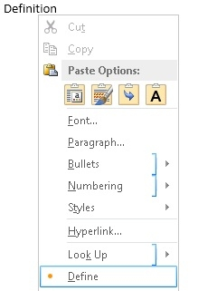

# <a name="create-a-dictionary-task-pane-add-in"></a>Criar um suplemento de painel de tarefas de dicionário

Este artigo mostra um exemplo de um suplemento de painel de tarefas e o serviço Web correspondente que fornece definições de dicionário ou sinônimos de dicionário de sinônimos para a seleção do usuário atual em um documento do Word 2013.

Um Suplemento do Office de dicionário baseia-se no suplemento de painel de tarefas padrão, com recursos adicionais para dar suporte a consultas e exibir definições de um serviço Web XML de dicionário em locais adicionais na interface do usuário do aplicativo do Office.

Em um suplemento de painel de tarefas de dicionário típico, um usuário seleciona uma palavra ou frase no documento e a lógica de JavaScript por trás do suplemento passa essa seleção ao serviço Web XML do provedor do dicionário. A página Web do provedor do dicionário então é atualizada para mostrar as definições para a seleção ao usuário. O componente do serviço Web XML retorna até três definições no formato definido pelo esquema OfficeDefinitions XML, que são exibidas para o usuário em outros locais na interface do usuário do aplicativo host do Office. A Figura 1 mostra a experiência de seleção e exibição para um suplemento de dicionário com a marca do Bing que está em execução no Word 2013.

*Figura 1. Suplemento de dicionário exibindo definições para a palavra selecionada*


Você pode determinar se a seleção **do link Ver** Mais na interface do usuário HTML do suplemento de dicionário exibe mais informações no painel de tarefas ou abre uma janela separada do navegador para a página da Web completa para a palavra ou frase selecionada.
A Figura 2 mostra o **comando Definir** no menu de contexto que permite aos usuários iniciar rapidamente dicionários instalados. As Figuras 3 a 5 mostram os locais na interface do usuário do Office em que os serviços de dicionário XML são usados para fornecer definições no Word 2013.

*Figura 2. Comando Definir no menu de contexto*




*Figura 3. Definições nos painéis Ortografia e Gramática*


*Figura 4. Definições no painel Dicionário de Sinônimos*


*Figura 5. Definições no Modo de Leitura*


Para criar um suplemento de painel de tarefas que forneça uma pesquisa de dicionário, crie dois componentes principais: 

- Um serviço Web XML que pesquisa definições de um serviço de dicionário e, em seguida, retorna os valores em um formato XML que pode ser consumido e exibido pelo suplemento de dicionário.
- Um suplemento de painel de tarefas que envia a seleção atual do usuário ao serviço Web de dicionário, exibe definições e, opcionalmente, pode inserir esses valores no documento.

As seções a seguir fornecem exemplos de como criar esses componentes.

## <a name="creating-a-dictionary-xml-web-service"></a>Criar um serviço Web XML de dicionário

O serviço Web XML deve retornar consultas ao serviço Web como XML que estejam de acordo com o esquema XML OfficeDefinitions. As duas seções a seguir descrevem o esquema XML OfficeDefinitions e fornecem um exemplo de como escrever código para um serviço Web XML que retorna consultas nesse formato XML.

### <a name="officedefinitions-xml-schema"></a>Esquema XML OfficeDefinitions

O código a seguir mostra o XSD para o esquema XML OfficeDefinitions.

```XML
<?xml version="1.0" encoding="utf-8"?>
<xs:schema
  xmlns:xsi="http://www.w3.org/2001/XMLSchema-instance"
  xmlns:xs="https://www.w3.org/2001/XMLSchema"
  targetNamespace="http://schemas.microsoft.com/NLG/2011/OfficeDefinitions"
  xmlns="http://schemas.microsoft.com/NLG/2011/OfficeDefinitions">
  <xs:element name="Result">
    <xs:complexType>
      <xs:sequence>
        <xs:element name="SeeMoreURL" type="xs:anyURI"/>
        <xs:element name="Definitions" type="DefinitionListType"/>
      </xs:sequence>
    </xs:complexType>
  </xs:element>
  <xs:complexType name="DefinitionListType">
    <xs:sequence>
      <xs:element name="Definition" maxOccurs="3">
        <xs:simpleType>
          <xs:restriction base="xs:normalizedString">
            <xs:maxLength value="400"/>
          </xs:restriction>
        </xs:simpleType>
      </xs:element>
    </xs:sequence>
  </xs:complexType>
</xs:schema>
```

Xml retornado que está em conformidade com o esquema OfficeDefinitions consiste em um elemento raiz que contém um elemento com de zero `Definition` a `Result` `Definitions` três elementos filho, cada um deles contém definições que não têm mais de 400 caracteres. Além disso, a URL para a página inteira no site do dicionário deve ser fornecida no `SeeMoreURL` elemento. O exemplo a seguir mostra a estrutura do XML retornado que está em conformidade com o esquema OfficeDefinitions.

```XML
<?xml version="1.0" encoding="utf-8"?>
<Result xmlns="http://schemas.microsoft.com/NLG/2011/OfficeDefinitions">
  <SeeMoreURL xmlns="">www.bing.com/dictionary/search?q=example</SeeMoreURL>
  <Definitions xmlns="">
    <Definition>Definition1</Definition>
    <Definition>Definition2</Definition>
    <Definition>Definition3</Definition>
  </Definitions>
 </Result>

```

### <a name="sample-dictionary-xml-web-service"></a>Serviço Web XML de dicionário de exemplo

O código C# a seguir fornece um exemplo simples de como escrever código para um serviço Web XML que retorna o resultado de uma consulta ao dicionário no formato XML OfficeDefinitions.

```cs
using System;
using System.Collections.Generic;
using System.Linq;
using System.Web;
using System.Web.Services;
using System.Xml;
using System.Text;
using System.IO;
using System.Net;

/// <summary>
/// Summary description for _Default.
/// </summary>
[WebService(Namespace = "http://tempuri.org/")]
[WebServiceBinding(ConformsTo = WsiProfiles.BasicProfile1_1)]
// To allow this web service to be called from script, using ASP.NET AJAX, uncomment the following line. 
// [System.Web.Script.Services.ScriptService]
public class WebService : System.Web.Services.WebService {

    public WebService () {

        // Uncomment the following line if using designed components.
        // InitializeComponent(); 
    }

    // You can replace this method entirely with your own method that gets definitions
    // from your data source and then formats it into the OfficeDefinitions XML format. 
    // If you need a reference for constructing the returned XML, you can use this example as a basis.
    [WebMethod]
    public XmlDocument Define(string word)
    {

        StringBuilder sb = new StringBuilder();
        XmlWriter writer = XmlWriter.Create(sb);
        {
            writer.WriteStartDocument();
            
                writer.WriteStartElement("Result", "http://schemas.microsoft.com/NLG/2011/OfficeDefinitions");

                    // See More URL should be changed to the dictionary publisher's page for that word on their website.
                    writer.WriteElementString("SeeMoreURL", "http://www.bing.com/search?q=" + word);

                    writer.WriteStartElement("Definitions");
            
                        writer.WriteElementString("Definition", "Definition 1 of " + word);
                        writer.WriteElementString("Definition", "Definition 2 of " + word);
                        writer.WriteElementString("Definition", "Definition 3 of " + word);
                   
                    writer.WriteEndElement();

                writer.WriteEndElement();
            
            writer.WriteEndDocument();
        }
        writer.Close();

        XmlDocument doc = new XmlDocument();
        doc.LoadXml(sb.ToString());

        return doc;
    }
}
```

## <a name="creating-the-components-of-a-dictionary-add-in"></a>Criar os componentes de um suplemento de dicionário

Um suplemento de dicionário consiste em três arquivos de componentes principais:

- Um arquivo de manifesto XML que descreve o suplemento.
- Um arquivo HTML que fornece a interface do usuário do suplemento.
- Um arquivo JavaScript que fornece a lógica para obter a seleção do usuário do documento, envia a seleção como uma consulta ao serviço Web e exibe os resultados retornados na interface do usuário do suplemento.

### <a name="creating-a-dictionary-add-ins-manifest-file"></a>Criar um arquivo de manifesto de um suplemento de dicionário

A seguir há um arquivo de manifesto de exemplo para um suplemento de dicionário.

```XML
<?xml version="1.0" encoding="utf-8"?>
<OfficeApp xmlns="http://schemas.microsoft.com/office/appforoffice/1.0" xmlns:xsi="http://www.w3.org/2001/XMLSchema-instance" xsi:type="TaskPaneApp">
  <Id>7164e750-dc86-49c0-b548-1bac57abdc7c</Id>
  <Version>15.0</Version>
  <ProviderName>Microsoft Office Demo Dictionary</ProviderName>
  <DefaultLocale>en-us</DefaultLocale>
  <!--DisplayName is the name that will appear in the user's list of applications.-->
  <DisplayName DefaultValue="Microsoft Office Demo Dictionary" />
  <!--Description is a 2-3 sentence description of this dictionary. -->
  <Description DefaultValue="The Microsoft Office Demo Dictionary is an example built to demonstrate how a publisher could create a dictionary that integrates with Office. It does not return real definitions." />
  <!--IconUrl is the URI for the icon that will appear in the user's list of applications.-->
  <IconUrl DefaultValue="http://officeimg.vo.msecnd.net/_layouts/images/general/office_logo.jpg" />
  <SupportUrl DefaultValue="[Insert the URL of a page that provides support information for the app]" />
  <!--Capabilities specifies the kind of Office application your dictionary add-in will support. You shouldn't have to modify this area.-->
  <Capabilities>
    <Capability Name="Workbook"/>
    <Capability Name="Document"/>
    <Capability Name="Project"/>
  </Capabilities>
  <DefaultSettings>
    <!--SourceLocation is the URL for your dictionary-->
    <SourceLocation DefaultValue="http://christophernlg/ExampleDictionary/DictionaryHome.html" />
  </DefaultSettings>
  <!--Permissions is the set of permissions a user will have to give your dictionary. If you need write access, such as to allow a user to replace the highlighted word with a synonym, use ReadWriteDocument. -->
  <Permissions>ReadDocument</Permissions>
  <Dictionary>
    <!--TargetDialects is the set of regional languages your dictionary contains. For example, if your dictionary applies to Spanish (Mexico) and Spanish (Peru), but not Spanish (Spain), you can specify that here. Do not put more than one language (for example, Spanish and English) here. Publish separate languages as separate dictionaries. -->
    <TargetDialects>
      <TargetDialect>EN-AU</TargetDialect>
      <TargetDialect>EN-BZ</TargetDialect>
      <TargetDialect>EN-CA</TargetDialect>
      <TargetDialect>EN-029</TargetDialect>
      <TargetDialect>EN-HK</TargetDialect>
      <TargetDialect>EN-IN</TargetDialect>
      <TargetDialect>EN-ID</TargetDialect>
      <TargetDialect>EN-IE</TargetDialect>
      <TargetDialect>EN-JM</TargetDialect>
      <TargetDialect>EN-MY</TargetDialect>
      <TargetDialect>EN-NZ</TargetDialect>
      <TargetDialect>EN-PH</TargetDialect>
      <TargetDialect>EN-SG</TargetDialect>
      <TargetDialect>EN-ZA</TargetDialect>
      <TargetDialect>EN-TT</TargetDialect>
      <TargetDialect>EN-GB</TargetDialect>
      <TargetDialect>EN-US</TargetDialect>
      <TargetDialect>EN-ZW</TargetDialect>
    </TargetDialects>
    <!--QueryUri is the address of this dictionary's XML web service (which is used to put definitions in additional contexts, such as the spelling checker.)-->
    <QueryUri DefaultValue="http://christophernlg/ExampleDictionary/WebService.asmx/Define?word="/>
    <!--Citation Text, Dictionary Name, and Dictionary Home Page will be combined to form the citation line (for example, this would produce "Examples by: Microsoft", where "Microsoft" is a hyperlink to http://www.microsoft.com).-->
    <CitationText DefaultValue="Examples by: " />
    <DictionaryName DefaultValue="Microsoft" />
    <DictionaryHomePage DefaultValue="http://www.microsoft.com" />
  </Dictionary>
</OfficeApp>
```

O `Dictionary` elemento e seus elementos filho específicos para a criação do arquivo de manifesto de um suplemento de dicionário são descritos nas seções a seguir. Para obter informações sobre os outros elementos no arquivo de manifesto, confira [Manifesto XML de suplementos do Office](../develop/add-in-manifests.md).

### <a name="dictionary-element"></a>Elemento Dictionary

Especifica configurações para suplementos de dicionário.

**Elemento pai**

**\<OfficeApp\>**

**Elementos filho**

**\<TargetDialects\>**, **\<QueryUri\>**, **\<CitationText\>**, **\<Name\>**, **\<DictionaryHomePage\>**

**Comentários**

O `Dictionary` elemento e seus elementos filho são adicionados ao manifesto de um suplemento do painel de tarefas quando você cria um suplemento de dicionário.

#### <a name="targetdialects-element"></a>Elemento TargetDialects

Especifica os idiomas regionais aos quais o dicionário oferece suporte. Necessário para suplementos de dicionário.

**Elemento pai**

**\<Dictionary\>**

**Elemento filho**

**\<TargetDialect\>**

**Comentários**

O `TargetDialects` elemento e seus elementos filho especificam o conjunto de idiomas regionais que seu dicionário contém. Por exemplo, se o dicionário se aplica a Espanhol (México) e Espanhol (Peru), mas não a Espanhol (Espanha), é possível especificar isso nesse elemento. Não especifique mais de um idioma (por exemplo, espanhol e inglês) nesse manifesto. Publique idiomas separados como dicionários separados.

**Exemplo**

```XML
<TargetDialects>
  <TargetDialect>EN-AU</TargetDialect>
  <TargetDialect>EN-BZ</TargetDialect>
  <TargetDialect>EN-CA</TargetDialect>
  <TargetDialect>EN-029</TargetDialect>
  <TargetDialect>EN-HK</TargetDialect>
  <TargetDialect>EN-IN</TargetDialect>
  <TargetDialect>EN-ID</TargetDialect>
  <TargetDialect>EN-IE</TargetDialect>
  <TargetDialect>EN-JM</TargetDialect>
  <TargetDialect>EN-MY</TargetDialect>
  <TargetDialect>EN-NZ</TargetDialect>
  <TargetDialect>EN-PH</TargetDialect>
  <TargetDialect>EN-SG</TargetDialect>
  <TargetDialect>EN-ZA</TargetDialect>
  <TargetDialect>EN-TT</TargetDialect>
  <TargetDialect>EN-GB</TargetDialect>
  <TargetDialect>EN-US</TargetDialect>
  <TargetDialect>EN-ZW</TargetDialect>
</TargetDialects>
```

#### <a name="targetdialect-element"></a>Elemento TargetDialect

Especifica um idioma regional ao qual o dicionário oferece suporte. Necessário para suplementos de dicionário.

**Elemento pai**

**\<TargetDialects\>**

**Comentários**

Especifique o valor para um idioma regional no formato de tag de `language` RFC1766, como PT-BR.

**Exemplo**

```XML
<TargetDialect>EN-US</TargetDialect>
```

#### <a name="queryuri-element"></a>Elemento QueryUri

Especifica o ponto de extremidade do serviço de consulta de dicionário. Necessário para suplementos de dicionário.

**Elemento pai**

**\<Dictionary\>**

**Comentários**

Esse é o URI do serviço Web XML para o provedor do dicionário. A consulta com escape correto será anexada a esse URI. 

**Exemplo**

```XML
<QueryUri DefaultValue="http://msranlc-lingo1/proof.aspx?q="/>
```

#### <a name="citationtext-element"></a>Elemento CitationText

Especifica o texto a ser usado em citações. Necessário para suplementos de dicionário.

**Elemento pai**

**\<Dictionary\>**

**Comentários**

Esse elemento especifica o início do texto de citação que será exibido em uma linha abaixo do conteúdo que é retornado do serviço Web (por exemplo, "Resultados do:" ou "Da plataforma:").

Para esse elemento, você pode especificar valores para localidades adicionais usando o `Override` elemento. Por exemplo, se um usuário está executando a SKU do português brasileiro do Office, mas usando um dicionário de inglês, isso permite que a linha de citação seja "Resultados por: Bing"em vez de "Results by: Bing". Para saber mais sobre como especificar valores para localidades adicionais, confira a seção "Fornecer configurações para localidades diferentes" em [Manifesto XML de suplementos do Office](../develop/add-in-manifests.md).

**Exemplo**

```XML
<CitationText DefaultValue="Results by: " />
```

#### <a name="dictionaryname-element"></a>Elemento DictionaryName

Especifica o nome deste dicionário. Necessário para suplementos de dicionário.

**Elemento pai**

**\<Dictionary\>**

**Comentários**

Esse elemento especifica o texto do link no texto de citação. O texto de citação é exibido em uma linha abaixo do conteúdo que é retornado do serviço Web.

Para esse elemento, você pode especificar valores para localidades adicionais.

**Exemplo**

```XML
<DictionaryName DefaultValue="Bing Dictionary" />
```

#### <a name="dictionaryhomepage-element"></a>Elemento DictionaryHomePage

Especifica a URL da página inicial do dicionário. Necessário para suplementos de dicionário.

**Elemento pai**

**\<Dictionary\>**

**Comentários**

Esse elemento especifica a URL do link no texto de citação. O texto de citação é exibido em uma linha abaixo do conteúdo que é retornado do serviço Web.

Para esse elemento, você pode especificar valores para localidades adicionais.

**Exemplo**

```XML
<DictionaryHomePage DefaultValue="http://www.bing.com" />
```

### <a name="creating-a-dictionary-add-ins-html-user-interface"></a>Criar a interface do usuário HTML de um suplemento de dicionário

Os dois exemplos a seguir mostram os arquivos HTML e CSS para a interface do usuário do suplemento de Dicionário de Demonstração. Para ver como a interface do usuário é exibida no suplemento de painel de tarefas, confira a Figura 6 após o código. Para ver como a implementação do JavaScript no arquivo Dictionary.js fornece lógica de programação para essa interface do usuário HTML, confira "Escrever a implementação de JavaScript" imediatamente após esta seção.

```HTML
<!DOCTYPE html>
<html>

<head>
<meta http-equiv="X-UA-Compatible" content="IE=Edge"/>

<!--The title will not be shown but is supplied to ensure valid HTML.-->
<title>Example Dictionary</title>

<!--Required library includes.-->
<script type="text/javascript" src="http://ajax.microsoft.com/ajax/4.0/1/MicrosoftAjax.js"></script>
<script type="text/javascript" src="office.js"></script>

<!--Optional library includes.-->
<script type="text/javascript" src="http://ajax.aspnetcdn.com/ajax/jQuery/jquery-1.5.1.js"></script>

<!--App-specific CSS and JS.-->
<link rel="Stylesheet" type="text/css" href="style.css" />
<script type="text/ecmascript" src="dictionary.js"></script>
</head>

<body>
<div id="mainContainer">
    <div id="header">
        <span id="headword"></span>
        <span id="pronunciation">(<a id="pronunciationLink">Pronounce</a>)</span>
    </div>
    <ol id="definitions">
    </ol>
    <div id="SeeMore">
    <a id="SeeMoreLink">See More...</a>
    </div>
</div>
</body>

</html>
```

O exemplo a seguir mostra o conteúdo de Style.css.

```CSS
#mainContainer
{
    font-family: Segoe UI;
    font-size: 11pt;
}

#headword
{
    font-family: Segoe UI Semibold;
    color: #262626;
}

#pronunciation
{
    margin-left: 2px;
    margin-right: 2px;
}

#definitions
{
    font-size: 8.5pt;
}
a
{
    font-size: 8pt;
    color: #336699;
    text-decoration: none;
}
a:visited
{
    color: #993366;
}
a:hover, a:active
{  
    text-decoration: underline;
}
```

*Figura 6. Demonstração da interface de usuário do dicionário*


### <a name="writing-the-javascript-implementation"></a>Escrever a implementação de JavaScript

O exemplo a seguir mostra a implementação de JavaScript no arquivo Dictionary.js que é chamada da página HTML do suplemento para fornecer a lógica de programação ao suplemento de Dicionário de Demonstração. Esse script reutiliza o serviço Web XML descrito anteriormente. Quando colocado no mesmo diretório que o serviço Web de exemplo, o script obterá definições desse serviço. Para usá-lo com um serviço Web XML público em conformidade com OfficeDefinitions, modifique a variável `xmlServiceURL` no início do arquivo e substitua a chave API do Bing para pronúncias com um script registrado corretamente.

Os principais membros da API JavaScript do Office (Office.js) que são chamados dessa implementação são os seguintes:

- O [evento](/javascript/api/office) `Office` de inicialização do objeto, que é gerado quando o contexto do suplemento é inicializado e fornece acesso a uma instância do objeto [Document](/javascript/api/office/office.document) que representa o documento com o qual o suplemento está interagindo.
- O [método addHandlerAsync](/javascript/api/office/office.document#office-office-document-addhandlerasync-member(1)) `Document` do objeto, `initialize` que é chamado na função para adicionar um manipulador de eventos para o evento [SelectionChanged](/javascript/api/office/office.documentselectionchangedeventargs) do documento para escutar as alterações de seleção do usuário.
- O [método getSelectedDataAsync](/javascript/api/office/office.document#office-office-document-getselecteddataasync-member(1)) `Document` do objeto, `tryUpdatingSelectedWord()` `SelectionChanged` que é chamado na função quando o manipulador de eventos é gerado para obter a palavra ou frase selecionada pelo usuário, coerte-a `selectedTextCallback` em texto sem formatação e execute a função de retorno de chamada assíncrona.
- Quando a `selectTextCallback` função de retorno de chamada assíncrona  `getSelectedDataAsync` passada como o argumento de retorno de chamada do método é executada, ela obtém o valor do texto selecionado quando o retorno de chamada é retornado. Ele obtém esse valor do argumento _selectedText_ do retorno de chamada (que é do tipo [AsyncResult](/javascript/api/office/office.asyncresult)) usando a propriedade [value](/javascript/api/office/office.asyncresult#office-office-asyncresult-status-member) do objeto `AsyncResult` retornado.
- O restante do código na função `selectedTextCallback` consulta o serviço Web XML para obter definições. Também chama as APIs do Microsoft Translator para fornecer a URL de um arquivo .wav que tem a pronúncia da palavra selecionada.
- O código restante em Dictionary.js exibe a lista de definições e o link de pronúncia na interface do usuário HTML do suplemento.

```js
// The document the dictionary add-in is interacting with.
var _doc;
// The last looked-up word, which is also the currently displayed word.
var lastLookup;
// For demo purposes only!! Get an AppID if you intend to use the Pronunciation service for your feature.
var appID="3D8D4E1888B88B975484F0CA25CDD24AAC457ED8";

// The base URL for the OfficeDefinitions-conforming XML web service to query for definitions.
var xmlServiceUrl = "WebService.asmx/Define?Word=";

// Initialize the add-in.
// The initialize function is required for all add-ins.
Office.initialize = function (reason) {
    // Checks for the DOM to load using the jQuery ready function.
    $(document).ready(function () {
    // After the DOM is loaded, app-specific code can run.
    // Store a reference to the current document.
    _doc = Office.context.document;
    // Check whether text is already selected.
    tryUpdatingSelectedWord();
    // Add a handler to refresh when the user changes selection.
    _doc.addHandlerAsync("documentSelectionChanged", tryUpdatingSelectedWord);
    });
}

// Executes when event is raised on user's selection changes, and at initialization time. 
// Gets the current selection and passes that to asynchronous callback method.
function tryUpdatingSelectedWord() {
    _doc.getSelectedDataAsync(Office.CoercionType.Text, selectedTextCallback); 
}

// Async callback that executes when the add-in gets the user's selection.
// Determines whether anything should be done. If so, it makes requests that will be passed to various functions.
function selectedTextCallback(selectedText) {
    selectedText = $.trim(selectedText.value);
    // Be sure user has selected text. The SelectionChanged event is raised every time the user moves the cursor, even if no selection.
    if (selectedText != "") { 
        // Check whether user selected the same word the pane is currently displaying to avoid unnecessary web calls.
        if (selectedText != lastLookup) { 
            // Update the lastLookup variable.
            lastLookup = selectedText; 
            // Set the "headword" span to the word you looked up.
            $("#headword").text(selectedText); 
            // AJAX request to get definitions for the selected word; pass that to refreshDefinitions.
            $.ajax(xmlServiceUrl + selectedText, { dataType: 'xml', success: refreshDefinitions, error: errorHandler }); 
            // AJAX request to the Microsoft Translator APIs. Gets the URL of a WAV file with pronunciation, which is passed to refreshPronunciation. See http://www.microsofttranslator.com/dev for details.
            $.ajax("http://api.microsofttranslator.com/V2/Ajax.svc/Speak?oncomplete=refreshPronunciation&amp;appId=" + appID + "&amp;text=" + selectedText + "&amp;language=en-us", { dataType: 'script', success: null, error: errorHandler }); 
        }
    }
}

// This function is called when the add-in gets back the definitions target word.
// It removes the old definitions and replaces them with the definitions for the current word.
// It also sets the "See More" link.
function refreshDefinitions(data, textStatus, jqXHR) {
    $(".definition").remove();
    // Make a new list item for each returned definition that was returned, set the CSS class, and append it to the definitions div.
    $(data).find("Definition").each(function () {
        $(document.createElement("li")).text($(this).text()).addClass("definition").appendTo($("#definitions"));
    });
    // Change the "See More" link to direct to the correct URL.
    $("#SeeMoreLink").attr("href", $(data).find("SeeMoreURL").text());
}

// This function is called when the add-in gets back the link to the pronunciation
// to set the "Pronounce" link to the URL of the .WAV file.
function refreshPronunciation(data) {
    $("#pronunciationLink").attr("href", data);
}

// Basic error handler that writes to a div with id='message'.
function errorHandler(jqXHR, textStatus, errorThrown) {
    document.getElementById('message').innerText += errorThrown;
}
```
