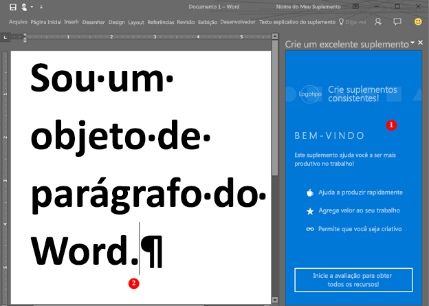

# <a name="word-add-ins-overview"></a>Visão geral dos suplementos do Word

Você deseja criar uma solução que estenda a funcionalidade do Word - por exemplo, uma solução que envolva conjuntos de documentos automatizados ou que vincule essas associações aos dados e os acesse em um documento do Word a partir de outras fontes de dados? Você pode usar a plataforma de suplementos do Office, que inclui a API JavaScript do Word e a API JavaScript para Office, para estender os clientes do Word que executam em uma área de trabalho do Windows, em um Mac ou na nuvem.

Os suplementos do Word são uma das várias opções de desenvolvimento disponíveis na [plataforma de suplementos do Office](../overview/office-add-ins.md). Você pode usar comandos de suplemento para estender a interface do usuário do Word e iniciar os painéis de tarefas que executam JavaScript que interage com o conteúdo em um documento do Word. Qualquer código que você pode executar em um navegador, pode ser executado em um suplemento do Word. Suplementos que interagem com conteúdo em um documento do Word criam solicitações para agir em objetos do Word e sincronizar o estado do objeto. 

>
  **Observação:** Caso pretenda [publicar](../publish/publish.md) o suplemento na Office Store depois de criá-lo, verifique se você está em conformidade com as [Políticas de validação da Office Store](https://msdn.microsoft.com/en-us/library/jj220035.aspx). Por exemplo, para passar na validação, seu suplemento deve funcionar em todas as plataformas com suporte aos métodos que você definir (para mais informações, confira a [seção 4.12](https://msdn.microsoft.com/en-us/library/jj220035.aspx#Anchor_3) e a [Página de hospedagem e disponibilidade do suplemento do Office](https://dev.office.com/add-in-availability)).

A figura a seguir mostra um exemplo de um suplemento do Word que é executado em um painel de tarefas.

**Figura 1. Suplemento em execução em um painel de tarefas no Word**



O suplemento do Word (1) pode enviar solicitações para o documento do Word (2) e usar o JavaScript para acessar o objeto parágrafo e atualizar, excluir ou mover o parágrafo. Por exemplo, o código a seguir mostra como acrescentar uma nova sentença a esse parágrafo.

```js
Word.run(function (context) {
    var paragraphs = context.document.getSelection().paragraphs;
    paragraphs.load();
    return context.sync().then(function () {
        paragraphs.items[0].insertText(' New sentence in the paragraph.',
                                       Word.InsertLocation.end);
    }).then(context.sync);
});

```

Você pode usar qualquer tecnologia de servidor Web para hospedar o suplemento do Word, como ASP.NET, NodeJS ou Python. Use a estrutura de cliente de sua preferência – Ember, Backbone, Angular, React – ou use o VanillaJS para desenvolver a solução e você poderá usar serviços como o Azure para [autenticar](../develop/use-the-oauth-authorization-framework-in-an-office-add-in.md) e hospedar seu aplicativo.

As APIs JavaScript do Word proporcionam ao seu aplicativo o acesso aos objetos e metadados encontrado em um documento do Word. Você pode usar essas APIs para criar suplementos que têm como objetivo:

* Word 2013 para Windows
* Word 2016 para Windows
* Word Online
* Word 2016 para Mac
* Word para iOS

Redija seu suplemento uma vez e ele será executado em todas as versões do Word em várias plataformas. Para obter detalhes, consulte [Disponibilidade de Suplementos do Office em hosts e plataformas](https://dev.office.com/add-in-availability).

## <a name="javascript-apis-for-word"></a>APIs JavaScript para Word

Você pode usar dois conjuntos de APIs JavaScript para interagir com metadados e objetos em um documento do Word. O primeiro é o [API JavaScript para Office](https://dev.office.com/reference/add-ins/javascript-api-for-office?product=word), que foi introduzido no Office 2013. Esta é uma API compartilhada – muitos dos objetos podem ser usados em suplementos hospedados por dois ou mais clientes do Office. Essa API usa retornos de chamadas de maneira ampla. 

O segundo é a [API JavaScript do Word](../../reference/word/word-add-ins-reference-overview.md). Este é um modelo de objeto fortemente tipado que você pode usar para criar suplementos do Word que se destinam ao Word 2016 para Mac e Windows. Este modelo de objeto usa promessas e fornece acesso a objetos específicos do Word como [corpo](../../reference/word/body.md), [controles de conteúdo](../../reference/word/contentcontrol.md), [imagens embutidas](../../reference/word/inlinepicture.md) e [parágrafos](../../reference/word/paragraph.md). A API JavaScript do Word inclui definições do TypeScript e arquivos vsdoc para que você possa obter dicas de código em seu IDE.

Atualmente, todos os clientes do Word oferecem suporte à API JavaScript para Office compartilhada, e a maioria dos clientes oferece suporte à API JavaScript do Word. Para obter detalhes sobre clientes com suporte, consulte a [documentação de referência da API](https://dev.office.com/reference/add-ins/javascript-api-for-office?product=word).

Recomendamos que você comece com a API JavaScript do Word porque o modelo de objeto é mais fácil de usar. Use a API JavaScript do Word se precisar:

* Acessar os objetos em um documento do Word.

Use a API JavaScript para Office compartilhada quando precisar:

* Direcionar o Word 2013.
* Executar ações iniciais do aplicativo.
* Verificar o conjunto requisitos com suporte.
* Acessar metadados, configurações e informações do ambiente para o documento.
* Vincular a seções em um documento e capturar eventos.
* Usar partes XML personalizadas.
* Abrir uma caixa de diálogo.

## <a name="next-steps"></a>Próximas etapas

Pronto para criar seu primeiro suplemento do Word? Consulte [Compilar seu primeiro suplemento do Word](word-add-ins.md). Você também pode tentar nossa [Experiência de introdução](http://dev.office.com/getting-started/addins?product=Word) interativa. Use um [manifesto do suplemento](../overview/add-in-manifests.md) para descrever onde seu suplemento está hospedado e como ele é exibido, além de definir permissões e outras informações.

Para saber mais sobre como projetar um suplemento do Word de classe internacional que cria uma ótima experiência para seus usuários, consulte [Diretrizes de design](../design/add-in-design.md) e [Práticas recomendadas](../design/add-in-development-best-practices.md).

Depois de desenvolver seu suplemento, você poderá [publicá-lo](../publish/publish.md) para fins de compartilhamento de rede, um catálogo de aplicativos ou para a Office Store.

## <a name="whats-coming-up-for-word-add-ins"></a>O que está surgindo para os suplementos do Word?

À medida que criamos e desenvolvemos novas APIs para suplementos do Word, disponibilizamo-as em nossa página [Especificações abertas da API](../../reference/openspec.md) a fim de obter os seus comentários. Descubra que novos recursos estão no pipeline para as APIs JavaScript do Word e forneça comentários sobre nossas especificações de design.

Você também pode ver quais são as novidades na API JavaScript do Word na página [log de alterações](http://dev.office.com/changelog).

## <a name="additional-resources"></a>Recursos adicionais

* [Visão geral da plataforma Suplementos do Office](../overview/office-add-ins.md)
* [Referências da API JavaScript do Word](../../reference/word/word-add-ins-reference-overview.md)

