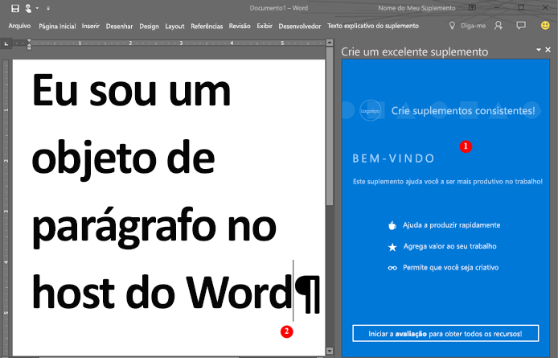

# <a name="word-add-ins-overview"></a><span data-ttu-id="20baf-102">Visão geral dos suplementos do Word</span><span class="sxs-lookup"><span data-stu-id="20baf-102">Word add-ins overview</span></span>

<span data-ttu-id="20baf-p101">Você deseja criar uma solução que estenda a funcionalidade do Word? Por exemplo, uma solução que envolva conjuntos de documentos automatizados? Ou uma solução que vincule essas associações aos dados e os acesse em um documento do Word a partir de outras fontes de dados? É possível usar a plataforma de suplementos do Office, que inclui a API JavaScript do Word e a API JavaScript para Office, para estender os clientes do Word que executam em uma área de trabalho do Windows, em um Mac ou na nuvem.</span><span class="sxs-lookup"><span data-stu-id="20baf-p101">Do you want to create a solution that extends the functionality of Word? For example, one that involves automated document assembly? Or a solution that binds to and accesses data in a Word document from other data sources? You can use the Office Add-ins platform, which includes the Word JavaScript API and the JavaScript API for Office, to extend Word clients running on a Windows desktop, on a Mac, or in the cloud.</span></span>

<span data-ttu-id="20baf-p102">Os suplementos do Word são uma das várias opções de desenvolvimento disponíveis na [plataforma de suplementos do Office](../overview/office-add-ins.md). Você pode usar comandos de suplemento para estender a interface do usuário do Word e iniciar os painéis de tarefas que executam JavaScript que interage com o conteúdo em um documento do Word. Qualquer código que você pode executar em um navegador, pode ser executado em um suplemento do Word. Suplementos que interagem com conteúdo em um documento do Word criam solicitações para agir em objetos do Word e sincronizar o estado do objeto.</span><span class="sxs-lookup"><span data-stu-id="20baf-p102">Word add-ins are one of the many development options that you have on the [Office Add-ins platform](../overview/office-add-ins.md). You can use add-in commands to extend the Word UI and launch task panes that run JavaScript that interacts with the content in a Word document. Any code that you can run in a browser can run in a Word add-in. Add-ins that interact with content in a Word document create requests to act on Word objects and synchronize object state.</span></span> 

> [!NOTE]
> <span data-ttu-id="20baf-p103">Caso pretenda [publicar](../publish/publish.md) o suplemento no AppSource depois de criá-lo, verifique se você está em conformidade com as [Políticas de validação do AppSource](https://docs.microsoft.com/office/dev/store/validation-policies). Por exemplo, para passar na validação, seu suplemento deve funcionar em todas as plataformas com suporte aos métodos que você definir (para mais informações, confira a [seção 4.12](https://docs.microsoft.com/office/dev/store/validation-policies#4-apps-and-add-ins-behave-predictably) e a [Página de hospedagem e disponibilidade do suplemento do Office](../overview/office-add-in-availability.md)).</span><span class="sxs-lookup"><span data-stu-id="20baf-p103">When you build your add-in, if you plan to [publish](../publish/publish.md) your add-in to AppSource, make sure that you conform to the [AppSource validation policies](https://docs.microsoft.com/office/dev/store/validation-policies). For example, to pass validation, your add-in must work across all platforms that support the methods that you define (for more information, see [section 4.12](https://docs.microsoft.com/office/dev/store/validation-policies#4-apps-and-add-ins-behave-predictably) and the [Office Add-in host and availability page](../overview/office-add-in-availability.md)).</span></span>

<span data-ttu-id="20baf-113">A figura a seguir mostra um exemplo de um suplemento do Word que é executado em um painel de tarefas.</span><span class="sxs-lookup"><span data-stu-id="20baf-113">The following figure shows an example of a Word add-in that runs in a task pane.</span></span>

<span data-ttu-id="20baf-114">*Figura 1. Suplemento em execução em um painel de tarefas no Word*</span><span class="sxs-lookup"><span data-stu-id="20baf-114">*Figure 1. Add-in running in a task pane in Word*</span></span>



<span data-ttu-id="20baf-p104">O suplemento do Word (1) pode enviar solicitações para o documento do Word (2) e usar o JavaScript para acessar o objeto parágrafo e atualizar, excluir ou mover o parágrafo. Por exemplo, o código a seguir mostra como acrescentar uma nova sentença a esse parágrafo.</span><span class="sxs-lookup"><span data-stu-id="20baf-p104">The Word add-in (1) can send requests to the Word document (2) and can use JavaScript to access the paragraph object and update, delete, or move the paragraph. For example, the following code shows how to append a new sentence to that paragraph.</span></span>

```js
Word.run(function (context) {
    var paragraphs = context.document.getSelection().paragraphs;
    paragraphs.load();
    return context.sync().then(function () {
        paragraphs.items[0].insertText(' New sentence in the paragraph.',
                                       Word.InsertLocation.end);
    }).then(context.sync);
});

```

<span data-ttu-id="20baf-p105">É possível usar qualquer tecnologia de servidor Web para hospedar o suplemento do Word, como ASP.NET, NodeJS ou Python. Use a estrutura de cliente de sua preferência (Ember, Backbone, Angular, React) ou use o VanillaJS para desenvolver a solução. É possível usar serviços como o Azure para [autenticar](../develop/use-the-oauth-authorization-framework-in-an-office-add-in.md) e hospedar seu aplicativo.</span><span class="sxs-lookup"><span data-stu-id="20baf-p105">You can use any web server technology to host your Word add-in, such as ASP.NET, NodeJS, or Python. Use your favorite client-side framework -- Ember, Backbone, Angular, React -- or stick with VanillaJS to develop your solution, and you can use services like Azure to [authenticate](../develop/use-the-oauth-authorization-framework-in-an-office-add-in.md) and host your application.</span></span>

<span data-ttu-id="20baf-p106">As APIs JavaScript do Word proporcionam ao seu aplicativo o acesso aos objetos e metadados encontrado em um documento do Word. Você pode usar essas APIs para criar suplementos que têm como objetivo:</span><span class="sxs-lookup"><span data-stu-id="20baf-p106">The Word JavaScript APIs give your application access to the objects and metadata found in a Word document. You can use these APIs to create add-ins that target:</span></span>

* <span data-ttu-id="20baf-122">Word 2013 ou posterior para Windows</span><span class="sxs-lookup"><span data-stu-id="20baf-122">Word 2013 or later for Windows</span></span>
* <span data-ttu-id="20baf-123">Word Online</span><span class="sxs-lookup"><span data-stu-id="20baf-123">Word Online</span></span>
* <span data-ttu-id="20baf-124">Word 2016 ou posterior para Mac</span><span class="sxs-lookup"><span data-stu-id="20baf-124">Word 2016 or later for Mac</span></span>
* <span data-ttu-id="20baf-125">Word para iOS</span><span class="sxs-lookup"><span data-stu-id="20baf-125">Word for iOS</span></span>

<span data-ttu-id="20baf-p107">Redija seu suplemento uma vez e ele será executado em todas as versões do Word em várias plataformas. Para obter detalhes, consulte [Disponibilidade de Suplementos do Office em hosts e plataformas](../overview/office-add-in-availability.md).</span><span class="sxs-lookup"><span data-stu-id="20baf-p107">Write your add-in once, and it will run in all versions of Word across multiple platforms. For details, see [Office Add-in host and platform availability](../overview/office-add-in-availability.md).</span></span>

## <a name="javascript-apis-for-word"></a><span data-ttu-id="20baf-128">APIs JavaScript para Word</span><span class="sxs-lookup"><span data-stu-id="20baf-128">JavaScript APIs for Word</span></span>

<span data-ttu-id="20baf-p108">Você pode usar dois conjuntos de APIs JavaScript para interagir com metadados e objetos em um documento do Word. O primeiro é o [API JavaScript para Office](https://docs.microsoft.com/javascript/office/javascript-api-for-office?view=office-js?product=word), que foi introduzido no Office 2013. Esta é uma API compartilhada – muitos dos objetos podem ser usados em suplementos hospedados por dois ou mais clientes do Office. Essa API usa retornos de chamadas de maneira ampla.</span><span class="sxs-lookup"><span data-stu-id="20baf-p108">You can use two sets of JavaScript APIs to interact with the objects and metadata in a Word document. The first is the [JavaScript API for Office](https://docs.microsoft.com/javascript/office/javascript-api-for-office?view=office-js?product=word), which was introduced in Office 2013. This is a shared API -- many of the objects can be used in add-ins hosted by two or more Office clients. This API uses callbacks extensively.</span></span>

<span data-ttu-id="20baf-p109">O segundo é a [API JavaScript do Word](https://docs.microsoft.com/javascript/office/overview/word-add-ins-reference-overview?view=office-js). Este é um modelo de objeto fortemente tipado que você pode usar para criar suplementos do Word que se destinam ao Word 2016 para Mac e Windows. Este modelo de objeto usa promessas e fornece acesso a objetos específicos do Word como [corpo](https://docs.microsoft.com/javascript/api/word/word.body?view=office-js), [controles de conteúdo](https://docs.microsoft.com/javascript/api/word/word.contentcontrol?view=office-js), [imagens embutidas](https://docs.microsoft.com/javascript/api/word/word.inlinepicture?view=office-js) e [parágrafos](https://docs.microsoft.com/javascript/api/word/word.paragraph?view=office-js). A API JavaScript do Word inclui definições do TypeScript e arquivos vsdoc para que você possa obter dicas de código em seu IDE.</span><span class="sxs-lookup"><span data-stu-id="20baf-p109">The second is the [Word JavaScript API](https://docs.microsoft.com/javascript/office/overview/word-add-ins-reference-overview?view=office-js). This is a strongly-typed object model that you can use to create Word add-ins that target Word 2016 for Mac and Windows. This object model uses promises, and provides access to Word-specific objects like [body](https://docs.microsoft.com/javascript/api/word/word.body?view=office-js), [content controls](https://docs.microsoft.com/javascript/api/word/word.contentcontrol?view=office-js), [inline pictures](https://docs.microsoft.com/javascript/api/word/word.inlinepicture?view=office-js), and [paragraphs](https://docs.microsoft.com/javascript/api/word/word.paragraph?view=office-js). The Word JavaScript API includes TypeScript definitions and vsdoc files so that you can get code hints in your IDE.</span></span>

<span data-ttu-id="20baf-p110">Atualmente, todos os clientes do Word oferecem suporte à API JavaScript para Office compartilhada, e a maioria dos clientes oferece suporte à API JavaScript do Word. Para obter detalhes sobre clientes com suporte, consulte a [documentação de referência da API](https://docs.microsoft.com/javascript/office/javascript-api-for-office?view=office-js?product=word).</span><span class="sxs-lookup"><span data-stu-id="20baf-p110">Currently, all Word clients support the shared JavaScript API for Office, and most clients support the Word JavaScript API. For details about supported clients, see the [API reference documentation](https://docs.microsoft.com/javascript/office/javascript-api-for-office?view=office-js?product=word).</span></span>

<span data-ttu-id="20baf-p111">Recomendamos que você comece com a API JavaScript do Word porque o modelo de objeto é mais fácil de usar. Use a API JavaScript do Word se precisar:</span><span class="sxs-lookup"><span data-stu-id="20baf-p111">We recommend that you start with the Word JavaScript API because the object model is easier to use. Use the Word JavaScript API if you need to:</span></span>

* <span data-ttu-id="20baf-141">Acessar os objetos em um documento do Word.</span><span class="sxs-lookup"><span data-stu-id="20baf-141">Access the objects in a Word document.</span></span>

<span data-ttu-id="20baf-142">Use a API JavaScript para Office compartilhada quando precisar:</span><span class="sxs-lookup"><span data-stu-id="20baf-142">Use the shared JavaScript API for Office when you need to:</span></span>

* <span data-ttu-id="20baf-143">Direcionar o Word 2013.</span><span class="sxs-lookup"><span data-stu-id="20baf-143">Target Word 2013.</span></span>
* <span data-ttu-id="20baf-144">Executar ações iniciais do aplicativo.</span><span class="sxs-lookup"><span data-stu-id="20baf-144">Perform initial actions for the application.</span></span>
* <span data-ttu-id="20baf-145">Verificar o conjunto requisitos com suporte.</span><span class="sxs-lookup"><span data-stu-id="20baf-145">Check the supported requirement set.</span></span>
* <span data-ttu-id="20baf-146">Acessar metadados, configurações e informações do ambiente para o documento.</span><span class="sxs-lookup"><span data-stu-id="20baf-146">Access metadata, settings, and environmental information for the document.</span></span>
* <span data-ttu-id="20baf-147">Vincular a seções em um documento e capturar eventos.</span><span class="sxs-lookup"><span data-stu-id="20baf-147">Bind to sections in a document and capture events.</span></span>
* <span data-ttu-id="20baf-148">Usar partes XML personalizadas.</span><span class="sxs-lookup"><span data-stu-id="20baf-148">Use custom XML parts.</span></span>
* <span data-ttu-id="20baf-149">Abrir uma caixa de diálogo.</span><span class="sxs-lookup"><span data-stu-id="20baf-149">Open a dialog box.</span></span>

## <a name="next-steps"></a><span data-ttu-id="20baf-150">Próximas etapas</span><span class="sxs-lookup"><span data-stu-id="20baf-150">Next steps</span></span>

<span data-ttu-id="20baf-p112">Pronto para criar seu primeiro suplemento do Word? Confira [Compilar seu primeiro suplemento do Word](word-add-ins.md). Também é possível tentar nossa [Experiência de introdução](https://docs.microsoft.com/office/dev/add-ins/?product=Word) interativa. Use um [manifesto do suplemento](../develop/add-in-manifests.md) para descrever onde seu suplemento está hospedado e como ele é exibido, além de definir permissões e outras informações.</span><span class="sxs-lookup"><span data-stu-id="20baf-p112">Ready to create your first Word add-in? See [Build your first Word add-in](word-add-ins.md). You can also try our interactive [Get started experience](https://docs.microsoft.com/office/dev/add-ins/?product=Word). Use the [add-in manifest](../develop/add-in-manifests.md) to describe where your add-in is hosted, how it is displayed, and define permissions and other information.</span></span>

<span data-ttu-id="20baf-155">Para saber mais sobre como projetar um suplemento do Word de classe internacional que cria uma ótima experiência para seus usuários, consulte [Diretrizes de design](../design/add-in-design.md) e [Práticas recomendadas](../concepts/add-in-development-best-practices.md).</span><span class="sxs-lookup"><span data-stu-id="20baf-155">To learn more about how to design a world class Word add-in that creates a compelling experience for your users, see [Design guidelines](../design/add-in-design.md) and [Best practices](../concepts/add-in-development-best-practices.md).</span></span>

<span data-ttu-id="20baf-156">Depois de desenvolver seu suplemento, é possível [publicá-lo](../publish/publish.md) em um compartilhamento de rede, um catálogo de aplicativos ou no AppSource.</span><span class="sxs-lookup"><span data-stu-id="20baf-156">After you develop your add-in, you can [publish](../publish/publish.md) it to a network share, an app catalog, or AppSource.</span></span>

## <a name="whats-coming-up-for-word-add-ins"></a><span data-ttu-id="20baf-157">O que está surgindo para os suplementos do Word?</span><span class="sxs-lookup"><span data-stu-id="20baf-157">What's coming up for Word add-ins?</span></span>

<span data-ttu-id="20baf-p113">À medida que criamos e desenvolvemos novas APIs para suplementos do Word, elas ficam disponíveis na nossa página [Especificações abertas da API](https://docs.microsoft.com/javascript/office/openspec?view=office-js) para você deixar seus comentários. Descubra que novos recursos estão no pipeline para as APIs JavaScript do Word e forneça comentários sobre nossas especificações de design.</span><span class="sxs-lookup"><span data-stu-id="20baf-p113">As we design and develop new APIs for Word add-ins, we'll make them available for your feedback on our [API open specifications](https://docs.microsoft.com/javascript/office/openspec?view=office-js) page. Find out what new features are in the pipeline for the Word JavaScript APIs, and provide your input on our design specifications.</span></span>

## <a name="see-also"></a><span data-ttu-id="20baf-160">Veja também</span><span class="sxs-lookup"><span data-stu-id="20baf-160">See also</span></span>

* [<span data-ttu-id="20baf-161">Visão geral da plataforma Suplementos do Office</span><span class="sxs-lookup"><span data-stu-id="20baf-161">Office Add-ins platform overview</span></span>](../overview/office-add-ins.md)
* [<span data-ttu-id="20baf-162">Referências da API JavaScript do Word</span><span class="sxs-lookup"><span data-stu-id="20baf-162">Word JavaScript API reference</span></span>](https://docs.microsoft.com/javascript/office/overview/word-add-ins-reference-overview?view=office-js)

